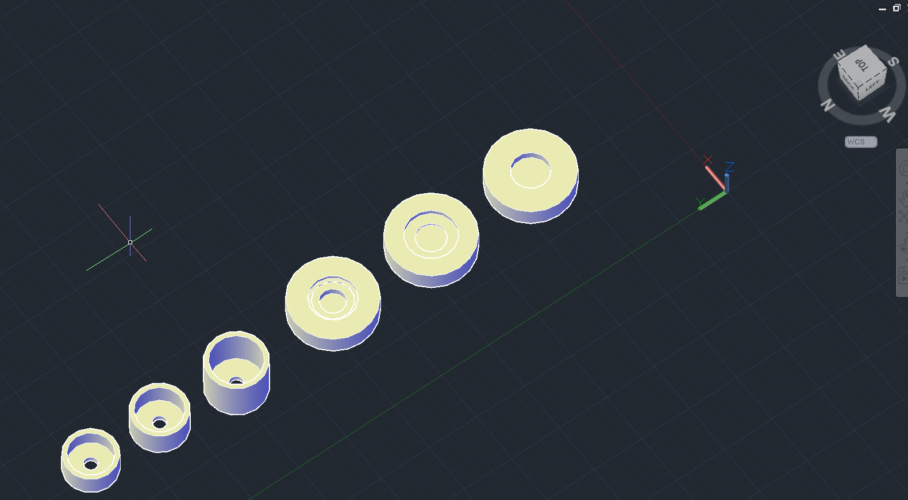
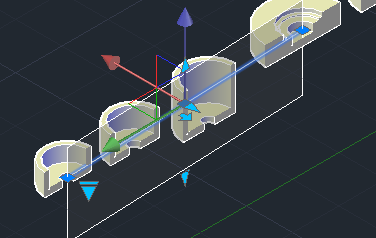
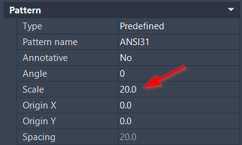
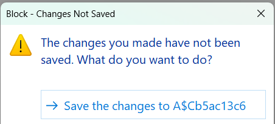
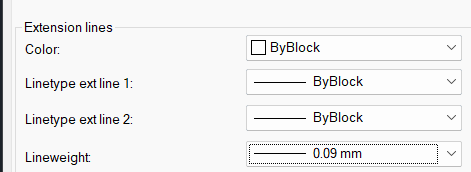

[https://www.youtube.com/watch?v=vpVVmNrr_Zw](https://www.youtube.com/watch?v=vpVVmNrr_Zw)

- [Mit szeretnénk elérni](#mit-szeretnénk-elérni)
- [Flatshot létrehozása](#flatshot-létrehozása)
- [Metszet létrehozása](#metszet-létrehozása)
- [Dekorálás](#dekorálás)
  - [Sraffozás felrakása](#sraffozás-felrakása)
  - [Metszet jelölése](#metszet-jelölése)
  - [Vonal vastagságok beállítása](#vonal-vastagságok-beállítása)
- [Dimensions](#dimensions)
  - [Új réteg készítése](#új-réteg-készítése)
  - [Dimension vonalak elhelyezése](#dimension-vonalak-elhelyezése)
    - [Új stílus létrehozása](#új-stílus-létrehozása)
    - [Betű és nyil méret](#betű-és-nyil-méret)
    - [Vonalak és betűk súlya (vastagsága):](#vonalak-és-betűk-súlya-vastagsága)
  - [Feliratok iránya](#feliratok-iránya)
- [Pdf nyomtatás](#pdf-nyomtatás)

# Mit szeretnénk elérni
Három 3D-s modelleknek szeretnénk elkészíteni a 2D-s nézeteket tartalmazó dwg fájlját ahova a méreteket fel tudjuk jelölni. Ehhez szükségünk van a különböző oldal és felül nézetek 2D-s drótvázas megjelenitcsére és metszetekre. 

# Flatshot létrehozása
A **Flatshot**-al a 2D-s nézetekben készíthetük el a modell 2D-s lenyomatát, amit egy külön 2D-s dwg fájban ment el az AutoCAD. 

Menjünk felülnézetbe és jelöljük ki az összes tárgyat, majd írjuk be: **FLATSHOT**

A felugró ablakban meg kell adni a 2D fájl helyét: 

Az elmentett 2D rajzot nyissuk meg egy új fülön: 

Forgassuk 

# Metszet létrehozása

Tegyük 3D nézetbe a képet, úgy sokkal egyszerűbb kijelölin a metszeti síkot. 

Írjuk be: **SECTIONPLANE**

 
Majd jelöljük ki ügyesen a síkot. Nem számít hogy hosszába meddig tart vagy felfelév agy efelé, ez az egész vágó síkot jelöli ki. 

 
Kattintsunk rá a metszeti síkja, hogy kijelöléjük:

 
A felső menüben válasszuk a Section Plane tabot, majd kattintsunk a **Generate Section Block** menüpontra. 

 
Jelöljük be a 2D opciót, majd Create: 

Ezzel létrehoztuk a 2D-s lenyomatát a metszetnek, amit most el kell helyezzünk ideiglenesen a 3D modellben. 

Első lépésként egy kattintással ki kell jelöljük, hogy hova szeretnénk tenni. Kattintsunk bárhova a 3D modellben: 

Második és harmadik lépésként meg kell adni a scale faktort, ezt hagyjuk 1-esen: 

Majd harmadik lépésben az orientációt, ezt hagyjuk 0-án: 

Ekkor a 2D metszet lenyomata megjelenik a modellben: 

> **NOTE:** Ami itt létrejött az egy 2D block, ami azt jelenti, hogy az összes vonal egy objektumként viselkedik. 

 
Töröljük ki a metszeti síkot. 

Másoljuk át a metszeti lenyomatot a korábban létrehozott 2D fájlba: 

# Dekorálás

## Sraffozás felrakása

Kattintsunk duplán a 2D blokkra. Ekkor megnyílik az **Edit Blok Definition** ablak. 

Ha több blokk is van a modellben, akkor itt választhatjuk ki, hogy melyiket szeretnénk szerkeszteni. Kattintsunk az OK-ra. 

Ekkor a felölet blokk szerkesztő üzemmódba fog kapcsolni, és meg fog jelenni a blokk szerkesztő tab: 

Itt a blokk már nem egy objektumként fog viselkedni, miden elemet külön-külön ki lehet választani. Sorba jelöljük ki az összes elemet úgy, hogy mindenhol minden sraffozandó terület ki legyen jelölve, ne csak egyes vonalak. 

Majd válasszuk ki a felső menüben a megfelelő sraffozást: 

Állítsuk be a sraffozás nagyítását, hogy 

## Metszet jelölése

## Vonal vastagságok beállítása

# Dimensions

## Új réteg készítése

TODO...

## Dimension vonalak elhelyezése

### Új stílus létrehozása

Legyen nyitva a 2D dwg fájl. Nyissuk meg az Annotate fület, és nyissuk le a **Manage Dimension Styles...** beállításokat: 

 
Hozzunk létre egy új stílust a **New..** gombbal. 

### Betű és nyil méret
Át kell állítani a nyíl és a szöveg méretét, valamint hogy hány tizede jegyet jelenítsünk meg. 

Zárjuk be a **Dimension Style Manager**-t. 

### Vonalak és betűk súlya (vastagsága): 

TODO: 

## Feliratok iránya

# Pdf nyomtatás