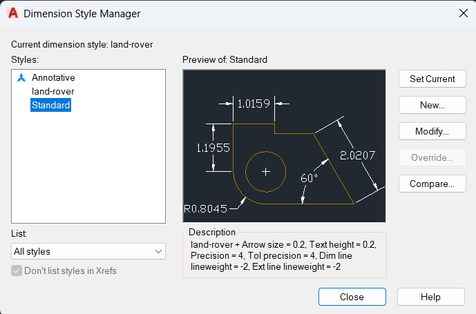

[https://www.youtube.com/watch?v=vpVVmNrr_Zw](https://www.youtube.com/watch?v=vpVVmNrr_Zw)

- [Mit szeretnénk elérni](#mit-szeretnénk-elérni)
- [Projekt beállítások](#projekt-beállítások)
- [Flatshot létrehozása](#flatshot-létrehozása)
- [Metszet létrehozása](#metszet-létrehozása)
- [Dekorálás](#dekorálás)
  - [Sraffozás felrakása](#sraffozás-felrakása)
  - [Metszet jelölése](#metszet-jelölése)
  - [Vonal vastagságok beállítása](#vonal-vastagságok-beállítása)
- [Dimensions](#dimensions)
  - [Új réteg készítése](#új-réteg-készítése)
  - [Dimension vonalak elhelyezése](#dimension-vonalak-elhelyezése)
    - [Új stílus létrehozása](#új-stílus-létrehozása)
    - [Betű és nyil méret](#betű-és-nyil-méret)
    - [Vonalak súlya (vastagsága):](#vonalak-súlya-vastagsága)
    - [Betűk súlya és stílusa](#betűk-súlya-és-stílusa)
  - [Feliratok iránya](#feliratok-iránya)
- [Pdf nyomtatás](#pdf-nyomtatás)
  - [2D rajz export](#2d-rajz-export)
    - [Papir méret beállítása](#papir-méret-beállítása)
    - [Lépték beállítása](#lépték-beállítása)
    - [Lépték címke elhelyezése](#lépték-címke-elhelyezése)
    - [Szaggatot vonalak léptéke](#szaggatot-vonalak-léptéke)
    - [Export](#export)
  - [3D rajz export](#3d-rajz-export)

# Mit szeretnénk elérni
Három 3D-s modelleknek szeretnénk elkészíteni a 2D-s nézeteket tartalmazó dwg fájlját ahova a méreteket fel tudjuk jelölni. Ehhez szükségünk van a különböző oldal és felül nézetek 2D-s drótvázas megjelenitcsére és metszetekre. 

# Projekt beállítások

# Flatshot létrehozása
A **Flatshot**-al a 2D-s nézetekben készíthetük el a modell 2D-s lenyomatát, amit egy külön 2D-s dwg fájban ment el az AutoCAD. 

Menjünk felülnézetbe és jelöljük ki az összes tárgyat, majd írjuk be: **FLATSHOT**

A felugró ablakban meg kell adni a 2D fájl helyét: 

Az elmentett 2D rajzot nyissuk meg egy új fülön: 

Forgassuk el vizszintesre az ábrát. Jelöljük ki a teljes rajzot, majd: **ROTATE**

---------------------------------------------

# Metszet létrehozása

Tegyük 3D nézetbe a képet, úgy sokkal egyszerűbb kijelölin a metszeti síkot. 

Írjuk be: **SECTIONPLANE**

 
Majd jelöljük ki ügyesen a síkot. Nem számít hogy hosszába meddig tart vagy felfelév agy efelé, ez az egész vágó síkot jelöli ki. 

 
Kattintsunk rá a metszeti síkja, hogy kijelöléjük:

 

A felső menüben válasszuk a Section Plane tabot, majd kattintsunk a **Generate Section Block** menüpontra. 

 
Jelöljük be a 2D opciót, majd Create: 

Ezzel létrehoztuk a 2D-s lenyomatát a metszetnek, amit most el kell helyezzünk ideiglenesen a 3D modellben. 

Első lépésként egy kattintással ki kell jelöljük, hogy hova szeretnénk tenni. Kattintsunk bárhova a 3D modellben: 

Második és harmadik lépésként meg kell adni a scale faktort, ezt hagyjuk 1-esen: 

Majd harmadik lépésben az orientációt, ezt hagyjuk 0-án: 

Ekkor a 2D metszet lenyomata megjelenik a modellben: 

> **NOTE:** Ami itt létrejött az egy 2D block, ami azt jelenti, hogy az összes vonal egy objektumként viselkedik. 

 
Töröljük ki a metszeti síkot. 

Másoljuk át a metszeti lenyomatot a korábban létrehozott 2D fájlba: 

Majd a 3D fájlból töröljük ki a metszet lenyomatát is. Majd segédvonalak segítségével rendezzük pontosan a felül nézet alá a metszetet. 

--------------------------------------------------

# Dekorálás

## Sraffozás felrakása

Kattintsunk duplán a 2D blokkra. Ekkor megnyílik az **Edit Blok Definition** ablak. 

Ha több blokk is van a modellben, akkor itt választhatjuk ki, hogy melyiket szeretnénk szerkeszteni. Kattintsunk az OK-ra. 

Ekkor a felölet blokk szerkesztő üzemmódba fog kapcsolni, és meg fog jelenni a blokk szerkesztő tab: 

Itt a blokk már nem egy objektumként fog viselkedni, miden elemet külön-külön ki lehet választani. Sorba jelöljük ki az összes elemet úgy, hogy mindenhol minden sraffozandó terület ki legyen jelölve, ne csak egyes vonalak. 

Majd válasszuk ki a felső menüben a megfelelő sraffozást: 

Állítsuk be a sraffozás nagyítását, hogy 

## Metszet jelölése

A metszet a két végén egy-egy nyillal kell jelölni, amit szaggatot vonalnak kell összekötnie. 

Állítólag ezt manuálisan kell elkészíteni. Ehhez huzzunk viztintas vonalat. A vonal típusát elsősorban a layer határozza meg. Hozzunk létre egy új layert (a példában center line):

Kattintsunk a **Linetype** cellára. Ekkor mengnyílik a **Select leny type** ablak: 

Itt **Load...** gombbal tudunk új stílusokat betölteni, majd kiválasztani. 

A nyilakat és fölé a betűjelölést manuálisan kell elkészítsük. 

## Vonal vastagságok beállítása

A vonalvastagság csak a (pdf-be) nyomtatott dokumentumon fog látszani, mint a többi CAD programban. 

# Dimensions

## Új réteg készítése

TODO...

## Dimension vonalak elhelyezése

### Új stílus létrehozása

Legyen nyitva a 2D dwg fájl. Nyissuk meg az Annotate fület, és nyissuk le a **Manage Dimension Styles...** beállításokat: 

 
Hozzunk létre egy új stílust a **New..** gombbal. 

### Betű és nyil méret
Át kell állítani a nyíl és a szöveg méretét, valamint hogy hány tizede jegyet jelenítsünk meg. 

### Vonalak súlya (vastagsága): 

### Betűk súlya és stílusa

A betűk stílusa (vastagság, forma) a **Dimension Style Manager** Text fülén a **Text style** legördülő listából választhajtuk ki. 

Ha mellette a ...-ra kattintunk, akkor megnyílik a **Text Style** editor. 

A betű súlya a font fajtától és a font stílustól fog függeni. 

* Artifact Element Hair: nagyon végkony lesz
* Arial Narrow: Optimális betű méret

## Feliratok iránya

# Pdf nyomtatás

## 2D rajz export

>**NOTE:** A layout nézetben a vonalak mindig folytonos, egyenvastagságúnak látszanak attól függetlenül, hogy mik a tulajdonságaik. A szaggot vonal és a vastagság csak PDF export után fog látszani. 

A 2D modelt tartalmazó rajzon válasszuk a **Layout1**-et. 

### Papir méret beállítása

Írjuk be: **PAGESETUP**

Ezzel megnyílik a **Page Setup Manager**:

Válasszuk ki annak a layout-nak a nevét, amit módosítani akarunk, nálunk ez most a **Layout1**. 

Kattintsunk a **Modify..**-ra. 

Állítsuk a **Paper size** értékét ISO A3 fekvőre: 

### Lépték beállítása 

Menjünk át a Layout-on **MODEL** térbe. Majd bal alul válasszuk ki a megfelelő léptéke: 

Ha a lépték nem metrikus, akkor írjuk be a Layout nézetben: **SCALELISTEDIT**

Majd itt kattintsunk a **Reset**-re -> Metric scales

Ha nincs számunkra megfelelő lépték, akkor itt az **Add**-el adhatunk hozzá, vagy később ha a listában kiválasztjuk a **Custom...**-ot. 

### Lépték címke elhelyezése

Ahhoz hogy megjelenítsük a léptéket, létre fogunk hozni egy új mezőt, legyünk papír nézetben, majd írjuk be: **FIELD**

1. A megnyíló ablakban válasszuk az **object**-et a baloldali listából
2. A kis zöld nyilat nyomjuk meg és válasszuk ki az egész Layout dobozt. 
3. Válasszuk ki a **Custom scale** lehetőséget. 
4. Válasszuk a **1:#**-ot a jobboldali listából. 

Kattintsunk az **OK**-ra és helyezzük el a címkét a layout-on: 

### Szaggatot vonalak léptéke
Ha a layout-on és az exportált pdf-ben folyamatos vonalként jelenik meg a szaggatottvonal, akkor az azért van, mert a layout-on kiválasztott léptékben folyamatosnak látszik. Jelöljük ki az összes szaggatot vonalat és állítsuk át a **Linetype scale** értéket olyan kicsire, hogy megjelenjen a szaggatot vonal a layout-on: 

### Export

Menjünk az **Output** fülre, és kattintsunk az **Export** gombra. 

## 3D rajz export 