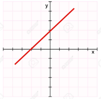
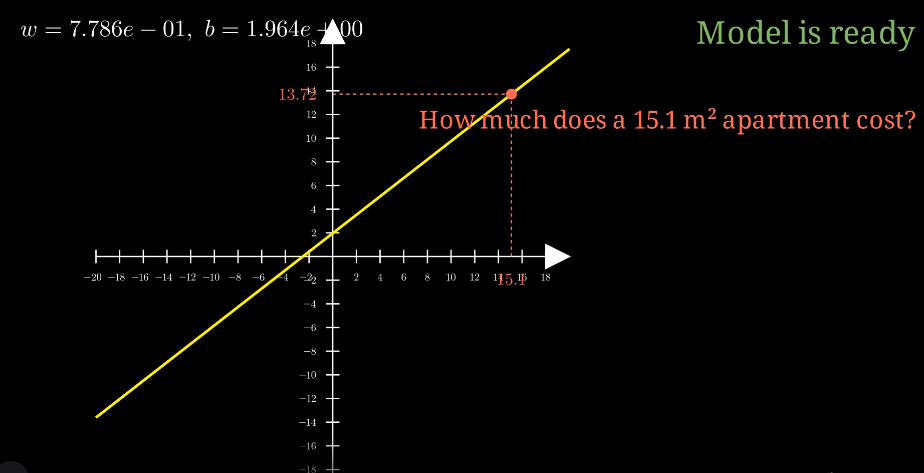

# Bevezet

TODO

# Mi az a gép tanulás

A gépi tanulás elnevezés egy kicsit félrevezető. A koncepció lényege nem az, hogy egy olyan gépet építünk, ami bármit meg tud tanulni, hanem hogy a modellünket, amit egy bizonyos probléma megoldására hoztunk létre tanító adatokkal állítottuk be ("tanítunk"), hogy el tudja végezni egy előre meghatározott feladatot. A modell ebben a kontextusban egy előre meghatározott matematikai függvény, amelynek vannak paraméterei (súlyai), és amelyet megpróbálunk úgy beállítani, hogy jól működjön egy adott feladaton. Tehát a modell összeállításakor valóban "tanítjuk" a modellt, máshogy mondva, a függvény paramétereit állítgatjuk. Miután betanítottuk a modellt, ezek a paraméterek többé nem változnak, innentől kezdve tudunk "kérdéseket" feltenni a modellnek, amire a modell a végső paraméter beállításoknak megfelelően "választ" fog adni. 

**Mi a probléma a "Machine Learning" kifejezéssel?**
- A gép nem „tanul”, csak optimalizál. Nem lesz tudatos, nem tud új fogalmakat alkotni, nem érti a világot.
- A „machine” szó félrevezető antropomorfizálás. Ez csak matematika számítógépen futtatva.
- A „learning” szó emberi tanulást sugall, holott: nincs megértés, nincs szándék, nincs belső reprezentáció „jelentésekről”
- A laikusok számára a „gépi tanulás” misztikusnak tűnik. A valóságban ez: statisztikai függvények optimalizálása nagy adatmennyiség fölött.

**A megfelelő név: Parametric function approximation optimization**
- magyar ajánlatok: 
  - *Optimalizálással előállított parametrikus függvény approximáció*
  - *Optimalizálással hangolt parametrikus függvényközelítés*
- „parametric” → w, b, W1, W2… (súlyok)
- „function” → f(x; θ): A bemenetre (kérdésre) végrehajtjuk a modellben lévő függvényt, ami előálltja a kimenetet (választ)
- „approximation” → sosem pontos, csak adat-alapú közelítés
- „optimization” → A paramétereket a modell "tanítása" során állítottuk be, vagyis optimalizáltuk a tesztadatok segítségével, hogy megfelelően végre tudja hajtani a feladatát. 

## Gépi tanulás alapképlete
A modellünket gépi tanulás esetén ez a képlet írja le: 

$$
f_{\theta}(x) \approx y
$$

Az 𝑓 jelöli a modell felépítését (típusát), vagyis azt, hogy a bemenetből hogyan számoljuk ki a kimenetet.

Típusok: 
- Lehet lineáris függvény: 
   
   $$ f_{\theta}(x) = w \cdot x + b$$

- Lehet neurális háló:

$$
f_{\theta}(x) = \sigma(W_2 \, \sigma(W_1 x + b_1) + b_2)
$$

Ahol: 
- $x$: A bementő paraméter
- $b$: A pedig a bias, vagyis az eltolás (mindjárt meglátjuk mire kell)

Mi választjuk ki, hogy milyen függvénycsaládot használsz — ez maga a modell architektúrája.

A **𝜃** a modell tanulható paraméterei. A **𝜃** minden tanulható súlyt és bias-t tartalmaz.

- Lineáris modellben:

$$
\theta = (w, b)
$$

- Neurális hálóban:

$$
\theta = \{ W_1, b_1, W_2, b_2, \dots \}
$$

A tanulási folyamat pontosan azt jelenti, hogy ezeket a paramétereket módosítjuk.

## De mire kell a **bias** (eltolás): 

A probléma: Az origó fogsága. 
Képzelj el egy egyszerű egyenest, amit a modellünk próbál megtanulni. Ha csak súlyokat (w - weight) használunk, az egyenlet így néz ki:

$$y=w⋅x$$

Ebben az esetben, ha a bemenet ($x$) nulla, akkor a kimenet ($y$) is mindig nulla lesz. Ez azt jelenti, hogy az egyenesednek mindenképpen át kell haladnia az origón. Ez hatalmas korlátozás, mert a valós világ adatai ritkán illeszkednek olyan egyenesre, ami a nullából indul.

**Gyakorlati példa**: Hőmérséklet átváltás Képzeld el, hogy a modellnek meg kell tanulnia átváltani a Celsius-t (x) Fahrenheit-be (y). A képlet:

$$y=1.8⋅x+32$$

- Itt a $w$ (súly) az 1.8.
- A $b$ (bias) pedig a 32.

Ha nem lenne $b$ (tehát $b=0$ lenne), a modell azt hinné, hogy 0°C = 0°F. De tudjuk, hogy ez nem igaz, mert 0°C = 32°F. A bias (32) az a korrekciós szám, ami "helyre teszi" az egyenest a nullapontnál.

## Hogyan kérdezünk a betanított modelltöl

A már betanított modellben ahol a paraméterek ($\theta$) már fixek, beadunk egy kérdést a modellnek: $f_θ​(x)$, ahol a kérdést az $x$ szimbolizálja, és a modell a megtanult paraméterek alapján kiszámolja a kimenetet. 

Ez azt jelenti:

- beadunk egy bemenetet: $x$
- a modell ($f$) lefut az aktuális paraméterekkel ($θ$),
- és előállít egy becslést:

$$
\hat{y} = f_{\theta}(x)
$$

A modell célja nem az, hogy tökéletes legyen, hanem hogy a becslés:

- a becsült érték közel van a valódi értékhez,
- és minél jobban közelít, annál jobb a tanulás.

> A Machine Learning lényege: paramétereket úgy állítunk be, hogy a modell "jó" közelítést adjon. A jó itt azt jelenti, hogy az adott felhasználási cél mellett elfogadható legyen a válasz pontossága. 

 

---
# A modell tanítása
### Mit nevezünk tanításnak

A $w$ és a $b$ paramétereket a model a tanítás során határozza meg. A tanulási fázisban ezek folyamatosan változnak. Mikor befejeztük a modell tanítását, a $w$ és $b$ már nem változik tovább, ezek a modell sajátjai. A modell válaszai attól függően lesznek pontosak vagy kevéssé pontosak, hogy mennyire jó függvényt használunk a modellben és hogy kapott e kellő számú tanítási példát, hogy jól beállítsa a $w$ és a $b$ értékeket. 

$$ \hat y = w \cdot x + b$$

Mielőtt elkezdenénk tanítani a modellt, a $w$ és $b$ paramétereknek választunk egy véletlen értéket: 

$$
w \sim \text{random}, \qquad b \sim \text{random}
$$

Vagy akár $0$-ra is állíthatjuk őket. 

Kicsit leegyszerűsítve, fogjuk az összes tanító adatot, majd sorba kiszámítjuk, hogy milyen értéket adna a rendszer az aktuális $w$ és $b$ értékek mellett, ezt jelöljük ($\hat{y}$). Majd megnézzük, hogy ez mennyiben tér el a várt végeredménytől ($y$), majd ennek függvényében kiszámítjuk, hogy mennyivel kell a $w$ és $b$ értékeket módosítani, és kezdjük előröl a különbség (hiba) kiszámítását az összes tanító adaton újra és újra, amíg nem kapunk egy elfogadható végeredményt.

### Epoch és Learning rate

A tanulási folyamat úgynevezett **epochákra** van bontva. Egy epochán belül az összes tesztadatra kiszámoljuk a hibát, majd ezeknek az átlaga alapján határozzuk meg, hogy a $w$ és $b$ paramétereket (súlyokat) milyen irányba kell elmozgatni. 

Ha meghatároztuk a gradiens által mutatott irányt, akkor egy előre meghatározott konstans lépésmérettel mozdítjuk el a paramétereket abba az irányba, ahol a veszteség csökken.
Ezt a konstans lépésméretet jelöljük $\eta$-val, amit **learning rate**-nek nevezünk.

Az $\eta$ megválasztása mérnöki feladat, és igazodnia kell:
- a modell típusához,
- az adatok méretéhez és skálájához,
- a veszteségfüggvény görbületéhez.

Ha az $\eta$ túl kicsi, akkor:
- a súlyok lassan változnak,
- több epochára van szükség,
- extrém esetben a tanulás szinte meg sem mozdul,

Ha az $\eta$ túl nagy, akkor:
- ugrál a modell, folyton nagyobbat korrigálunk és a hiba oszcillál mindig fordított előjellel, hol nagyobb hol kisebb mint kéne legyen
- nem konvergál
- a veszteség csak egyre nő
- szétesik a tanulás

### SSE = Sum of Squared Errors meghatározása

Tehát minden epochán belül az összes tanító adatra kiszámítjuk a hibát az aktuális $w$ és $b$ paraméterek mellet, majd az összes hiba átlagát egy előre meghatározott képlettel kiszámítjuk, ezt az átlagot nevezzük **gradient descent**-nek. 

Egy megadott tanító adatpár esetében, az $x$ kérdésre, megnézzük, hogy az aktuális súlyok mellett milyen választ adna a rendszer: ($\hat{y}$)

$$
\hat{y} = w_{actual} x + b_{actual}
$$

Majd kapott végeredmény ($\hat{y}$) és az elvárt végeredmény ($y$) különbségéből kiszámítjuk a hibát: 

$$
L = (\,\hat{y} - y\,)^2
$$

Azonban mi egy epochán belül az összes hiba négyzetének az átlagát keressük a gradient descent meghatározásához, amit az alábbi képet ír le: 

$$
L = \frac{1}{n} \sum_{i=1}^{n} (\hat{y}_i - y_i)^2
$$

Ahol: 
- $\hat y_i$: Az i-edik tesztadatra adott válasza a rendszernek az adott $w$ és $b$ súlyok mellett.
- $y_i$: Az i-edik teszt kérdésre elvárt válasz. 
- $i$ fut $n$-ig, vagyis az összes mintára kiszámítjuk a hibák négyzetét és azokat összeadjuk. 
- $\frac 1 n$: Ettől lesz átlag, mert elosztjuk a minták/hibák számával

### A radienscsökkentés kiszámítása általánosságban

Miden epocha végén "gradient descent" (gradienscsökkentés) megmondja, hogyan kell módosítani $w$ és $b$ értékét, hogy a hiba csökkenjen:

$$
    w \leftarrow w - \eta \frac{\partial L}{\partial w}
$$

$$
b \leftarrow b - \eta \frac{\partial L}{\partial b}
$$

- $\eta$: A learning rate azt szabályozza, hogy a gradient descent mekkora lépéseket tegyen a súlyok frissítésekor. Ez egy fix, előre meghatározott hiperparaméter.
- $\frac{\partial L}{\partial w}$: A hiba parciális deriváltja w szerint, vagyis annak a mértéke, hogy a veszteség L hogyan változik, ha a w súlyt egy picit módosítjuk. A parciális derivált irányt mutat. Ha a w értékét egy hangyányit növeljük vagy csökkentjük, akkor a veszteség növekszik vagy csökken
  - A parciális derivált megmondja:
    - merre romlik a modell,
    - merre javul a modell,
    - mennyire meredeken változik a hiba a w irányában.

 

A tanulás végén $w$ és $b$ fix értékre beállnak, és ezek együtt alkotják a modellt, ami általánosít.

Ha a modell paramétereit összevonva $\theta$ -val jelöljük, vagyis: 

$$
\theta = [w,b]
$$

Akkor a gradiens csökkentést az alábbi képet írja le: 

$$
\theta \leftarrow \theta - \eta \nabla_{\theta} L
$$

Ahol $\nabla_{tehta} L$ a veszteségfüggvény parciális deriváltjai az összes paraméter szerint. 

Tehát a gradiens = egy vektor, amely:
- első eleme: a veszteség változása w irányában
- második eleme: a veszteség változása b irányában

 

### A gradient descent kiszámítása lineáris regresszió esetén

A Mean Squared Error definíciója:

$$
L = \frac{1}{n} \sum_{i=1}^{n} (\hat{y}_i - y_i)^2
$$

És mivel:

$$
\hat{y}_i = w x_i + b
$$

ezért:

$$
L = \frac{1}{n}
\sum_{i=1}^{n} (w x_i + b - y_i)^2
$$

A derivált w-re:

$$
\frac{\partial L}{\partial w}
=
\frac{\partial}{\partial w}
\left[
\frac{1}{n}
\sum_{i=1}^{n}
(w x_i + b - y_i)^2
\right]
$$

A négyzet deriváltja:

$$
2 (w x_i + b - y_i)\cdot x_i
$$

Így:

$$
\frac{\partial L}{\partial w}
=
\frac{2}{n}
\sum_{i=1}^{n}
x_i(\hat{y}_i - y_i)
$$

Ebből következik, hogy $w$-re a gradienscsökkentés:

$$
w \leftarrow w - \eta \left( \frac{2}{n} \sum_{i=1}^{n} x_i (\hat{y}_i - y_i) \right)
$$

És $b$-re ezt ugyan így kéne kiszámolni. 

**Példa:**

Adatok: 
- $w = 0.1$
- $\frac{\partial L}{\partial w} = 5$ -> Tegyük fel, hogy ezt valaki kiszámolta nekünk, tehát nem kell most deriválni. 
- $\eta = 0.01$ -> kísérleti úton, előre meghatároztuk

A frissítési szabály: 
$$
w \leftarrow w - \eta \frac{\partial L}{\partial w}
$$

Behelyettesítve: 
- $w \leftarrow 0.1 - 0.01 \cdot 5$
- $w \leftarrow 0.1 - 0.05 = 0.05$

 

**Magyarázat**: A súly csökkent, mert a gradiens pozitív volt

$$
\frac{\partial L}{\partial w} > 0
$$

ezért a hiba („lejtő”) felfelé mutatott és a **gradient descent** ellenkező irányba lép, hogy csökkentse a veszteséget.

 

---
# Vektorok és mátrixok

Valós ML-ben az $x$ és $y$ jellemzően vektorok és a $w$ és $b$ pedig mátrixok. 

A legegyszerűbb példa (mint a lakásár → 1 bemenet → 1 kimenet) ritka.

A több dimenziós vektorokkal nagyon sok paraméterét írhatjuk le bemenetnek illetve a kimenetenk. 

Pl. egy ház jellemzői, aminek az árát szeretnék meghatározni egy ML modell segítségével lehetnek: 
- alapterület
- szobák száma
- ingatlan kora
- lokáció kód
- fűtés típusa
- energiaosztály

Tehát:

$$
x \in \mathbb{R}^n
$$

$$
\hat{y} = W x + b
$$

Akkor:

$$
W \in \mathbb{R}^{m \times n}
$$
$$
b \in \mathbb{R}^m
$$
$$
x \in \mathbb{R}^n
$$
$$
\hat{y} \in \mathbb{R}^m
$$

- $n$ = bemenet dimenziója
- $m$ = kimenet dimenziója

Ami nem más, mint  egy lineáris neuron réteg (dense layer) matematikai leírása.

**Példa:**

Tegyük fel:

- $n=6$, vagyis a bemeneti kérdést 6 dimenzióval reprezentáljuk, pl 6 paraméterrel írunk le egy lakást, 
- $m=3$, és arra tanítjuk meg a modellt, hogy megmondja az árát, azt hogy mennyi idő alatt lehet eladni, és hogy mennyire tartja az árát, vagyis 3 paramétert várunk vissza a modelltől. 

Akkor:

$$
x =
\begin{bmatrix}
x_1 \\
x_2 \\
x_3 \\
x_4 \\
x_5 \\
x_6
\end{bmatrix}
$$

$$
W =
\begin{bmatrix}
w_{11} & w_{12} & \dots & w_{16} \\
w_{21} & w_{22} & \dots & w_{26} \\
w_{31} & w_{32} & \dots & w_{36}
\end{bmatrix}
$$

$$
b =
\begin{bmatrix}
b_1 \\
b_2 \\
b_3
\end{bmatrix}
$$

A lineáris transzformáció:

$$
\hat{y} = W x + b
$$

 

---
# Példa programok

## Egy egydimenziós bemenet és kimenet

Egy olyan modellt szeretnénk készíteni, ami meg tudja mondani egy lakás árát a megadott négyzetméter alapján anélkül, hogy explicit megmondanánk a programunknak, hogy a négyzetméterből hogyan kell kiszámolni a lakás árát. 

 

A tanító adatok az alábbiak lesznek (ennél sokkal több adattal): 

| Index | Alapterület (sizes) | Ár (prices) |
|-------|----------------------|-------------|
| 0     | 35 m²               | 30 M Ft     |
| 1     | 40 m²               | 33 M Ft     |
| 2     | 42 m²               | 34 M Ft     |
| 3     | 45 m²               | 36 M Ft     |
...

Ezek alkotnak adatpárokat, vagyis tanító példákat: 
$(x_i, y_i)$

## 