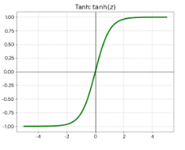
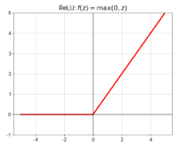
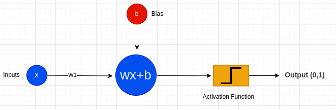
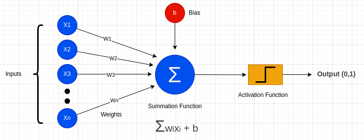
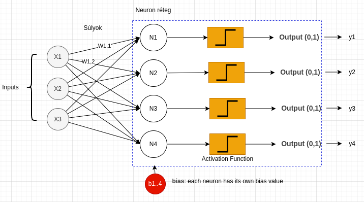
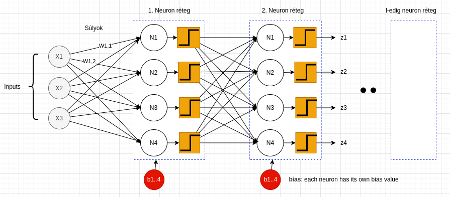

# Perceptron, mesterséges neuron

A neuron egy matematikai függvény, amely n darab bemenetet képez le egyetlen kimenetre.

A formális egyenlet
Egyetlen neuron működését az alábbi kompozíciós függvény írja le:

$$
y = \sigma \left( \sum_{i=1}^{n} w_i x_i + b \right)
$$

Vagy tömörebb, vektoros jelöléssel (ahol a pont a skaláris szorzást jelöli):

$$
y=σ(w⋅x+b)
$$

Ahol: 

* $x$: (Bemeneti vektor): $x=[x_1, x_2, ...x_n]$. Ez a beérkező adatok vektora (például a lakás mérete, szobák száma). 
* $w$:(Súlyvektor - Weights): $w=[w_1, w_2, ...w_n]$ minden bemenethez tartozik egy súly, ami azt mutatja, mennyire fontos az adott bemenet a döntés szempontjából. A tanulás során ezeket az értékeket "állítgatjuk".
* $b$: (Eltolás - Bias): Egy skalár érték, amely lehetővé teszi, hogy a neuron lineáris függvényét eltoljuk a nullaponttól. Ahogy a dokumentumod írta: ez a korrekciós szám, ami "helyre teszi" az egyenest. Ugyan az eltolást az aktivációs függvény előtt alkalmazzuk, még is nagy hatása van az aktivációra. 
* $∑$: vagy ⋅ (Lineáris kombináció): A bemenetek és súlyok szorzatösszege. Ez a rész felel meg a lineáris regressziónak
* $σ$: (Aktivációs függvény): Ez a nem-lineáris komponens (pl. Sigmoid, ReLU, Tanh). Ez dönti el, hogy a neuron "tüzeljen-e", illetve milyen értéket adjon tovább. 
* $y$: (Kimenet): A neuron végső válasza.

Így foglalnám össze egy szép, kerek mondatban a neuron teljes működését:

*"A neuron először kiszámítja a beérkező információk súlyozott összegét, majd az aktivációs függvénnyel eldönti, hogy ebből milyen erősségű jelet küldjön tovább."*

Vagy egy kicsit technikaibb megfogalmazásban:

*"A neuron egy lineáris transzformációval összesíti a bemeneteket, amelynek eredményét egy nem-lineáris aktivátor formálja végleges kimenetté."*

## Logit (súlyozott összeg)

A logit (ejtsd: lodzsit) a gépi tanulásban a neuron nyers, még nem normalizált kimenetét jelenti, közvetlenül azelőtt, hogy az aktivációs függvény (például a Softmax vagy a Sigmoid) átalakítaná azt valószínűséggé.

A logit matematikailag nem más, mint a neuron által végrehajtott lineáris regresszió közvetlen eredménye.

Ez azt jelenti, hogy a logit kiszámítása minden esetben – az aktiválás előtt – szigorúan az alábbi lineáris képlettel történik:

$$
logit =  \sum_{i=1}^{n} w_i x_i + b )
$$

### 2. Honnan jön a név? (A matematikai háttér)
A kifejezés a statisztikából származik, és a "log-odds" (logaritmikus esély) rövidítése.

Ha adott egy 
$$p$$

valószínűség (ahol $0<p<1 $), akkor az "esély" (odds) a bekövetkezés és a be nem következés aránya:
$$
Odds=\frac{p}{1-p}
$$
​
 
A logit függvény ennek a természetes logaritmusa 

$$
logit(p) = ln (\frac{p}{1-p})
$$

 

### Miért nem használunk másodfokú egyenletet a neuron belsejében?

$(ax^2+bx+c)$ 

Elméletileg lehetne olyan neurális hálót építeni, ahol a neuronok másodfokú függvényeket számolnak (léteznek is úgynevezett "Higher-order Neural Networks" vagy "Polynomial Neural Networks"), de a gyakorlatban nem ezek terjedtek el. Ennek három fő oka van:
* Univerzalitás (Universal Approximation Theorem): A matematikusok bebizonyították, hogy ha sok egyszerű, lineáris neuronból álló réteget egymás után pakolunk, és közéjük rakunk nem-lineáris aktivációs függvényeket, akkor ez a hálózat bármilyen bonyolult függvényt (akár huszadfokút vagy szinuszosat is) képes lemodellezni. Nem kell bonyolult neuron, ha sok egyszerű neuron együtt képes a bonyolult viselkedésre.
* Számítási költség: A lineáris művelet (w⋅x) számítógépes szempontból nagyon olcsó (mátrixszorzás, amit a videókártyák imádnak). Ha minden egyes neuronban elkezdenénk négyzetre emelni, szorzatokat képezni $(x_1*x_2)$, az exponenciálisan megnövelné a tanításhoz szükséges számítási időt.
* Túlillesztés (Overfitting): Egy másodfokú vagy magasabb fokú polinom sokkal "hajlékonyabb", mint egy egyenes. Ha minden neuron alapból ilyen bonyolult lenne, a hálózat hajlamos lenne "bemagolni" az adatokat ahelyett, hogy megtanulná az összefüggéseket. A lineáris neuronok "butábbak", ezért stabilabban tanulnak, ha sokat teszünk belőlük egymás után.

## Aktivációs függvények

Az aktivációs függvények a neurális hálók "lelke", ezek teszik lehetővé, hogy a hálózat ne csak egyenes vonalakat (lineáris kapcsolatokat) tanuljon meg, hanem bonyolult, görbült összefüggéseket is.

* Sigmoid
* Tanh
* ReLU
* Softmax

**Miért hívjuk "aktivációnak"?**: A biológiai analógia miatt. Az agyunkban a neuronok nem folytonosan küldenek jeleket. Csak akkor "tüzelnek" (aktiválódnak), ha az ingerek (a bemenetek összege) elérnek egy bizonyos küszöböt.

Ha az inger gyenge → A neuron csendben marad (Kimenet
$$
≈0
$$

Ha az inger átlépi a küszöböt → A neuron "elsül", elektromos jelet küld tovább (Kimenet
$$
>0
$$

Nézzük sorban a legfontosabbakat, amikkel 99%-ban találkozni fogsz.

### Sigmoid (S-görbe)
Ez a klasszikus aktivációs függvény, amelyet sokáig alapértelmezettként használtak.

$$
\sigma(z) = \frac{1}{1 + e^{-z}}
$$

 

 
Tulajdonságai:

* Kimeneti tartomány: 0 és 1 között. 
* Működése: A bemeneti értékeket ($z$) egy 0 és 1 közötti valószínűségi értékre nyomja össze. A nagyon negatív számokból $0$, a nagyon pozitívakból $1$ lesz. 
*Felhasználása: Főleg a kimeneti rétegen, bináris osztályozásnál (pl. "beteg" vagy "egészséges"), mert az eredmény valószínűségként értelmezhető.
* Hátránya: A "gradiens eltűnése" probléma. A görbe két szélén a derivált majdnem nulla, ami miatt a tanítás (a súlyok frissítése) nagyon lelassulhat mély hálózatoknál.

### Tanh (Hiperbolikus Tangens)
A Sigmoidhoz hasonló S-alakú görbe, de matematikailag előnyösebb tulajdonságokkal rendelkezik a rejtett rétegekben.

$$
\tanh(z) = \frac{e^z - e^{-z}}{e^z + e^{-z}}
$$

​
 
Tulajdonságai:
* Kimeneti tartomány: $-1$ és $1$ között. 
* Előnye: Az átlaga 0 (zero-centered). Ez azért fontos, mert ha a neuron kimenete pozitív és negatív is lehet, az stabilabbá teszi a következő réteg tanulását, szemben a Sigmoiddal, ami mindig pozitív irányba tolja az adatokat.

### ReLU (Rectified Linear Unit)
A modern mélytanulás (Deep Learning) leggyakrabban használt függvénye. Bár egyszerűnek tűnik, ez teszi lehetővé a nagyon mély hálók hatékony tanítását.

A képlet LaTeX kódja:

$$
f(z) = \max(0, z)
$$

Ez matematikailag két ágból áll:

* Ha $z<0$, az eredmény 0
* Ha $z≥0$, az eredmény maga a $z$

Tulajdonságai:
* Kimeneti tartomány: $0$ és $+\infty$ között.
* Előnye: Számítási igénye rendkívül kicsi (nem kell hatványozni), és a pozitív tartományban nem tűnik el a gradiens (a derivált mindig 1), így a hibaüzenet akadálytalanul jut vissza a hálózat elejére.
* Hátránya ("Dying ReLU"): Ha a bemenet negatív, a neuron "kikapcsol" és a deriváltja 0 lesz. Ha egy neuron mindig negatív bemenetet kap, soha többé nem tud tanulni.

### Softmax (A döntéshozó)
Ez egy speciális függvény, amit szinte kizárólag a hálózat legutolsó rétegében használunk, ha több lehetséges kategória közül kell választani. Az 1 valószínűséget szétosztja a lehetséges kimenetek között. 

$$
\sigma(z)_i = \frac{e^{z_i}}{\sum_{j=1}^{K} e^{z_j}}
$$

 
Egy olyan valószínűségi eloszlást kapunk, ahol a kimenetek összege pontosan 1 (vagyis 100%). 

Például: 
* Kutya: 0.7
* Macska: 0.2
* Ló: 0.1

---
# Neuron hálózatok 

A legegyszerűbb neurális modellben egyetlen bemeneti értéket kapunk, és egyetlen ‘neuront’ használunk, ami a $𝑦=𝑤𝑥 + 𝑏$ (esetleg egy aktivációs függvénnyel kiegészítve). Ilyen modellek léteznek és hasznosak (pl. lineáris/logisztikus regresszió), de a legtöbb valós, összetett feladathoz önmagukban nem elegendők. A gyakorlatban a neuronokat párhuzamosan futtatjuk (ebből lesz egy réteg), és sok ilyen réteget fűzünk egymás után (ebből lesz a ‘deep’ háló). A bemenet tipikusan több jellemzőből áll, és a kimenet lehet egyetlen érték vagy akár több dimenziós vektor is. Most menjünk végig lépésről lépésre a legegyszerűbb modelltől a valódi neurális hálózatokig

## Egy neuronos háló: 1 bemenet ->  1 kimenet

Egy 1 bemenettel rendelkező, 1 neuronos hálózat a neurális hálók legegyszerűbb, mégis teljes értékű alapegysége. Ebben a modellben egyetlen numerikus bemeneti értéket adunk a rendszernek, amelyet a neuron először egy lineáris művelettel feldolgoz: a bemenetet megszorozza egy tanulható súllyal, majd hozzáad egy szintén tanulható eltolást (bias). Ez a lépés matematikailag a 
$$z=wx+b$$ 
képlettel írható le, és ezt az értéket nevezzük előaktivációnak. Önmagában ez még nem több, mint egy egyszerű egyenes az input–output térben.

Ahhoz azonban, hogy a modell ne csak lineáris összefüggéseket tudjon leírni, a neuron egy második lépésben alkalmaz egy aktivációs függvényt az előaktivációra. Ez az aktivációs függvény egy fix, nem tanulható matematikai függvény (pl. sigmoid vagy ReLU), amely meghatározza, hogyan alakul át a lineáris kimenet végső neuronkimenetté. A teljes neuron működését így a 
$$y=σ(wx+b)$$
képlet írja le. Az aktivációs függvény szerepe az, hogy nemlinearitást vigyen a modellbe, vagyis megtörje azt a korlátot, hogy a kimenet mindig csak egyenes mentén változhasson.

Ha az aktivációs függvény az identitás függvény, akkor ez a neuron pontosan egy lineáris regressziós modellnek felel meg, amely csak egyenes kapcsolatokat képes tanulni. Ha sigmoid aktivációt használunk, akkor a kimenet 0 és 1 közé esik, és a modell logisztikus regresszióként viselkedik, vagyis bináris döntésekhez alkalmas. Más aktivációk, például a ReLU, már töréspontot hoznak létre a függvényben, ami fontos építőköve a mély neurális hálók expresszivitásának. A tanítás során kizárólag a súly és a bias értéke változik, az aktivációs függvény alakja nem.

Fontos megérteni, hogy bár ez a modell rendkívül egyszerű, koncepcionálisan ugyanazokat az elveket használja, mint a több rétegből és több ezer neuront tartalmazó mély hálók. Egyetlen neuron azonban csak nagyon korlátozott mintázatokat tud megtanulni, ezért a gyakorlatban a neuronokat párhuzamosan rétegekbe szervezzük, majd ezeket a rétegeket egymás után kapcsoljuk. Minden bonyolult neurális háló végső soron ilyen egyszerű, 1 bemenetű neuronok matematikai

## Egy neuronos háló: több bemenet -> 1 kimenet

Általában egy neuron nem egyetlen bemenetet, hanem több bemeneti jellemzőt kap, miközben továbbra is egyetlen kimeneti értéket állít elő. Ez a helyzet már sokkal közelebb áll a valós problémákhoz, hiszen a legtöbb feladatban egy döntést vagy becslést több szempont, több mérhető tulajdonság alapján kell meghozni. Matematikailag a bemenet ilyenkor nem egy skalár, hanem egy vektor, a neuron pedig minden egyes bemeneti komponenshez külön súlyt rendel.

A neuron működése ebben az esetben sem változik elvileg: a bemeneti vektort egy súlyvektorral szorozzuk össze, majd hozzáadunk egy bias értéket, így kapjuk meg az előaktivációt. Ez a művelet kompakt formában a 

$$z=w^Tx+b$$
 
kifejezéssel írható le, amely nem más, mint a korábban megismert egyváltozós képlet vektoros általánosítása. Az előaktivációra ezután ugyanúgy egy aktivációs függvényt alkalmazunk, amely meghatározza a neuron végső kimenetét. A bemenetek számától függetlenül egy neuronnak mindig 1 eltolása van. 

Fontos hangsúlyozni, hogy ebben a modellben továbbra is csak egyetlen neuronról beszélünk: nincs párhuzamos feldolgozás és nincs rétegstruktúra. A neuron egyetlen skalár kimenetet ad vissza, amely a bemeneti térben egy lineáris döntési felületet (egyenest, síkot vagy hipersíkot) reprezentál. Ez a felépítés már alkalmas egyszerűbb regressziós és klasszifikációs feladatokra, ugyanakkor jól mutatja a modell korlátait is, és természetes átvezetést ad a következő lépéshez, ahol több neuront kapcsolunk össze egyetlen réteggé.

 

## Több párhuzamos neuronból -> neuron réteg

A neurális hálózatok alapvető építőköve a neuron réteg (layer), amely számos, egymás mellett párhuzamosan működő mesterséges neuronból áll. Ezen a szinten a számítási folyamatok rendkívül hatékonyan optimalizálhatók, mivel a réteget alkotó neuronok belső lineáris műveletei – a súlyozott összegzések – egymástól függetlenek, így szimultán végrehajthatók. 

A szerkezetet a 'teljes összekötöttség' (fully connected) jellemzi: a bemeneti vektor (

$$x$$
) minden egyes elemét a réteg összes neuronja megkapja bemenetként, és saját súlyparamétereik (

$$w$$
) segítségével dolgozzák fel azt. Bár minden neuron ugyanazt az információhalmazt látja, az eltérő súlyozás miatt mindegyikük más-más jellemzőt emel ki belőle, és végül minden egyes neuron pontosan egyetlen skalár értéket generál. Így a réteg összegzett kimenete ezen egyedi skalárokból összeálló új vektor lesz, amelyet a rendszer matematikailag egyetlen lépésben, mátrixműveletek segítségével állít elő

 

Minden egyes neuron a rétegben ugyanazt a bemeneti vektort (

$$x$$
) kapja meg.

De minden neuronnak saját súlyai (

$$w$$
) és saját eltolása (

$$b$$
) van.

Ezért minden neuron egy kicsit mást "lát meg" ugyanabban a bemenetben.

**Matematikai leírás:** Mikor több párhuzamosan működő neuront használunk, itt válik a matematika skalárokból (egyetlen számokból) mátrix-műveletté:

Ha egy rétegben

$$m$$
darab neuron van (a példában $m=4$), és a bemenet dimenziója

$$n$$

A példában $n=3$

A sok kis súlyvektort egymás alá írjuk, így kapunk egy mátrixot. A mátrix minden sora egy-egy neuron saját súlyait tartalmazza.

$$W∈R m×n$$
 
A biasok (

$$b$$
) Minden neuronnak van egy saját bias értéke, ezeket egy vektorba rendezzük.

$$b∈R m$$
 
Nem kell $m$ x kiszámolni a képletet. A mátrixszorzás elvégzi ezt egyszerre az összes neuronra:

$$z=Wx+b$$

A fenti példa alapján: 

$$
W =
\begin{bmatrix}
w_{1,1} & w_{1,2} & w_{1,3} \\
w_{2,1} & w_{2,2} & w_{2,3} \\
w_{3,1} & w_{3,2} & w_{3,3} \\
w_{4,1} & w_{4,2} & w_{4,3}
\end{bmatrix}
$$

A réteg kimenetét (az aktiváció előtti $y$ értékeket) az alábbi mátrixszorzással számoljuk ki. Itt jól látszik, hogyan találkozik a 4 neuron a 3 bemenettel:

$$
\begin{bmatrix}
y_1 \\
y_2 \\
y_3 \\
y_4
\end{bmatrix}
=

\begin{bmatrix}
w_{1,1} & w_{1,2} & w_{1,3} \\
w_{2,1} & w_{2,2} & w_{2,3} \\
w_{3,1} & w_{3,2} & w_{3,3} \\
w_{4,1} & w_{4,2} & w_{4,3}
\end{bmatrix}
\cdot
\begin{bmatrix}
x_1 \\
x_2 \\
x_3
\end{bmatrix}
+
\begin{bmatrix}
b_1 \\
b_2 \\
b_3 \\
b_4
\end{bmatrix}
$$

A végső kimenetet az aktivációs függvény alkalmazásával kapjuk meg: 

$$
\begin{bmatrix}
z_1 \\
z_2 \\
z_3 \\
z_4   
\end{bmatrix}
=

\sigma\left(
\begin{bmatrix}
 y_1 \\
y_2 \\
y_3 \\
y_4   
\end{bmatrix}
\right)

$$

### Mátrix szorzás kifejtve:  

$$ (Wx)_1 = w_{1,1}x_1 + w_{1,2}x_2 + w_{1,3}x_3 $$

$$ (Wx)_2 = w_{2,1}x_1 + w_{2,2}x_2 + w_{2,3}x_3 $$

$$ (Wx)_3 = w_{3,1}x_1 + w_{3,2}x_2 + w_{3,3}x_3 $$

$$ (Wx)_4 = w_{4,1}x_1 + w_{4,2}x_2 + w_{4,3}x_3 $$

Bias hozzáadása elemenként:

$$ y_1 = (Wx)_1 + b_1 $$
$$ y_2 = (Wx)_2 + b_2 $$
$$ y_3 = (Wx)_3 + b_3 $$
$$ y_4 = (Wx)_4 + b_4 $$

Teljesen kifejtett alak (minden egy sorban):

$$ y_1 = w_{1,1}x_1 + w_{1,2}x_2 + w_{1,3}x_3 + b_1 $$
$$ y_2 = w_{2,1}x_1 + w_{2,2}x_2 + w_{2,3}x_3 + b_2 $$
$$ y_3 = w_{3,1}x_1 + w_{3,2}x_2 + w_{3,3}x_3 + b_3 $$
$$ y_4 = w_{4,1}x_1 + w_{4,2}x_2 + w_{4,3}x_3 + b_4 $$

És itt minden $y_i$-re alkalmazni kell az aktivációs függvényt $\sigma(y_i)$ 

Összefoglaló, általános alak (egy réteg matematikai definíciója):

$$
y_i = \sum_{j=1}^{3} w_{i,j} x_j + b_i
\qquad \text{ahol } i=1,2,3,4
$$

 

## Több neuron rétegből -> mély neuron hálózatok

$$
f_{\theta}(x) = \sigma(W_2 \, \sigma(W_1 x + b_1) + b_2)
$$

A több neuronrétegből álló neurális hálózatok a korábban bemutatott neuron-réteg fogalmat általánosítják úgy, hogy nem egyetlen réteget, hanem több egymás után kapcsolt réteget alkalmazunk. Minden réteg egy önálló transzformációt hajt végre a bemeneti adaton: a bemenetet megszorozza egy súlymátrixszal, hozzáad egy bias vektort, majd egy aktivációs függvényen vezeti át. Az így kapott kimenet már nem a modell végső válasza, hanem a következő réteg bemenete, vagyis az információ rétegről rétegre halad előre a hálózatban.

Matematikailag ez azt jelenti, hogy az első réteg a nyers bemenetből egy új reprezentációt hoz létre, a következő réteg ezt a reprezentációt tovább alakítja, és így tovább. Egy l-edik rétegben az előző réteg aktivációját tekintjük bemenetnek, amelyre ismét egy lineáris transzformációt és egy nemlinearitást alkalmazunk. Ennek formális alakja a következő:

$$
z^{(l)} = W^{(l)} a^{(l-1)} + b^{(l)}$$

$$ a^{(l)} = \sigma^{(l)}\!\left(z^{(l)}\right) $$

Itt az $a^{(l−1)}$ az előző réteg kimenete (aktivációja), a $W^l$ és $b^l$ az aktuális réteg tanulható paraméterei, míg $\sigma^l$ az adott réteghez választott aktivációs függvény. A hálózat bemenetét gyakran az $a^{(0)}=x$ elöléssel adjuk meg, jelezve, hogy a nyers input is egy „0. rétegként” értelmezhető.

A több réteg egymásra fűzése azért kulcsfontosságú, mert az aktivációs függvények miatt a teljes hálózat már nem írható le egyetlen lineáris transzformációként. Minden új réteg tovább növeli a modell kifejezőerejét, és lehetővé teszi, hogy a hálózat egyre összetettebb, hierarchikus mintázatokat tanuljon meg. A teljes hálózat működése így egy egymásba ágyazott függvénykompozícióként fogható fel:

$$
f(x) = a^{(L)} = \sigma^{(L)}\left(
W^{(L)} ,\sigma^{(L-1)}!\left(
\cdots \sigma^{(1)}\left(W^{(1)}x + b^{(1)}\right)
\cdots \right)

b^{(L)}
\right)
$$
