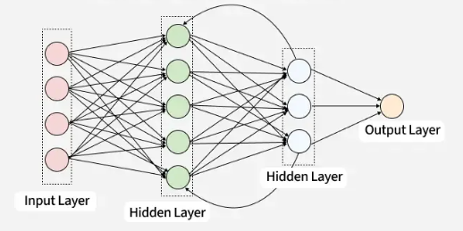

# Bevezető

## Mes

A történetünk 2017-ben kezdődik, a mesterséges intelligencia kutatásának egyik legfontosabb eseményén, a NeurIPS (Neural Information Processing Systems) konferencián. Egy nyolcfős kutatócsoport a Google Braintől és a Google Researchtől – köztük Ashish Vaswani, Noam Shazeer és Jakob Uszkoreit – publikált egy tanulmányt, amelynek címe egyszerre volt provokatív és profetikus:

"**Attention Is All You Need**" (A figyelem minden, amire szükséged van).

A cím nem túlzott. A szerzők azt állították, hogy a korábbi évek bonyolult visszacsatolásos rendszerei feleslegesek, és egyetlen egyszerű mechanizmus, a „Figyelem” (Attention) is elegendő a nyelvi intelligencia megteremtéséhez. Akkor még kevesen sejtették, hogy ez a dokumentum lesz az alapköve a jövő olyan rendszereinek, mint a ChatGPT, a Claude vagy a Gemini.

A "Sötét Középkor": A Transzformerek előtti világ
Hogy értsük a forradalmat, látnunk kell a problémát, amit meg akartak oldani. 2017 előtt a nyelvfeldolgozást (pl. a gépi fordítást) úgynevezett RNN-ekkel (Recurrens Neurális Hálók) és LSTM-ekkel végezték.

## RNN - Recurrent Neural Network

## LSTM – Long Short-Term Memory

## Transformers 

