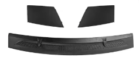
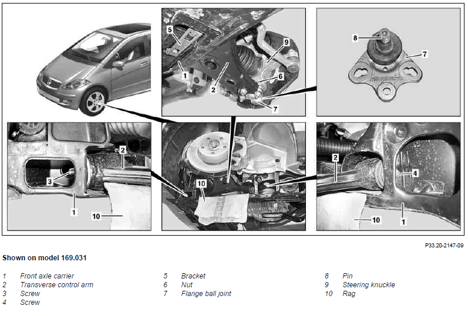
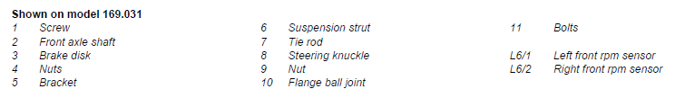

* motorháztető szellőzőrács, Front Hood Breather Grille: 
  * bal: 1698360018, 
  * közép: 1698300175, 
  * jobb: 1698300075
  

# Első felfüggesztés 

## TS BALL JOINT

* STEERING KNUCKLE AND CONTROL ARM
* https://partsouq.com/en/catalog/genuine/unit?c=MB201810&ssd=%24%2AKwGonI2j2-_q8f_J69S7gPDkxMPdrKOur72Soenv3Mvf09Xdj4iY3t7SycnPzteNiq_F6-_r2szY2vL76KqorazQqaqo8f_i5Pjc5rjvvqThi5a4t77wuKHy66-h_bj8vqeorKqp-7Cv79vnv-65pryBgPO2ufW_oKyrrPX0_bj8vqerr6-t8vms5O359drgvujh9_PN39isrKKsrfL8m6itqq-oqL6y4aCyuKG-rKyirK3y7_246P-_oLm-suGgurihvqy4t779re_ruK2q37i3vuig7-u4qr7gAAAAACdatNE%3D%24&vid=0&cid=27678&uid=77269&q=WDD1690311J266223

* A1693330127

## Lengéscsillapító:

https://partsouq.com/en/catalog/genuine/unit?c=MB201810&ssd=%24%2AKwE4DB0zS396YW9Ze0QrEGB0VFNNPDM-Py0CMXl_TFtPQ0VNHxgITk5CWVlfXkcdGj9Ve397SlxISmJreDo4PTxAOTo4YW9ydGhMdih_LjRxGwYoJy5gKDFiez8xbShsLjc4PDo5ZCA_f0t3L34pNiwREGMmKWUvMDg4PWRvbShsLjc7Pz89Ym08dH1pZUpwLnhxZ2NdT0g8PDI8PWJsCzg9Oj84OC4icTAiKDEuPDwyPD1if20oeG8vMCkuInEwKigxLjwoJy5tPX97KD06TygnLngwf3soOi5wAAAAAOzwZds%3D%24&vid=0&cid=27677&uid=34372&q=WDD1690311J266223

* Első lengéscsillapító:	A1693201430 / A1693200830
* Toronycsapágy:	A1693200073
* Porvédő + ütköző szett:	 A 169 323 01 92
* TORSION BAR LINKAGE: A 169 320 09 89	

## Féltengely

https://partsouq.com/en/catalog/genuine/unit?c=MB201810&ssd=%24%2AKwHo3M3jm6-qsb-Jq5T7wLCkhIOd7OPu7_3S4amvnIufk5Wdz8jYnp6SiYmPjpfNyu-Fq6-rmoyYmrK7qOro7eyQ6erosb-ipLicpviv_uShy9b49_6w-OGyq-_hvfi8_ufo7Orpu_Dvr5un_6755vzBwLP2-bX_4Oru67u5ovb5u__g6ujtsLynp6WquLKbp_z1r6v4jJiZ6-3l7rC8oJDp6uvo6e_8r6_8ufnm_-vt5e6wvLP2-a---OH-_K-v_LH55v_r-fD84OOz4Pnq65j58Pz17rPg-e3_pwAAAAB7TH5l%24&vid=0&cid=27678&uid=125843&q=WDD1690311J266223

* Javító készlet: A169 360 0975
* gumiharag, váltó vége: A 169 360 08 68
* gumiharang,kerék vége: A 169 360 05 68

A169370687205

## Workshop manual

### AR33.20-P-0510AK Remove/install lower wishbone (elsó lengőkar)

* (transverse control arm
* a képen ez a 2-es. 

### AR33.20-P-0446AK Remove/install flange ball joint

### AR33.25-P-0400AK Remove/install steering knuckle

### AR32.25-P-1017AK Remove/install the suspension strut

### AR32.20-P-0230AK Remove/install rear spring

## front lower ball join

- AR33.20-P-0446AK Remove/install flange ball joint -> 625. oldal
- 

## Tie rod

- AR46.40-P-0200AK Remove/install track rod -> 889.oldal

## Half shaft 

### boot - kerék oldal

- AR33.30-P-0695AK Remove, install constant velocity joint or boots on front axle shaft -> 635. oldal

### boot - motor oldal

- AR33.30-P-0690AL Remove/install boots on front axle shaft -> 638. oldal

### féltengely kivétel (bal oldal)

- AR33.30-P-0620AK Remove/install front axle shafts -> 644. oldal

### féltengely kivétel (jobb oldal)

- AR33.30-P-0620AL Remove/install front axle shafts -> 647. oldal

# Hátsó felfüggesztés 

https://partsouq.com/en/catalog/genuine/unit?c=MB201810&ssd=%24%2AKwG-ipu1zfn85-nf_cKtluby0tXLurW4uauEt__5yt3JxcPLmZ6OyMjE39_Z2MGbnLnT_fn9zNrOzOTt_ry-u7rGv7y-5-n08u7K8K75qLL3nYCuoajmrrfk_bm3667qqLG-ury_4qa5-c3xqfivsKqXluWgr-Optri6veHj667qqLG9ubm75Om68vvv48z2qP734eXbyc66urS6u-Tqjb67vLm-vqik97akrreourq0urvk-euu_umptq-opPe2rK63qLquoajru_n9rru8ya6hqP62-f2uvKj2AAAAAF3zdGg%3D%24&vid=0&cid=27677&uid=50548&q=WDD1690311J266223

* SHOCK ABSORBER: A 169 326 00 00	

* WHEEL HUB TO REAR bolt: N000000003758
* WHEEL HUB TO REAR wahser: A1403521376

### AR32.25-P-0110AK Remove/install rear shock absorber

# Brakes
## FRONT WHEEL BRAKE

https://partsouq.com/en/catalog/genuine/unit?c=MB201810&ssd=%24%2AKwGPu6qE_MjN1tjuzPOcp9fD4-T6i4SJiJq1hs7I--z49PL6qK-_-fn17u7o6fCqrYjizMjM_ev__dXcz42Piov3jo2P1tjFw9_7wZ_ImYPGrLGfkJnXn4bVzIiG2p_bmYCPi42B1ZeIyPzAmMmegZump9SRntKYh4WPitDY2p_bmYCMiIiK1tuLw8re0v3Hmc_G0NTq-P-Li4WLitXbvI-KjYiPj5mVxoeVn4aZi4uFi4rVyNqfz9iYh56ZlcaHnZ-GmYufkJnaisjMn4qN-J-Qmc-HyMyfjZnHAAAAAAl-wvw%3D%24&vid=0&cid=27681&uid=94342&q=WDD1690311J266223

* Brake disk: A 169 421 00 12
* caliper to frame collar: A 169 421 01 86
* Brake pads:
  * A 169 420 02 20
  * A 169 420 10 20	
  * A 169 420 18 20	
  * A 169 420 21 20

## Hand brakes

- AR42.20-P-0530AK Remove/install brake shoes of parking brake -> 820. oldal

- AP42.20-P-4262AK Parking brake - adjusting cable slack adjuster -> 818. oldal

# Csomagtartó nyitó gomb

* **REAR PANEL DOOR ATTACHMENT PARTS, REAR PANEL DOOR WINDOW**
* https://partsouq.com/en/catalog/genuine/unit?c=MB201810&ssd=%24%2AKwF0QFF_BzM2LSMVNwhnXCw4GB8BcH9yc2FOfTUzABcDDwkBU1REAgIOFRUTEgtRVnMZNzM3BhAEBi4nNHZ0cXAMdXZ0LSM-OCQAOmQzYng9V0pka2IsZH0uN3N9IWQgYnt0cHdyL2xzNiAAc2l1Pjdfai8yZXpjBApibj14L3x1dHRycGxgeDM3d3NzdXd-PTxpdGUGPGI3ZH1iFVtVPHB-cHJ3dgpwKSc_dHRibWQqI2AlMzxwfnByd2VsYGxyL3xlYm1kKitgJTM8ZGtiIihlemApJ09ka2I3JWV6YC4zcAAAAABq2t0y%24&vid=0&cid=27700&uid=24547&q=WDD1690311J266223

Úgy néz ki, hogy külön nincs a W169-re cikkszám a kapcsolóra, csak az egész fekete sínre. 
### Teljes fogantyú: 
* A 169 740 14 93 9051 -> A 169 740 23 93	
* A 169 740 23 93 9051 -> A 169 740 18 93	

### Csak gomb
* A2218702410 -> ez nagyon nem biztos, de lehet hogy jó a W169-hez is. 

# Üzemanyag rendszer

## Üzemanyag betöltő cső

- AR47.10-P-7541AK Remove/install filler neck of fuel tank -> 903. oldal