# Info: 

- VIN: WBA5V71090FH18206
- Gyártási év: **2019-06-01**
- Autó pontos típusa ez: **5V71**
- Motor: B47D20B (vagy B47D20O1/O2, gyártási évtől függően)
  - Teljesítmény: kb. 190 lóerő (140 kW
  - Nyomaték: kb. 400 Nm
- Váltó: 8 fokozatú automata (ZF 8HP)
- Karosszéria-kód: G20 (a 7. generációs 3-as BMW, 2018-tól)

# Linkek

https://www.realoem.com/bmw/enUS/partgrp?id=5V71-EUR-06-2019-G20-BMW-320dX

https://www.realoem.com/bmw/enUS/partgrp?id=5V71-EUR-04-2019-G20-BMW-320dX&mg=11

# Intake manifold parts

- https://www.realoem.com/bmw/enUS/showparts?id=5V71-EUR-04-2019-G20-BMW-320dX&diagId=11_7694
- https://www.leebmann24.com/hu/en/component/intake-manifold-agr-with-flap-control-117694

## Intake manifold AGR with flap control

- old part number: 11618579245
- new part number: 11617925777

Gyári sorozatszám: 
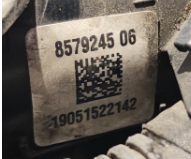

# Actuator

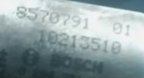

Bosch 8570791 01 / 10213510

* https://www.ebay.com/itm/186196689577

## Connector

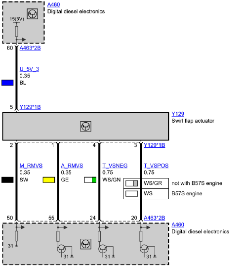
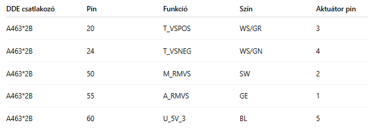

### ECU side

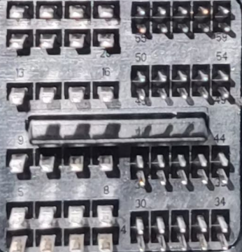

### Actuator side
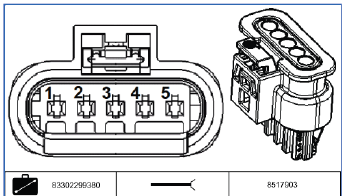

 

# Fékek

## Első fékek

* négy dugattyús: 
  * https://www.realoem.com/bmw/enUS/showparts?id=5V71-EUR-06-2019-G20-BMW-320dX&diagId=34_2722
  * méret: 348X36
  * OEM: 
    * 34108858705	
    * 34108858706	
    * 34106880075	
    * 34106880076
  
### egy dugattyús:

https://www.realoem.com/bmw/enUS/showparts?id=5V71-EUR-06-2019-G20-BMW-320dX&diagId=34_2722

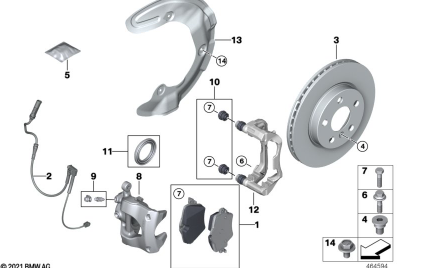

info: 
- méret: **307X24**
- one piston, floating caliper

alkatrészek: 
- Rotor 307X24:
  - 34106880060
  - 34106877212			
  - 34106877212	
- Brake pads: 34116890553
- Brake pad wear sensor, front:	34356870349	
- bolt, caliper to frame, M8: 	34116768190
- robber-boot, calliper: 34207848324	
   

## Hátsófék

https://www.realoem.com/bmw/enUS/showparts?id=5V71-EUR-06-2019-G20-BMW-320dX&diagId=34_2725
	

méret: **300X20**

- rotor:
  - 34206877213	
  - 34206880071	
  - 34206877213	
- Repair kit, brake pads: 34208844393	
- bolt, caliper to frame, M8: 34216860562	
- robber-boots, caliper to frame: 34206894211	
- bolt frame to wheel hub 	M12X1,5X43 ZNS3	4: 	34108838589	
- Brake pad wear sensor: 34356870354	

### Torque

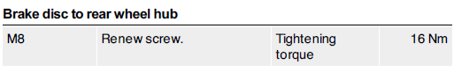
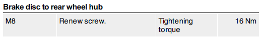
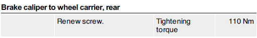
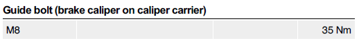
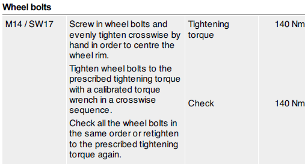

# Turbo

https://www.realoem.com/bmw/enUS/showparts?id=5V71-EUR-06-2019-G20-BMW-320dX&diagId=11_7701

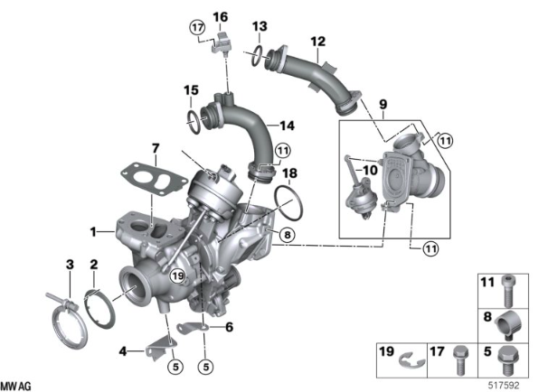

- 01	RP exhaust turbocharger		1			11658587540			
- 02	Gasket		1			18308513651			
- 03	Screw clamp		1			18308512137			
- 04	Support bracket for turbocharger	TGH	1			11658518738			
- 05	Hex bolt with washer	M8X16	5			07119905528	$0.62		
- 06	Support bracket for turbocharger	VGH	1			11658587543			
- 07	Gasket Asbestos Free		1			11658591888			
- 08	Clip retainer		1			12517577343			
- 09	Bypass valve		1			11658587518			
- 10	Vacumm box		1			11659887132			
- 11	ISA screw	M6X20-8.8-ZNNIV	7			07129901130	$0.38		
- 12	Connection pipe		1			11658587520			
- 13	Not offered by BMW		2			84210300311			ENDED
- 14	Connection pipe		1			11658587519			
- 15	Not offered by BMW		2			84210300311			ENDED
- 16	Sensor, charge-air pressure		1			13628637896			
- 17	Hex bolt with washer	M6X20	1			07119904527	$0.44	
- 18	Preformed seal		1			11617796622	$6.65	

# Radiator shutter

Codes:
- 30c400
- 279B00

https://www.youtube.com/watch?v=6PDPpb6q0_U

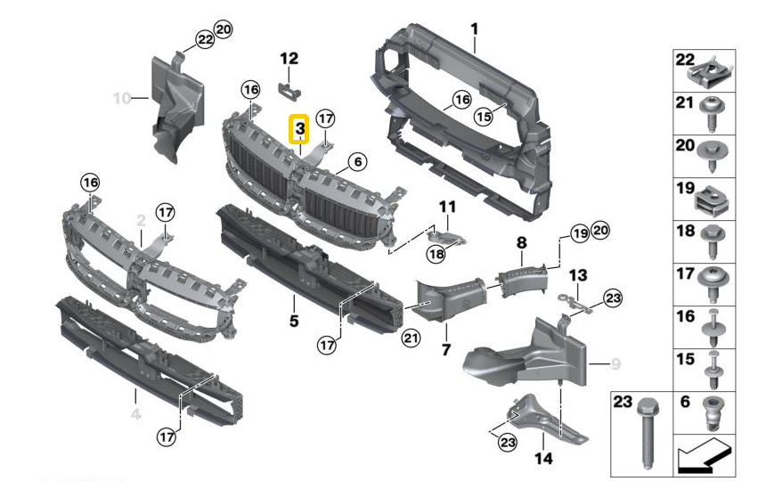

https://www.realoem.com/bmw/enUS/showparts?id=5V71-EUR-06-2019-G20-BMW-320dX&diagId=51_A424#51745A22C60

- Air duct with air flap control, upper: 51745A22C60
- Air duct with air flap control, lower: 51745A22C64

## Csak a motor

- lower: Brose C93091-108 BMW P/N 111466512
- upper: Brose C93092-113 BMW P/N 111466416