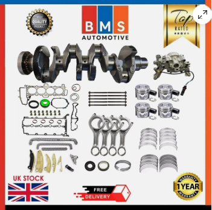

# Engine rebuild

* Van egy Range Rover Evoque 2016-om ezzel a motorral: 2.0 TD4 / AJ20D4 Ingenium
* A 4-es dugattyú picit lötyög, és erős kattogó hangot ad már alapjáraton is. Feltehetőleg a hajtókar csapágy oda lett. 
* a motoron túrbót cseréltek, és ez után az első autópálya menet után, kb 300 km után elkezdődött a kattogás, úgy hogy összefügghet. 
  * vagy a sérült túrbóból ment szennyeződés az olajba
  * vagy a turbó olaj éhezés miatt halt meg,  pl mert a puma elégtelen, és most a motor csapágyak is belehaltak. 
* Az az elsődleges terv, hogy kivesszük a motort, fejre fordítjuk, leszedjük az olaj teknőt és megnézzük milyen állapotban van a főtengely, a hajtókar, és a blokk. Ha a blokk nem sérült, akkor veszünk egy rebuild kit-et és kicseréljük a sérült hajtókart és a főtengelyt és a csapágyakat. 

* Ehhez keresünk szerszámokat és rebuild kit-eket. A rebuild kit csak megbízható angol boltból jöhet. 

## Rebuild kits: 

> **WARNING**: csak olyan főtengelyt szabad venni, aminek rajta van a végén a fogaskerék. 

> **WARNING**: Figyelni kell rá, hogy a single turbohoz legyen való, mert a biturbós változatban a hajtókar vastagabb. 

https://www.ebay.com/itm/406397216275

- olajpuma
- főtengely with gear
- timing set

## Szerszámok: 