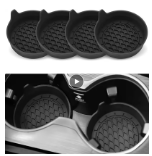

# Alap adatok

Range-Rover-Evoque-L538

Gyártmány, típus: LAND ROVER RANGE ROVER EVOQUE RangeEvoque 2.0 Td4 HSE (Automata)
Alvázszám: SALVA2BN4GH165917
Évjárat: 2016/8
* Motor: 150 LE-s (2.0 TD4 / AJ20D4 Ingenium)

https://landrover.oempartsonline.com/v-2016-land-rover-range-rover-evoque--hse--2-0l-l4-gas

# central console side trim

https://landrover.oempartsonline.com/v-2016-land-rover-range-rover-evoque--hse--2-0l-l4-gas/body--center-console

https://landrover.scuderiacarparts.com/part-finder/landrover/range-rover-evoque/oe/459/4110/72265

- LR090415 → bal oldal (vezető) - https://parts.landrovercary.com/oem-parts/land-rover-finish-molding-lr090415
- LR090414 → jobb oldal (utas)  - https://parts.landrovercary.com/oem-parts/land-rover-finish-molding-lr090414

VAGY: 

- BJ32044E07DB: bal
- BJ32044E06DB: jobb

https://www.aliexpress.com/item/1005004697293815.html

# EGR rendszer

Alacsony nyomású EGR (leggyakoribb):

LR087071
👉 Ez kifejezetten a 2.0 Ingenium dízel Evoque-hoz való EGR szelep

2. Magas nyomású EGR:

LR110291 (helyettesíti: LR073729, LR084362)
👉 Szintén 2.0 Ingenium motorhoz

3. Komplett EGR egység (szelep + hűtő):

LR188347 (utódok: LR139674, LR156783 stb.)

# Telefon tartó: 

* Tartó: https://www.atachmounts.com/Universal-Qi-Wireless-Charging-Phone-Holder_p_1602.html
* Mount: https://www.atachmounts.com/Land-Rover-Range-Rover-Evoque-Phone-Mount_p_423.html?srsltid=AfmBOoqgEzv0fG-SwQLXFt0Opi7Fxw33_BELAH29G_M260Bsxz0AuC-X

# Cup holder

https://www.aliexpress.com/item/1005008928089370.html

# Side step, running board

Csak olyan jó, ami nem dynamic-ra való !!!, mert ez egy sima HSE. 
A "Pure" szóra kell keresni, olyan nem lesz hogy HSE. 

- Dynamic side steps → VPLVP0208
- Pure side steps → VPLVP0225
  
 

- https://www.ebay.co.uk/itm/325525614571
- https://4x4ni.com/products/range-rover-evoque-l538-prestige-pure-2011-2019-oe-style-running-boards-side-steps-pair
- https://www.ebay.co.uk/itm/126787774911