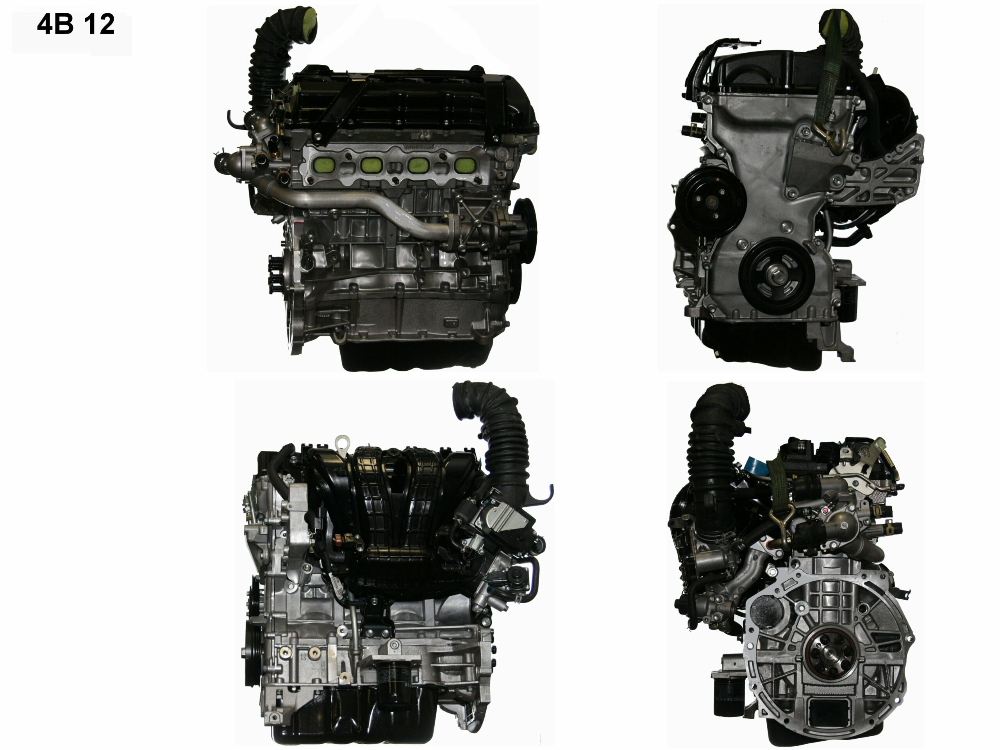
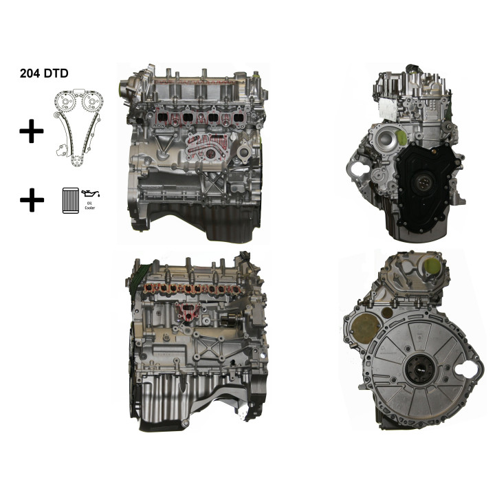
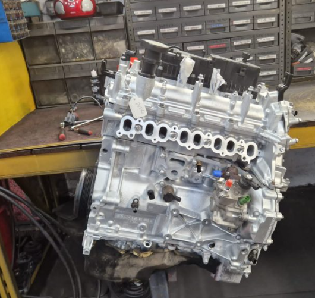

# New engine

AJ200D rebuilt engine

204DTD reconditioned engine

## Selman Motoren

https://selman-shop.de/produkt/motor-204dtd-range-rover-evoque-l538-2-0-diesel-generalueberholt/

Ár: 2 400 000 Ft

## Distrimotor (Franciaország)

https://www.distrimotor.com/gb/diesel-engine-standard-exchange/69394-engine-land-rover-20d-code-204dtd-naked-remanufactured-engine.html

Ár: 2 800 000 Ft

## Hayes Engines 4x4 (UK)

http://hayesengines4x4.co.uk/stocklist/range-rover-evoque-2-0-dsl-euro-6-2015-2019-204dt-aj200d-remanufactured-engine/

Nincs ár: ???

## 3ngines (UK)

https://www.3ngines.com/landrover-engines/20-td4-landrover-discovery-sport-evoque-diesel-180bhp-aj200-204dtd-engine/

Ár: 1 301 740 Ft

## Dieselheads (UK specialist rebuild shop)

## Ivor Searle (nagyon komoly reman cég)

## Bliss motors

https://www.blissmotors.hu/motoare/felujitott-land-rover-20-ingenium-motor-204dtd-204dta-discovery-sport-velar.html#resp-tab2

Ár:  1.720.000 Ft. 

## 2026-05-30 internetes keresés - 204DTD / AJ200D rebuilt motorok

Cél: Range Rover Evoque L538, 2016/08, 2.0 TD4 150 LE, 204DTD / AJ200D, single turbo. A 204DTA / D240 / biturbo motorokat nem szabad automatikusan elfogadni. Jaguar XE/XF/F-Pace 204DTD long block elvileg rokon lehet, de Evoque L538-ba csak VIN-es és cikkszámos visszaigazolással venném.

Árfolyam a forintos becslésekhez: MNB hivatalos devizaárfolyam, 2026-05-29: 1 EUR = 354,52 Ft, 1 GBP = 408,88 Ft, 1 RON = 67,56 Ft. 2026-05-31 vasárnap, ezért ez a legfrissebb MNB közlés.

Árképzésnél fontos: a UK/eBay árak elsőre gyakran 1.5M Ft környékének tűnnek, de Magyarországra a végösszeg könnyen felmegy szállítás, vám/ÁFA, core return és garancia-visszaküldés miatt. A legolcsóbb UK opciókat ezért csak akkor venném komolyan, ha írásban vállalják a pontos 204DTD L538 kompatibilitást, a garanciát és a Magyarországra szállítást.

### Legérdekesebb olcsóbb találatok

#### eBay UK - engineexperts1, rebuilt 204DTD

https://www.ebay.co.uk/itm/197468062746

Ár: GBP 3,150 vagy best offer, kb. 1 287 972 Ft.

Ellenőrzés: megnyílt, a termékoldal címe Land Rover Range Rover Evoque / Discovery 2.0 204DTD remanufactured engine. A leírás szerint minden új alkatrésszel újraépített motor.

Saját megjegyzés: nyers áron ez van legközelebb az 1.5M Ft célhoz. UK miatt csak nagyon alapos előzetes írásos egyeztetéssel: szállítás HU-ba, core deposit, garancia, pontos motorverzió, számla.

Részletes ellenőrzés (2026-05-31):
- Garancia hossza: nem találtam publikus, egyértelmű garanciaidőt a listingből visszaellenőrizhetően.
- Megbízhatóság: 4/10. Olcsó és konkrét 204DTD találat, de eBay-only jelleg, publikus cím és garanciafeltétel nélkül.
- Helyszín: UK / eBay UK.
- Bolt vagy műhely címe: nem találtam publikus címet; vásárlás előtt kötelező elkérni a céges nevet, címet, számlázási adatot.
- Szállítási költség Budapest/Magyarország felé: nem publikus, eladóval egyeztetendő. UK miatt vám/ÁFA/core-return kockázat is van.

#### eBay UK - MKL Global, AJ200D / 204DTD reconditioned engine

https://www.ebay.co.uk/itm/126157513420

Ár: GBP 3,453.80, kb. 1 412 190 Ft.

Ellenőrzés: megnyílt, a termékoldal címe Land Rover Range Rover Evoque 2.0 Diesel 204DTD 2015-2022 reconditioned engine. Seller: mkl-global, 100% positive feedback.

Saját megjegyzés: árban még érdekes, de a kompatibilitási listában L551 is megjelenik, ezért csak VIN-es megerősítéssel. Meg kell kérdezni, hogy L538 transverse Evoque 150 LE 204DTD-hez szállítják-e, és pontosan mi jár a motorhoz.

Részletes ellenőrzés (2026-05-31):
- Garancia hossza: nem találtam publikus, egyértelmű garanciaidőt.
- Megbízhatóság: 5/10. A korábbi ellenőrzésnél 100% eBay feedback látszott, de a garancia, cím és HU szállítás nem elég transzparens.
- Helyszín: UK / eBay UK.
- Bolt vagy műhely címe: nem találtam publikus címet.
- Szállítási költség Budapest/Magyarország felé: nem publikus, eladóval egyeztetendő. A core visszaküldés költségét is írásban kell kérni.

Ugyanennek a sellernek hasonló AJ200D listája:

https://www.ebay.co.uk/itm/126913731478

Ellenőrzés: megnyílt, AJ200D 2015-2022 reconditioned engine listing. Valószínűleg ugyanaz a motorcsalád / ugyanaz a seller, nem kezelném külön ajánlatként.

Részletes ellenőrzés (2026-05-31): ugyanazt a kockázati profilt adnám rá, mint a fenti MKL Global listára: garancia/cím/szállítás csak írásos eladói válasz után elfogadható.

#### 3ngines - javított/ellenőrzött link

https://www.3ngines.com/landrover-engines/reconditioned-20-td4-landrover-discovery-sport-evoque-179-180bhp-aj200-204dtd-diesel-engine/

Ár: GBP 3,445.60, kb. 1 408 837 Ft.

Ellenőrzés: megnyílt, 2.0 TD4 Discovery Sport / Evoque AJ200 204DTD reconditioned diesel engine.

Saját megjegyzés: az ár jó, de UK. A 179/180 bhp cím miatt külön megkérdezném, hogy a 150 LE-s L538 204DTD-hez is pontosan ezt adják-e, és milyen perifériákkal.

Részletes ellenőrzés (2026-05-31):
- Garancia hossza: 6 hónap a reconditioned unitra.
- Megbízhatóság: 5/10. Van aktív oldal és konkrét garancia, de a 3ngines platformként működik, a tényleges beszállító/műhely adatait csak rendelés után adja; ez garanciaérvényesítésnél gyengébb.
- Helyszín: UK; a cég a Capital Eng Limited, London, company registration 15889928 néven szerepel.
- Bolt vagy műhely címe: konkrét fizikai műhelycímet nem találtam; a termékoldal Leicestershire vagy Lancashire collectiont említ használt motoroknál, de ez nem pontos cím.
- Szállítási költség Budapest/Magyarország felé: nem publikus. UK belső példaárak: England reconditioned/used delivery GBP 69, kb. 28 213 Ft; Scotland/Wales GBP 99, kb. 40 479 Ft. Magyarországra külön ajánlat kell.

#### ReconMyEngine - 204DTD rebuilt engine

https://reconmyengine.com/landrover-recon-engines/reconditioned-20-velar-engine-discovery-evoque-landrover-jaguar-2014-on-204dtd-engine/

Ár: GBP 3,392, kb. 1 386 921 Ft.

Ellenőrzés: megnyílt, 204DTD 2.0 Ingenium rebuilt engine. A termékoldal 6 hónap / 6000 mérföld warranty-t ír.

Saját megjegyzés: árban érdekes, de rövidebb garancia és UK. Inkább B terv, ha részletes írásos választ adnak a L538 / 150 LE kompatibilitásra.

Részletes ellenőrzés (2026-05-31):
- Garancia hossza: a korábbi termékoldal alapján 6 hónap / 6000 mérföld volt, de 2026-05-31-én a link nálam már nem motoros tartalomra, hanem teljesen más oldalra töltött be.
- Megbízhatóság: 2/10. A link aktuálisan nem azt az oldalt adja, ami alapján vásárolni lehetne.
- Helyszín: nem ellenőrizhető aktuálisan.
- Bolt vagy műhely címe: nem ellenőrizhető aktuálisan.
- Szállítási költség Budapest/Magyarország felé: nem ellenőrizhető aktuálisan.
- Döntés: jelen állapotban kerülném, amíg nincs működő, cégesen azonosítható termékoldal.

#### eBay UK - Recon Engines, supply & fit service

https://www.ebay.co.uk/itm/165872607490

Ár: a listing GBP 1.22 placeholder, kb. 499 Ft, de a cím/leírás GBP 2,950 supply & fit service-t ír, kb. 1 206 196 Ft.

Ellenőrzés: megnyílt, Land Rover Discovery Sport 2.0L / 204DTD engine recondition supply & fit. Seller: recon_engines, 100% positive feedback.

Saját megjegyzés: nem klasszikus megvehető motor, inkább UK-s beszerelős szolgáltatás. Magyarországról csak akkor érdekes, ha autót/motort ki lehet vinni, és a garancia ott intézhető.

Részletes ellenőrzés (2026-05-31):
- Garancia hossza: nem találtam publikus, egyértelmű garanciaidőt.
- Megbízhatóság: 3/10. A listing inkább supply & fit szolgáltatás, nem Budapest felé egyszerűen rendelhető motor.
- Helyszín: UK / eBay UK.
- Bolt vagy műhely címe: nem találtam publikus címet.
- Szállítási költség Budapest/Magyarország felé: nem releváns vagy nem publikus; szolgáltatásként UK-ban értelmezhető.

### EU / nem UK találatok

#### eBay - GG-Motoren, 204DTD Motor generalüberholt

https://www.ebay.com/itm/267118819514

Ár: az ellenőrzött oldalon EUR 4,990, kb. 1 769 055 Ft.

Ellenőrzés: a javított eBay.com link megnyílt. A termék címe Land Rover Range Rover Evoque Cabriolet L538 2.0 D 204DTD Motor generalüberholt. Seller: gg-motoren-de, 100% positive feedback.

Saját megjegyzés: drágább, de EU/német nyelvű vonalnak tűnik, sok feedbackkel. A közvetlen ebay.de link a keresőben látszott, de az ellenőrző megnyitás nálam nem volt stabil, ezért a működő eBay.com item linket mentettem.

Részletes ellenőrzés (2026-05-31):
- Garancia hossza: nem találtam publikus, egyértelmű garanciaidőt.
- Megbízhatóság: 6/10. EU/német sellernek tűnik, a korábbi ellenőrzésnél 100% feedback látszott, de cím/garancia/szállítás nem volt elég jól visszaellenőrizhető.
- Helyszín: Németország / eBay.
- Bolt vagy műhely címe: nem találtam publikus címet.
- Szállítási költség Budapest/Magyarország felé: nem publikus, eladóval egyeztetendő.

#### eBay.de - Trimarcar, 204DTD nackt überprüft

https://www.ebay.de/itm/227291165045

Ár: a keresési találat szerint EUR 3,897.60, kb. 1 381 777 Ft + kb. EUR 890 szállítás, kb. 315 523 Ft.

Ellenőrzés: a kereső részletes eBay találatként feloldotta, de a közvetlen megnyitás az ellenőrző böngészőben nálam nem volt stabil. Normál böngészőben külön ellenőrizendő.

Saját megjegyzés: árban ez nagyon közel van az 1.5M Ft célhoz, de a "nackt überprüft" nem ugyanaz, mint egy teljes, dokumentált reman/rebuilt motor. Csak akkor érdekes, ha írásban megmondják, pontosan mit újítottak fel.

Részletes ellenőrzés (2026-05-31):
- Garancia hossza: nem találtam publikus, egyértelmű garanciaidőt.
- Megbízhatóság: 3/10. A link böngészőben nem stabilan ellenőrizhető, és a "nackt überprüft" inkább ellenőrzött csupasz motorra utal, nem teljes reman/rebuilt dokumentációra.
- Helyszín: eBay.de / feltehetően Németország.
- Bolt vagy műhely címe: nem találtam publikus címet.
- Szállítási költség Budapest/Magyarország felé: a keresési találat szerint kb. EUR 890, kb. 315 523 Ft, de ezt rendelés előtt újra kell ellenőrizni.

#### LRYard Romania - 204DTD / AJ200D single turbo remanufactured engine

https://lryard.ro/en/magazin/remanufactured-engine-204dtd-aj200d-single-turbo-freelander-2-range-rover-evoque-l538-discovery-sport-l550/

Ár: RON 27,800, kb. 1 878 168 Ft + RON 5,000 core deposit, kb. 337 800 Ft.

Ellenőrzés: megnyílt, 204DTD / AJ200D single turbo, Evoque L538 / Discovery Sport L550.

Saját megjegyzés: nem 1.5M, de EU-n belüli és nagyon konkrétan L538 single turbo. Román/EU forrásként garancia és visszaküldés szempontjából kellemesebb lehet, mint UK.

Részletes ellenőrzés (2026-05-31):
- Garancia hossza: 12 hónap, km-korlát nélkül.
- Megbízhatóság: 8/10. Konkrét 204DTD / Evoque / Discovery Sport motor, EU-n belüli cégadat, cím, telefon és explicit garancia.
- Helyszín: Roman, Neamt, Románia.
- Bolt vagy műhely címe: LR Yard SRL, Strada Tirului nr. 4, Depozitul NT80, Incinta Unisem SA, Hala C2, Roman, Neamt, Romania. Cégadat: RO37069779, J27/132/2017.
- Szállítási költség Budapest/Magyarország felé: a shop szerint a szállítási költség nincs benne az árban, egyedi ajánlat kell. A motor fa ládában/palettán szállított.
- Friss árjelzés: a shop.lryard.ro oldalon 2026-05-31-én RON 28,620 szerepelt, kb. 1 933 567 Ft; a korábbi RON 27,800 árhoz képest ezt vásárlás előtt újra kell nézni. Core/old engine garancia: RON 5,000, kb. 337 800 Ft vagy a leírásban szereplő 1000 EUR, kb. 354 520 Ft jellegű tételként is megjelenik.

#### Kapartmotor Romania - 204DTD rebuilt engine

https://kapartmotor.ro/piese-auto-motor/rebuilt-engine-land-rover-204dtd-2-0-diesel-0km-2018-velar/

Ár: RON 26,991, kb. 1 823 512 Ft.

Ellenőrzés: megnyílt, rebuilt 204DTD 2.0 diesel 0 km. A listing Velar / 2018 szövegű.

Saját megjegyzés: csak VIN-es megerősítéssel, mert a Velar/Jaguar vonal nem automatikusan ugyanaz, mint a 2016 L538 transverse Evoque. Árban nem rossz, de kompatibilitási kockázatosabb.

Részletes ellenőrzés (2026-05-31):
- Garancia hossza: nem találtam publikus, egyértelmű garanciaidőt ezen a konkrét motoron.
- Megbízhatóság: 4/10. A keresőben létezik a Kapartmotor shop, de a konkrét termékoldal nálam nem töltött stabilan; plusz Velar/Jaguar irányú kompatibilitási kockázat.
- Helyszín: Románia/Csehország vonalnak tűnik, de a konkrét műhely/helyszín nem volt stabilan ellenőrizhető.
- Bolt vagy műhely címe: nem találtam publikus, biztos címet.
- Szállítási költség Budapest/Magyarország felé: nem publikus, eladóval egyeztetendő.

#### Land Automotive Romania - 204DTD remanufactured engine

https://landautomotive.ro/products/motor-remanufacturat-pentru-land-rover-2-0-diesel-ingenium-204dtd-si-jaguar-2-0-diesel-ingenium-204dtd/

Ár: RON 41,650, kb. 2 813 874 Ft.

Ellenőrzés: megnyílt, 204DTD remanufactured engine, 12 hónap garancia, részletes rebuild folyamat.

Saját megjegyzés: drága, nem céláras, de a leírás minőségibbnek tűnik. Akkor érdekes, ha a "nem akarok kockáztatni" a legfontosabb.

Részletes ellenőrzés (2026-05-31):
- Garancia hossza: a korábbi ellenőrzés alapján 12 hónap volt, de 2026-05-31-én a konkrét link 404-et adott.
- Megbízhatóság: 3/10. A régi adat ígéretes volt, de a termékoldal jelenleg nem ellenőrizhető, ezért vásárlási alapnak kevés.
- Helyszín: Románia, pontos cím nem ellenőrizhető a jelenlegi linken.
- Bolt vagy műhely címe: nem találtam aktuálisan visszaellenőrizhető címet.
- Szállítási költség Budapest/Magyarország felé: nem ellenőrizhető.

#### Stocko Motors France - 204DTD / AJ200 2.0D exchange standard

https://stockomotors.fr/moteur-reconditionne-204dtd-aj200-2-0d-echange-standard/

Ár: EUR 8,400, kb. 2 977 968 Ft.

Ellenőrzés: megnyílt, 204DTD / AJ200 2.0D reconditioned exchange engine.

Saját megjegyzés: túl drága ehhez a projekthez, inkább ár-referencia.

Részletes ellenőrzés (2026-05-31):
- Garancia hossza: 1 év, régi motor visszaküldésével / exchange standard feltétellel.
- Megbízhatóság: 8/10. Nagyon átlátható EU-s oldal, francia cégadat, SIRET, cím, garanciaoldal és konkrét EU szállítási díj.
- Helyszín: Rivesaltes, Franciaország.
- Bolt vagy műhely címe: STOCKO MOTORS, 5 avenue de l'Alzine, Zone artisanale Les Solades, 66600 Rivesaltes, France. SIRET: 80099864300038.
- Szállítási költség Budapest/Magyarország felé: a termékoldal szerint France continentale és EU szállítás +300 EUR TTC, kb. 106 356 Ft; régi motor visszaküldése a consigne miatt ingyenesnek jelölt az EU-ban.
- Egyéb költség: consigne/deposit +1500 EUR, kb. 531 780 Ft, ha nem előre küldöd vissza a régi motort.

### Drágább vagy csak tartalék opciók

#### eBay UK - Hayes Engines 4x4

https://www.ebay.co.uk/itm/275563616185

Ár: GBP 4,375, kb. 1 788 850 Ft.

Ellenőrzés: megnyílt, Range Rover Evoque L538 / Discovery Sport 2015-2019 2.0 Diesel 204DT / 204DTD remanufactured engine. Seller: hayesengines4x4.

Saját megjegyzés: ismert specialistának tűnik, de árban már közel van a Selmanhoz, UK kockázattal.

Részletes ellenőrzés (2026-05-31):
- Garancia hossza: nem találtam publikus, egyértelmű garanciaidőt a saját oldalon.
- Megbízhatóság: 7/10. Valós cég, konkrét cím, company number, telefon, remanufactured specialist oldal; levonás a nem publikus garancia és UK garanciaérvényesítés miatt.
- Helyszín: Lye / Stourbridge, West Midlands, UK.
- Bolt vagy műhely címe: Hayes Engines 4x4 LTD, The Hayes, Lye, Stourbridge, West Midlands, United Kingdom, DY9 8NH. Company No. 4581576, VAT No. 803 3130 84.
- Szállítási költség Budapest/Magyarország felé: nem publikus, érdeklődni kell. A saját oldaluk UK és worldwide parts sourcingot ír, de konkrét magyar díjat nem.

#### GND Motors

https://www.gndmotors.co.uk/product/2-0-ingenium-engine-jaguar-land-rover-204dtd-aj200/

Ár: GBP 4,790 + VAT, kb. 1 958 535 Ft + VAT.

Ellenőrzés: megnyílt, 2.0 Ingenium 204DTD / AJ200 reconditioned bare engine, 8 hónap garancia.

Saját megjegyzés: drága, bare engine, UK. Nem illik az 1.5M célba.

Részletes ellenőrzés (2026-05-31):
- Garancia hossza: a korábbi termékoldal alapján 8 hónap; 2026-05-31-én a weboldalt nálam nem sikerült stabilan újra letölteni.
- Megbízhatóság: 6/10. Van valósnak tűnő műhely és külső cégnyom, de a termékoldal aktuális elérése nálam instabil volt, és a HU szállítási díj nem publikus.
- Helyszín: West Thurrock / Grays, Essex, UK.
- Bolt vagy műhely címe: külső cégadatok szerint GND Motors, Unit 5, Eurocourt, Oliver Close, West Thurrock, Grays, Essex, RM20 3EE, UK.
- Szállítási költség Budapest/Magyarország felé: nem publikus. Külső közösségi poszt szerint Európai szállítást tudnak szervezni, de árat írásban kell kérni.

#### Approved Engines

https://www.approvedengines.co.uk/engine/land-rover/discovery-sport/evoque-2-0-diesel-engine-supply-and-fit/

Ár: GBP 4,999 supply & fit, kb. 2 043 991 Ft.

Ellenőrzés: megnyílt, Evoque / Discovery Sport 2.0 diesel engine supply and fit.

Saját megjegyzés: inkább UK-s teljes szolgáltatás, Magyarországról nem praktikus.

Részletes ellenőrzés (2026-05-31):
- Garancia hossza: nem ellenőrizhető.
- Megbízhatóság: 2/10. A korábbi termékoldal helyett most csak üres /lander átirányítás jött be, érdemi cég- vagy termékadat nélkül.
- Helyszín: nem ellenőrizhető.
- Bolt vagy műhely címe: nem ellenőrizhető.
- Szállítási költség Budapest/Magyarország felé: nem ellenőrizhető.
- Döntés: jelen állapotban nem venném figyelembe.

#### Motorinsel kereső / aggregátor

https://motorinsel.uk/engine/Jaguar+Land+Rover/Discovery+Sport/204DTD-1532745

Ellenőrzés: megnyílt, több 204DTD ajánlatot listáz, köztük használt és felújított motorokat.

Saját megjegyzés: nem konkrét vásárlási link, inkább árfigyelő / további kereséshez hasznos. Innen minden egyes ajánlatot külön kell ellenőrizni.

Részletes ellenőrzés (2026-05-31):
- Garancia hossza: nem értelmezhető, aggregátor.
- Megbízhatóság: 2/10 vásárlási forrásként. Kereső/aggregátor lehet, de nem konkrét seller és a link nálam 404-et is adott.
- Helyszín: nem konkrét.
- Bolt vagy műhely címe: nincs.
- Szállítási költség Budapest/Magyarország felé: nincs, minden listázott ajánlatot külön kell ellenőrizni.

### Talált, de nem venném első körben

#### Renauto - used/verified, nem rebuilt

https://renauto.com/shop/motor-land-rover-discovery-sport-2-0-d-204dtd-204dta/

Ár: EUR 6,000, kb. 2 127 120 Ft.

Ellenőrzés: megnyílt, de használt/ellenőrzött motor, nem rebuilt/reman.

Saját megjegyzés: nem illik a felújított motor célhoz.

Részletes ellenőrzés (2026-05-31):
- Garancia hossza: nem ellenőrizhető.
- Megbízhatóság: 1/10. A link nálam domain-parkoló / "domain might be for sale" jellegű oldalra töltött be, nem autóalkatrész shopra.
- Helyszín: nem ellenőrizhető.
- Bolt vagy műhely címe: nem ellenőrizhető.
- Szállítási költség Budapest/Magyarország felé: nem ellenőrizhető.
- Döntés: törlendő vagy csak historikus nyomként hagynám meg.

#### eBay UK - bmw_engine_specialist placeholder listing

https://www.ebay.co.uk/itm/156230270967

Ár: GBP 0.99 / placeholder, kb. 405 Ft.

Ellenőrzés: megnyílt, de placeholder ár, seller feedbackben látszik negatív motor-kompatibilitási visszajelzés is.

Saját megjegyzés: nem venném.

Részletes ellenőrzés (2026-05-31):
- Garancia hossza: nem találtam publikus, egyértelmű garanciaidőt.
- Megbízhatóság: 1/10. Placeholder ár, nem tiszta ajánlat, korábbi ellenőrzésnél negatív kompatibilitási visszajelzés is látszott.
- Helyszín: UK / eBay UK.
- Bolt vagy műhely címe: nem találtam publikus címet.
- Szállítási költség Budapest/Magyarország felé: nem publikus, de ezt az ajánlatot eleve nem venném.

### 2026-05-31 részletes összehasonlító táblázat

| Forrás | Garancia | Megbízhatóság | Helyszín / cím | Szállítás Budapest/HU | Rövid döntés |
|---|---:|---:|---|---|---|
| eBay UK engineexperts1 | nem publikus | 4/10 | UK, publikus cím nem talált | nem publikus | csak írásos céges adatokkal |
| eBay UK MKL Global | nem publikus | 5/10 | UK, publikus cím nem talált | nem publikus | kérdés után, óvatosan |
| 3ngines | 6 hónap | 5/10 | Capital Eng Limited, London; konkrét supplier cím rendelés után | HU nem publikus; UK példa GBP 69-99, kb. 28-40 ezer Ft | olcsó, de platform-kockázatos |
| ReconMyEngine | korábban 6 hó / 6000 mile, most nem ellenőrizhető | 2/10 | nem ellenőrizhető | nem ellenőrizhető | jelenleg kerülendő |
| eBay UK Recon Engines | nem publikus | 3/10 | UK, publikus cím nem talált | nem publikus / supply & fit | Magyarországról nem praktikus |
| eBay GG-Motoren | nem publikus | 6/10 | Németország, publikus cím nem talált | nem publikus | EU miatt érdekes, de adathiányos |
| eBay.de Trimarcar | nem publikus | 3/10 | feltehetően Németország, publikus cím nem talált | kb. EUR 890, kb. 315 523 Ft, újra ellenőrizendő | túl homályos |
| LRYard Romania | 12 hónap, km-korlát nélkül | 8/10 | Strada Tirului nr. 4, Roman, Neamt, RO | nincs benne, egyedi ajánlat kell | legjobb EU/ár/bizalom kompromisszum |
| Kapartmotor | nem publikus | 4/10 | nem stabilan ellenőrizhető | nem publikus | kompatibilitási és transzparencia-kockázat |
| Land Automotive | korábban 12 hónap, most 404 | 3/10 | nem ellenőrizhető | nem ellenőrizhető | csak új működő linkkel |
| Stocko Motors | 1 év | 8/10 | 5 avenue de l'Alzine, ZA Les Solades, 66600 Rivesaltes, FR | EU delivery +300 EUR, kb. 106 356 Ft | drága, de átlátható |
| Hayes Engines 4x4 | nem publikus | 7/10 | The Hayes, Lye, Stourbridge, DY9 8NH, UK | nem publikus | valós specialistának tűnik, de UK |
| GND Motors | korábban 8 hónap | 6/10 | Unit 5, Eurocourt, Oliver Close, West Thurrock, RM20 3EE, UK | nem publikus, EU szállítást állítólag szerveznek | csak friss írásos ajánlattal |
| Approved Engines | nem ellenőrizhető | 2/10 | nem ellenőrizhető | nem ellenőrizhető | kerülendő |
| Motorinsel | nem értelmezhető | 2/10 | aggregátor | nincs | csak keresőként |
| Renauto | nem ellenőrizhető | 1/10 | nem ellenőrizhető | nem ellenőrizhető | kerülendő |
| eBay bmw_engine_specialist | nem publikus | 1/10 | UK, publikus cím nem talált | nem publikus | kerülendő |

### Saját shortlist a mostani keresés alapján

Ha a cél tényleg kb. 1.5M Ft nyers motorár: eBay UK engineexperts1 vagy MKL Global, de ezek csak akkor, ha írásban tisztázzák a Magyarországra szállítást, a core return-t, a garanciát, a pontos 204DTD L538 150 LE kompatibilitást, valamint adnak valódi céges nevet és címet.

Ha kevesebb kockázat kell: elsőre LRYard Romania, másodiknak Stocko Motors vagy Hayes Engines 4x4. A GG-Motoren EU/eBay is érdekes lehet, de cím/garancia/szállítás nélkül még túl adathiányos.

Ha a legkevesebb kockázat a cél, és belefér a magasabb ár: Selman maradna a legszimpatikusabb, mert konkrét L538 204DTD termék és erősebbnek tűnő felújítási tartalom.

### 2026-05-31 rövid rangsor megbízhatóság szerint

| Megbízhatóság | Ár (forint) | Garancia hossza | Hely | Részletek |
|---:|---:|---|---|---|
| 8/10 | kb. 1 933 567 Ft; core kb. 337 800 Ft | 12 hónap, km-korlát nélkül | Roman, Neamt, Románia | [LRYard Romania](#lryard-romania---204dtd--aj200d-single-turbo-remanufactured-engine) |
| 8/10 | kb. 2 977 968 Ft; deposit + kb. 531 780 Ft | 1 év | Rivesaltes, Franciaország | [Stocko Motors France](#stocko-motors-france---204dtd--aj200-20d-exchange-standard) |
| 7/10 | kb. 1 788 850 Ft | nem publikus | Lye / Stourbridge, West Midlands, UK | [Hayes Engines 4x4](#ebay-uk---hayes-engines-4x4) |
| 6/10 | kb. 1 769 055 Ft | nem publikus | Németország / eBay | [GG-Motoren](#ebay---gg-motoren-204dtd-motor-generalüberholt) |
| 6/10 | kb. 1 958 535 Ft + VAT | korábban 8 hónap | West Thurrock / Grays, Essex, UK | [GND Motors](#gnd-motors) |
| 5/10 | kb. 1 412 190 Ft | nem publikus | UK / eBay UK | [MKL Global](#ebay-uk---mkl-global-aj200d--204dtd-reconditioned-engine) |
| 5/10 | kb. 1 408 837 Ft | 6 hónap | UK / Capital Eng Limited, London | [3ngines](#3ngines---javítottellenőrzött-link) |
| 4/10 | kb. 1 287 972 Ft | nem publikus | UK / eBay UK | [engineexperts1](#ebay-uk---engineexperts1-rebuilt-204dtd) |
| 4/10 | kb. 1 823 512 Ft | nem publikus | Románia/Csehország vonal, pontos cím nem ellenőrzött | [Kapartmotor Romania](#kapartmotor-romania---204dtd-rebuilt-engine) |
| 3/10 | kb. 1 206 196 Ft supply & fit jelleggel | nem publikus | UK / eBay UK | [Recon Engines](#ebay-uk---recon-engines-supply--fit-service) |
| 3/10 | kb. 1 381 777 Ft; szállítás kb. 315 523 Ft | nem publikus | feltehetően Németország / eBay.de | [Trimarcar](#ebayde---trimarcar-204dtd-nackt-überprüft) |
| 3/10 | kb. 2 813 874 Ft | korábban 12 hónap, most nem ellenőrizhető | Románia, pontos cím nem ellenőrizhető | [Land Automotive](#land-automotive-romania---204dtd-remanufactured-engine) |
| 2/10 | kb. 1 386 921 Ft, de most nem ellenőrizhető | korábban 6 hó / 6000 mile, most nem ellenőrizhető | nem ellenőrizhető | [ReconMyEngine](#reconmyengine---204dtd-rebuilt-engine) |
| 2/10 | kb. 2 043 991 Ft supply & fit | nem ellenőrizhető | nem ellenőrizhető | [Approved Engines](#approved-engines) |
| 2/10 | nem értelmezhető | nem értelmezhető | aggregátor | [Motorinsel](#motorinsel-kereső--aggregátor) |
| 1/10 | kb. 2 127 120 Ft, de oldal most nem ellenőrizhető | nem ellenőrizhető | nem ellenőrizhető | [Renauto](#renauto---usedverified-nem-rebuilt) |
| 1/10 | placeholder kb. 405 Ft | nem publikus | UK / eBay UK | [bmw_engine_specialist](#ebay-uk---bmw_engine_specialist-placeholder-listing) |

## Saját döntésem: LRYard Romania

Ha most nekem kellene dönteni, a jelenlegi találatokból a **LRYard Romania** motorját venném meg, de csak írásos VIN-visszaigazolás és végleges szállítási ajánlat után.

Ez nem a legolcsóbb opció, viszont szerintem most ez adja a legjobb ár/kockázat arányt. A friss árjelzés alapján kb. **1 933 567 Ft** az alapár, ehhez jön a régi motorhoz kapcsolódó core/deposit tétel, kb. **337 800 Ft**, plusz a még egyeztetendő szállítás. Ez már nem az álom 1.5M Ft-os szint, de még mindig értelmesen alatta lehet a Selman 2.4M Ft-os árának, miközben sokkal kevesebb benne a vakfolt, mint az olcsó UK/eBay listákban.

A fő ok, amiért ezt választanám: van mögötte visszaellenőrizhető EU-s cég, konkrét cím, telefonszám, cégadat, és a termékoldal kifejezetten **204DTD / AJ200D single turbo** motort ír Range Rover Evoque L538 / Discovery Sport vonalra. A te autódnál ez különösen fontos, mert 2016/08-as L538 Evoque 2.0 TD4 150 LE-ről beszélünk, tehát nem akarunk véletlenül 204DTA / D240 / biturbós, vagy hosszában beépített Jaguar/Velar irányból származó, csak részben rokon motort venni.

A másik nagy érv a garancia: a LRYardnál **12 hónap, km-korlát nélküli garancia** szerepel. Egy felújított Ingenium dízelnél ez sokat számít. Ennél a motornál nem az a legnagyobb félelem, hogy 50 ezerrel drágább vagy olcsóbb a vételár, hanem hogy beszerelés után derül ki valami, és utána nincs kit elérni, nincs hova visszaküldeni, vagy a garancia csak papíron létezik. Itt legalább van egy azonosítható romániai cím: **LR Yard SRL, Strada Tirului nr. 4, Depozitul NT80, Incinta Unisem SA, Hala C2, Roman, Neamt, Romania**.

Az eBay UK olcsóbb ajánlatokat, főleg az engineexperts1 és MKL Global listákat, értem miért csábítóak. Papíron 1.3-1.4M Ft körül vannak, tehát pont ott, ahol jó lenne megállni. De saját pénzből én ezeket nem tenném első helyre, mert túl sok kritikus adat hiányzik: nincs publikus garanciaidő, nincs jól ellenőrizhető műhelycím, nem világos a magyarországi szállítás, a core return, a vám/ÁFA és az, hogy vita esetén milyen gyorsan és hol lehet garanciát érvényesíteni. Egy ilyen nehéz és drága alkatrésznél a visszaküldés önmagában akkora költség és logisztikai fájdalom lehet, hogy könnyen elviszi az elsőre látott árkülönbséget.

A Stocko Motors Franciaország nagyon szimpatikus transzparencia szempontból: van cím, SIRET, 1 év garancia, konkrét EU szállítási díj. Ha csak a biztonságot nézném, jó jelölt lenne. Viszont kb. **2 977 968 Ft** az alapár, plusz deposit, vagyis drágább, mint amire ez a projekt most fájdalomküszöbként ráállt. Ezért nálam nem első választás, hanem inkább "ha minden más túl bizonytalan" tartalék.

A Hayes Engines 4x4 is komolyabbnak tűnik, mert valós UK cégcímet, company numbert és remanufactured engine specialist hátteret találtam. De náluk nem találtam publikus garanciaidőt és magyar szállítási díjat. UK miatt itt is ott van a Brexit utáni vám/ÁFA, szállítás, core-visszaküldés és garanciális logisztika. Akkor venném komolyan második körben, ha írásban adnak garanciát, pontos végárat Magyarországra, és megerősítik a VIN alapján a 150 LE-s L538 204DTD kompatibilitást.

A Selman továbbra is a "nyugodtabb, de drágább" opció. Ha a pénz kevésbé számítana, és a cél az lenne, hogy minél kevesebb legyen a bizonytalanság, akkor Selman vagy egy bizonyítottan jó EU-s reman cég lenne a konzervatív választás. De mivel a 2.4M Ft neked magas, és közben nem akarsz teljesen eBay-lottózni, a LRYard szerintem most a legjobb középút.

Én tehát ezt csinálnám:

1. Elsőként írnék a LRYardnak a VIN-nel: **SALVA2BN4GH165917**.
2. Kérném írásban, hogy ez pontosan a 2016/08 Range Rover Evoque L538 2.0 TD4 150 LE **204DTD / AJ200D single turbo** motorhoz való-e.
3. Kérném a teljes végösszeget Magyarországra: motor, core/deposit, szállítás, régi motor visszaküldése, ÁFA, csomagolás.
4. Kérném a garancia feltételeit írásban: mit kell cserélni beszereléskor, milyen számla kell a műhelytől, mi zárja ki a garanciát, ki fizeti a visszaszállítást hiba esetén.
5. Ha ezekre tisztán válaszolnak, ezt venném meg.

Ha a LRYard válasza bizonytalan, vagy a végösszeg túl közel kerül a Selmanhoz, akkor nem erőltetném. Akkor vagy visszamennék a Selman irányba, vagy második körben Hayes Engines 4x4-től kérnék nagyon konkrét írásos ajánlatot. Az 1.3-1.4M Ft-os eBay UK motorokat csak akkor választanám, ha a költségkeret annyira szoros, hogy a nagyobb garanciális kockázatot is muszáj bevállalni. Saját autóba, hosszabb távra én nem ott kezdeném.
