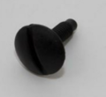
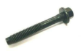
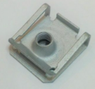
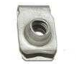
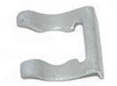
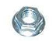
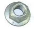
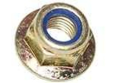
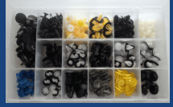

* LR028941: műanyag csavar a vonóhorogoz
  * 
  * https://www.lrparts.net/lr028941-bolt.html

 

* LR001080 - Bolt - M6 x 40mm, Multiple Applications
  * 
  * https://www.lrparts.net/lr001080-bolt-m6-x-40mm-multiple-applications-on-land-rover-and-range-rover-vehicles-priced-individually.html

 

* LR006719 - Retainer Nut for Multiple Uses
  * 
  * https://www.lrparts.net/lr006719-retainer-nut-for-multiple-uses-on-front-and-rear-bumpers-on-land-rover-and-range-rover-vehicles-genuine-land-rover.html

 

* RYH500170 - Nut and Speed Clip - Multiple Uses
  * 
  * https://www.lrparts.net/ryh500170-nut-and-speed-clip-multiple-uses-on-land-rover-and-range-rover-vehicles.html

 

* EJP7813 - Brake Pipe Spring Clip for Multiple
  * 
  * https://www.lrparts.net/ejp7813-brake-pipe-spring-clip-for-multiple-land-rover-and-range-rover-vehicles.html

 

* FY106046 - M6 Hex nylon locking Nut - Multiple Applications
  * 
  * https://www.lrparts.net/fy106046-m6-hex-nut-multiple-applications-on-land-rover-and-range-rover-vehicles-priced-individually-1

 

* FN106047L - M6 Flanged Nut
  *     

 

* M10 flanged nut:
  * FN110047
  * FX110047L
  * FX110046
  * 

 

* M10 nylon locking flanged nut
  * FY110056
  * 

 

KIT804 Trim Clip Selection Box - Discovery 3 & 4, RRS, Frelander 2, Evoque
* https://www.advancedfactors.co.uk/kit804-trim-clip-selection-box---discovery-3--4-rrs-frelander-2-evoque-1238394-p
* 