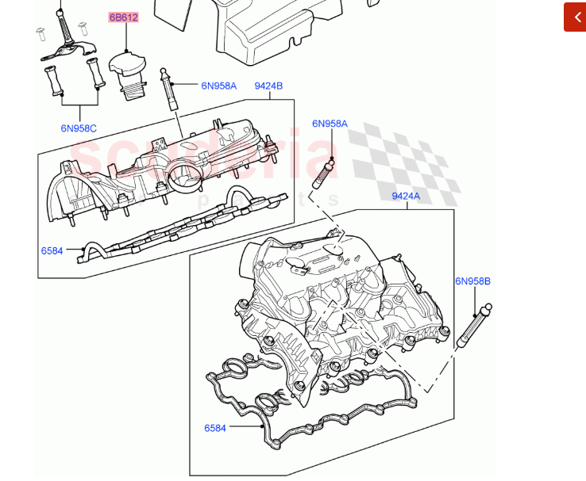
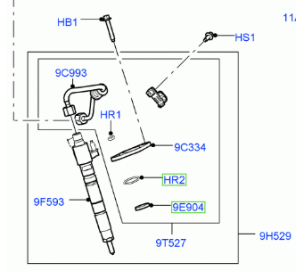
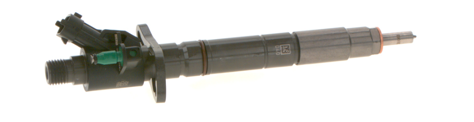
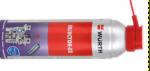
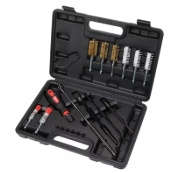

[ Switch to English](index-en.md)

# Part number

* https://landrover.scuderiacarparts.com/part-finder/landrover/range-rover-sport/oe/522
* https://landrover.scuderiacarparts.com/part-finder/landrover/range-rover-sport/oe/522/6077/121579

* intake manifold left: LR179201
* intake manifold right: LR179200
* oil feed pipe: LR053016
* gasket: LR166341

# Injector removal 

https://landrover.scuderiacarparts.com/part-finder/landrover/range-rover-sport/oe/522/6085/121602

* Bosch injektor – LR014205 / LR054297
* 9E904 - copper washer (legalúl):
  * Bosch F 00V C17 503
  * LR032818
* HR2 gumi gyűrű (középen): LR022992
* 9C993 - Fuel line: LR072253

## Kihúzók

* https://www.ebay.co.uk/itm/305372674419
* https://gebotools.hu/products/injektor-kihuzo-keszlet-csuszokalapaccsal-8-32mm
 

## Kiegészítők

* Würth Befecskendező Oldat Injector-Ex 250Ml
  * https://allegro.hu/termek/wurth-injektor-tisztito-oldoszer-injector-ex-88b91e99-a31b-4cc9-985a-8da99cad521f

    

* Liqui Moly Pro-Line injektor és gyújtó- izzítógyertya eltávolító spray 400ml LM3379
  * https://frenchautoparts.hu/Liqui-Moly-Pro-Line-injektor-es-gyujto-izzitogyert

* MA PROFESSIONAL injector grease 1400°

* Tisztító készlet: 
  * https://profibarkacs.hu/yato-befecskendezoszelep-tisztito-keszlet-19-reszes-1-4-inox-muanyag-rez-kefek
   