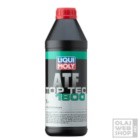
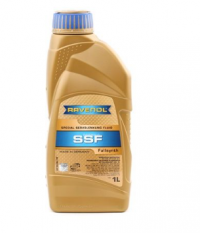
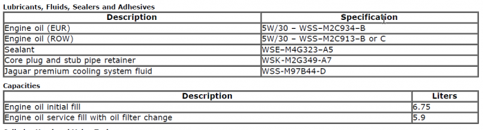
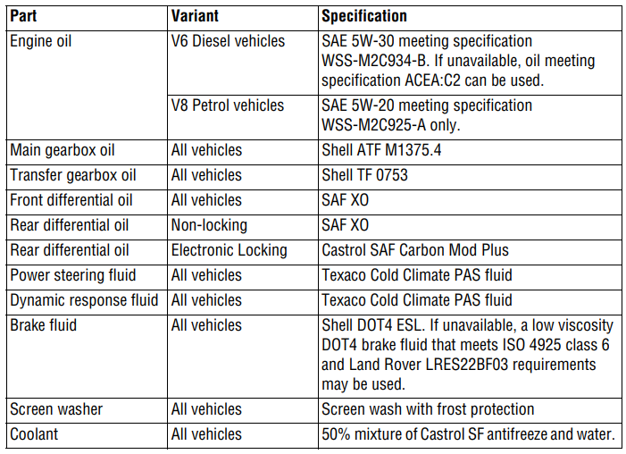
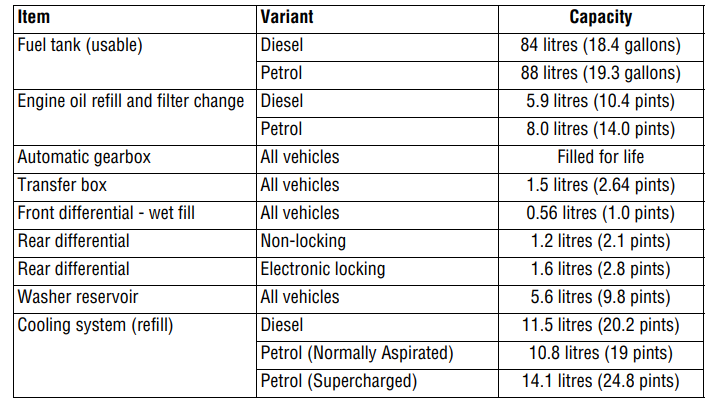
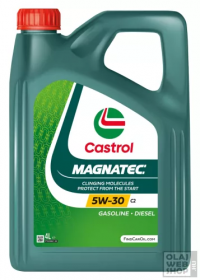

[ Switch to English](index-en.md)

## Power steering fluid / kormány hidraulika folyadék
- https://www.youtube.com/watch?v=Bzz4W3OU1zM
- https://www.youtube.com/watch?v=5Y_x1y5cH3E
 

A manual-ban ez van: **Texaco Cold Climate PAS fluid**
 

De ez már nem kapható itthon. Helyette az LR times alapján: 
 

### Helyettesítések

#### Liqui Moly
LIQUI MOLY TOP TEC ATF 1800 AUTOMATA VÁLTÓ ÉS SZERVÓOLAJ 1L  

https://www.olajwebshop.hu/liqui-moly-top-tec-atf-1800-automata-valto-es-szervoolaj-1-l/olajok/valtoolaj/valtoolaj-automatavaltokhoz/dexron-vi/liqui-moly-p319277.html

 
<!--  -->

#### Ravenol
https://www.autodoc.hu/ravenol/7668985

 
<!--  -->

Ezen a dobozon konkrétan rajta van a Land Rover specifikáció: Cold Climate PAS fluid

 

### Mennyi kell

4 liter kell belőle a cseréhez. A rendszerbe csak 3 liter kell, de a ahhoz hogy ki tudjuk nyomni a régit 4 liter kell. 

> **WARNING:** Ebből rátölteni nem szabad, de mivel az egészet kicserélem, nem baj ha nem pont ugyan olyan

### Tartály csere
A tartályt minden olajcserénél ki kell cserélni, mert a benne lévő szűrő nem újra felhasználható. 

https://www.ebay.com/itm/165534037729

 
<!--  -->

 

 

## Motor olaj

### Mit jelent az olaj jelölés

Így néz ki egy jelölés: 5w-40 B2

Ez az olaj SAE (Society of Automotive Engineers) szabvány szerinti viszkozitási osztályát jelöli.

A két szám jelentése:
- első szám 5W: Az olaj alacsony hőmérsékleten mutatott viszkozitását jelenti. A "W" a "Winter" (tél) rövidítése. Ez a szám azt mutatja meg, hogy az olaj milyen hideg hőmérsékleten marad folyékony. Minél kisebb a szám, annál jobb hidegindítási tulajdonságokat biztosít az olaj. A 5W például akár -30°C-on is megfelelő viszkozitással rendelkezik.
    - 0W: Akár -35°C-ig használható (a hidegindítási tulajdonságok megmaradnak).
    - 5W: Akár -30°C-ig megfelelő.
    - 10W: Akár -25°C-ig megfelelő.
    - 15W: Akár -20°C-ig megfelelő.
    - 20W: Akár -15°C-ig megfelelő.
- második szám 40: Az olaj meleg (100°C körüli) hőmérsékleten mutatott viszkozitását jelöli. A nagyobb szám nagyobb viszkozitást jelent, ami azt mutatja, hogy az olaj mennyire tudja fenntartani a kenőképességét magas hőmérsékleten.
Összefoglalva:
A 5W-40 egy széles hőmérséklettartományban használható, többfokozatú motorolaj, amely jól teljesít hidegben és melegben egyaránt.

**ACEA**: 

- Harmadik szám,  Teljesítményszintek: B2: Ez a ACEA (European Automobile Manufacturers Association) szabvány szerinti besorolás, amely az olaj teljesítményét és specifikációit mutatja.
    - Betűk: Motor típusát jelzik
        - A: Benzinmotorokhoz való olaj.
        - B: Könnyű dízelmotorokhoz való olaj (személyautók és kisebb haszongépjárművek).
        - C: Alacsony hamutartalmú, katalizátorbarát olajok (modern benzin- és dízelmotorokhoz, amelyek érzékenyek a kipufogógáz-utókezelő rendszerekre, pl. DPF).
        - E: Nehéz haszongépjárművek dízelmotorjaihoz.
    - Számok: Teljesítményszintek és különleges követelmények. A szám a teljesítményszintet és az adott osztály specifikus követelményeit jelzi. Például:
        - B1: Üzemanyag-takarékos olaj könnyű dízelmotorokhoz, alacsonyabb terheléssel.
        - B3/B4: Nagy teljesítményű személyautók vagy haszongépjárművek dízelmotorjaihoz. B4 különösen a közvetlen befecskendezésű dízelmotorokhoz ajánlott.
        - C1, C2, C3, C4: Alacsony hamutartalmú olajok, különféle modern motorokhoz és kipufogógáz-utókezelő rendszerekhez.
        - C1: Legszigorúbb követelmények alacsony hamutartalommal.
        - C3: Jó általános védelem és tisztítás, magasabb hamutartalom toleranciával.

    - Tehát: 
        - B: Dízelmotorokhoz ajánlott olaj. Ez a betű megkülönbözteti a dízelmotorokhoz (B) és benzinmotorokhoz (A) szánt olajokat.
        - 2: A szám a teljesítményszintet jelzi. A B2 például általános célú, kisebb teljesítményű személygépkocsi- vagy könnyű teherautó-dízelmotorokhoz ajánlott olajat jelent.
    - Összefoglalás
        - B1-hez közel álló C kategória: C1 vagy C2 (üzemanyag-takarékosság miatt).
        - B3-hoz közel álló C kategória: C3 (nagyobb teljesítményű motorokhoz).
        - Fontos: Ha modern dízelmotorod van kipufogógáz-kezelő rendszerrel (pl. DPF), mindenképpen C kategóriás olajat válassz, mert a hagyományos B kategóriás olajok károsíthatják a részecskeszűrőt!
 
 

**C3**:  

Stable, stay-in-grade engine oil with mid-SAPS Level, for aftertreatment system compatibility. Intended for use at
extended oil drain intervals in passenger car and light-duty gasoline & DI diesel engines designed for engine oils
with HTHS viscosity of minimum 3.5 mPas.
 

1. Stable, stay-in-grade engine oil: 
Ez azt jelenti, hogy az olaj stabil és megőrzi a viszkozitási osztályát (például 5W-40 vagy 10W-30) a használat során, még intenzív igénybevétel és hosszabb használat mellett is. Nem válik túl híggá vagy sűrűvé, így biztosítja a motor megfelelő kenését és védelmét az olajcsere-intervallum alatt.

 

2.  Mid-SAPS Level: 
- SAPS: Szulfáthamu (Sulphated Ash), Foszfor (Phosphorus), és Kén (Sulfur) tartalom.
- A Mid-SAPS azt jelenti, hogy az olaj közepes mennyiségű SAPS-t tartalmaz, ami megfelelő védelmet nyújt a motornak, ugyanakkor kompatibilis a modern kipufogógáz-utókezelő rendszerekkel, például:
    - Dízel részecskeszűrők (DPF).
    - Katalizátorok (TWC).
- Ez az egyensúly biztosítja, hogy az olaj nem károsítja ezeket a rendszereket, miközben a motor kopásvédelme is megfelelő.
 

3. Aftertreatment system compatibility
Ez azt jelenti, hogy az olaj kifejezetten összeegyeztethető a kipufogógáz-utókezelő rendszerekkel (pl. DPF, katalizátor). Az alacsonyabb SAPS szintek segítenek megakadályozni, hogy a részecskeszűrők eltömődjenek vagy a katalizátorok hatékonysága csökkenjen.
 

4. Intended for use at extended oil drain intervals: 
Az olaj hosszabb olajcsere-intervallumokra lett tervezve, ami azt jelenti, hogy tovább megőrzi kenési és védelmi tulajdonságait, mint a hagyományos olajok. Ez különösen fontos modern motoroknál, ahol az olajcsere-intervallumok gyakran meghaladják a 15-20 ezer kilométert.
 

5. Passenger car and light-duty gasoline & DI diesel engines
Az olaj használható:

Benzines személyautókban.
DI (Direct Injection) dízelmotorokban: Ezek a közvetlen befecskendezésű dízelmotorok nagyobb igénybevételt jelenthetnek az olaj számára, ezért fontos, hogy az olaj képes legyen ezekkel a rendszerekkel hatékonyan működni.
6. HTHS viscosity of minimum 3.5 mPa·s
HTHS: High Temperature High Shear (magas hőmérsékletű és nyírási viszkozitás).
A 3.5 mPa·s minimális érték azt jelenti, hogy az olaj magas hőmérsékleten, nagy nyírófeszültség mellett is megőrzi a kenési képességét.
Ez kulcsfontosságú a motor extrém körülmények közötti védelméhez, például nagy sebességnél vagy terhelésnél.
A túl alacsony HTHS viszkozitású olaj nem nyújtana elégséges kenést a motor mozgó alkatrészei számára, különösen nagy igénybevétel esetén.

 

 

**Viszkozitás** 

Egy motorolaj "40-es viszkozitása" a kinematikus viszkozitását jelenti meleg (100°C) üzemi hőmérsékleten, amely az olaj folyási tulajdonságaira vonatkozik, amikor a motor teljesen bemelegedett.

Mit jelent pontosan a 40-es viszkozitás?  

Az SAE (Society of Automotive Engineers) viszkozitási osztályozási rendszere szerint a "40-es" kategóriába tartozó olajok:
100°C-on a kinematikus viszkozitásuk 12,5 és 16,3 mm²/s (cSt) közé esik.
Az olaj viszkozitása elég magas ahhoz, hogy melegben is megőrizze a motoralkatrészek védelmét, miközben még megfelelően áramlik.

### Milyen olaj kell

Két helyen is megtalálható: 

Land rover workshop manual, powertrain: 47. oldal (Lubricants, Fluids, Sealers and Adhesives)

 {width="700"}
<!--  -->

 
 

Land rover sport owners manual, Technical specification szekció:  

https://topix.landrover.jlrext.com/topix/content/document/view?id=145022&groupId=1655#75f380ea-828a-450d-afb1-759d15fb4602!!1!46 
 

Típus: 

 
<!--  -->

Kapacitás: 

 
<!--  -->

- https://www.youtube.com/watch?v=Q4NeJrbor4s&t=1536s
- https://www.youtube.com/watch?v=YGvQAbM_YQY

> **WARNING:** Az LR time Krisztián szerint 5W-40 olaj kell a motorba, pláne ha öreg!! A 30-as olaj a magyar klímán túl híg lesz nyáron, mert ez már meleg klímának tekinthető

 

### Motorolaj
Ezt írja felhasználói kézikönyv: 

"SAE 5W-30 meeting specification WSS-M2C934-B. If unavailable, oil meeting specification ACEA:C2 can be used." --> https://topix.landrover.jlrext.com/topix/content/document/view?id=145022&groupId=1655#75f380ea-828a-450d-afb1-759d15fb4602!!1!46

- CASTROL MAGNATEC C2 5W-30 MOTOROLAJ 4L: https://www.olajwebshop.hu/castrol-magnatec-stop-start-c2-5w-30-motorolaj-4-l/olajok/szemelygepjarmu-olajok/5w-30-motorolaj/castrol-p1223464.html

 {width="200"}
<!--  -->

- STJLR.03.5005
    - 872592 Valvoline SynPower ENV C1/C2 -> https://www.autodoc.hu/valvoline/13625562

- WSS-M2C934-B

 

 

