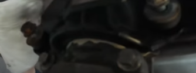

# glow-plug flux
izzító gyertya bekenése: **Metaflux 70-81**
* https://www.civishegesztohaz.hu/?t=1134
* 

# Camsaft bearing seal

Forrás:
* https://www.youtube.com/watch?v=PQ1DlNEYZoM&t=1279s
* idő: kb 6 perc környéke

Három helyen lóg ki a camseft a henger fejből: a két első timing belt poully, és hátul a magasnyomású üzemenyag puma poully-nál. A menetirány szerinti jobb oldalon van a vákum pumpa, de annak nem lóg ki így a tengelye. 

Ezen felül a tömítő gyűrűre is rakni kell körbe, be kell kenni, mielőtt berakjuk a helyére. 

A vákum puma esetben az illesztésre kell rakni egy-egy pöttyöt (utolsó kép)

>**WARNING**: A tengely teljesen tiszta kell legyen az olajtól a csapágy alatt. 

* **Loctite 518**
  * https://www.autodoc.hu/loctite/14431549
  * 
  
  

# cylinder head cover seal (Szelepfedél tömítés)

Forrás:
* https://www.youtube.com/watch?v=PQ1DlNEYZoM&t=1279s
* idő: kb 20:12

A camsaft három helyen jön ki a cylinder head conver alól, ott kell a tetejére nyomni a szigetelőt és kézzel elsimitíani. 

* **Elring dirko ht**
  * https://www.autodoc.hu/elring/15483203
  * 

  

# Transmission main service

https://www.youtube.com/watch?v=6UojaXtoLHY&t=711s

ZF 6HP

* Váltó felújító készlet a ZF-töl: 1068.298.062
* https://alkatreszek.hu/1068_298_062_0068_1?st=1068.298.062