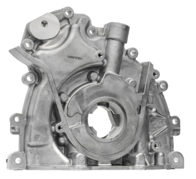
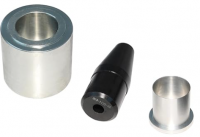
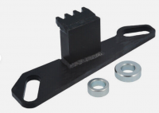

# Olaj szivattyú (oil pump)

Milyen márka kell: **Fomoco g2 1001**

https://www.jgs4x4.co.uk/discovery-4-3-0-tdv6-engine-oil-pump-fomoco-oem/

Video: 
- https://www.youtube.com/watch?v=ZdS5PDCwNlQ
- https://www.youtube.com/watch?v=lRZ37buT4pk&t=1047s

 
<!--  -->

Ha még sosem volt cserélve az olajpumpa, a 2. vezérszíj cserénél érdemes lehet kicserélni, ha már teljesen szétszedjük a motor elejét. A nehézség benne:
- ki kell szedni a főtengelyből a csavart, ami a szíj mozgató csigát tartalmazza. A csavar több mint 300 NM-re van húzva
- A csavar csak egyszer felhasználható 
- A főtengely tömítést is cseréni kell vele. 

A másik ok, ami miatt ki kell cserélni a pumpát a szíj cserével együtt, ha még a régi típusú pumpa van benne, aminek a teteje még nincs megerősítve. Ez a szíj feszítő cseréje után hajlamos letörni, és ha letörik, akkor a motor kuka. 2009 után talán már a megerősített pumpákat rakták bele. 

 
<!--  -->

A baloldalon a megerősített nyakú pumpa van, míg a jobb oldalon a régi típusú. 
Az új típusú pumpák 15%-al nagyobb olajnyomát tudnak elérni, mert vastagabb a rotor bennük. 

> **WARNING:** A szerelés megkezdése előtt tegyük üresbe a kocsit, később már nem lehet, és a motort majd fogtani kell és ha a kerekekkel össze van kapcsolva szinte lehetetlen

### Workshop manual
- Crankshaft Pulley: 134. oldal
- Crankshaft Front Seal: 130. oldal
- Oil Pump: 189. oldal

### OEM számok:
- LR076782 OEM Oil Pump
- LR096231 Oil Pump Gen 2
- 1102415 OEM Corteco Crankshaft Oil Seal
- 303-1121A LR Special Tool Crankshaft Front Seal Installer
- LR011952 Crankshaft pulley Bolt

### Alkatrészek:
- Szivattyú: ~ 70.000 Ft
    - FAI https://www.autodoc.hu/fai-autoparts/11793728 -> 80.000 Ft
        - (LR time is ezt használja: https://www.youtube.com/watch?v=z6sRSSltG8I)
    - https://www.germaxparts.com/land-rover-part/oil-pump-lr076782-lr013487-lr007798-gl1300/
- Tömítés (crankshaft sill): A pumpához adják
- Csavar: 
    - OEM num: LR011952
    - https://parts.landroverparamus.com/oem-parts/land-rover-crankshaft-pulley-bolt-lr011952
    - https://miamibritish.com/shop/land-rover-crankshaft-pulley-bolt-discovery-lr4-range-sport-velar-lr011952-oem/
- crankshaft pulley removal
- Tömítő paszta (hight tempt): 
    - https://www.advancedfactors.co.uk/471081-elring-sealing-silicone-70ml-941179-p.asp
    - https://www.ebay.co.uk/itm/276348179199
    - https://www.amazon.com/Permatex-81160-High-Temp-Silicone-Gasket/dp/B0002UEN1A?th=1

> **WARNING:** Sem a crankshaft bolt sem a seal nem újra felhasználható

### Szerszámok:
- Olaj nyomás mérő: https://www.ebay.co.uk/itm/284354587578-> 19 Font -> 9000 Ft
- Crankshaft sill felrakó: két részből áll. Az egyik egy kúp, amivel fel lehet húzni a főtengelyre a tömítést, de ez felesleges, mert adnak ilyet az olajpumpához műanyagból. A másik pedig arra való hogy pontosan a helyére nyomja 1mm mélyen a szigetelést a fészekben: 
    - OEM szám: 303-1120, 303-1121, 303-1122
    - 
 
<!--  -->

    - https://www.amazon.com/Crankshaft-compatible-Discovery-303-1121-303-1122/dp/B0CM3FRCZT
    - https://jlrequipment.service-solutions.com/en-GB/Pages/ItemDetail.aspx?SKU=303-1119

- Flywheel Locking Tool: a gyári leírás szerint ezt kell a lendkerékbe belerakni, hogy befékezze addig, amíg az iszonyatosan sok, 370 NM-eres erővel meghúzzuk a főtengely pulley csavart. Ezzel ellentétben az LR time youtube csatornán csinált egy kör alakú nyeles szerszámot, amit rácsavarozott a crankshaft pulley -ra, amine egy 1 méteres nyele volt, azzal tartott ellent. A starter motor helyére ül be. 
    - OEM: 303-1123
    - 
 
<!--  -->

    - https://www.ebay.com/itm/126411681043
    - https://www.ebay.com/itm/164459332282 -> 42.000 Ft
    - https://www.ebay.co.uk/itm/164459332282

- Timing Peg: egy kis pin, ami az önindító mögött egy lyukban a lendkereket fékezi be, de nem értem minek, ha a flywheel lock-ot is berakjuk, tök ugyan azt fékezzük. Ha csak a timing belt-t cseréljük, akkor csak ez kell. 
    - OEM: 303-1117
    - 
 
<!--  -->

    - Része a timing készleteknek, nem kell külön megvenni
    - https://www.ebay.co.uk/itm/125765478435

- Crankshaft seal removal: Ha csak a főtengely tömítést szeretnénk kicserélni, anélkül, hogy az olajpumpát levennénk, akkor egy spéci eszköz kell, ami kihúzza
    - OEM: 303-1118
    - 
 
<!--  -->

    - https://jlrequipment.service-solutions.com/en-GB/Pages/ItemDetail.aspx?SKU=303-1118

- Crankshaft pulley removal (Puller, General Purpose): egy általános lehúzó szerszám, amiből feltehetőleg jó az univerzális is. 
    - OEM: 303-D121
    - 
 
<!--  -->

    - https://jlrequipment.service-solutions.com/en-GB/Pages/ItemDetail.aspx?SKU=303-D121

### Olaj nyomás mérése
Workshop manual: 21. oldal (Engine Oil Pressure Check)

 

#### Olaj nyomás mérése az olajszűrön
Gyári megoldás
- 303-1451: https://jlrequipment.service-solutions.com/en-GB/Pages/ItemDetail.aspx?SKU=303-1451
- 303-871: https://jlrequipment.service-solutions.com/en-GB/Pages/ItemDetail.aspx?SKU=303-871

 
<!--  -->

#### Olaj nyomás mérés az olaj nyomás szenzor helyén
- LR time: Az olaj szenzor helyére, mellé lehet betekerni a mérőt. Az olaj szenzor 1/4 NTP menettel rendelkezik. 
    - 303-1451 : https://www.youtube.com/watch?v=604513GUKws
 

Ha az olajnyomás szenzor helyére akarjuk berakni, akkor szükség van egy hosszabbítóra, mert nagyon mélyen van a szenzor. 
- https://www.ebay.com/itm/296356911347
- https://www.youtube.com/watch?v=qsh3pJ2TKJ0&t=315s

 
<!--  -->

 

--------------------

 
<!--  -->

https://www.youtube.com/watch?v=MKYovvWWym0 (vége felé) 

#### Olaj nyomás mérők:
- https://www.ebay.com/sch/i.html?_from=R40&_nkw=oil+pressure+tester&_sacat=0&rt=nc&LH_PrefLoc=5&_oaa=1&_fsrp=1&_dcat=179480
- https://www.ebay.com/itm/315284939649

 
<!--  -->

 

 