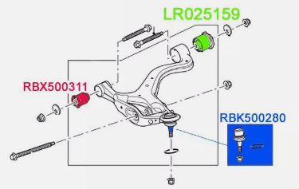
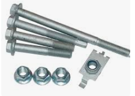

[ Switch to English](index-en.md)

<hr>

- [Bevezető](#bevezető)
- [Szerszámok](#szerszámok)
- [Első felfüggesztés](#első-felfüggesztés)
  - [Légrugók:](#légrugók)
  - [Front, lower suspension arms](#front-lower-suspension-arms)
    - [Replacemnt procedudre](#replacemnt-procedudre)
      - [Removal](#removal)
      - [Installation](#installation)
    - [Csavarok](#csavarok)
    - [Bushings](#bushings)
    - [Lengőkar](#lengőkar)
  - [Rods and hubs](#rods-and-hubs)
  - [Felső lengőkar](#felső-lengőkar)
    - [Csavar:](#csavar)
    - [Bushing:](#bushing)
    - [Lengökar:](#lengökar)
  - [Steering Gear Linkage](#steering-gear-linkage)
    - [Alkatrészek](#alkatrészek)
    - [Szerszámok](#szerszámok-1)
- [Hátsó felfüggesztés](#hátsó-felfüggesztés)
  - [Légrugók](#légrugók-1)
  - [Felső lengőkar](#felső-lengőkar-1)
    - [Replacement procedure](#replacement-procedure)
      - [Removal](#removal-1)
      - [Installation](#installation-1)
    - [Csavar](#csavar-1)
    - [Bushings](#bushings-1)
    - [Lengőkar](#lengőkar-1)
  - [Alsó lengőkar](#alsó-lengőkar)
    - [Replacement procedure](#replacement-procedure-1)
      - [Removal](#removal-2)
      - [Installation](#installation-2)
    - [Csavar](#csavar-2)
    - [Bushings](#bushings-2)
    - [Lengőkar](#lengőkar-2)
  - [Rods and hubs](#rods-and-hubs-1)
    - [Csavarok](#csavarok-1)
    - [Bushings](#bushings-3)
  - [Replacemnt procedudre](#replacemnt-procedudre-1)
- [All wheel aligment (futómű beállítás)](#all-wheel-aligment-futómű-beállítás)
  - [Bevezetés](#bevezetés)
  - [Mit is állítunk és miért?](#mit-is-állítunk-és-miért)
  - [Workshop manula táblázatok értelmezése](#workshop-manula-táblázatok-értelmezése)
  - [Szerszámok a méréshez](#szerszámok-a-méréshez)
  - [Mérés és beállítás menete](#mérés-és-beállítás-menete)
    - [Castor (utánfutás)](#castor-utánfutás)
      - [A mérés elmélete](#a-mérés-elmélete)
      - [Csúszos felület a kerék alá](#csúszos-felület-a-kerék-alá)
      - [A mérő álvány felszerelése](#a-mérő-álvány-felszerelése)
      - [-20° mérése](#-20-mérése)
      - [+20° mérése](#20-mérése)
      - [Castor kiszámítása](#castor-kiszámítása)
      - [Eredmény kiértékelése](#eredmény-kiértékelése)
    - [Camber](#camber)
    - [Toe in](#toe-in)
      - [Csőben cső + damil](#csőben-cső--damil)
      - [Toe alignment plate](#toe-alignment-plate)
      - [QuickTrick Alignment tool](#quicktrick-alignment-tool)


# Bevezető

> **WARNING:** A poliuretán bushing nem jó a disco 3, 4 és range rover l320-hoz, mert nincs külső acél burkuk, túl nagy erőt raknak így az arm gyűrűre, és ráadásul túl puhák


Az LR times Christian azt mondja, hogy csak három márkát szabad venni: 
- MEYLE: https://www.autodoc.hu/meyle/9882769, 75.000 Ft
- LEMFÖRDER: https://www.autodoc.hu/lemforder/13787953,  11.3218 Ft


# Szerszámok
all Joint Separator Ball Head Puller/removal
- https://www.amazon.de/gp/product/B01519ZUOA?ie=UTF8&psc=1&linkCode=sl1&tag=lrtime-21&linkId=c06619e3327dddac504f4ce382fca8c9&language=en_GB&ref_=as_li_ss_tl
- https://www.autodoc.hu/kunzer/15205481

 
<!--  -->

<br>

# Első felfüggesztés

https://landrover.oempartsonline.com/v-2011-land-rover-range-rover-sport--autobiography--5-0l-v8-gas/suspension--front-suspension

 
<!--  -->

<br>

## Légrugók: 


Angolul: air strut, Shock Assembly

https://landrover.oempartsonline.com/oem-parts/land-rover-shock-assembly-lr041108?c=Zz1zdXNwZW5zaW9uJnM9c3VzcGVuc2lvbi1jb21wb25lbnRzJmw9OSZuPUFzc2VtYmxpZXMgUGFnZSZhPWxhbmQtcm92ZXImbz1yYW5nZS1yb3Zlci1zcG9ydCZ5PTIwMTEmdD1oc2UmZT01LTBsLXY4LWdhcw%3D%3D


A VDC a Vehicle Dynamics Control rövidítése, ami magyarul járműdinamikai szabályozást jelent. Ez egy fejlett menetstabilizáló rendszer, amely az ESP (Electronic Stability Program) kibővített változata lehet.


* Without VDC: LR041108, LR032563  
* WIth VDC/VDS: LR032560 

<br>

* LR044836 6mm Voss Air Connector - Valve Blocks or Air Struts

  * https://www.advancedfactors.co.uk/lr044836-6mm-voss-air-connector---valve-blocks-or-air-struts-5225-p

<br>


| Márka / Típus                          | Származás / OEM státusz     | Minőség                | Ajánlás                                 |
|----------------------------------------|------------------------------|-------------------------|------------------------------------------|
| **Arnott AS-2809**                     | USA, utángyártott prémium    | ⭐⭐⭐⭐⭐ (OEM-szint)       | ✅ Legjobb minőség, hosszú távra         |
| **Dunlop DAS10117**                    | UK, OEM/gyári beszállító     | ⭐⭐⭐⭐⭐ (gyári szint)     | ✅ Ha valódi: kiváló választás           |
| **Miessler 1254-01-2866**              | DE, prémium aftermarket       | ⭐⭐⭐⭐☆                   | ✅ Stabil minőség, korrekt ár            |
| **STARK SKAST-1860010**                | DE, középkategória            | ⭐⭐⭐⭐                    | ✅ Jó ár-érték, elfogadható              |
| **KAMOKA 2070024**                     | PL, utángyártott              | ⭐⭐⭐⭐                    | ✅ Jó kompromisszum árban                |
| **TRUCKTEC 22.30.005**                 | DE, középkategória            | ⭐⭐⭐⭐                    | ✅ Megbízható, stabil alternatíva        |
| **ESEN SKV 58SKV712**                  | PL/DE, belépő-közép szint     | ⭐⭐⭐                     | ⚠️ Átmeneti használatra jó              |
| **Magnum APL009MT**                    | PL, belépő szint              | ⭐⭐☆                     | ⚠️ Olcsó, de tartóssági kompromisszum   |
| **MAXGEAR 11-0803**                    | PL, gyenge középkategória     | ⭐⭐☆                     | ⚠️ Csak ha nagyon fontos az ár          |
| **JAPKO MJAS021**                      | IT/JP, belépő szint           | ⭐⭐                      | ❌ Nem ajánlott hosszú távra             |
| **JAPANPARTS MM-AS162**                | IT/JP, belépő szint           | ⭐⭐                      | ❌ Csak átmeneti megoldás                |
| **KAVO PARTS SAS-10027**               | NL/JP, kevéssé elterjedt      | ⭐⭐☆                     | ⚠️ Inkább ázsiai modellekhez            |


Hol lehet venni: 
* https://alkatreszek.hu/as_2809_arn_sz
* https://www.autodoc.hu/jarmu-alkatreszek/legrugos-golyalab-15148/land-rover/range-rover/range-rover-sport-ls/32053-3-0-d-4x4


## Front, lower suspension arms

### Replacemnt procedudre

>**NOTE:** Ha tehetjük ne cseréljük ki a lengőkart, hanem újítsuk fel, csiszoljuk le, rozsdátlanítsuk, cseréljük ki benne a bushingokat. Az utángyárott lengőkarok nem méret helyesek, és sokszor minimumra/maximumra kell tekerni a beállító csavarokat ahhoz, hogy a kívánt futómű értéket megkapjuk. 

<br>
<br>


>**Before you begin**: 
> * Mindig vegyünk új csavarokat
> * 24mm-es hosszított dugúkulcs kell 
> * Biztosan szükség lesz futómű állításra, mert minden lengökar egy picit más méretű. 
> * Legyen 24mm-es crowfoot spanner-ünk. 
> * Készüljünk fel rá, hogy a tie-rod teljes egészében cserélni kell (ha be van rohadva) tehát ezeket előre vegyük meg, és hozzá a gumi harangot is (robber boots). 
> * A tie-rod cseréhez legyen removal tool-unk, amivel a kormányműböl ki lehet tekerni
> * Legyen kék loctite a tie-rod visszarakásához 


>**WARNING**: A tie-rod lock nut nem metrikus, hanem finom menet, sima nut-al nem helyettesíthető. 


#### Removal

1. Tegyük az autót access height -ba.
2. Csak előre tegyünk rámpát, hátra ne. 
3. Álljunk fel a rámpára, és ha tudjuk engedjük ki a levegőt a légrugókból és a tartályból is az iCarsoft-al. 
4. Tegyünk a hátsó kerekek mögé ékeket, hogy ne tudjon hátra gurulni 
5. <span style="color: red; ">Húzzuk be a kéziféket !!! és ellenőrizzük, hogy a hátsó kerekek mögött van e ék!!!</span>. 
6. Emeljük föl bőven annyira az autót, hogy legyen annyi lelógása a keréknek, hogy 'ride height'-ba tudjuk tenni. (462 mm). Tehát ennél magasabbra kell emelni azt az oldalt, amelyik kereket le akarjuk venni, mondjuk 480 mm-re. Az emeléssel párhuzamosan a bakot folyamatosan húzzuk felfelé már a helyén tartva. Mindig nagyon figyeljünk rá, hogy az emelő nem csúszik e le az alvázról. 
7. Lazítsuk ki a kerékcsavarokat
8. Egy kis emelővel emeljük fel a kereket pont annyira, hogy ride height-ba kerüljön, vagyis pont 462 mm-re legyen a kerékdobtól a kerék közepe. Ehhez egy 2x4-es állított pallót használjunk. 
9.  Vegyük ki a rámpát a kerék alól, majd engedjük vissza a kereket. 
10.  Vegyük le a kereket. 
11.  Szedjük le a ball-join anyáját.
12.  Nyomjuk ki csapágy kinyomoval a ball-join-t a wheel knuckle-ből. 
13.  Ha nem akarjuk megtartani a ball-joint-tot, akkor a legjobb, ha levágjuk sarokcsiszolóval a wheel knuckle -ból lefelé kilógó részét, mert akkor klasszisokkal egyszerűbb lesz kiszedni. Nagyon figyeljünk, hogy ne húzzuk túlságosan kifelé a wheel knuckle-t, mert kiesik a féltengely. 
14.  Szedjük ki az air-strut csavarját. Ez lehet hogy nagyon nehezen fog kimenni, ha túl sok levegő maradt a rendszerben. A szétszedésnek talán ez a legnehezebb része 
15.  Jelöljük meg fehér jelölővel az alvázhoz rögzítő csavar és az anyákat is, és számozzuk őket be egytől négyig. Ezeket majd át kell jelölni az új csavarokra és anyákra.  
16. Szedjük ki az alvázhoz rögzítő csavarokat 
17. Forgassuk ki a lengőkart a ball-joint-ból. Ha az air-strut-ba túl sok levegő van, akkor nagyon ki fog lógni elfelé és nehéz róla lemozgatni. 


#### Installation

>**WARNING**: Copper grease-t csak a csavarok perselyben lévő részére szabad tenni, a menetre nem. Nagy nyomatékra húzott csavarok esetén ez tilos. 

>**WARNING**: Mindenképpen tegyük copper grease-t minden csavar szárára !

>**WARNING**: Minden olyan bushing-ot ami gumi-fém kapcsolat, csak ride-height-ban szabad nyomatékra húzni. 

>**WARNING**: Nagyon figyeljünk, hogy a wheel knuckle -t sose tekerjük annyira ki, hogy a féltengely kiessen a helyéről, mert akkor azt szedhetjük szét. Tehát amikor a ball-join csavart ki-be rakjuk, akkor erre mindig nagyon figyeljünk, hogy mennyire feszítjük kifelé. 

1. Ha nagyon kilóg az air-strut lefelé, akkor elsőként húzzuk rá a lengőkart
2. Tegyük be a ball-join csavarját, amit nagyon nehéz bejátszani. 
   * Ha nagyon nehezen megy be, akkor le kell belőle vágni egy picit felx-el (hasonlítsuk össze a régivel, ha hosszabb, le kell belőle vágni)
   *  van benne egy belső imbus, ami a meghúzást segíti, de nem baj, ha az nem marad meg
   * úgy is meg lehet majd húzni, hogy megfeszítjük. Lényeg, hogy vágjuk le akkorára, hogy beférjen, mert van olyan márkájú ball-join, ami túl hosszú :( 
   * Nagyon figyeljünk, hogy ne húzzuk túlságosan kifelé a wheel knuckle-t, mert kiesik a féltengely. 
3. Tegyük be a lengökart az alvábhoz tartó fülekbe. 
4. Kenjük be jó alaposan "copper grease"-el a csavarok perselyben lévő részét. De a menetre SEMMI képen se kenjünk !! A nagy nyomatékra húzott csavarok esetén nem szabad sosem a menetre tenni !! mert túlfeszítheti !!
5. Jelöljük át az új csavarokra a pozocítiót (Ha nem Land Rover karkoat használunk, akkor ez majdnem hogy felesleges, mert az új karok köszönő viszonyban sem lesznek a gyárival, tuti, hogy tök máshova kell rakni a csavart). 
6. Tegyük be az alváz csavarokat a helyére és lazán tekerjük rá az anyákat. Ne felejtsük el, hogy alátétet kell rakni az anya alá!
7. Tegyük be az air-strut csavarját. 
   - Ha nagyon előre áll, akkor egy spaniferrel húzzuk a helyére. 
   - Ha kilóg lefelé, akkor engedjük lentebb a felfüggesztést, hogy a csavar a helyére kerülhessen
8.  Tegyük rá az air-strut anyáját, de azt se húzzuk meg. 
9.  Emeljük egy emelővel a tengleyt ride-hight-ba. (64 mm)
10. Húzzuk meg az air-strut csavarját nyomatékra.(300nm) 
11. A camber beállításnak itt még nincs értelme, mert elősként a Castor (utánfutás) szögét kell beállítani, de azt csak akkor tudjuk kimérni, ha már rajta vana kerék
12. Huzzuk nyomatékra az alváz csavarokat. 
     * A bal lengőkaron a hátsó csavart nem lehet nyomatékra húzni a kipuffogó dobtól. 
     * Elképzelhető hogy egy 24mm-es crowfoot spanner-el meg lehet húzni. 
13.   Lazítsuk ki a tie-rod lock-nut-ját, hogy felkészüjünk a toe beállításra.  
    * A rudat nem kell hozzá megfogni villáskulcsal, a ball-join ütközésig el fog közben tekeredni, aztán megfeszül. 
    * Ehhez a legjobb ha egy 24mm-es crowfoot spanner-t használunk. (A nyomatékra húzáshoz feltételn kell majd)
    * Ha nem jön, akkor fákjázzuk meg és úgy próbáljuk. Ha úgy se jön, akkor sajnos le kell vágni és új tie-rod kell. 
    * Ha ki kell szedni a tie-rod outer részét, vagyis a ball-joint akkor abból is újat kell venni, mert nem fog visszamenni a helyére, ha már túl rozsdás. 
14.  Tegyük fel a kereket, majd tegyük vissza alá a rámpát
15.  Vegyünk ki mindent az autó alól. Engedjük le az autót.   
16.  Végezzük el a futómű állítási procedurát. 
17.  Huzzuk meg a kerék anyákat 


>**WARNING**: Ne felejtsük el meghúzni nyomatékra a tie-rod lock nut-ot és a kerék csavarokat !!!!


youtube: 
- https://www.youtube.com/watch?v=DbPh-lMqOII&t=1145s
- https://www.youtube.com/watch?v=3lGsfB4pyts&t=719s


### Csavarok

- HB2 -> alvázhoz erősítő csavar 2x: RDI000034
- HS1 -> légrugó befogó csavar 1x: RYG000440
- HN2 -> alvázhoz erősítő + légrugó anya 3x, M16:FX116056
- HN2 -> ball joint anya 1x, M16: FX116056 (LR079261)
- HW1 -> alvázhoz rögzítő alátét elől: RYF000203 
- HW2 -> alvázhoz rögzítő aláltét hátul: RYF000203


Készlet: 
- https://www.ebay.co.uk/itm/115604506564
- https://www.autodoc.hu/fai-autoparts/12117625
- https://www.autodoc.hu/bga/13595167

 
<!--  -->


### Bushings

- 5A638 -> hátsó nagy bushing: LR055291
  - febi: https://www.autodoc.hu/febi-bilstein/7940443
  - meyle: https://www.autodoc.hu/meyle/9882701 
- 3068 -> első kicsi: LR055288
  - meyer: https://www.autodoc.hu/meyle/9882701
- 3050B -> ball joint: RBK500300
   - Meyer: https://www.autodoc.hu/meyle/7517662
   - Lemfölder: https://www.autodoc.hu/lemforder/1267753
   - ABS: https://www.autodoc.hu/abs/7802685


### Lengőkar 

> **WARNING**: | Több méretben van lengőkar a Rage Rover Sport-hoz, az évjárat nagyon fontos. Mindig ellenőrizzük le az OEM számot 

https://landrover.oempartsonline.com/oem-parts/land-rover-lower-control-arm-lr029301?c=bD01Jm49U2VhcmNoIFJlc3VsdHM%3D

- JOBB: OEM: LR029301
  - https://www.autodoc.hu/stark/8348007
- BAL: OEM LR029302
  - https://www.autodoc.hu/stark/8346532

  

Ezek a jó méretek


<br>

## Rods and hubs


1. Hub & Bearing: LR076692
2. Knuckle, 
   - front left: RUB500330
   - Knuckle, front right: RUB500320
3. Shock Assembly: LR016415

.11. Stabilizer Bar: LR017423
12.  Stabilizer Bar Bushing: LR018347
13.  Bushing Bracket: RBU500042
7.  Stabilizer Link, left: RBM500150
8.  Stabilizer Link, righ: RBM500140
9.  Stabilizer Link Washer: RYF500120


<br>

## Felső lengőkar

 
<!--  -->


### Csavar:
- HB1 -> Csavar 2x alvázhoz, M14 X 80MM: RYG000420 
- HN3 -> Anya 2 x alvához: FY114056
- HM1 -> ball joint nut,  1 x: FY112056
- HN1 -> Anya 1x, 14 mmm: NY214047   

Készlet: 
- https://www.ebay.co.uk/itm/255829034949
- https://www.ebay.co.uk/itm/125613920148
- https://www.ebay.co.uk/itm/116389214336
- https://www.jgs4x4.co.uk/land-rover-discovery-3-4-range-rover-sport-rear-hub-upper-suspension-arm-to-hub-bush-bolt-ryg000384/


### Bushing:

- 9F955 -> 2x: RBX500301, LR051625
  - lemförder: https://www.autodoc.hu/lemforder/1272462
- 3050A -> ball joint: RBK500170
  - meyle: https://www.autodoc.hu/meyle/8344206
  - febi: https://www.autodoc.hu/febi-bilstein/7618053
  - lemförder: https://www.autodoc.hu/lemforder/1267751


### Lengökar:

- Bal, első felső: LR063688
- Jobb, első felső: LR063711
  - febi: https://www.autodoc.hu/febi-bilstein/17401906
  - ABS: https://www.autodoc.hu/abs/8160021

<br>

## Steering Gear Linkage

* https://landrover.oempartsonline.com/v-2011-land-rover-range-rover-sport--autobiography--5-0l-v8-gas/steering--steering-gear-and-linkage
* Workshop manual: Steering Linkage - Tie Rod -> 674. oldal

### Alkatrészek


1. Inner Tie Rod: QFK500030
2. Inner Tie Rod Adjust Nut: QYH000021
3. Outer Tie Rod: LR010676
4. Outer Tie Rod Nut: QYH500160
5. Boot Kit: QFW500020


<br>

### Szerszámok


Az inner tie rod kormánymű felőli gömbfej kiszedéséhez egy speciális szerszám kell, amivel ki tudjuk tekerni és vissza tudjuk tekerni 100 Nm-re. 


https://www.autodoc.hu/energy/13638402

Ehhez kell egy jó hosszú hosszabbító is, hogy a féktárcsán kívülre érjen a vége. 

<br>
<br>

A **locking nut** csavarásához egy 24mm-es crowfoot wrench kell, aminek magyarul számtalan neve van. 
* hollander kulcs
* kakasláb kulcs 
* ....


<br>

--------------------------------------------------------------------------------------

# Hátsó felfüggesztés

## Légrugók 


https://landrover.oempartsonline.com/oem-parts/land-rover-shock-assembly-lr041110?c=Zz1zdXNwZW5zaW9uJnM9cmVhci1zdXNwZW5zaW9uJmw9MTQmbj1Bc3NlbWJsaWVzIFBhZ2UmYT1sYW5kLXJvdmVyJm89cmFuZ2Utcm92ZXItc3BvcnQmeT0yMDExJnQ9YXV0b2Jpb2dyYXBoeSZlPTUtMGwtdjgtZ2Fz


* Without supercharger, without roll control: LR041110
* With variable damping susp: LR032652


## Felső lengőkar


### Replacement procedure

>**WARNING**: A fékfolyadék nem kerülhet semmilyen festett felületre, mert feloldja a festéket. Azonnal mossuk le szappanso vízzel ha kifolyik 

>**Before you begin**: 
> * Mindig vegyünk új csavar készletet
> * A wheel nockle ball join-tokat szét kell vágni. A kiszedésükhöz speciális szerszám kell, ezek legyenek meg, meg az új perselyek is. 
> * Legyen 21mm-es crowfoot spanner-ünk az alváz csavarokhoz
> * Legyne 11mm-es crwofoot spanner-ünk a fékcső levételéhez
> * Legyen 18 mm-es hosszított dugókulcs az upper ball-join camber állító anya meghúzásához
> * Kellegy 27 mm-es crowfoot spanner a toe-link lock-nut meghúzásához. 
> * 24mm-es hosszított dugúkulcs kell 
> * Legyen 2db M10x1x10mm -es hernyócsavarunk (vagyis 1 mm-es, finom emelkedésű csavar) amivel a fékcsöveket ledugozzuk a szerelés idejére. 
> * Kell szorító fogó, a fékcső átmeneti összeszorítására, amig ledugozzuk
> * Kell 2-4 szett orrfürszélap fémhez a csavarok esetleges kivágásához
> * Biztosan szükség lesz futómű állításra, mert minden lengökar egy picit más méretű. 
> * Legyen pót fékcső:  [a kemény szakasz](../breaks/breaks.md#fékcsövek-felújítása). Ez nagyon gyakran elrohad és általában cserélni kell. 
> * Legyen új tie-rod és stabilizer link
> * A művelet végén légteleníteni kell majd a fékrendszert. Lásd [itt](../breaks/breaks.md#break-fluid-bleeding)


>**NOTE**: Ha a bushing belseje együtt forog a csavarral, ahogy a lengőkart, vagy a csavart forgatjuk, akkor az bele van rohadva, azt a bushingot ki kell vágni, tuti nem fog kijönni. Az ilyen bushing már nem tompít, mert le van szakadva a külső részről. 

#### Removal 
1. Szorítsuk el a fékcső felső részét egy szorító fogóval, hogy ne folyon ki sok fékfolyadék
2. Csavarjuk ki a fékcső két végét, a meglazítást a crowfoot spanner-el csináljuk. 
3. Dugózzuk le mind a két szabadon maradt részt az M10x1x10-es finom menetemelkedésű csavarral 
4. Szigetelőszalaggal ragasszuk le a kivett fékcső darab mind két végét, nehogy kosz menjen bele. 
5. Vegyük le a az abs és sebesség szenzorokat. 
6. Jelöljük meg a pozícióját a wheel knuckle bushing bolt -nak és alátétnek. Ezek is állító csavarok, ezek állítják a bedölést.  
7. Vegyük le a kopás jelző, ABS és sebesség jelző vezetékeket (az egyik oldalon 2 van a másik oldalon 1)
8. Ha a wheel knuckle bushing be van rohadva, azt is orrfürészel tudjuk kivágni. Nagyon vigyázzunk, hogy nehogy belevágjunk az alvázba vagy a lengőkarba. 


#### Installation 
A felső lengőkar visszahelyezése elég egyszerű, nem igényel semmilyen speciális mozdulatot, vagy trükköt. 

### Csavar


 
<!--  -->


- HB2 → Alvázhoz rögzítő csavar, elől: FC114206
- HB5 → Alvázhoz rögzítő csavar, hátul: FC116216
- HB3 → top knuckle hub bolt: RYG000384
- HN1 → Alvázhoz rögzítő anya füllel, hátul: RYH501060
- HN2 → Alvázhoz rögzítő anya füllel, elöl: RYH500280
- HN3 → top knuckle hub nut : RYH500191
- HW1 → top knuckle hub nut washer: RYF000182


Készlet: https://www.ebay.co.uk/itm/316105477430 (megvéve)


### Bushings

- 9F955A -> hátsó 1x: RHF500130
  - lemfölder: https://www.autodoc.hu/lemforder/1272700
  - ABS: https://www.autodoc.hu/abs/9413711
- 9F955B -> első 1x: LR063744
  - meyle: https://www.autodoc.hu/meyle/13586487
  - febi: https://www.autodoc.hu/febi-bilstein/12827798


### Lengőkar
- bal felős lengőkar: LR063718
- jobb felső lengőkar: LR063719

<br>


## Alsó lengőkar


### Replacement procedure

#### Removal
Itt nincs semmi extra trükk. 
Ha a toe link-et is cseréljük, akkor annak az anyáját legjobb ha levágjuk, nem eröltetjük mert megsérülhet az alvázon a kis horony, amibe beleül. 

#### Installation

1. Mindig a felső legnőkart tegyük be elsőként, úgy egyszerűbb lesz az alsót, és így kevésbé kell félni attól, hogy kihúzzuk a féltengelyt a helyéről. 
2. Az egész felfüggesztést fel kell emelni olyan magasra amennyire csak engedi a felső legőkar, és tegyünk be alá egy függőleges pallót, hogy megtartsa a legfelső pozícióüban, csak itt fogjuk tudni a lower ball-join-ra ráhúzni az alsó lengőkart. 
3. Huzzúk rá a ball join-ra a lengőkart. Ha az air strut nagyon kilóg lent, akkor elősként játszuk át rajta, és úgy huzzuk rá. Nagyon vigyázzunk, nehoz kiszúrjuk a gumi harangot ahogy ráhúzzuk !!!
4. Tegyük be a ball-join csavart (persze jól bekenve copper grease-el. )
5. Most engedjük le a futóművet amennyire csak lehet, és az alváz felöli végét tegyük a helyre, majd mehetnek be a csavarok, persze jól bekendve rézpasztával. 
6. Tegyük be az air strut csavart. Ha nagyon előre áll, akkor egy spanfierrel húzzuk a helyére és engedjük le annyira a futóművelt, hogy a helyére menjen. 
7. Csak ride hight -ba húzzuk majd meg nyomatékra a csavarokat. 
8. Szereljük vissza kézifék tartó kampót. 


### Csavar

- HB1 -> légrugó csavar
- HB4 -> alváz csavar, elől, M16x160: KYG000240
- HB5 -> bottom knuckle bolt: FC116216
- HB6 -> alváz csavar, hátul, M16x155: KYG500270
- HN4 -> alvázhoz első anya, légrugó anya, bottom knuckle nut, 3x  M16: FX116056
- HN5 -> alvázhoz anya füllel, hátsó: RYH500052


Készet: https://www.ebay.co.uk/itm/225275179043


### Bushings
- 9F955C -> első: LR051611
   - febi: https://www.autodoc.hu/febi-bilstein/9804666
- 9F955D -> hátsó : LR054831
   - Mayle: https://www.autodoc.hu/meyle/13586488
   - Lemförder: https://www.autodoc.hu/lemforder/1272150


### Lengőkar
- Jobb: LR019977
- Bal: LR019978

<br>

<br>


## Rods and hubs

https://landrover.oempartsonline.com/v-2011-land-rover-range-rover-sport--autobiography--5-0l-v8-gas/suspension--rear-suspension


1. Rear Hub: RUC500120
2. Wheel Bearings: LR045917
3. Knuckle, left: LR045825
4. Knuckle, right: LR045824
5. Tie Rod Assembly: LR019117
6. Stabilizer Link: RGD500140, RGD000312
7. Stabilizer Bar Link Nut: FY110056
   * https://www.ebay.com/itm/404792972067
8. Tie Rod Assembly Bolt : RYG501580
    *  https://www.ebay.com/itm/376036370999
9. Tie Rod Assembly Nut RYH500116
    * https://www.ebay.com/itm/266263858825


### Csavarok
- HS1 -> anti-roll bar bushing mounting point bolt: 
- XXX -> anti-roll bar bushing mounting point nut: 
- HN6 -> stabilizer bar link connection point nut: 
- HN5 -> wheel hub retaining nut: 
- HC1 -> bushing seal / spacer washer:
- HC2 -> wheel bearing retaining ring:
- HC3 -> retaining clip:


### Bushings

- 5K792A ->  TOP KNUCKLE HUB BUSHING: RHF500100
   - febi: https://www.autodoc.hu/febi-bilstein/7623985
   - meyle: https://www.autodoc.hu/meyle/8119742
- 5k792B -> BOTTOM KNUCKLE HUB BUSHES: LR032644
   - meyle: https://www.autodoc.hu/meyle/16434965
   - febi: https://www.autodoc.hu/febi-bilstein/7697867
   - lemförder: https://www.autodoc.hu/lemforder/1266991

<br>


## Replacemnt procedudre

>**Before you begin**: 
> * Mindig vegyünk új csavarokat: suspension arm csavarok, toe link csavar és anya
> * Legyen legalább 3 penge a sawsaw penge mert a csavarokat azzal kell kivágni 
> * 24mm-es hosszított dugúkulcs kell az alsó suspension bolt-okhoz
> * 18 mm-es hosszíott dugó kulcs kell az upper ball join meghúzásához
> * 21 mm-es racsnis csillagkulcs kell az upper rear bolt kivételéhez
> * 19 mm-es varjúláb kulcs kell swaybar linkekhez (crowfoot spanner)
> * Biztosan szükség lesz futómű állításra, mert minden lengökar egy picit más méretű. 
> * Legyen 24mm-es crowfoot spanner-ünk. 
> * Készüljünk fel rá, hogy a tie-rod mind két részét cserélni kell (ha be van rohadva) tehát ezeket előre vegyük meg. 
> * A rear toe link kiszedéséhez legyen removal tool-unk (ugyan az ami a front tie rod kivételéhez kell)
> * vegyünk új toe link bar-t és új sway bar linkeket 
> 


---------------------------------------------------------------------------------
# All wheel aligment (futómű beállítás)


## Bevezetés
- youtube beállítás lift nélkül: https://www.youtube.com/watch?v=jrA24Rz0O6g

<br>

Workshop manual, chassis: 6. oldal
A kerekeknek be kell állítani a függőleges dőlési szögét, és a kerék össze ill. széttartását egymáshoz képest. A függőleges szög állítást hívják **camber**-nek, míg a kerekek széttartást hívják **toe**-nak. itt van toe-in és toe out. 

A workshop manual-ban 5 táblázat bal (LHD) és jobb (RHD) kormányos autókra, első és hátsó tengelyre és motor típusra. 
- első kerék: **Wheel Alignment Specification (All Markets) - Front LHD - Vehicles with 5.0L Naturally Aspirated and diesel vehicles without Dynamic Response**
- hátsó kerék: **Wheel Alignment Specification (All Markets) - Rear**
<br>


## Mit is állítunk és miért? 
Minden keréken három dolgot kell állítani: 

- **Camber angel**: a kerék befele vagy kifele döl. 

 {width="400"}
<!--  -->


<br>

- **caster angle**: utánfutás, ami azt mondja meg, hogy a kerék a felső befogási pontjához képest menetirány szerint előre vagy hátra néz. Akkor tud a kerék magától egyenesbe állni, ha kicsit előre áll. 

 {width="400"}
<!--  -->

<br>

- **Toe angle**: a kerekek összetartása vagy széttartása. Ha menetirány szerint a kerék eleje széttart, az a negatív irány (toe out) és ha a kerék hátulja tart szét, vagyis a kerék eleje tart össze, az a toe-in, a positive irány. 

 {width="300"}
<!--  -->


<br>


## Workshop manula táblázatok értelmezése
Miden kerékre és mind a három típusra van egy ilyen táblázat: 

 
<!--  -->

- Minden értékre van érték a bal és a jobb kerékre menetirány szerint (left-hand, right-hand) és a kettő különbsége a 3. oszlopban (Total/Balance)
- Minden kerékre tehát meg van adva az első oszlopban felül az ideális érték: **Nominal**és mellette, hogy ez mennyit térhet el:**Tolerance**
- Minden kerékre meg van adva a minimum és a maximum dőlés, ami nem más mint a **Nominal**-bol kivonva és hozzáadva a tűrés. 

Példa: <br>

Nézzük meg az első kerekre vonatkozó **Camber** értéket. 
- a bal kerék 0.38˚-ban kell hogy befelé dőljön ideálisan. 
- ettől +-0.75˚-ban térhet el. Ebből következik a min-max érték
- max érték: -0.38+0.75 = 0.37°
- min érték: -0.38-0.75= -1.13°
- az utolsó oszlop mindig a bal és a jobb kerék különbsége, pl a nominális értékre: 0.38-0.5 = 0.12°


## Szerszámok a méréshez

>**WARNING**: A méréshez kell egy sima, egyenes ajzat, nem kell hogy tökéletesen vízszintes legyen, de egyenletesen lejtsen minden irányban, ne legyenek rajta huplik

**Digitális szögmérő (protractor)**

- PRO360 – PRO 360 Digital protractor: https://www.leveldevelopments.com/products/inclinometers/digital-inclinometers/pro360-pro-360-digital-protractor-range-360-resolution-0-1/

 
<!--  -->

- https://www.ebay.com/itm/405365107182
- https://www.conrad.hu/hu/p/laserliner-masterlevel-box-081-260a-digitalis-vizmertek-magnessel-28-mm-3058922.html
- https://www.conrad.hu/hu/p/digitalis-vizmertek-1-mm-laserliner-digilevel-plus-25-081-249a-2445725.html
- https://www.elektrobot.hu/termek.php?filename=1635.html&i=1635
- https://hasznostermek.hu/P/19/hw300-digitalis-vizmertek


Olyan mérő kell, amit ki lehet nullázni, így nem baj ha nem tökéletesen egyenes talajon vagy a kocsi. A földre leteszek egy öles lécet, ráteszem a mérőt, és kinullázom, majd utána rakom rá a kerékre, és akkor már levonja/hozzáadja a talaj lejtést. 
<br>

**Aluminium zártszelvény**


**Derékszög vonalzó háromszög**


**Elektromos védőcső és damil**


**Kereszt lézer**


<br>

## Mérés és beállítás menete

Nagyon fontos a sorrend, az alábbi sorrendben kell a beállítást elvégezni: 
1. Castor (utánfutás elől)
2. Camber (dőlés, ezt elől és hátul is)
3. Toe in (elől és hátúl is)

Azért kell ebben a sorrendben csinálni, mert a castor álltás felülcsapja a camber állítást, és a camber állítás meg a toe-ra van hatással. 

Mindig úgy kell beállítani a jobb és a bal oldalt, hogy a különbség kisebb legyen mint a maximális megengedett különbség a manual alapján. 

### Castor (utánfutás)

#### A mérés elmélete
Az utánfutást egy delta camber-böl tudjuk kiszámolni. Megmérjük hogy mennyi a dőlés változása -20° és +20°között. (bármilyen szög tartományt választhatunk, de a -20+20 nagyjából a teljes kiforgása a kormányzott keréknek és minél nagyobb a mért tartománny, annál pontosabb lesz a végeredmény. A delta camber-böl az alábbi módon számítható ki az utánfutás. )


LibreOffice calc-ban ez az alábbi: 
```
=ROUND(B5 / (2 * SIN(RADIANS(B4))), 2)
```
Ahol:
* B5: Delta castor
* B4: a mérési tartomány, ami mindig 20°. Tehát az egyenes keréktartáshoz képest ennyivel tekerjük jobbra majd balra a kormánykereket. 


#### Csúszos felület a kerék alá
Mind a két kormányzott kerék alá kell egy csúszos felület, amin a kormányzás közben a kerék könnyen el tud fordulni. Ehhez a legjobb két vastag zacskó réteg közé fújt WD40, majd erre álljunk rá a kocsival. Az is jó, ha egy zacskóra ráraunk egy kartonpappirt és arra állunk rá. 

#### A mérő álvány felszerelése

Elsőként fel kell szereljünk egy aluminium zártszelvényt a talajhoz képest tökéleteses függőlegesen a kerék középvonalában: 


Ehhez a kovicsal párhuzamostan le kell tenni egy alu vonalzót (minél hoszabb abbnál jobb), majd azon kinullázni a protractort. Majd tegyük rá 90 fokot elforgatva a zártszelény oldalára, tehát ne abban a síkban, ahogy a háromszög van a képen, hanem az oldalára függőlgesen, hogy elérjük, hogy a zárszelény tökéletesen 90 fokot zárjon be a földön lévő alu vonalzóval. Húzzuk meg jól a zip tie-okat, majd mozgassuk a zárszelény alját vagy tetejét addig, amig meglesz a 90°. 


Egy ficel huzzunk egy hosszú párhuzamos vonalat az alu vonalzó mentén párhuzamosan a kocsi oldalával. Ehhez olyan hosszú alu vonalzót használjunk, ami elér a hátsó kerékig. A vonal meghúzásakor kalkuláljuk bele a tengelytáv eltérést, a mi esetünkban az első tengely 6.5 mm-el keskenyebb mint a hátsó, ez kb 3 mm oldalanként. 

Egy másik zip tie-al egy derégszög háromszög vonlazót erősítsünk rá az alumínium zártszelvényre a kerék síkjára merőlgesen, ahogy a képen is van. 

#### -20° mérése 

Állítsuk a szögmérőnekt -20 fokba és illeszük a vonalhoz. Majd indítsuk be a motort és tekerjük ki a kormánykereket (bal oldalon balra, jobb oldalon jobbra) egészen addig, amíg nem a szögmérővel egyező szögben fog állni, vagyis -20°-ot zár be a korábbi vonallal, ami az első és a hátsó kereket összeköti. 


Tegyük rá a protractor-t a vonalzó tetejére és nullázzuk ki. (Ezt nem muszáj megcsinálni, azt is lehet, hogy itt is mérünk egyet és a +20°-ban is, és a kettőt kivonjuk egymásból, de így sokkal egyszerübb, ha nulláról indulunk. )

#### +20° mérése

Fordítsuk meg a szögmérőt és tekerjük a kormányt 20°-ban a másik oldalra, vagyis elsőként vissza egyenesbe, majd onnan tovább +20°-ba. (A bal kerék mérése estén jobbra, a jobb kerék mérése estén balra.)


Úgy hogy a procractor még minidg ki van nullázva, mérjük meg a dőlést. Ez a Delta camber értéke, ami a mi esetünkben: 3.10°.

#### Castor kiszámítása 


Helyettesítsük be a képletbe: 
* B5: Delta castor: 3.10
* B4: a mérési tartomány: 20°


```
=ROUND(B5 / (2 * SIN(RADIANS(B4))), 2)
```
= 4.53°

#### Eredmény kiértékelése

A workshop manul "Chassies" kötetében található egy táblázat az első és a hátsó kerékre. 

Tegyük fel, hogy az alábbi értékeket mértük: 
* bal kerék: 4.53°
* jobb táblázat: 4.05°


Láthatjuk hogy a bal kerékre az előírt castor érték (Nominal oszlop, decimal degrees sor): 3.96°, tehát ez lenne a tökéletes, de ettől +-0.75°eltérést megenged. Ezt kiszámolva láthatjuk is a Minimum és Maximum oszlopokban a Deciaml degrees sorban: 
* min: 3.21°
* max: 4.71°

Tehát a bal kerék önmagában megfelel a spec-nek. 

A jobb kerékre a Nominal decimal degrees értéke: 4.07°, tehát a jobb kerék is önmagában megfelel a spec-nek. 

A Toal/Balance oszlopok Nominal értékénél láthatjuk hogy mekkora az ideális különbség, vagyis bal - jobb = 0.11°

Ez akkor jöhet ki, ha a bal oldal 11°-al kisebb mint a jobb, ahogy a gyári előírás értékén is láthatjuk, hogy pont ekkora  különbség. 

A mi esetünkban bal - jobb = + 0.48°

Láthatjuk a minimum különbésg -0.86° és a maxium különbség + 0.64°, tehát a mi +0.48° -os mérérsünk spec-en belül van ! 

**NOTE:** Ha mind két oldal spec-en belül van, de a különbség nem akkor mind két odalt addig kell módosítani, hogy a különbség is spec-en belül legyen. 


<br>

### Camber

A Camber mérése nagyon egyszerű. Egy olyan hosszú alú vonalzót ami a jobb keréktől átér keresztben az atuó alatt a bal keréig, tegyünk le az autó alá a kerék elé közvetlen a menetiránnyra merőlegesen. Majd azon nullázzuk ki a procractor-t. 

Majd a Castor-nál bemutatott és beállított álványzaton mérjük meg a kerék dőlését a kinullázott procratcor-al. (Tehát akárcsak a Castor estében, fontos, hogy az alu zártszelvény tökéletesen derék szögben álljon a földhöz képest menetirány szerint, tehát pont úgy kell felszerelni, ahogy ott le van írva.)

Az első kerekek esetében a kormány álljon teljesen egyenesen, ne legyen kicsit se befordítva a kerék. 
<br>


### Toe in 
 
Több módszer is van rájuk a neten, az alap gondom az összessel, hogy hogyan találom meg a kocsi középvonalát. Talán a válasz, egy kereszt hornyos lézer, amit pl a kardán tegelyhez igazítok. Ez azért nagoyn fontos szerintem, mert enélkül nem fogjuk tudni, hogy melyik oldal áll ki vagy be. 


Figyeljünk rá, hogy a jobb és a bal oldal közötti spec különbséget be kell tartani, nem csak oldalanként kell a spec-nek megfelelni. 

Itt is trigonometriával kell meghatározni, hogy mit kell mérni a két mérési pont között. Mindig figyelembe kell venni a mérési pontok távolságát és tudjuk, hogy hány fokban kéne ideálisan álljanak, és ha ezt tudjuk ki tudjuk számolni hogy a mérési pontokan mekkora távolságot kell mérni. 

#### Csőben cső + damil 

https://www.youtube.com/watch?v=jrA24Rz0O6g

Toe szöget szímító excel itt: [tork-aligment-spec.ods](tork-aligment-spec.ods)

A damilokat úgy tegyük a kocsi köré, hogy mind két oldalon a kerék agyig ugyan annyi legyen a távolság, de elől és hátúl nem kell ugyan annyi legyen, lényeg hogy elől a jobb és a bal oldalt ugyan annyi legyen és hátúl is a jobb és a bal oldalt pont ugyan annyi legyen. Ezt azért kell így, mert hátúl és elől általában nem ugyan annyi a tengelytáv. 

A mérés kulcsa, hogy a két rúdban rúd legyen maximálisan párhuzamos a hátsó ill az első lökhárítóval. 


* A méréshez használjunk egy digitális tolómérőt, annak is a végét, amit ki lehet tolni belőle 
* Zárt helyen csináljuk, mert a legkisebb szél el tudja fúlyan a damilt
* Használjuk a kiszámító táblázatunkat. 

A nehzséget az adja, hogy a kerék agy ahol a damíl beállítása közben mérünk sokkal mélyebben van mint az abroncs, ahol a toe értékeket mérjük. Tehát a tow számításnál 

Ha egy kereszt lézerrel meg tudjuk találni a kocsi középvonalát, az szerintem regeteget segít, mert utána ahhoz képest már tökéletesen középre tudjuk rakni a külső rudat és ahhoz képest utána a belső rudat. 


#### Toe alignment plate

https://www.youtube.com/watch?v=ZmMbAQEeJ8w

https://www.ebay.com/itm/29715940386


Szerintem itt halmozottan igaz, hogy egy lézerrel meg kell keresni, hogy hol a kocsi közpvonala, különben nem tudhatjuk hogy a jobb vagy a bal oldalt kell állítani. 

Mivel ehhez le kell venni a kereket, fontos, hogy utána mind két kereket ridth hight-ba emeljük két külön emelővel. 

Ha a fékhengerek útba lennénke, akkor tegyünk alá nagy anyákat, de előtte mérjük meg, hogy az anyák tényleg ugyan annyira vastagok e, nehogy emilatt álljon ferdén. 

Miután felraktuk a plate-eket, a procractor-al állítsuk teljesen vízszintbe a kerék forgatásával. 


#### QuickTrick Alignment tool

https://www.youtube.com/watch?v=nwKTW4CQQ08&t=908s

https://www.summitracing.com/parts/qta-416467


<br>
