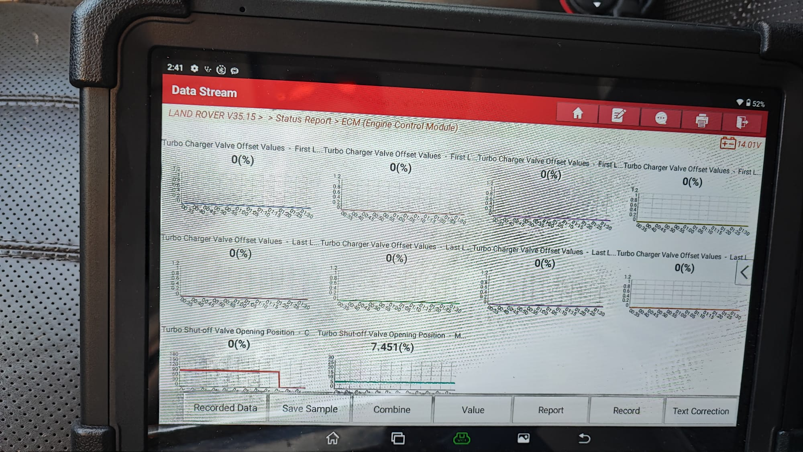

# Diagnosztikai Jelentés: Szekvenciális Turbó Szelep Hiba (L320 3.0 SDV6)

Ez a dokumentum a Range Rover Sport 3.0 TDV6/SDV6 (2011, L320) gépkocsin tapasztalt turbófeltöltési hiba részletes elemzését és a hibaelhárítási lépéseket tartalmazza a Launch diagnosztikai műszerből kinyert adatok alapján.

---

## 1. Hibakódok Értelmezése

A [turbo-hibakod.md](turbo-hibakod.md) fájl alapján az Engine Control Module (ECM) az alábbi két hibakódot tárolta el:

| Hibakód | Leírás | Részletek (JLR specifikus) |
| :--- | :--- | :--- |
| **P22CF-71** | Turbocharger Turbine Inlet Valve Control Circuit - Open (Intermittent) | **Szakadás a vezérlő áramkörben (Circuit TSOV):** A másodlagos turbó beömlőszelepét (TSOV) működtető vákuumszolenoid elektromos köre megszakadt, vagy a beavatkozó beragadt (szolenoid szakadás, kábelszakadás vagy leégett tekercs). |
| **P22D3-77** | Turbocharger Turbine Inlet Valve Stuck Closed | **Szelep zárva ragadt:** A motorvezérlő (ECM) nem érzékelte a szelep elmozdulását a kért parancs ellenére (a szelep nem érte el a commanded pozíciót). |

### 1.1. További Kapcsolódó Hibakódok (Műhelykézikönyv Alapján)

A gyári JLR diagnosztikai útmutató szerint az alábbi hibakódok is szorosan kapcsolódnak ehhez a rendszerhez, és segíthetnek a hiba pontos behatárolásában:

*   **P22D0-00 (TSOV áramkör alacsony):** Rövidzárlat a testre a TSOV vezérlő áramkörben.
*   **P22D2-77 (TSOV nyitva ragadt):** A szelep nyitott állapotban ragadt, a kért pozíció nem érhető el.
*   **P22D4-13 (TSVP pozícióérzékelő áramkör szakadás):** Szakadás a pozícióérzékelő áramkörben (Circuit TSVP). Az ECM nem mér bias feszültséget vagy áramot.
*   **P22D4-16 (TSVP pozícióérzékelő áramkör feszültség küszöbérték alatt):** Rövidzárlat a testre a TSVP áramkörben.
*   **P22D4-17 / P22D5-92 / P22D5-17 (TSVP pozícióérzékelő feszültség határérték felett / adaptációs hiba):** A szelep végállásainak adaptációs értékei kívül esnek a tolerancián. Ezt leggyakrabban az érzékelő időbeli elcsúszása (sensor drift) okozza.

---

## 2. Diagnosztikai Élőadatok (Data Stream) Elemzése

A Launch diagnosztikai műszerben és a gyári SDD-ben a szekvenciális turbó elzárószelep működését az alábbi két specifikus datalogger jellel (Signal ID) lehet nyomon követni:

*   **0x03F0 (Turbo Shut Off Valve Opening Position - Commanded):** Az ECM által kért szelepnyitási pozíció százalékban.
*   **0x03F1 (Turbo Shut Off Valve Opening Position - Measured):** A TSOV szelepen lévő TSVP pozícióérzékelő által mért valós állás.

A csatolt képen látható grafikonok kritikus fontosságú információt hordoznak:

*   **Commanded (0x03F0):** `0 (%)` - Látható, hogy az ECM korábban magas állást (~80-90% nyitást) kért, majd visszaesett 0%-ra.
*   **Measured (0x03F1):** `7.451 (%)` - Egy teljesen vízszintes, lapos vonal **7.451%**-nál.
*   **Következtetés:** A szelep pozícióérzékelője (TSVP) folyamatosan egy fix értéket (kb. 7.5%, ami a teljesen zárt szelep alapértéke/kalibrációs értéke) mutat. A szelep fizikailag egyáltalán nem mozdul el, amikor az ECM kéri a nyitást (a mért érték nem követi a kért értéket).

---

## 3. Működési Elv és a "Restricted Mode" Oka

A 3.0 literes TDV6/SDV6 motor szekvenciális biturbó rendszerrel van felszerelve:
1.  **Alacsony fordulatszámon** (kb. 2500-2800 RPM alatt) csak az elsődleges, változó geometriájú (VGT) turbó üzemel. A másodlagos turbó zárva van, hogy elkerülje a késedelmet (turbo lag).
2.  **Erős gázadásra és magasabb fordulatszámra** a másodlagos turbót is be kell vonni a hajtásba.
3.  Ekkor nyílik ki a **Turbine Inlet Valve (TIV / TSOV)**, amely ráengedi a kipufogógázt a másodlagos turbóra.
4.  Ha ez a szelep nem nyílik ki (áramköri hiba vagy vákuumhiány miatt), a másodlagos turbó nem tud felpörögni. Mivel nincs meg a várt töltőnyomás, az ECM azonnal vészüzemmódba (**Restricted Performance**) teszi a motort a károsodások megelőzése érdekében.

### 3.1. ECM Korrelációs Logika (DTC Összefüggések)

A motorvezérlő (ECM) bizonyos hibakódok együttes jelentkezése alapján képes pontosabban behatárolni a hibát:
*   **P22CF-71 & P22D3-77 + P00BC-00 / P00BC-64 (Alacsony légtömegáram):** A TSOV szolenoid valószínűleg **zárva ragadt**.
*   **P22CF-71 & P22D2-77 + P0235-94, P00BD-07, P1247-00:** A szolenoid valószínűleg **nyitva ragadt**, VAGY a kisnyomású szívórendszer elzáródott (pl. hótömörödés a szívócsőben, ami télen gyakori Land Rover hiba, és a motor átmelegedése után megszűnik).
*   **P22CF-71 & P22D2-77 + P06BA-00:** A szolenoid szintén **nyitva ragadt** állapotára utal.

---

## 4. Részletes Hibakeresési Útmutató (Lépésről lépésre)

A hibakeresést érdemes a legolcsóbb és legkönnyebben hozzáférhető pontokon kezdeni, mivel a turbó cseréje (amire sok szerviz elsőre gyanakodna) rendkívül költséges és gyakran indokolatlan.

Workshop manual: 1091. oldal 

### Lépés 1: Elektromos ellenőrzés (Circuit TSOV és TSVP)
Mivel a hibatároló elektromos szakadást jelez (P22CF-71), az áramkört kell kimérni a gyári kapcsolási rajzok alapján.

1.  **Vezérlő szolenoidok elhelyezkedése:**
    *   A mágnesszelepek a motor elején, a menetirány szerinti bal oldalon (szemben állva az autóval a **jobb kezed felől**), a bal oldali szelepfedél burkolat felett (**LH front cylinder cover assembly**) találhatóak egy közös konzolon.
    *   **Turbina elzáró mágnesszelep (TSOV szolenoid):** Ez a **belső** (*innermost*, a motor közepe felé eső) szelep. Ez vezérli a másodlagos turbó beömlőszelepét, ez a hibakód elsődleges alanya.
    *   **Kompresszor elzáró mágnesszelep (CSOV szolenoid):** Ez a **külső** (*outermost*, a sárvédő felé eső) szelep a konzolon.

2.  **Szolenoid ellenállás mérése (A leggyorsabb teszt):**
    *   Húzd le a szolenoid csatlakozóját.
    *   Egy multiméterrel mérd meg a szolenoid tekercsének ellenállását a két pinje között.
    *   A normál érték **15 és 35 Ohm** között van.
    *   Ha a műszer **szakadást (OL / végtelen ellenállást)** mutat, a szolenoid belső tekercse megszakadt, a szolenoidot ki kell cserélni. Ekkor a feszültségmérés felesleges, megvan a hiba oka.

3.  **A "0.5V-os csapda" és a feszültségmérés menete:**
    *   **Figyelem:** Az ECM nem folyamatos egyenárammal, hanem **PWM (impulzusszélesség-modulált)** jellel vezérli a szelepet. Gyújtáson vagy alapjáraton a szelep zárt állapotot kap, így a mért átlagfeszültség mindössze **kb. 0,5 V**. Ezt könnyű tévesen kábel- vagy ECM-hibának hinni!
    *   **Tápellátás ellenőrzése:** Gyújtáson (ignition ON) a csatlakozó egyik lábán meg kell lennie az állandó **12 V** tápfeszültségnek a karosszéria-testhez (GND) képest mérve (ezt a biztosítéktábláról kapja).
    *   **Vezérlés ellenőrzése (Launch / SDD használatával):** 
        *   Csatlakoztasd a diagnosztikai műszert.
        *   Lépj be a **Beavatkozó tesztek (Actuator Tests)** menüpontba, és indítsd el a TSOV szelep tesztjét.
        *   Mérj rá a lehúzott csatlakozó két érintkezője (pinje) közé: a feszültségnek a teszt aktiválásakor fel kell ugrania a nyitó parancsnak megfelelő szintre (átlagosan **~4,5 V**-ra vagy a mérési módszertől függően 12 V-ra), majd deaktiváláskor visszaesnie 0,5 V-ra.

4.  **Csatlakozó és kábelköteg vizsgálata:**
    *   Ellenőrizd a csatlakozót korrózió, oxidáció, zöldes lerakódás vagy kilazult pinek szempontjából.
    *   Vizsgáld meg a szolenoidhoz vezető vezetékeket (**Circuit TSOV**). Gyakori hiba, hogy a kábelköteg kidörzsölődik valamilyen fém alkatrészen vagy a motor burkolatán. Mérj szakadást és zárlatot (testre vagy tápra) az ECM és a szolenoid csatlakozója között.

5.  **Pozícióérzékelő áramkör (Circuit TSVP):** Ellenőrizd a 3-pólusú pozícióérzékelő tápellátását és jelvezetékét az ECM felé szakadásra, rövidzárlatra és magas ellenállásra.

### Lépés 2: A vákuumrendszer és a csövek ellenőrzése
A szelep vákuummal működik. Ha elszökik a vákuum, a szelep nem fog kinyílni.
1.  **Vákuumcsövek vizsgálata:** Ellenőrizd a szolenoidtól a TSOV szelepig vezető vékony vákuumcsöveket. Keresd a repedéseket, kidörzsölődéseket vagy lecsúszott csatlakozásokat.
2.  **Aktív motortartó bakok (Tipikus Land Rover hiba!):** Ezen a típuson a motortartó bakok szintén a közös vákuumrendszerről működnek. Ha a motortartó bak belső membránja átszakad, elengedi a vákuumot az egész rendszerből, és a turbó szelepek sem fognak működni.
    *   *Teszt:* Ideiglenesen le lehet dugózni a motortartó bakokhoz vezető vákuumcsövet, hogy látható legyen, visszatér-e a turbószelepek működése.

### Lépés 3: A TSOV szelep mechanikus ellenőrzése
1.  **Szelep elhelyezkedése:** A másodlagos turbó beömlőszelepe a motor utasoldali (jobb) alsó részén található, a másodlagos turbó előtt.
2.  **Kézi mozgatás:** Próbáld meg kézzel vagy egy csavarhúzó segítségével megmozgatni a vákuumlabda rúdját.
    *   A rúdnak simán, akadásmentesen kell mozognia.
    *   Ha szorul vagy teljesen be van állva, az koromlerakódás miatt lehet. Próbáld meg csavarlazítóval (pl. WD-40) befújni a tengelyt, és kézzel óvatosan megjáratni.
3.  **Pozícióérzékelő (TSVP) és végállások:** Ha a szelep mechanikusan tökéletesen mozog, de továbbra is pozícióhibát kapsz (pl. P22D4-17 / P22D5-92), akkor az érzékelő elhasználódása (sensor drift) áll fenn. Ilyenkor a komplett pozícióérzékelőt ki kell cserélni a vákuumlabdán.

### Lépés 4: Dinamikus tesztelés
A javítások elvégzése után a gyártó által jóváhagyott diagnosztikai rendszerrel (SDD vagy megfelelő Launch/Autel) futtasd le a **"Turbo, EGR and air path dynamic test"** (Turbó, EGR és levegőrendszer dinamikus teszt) rutint a szelepek kalibrációjának és működésének ellenőrzésére.

---

## 5. Kapcsolódó Műhelykézikönyv Oldalszámok

A hibakeresés megkönnyítéséhez az alábbi oldalszámokon találhatók meg a gyári dokumentumok és részletes áramköri leírások a **Workshop manual Range Rover Sport 2005-2013 Sec.1 General.pdf** fájlban:

*   **P22CF-71 (TSOV vezérlő áramkör szakadás / szolenoid hiba):** 
    *   **355-356. oldal:** DTC leírás és lehetséges okok.
    *   **369-370. oldal:** DTC összefüggések és egyéb hibák (pl. P0235-94, P00BD-07, P1247-00).
    *   **435. oldal:** A hibakód helye a diagnosztikai listában.
*   **P22D3-77 (Turbina beömlőszelep zárva ragadt):**
    *   **355. oldal:** Korrelációs hibakód összefüggések (P00BC-00).
    *   **433. oldal:** Részletes DTC diagnosztika és áramköri ellenőrzés (rövidzárlat tápra, stb.).
*   **P22D4 / P22D5 (TSVP pozícióérzékelő hibák):**
    *   **435. oldal:** TSVP szakadás (P22D4-13), feszültség küszöbérték alatt (P22D4-16) és felett (P22D4-17).
    *   **436. oldal:** Szenzor drift miatti végállás adaptációs hiba (P22D5-92 / P22D5-17).
*   **Vezérlőáramkör mérések (Circuit TSOV):** **433., 434. oldal.**
*   **Pozícióérzékelő mérések (Circuit TSVP):** **435., 436. oldal.**
*   **0x03F0 (Commanded) és 0x03F1 (Measured) élőadat leírások:** **433., 434., 435. oldal.**

### 5.1. Vákuumrendszer, Csövezés és a Szelepek Elhelyezkedése (Sec.2 és Sec.3 Alapján)

A vákuumrendszer fizikai felépítéséhez és a mágnesszelepek elhelyezkedéséhez az alábbi oldalszámok és leírások tartoznak:

*   **Vákuum forrása (Vákuumpumpa) - Sec.2 Chassis, 576. oldal:**
    *   A 3.0L dízel motoron a vákuumpumpa egy kombinált vákuum- és olajleszívó (scavenge) szivattyú.
    *   **Két különálló vákuumcsatlakozója van:** az egyik közvetlenül a **fékrásegítőhöz (brake booster)** megy, a másik pedig a **turbóvezérléshez (turbo control)** biztosítja a vákuumot (innen ágazik le a vákuumtartály és a szolenoidok felé).
*   **Aktív motortartó bakok - Sec.2 Chassis, 577. oldal:**
    *   A vákuumpumpa látja el vákuummal az aktív motortartó bakokat (adaptive engine mounts) is. Mivel a rendszer közös, ha a motortartó bakok belső membránja átszakad, elszökik a vákuum a turbóvezérlés elől is, működésképtelenné téve a turbószelepeket!
*   **Vezérlő mágnesszelepek (Solenoidok) - Sec.3 Powertrain, 1549–1550. oldal:**
    *   **Helyük:** A motor elején, a bal oldali szelepfedél felett (LH front cylinder cover) egy közös tartókonzolon osztoznak.
    *   **Turbina elzáró mágnesszelep (TSOV Solenoid):** Ez a **belső (innermost)** szelep a konzolon. A vákuumpumpától kapja a vákuumot, és egy vékony vákuumcső köti össze a másodlagos turbó hátulján elhelyezkedő vákuumdobbal (actuator). Nyitáskor az ECM 4.5V PWM árammal gerjeszti a szolenoidot (ráengedi a vákuumot), záráskor 0.5V PWM áramot kap.
    *   **Kompresszor elzáró mágnesszelep:** Ez a **külső (outermost)** szelep a konzolon. A vákuumpumpától kapja a vákuumot, és egy vákuumcső köti össze a szívócső torkánál lévő kompresszor elzáró vákuumdobbal (0% off, 100% on PWM).
*   **Rendszerszintű figyelmeztetés - Sec.3 Powertrain, 1091. oldal:**
    *   > *"A vákuumrendszer hibakeresése során mindig ellenőrizze a becsípődött, repedt vagy lecsúszott csöveket. Bármilyen vákuumrendszeri hiba miatt a motor azonnal csökkentett nyomatékú (vész) üzemmódba áll be."*

---

> [!IMPORTANT]
> **Összegzés:**
> A Launch élőadatai alapján a szelep egyáltalán nem mozdul el a zárt alapállásból (**0x03F0 Commanded pozíció változik, de a 0x03F1 Measured pozíció 7.45%-on áll**). Mivel a hibatárolóban ott van a **P22CF-71** (áramköri szakadás), a legvalószínűbb hibaforrás a **vákuumvezérlő szolenoid meghibásodása (szakadt tekercs)** vagy a **kábelköteg (Circuit TSOV) kidörzsölődése/szakadása**. Kezdd a szolenoid elektromos ellenállásának mérésével és a csatlakozók tisztításával!
