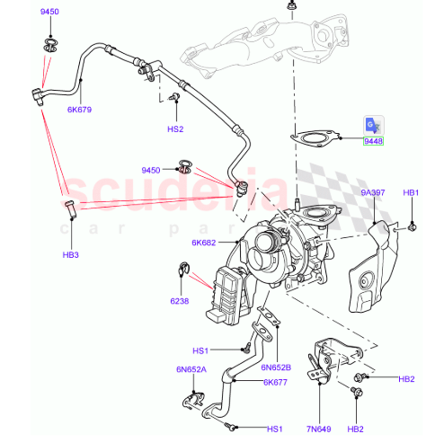
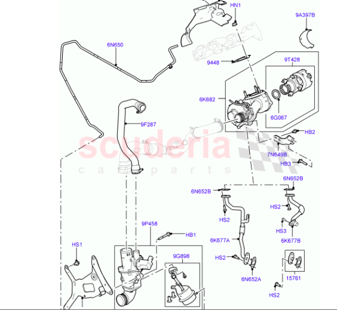
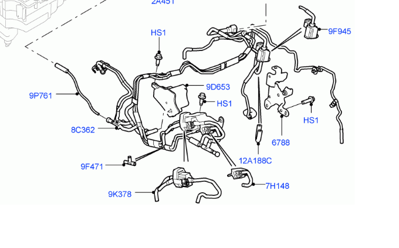
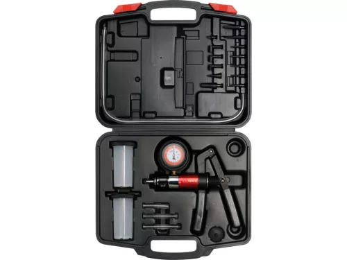

# Youtube

* https://www.youtube.com/watch?v=60vAmku267g&t=190s
* https://www.youtube.com/watch?v=dl6Eflp-BKk

# Bal oldali (fő) turbocharger - variable vane

https://www.advancedfactors.co.uk/turbocharger---lh-vin-aa000001-onwards-11681-c  --> **FIGYELEM itt minden GEN2, a mienk GEN1**

https://landrover.scuderiacarparts.com/part-finder/landrover/discovery/oe/501/5392/107784 --> **ezen rajta van a GEN1 és a GEN2 is**

- Turbocharger assembly – LH (primary)	Változó geometriás (variable vane) turbó, komplett	
  - eredeti: **LR013202**
  - közepesen új: **LR049590**
  - legújabb szám: **LR056369**
- Turbine inlet gasket	Tömítés a kipufogócsonk és turbó között	**LR013236**

 
 

- autodoc: https://www.autodoc.hu/br-turbo/24264687
  - BR Turbo BRX6962 Turbo középrész
- ebay: 
  - https://www.ebay.co.uk/itm/254030802913 (MELETT)
- turborebuild.co.uk:
  - https://www.turborebuild.co.uk/genuine-melett-uk-turbo-chra-garrett-gtb1749vk-778400-jaguar-xj-land-rover-discovery-4range-rover-sport-30d

 
 

# Jobb oldali (másodlagos) - fixed vane

https://landrover.scuderiacarparts.com/part-finder/landrover/discovery/oe/501/5392/107783 --> **FIGYELEM: ez a GEN2 motor, a mienk GEN1**

https://www.advancedfactors.co.uk/turbocharger-rh-11683-c --> **ezen van GEN1 és GEN2 is**

- Turbocharger assembly – RH, fix geometrás turbó: 
  - **LR063777**
  - LR128704
- Turbine inlet gasket, turbó–kipufogócsonk tömítés: **LR013236**

 
 

* csavar + tömítés + sud
  * FEBI BILSTEIN 191745: https://www.autodoc.hu/febi-bilstein/22792130#szerelokeszlet-tolto
  * FA1 KT410110: csavar + stud + tömítés: https://www.autodoc.hu/fa1/13919702#szerelokeszlet-tolto
  * ebay összes tömítés + összes csavar + összes stud: https://www.ebay.co.uk/itm/334519584972

 
 

- turbo core: 
  - BR Turbo BRX4629 Turbo középrész: https://www.autodoc.hu/br-turbo/24264564
- turborebuild.co.uk:
  - https://www.turborebuild.co.uk/genuine-melett-uk-turbo-chra-land-rover-jaguar-30d-garrett-gt1444z-778401-0004-6-8-10-778402-0004-6-8

# Vákum vezérlés (jobb oldali, másodlagos, fix vane turbó)

Workshop manual: powertrain - 1091. oldal 

https://landrover.scuderiacarparts.com/part-finder/landrover/range-rover-sport/oe/522/6081/121589

* 7H148 -	LR116598:	SOLENOID - CSOV -  A Turbina elzárószelep szolenoidja (Turbo Control Solenoid) – ez a felelős a P22CF-71 hibakódért, amin jelenleg dolgozunk.
* 9K378 -	LR021929, LR076235	SOLENOID - A Kompresszor elzárószelep szolenoidja (CSOV Solenoid).
* 9F945	- LR116599	SOLENOID - EGR 

Vákum teszter: 

YATO Kézi vákuum- és nyomáspumpa készlet fékrendszerhez, -1–3 bar, 22 részes (YT-0674)

https://www.elefantszerszam.hu/YATO-Kezi-vakumszivattyu-22db-YT-0674