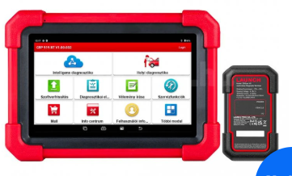
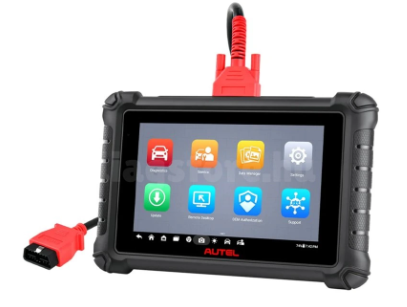
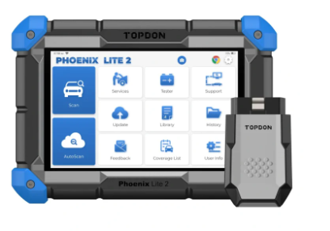
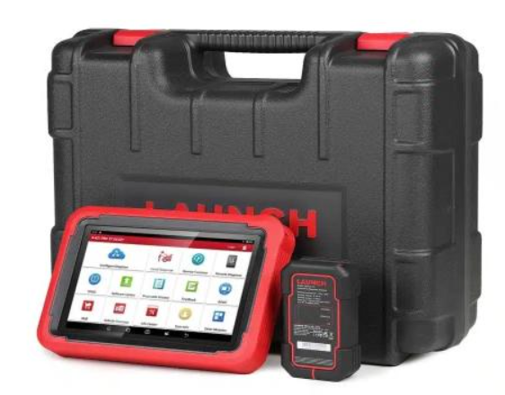
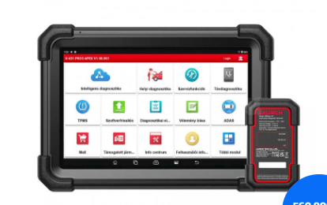
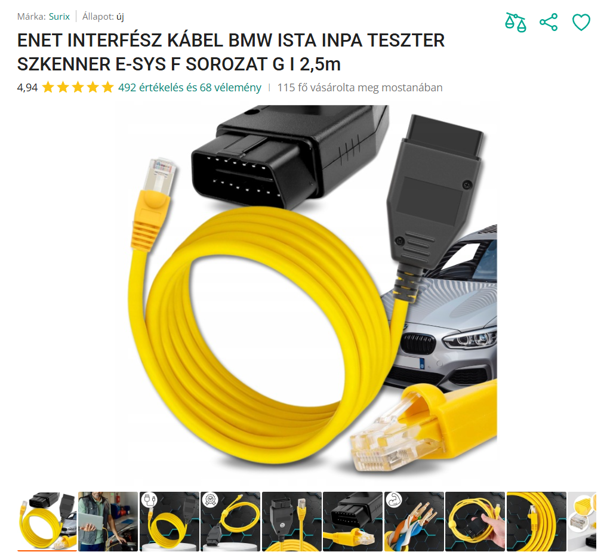

# Oscilloscope

* https://www.muszerhaz.hu/pico2204a
* https://www.youtube.com/watch?v=uV0djQUatgQ
* Pico 2204A  PC-s oszcilloszkóp, 2CH, 10MHz
* Az autonál a legfontosabb a memória nagysága, 8 kS: ez nem elég egy tisztességes crankshaft szignálhoz. 

# Diagnosztika

## Technikai Követelmények Típusonként

| Autó Típus | Évjárat | Kritikus Protokoll / Funkció | Miért szükséges? |
| :--- | :--- | :--- | :--- |
| **BMW G20 (3-as)** | 2019 | **DoIP** & **CBS Reset** | Ethernet alapú gyors adatátvitel és szervizintervallum kezelés. |
| **Volvo XC60** | 2019 | **DoIP** & **SGW Access** | A legtöbb modul (fék, klíma) csak DoIP-n érhető el; a biztonsági kapu (SGW) védi a törlést. |
| **Nissan Juke (F16)** | 2020 | **CAN-FD** & **SGW** | Új generációs, nagysebességű kommunikáció és szerveroldali biztonsági feloldás. |
| **Land Rover L550** | 2020 | **DoIP** | A modern Discovery Sport rendszereinek és ADAS moduljainak eléréséhez. |
| **Land Rover L320** | 2011 | **Bi-directional Control** | A légrugó szelepek és a kézifék motorjának aktív mozgatásához. |

### 🛠️ DoIP (Diagnostics over IP)
* **Érintett autók:** BMW G20, Volvo XC60, Land Rover L550.
* **Leírás:** Ez egy Ethernet alapú diagnosztika. Enélkül az újabb autók (főleg a Volvo) moduljainak jelentős része láthatatlan marad, vagy a kommunikáció rendkívül lassú és instabil.

### 🔐 SGW (Security Gateway)
* **Érintett autók:** Nissan Juke (F16), Volvo XC60.
* **Leírás:** Egy "tűzfal", ami megakadályozza az illetéktelen szoftveres beavatkozást. A teszternek képesnek kell lennie a gyártói szerveren keresztül (hitelesítéssel) feloldani ezt a zárat a féknyitáshoz vagy hibakód törléshez.

### ⚡ CAN-FD (Controller Area Network Flexible Data-rate)
* **Érintett autó:** Nissan Juke (F16).
* **Leírás:** A klasszikus CAN-busz továbbfejlesztett, gyorsabb változata. Fizikai hardveres chipet igényel az OBD olvasóban; a régebbi eszközök (pl. iCarsoft régebbi verziói) nem tudnak csatlakozni hozzá.

### 🔄 Bi-directional Control (Kétirányú vezérlés)
* **Érintett autók:** Összes (különösen Land Rover légrugó és BMW/Volvo/Nissan elektromos kézifék).
* **Leírás:** Lehetővé teszi, hogy a teszter parancsot küldjön az autónak (pl. "nyisd ki a féknyerget" vagy "engedd le a légrugót"), nem csak olvassa az adatokat.

 

**Ajánlott Eszköz Jellemzői**

A választott univerzális eszköznek (pl. **Launch CRP919EBT**) a fentiek alapján az alábbiakat **KELL** tudnia:
1.  **Beépített DoIP és CAN-FD támogatás** (adapterkábelek nélkül).
2.  **Szoftveres SGW feloldási képesség** (Nissan/Renault/FCA/Volvo).
3.  **Aktív tesztek / Kétirányú vezérlés** funkció minden modulban.

## Típusok

### Launch CRP919EBT

https://www.diagstore.hu/launch-x431-crp919xbt/

204 900 Ft

### Autel MX900

https://www.diagstore.hu/autel-maxicheck-mx900

249 900 Ft

### Topdon Phoenix Lite 2

https://diag-g.hu/termek/topdon-phoenix-lite2

### LAUNCH X431 PROS V5.0

https://www.izzi.hu/hu/shop/termekek/launch-x431-pros-v5-0/x431-pros-v5-0

349 990 Ft

### Launch X431 PRO3 APEX 2026 HU

https://www.diagstore.hu/launch-x431-pro3-apex-hu/

399 900 Ft

### Launch X431 PRO DYNO 2026 HU

https://www.diagstore.hu/launch-x431-pro-dyno-hu/

350 000 Ft

# ISTA használata

ETE kábel kell, aminek az egyik fele egy OBD a másik egy ethernet. 

