# Manualslib.de - A globális kézikönyvtár

Útmutatók / Márkák / LINCOS útmutatók / Emelők / STD-5145 sorozat / Kezelési útmutató / PDF

# LINCOS STD-5145 SOROZAT

**Használati útmutató**

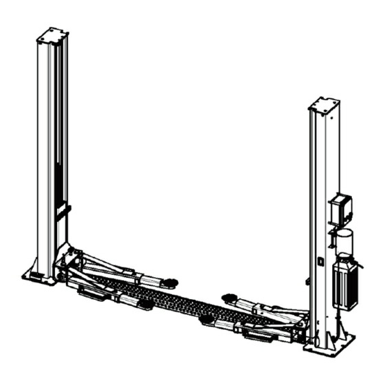

## Gyors hivatkozások

- Elektromotor
- Elektromos csatlakozás

## Tartalomjegyzék

- A használati útmutató megőrzése
- Eljárás hiba esetén
- Biztonsági előírások az üzemeltető számára
- Figyelmeztetések
- Garancia
- Műszaki karbantartás
- Csomagolás
- Emelés és mozgatás
- Tárolás
- A csomag átvétele és ellenőrzése
- Méretek és fő paraméterek
- Elektromotor
- Szivattyú
- Hidraulikus szivattyú
- Hidraulikaolaj
- Általános biztonsági előírások
- Biztonságtechnikai előírások
- Biztonsági berendezések
- Biztonsági és figyelmeztető címkék
- A telepítéshez szükséges szerszámok
- A felállítási hely megfelelősége
- Világítás
- Padlóviszonyok
- A telepítés helye
- Az oszlopok telepítése
- A szinkronizáló drótkötelek telepítése
- A hidraulikarendszer csatlakoztatása
- Elektromos csatlakozás
- A tartókarok telepítése
- Üzembe helyezés és ellenőrzés
- Ellenőrzés üzembe helyezés előtt
- Üzembe helyezés
- Ellenőrzés az első használat előtt
- A végálláskapcsoló telepítése
- Ellenőrzés terhelés alatt
- Vezérlés
- Emelés
- Süllyesztés
- Kézi vészleengedés
- Elektrohidraulikus, 2 oszlopos emelő alapkerettel
- Általános karbantartás
- Időszakos karbantartás

---

# TELEPÍTÉSI, KEZELÉSI ÉS KARBANTARTÁSI ÚTMUTATÓ

## STD-5145X

## ELEKTROHIDRAULIKUS, 2 OSZLOPOS EMELŐ ALAPKERETTEL

## Bevezetés

Tisztelt Vásárlónk! Köszönjük, hogy termékünket választotta!

Kérjük, az emelő üzembe helyezése előtt figyelmesen olvassa el ezt a használati útmutatót. Az Ön feladata, hogy áttanulmányozza a gép biztonságos használatára és működtetésére vonatkozó előírásokat, továbbá tisztában legyen a gép használata közben fennálló veszélyekkel.

> **Figyelmeztetés!** Ne helyezze üzembe a gépet, amíg nem olvasta el a használati útmutatót, és amíg nem ismeri a használat módját. Őrizze meg az útmutatót. Fordítson különös figyelmet a biztonsági előírásokra. A biztonsági szabályok be nem tartása személyi sérüléshez, illetve a gép vagy a gép alkatrészeinek károsodásához vezethet. Figyeljen a gépen található biztonsági és figyelmeztető táblákra. Ezek eltávolítása vagy megrongálása tilos.

Az útmutatóban szereplő adatok ellenőrzöttek. Ennek ellenére nem zárható ki, hogy az útmutató hibákat tartalmaz. Az útmutató olyan személyek számára készült, akik jogosultak járművek vizsgálatára és javítására, és megfelelő műszaki ismeretekkel rendelkeznek. Fenntartjuk a műszaki és tartalmi változtatások jogát.

## Az útmutatóban használt szimbólumok jelentése

Az adott művelet fokozott figyelmet és körültekintést igényel.

Tilos. Olyan információk, amelyeket maradéktalanul be kell tartani, vagy amelyek végrehajtása szigorúan tilos.

Figyelmeztetés lehetséges veszélyforrásokra. Személyi sérülés vagy súlyos anyagi kár veszélye.

**A félkövérrel szedett részek fontos információkat tartalmaznak.**

> **Figyelmeztetés!** Az emelő telepítése és használata előtt figyelmesen olvassa el a használati útmutatót!

## Tartalomjegyzék

1. Általános tudnivalók  
1.1 A használati útmutató megőrzése  
1.2 Eljárás hiba esetén  
1.3 Biztonsági előírások az üzemeltető számára  
1.4 Figyelmeztetések  
2. Termékazonosítás  
2.1 Garancia  
2.2 Műszaki karbantartás  
3. Csomagolás, szállítás és tárolás  
3.1 Csomagolás  
3.2 Emelés és mozgatás  
3.3 Tárolás  
3.4 A csomag átvétele és ellenőrzése  
4. Az emelő leírása  
5. Műszaki adatok  
5.1 Méretek és fő paraméterek  
5.2 Elektromotor  
5.3 Szivattyú  
5.4 Hidraulikus szivattyú  
5.5 Hidraulikaolaj  
6. Biztonság  
6.1 Általános biztonsági előírások  
6.2 Biztonsági berendezések  
6.3 Biztonsági és figyelmeztető címkék  
7. Telepítés  
7.1 A telepítéshez szükséges szerszámok  
7.2 A felállítási hely megfelelősége  
7.3 Világítás  
7.4 Padlóviszonyok  
7.5 A telepítés helye  
7.6 Az oszlopok telepítése  
7.7 A szinkronizáló drótkötelek telepítése  
7.8 A hidraulikarendszer csatlakoztatása  
7.9 Elektromos csatlakozás  
7.10 A tartókarok telepítése  
7.11 Üzembe helyezés és ellenőrzés  
7.11.1 Ellenőrzés üzembe helyezés előtt  
7.11.2 Üzembe helyezés  
7.11.3 Ellenőrzés az első használat előtt  
7.12 A végálláskapcsoló telepítése  
7.13 Ellenőrzés terhelés alatt  
8. Üzemeltetés  
8.1 Vezérlés  
8.2 Emelés  
8.3 Süllyesztés  
8.4 Kézi vészleengedés  
9. Karbantartás  
9.1 Általános karbantartás  
9.2 Időszakos karbantartás  
10. Hibakeresés  
11. Az üzemeltető feljegyzései  
12. Telepítési jegyzőkönyv  
Garancia

## 1. Általános tudnivalók

**AZ ÜZEMBE HELYEZÉS ELŐTT FIGYELMESEN OLVASSA EL**

Ez a fejezet az emelő rendeltetésszerű használatára vonatkozó biztonsági előírásokat, valamint a személyi sérülések és anyagi károk megelőzését írja le. A használati útmutató összeállításában az emelőt kezelő és karbantartó szakemberek vettek részt. A használati útmutató az emelő szerves részét képezi, és az emelő teljes élettartama alatt, a gép mellett kell megőrizni.

Az emelő kicsomagolása és üzembe helyezése előtt olvassa el az útmutató minden fejezetét, mert az alábbi fontos információkat tartalmazza:

- személyvédelem
- az emelő védelme
- a megemelt jármű védelme

A gyártó és a forgalmazó nem vállal felelősséget a nem rendeltetésszerű használatból eredő anyagi és személyi károkért. Nem vállalunk felelősséget a használati útmutató tartalmának figyelmen kívül hagyásából eredő személyi sérülésekért, járműkárokért vagy az emelő sérüléseiért sem. Az emelő mozgatását, szállítását, összeszerelését, telepítését, kalibrálását, karbantartását, javítását, módosítását és bontását kizárólag a kereskedő vagy a gyártó által felhatalmazott szervizközpontok képzett szakemberei végezhetik.

> A gyártó és a forgalmazó nem vállal felelősséget azokért a személyi sérülésekért és anyagi károkért, amelyek abból erednek, hogy a fent leírt műveletek valamelyikét nem megfelelően képzett szakember végezte.

Az emelőt olyan személyeknek használni tilos, akik nem ismerik a használati útmutató tartalmát.

A helyi balesetvédelmi és munkavédelmi előírások betartásának biztosítása az üzemeltető felelőssége.

### 1.1 A használati útmutató megőrzése

A használati útmutató megőrzésével kapcsolatban a következők ajánlottak:

1. Az útmutatót az emelő közelében, jól látható és könnyen hozzáférhető helyen őrizze.
2. Védje az útmutatót a nedvességtől és az olajtól, tiszta, száraz helyen tárolja.
3. Használat közben védje az útmutatót a sérülésektől.
4. Az emelőt olyan személyeknek használni tilos, akik nem ismerik az útmutató tartalmát.

A használati útmutató az emelő szerves része, ezért eladás esetén azt az új üzemeltetőnek át kell adni.

### 1.2 Eljárás hiba esetén

Hibás működés esetén kövesse a következő fejezetekben leírt utasításokat.

### 1.3 Biztonsági előírások az üzemeltető számára

Az üzemeltető a gép kezelése során nem állhat alkohol, nyugtató vagy kábítószer hatása alatt.

Az üzembe helyezés előtt az üzemeltetőnek meg kell ismernie a vezérlőelemek helyét és működését, ahogyan azt az „Üzemeltetés” fejezet ismerteti.

### 1.4 Figyelmeztetések

Az engedély nélküli módosítások mentesítik a gyártót és a forgalmazót minden felelősség és garanciális kötelezettség alól. Ne távolítsa el, és ne tegye működésképtelenné a biztonsági berendezéseket, mert ez a biztonsági előírások megsértéséhez vezethet.

Minden olyan működtetés, amely eltér a használati útmutató tartalmától, és attól, amit a gyártó jóváhagyott, szigorúan tilos.

Nem eredeti pótalkatrészek használata személyi sérüléshez és anyagi kárhoz vezethet.

### Garancianyilatkozat és korlátozott felelősségvállalás

A gyártó a használati útmutatót a kellő gondossággal állította össze.

A gyártó és a forgalmazó nem köteles helytállni azokban az esetekben, amikor személyi sérülés vagy anyagi kár helytelen használatból, a biztonsági előírások be nem tartásából, módosításból vagy szakszerűtlen üzemeltetésből ered. Nem vállalunk felelősséget a használati útmutató figyelmen kívül hagyásából eredő személyi sérülésekért, illetve a jármű vagy az emelő károsodásáért sem.

A gyártó és a forgalmazó továbbá nem vállal felelősséget a nemzeti és nemzetközi munkavédelmi és balesetvédelmi jogszabályok be nem tartásából eredő személyi sérülésekért és anyagi károkért. Ezek betartásáért az üzemeltető személyesen felelős.

### Az olvasóhoz

Kellő gondossággal jártunk el annak érdekében, hogy a használati útmutató pontos, teljes és naprakész információkat tartalmazzon. A gyártó és a forgalmazó nem vállal felelősséget az útmutató esetleges hibáiért, és a termékfejlesztés miatt fenntartja a változtatás jogát.

## 2. Termékazonosítás

Az emelő műszaki adatai a szivattyús oszlop hátoldalán található adattáblán olvashatók.

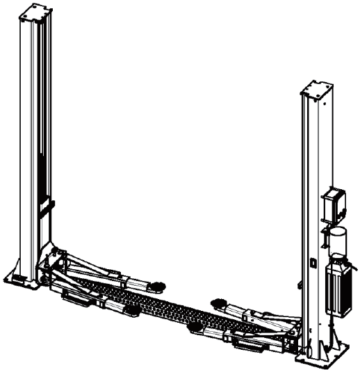

- modellszám
- típus
- a forgalmazó logója
- sorozatszám
- maximális munkaterhelés
- CE-jelölés
- gyártási dátum
- fázisszám
- nettó tömeg
- hajtási teljesítmény
- tápfeszültség
- fázis
- frekvencia
- gyártó
- kereskedő

Az adattáblán szereplő adatokat használja a gyártóval vagy a kereskedővel való kapcsolatfelvételkor. Az adattábla eltávolítása szigorúan tilos.

A gyártó fenntartja a jogot a gépek továbbfejlesztésére vagy kisebb esztétikai változtatásokra, amelyek bár eltérhetnek a használati útmutatóban szereplő jellemzőktől, a fő funkciókat nem befolyásolják.

### 2.1 Garancia

A garanciaidő az értékesítés dátumától számított 12 hónap.

A garancia azonnal megszűnik, ha a gépen nem engedélyezett módosítást hajtanak végre.

Garanciális hibát kizárólag a gyártó vagy a kereskedő által megbízott szakszerviz jogosult megállapítani.

### 2.2 Műszaki karbantartás

Az olyan szerviz- és karbantartási kérdésekkel, amelyekkel a használati útmutató nem foglalkozik, forduljon a kereskedőhöz.

## 3. Csomagolás, szállítás és tárolás

Az emelő csomagolását, mozgatását, emelését, szállítását és kicsomagolását csak olyan személy végezheti, aki rendelkezik az útmutatóban leírt ismeretekkel.

### 3.1 Csomagolás

Csomagolt állapotban az emelő a következő 3 részből áll:

- az emelő mechanikai elemei (oszlopok, hidraulikus hengerek, emelőkocsik, tartókarok, alapkeret, három különböző magasságállítású gumiblokk) összecsomagolva, acélkeretre rögzítve, fóliába csomagolva
- hidraulikus szivattyúegység kartondobozban
- elektromos vezérlőpult kartondobozban

**1. ábra**

### 3.2 Emelés és mozgatás

Az emelő emeléséhez és mozgatásához megfelelő teherbírású és rögzítési lehetőségekkel rendelkező emelőeszközt használjon (daru, villástargonca). A ládát mérete, tömege, súlypontja és törékeny alkatrészei figyelembevételével úgy rögzítse, hogy ne eshessen le.

### 3.3 Tárolás

Az emelőt fedett, száraz helyen kell tárolni, közvetlen napfénytől védve, `-10 °C` és `+40 °C` közötti hőmérsékleten.

### 3.4 A csomag átvétele és ellenőrzése

Átvétel után ellenőrizze a szállítás vagy tárolás során esetlegesen keletkezett sérüléseket, és győződjön meg arról, hogy a gyártó által felsorolt összes tartozék megtalálható a csomagban. Sérülés vagy hiány esetén vetessen fel jegyzőkönyvet a futárral, majd értesítse a kereskedőt.

A kicsomagolást kellő körültekintéssel kell végezni mind a személyek védelme érdekében (a pántok átvágásakor tartsa a szükséges távolságot), mind a gép alkatrészeinek védelmében (ügyeljen arra, hogy egyes elemek ne essenek ki a keretből).

## 4. Az emelő leírása

Az emelő járművek emelésére alkalmas. A maximális teherbírás, beleértve a járművön lévő további terhelést is, az adattáblán található. Ennek a határértéknek a túllépése szigorúan tilos.

Az emelő főbb részei (2. ábra):

- két oszlop `(1)`
- két emelőkocsi `(2)`
- két tartókar `(3)`
- alapkeret
- áthajtólemez `(4)`, amely védi a drótkötelet, a hidraulikatömlőt és az elektromos vezetéket

Az emelést a vezérlőpulton lévő gomb vezérli, amely a hidraulikus szivattyút `(6)` működteti. A szivattyú hidraulikaolajat nyom a hengerekbe. Mindkét emelőkocsi rendelkezik biztonsági reteszeléssel `(7)`, amelyet egy elektromágnes `(8)` vezérel.

Az emelő leengedése szintén gombnyomással történik; a berendezés a megemelt jármű súlya alatt süllyed. Az emelőkocsik szinkronizálását drótkötél-rendszer biztosítja. A tartókarok biztonsági reteszelése automatikusan zár, amikor az emelő megemelkedik. A vezérlőpulton található végálláskapcsolóval a maximális emelési magasság állítható.

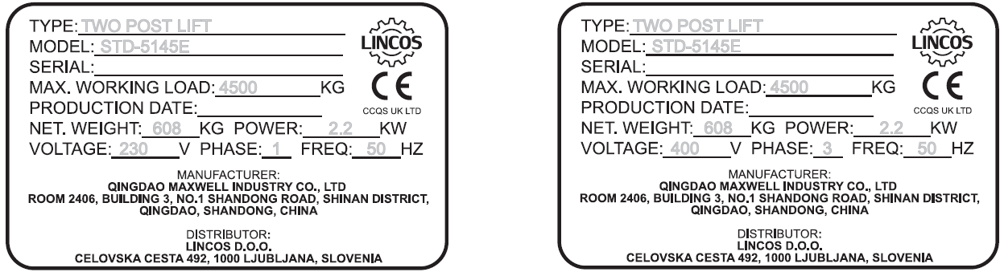

## 5. Műszaki adatok

### 5.1 Méretek és fő paraméterek

| Paraméter | Érték |
| --- | --- |
| Modell | `STD-5145E` |
| Teherbírás | `4,5 t` |
| Maximális emelési magasság | `1850 mm` |
| Minimális magasság | `100 mm` |
| Teljes hossz | `2860 mm` |
| Teljes szélesség | `3410 mm` |
| Emelési idő | `50 s` |
| Süllyesztési idő | `50 s` |
| Zajszint | `75 dB(A)/1 m` |
| Üzemi hőmérséklet | `-10 °C - +40 °C` |
| Átlagos csomagtömeg | `610 kg` |
| Telepítési hely | belső tér |
| Biztonsági reteszelés típusa | mágnestekercs |

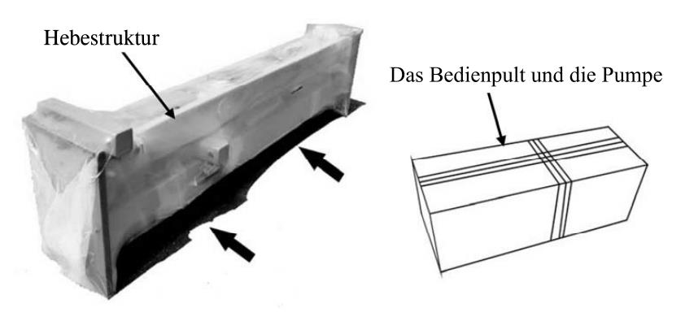

### 5.2 Elektromotor

| Paraméter | `230V / 220V - 1Ph` | `400V / 380V - 3Ph` |
| --- | --- | --- |
| Hajtási teljesítmény | `2,2 kW` | `2,6 kW` |
| Pólusszám | `2` | `4` |
| Fordulatszám | `2800 rpm` | `1375 rpm` |
| Motorház típusa | `B14` | `B14` |
| Védettségi osztály | `IP54` | `IP54` |

Az elektromotor csatlakoztatását az 5. ábrán látható kapcsolási rajz szerint kell elvégezni. A motor forgásiránya az adattáblán található. Használat előtt ellenőrizze, hogy a helyszíni áramforrás megfelel-e az emelő specifikációjának. Ha a feszültségingadozás meghaladja a `10%`-ot, ajánlott feszültségstabilizátort használni az emelő elektromos részeinek védelmére.

### 5.3 Szivattyú

| Paraméter | Érték |
| --- | --- |
| Típus | fogaskerék |
| Térfogatáram | `2,0 cm3/ford.` vagy `4,8 cm3/ford.` |
| Tartós üzemi nyomás | `170-190 bar` |
| Maximális nyomás | `210 bar` |

### 5.4 Hidraulikus szivattyú

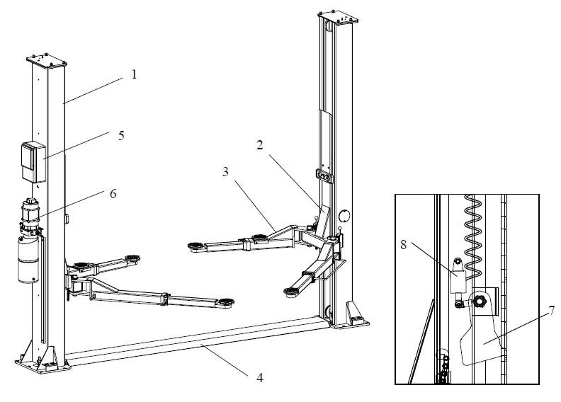

### 5.5 Hidraulikaolaj

Ajánlott az `ISO 6743/4` szabványnak megfelelő (`HM` osztályú) hidraulikaolaj használata.

| Szabvány | Paraméter | Érték |
| --- | --- | --- |
| `ASTM D 1298` | sűrűség `20 °C`-on | `0,8 kg/l` |
| `ASTM D 445` | viszkozitás `40 °C`-on | `32 cSt` |
| `ASTM D 445` | viszkozitás `100 °C`-on | `5,43 cSt` |
| `ASTM D 2270` | viszkozitási index | `104` |
| `ASTM D 97` | dermedéspont | `~30 °C` |
| `ASTM D 92` | forráspont | `215 °C` |
| `ASTM D 644` | elszappanosodási szám | `0,5 mg KOH/g` |

Ajánlott `32`-es hidraulikaolaj beszerzése, amely hidraulika-szaküzletekben elérhető.

> Az olajcserét évente el kell végezni.

### Hidraulikus diagram (5. ábra)

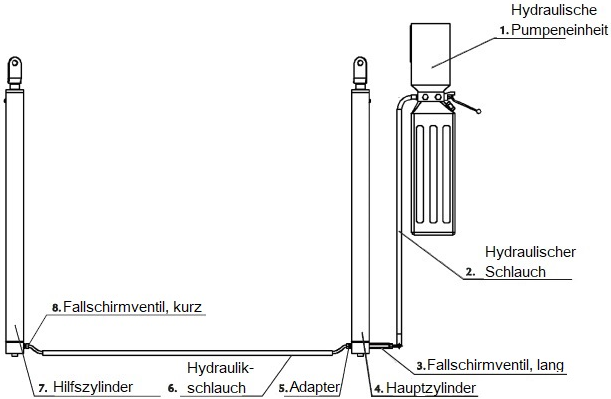

- `A10` zuhanásgátló szelep
- `A9` főhenger
- `A8` süllyesztőszelep
- `A7` egyirányú szelep
- `A6` leeresztőszelep
- `A5` fogaskerék-szivattyú
- `A4` visszacsapó szelep
- `A3` hidraulikatartály
- `A2` olajszűrő
- `A1` motor
- `11` süllyesztési sebességszabályozás

### Kapcsolási rajz - 400 V (6/a. ábra)

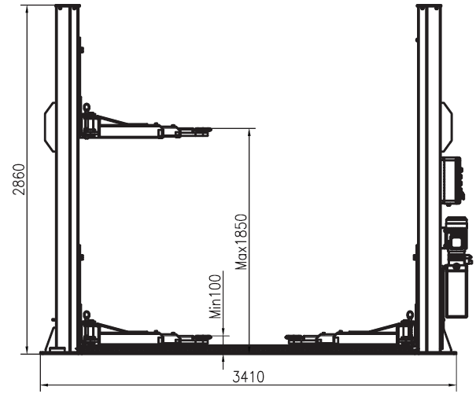

- `QS` hálózati kapcsoló
- `M` motor
- `TC` transzformátor
- `KM` mágneskapcsoló
- `YV` elektromágneses leeresztőszelep
- `SB1` emelés nyomógomb
- `SB2` süllyesztés nyomógomb
- `SB3` biztonsági retesz süllyesztőgomb
- `HL` tápellátás-jelző
- `DT1` 1. elektromágnes
- `DT2` 2. elektromágnes
- `SQ` végálláskapcsoló

### Kapcsolási rajz - 230 V (6/b. ábra)

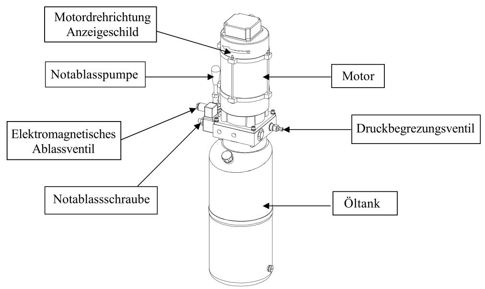

- `QF1` hálózati kapcsoló
- `M` motor
- `ST` túlmelegedés-védelmi relé
- `T` transzformátor
- `KM` mágneskapcsoló
- `YV` elektromágneses leeresztőszelep
- `SB1` emelés nyomógomb
- `SB2` süllyesztés nyomógomb
- `SB3` biztonsági retesz süllyesztőgomb
- `HL` tápellátás-jelző
- `DT1` 1. elektromágnes
- `DT2` 2. elektromágnes
- `SQ` végálláskapcsoló

## 6. Biztonság

Figyelmesen és teljes egészében olvassa el ezt a fejezetet, mert fontos információkat tartalmaz az üzemeltető és a karbantartást végző személy biztonságáról.

> Az emelő kizárólag járművek emelésére, beltéri használatra alkalmas. Minden ettől eltérő használat és a kültéri üzemeltetés szigorúan tilos.

Az üzemeltető és a közelben tartózkodók védelme érdekében az emelő működése közben `1 méter` széles biztonsági zónát kell szabadon hagyni. Az emelőt kizárólag a biztonsági zónában elhelyezett vezérlőpultról szabad működtetni. Személy csak akkor tartózkodhat a megemelt jármű alatt, ha a jármű megfelelő magasságban van, és a biztonsági reteszek be vannak kapcsolva.

> Soha ne használja az emelőt, ha a biztonsági reteszek nem működnek vagy nem megfelelően működnek. A reteszek nélküli üzemeltetés súlyos személyi sérüléshez, halálos balesethez és jelentős anyagi kárhoz vezethet.

### 6.1 Általános biztonsági előírások

Az emelő használójának, üzemeltetőjének és karbantartójának be kell tartania a helyszínen érvényes munkavédelmi és balesetvédelmi előírásokat.

Ezen felül a következőket kell betartani:

- Soha ne kapcsolja ki és ne iktassa ki a hidraulikus és pneumatikus biztonsági berendezéseket.
- Tartsa be a használati útmutatóban és az adattáblán szereplő biztonsági utasításokat.
- Az üzemeltetőnek és más személyeknek emelés közben a biztonsági zónában kell maradniuk.
- Emelés közben a jármű motorját mindig le kell állítani, a kéziféket be kell húzni, a váltót pedig parkolóállásba kell tenni.
- Soha ne lépje túl a használati útmutatóban és az adattáblán megadott maximális teherbírást.
- Az emelő működése közben senki nem tartózkodhat a tartókarokon vagy az áthajtólemezen.

### Biztonságtechnikai előírások az üzembe helyezéshez

1. Az emelő nem alkalmas kültéri használatra, nedves vagy robbanásveszélyes helyiségekben történő működtetésre. A telepítés és az üzemeltetés kizárólag száraz helyiségben történhet.
2. A felállítás helyének megválasztása, a betonpadló minősége és az emelő terhelése az üzemeltető felelőssége. A telepítés előtt a padló teherbírását megfelelő dokumentációval vagy ellenőrzéssel kell igazolni. Szükség esetén új, az előírásoknak megfelelő padlót kell kialakítani. Az emelőt soha ne telepítse aszfaltra.
3. Az emelő elektromos csatlakoztatásához a kábelre csatlakozódugót kell szerelni. Ha az emelő fix elektromos bekötést kap, azt kizárólag megfelelően képzett villanyszerelő végezheti. A csatlakoztatásnál a helyi előírásokat be kell tartani.

### Biztonságtechnikai előírások az üzemeltetéshez

4. A használati útmutatót mindig hozzáférhető helyen kell tartani, és az üzemeltetőnek annak tartalmát követnie kell. A törvényben előírt balesetvédelmi szabályok elsőbbséget élveznek az útmutatóval szemben.
5. Az emelővel személyt emelni tilos, az oszlopokra felmászni tilos.
6. Az emelőt csak arra feljogosított, 18. életévét betöltött személy használhatja.
7. Az emelő közelében illetéktelen személy nem tartózkodhat, és zavaró tárgy sem lehet. A munkaterületet szabadon kell hagyni, az akadályokat el kell távolítani. Ha a jármű dőlni kezd, a veszélyzónát azonnal el kell hagyni.
8. Gondoskodni kell az emelő szabályszerű működéséről. A maximális teherbírást soha nem szabad túllépni.
9. Az emelőt és környezetét tisztán kell tartani. Az elektromos berendezéseket védeni kell a víztől és nedvességtől.
10. A jármű az emelőre csak akkor állhat fel, ha a tartókarok a legalsó helyzetben vannak. A biztonságos és stabil emelés érdekében a járművet mindig a gyártó által megadott emelési pontokon emelje. Az emelő csak a teljes jármű emelésére alkalmas, önálló alkatrészek emelésére nem. A jármű tömege nem haladhatja meg az emelő maximális teherbírását. Emelés és süllyesztés közben a jármű ajtajainak zárva kell lenniük. Az emelőre, az emelőkocsikra és a megemelt járműre nem szabad alkatrészeket vagy szerszámokat helyezni.
11. Az emelés első szakaszában, amikor az emelőtányérok elérik a jármű emelési pontjait, ellenőrizni kell, hogy a tartókarok reteszelése megfelelően működik-e.
12. Rövid emelés után ellenőrizni kell, hogy a jármű megtámasztása és tömegeloszlása biztonságos-e, és megfelel-e a járműgyártó előírásainak.
13. Mielőtt a megemelt járművön dolgozni kezd, ellenőrizze, hogy a biztonsági reteszek be vannak-e akadva.
14. A biztonsági reteszek szabályos működését folyamatosan ellenőrizni kell. Az emelő biztonsági berendezéseit üzemen kívül helyezni vagy működésüket megváltoztatni szigorúan tilos. Ha a biztonsági berendezések nem működnek szabályosan, az emelő használata szigorúan tilos.
15. A hálózati kapcsoló egyben vészkapcsoló is; vészhelyzet esetén azonnal kikapcsolható vele a berendezés.
16. Járó motornál fokozott elővigyázattal dolgozzon a mérgezésveszély miatt.
17. Működés közben tartsa távol kezét és lábát a mozgó alkatrészektől. Leengedéskor ügyeljen arra, hogy a lába ne kerüljön a jármű alá. Ne viseljen bő, laza ruházatot, mert az beszorulhat a mozgó alkatrészek közé.
18. Munka után az emelőt mindig engedje a legalsó helyzetbe.
19. Ha a gépet üzemen kívül helyezi, válassza le az áramforrásról, ürítse ki az olajtartályt, és az olajat a helyi előírások szerint ártalmatlanítsa.
20. Ha a gépet hosszabb időre leállítja:
   - válassza le az áramforrásról
   - ürítse ki az olajtartályt, és az olajat a helyi előírások szerint ártalmatlanítsa
   - kenje meg azokat a mozgó alkatrészeket, amelyeket a por és a kiszáradás károsíthat

### 6.2 Biztonsági berendezések

A túlterhelés és a szerkezeti károsodás elkerülése érdekében az emelő a következő biztonsági berendezésekkel van felszerelve:

**Maximálnyomás-/nyomáshatároló szelep**

A hidraulikaszivattyúba van beépítve, és megakadályozza az emelő névleges teherbírásánál nagyobb teher felemelését.

> A nyomáshatároló szelepet a gyártó a megfelelő értékre állította be. Soha ne állítsa át a teherbírás növelése érdekében.

**Biztonsági leeresztőszelep**

Mindkét munkahenger rendelkezik biztonsági leeresztőszeleppel, amely tömlőszakadás vagy szivattyúhiba esetén megakadályozza az emelő lezuhanását.

**Biztonsági reteszelés**

A biztonsági retesz megakadályozza a lezuhanást a hidraulikarendszer szivárgása vagy törése esetén.

**Holt emberes vezérlés**

A vezérlőelemek funkciói csak addig működnek, amíg a megfelelő gombot vagy kapcsolót a megfelelő helyzetben tartják.

**Nyomógombok**

A véletlen működtetés elkerülésére a gombok gyűrűvel vannak ellátva.

**Az emelőkocsik szinkronizálása**

Az emelőkocsik emelés és süllyesztés közbeni szinkron mozgását speciális drótkötél-rendszer biztosítja.

**Tartókar-reteszelés**

Amint a tartókarok elhagyják az alsó helyzetet, automatikusan reteszelődnek, hogy terhelés alatt ne mozduljanak el.

**Túlmelegedés-védelem**

Ha a motor túlmelegszik, a túlmelegedés-védelmi relé leállítja a motort.

> A biztonsági berendezések kiiktatása szigorúan tilos.  
> A biztonsági berendezések nélküli üzemeltetés súlyos személyi sérüléshez és anyagi kárhoz vezethet.  
> Soha ne kezdjen munkát a járművön, amíg a biztonsági reteszelést nem ellenőrizte.

### 6.3 Biztonsági és figyelmeztető címkék

A biztonsági címkék a veszélyes helyzetekre figyelmeztetik az üzemeltetőt. Ezeket jól látható helyen kell elhelyezni, tisztán kell tartani, és mindig láthatónak kell lenniük. Ha a címkék kifakulnak vagy megsérülnek, cserélni kell őket.

Figyelmesen olvassa el a címkék jelentését, és jegyezze meg őket (7. ábra).

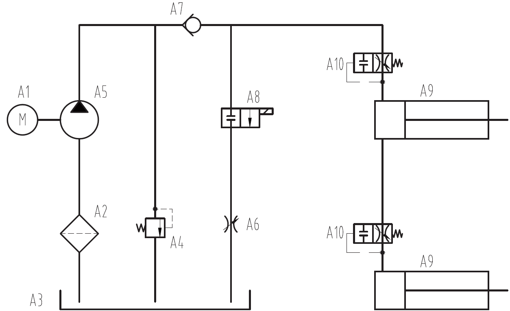

## 7. Telepítés

> A telepítést kizárólag a gyártó vagy a forgalmazó által felhatalmazott, megfelelően képzett szakember végezheti. A laikus által végzett telepítés súlyos személyi sérüléshez és anyagi kárhoz vezethet.

A telepítés megkezdése előtt figyelmesen olvassa el a használati útmutatót. A benne szereplő utasításokat be kell tartani, csak így biztosítható az emelő későbbi helyes működése. Ha a telepítés nem az útmutató szerint történik, a vevő elveszíti a garanciához való jogát. Ha a telepítést nem szakember végzi, a garancia csak az alkatrészekre vonatkozik.

### 7.1 A telepítéshez szükséges szerszámok

- ütvecsavarozó, `16`-os átmérő
- betonfúró szárak
- kalapács
- vízmérték
- villás-csillagkulcs készlet
- állítható villáskulcs
- Crowa és imbusz racsnis kulcskészlet
- feszítővas
- jelölőzsinór
- Torx csavarhúzó
- lapos csavarhúzó
- mérőszalag

### 7.2 A felállítási hely megfelelősége

Az emelő nem alkalmas kültéri, nedves vagy robbanásveszélyes helyiségekben történő használatra. A helyiségnek elég magasnak kell lennie ahhoz, hogy a maximális emelési magasságot a felemelt járművel együtt biztosítsa. Tanulmányozza az épület alaprajzát, hogy tisztázza, hol futnak azok az elektromos vezetékek és vízcsövek, amelyek az oszlopok telepítésekor megsérülhetnek. Vizsgálja meg az emelő környezetét is, hogy a telepítés és az üzemeltetés során más gépek ne sérüljenek meg.

A felállítási hely nem lehet mosóállás, fényezőhely, oldószer- vagy festéktároló mellett. Robbanás- és tűzveszélyes helyiségek közelében történő telepítés szigorúan tilos. Be kell tartani a vonatkozó biztonsági és egészségvédelmi szabványokat, például a falaktól vagy más gépektől való minimális távolságra, vészkijáratokra stb. vonatkozóan.

### 7.3 Világítás

A világítást a helyi előírások szerint kell kialakítani. Az emelő környezetének jól és egyenletesen megvilágítottnak kell lennie.

### 7.4 Padlóviszonyok

Az emelőt sík és szilárd padlóra kell telepíteni. Az aljzatnak képesnek kell lennie a maximális terhelések viselésére még kedvezőtlen munkakörülmények között is. Emelt szinten történő telepítés esetén figyelembe kell venni az aljzat maximális teherbírását. A padlónak meg kell felelnie a `D20/25` szabványnak (`3000 PSI - 2,1 kg/mm` terhelés), síknak és legalább `15 cm` vastagnak kell lennie. Ha a padló nem felel meg ezeknek a követelményeknek, új padlót kell készíteni. Új betonpadló készítése esetén a betonnak legalább `20 napig` kell száradnia. Ha az emelőt vasbeton aljzatra telepítik, annak teherbírását ellenőrizni kell.

Figyelmeztetés: az emelő nem megfelelő padlóra történő telepítése súlyos károkat és sérüléseket okozhat. Az emelőt semmiképpen sem szabad bitumenre vagy dilatációs hézag közelébe telepíteni.

> A padlóra vonatkozó előírásokat be kell tartani.  
> A szabályos telepítéshez ajánlott vízszintmérőt használni.  
> Kisebb szintkülönbségek megfelelő alátétekkel kiegyenlíthetők.  
> Nagyobb lejtés befolyásolja az emelő működését.  
> Ha az aljzat lejtése kétséges (`3 mm` oldalirányban vagy `5 mm` a teljes hosszon), célszerű új betonréteget önteni.

### 7.5 A telepítés helye

- Miután az emelőt eltávolította a csomagolásból, vigye a telepítés helyére.
- Távolítsa el a megmaradt csomagolóanyagot és azokat a csavarokat, amelyek a két oszlopot összetartják.
- Ellenőrizze, hogy minden alkatrész megvan-e; hiány esetén forduljon a kereskedőhöz.
- A telepítést és az üzembe helyezést kizárólag képzett szakember végezheti.
- Az emelőt sík betonpadlóra kell telepíteni.
- A betonnak legalább `15 cm` vastagnak kell lennie, és a rögzítési pontoknak a padló szélétől legalább `1,5 m` távolságra kell lenniük.
- A betonpadlónak síknak és simának kell lennie.

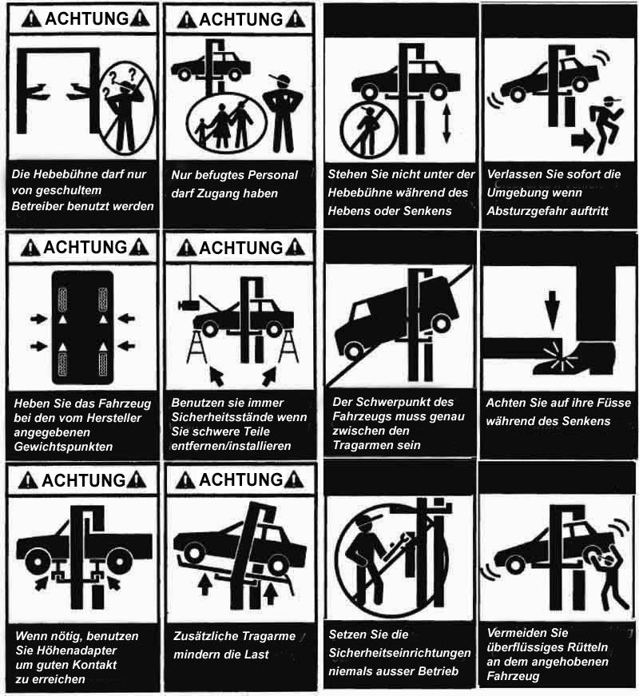

- Jelölőzsinórral rajzolja fel az oszlopok helyét a 8. ábra alapján.
- Állítsa az oszlopokat a helyükre, és ceruzával vagy krétával jelölje meg a furatok és a talplemezek helyét.
- Ismét ellenőrizze az oszlopok talplemezeinek elhelyezkedését; ügyeljen arra, hogy párhuzamosak legyenek egymással és derékszögben álljanak a padlóhoz képest.

### 7.6 Az oszlopok telepítése

- Kezdje a vezérlőpulttal szerelt oszloppal. Emelőeszközzel emelje ki a keretből, helyezze faalátétre, és ügyeljen arra, hogy az oszlop ne sérüljön meg. Ezután az emelőhevedert az oszlop fejrészénél vezesse át, és állítsa függőleges helyzetbe. Az oszlopot a megjelölt helyre kell állítani még azelőtt, hogy a rögzítőcsavarokat meghúzná.
- Az oszlop talpát sablonként használva `18 mm` átmérőjű fúróval készítsen `150 mm` mély furatokat. Ügyeljen arra, hogy a furatok merőlegesek legyenek, és egyenes fúrással készüljenek a biztos rögzítés érdekében. Fúrás után a furatokat sűrített levegővel vagy drótkefével tisztítsa meg a portól. Ellenőrizze, hogy az oszlopok párhuzamosan állnak-e, és hogy a krétavonalon helyezkednek-e el.
- Csavarja fel a tömítőalátéteket és az anyákat a horgonycsavarokra. Minden furatba helyezzen be egy horgonycsavart, majd üsse be addig, amíg el nem éri a furat alját.
- Ha a kiegyenlítéshez hézagolót használ, ügyeljen arra, hogy kellően hosszú horgonycsavart válasszon. A hézagolókat úgy helyezze el, hogy az oszlopok a csavarok meghúzása után egyenesen álljanak.
- Amikor a horgonycsavarok és a hézagolók a helyükön vannak, húzza meg az anyákat. Ehhez semmiképpen ne használjon ütvecsavarozót vagy hasonló szerszámot. Az áthajtólemezt az elsőként felállított oszlop mellé kell lefektetni, majd a második oszlopot a krétavonalaknak és az áthajtólemeznek megfelelően kell felállítani.
- Mielőtt a csavarokat és anyákat végleg meghúzza, a 8. ábra alapján ellenőrizze az oszlopok helyzetét. Vízmértékkel ellenőrizze az oszlopok függőlegességét. Szükség esetén hézagolóval korrigáljon. Ezután a horgonycsavarokat a szükséges nyomatékkal meg kell húzni. Ehhez soha ne használjon ütvecsavarozót.

> A méretek pontos betartása kiemelten fontos. Az eltérések súlyos, akár halálos sérülésekhez és anyagi károkhoz vezethetnek.

### 7.7 A szinkronizáló drótkötelek telepítése

- Emelje fel mindkét emelőkocsit körülbelül `1 méter` magasságba, és rögzítse őket.
- Ellenőrizze, hogy a mechanikus reteszelés be van-e kapcsolva, mielőtt a drótköteleket elhelyezi. Fontos, hogy az emelőkocsik azonos magasságban legyenek.
- A drótköteleket a 9. ábra szerint vezesse be. Ellenőrizze, hogy a kötél a csigakerekekben fekszik-e. Ismét ellenőrizze a drótkötelek elhelyezését.
- A drótkötelek végein lévő anyákat a mellékelt kulccsal egyenletesen húzza meg.

> A drótkötelek feszességét hetente ellenőrizni kell. Ha nem egyformán feszesek, az emelés nem lesz egyenletes. A feszesség állítása csak bekapcsolt biztonsági reteszek mellett végezhető.

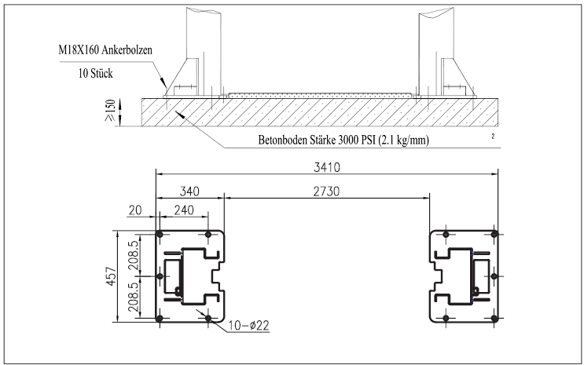

### 7.8 A hidraulikarendszer csatlakoztatása

- Szerelje fel a szivattyúegységet a főoszlopra, és a mellékelt csavarokkal rögzítse.
- Csatlakoztassa a hidraulikatömlőket a tápegységhez, az elosztóhoz és a hidraulikus hengerhez a 10. ábra szerint. Csatlakoztassa a tömlőket, majd húzza meg a csőcsatlakozásokat. Ügyeljen a tömlők és a csatlakozók tisztaságára. A rövidebb tömlő a tápegységet és a vezérlőpult oldalán lévő munkahengert köti össze. A hosszabb tömlő a két munkahengert kapcsolja össze. A hosszabb tömlő csatlakoztatásához fordítsa meg az áthajtólemezt, és a mellékelt rögzítőcímkékkel rögzítse a tömlőt.

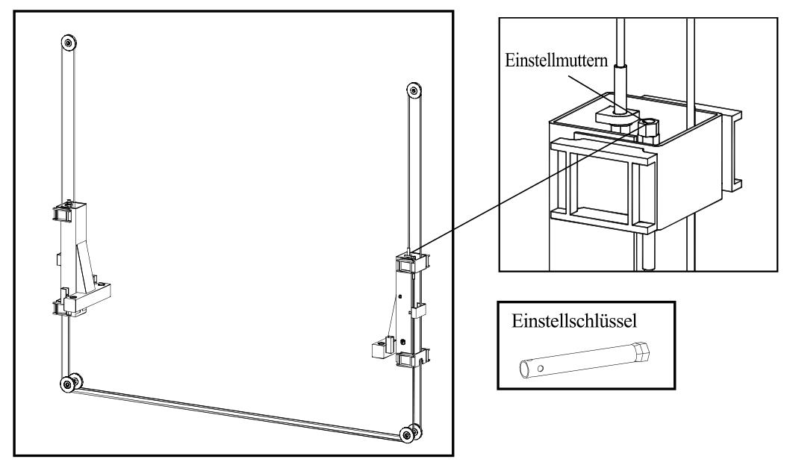

### 7.9 Elektromos csatlakozás

> A csatlakoztatást csak szakképzett villanyszerelő végezheti. A csatlakoztatásra a helyi előírások és jogszabályok vonatkoznak. Győződjön meg arról, hogy a hálózati feszültség megfelel a gép specifikációjának. Ellenőrizze a fázisok helyes bekötését. A helytelen bekötés motorkárosodást okozhat, amelyért a gyártó nem vállal felelősséget. A hidraulikaegységet SOHA ne járassa olaj nélkül. A szivattyú károsodhat. A szivattyúegységet száraz helyen kell tartani. A vezérlőpultot mindig szárazon kell tartani; víz vagy más folyadék, például oldószer által okozott károk nem minősülnek garanciális hibának.

- A mellékelt csavarokkal rögzítse a vezérlőpultot a főoszlopra.
- A gyártó által az oszlopokhoz csatlakoztatott vezetékeket vezesse át az áthajtólemez alatt. Ellenőrizze, hogy a vezetékek nem érnek mozgó alkatrészekhez. Csatlakoztassa a kábelek végeit.
- A 6. ábra segítségével csatlakoztassa a hidraulikus szivattyúegységet.
- Ellenőrizze a fázisok helyes csatlakozását és az emelő földelését. Ellenőrizze az elektromágnesek vezetékcsatlakozását.

### 7.10 A tartókarok telepítése

- Kenje meg a tartókarok menetét és a csapokat.
- A 11. ábrán látható módon emelje a tartókarokat az emelőkocsikra. A rövid karok előre, a hosszú karok hátra nézzenek. Ellenőrizze, hogy a tartókarok helyesen vannak-e pozicionálva és stabilan vannak-e rögzítve.
- Ellenőrizze a tartókarok biztonsági reteszelésének működését. Szükség esetén állítsa be a reteszelést (12. ábra).

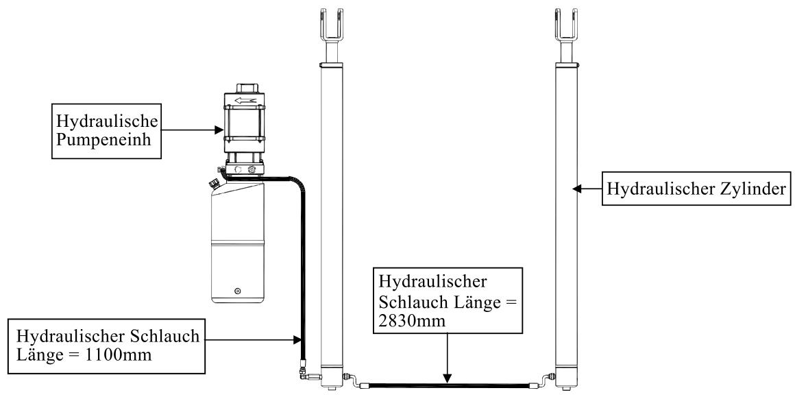

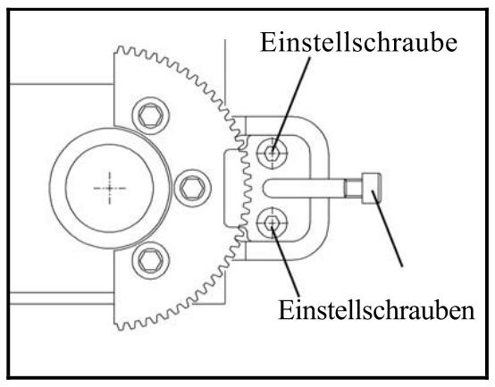

### 7.11 Üzembe helyezés és ellenőrzés

> A hidraulikaszivattyút soha ne működtesse olaj nélkül, mert a szivattyú megsérülhet. Ne emeljen járművet addig, amíg az emelőt alaposan nem ellenőrizte. A telepítés során a biztonsági leeresztőszelepet is be kell állítani mindkét munkahengerben (a főhenger alján és a segédhenger oldalán).

#### 7.11.1 Ellenőrzés üzembe helyezés előtt

- Ellenőrizze, hogy az oszlopok függőlegesen állnak-e, és a tartókarok vízszintesek-e.
- Ellenőrizze, hogy a csavarok megfelelően meg vannak-e húzva.
- Ellenőrizze, hogy a hálózati feszültség megfelel-e a gép specifikációjának.
- Ellenőrizze, hogy az elektromos csatlakoztatás a 6. ábra szerint történt-e.
- Ellenőrizze a hidraulikus csatlakozásokat.
- Ellenőrizze, hogy a biztonsági zónában nincsenek-e személyek vagy zavaró tárgyak.

#### 7.11.2 Üzembe helyezés

- Töltse fel a tartályt körülbelül `10 liter` hidraulikaolajjal (az olaj minőségét az `5.5.` fejezet tartalmazza). A feltöltéshez használja a kupakon található mérőpálcát; az olajszintnek a minimum és maximum jelölés között kell lennie. Ügyeljen arra, hogy szennyeződés ne kerüljön a tartályba. Kapcsolja be a főkapcsolót.
- Ellenőrizze a szivattyú működését az emelés gomb megnyomásával. Ha a tartályban csökken az olajszint, a fázisbekötés helyes. Ha a motor szokatlan hangot ad, azonnal állítsa le, és ellenőrizze az elektromos bekötést.
- Nyomja meg az emelés gombot, és emelje az emelőt maximális magasságra. Ha a hengerek teljesen kinyúltak, engedje el a gombot, különben a szivattyú és a hengerek megsérülhetnek.
- Nyomja meg a süllyesztés gombot, és engedje az emelőt a minimális magasságig le. A maximális emelést és süllyesztést legalább háromszor ismételje meg a rendszer légtelenítéséhez és a hengerek megfelelő olajnyomásának beállításához.

#### 7.11.3 Ellenőrzés az első használat előtt

Használat előtt ellenőrizze:

- a drótkötelek feszességét; emelés közben a kattanó hang jelzi a reteszelést, és mindkét oszlopból egyszerre kell hallatszania
- a biztonsági berendezések és az emelőkocsi-reteszelések szabályos működését
- az olajszintet az olajtartályban; szükség esetén töltse utána
- a munkahengerek működését
- hogy nincs-e szivárgás a hidraulikarendszerben
- hogy az emelő felemeléskor eléri-e a maximális magasságot

### 7.12 A végálláskapcsoló telepítése

> A csatlakoztatást csak szakképzett villanyszerelő végezheti. A csatlakoztatásra a helyi előírások és jogszabályok vonatkoznak. A helytelen bekötés súlyos, akár halálos sérüléshez és anyagi kárhoz vezethet.

- A gyárilag előszerelt végálláskapcsolót a mellékelt csavarokkal rögzítse a vezérlőpulttal szerelt oszlopra a 13. ábra szerint.
- Emelje az emelőkocsikat körülbelül `1900 mm` magasságra, és ellenőrizze, hogy a kapcsoló leállítja-e az emelést.
- Ha a végálláskapcsolót nem a megfelelő magasságba szerelte fel, helyezze át. A végálláskapcsolónak még a munkahengerek teljes kitolása előtt működésbe kell lépnie.

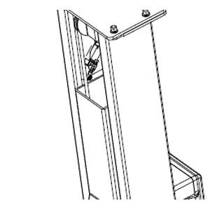

### 7.13 Ellenőrzés terhelés alatt

> Figyelmeztetés: az emelő károsodásának elkerülése érdekében gondosan kövesse a következő bekezdés utasításait.

Figyelem: ne emeljen járművet az emelővel, amíg minden ellenőrzést el nem végzett. Az ellenőrzéshez terhelés nélkül emelje és süllyessze a tartókarokat, és győződjön meg arról, hogy a biztonsági reteszelés szabályosan működik, valamint hogy a hengerek légtelenítettek.

Használat előtt mindig ügyeljen az emelő és elemei szabályos működésére. Az emelő nem használható addig, amíg a telepítés és az ellenőrzések teljesen be nem fejeződtek, és valamennyi reteszelést és rögzítést ellenőrizték. Üzembe helyezés után minden szükséges helyet meg kell kenni (csúszó felületek, láncok, görgők). Az emelőt legalább egyszer teljesen fel és le kell járatni, majd szükség esetén újra meg kell kenni ezeket a pontokat. Ezt követően kell a biztonsági burkolatot felszerelni.

Helyezzen próbaterhet az emelőre, és mozgassa az emelőt `2-3` alkalommal fel és le. Közben:

- ellenőrizze a `7.11.3` fejezetben felsorolt pontokat
- ellenőrizze, hogy működés közben nem hallható-e rendellenes zaj

## 8. Üzemeltetés

Az emelő kizárólag száraz, beltéri helyiségekben használható, mivel erre a célra tervezték. Tilos kültéren üzemeltetni, illetve robbanásveszélyes környezetben felállítani.

Az emelő személyautók és teherautók emelésére alkalmas; az egyes típusok teherbírása a „Műszaki adatok” fejezetben és az adattáblán olvasható.

Az emelő a következő fő részekből áll:

- acéllemez oszlopok emelőkocsikkal
- hidraulikus rendszer
- kiegyenlítő drótkötél
- elektromos rendszer

### Oszlopok és emelőkocsik

Az oszlop acélszerkezet, két vezetőpályával. A vezetőpályákban történik az emelőkocsik függőleges mozgása a hidraulikus hengerek segítségével. A szinkron mozgás biztosítása érdekében az emelőkocsik drótkötelekre vannak szerelve és össze vannak kötve.

Az emelőkocsik és az oszlopok biztonsági reteszekkel vannak ellátva, amelyek megakadályozzák a lezuhanást. Ezek a jármű emelésekor gombnyomásra kapcsolódnak be. Ez megvédi a járművet a lezuhanástól és tehermentesíti a munkahengereket. A biztonsági reteszek bekapcsolásakor az emelő néhány centimétert süllyed, hogy a biztos reteszelés létrejöjjön.

### Hidraulikus rendszer

Az emelő hidraulikus egysége a következőkből áll: elektromotor szivattyúval, olajtartály, hidraulikus henger és elosztó. Az elektromotor gombnyomással működik; a motor nyomatéka a beépített tengelykapcsolón keresztül hajtja meg a szivattyút. A szivattyú az olajszűrőn keresztül felszívja az olajat, és nyomást hoz létre a rendszerben.

A rendszer az olajat az elosztóba juttatja. Az elosztóból az olaj a nyomáshatároló szelepen keresztül a két, az oszlopokba épített hengerhez jut. A nyomáshatároló szelep az emelő maximális teherbírására van beállítva. Ezt semmilyen körülmények között nem szabad elállítani. A hidraulikus egység olajtartályának kapacitása `10 liter`. A süllyesztést elektromosan működtetett szelep vezérli.

Az oszlopokon lévő rögzítőcsavarokat a csavargyártó által megadott nyomatékkal kell meghúzni.

Az emelő minden tekintetben megfelel a hatályos szabványok és előírások követelményeinek. Az emelők üzemeltetésére vonatkozó helyi előírásokat maradéktalanul be kell tartani.

> Az emelőt csak megfelelően képzett, pszichésen és fizikailag alkalmas, 18. életévét betöltött személy üzemeltetheti. A kezelőszemélyzet oktatásáról jegyzőkönyvet kell készíteni.

### Használat előtt

- Ellenőrizze a tömlőket és a csatlakozásokat, hogy nincs-e szivárgás.
- Ne használja az emelőt, ha a biztonsági reteszelés nem működik.
- Ne emelje fel a járművet, ha a teherfelvételi pontok nincsenek helyesen beállítva. Az ebből eredő károkért és sérülésekért a gyártó és a forgalmazó nem felel.
- Az üzemeltetőnek működés közben a biztonsági zónában kell tartózkodnia.
- Néhányszor mozgassa fel és le a tartókarokat, hogy ne maradjon levegő a hengerekben. A hengerekben maradó levegő egyenetlen emelést okoz.

> Soha ne üzemeltesse az emelőt, ha alatta személyek vagy tárgyak vannak.  
> Soha ne lépje túl a maximális teherbírást.  
> Mielőtt munkát kezd a járművön, mindig győződjön meg arról, hogy a biztonsági reteszek be vannak akadva.  
> A jármű biztonságos emeléséhez mindig ellenőrizze a tartókarokon lévő gumitányérokat, és a mellékelt adapterekkel állítsa a magasságot.  
> Ha egy csavar meglazul vagy az emelő bármely alkatrésze hibásnak bizonyul, **NE HASZNÁLJA AZ EMELŐT**, amíg a javítás be nem fejeződik.  
> Az elektromos vezérlőpultot ne érje nedvesség, védje portól és olajtól.

### 8.1 Vezérlés

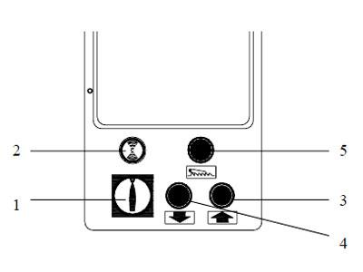

1. **Hálózati kapcsoló**

   A hálózati kapcsoló két állásba kapcsolható:

   - `0` állás: az emelő áramköre feszültségmentes
   - `1` állás: az emelő áramköre feszültség alatt van, az emelő bekapcsolt állapotban van

2. **Tápellátás-jelző**

   Ha a lámpa világít, az emelő áramköre feszültség alatt van.

3. **Emelés gomb - UP**

   A gomb megnyomásakor az emelő áramköre működteti a motort és a hidraulikus rendszert a tartókarok felemeléséhez.

4. **Süllyesztés gomb - DOWN**

   A gomb megnyomásakor a biztonsági reteszek kioldanak, az elektromágneses biztonsági szelep kinyílik, és a tartókarok biztonsági magasságig süllyedni kezdenek.

5. **Biztonsági retesz gomb**

   A gomb megnyomásakor az elektromágneses biztonsági szelep kinyílik, és a tartókarok biztonsági magasságig süllyedni kezdenek.

### 8.2 Emelés

- Győződjön meg arról, hogy a kezelőszemélyzet elolvasta és megértette a használati útmutatót.
- Az emelőkocsiknak és a rájuk szerelt tartókaroknak a legalsó helyzetben kell lenniük. Ebben az állásban a tartókarok biztonsági reteszei még nincsenek bekapcsolva, ezért a karok szabadon forgathatók. A tartókarokat a felhajtás irányával párhuzamosan kell elforgatni. A járművet a tartókarok közé, középre kell beállítani.
- A tartókarokat a járműgyártó előírásai szerint a jármű emelési pontjai alá kell helyezni. A gumibetétes emelőtányérokkal felszerelt tartókarok teleszkóposan kihúzhatók és a jármű alá tolhatók. A tartókarokat úgy kell beállítani, hogy a jármű súlypontja az adapterek között legyen.
- Az `UP (3)` gombbal emelje a tartókarokat addig, amíg az adapterek hozzá nem érnek a járműhöz, majd győződjön meg arról, hogy az emelőtányérok az emelési pontok alatt vannak. Ellenőrizze, hogy a tartókarok biztonsági reteszelése megakadályozza az elmozdulást, és ebben a helyzetben megfelelő biztonságot nyújt.
- Az `UP (3)` gombbal emelje a járművet a kívánt magasságra, majd támassza meg. A kívánt magasság elérése után nyomja meg az `5`-ös biztonsági retesz gombot a reteszelés bekapcsolásához. Ezzel az emelőkocsik annyira süllyednek, hogy a retesz ne oldódjon ki.
- Mielőtt a megemelt járművön dolgozni kezd, ellenőrizze, hogy a biztonsági reteszelés valóban beakadt-e.

### 8.3 Süllyesztés

- Süllyesztés előtt győződjön meg arról, hogy a biztonsági zónában senki nem tartózkodik, és a jármű alatt nincsenek zavaró tárgyak.
- Az emelő süllyesztéséhez nyomja meg az `UP (3)` gombot, és emelje meg az emelőkocsikat `2-3 cm`-rel. Ezzel a biztonsági retesz kiold. A racsni old, és már nem akadályozza az emelőkocsik süllyedését.
- Nyomja meg a `DOWN (4)` gombot. A süllyesztés `2` másodpercen belül megkezdődik.
- Tartsa nyomva a gombot, amíg a kívánt magasságot el nem éri, majd engedje el. Az emelőkocsikat a legalsó helyzetbe kell süllyeszteni, hogy a tartókarok biztonsági reteszelése automatikusan kioldjon, és a karok elforgathatók legyenek. Miután a tartókarokat kifordította, a járművet le lehet hajtani az emelőről.

### 8.4 Kézi vészleengedés

Áramkimaradás vagy a vezérlőpult meghibásodása esetén a platformokat kézzel kell leengedni az alábbiak szerint, a `15.` és `6.` ábrák segítségével.

> Ezt a műveletet csak képzett szakember végezheti.  
> A kézi vészleeresztő szivattyú szakszerűtlen és jogosulatlan használata súlyos anyagi és személyi kárt, valamint az emelő károsodását okozhatja, amelyért a gyártó és a forgalmazó nem vállal felelősséget és nem biztosít garanciát.  
> A vészleengedést gyorsan kell végrehajtani, mivel az elektromágnesek túlmelegedés miatt károsodhatnak.

Kapcsolja le az áramforrást. Készítsen elő egy `12 V` vagy `24 V` akkumulátort. Távolítsa el a leeresztőcsavar műanyag kupakját (`15. ábra - 2`).

A biztonsági retesz be van akadva, ezért az emelő leengedése előtt ki kell oldani:

- Használja a kézi leeresztőszivattyút (`15. ábra - 1`). Csavarja ki a szivattyú karját a felső menetből, majd csavarja be az oldalsó menetbe úgy, hogy a kar oldalra álljon. Pumpálja a kart addig, amíg az emelőkocsik ki nem oldódnak a biztonsági reteszből.
- Nyissa ki a vezérlőpultot Torx csavarhúzóval.
- A 6. ábra alapján válassza szét a `23.`, `24.`, `25.` és `26.` számú vezetékeket.
- Kösse össze a `23.` vezeték végét a `25.` vezetékkel, a `24.` végét pedig a `26.` vezetékkel.
- Csatlakoztassa a két vezetéket az akkumulátor pólusaihoz.
- Amikor a biztonsági reteszt oldó elektromágnes működésbe lép, jellegzetes hangot fog hallani.

Az emelő leengedéséhez:

- Nyissa ki az elektromágneses leeresztőszelepet a leeresztőcsavar (`15. ábra - 2`) óramutató járásával ellentétes irányú elforgatásával. Ezzel a csavarral a süllyesztés sebessége is beállítható.
- Engedje teljesen le az emelőt.

> Miután az emelőt teljesen leengedte, azonnal távolítsa el a vezetékeket az akkumulátorról, mert az elektromágnesek túlmelegedhetnek és megsérülhetnek.  
> Ügyeljen arra, hogy a vezetékeket utána ismét a helyes sorrendben kösse vissza.  
> Ha a vezetékeket rossz sorrendben köti vissza, súlyos anyagi és személyi kár keletkezhet, amelyért a gyártó és a forgalmazó nem vállal felelősséget és nem biztosít garanciát.  
> A kézi vészleengedés után a leeresztőcsavart (`15. ábra - 2`) állítsa vissza normál helyzetbe. Az emelő addig nem tud emelni, amíg a leeresztőcsavar nincs teljesen meghúzva.

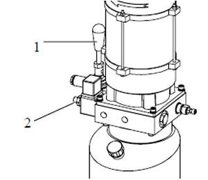

## 9. Karbantartás

> Karbantartást csak az emelőt jól ismerő, képzett szakember végezhet.

Az emelő szabályszerű karbantartásához:

- mindig eredeti pótalkatrészeket és a munkának megfelelő szerszámokat használjon
- kövesse az ütemezett karbantartást, és végezze el a használati útmutatóban leírt időszakos ellenőrzéseket
- keresse meg az esetleges rendellenességek okát, például a túlzott zajt, túlmelegedést, olajszivárgást stb.

> Mielőtt karbantartást vagy javítást kezd, kapcsolja le az áramforrást, lássa el a hálózati kapcsolót lakattal, és a kulcsot őrizze biztonságos helyen, hogy illetéktelen személyek ne kapcsolhassák be az emelőt.

A garancia nem terjed ki azokra a károkra, amelyek szakszerűtlen használatból, a gép túlterheléséből, a használati útmutató tartalmának figyelmen kívül hagyásából, nem engedélyezett tartozékok használatából, illetéktelen javításból és módosításból, normál kopásból, illetve szállítás közben keletkeztek. A garanciaigény a gépkód és a sorozatszám alapján érvényesíthető. Megfelelő karbantartás és üzemeltetés mellett a gép hibátlanul működik és hosszú élettartamú.

Az alább felsorolt karbantartási intervallumok normál üzemre vonatkoznak, és a használat intenzitásától függnek.

### 9.1 Általános karbantartás

Az emelőt legalább havonta egyszer alaposan meg kell tisztítani öntisztító kendőkkel. Minden csuklócsapot legalább hetente egyszer meg kell kenni.

> Víz, mosószer vagy gyúlékony folyadék használata szigorúan tilos.

Ellenőrizze, hogy a hidraulikus hengerek szárai mindig tiszták és sérülésmentesek legyenek, mert ellenkező esetben olajszivárgás és ebből következően meghibásodás léphet fel.

### 9.2 Időszakos karbantartás

| Időköz | Feladat |
| --- | --- |
| Napi ellenőrzés és karbantartás | Ellenőrizze minden reggel, üzem előtt a biztonsági reteszek működését; hallgassa meg, hogy szinkronban működnek-e. |
| Napi ellenőrzés és karbantartás | Ellenőrizze a hidraulikus csatlakozásokat és tömlőket szivárgás szempontjából. |
| Napi ellenőrzés és karbantartás | Ellenőrizze a lánccsatlakozásokat, a drótkötelek csatlakozásait, az elektromos vezetékeket és a kapcsolókat. |
| Napi ellenőrzés és karbantartás | Ellenőrizze a csavarokat és anyákat, és szükség esetén húzza meg őket. |
| Napi ellenőrzés és karbantartás | Ellenőrizze a tartókarok rögzítéseit és reteszeléseit. |
| Heti karbantartás | Ellenőrizze a mozgó alkatrészek tisztaságát. |
| Heti karbantartás | Ellenőrizze a biztonsági reteszelést a fent leírtak szerint. |
| Heti karbantartás | Ellenőrizze az olajszintet: emelje az emelőkocsikat maximális magasságra. Ha nem éri el a maximális magasságot, utántöltés szükséges. |
| Heti karbantartás | Ellenőrizze a csavarokat és anyákat, és szükség esetén húzza meg őket. |
| Havi karbantartás | Ellenőrizze a csavarokat, csapokat és anyákat, és szükség esetén húzza meg őket. Ellenőrizze az oszlopok egyenességét. |
| Havi karbantartás | Ellenőrizze a hidraulikarendszert, csatlakozásait és tömítéseit; szükség esetén húzza meg a laza csatlakozásokat. |
| Havi karbantartás | Ellenőrizze és tisztítsa meg a munkahengereket. Ellenőrizze az olajszintet a tartályban, szükség esetén töltse fel. Ugyanazt az olajtípust használja, és kerülje a hidraulikaolajok keverését. |
| Havi karbantartás | Ellenőrizze a mozgó alkatrészek kenését. Szükség esetén kenje meg azokat. |
| Havi karbantartás | Ellenőrizze az emelőkocsik, tartókarok és láncok rögzítéseit; szükség esetén cserélje őket eredeti alkatrészekre. Ellenőrizze a szinkronizáló drótkötelek feszességét, és ha nem egyformán feszesek, állítsa be őket. |
| Havi karbantartás | Ellenőrizze a tartókarok csapjait, hogy biztonságosan rögzítettek-e. Ellenőrizze a magasságadaptereket és az emelőtányérokat, szükség esetén cserélje őket. |
| Háromhavonta | Az emelő minden alkatrészét szemrevételezni kell, és a hibás részeket ki kell cserélni. |
| Éves karbantartás | Ellenőrizze az emelő minden alkatrészét sérülésekre. |
| Éves karbantartás | Ellenőrizze a szinkronizáló drótkötelek kopását; ha ez meghaladja az `5%`-ot, cserélje ki a köteleket. |
| Éves karbantartás | Villanyszerelővel ellenőriztesse az elektromos rendszert (motor, végálláskapcsoló, vezérlőpult). |
| Éves karbantartás | Ürítse ki a hidraulikatartályt. Töltse fel minőségi olajjal. Tisztítsa meg az olajszűrőt. A használt olajat a helyi előírások szerint kell ártalmatlanítani. Ne keverjen különböző olajokat. |

A karbantartás elvégzése az üzemeltető feladata és felelőssége.

## 10. Hibakeresés

| Hiba | Lehetséges ok | Megoldás |
| --- | --- | --- |
| Az emelő nem működik | a) A hálózati kapcsoló nincs bekapcsolva | a) Kapcsolja be a hálózati kapcsolót |
| Az emelő nem működik | b) Nincs áramellátás | b) Ellenőrizze az áramforrást |
| Az emelő nem működik | c) Az elektromos vezetékek megszakadtak | c) Csatlakoztassa a vezetékeket |
| Az emelő nem működik | d) A biztosítékok kiégtek | d) Ellenőrizze, hogy a hálózati feszültség megfelel-e a gépspecifikációnak, majd cserélje ki a biztosítékokat |
| Az emelő nem emel | a) Az emelő túlterhelt | a) Ellenőrizze a jármű tömegét |
| Az emelő nem emel | b) A motor forgásiránya hibás | b) Cserélje fel a fázisokat az elektromos csatlakozásnál |
| Az emelő nem emel | c) Nincs elegendő hidraulikaolaj | c) Töltse fel az olajat |
| Az emelő nem emel | d) Az `UP` gomb hibás | d) Ellenőrizze az `UP` gombot és csatlakozását; szükség esetén cserélje |
| Az emelő nem emel | e) A nyomáshatároló szelep eltömődött vagy hibás | e) Tisztítsa meg a szelepet; sérülés esetén cserélje |
| Az emelő nem emel | f) A leeresztőszelep nem zár | f) Zárja és tisztítsa meg a szelepet; sérülés esetén cserélje |
| Az emelő nem emel | g) A szivattyú szívótömlőjén lévő szűrő szennyezett | g) Ellenőrizze és szükség esetén tisztítsa meg a szűrőt |
| Az emelő nem emel | h) Levegő van a hidraulikarendszerben | h) Légtelenítse a hidraulikarendszert |
| A teherbírás nem elegendő | a) A szivattyú hibás | a) Ellenőrizze, és szükség esetén cserélje a szivattyút |
| A teherbírás nem elegendő | b) Olajszivárgás a hidraulikarendszerben | b) Ellenőrizze a rendszert szivárgásra, és húzza meg a csatlakozásokat |
| A tartókarok nem mennek le a `DOWN` gomb megnyomására | a) Az elektromágneses leeresztőszelep nem működik megfelelően | a) Ellenőrizze a tápellátást és a mágnest; sérülés esetén cserélje |
| A tartókarok nem mennek le a `DOWN` gomb megnyomására | b) Az elektromágneses biztonsági szelep beragadt | b) Ellenőrizze a tápellátást és a mágnest; sérülés esetén cserélje |
| A tartókarok nem mennek le a `DOWN` gomb megnyomására | c) A szinkronizáló drótkötelek nem egyformán feszesek | c) Ellenőrizze és szinkronizálja a drótköteleket |
| A gép nem emel egyenletesen | a) Levegő van a hidraulikarendszerben | a) Légtelenítse a hidraulikarendszert |
| A gép nem emel egyenletesen | b) A mozgó részek nincsenek kellően kenve | b) Kenje meg a mozgó alkatrészeket |
| A gép nem emel egyenletesen | c) A csúszó részek hibásak | c) Cserélje ki a hibás alkatrészeket |
| A motor nem áll le, amikor a tartókarok elérték a maximális magasságot | d) A maximális magasság végálláskapcsolója nem működik | d) Ellenőrizze, és szükség esetén cserélje ki a kapcsolót |

### Ellenőrzés

A gyártás során minden egyes emelőt ellenőriztek; statikus és dinamikus vizsgálatokat, valamint az elektromos, hidraulikus és pneumatikus rendszerek ellenőrzését is elvégezték.

Az emelőt az üzemeltetőnél rendszeresen, a helyben érvényes előírások szerint ellenőrizni kell.

Ha a felsorolt problémák, lehetséges okok és megoldások ellenére az emelő továbbra sem működik megfelelően, lépjen kapcsolatba a kereskedővel.

## 11. Az üzemeltető feljegyzései

**Kérjük, töltse ki az adattáblán szereplő modellszámokat:**

Gépkód:

Sorozatszám:

Gyártási dátum:

**A telepítés után az alábbi személyek jogosultak az emelő használatára, arra jogosult személy által végzett oktatás után:**

1.
2.
3.
4.
5.
6.
7.
8.
9.
10.

## 12. Telepítési jegyzőkönyv

Gépkód:

Sorozatszám:

Üzemeltető:

Az üzemeltetés helye:

Az üzembe helyezés dátuma:

Ezúton kijelentem, hogy a fent említett gép az előírásoknak megfelelően, szakszerűen került telepítésre.

Minden funkciót és biztonsági berendezést ellenőriztek és kipróbáltak.

A gép minden szempontból szabályosan működik, és megfelel a hatályos balesetvédelmi és munkavédelmi előírásoknak.

Telepítésre feljogosított technikus

A telepítés dátuma:

Üzemeltető:

## Garancia

1. A garancia az értékesítés dátumától számított `12 hónap` (garanciaigény esetén a garancialevélhez mellékelni kell a vásárlási bizonylatot).
2. A garancia nem vonatkozik a szakszerűtlen használatból, a gép túlterheléséből, a használati útmutató tartalmának figyelmen kívül hagyásából, nem engedélyezett tartozékok használatából, illetéktelen javításból és módosításból, normál kopásból, illetve szállítás közben keletkezett károkra. A garancia továbbá nem terjed ki a következő tartozékokra: kefék, tömítések és rendszeresen cserélendő alkatrészek.
3. A gyártó és a forgalmazó nem vállal felelősséget a használati útmutató tartalmától való eltérésből vagy engedély nélküli módosításból eredő személyi sérülésekért és anyagi károkért.
4. Ha a javítás nem garanciális, a vevő viseli az összes költséget (magát a javítást, valamint a műhelybe és a műhelyből történő szállítást).
5. Garanciaigény esetén a garancialevelet és a vásárlási bizonylatot be kell mutatni.
6. A garancia időtartama meghosszabbodik azzal az idővel, ameddig a gép a szervizközpontban volt. Még garanciális hiba esetén is a szállítási költségek az ügyfelet terhelik.

Termék modellszáma:

Vásárlási bizonylat száma:

Dátum:

Pecsét:

Aláírás:

Importőr: `LINCOS d.o.o.`  
Adószám: `SI56623593`  
Bankszámlaszám: `SI56 1010 0005 1418 337`  
`Celovška cesta 492, 1210 Ljubljana`  
Tel.: `+43720 778186`  
E-mail: `shop@lincos.at`  
Gyártás helye: Kína

## Egyéb ManualsLib projektek

- `www.manualslib.com`
- `www.manualslib.de`
- `www.manualslib.es`
- `www.manualslib.fr`
- `www.manualslib.nl`
- `www.manualslib.mx`
- `www.manualslib.tech` - több mint 30 nyelven
## Melléklet: további, a PDF-ből kinyert képek

Az alábbi képek a PDF-ben szereplő további ikonok, ismétlődő jelölések és kisebb grafikai elemek. Ezeket is behivatkozom, hogy az exportált képkészlet teljes legyen.

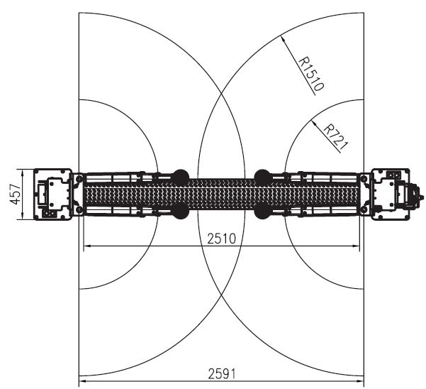

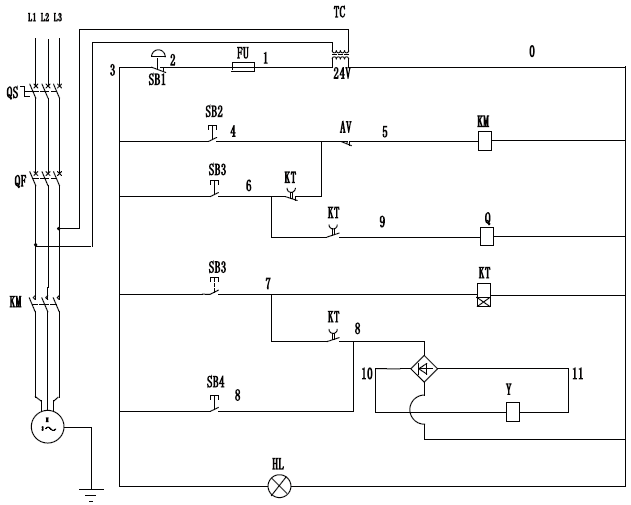
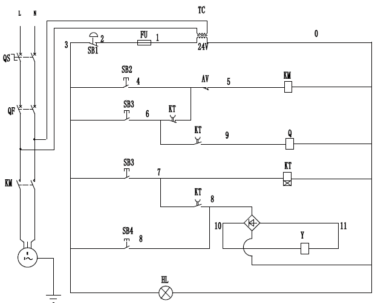

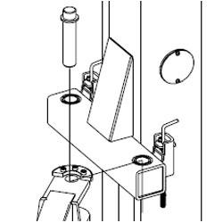

