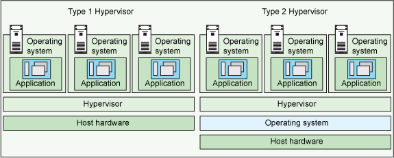
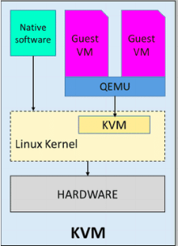
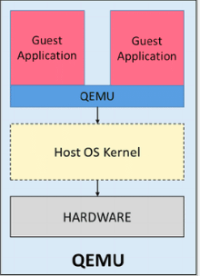
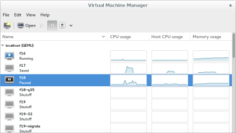
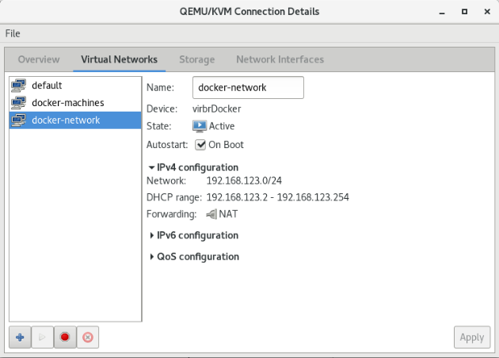
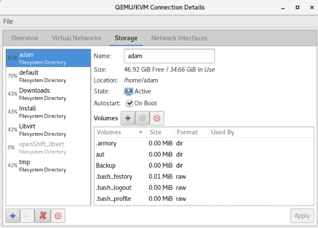
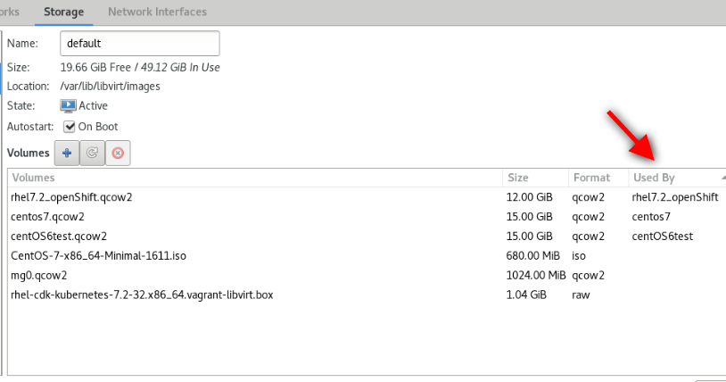
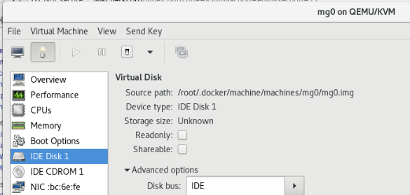
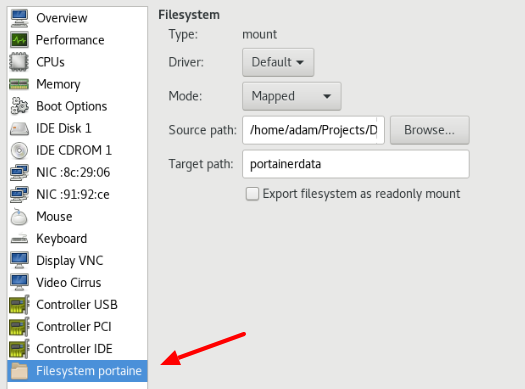

[<< Vissza](../index.md) | [ Switch to English](index-en.md) | 

<hr>

<br>
<!-- TOC -->

- [Alapok](#alapok)
    - [Virtualizációs eszközök](#virtualiz%C3%A1ci%C3%B3s-eszk%C3%B6z%C3%B6k)
        - [KVM](#kvm)
        - [Qemu](#qemu)
        - [KVM vs qemu](#kvm-vs-qemu)
        - [Virtual Box](#virtual-box)
    - [Virtualizációt kezelő eszközök](#virtualiz%C3%A1ci%C3%B3t-kezel%C5%91-eszk%C3%B6z%C3%B6k)
        - [libvirt](#libvirt)
        - [virsh](#virsh)
        - [Virtual Machine Manager app](#virtual-machine-manager-app)
        - [Gnome boxes](#gnome-boxes)
- [Manage machines with virsh](#manage-machines-with-virsh)
    - [List machine](#list-machine)
        - [List VMs](#list-vms)
        - [VM info](#vm-info)
    - [Create machines](#create-machines)
- [Manage networks](#manage-networks)
        - [List all](#list-all)
        - [List IP addresses of the guest](#list-ip-addresses-of-the-guest)
        - [Add new network](#add-new-network)
- [Manage sorages](#manage-sorages)
        - [Pools](#pools)
        - [List Volumes](#list-volumes)
        - [Volumes of VM](#volumes-of-vm)
    - [Mount host folder on guest](#mount-host-folder-on-guest)

<!-- /TOC -->

<br>

# Alapok

**hypervisor (virtualizációs alapfogalom):** Ez itt egy alapfogalom, nem egy konkrét termék. 
A hypervisor or virtual machine monitor (VMM) is computer software, firmware or hardware that creates and runs virtual machines. A computer on which a hypervisor runs one or more virtual machines is called a host machine, and each virtual machine is called a guest machine. The hypervisor presents the guest operating systems with a virtual operating platform and manages the execution of the guest operating systems. Multiple instances of a variety of operating systems may share the virtualized hardware resources

- **Type 1 hypervisor**: hypervisors run directly on the system hardware – A “bare metal” embedded hypervisor,
- **Type 2 hypervisor**: hypervisors run on a host operating system that provides virtualization services, such as I/O device support and memory management.

 
<!--  -->


## Virtualizációs eszközök


### KVM
Type: 1 hypervisor 1 (bear metal)

Kernel-based Virtual Machine (KVM) is a virtualization infrastructure for the Linux kernel that turns it into a hypervisor. It was merged into the Linux kernel mainline in kernel version 2.6.20, which was released on February 5, 2007.KVM requires a processor with hardware virtualization extensions.

 
<!--  -->

 
<!--  -->

A "KVM fölött egy QEMU doboz" ábrázolás valójában azt jelenti, hogy a KVM és a QEMU együttműködik a virtualizált gépek futtatásához. A KVM kezeli a hardveres virtualizációt, és a QEMU használható a gépek emulálására, ha a hardveres virtualizáció nem érhető el, vagy például akkor, ha a virtualizált gépek más architektúrát vagy operációs rendszert emulálnak.
KVM a hardvervirtualizációra épít, és lehetővé teszi, hogy a virtualizált gépek közvetlenül a processzor hardveres virtualizációs támogatását használják ki. Ezáltal a KVM nagyon hatékony és közel valós idejű teljesítményt nyújt.


### Qemu
Type:  hypervisor 2 (software based)

QEMU is performing hardware virtualization (not to be confused with hardware-assisted virtualization), such as disk, network, VGA, PCI, USB, serial/parallel ports, etc. It is flexible in that it can emulate CPUs via dynamic binary translation (DBT) allowing code written for a given processor to be executed on another (i.e ARM on x86, or PPC on ARM). Though QEMU can run on its own and emulate all of the virtual machine’s resources, as all the emulation is performed in software it is extremely slow.

 
<!--  -->


A QEMU egy szoftveres emulator, amely lehetővé teszi a gépek teljes emulációját. Ez a módszer általában lassabb és erőforrásigényesebb, mint a KVM, mivel az operációs rendszer és az alkalmazások teljes emulációját végzi el.


### KVM vs qemu
As previously mentioned, QEMU can run independently, but due to the emulation being performed entirely in software it is extremely slow. To overcome this, QEMU allows you to use KVM as an accelerator so that the physical CPU virtualization extensions can be used. So to conclude: QEMU is a type 2 hypervisor that runs within user space and performs virtual hardware emulation, whereas KVM is a type 1 hypervisor that runs in kernel space, that allows a user space program access to the hardware virtualization features of various processors.[3]

Finally, It is also worth mentioning a little history, which in my opinion has led to some of the confusion around KVM/QEMU. Previously KVM was a fork of QEMU, named qemu-kvm. However, this has now been merged into QEMU upstream and the fork has now been discontinued. Or in other words, as per Linux KVM,


### Virtual Box
Type:  hypervisor 2 (software based)

Developed by Oracle, VirtualBox is an open source virtualization software that is a type 2 hypervisor. That means it runs on a conventional OS just as other computer programs do and abstracts guest operating systems from the host OS. Type 2 hypervisors like VirtualBox are sometimes called “hosted” hypervisors because they rely on the host machine’s pre-existing OS to manage calls to CPU, memory, storage, and network resources.

<br>


## Virtualizációt kezelő eszközök

### libvirt
libvirt is an open-source API, daemon and management tool for managing platform virtualization.[3] It can be used to manage KVM, Xen, VMware ESX, QEMU and other virtualization technologies. These APIs are widely used in the orchestration layer of hypervisors in the development of a cloud-based solution.


### virsh
The **virsh** tool is built on the libvirt management API and operates as an alternative to the xm tool and the graphical guest Manager(virt-manager). Unprivileged users can employ this utility for read-only operations


### Virtual Machine Manager (app)
The virt-manager application is a desktop user interface for managing virtual machines through libvirt. It primarily targets KVM VMs, but also manages Xen and LXC (linux containers). It presents a summary view of running domains, their live performance & resource utilization statistics. Wizards enable the creation of new domains, and configuration & adjustment of a domain’s resource allocation & virtual hardware. An embedded VNC and SPICE client viewer presents a full graphical console to the guest domain.

 
<!--  -->


### Gnome boxes
GNOME Boxes is an application of the GNOME Desktop Environment, used to access virtual systems. Boxes uses the QEMU, KVM, and libvirt virtualization technologies. Lényegében ez egy virsh grafikus kliens, pont olyan mint a 'Virtual Machine Manager' manager. 
<br>


<br>


# Manage machines with virsh


## List machine

A virtuális gépek leíró xml-je a **/etc/libvirt/qemu** mappában található: 
```
1. ll /etc/libvirt/qemu
total 40
drwxr-xr-x  2 root root 4096 Jun 28 20:42 autostart
-rw-------  1 root root 4222 Sep 18  2016 centOS6test.xml
-rw-------  1 root root 4430 Mar  3 18:56 centos7.xml
-rw-------  1 root root 3006 Jul 14 17:46 mg0.xml
drwx------. 3 root root 4096 Jun 22 19:26 networks
-rw-------  1 root root 4246 Jan  6  2017 rhel7.2_openShift.xml
```


Ha egy gépnek beállítjuk, hogy automatikusan induljon el, akkor a libvirt létre fog hozni egy linket az **autostart** mappába
```
2. virsh autostart mg0
```

```
3. ll /etc/libvirt/qemu/autostart/
total 0
lrwxrwxrwx 1 root root 25 Jul 15 11:05 mg0.xml -> /etc/libvirt/qemu/mg0.xml
```

Autostart megszüntetése: 
```
4. virsh autostart mg0 --disable
```


A **/etc/libvirt/qemu**-ben található leíró xml-eket a **virsh edit** paranccsal lehet szerkeszteni. 
```
5. export EDITOR=mcedit
6. virsh edit mg0
...
```


### List VMs
A --all kapcsolóval a nem futó vm-eket is mutatja. 
```
7. virsh list --all
 Id    Name                           State
----------------------------------------------------
 4     mg0                            running
 -     centOS6test                    shut off
```


### VM info
```
8. virsh dominfo mg0
Id:             4
Name:           mg0
UUID:           8cd073a2-577a-438e-a449-681a58100fb3
OS Type:        hvm
State:          running
CPU(s):         1
CPU time:       26.7s
Max memory:     1048576 KiB
Used memory:    1048576 KiB
Persistent:     yes
Autostart:      disable
Managed save:   no
Security model: none
Security DOI:   0
```


## Create machines


<br>


# Manage networks

### List all
List all the running networks: 
```
9. virsh net-list
 Name                 State      Autostart     Persistent
----------------------------------------------------------
 default              active     yes           yes
 docker-machines      active     yes           yes
```
With the --a switch, the non running networks will be listed as well. 

```
10. virsh net-info default
Name:           default
UUID:           3eb5cb82-b9ea-4a6e-8e54-1efea603f90c
Active:         yes
Persistent:     yes
Autostart:      yes
Bridge:         virbr0
```


### List IP addresses of the guest

```
11. virsh domifaddr mg0
 Name       MAC address          Protocol     Address
-------------------------------------------------------------------------------
 vnet0      52:54:00:09:36:24    ipv4         192.168.123.36/24
 vnet1      52:54:00:98:d3:28    ipv4         192.168.42.36/24
```


### Add new network
Create the network description file: 
https://libvirt.org/formatnetwork.html
```xml
<network>
  <name>docker-network</name>
  <bridge name="virbrDocker"/>
  <forward mode="nat"/>
  <ip address="192.168.123.1" netmask="255.255.255.0">
    <dhcp>
      <range start="192.168.123.2" end="192.168.123.254"/>
    </dhcp>
  </ip>
  <ip family="ipv6" address="2001:db8:ca2:2::1" prefix="64"/>
</network>
```
- **name**: The content of the name element provides a short name for the virtual network. This name should consist only of alpha-numeric characters and is required to be unique within the scope of a single host. It is used to form the filename for storing the persistent configuration file. Since 0.3.0
- **uuid**: The content of the uuid element provides a globally unique identifier for the virtual network. The format must be RFC 4122 compliant, eg 3e3fce45-4f53-4fa7-bb32-11f34168b82b. If omitted when defining/creating a new network, a random UUID is generated. Since 0.3.0
- **bridge** : The name attribute on the bridge element defines the name of a bridge device which will be used to construct the virtual network. The virtual machines will be connected to this bridge device allowing them to talk to each other. The bridge device may also be connected to the LAN. When defining a new network with a <forward> mode of "nat" or "route" (or an isolated network with no <forward> element), libvirt will automatically generate a unique name for the bridge device if none is given, and this name will be permanently stored in the network configuration so that that the same name will be used every time the network is started. For these types of networks (nat, routed, and isolated), a bridge name beginning with the prefix "virbr" is recommended
- **forward** : Inclusion of the forward element indicates that the virtual network is to be connected to the physical LAN.Since 0.3.0. The mode attribute determines the method of forwarding. If there is no forward element, the network will be isolated from any other network (unless a guest connected to that network is acting as a router, of course). The following are valid settings for mode (if there is a forward element but mode is not specified, mode='nat' is assumed):
	- **nat**: All traffic between guests connected to this network and the physical network will be forwarded to the physical network via the host's IP routing stack, after the guest's IP address is translated to appear as the host machine's public IP address (a.k.a. Network Address Translation, or "NAT"). This allows multiple guests, all having access to the physical network, on a host that is only allowed a single public IP address.
	- **route**:Guest network traffic will be forwarded to the physical network via the host's IP routing stack, but without having NAT applied.
Add the new network based on the new file: 
```
12. virsh net-define docker-network.xml 
Network docker-network defined from docker-network.xml
```

```
13. virsh net-list --all
 Name                 State      Autostart     Persistent
----------------------------------------------------------
 default              active     yes           yes
 docker-machines      active     yes           yes
 docker-network       inactive   no            yes
```

 
<!--  -->


Start the new network and make it auto start: 
```
14. virsh net-start docker-network
15. virsh net-autostart docker-network
```

Check the new network: 
It should be listed among the interfaces: 
```
16. ifconfig
virbrDocker: flags=4099<UP,BROADCAST,MULTICAST>  mtu 1500
        inet 192.168.123.1  netmask 255.255.255.0  broadcast 192.168.123.255
        ...
```

Lets check it in the virsh interactive shell, with the **net-dumpxml** command: 
```
17. virsh
Welcome to virsh, the virtualization interactive terminal.

Type:  'help' for help with commands
       'quit' to quit

virsh #

virsh# net-dumpxml docker-network
<network>
  <name>docker-network</name>
  <uuid>fe2dd1e8-c32f-469c-b4ca-4338a0acfac5</uuid>
  <forward mode='nat'>
    <nat>
      <port start='1024' end='65535'/>
    </nat>
  </forward>
  <bridge name='virbrDocker' stp='on' delay='0'/>
  <mac address='52:54:00:9f:ff:ba'/>
  <ip address='192.168.123.1' netmask='255.255.255.0'>
    <dhcp>
      <range start='192.168.123.2' end='192.168.123.254'/>
    </dhcp>
  </ip>
  <ip family='ipv6' address='2001:db8:ca2:2::1' prefix='64'>
  </ip>
</network>


```

<br>

<br>


# Manage sorages

https://libvirt.org/storage.html<br>

https://www.suse.com/documentation/sles11/book_kvm/data/sec_libvirt_storage_virsh.html<br>

https://access.redhat.com/documentation/en-us/red_hat_enterprise_linux/7/html/virtualization_deployment_and_administration_guide/sect-managing_guest_virtual_machines_with_virsh-storage_pool_commands<br>
<br>

A storage pool is a quantity of storage set aside by an administrator, often a dedicated storage administrator, for use by virtual machines. Storage pools are divided into storage volumes either by the storage administrator or the system administrator, and the volumes are assigned to VMs as block devices.


### Pools
```
18. virsh pool-list --details
 Name       State    Autostart  Persistent    Capacity  Allocation   Available
-------------------------------------------------------------------------------
 adam       running  yes        yes          81.58 GiB   34.68 GiB   46.90 GiB
 default    running  yes        yes          68.78 GiB   49.12 GiB   19.66 GiB
 Downloads  running  yes        yes         733.42 GiB  321.71 GiB  411.71 GiB
 Install    running  yes        yes         733.42 GiB  321.71 GiB  411.71 GiB
 Libvirt    running  yes        yes          81.58 GiB   34.68 GiB   46.90 GiB
 tmp        running  yes        yes          81.58 GiB   34.68 GiB   46.90 GiB
```

 
<!--  -->


```
19. virsh pool-info default
Name:           default
UUID:           9cfd52e2-64d7-4d55-9552-5ae6da49105b
State:          running
Persistent:     yes
Autostart:      yes
Capacity:       68.78 GiB
Allocation:     49.12 GiB
Available:      19.66 GiB
```


### List Volumes

Ha erről másképpen nem rendelkezünk, akkor az új vm-ek a default pool-ba jönnek létre. Listázzuk a pool-ban lévő volume-okat. 
```
20. virsh vol-list --details default
 Name                                                   Path                                                                           Type    Capacity  Allocation
--------------------------------------------------------------------------------------------------------------------------------------------------------------------
 CentOS-7-x86_64-Minimal-1611.iso                       /var/lib/libvirt/images/CentOS-7-x86_64-Minimal-1611.iso                       file  680.00 MiB  680.00 MiB
 centOS6test.qcow2                                      /var/lib/libvirt/images/centOS6test.qcow2                                      file   15.00 GiB    5.08 GiB
 centos7.qcow2                                          /var/lib/libvirt/images/centos7.qcow2                                          file   15.00 GiB    2.96 GiB
 mg0.qcow2                                              /var/lib/libvirt/images/mg0.qcow2                                              file    1.00 GiB  332.00 KiB
 rhel-cdk-kubernetes-7.2-32.x86_64.vagrant-libvirt.box  /var/lib/libvirt/images/rhel-cdk-kubernetes-7.2-32.x86_64.vagrant-libvirt.box  file    1.04 GiB    1.04 GiB
 rhel7.2_openShift.qcow2                                /var/lib/libvirt/images/rhel7.2_openShift.qcow2                                file   12.00 GiB    2.07 MiB
```


```
21. virsh vol-info mg0.qcow2 --pool default
Name:           mg0.qcow2
Type:           file
Capacity:       1.00 GiB
Allocation:     332.00 KiB
```


### Volumes of VM

A virsh sajnos nem biztosít semmilyen eszközt arra, hogy a kilistázza hogy melyik volume-ot melyik VM használja. Ráadásul azok a volume-okat, amik nincsenek pool-ban lehet hogy semmilyen módon nem mutatja meg. A **Virtual Machine Manager** a pool-volume listában meg tudja mutatni, hogy melyik machine használja a volume-ot: 

 
<!--  -->

<br>

<br>

De van rá mód, hogy a parancssorból mi is kiderítsük ezt. Ahogy azt már láthattuk, az VM információk a **/etc/libvirt/qemu** mappában található XML fájlokban vannak tárolva. Ebben a fájlban szemmel is megkereshetjük a felcsatolt volume-okat, vagy egy XLST transzformációval is kinyerhetjük a kívánt sorokat a xsltproc program segítségével. 


> **NOTE:** **xsltproc** is a command line tool for applying XSLT stylesheets to XML documents


Az alábbi XLST stíluslapra lesz szükségünk: **guest_storage_list.xsl**
```
<?xml version="1.0" encoding="UTF-8"?>
<xsl:stylesheet version="1.0"
  xmlns:xsl="http://www.w3.org/1999/XSL/Transform">
  <xsl:output method="text"/>
  <xsl:template match="text()"/>
  <xsl:strip-space elements="*"/>
  <xsl:template match="disk">
    <xsl:text>  </xsl:text>
    <xsl:value-of select="(source/@file|source/@dev|source/@dir)[1]"/>
    <xsl:text>&#10;</xsl:text>
  </xsl:template>
</xsl:stylesheet>
```


Majd **xsltproc** programmal a kívánt VM konfigurációs fájljára lefuttatjuk: 
```
22. xsltproc guest_storage_info.xsl /etc/libvirt/qemu/mg0.xml
  /root/.docker/machine/machines/mg0/mg0.img
  /root/.docker/machine/machines/mg0/boot2docker.iso
```
Kilistázta a virtuális merevlemezt és a CD-romot, amiben a telepítésre használt iso van. Ezeket a **Virtual Machine Manager**-ben is láthatjuk: 

 
<!--  -->


A qemu-img paranccsal le lehet kérdeni egy adott volume részleteit: 
```
23. qemu-img info /root/.docker/machine/machines/mg0/mg0.img
image: /root/.docker/machine/machines/mg0/mg0.img
file format: raw
virtual size: 4.9G (5242880000 bytes)
disk size: 192M
```
> **NOTE:** The **qemu-img** command line tool is used for formatting various file systems used by Xen and KVM. qemu-img should be used for formatting guest images, additional storage devices and network storage. qemu-img options and usages are listed below.

<hr>
<br>

<br>


## Mount host folder on guest
A host ugyan azon mappáját mount-olhatjuk több guest-en is, ami az alapját képezheti kommunikációnak, vagy perzisztens tárként használhatjuk. A host egy adott mappáját **9p** (Plan 9 folder sharing over Virtio - I/O virtualization framework) típusú fájlrendszeren ajánlja ki a KVM a guest-nek. 

> **WARNING:** A 9p-vel felcsatolt host mappákat nem lehet felcsatolni a guest-en futó docker konténerbe. A olyan perzisztens közös meghajtóra van szükségünk, ami több guest-en futó docker konténer is elér, akkor NFS fájlrendszert használjunk


A host egy mappáját a guest-en két lépésben lehet felcsatolni. Első lépésben a host egy mappáját fel kell venni a guest domain.xml fájljába mint felcsatolható mappa. Ha ez megvan, akkor a guest-re be kell lépni, és ott a már elérhető 9p típusú meghajtót fel tudjuk csatolni. 

Nem tudok róla, hogy lenne direkt virsh parancs ami egy új mappa megosztást hozzá tudna adni egy domain-hez. Ezért első lépésként exportálni kell a domain xml leíróját, majd abba xmlstarlet-el be fogjuk szúrni a megfelelő file megosztó szekciót, az új xml-ből újra fogjuk definiálni a domain-t, majd újra fogjuk indítani a virtuális gépet, hogy a változtatások érvényre jussanak. 


A domain.xml-ben a device szekcióban ezt kell elhelyezni: 
```xml
    <filesystem type="mount" accessmode="mapped">
      <source dir="/home/adam/Projects/DockerCourse/portainer/data"/>
      <target dir="portainerdata"/>
    </filesystem>
```
A target tartalma nem a guest-en a mappa ahova fel akarjuk csatolni a host mappáját. Ez csupán a meghajtó neve, ahogy a guest-en elérhető lesz a host mappája, a mount parancsban majd ezzel a névvel kel hivatkozni a megosztásra. 


Az alábbi példában **mg0**-nak hívják a virtuális gépet, ahova fel akarjuk csatolni a '**/home/adam/Projects/DockerCourse/portainer/data**' mappát. A megosztás neve: portainerdata
```sh
#!/bin/bash

virsh dumpxml mg0 > mg0.xml


xmlstarlet ed --inplace --subnode "/domain/devices" --type elem -n filesystem -v "" mg0.xml
xmlstarlet ed -O --inplace --insert "/domain/devices/filesystem" --type attr -n type -v mount mg0.xml
xmlstarlet ed -O --inplace --insert "/domain/devices/filesystem" --type attr -n accessmode -v mapped mg0.xml

xmlstarlet ed --inplace --subnode "/domain/devices/filesystem" --type elem -n 'source' -v "" mg0.xml
xmlstarlet ed -O --inplace --insert "/domain/devices/filesystem/source" --type attr -n dir -v '/home/adam/Projects/DockerCourse/portainer/data' mg0.xml

xmlstarlet ed --inplace --subnode "/domain/devices/filesystem" --type elem -n target -v "" mg0.xml
xmlstarlet ed -O --inplace --insert "/domain/devices/filesystem/target" --type attr -n dir -v portainerdata mg0.xml

virsh define mg0.xml
	
	ssh ... sudo mkdir /var/lib/boot2docker/portainerdata
	ssh ... sudo chmod 777 /var/lib/boot2docker/profile
	ssh ... "echo 'sudo mount -a -t 9p -o trans=virtio,rw,version=9p2000.L portainerdata /var/lib/boot2docker/portainerdata' >> /var/lib/boot2docker/profile"

	virsh shutdown mg0
	sleep 15s
	virsh start mg0
```
> **NOTE:** A fenti példában a guest-en boot2docker operációs rendszer fut, ami egy különleges állatfaj. Kizárólag a /var/lib/boot2docker mappa tartalma boot perzisztens, mind máshol eszközölt változtatás eltűnik újrainduláskor. Így az fstab-ba sem lehet írni, kizárólag a /var/lib/boot2docker/profile fájlba elhelyezett parancsokkal lehet a mount-ot boot perzizstenssé tenni. Ha a guest-en normál disztribúció fut, akkor írhatjuk a mount-ot az fstab-ba is. 


A Virtual Machine Manager-ben így néz ki a végeredmény: 

 
<!--  -->

