[<< Vissza](../index.md) | [ Switch to English](index-en.md)

<hr>

 
<!-- 

<br>

<!-- TOC -->

- [Elméleti háttér](#elm%C3%A9leti-h%C3%A1tt%C3%A9r)
    - [Edgar F. Codd](#edgar-f-codd)
    - [Segéd fogalmak](#seg%C3%A9d-fogalmak)
        - [Referential integrity](#referential-integrity)
        - [ACID Atomicity, Consistency, Isolation, Durability](#acid-atomicity-consistency-isolation-durability)
            - [Atomicity database systems](#atomicity-database-systems)
            - [Consistency](#consistency)
            - [Isolation](#isolation)
            - [Durability](#durability)
    - [Normal forms](#normal-forms)
        - [First normal form](#first-normal-form)
        - [Second normal form](#second-normal-form)
        - [Third normal form](#third-normal-form)
    - [Database Normalization](#database-normalization)
    - [Denormalization](#denormalization)
- [Cassandra bemutatása](#cassandra-bemutat%C3%A1sa)
    - [Mikor van szükségem Cassand-rára](#mikor-van-sz%C3%BCks%C3%A9gem-cassand-r%C3%A1ra)
    - [Alap tulajdonságok](#alap-tulajdons%C3%A1gok)
        - [Distributed and Decentralized](#distributed-and-decentralized)
        - [Elastic Scalability](#elastic-scalability)
        - [High Availability and Fault Tolerance](#high-availability-and-fault-tolerance)
        - [Tuneable Consistency](#tuneable-consistency)
    - [Adatszerkezet](#adatszerkezet)
        - [Táblák felépítése Column families](#t%C3%A1bl%C3%A1k-fel%C3%A9p%C3%ADt%C3%A9se-column-families)
        - [Kulcsok](#kulcsok)
        - [Partition key](#partition-key)
        - [Compound primary key](#compound-primary-key)
        - [Clustering key](#clustering-key)
        - [Partíció példa](#part%C3%ADci%C3%B3-p%C3%A9lda)
    - [Időbélyegek és Time to Live](#id%C5%91b%C3%A9lyegek-%C3%A9s-time-to-live)
    - [Másodlagos indexek](#m%C3%A1sodlagos-indexek)
    - [Materialized Views](#materialized-views)
- [Architektúra](#architekt%C3%BAra)
    - [Alapfogalmak](#alapfogalmak)
        - [Gossip pletykák](#gossip-pletyk%C3%A1k)
        - [Snitches](#snitches)
        - [Lightweight Transactions check-and-set](#lightweight-transactions-check-and-set)
    - [Node-ok csoportosítása](#node-ok-csoportos%C3%ADt%C3%A1sa)
        - [Seed Nodes](#seed-nodes)
- [Telepítés](#telep%C3%ADt%C3%A9s)
- [docker run --name cassandra -p 9042:9042 -d cassandra](#docker-run---name-cassandra--p-90429042--d-cassandra)
- [docker run -it --rm cassandra /bin/bash](#docker-run--it---rm-cassandra-binbash)
- [CQL Cassandra Query Language alapok](#cql-cassandra-query-language-alapok)
    - [Keyspace és cluster info](#keyspace-%C3%A9s-cluster-info)
    - [Alap query](#alap-query)
    - [Listák és Map-ek](#list%C3%A1k-%C3%A9s-map-ek)
        - [Sets](#sets)
        - [List](#list)
        - [Map](#map)
        - [User defined type](#user-defined-type)
- [Kulcsok és indexek lekérdezésekben](#kulcsok-%C3%A9s-indexek-lek%C3%A9rdez%C3%A9sekben)
    - [Kulcs használati alapelvek](#kulcs-haszn%C3%A1lati-alapelvek)
    - [Lekérdezés megkötések Restriction](#lek%C3%A9rdez%C3%A9s-megk%C3%B6t%C3%A9sek-restriction)
        - [Particionáló kulcsok + indexek](#particion%C3%A1l%C3%B3-kulcsok--indexek)
        - [Clustering kulcsok](#clustering-kulcsok)
        - [IN megkötés](#in-megk%C3%B6t%C3%A9s)
        - [CONTAINS és CONTAINS KEY megkötések](#contains-%C3%A9s-contains-key-megk%C3%B6t%C3%A9sek)
- [Adatbázis GUI](#adatb%C3%A1zis-gui)
        - [DevCenter](#devcenter)
        - [RazorSQL](#razorsql)
- [Adat model](#adat-model)
    - [Conceptual Data Modeling](#conceptual-data-modeling)
    - [Defining Application Queries](#defining-application-queries)
    - [Logikai adatmodell](#logikai-adatmodell)
        - [Chebotko logical diagram](#chebotko-logical-diagram)
    - [Fizikai adatmodell](#fizikai-adatmodell)
        - [Materialized views](#materialized-views)
- [Tervezés](#tervez%C3%A9s)
    - [Partíció mérete](#part%C3%ADci%C3%B3-m%C3%A9rete)
- [Java kliens](#java-kliens)

<!-- /TOC -->

<br>

# Elméleti háttér


## Edgar F. Codd
https://en.wikipedia.org/wiki/Edgar_F._Codd<br>

Edgar Frank "Ted" Codd (19 August 1923 – 18 April 2003) was an English computer scientist who, while working for IBM, invented the relational model for database management, the theoretical basis for relational databases and relational database management systems. He made other valuable contributions to computer science, but the relational model, a very influential general theory of data management, remains his most mentioned, analyzed and celebrated achievement


## Segéd fogalmak


### Referential integrity
Referential integrity is a property of data stating references within it are valid. In the context of relational databases, it requires every value of one attribute (column) of a relation (table) to exist as a value of another attribute (column) in a different (or the same) relation (table).[1]

For **referential integrity to hold** in a relational database, any column in a base table that is declared a foreign key can contain either a null value, or only values from a parent table's primary key or a candidate key. In other words, when a foreign key value is used it must reference a valid, existing primary key in the parent table. For instance, deleting a record that contains a value referred to by a foreign key in another table would break referential integrity.


### ACID (Atomicity, Consistency, Isolation, Durability)


#### Atomicity (database systems)
In database systems, atomicity is one of the ACID (Atomicity, Consistency, Isolation, Durability) transaction properties. An atomic transaction is an indivisible and irreducible series of database operations such that either all occur, or nothing occurs.[1] A guarantee of atomicity prevents updates to the database occurring only partially, which can cause greater problems than rejecting the whole series outright


#### Consistency
Consistency in database systems refers to the requirement that any given database transaction must change affected data only in allowed ways. Any data written to the database must be valid according to all defined rules, including constraints, cascades, triggers, and any combination thereof. 


#### Isolation
Isolation is typically defined at database level as a property that defines how/when the changes made by one operation become visible to other.


#### Durability
In database systems, durability is the ACID property which guarantees that transactions that have committed will survive permanently.


## Normal forms
Codd introduced the concept of normalization and what is now known as the first normal form (1NF) in 1970.[4] Codd went on to define the second normal form (2NF) and third normal form (3NF) in 1971,[5] and Codd and Raymond F. Boyce defined the Boyce-Codd normal form (BCNF) in 1974.[6]

Informally, a relational database relation is often described as "normalized" if it meets third normal form.[7] Most 3NF relations are free of insertion, update, and deletion anomalies.


### First normal form
First normal form is an essential property of a relation in a relational database. Database normalization is the process of representing a database in terms of relations in standard normal forms, where first normal is a minimal requirement.

First normal form enforces these criteria:
- Eliminate repeating groups in individual tables.
- Create a separate table for each set of related data.
- Identify each set of related data with a primary key


**Examples:** <br>


https://www.quora.com/What-is-the-difference-between-NF-2NF-and-3NF<br>

1. Atomic means the column only stores one thing. A column called, FullName, which stores the customer’s first & last name is not atomic. You should have 2 atomic columns, one for FirstName, and another for LastName. Columns storing comma-separated values are also non-atomic.

2. If you’ve ever seen Phone1, Phone2, and Phone3 in your Customers table (each phone column more sparse than the prior) Congratulations, your Customers table doesn’t even meet first normal form.


### Second normal form
https://en.wikipedia.org/wiki/Second_normal_form<br>

A relation that is in first normal form (1NF) must meet additional criteria if it is to qualify for second normal form. Specifically: a relation is in 2NF if it is in 1NF and no non-prime attribute is dependent on any proper subset of any candidate key of the relation. A non-prime attribute of a relation is an attribute that is not a part of any candidate (Composite) key of the relation.

Put simply, a relation is in 2NF if it is in 1NF and every non-prime attribute of the relation is dependent on the whole of every candidate key.

**Example:** <br>

Suppose your OrderLines table has a Composite Primary Key of OrderID + ProductID. Any other columns in this table that describe Products are only Functionally Dependent on the ProductID, and have nothing to do with the OrderID. These columns are Partially Functionally Dependent on the Primary Key, and should be removed from the OrderLines table and placed in the Products table.


### Third normal form
https://en.wikipedia.org/wiki/Third_normal_form#%22Nothing_but_the_key%22<br>

Third normal form (3NF) is a normal form that is used in normalizing a database design to reduce the duplication of data and ensure referential integrity by ensuring that:-
3. the entity is in second normal form
4. all the attributes in a table are determined only by the candidate keys of that relation and not by any non-prime attributes.

3NF was designed to improve database processing while minimizing storage costs. 


An example of a 2NF table that fails to meet the requirements of 3NF is:

| Tournament              | Year | Winner          | Winner Date of Birth |
|-------------------------|------|-----------------|----------------------|
| Indiana Invitational    | 1998 | Al Fredrickson  | 21 July 1975         |
| Cleveland Open          | 1999 | Bob Albertson   | 28 September 1968    |
| Des Moines Masters      | 1999 | Al Fredrickson  | 21 July 1975         |
| Indiana Invitational    | 1999 | Chip Masterson  | 14 March 1977        |


Because each row in the table needs to tell us who won a particular Tournament in a particular Year, the composite key {Tournament, Year} is a minimal set of attributes guaranteed to uniquely identify a row. That is, {Tournament, Year} is a candidate key for the table.

The breach of 3NF occurs because the non-prime attribute Winner Date of Birth is transitively dependent on the candidate key {Tournament, Year} via the non-prime attribute Winner. The fact that Winner Date of Birth is functionally dependent on Winner makes the table vulnerable to logical inconsistencies, as there is nothing to stop the same person from being shown with different dates of birth on different records.

In order to express the same facts without violating 3NF, it is necessary to split the table into two:

| Tournament              | Year | Winner          |
|-------------------------|------|-----------------|
| Indiana Invitational    | 1998 | Al Fredrickson  |
| Cleveland Open          | 1999 | Bob Albertson   |
| Des Moines Masters      | 1999 | Al Fredrickson  |
| Indiana Invitational    | 1999 | Chip Masterson  |

| Winner          | Date of Birth        |
|-----------------|----------------------|
| Chip Masterson  | 14 March 1977        |
| Al Fredrickson  | 21 July 1975         |
| Bob Albertson   | 28 September 1968    |

Update anomalies cannot occur in these tables, because unlike before, **Winner** is now a primary key in the second table, thus allowing only one value for **Date of Birth** for each **Winner**.


## Database Normalization
https://en.wikipedia.org/wiki/Database_normalization#Normal_forms<br>

Database normalization is the process of restructuring a relational database in accordance with a series of so-called normal forms in order to reduce data redundancy and improve data integrity. It was first proposed by Edgar F. Codd as an integral part of his relational model.

When an attempt is made to modify (update, insert into, or delete from) a relation, the following undesirable side-effects may arise in relations that have not been sufficiently normalized:
- **Update anomaly**. The same information can be expressed on multiple rows; therefore updates to the relation may result in logical inconsistencies. 
- **Insertion anomaly**. There are circumstances in which certain facts cannot be recorded at all. For example, each record in a "Faculty and Their Courses" relation might contain a Faculty ID, Faculty Name, Faculty Hire Date, and Course Code. Therefore, we can record the details of any faculty member who teaches at least one course, but we cannot record a newly hired faculty member who has not yet been assigned to teach any courses, except by setting the Course Code to null. This phenomenon is known as an insertion anomaly. 

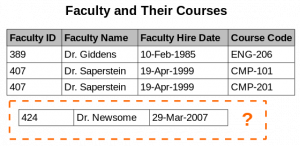 
<!-- 

- **Deletion anomaly**. Under certain circumstances, deletion of data representing certain facts necessitates deletion of data representing completely different facts


## Denormalization

Denormalization is a strategy used on a previously-normalized database to increase performance. In computing, denormalization is the process of trying to improve the read performance of a database, at the expense of losing some write performance, by adding redundant copies of data or by grouping data.  It is often motivated by performance or scalability in relational database software needing to carry out very large numbers of read operations. Denormalization should not be confused with Unnormalized form. Databases/tables must first be normalized to efficiently denormalize them.

A normalized design will often "store" different but related pieces of information in separate logical tables (called relations). If these relations are stored physically as separate disk files, completing a database query that draws information from several relations (a join operation) can be slow. If many relations are joined, it may be prohibitively slow. There are two strategies for dealing with this. The preferred method is to keep the logical design normalized, but allow the database management system (DBMS) to store additional redundant information on disk to optimise query response. In this case it is the DBMS software's responsibility to ensure that any redundant copies are kept consistent. This method is often implemented in SQL as indexed views (Microsoft SQL Server) or materialised views (Oracle, PostgreSQL). A view may, among other factors, represent information in a format convenient for querying, and the index ensures that queries against the view are optimised physically.

The more common approach is to denormalize the logical data design. With care this can achieve a similar improvement in query response, but at a cost—it is now the database


Mikor a relációs adatbázisunk elér a teljesítő képessége végére, mivel a normailizált adatokon futtatott join műveletek már túl lassuak, el kell kezdenünk denormalizálni az adatokat a leggyakrabban használt lekérdezések mentén, amivel teljesen ellen megyünk a relációs adatbázis alapelveknek, ez az a pillanat mikor NoSQL adatbázisra kell váltanunk. 

- **Model firs**t: A RDMS világban elsőre megtervezzük a domaint, minden főnévből csinálunk egy táblát, majd a köztük lévő relációkat külső kulcsokkal írjuk le. A lekérdezések másodlagosak. Még a tervező fázisban elkészítjük a modellt, de a lekérdezéseket csak fejlesztés közben gyártjuk le. 
- **Query first**: A noSQL világban ez pont fordítva van. A model másodlagos, mivel minden adat struktúra denormalizált. A tervező fázisban az összes lekérdezést meg kell tudjuk tervezni, ez fogja meghatározni majd az adatmodellt.
- **Sorting is a design decision**: A sorrendezést a tábla létrehozásakor definiálni kell, a clustering oszlop fogja meghatározni, ezen később módosítani nem lehet. Tehát ez is a query megtervezésekor meghatározandó.


<br>


# Cassandra bemutatása


## Mikor van szükségem Cassand-rára
- Large Deployments
- Lots of Writes, Statistics, and Analysis
- Geographical Distribution
- Evolving Applications


## Alap tulajdonságok

### Distributed and Decentralized


### Elastic Scalability


### High Availability and Fault Tolerance


### Tuneable Consistency
- Strict consistency
- Causal consistency
- Weak (eventual) consistency


## Adatszerkezet

A Cassandra ugyan úgy mint az RDBMS elkülönített adatbázisokat használ, és azon belül táblákat hozhatunk létre, amiben sorok és oszlopok vannak. 

- **Keyspace**: ez felel meg egy adatbázisnak az RDBMS-ben, vagy egy Index-nek az Elasticsearch-ben
- **Column families**: egy tábla az adatbázisban, amihez sorok tartoznak. Azonban az oszlopok fajtája soronként eltérhet.
- **Partition**: Azon sorok (illetve cellák) összessége, amiknek a particionáló kulcsuk értéke egyenlő (tehát ugyan azon a node-on lesznek). Ezt előre ki kell számolni, lásd lentebb. 
- **Clustering**: sorok sorba rendezése egy táblán belül (Semmi köze a Cassandra cluster-hez)


### Táblák felépítése (Column families)
Cassandra-ban nem úgy kell elképzelni a táblaszerkezetet mint az RDBMS világban, mint egy AxB nagyságú táblázat, ahol egy entitást egy sor reprezentál. Cassandra-ban egy sort úgy kell elképzelni, mint a listája az adott sorban szereplő Oszlopnév->érték (név->érték) pároknak. Cassandra-ban azok az oszlopok egy sorban, ahol nincs érték, nincsenek definiálva az adott sorra, az az oszlop, aminek nem adtunk értéket egyszerűen nem szerepel az Oszlopnév->érték felsorolásban. 

Tételezzük fel, hogy van egy táblánk, aminek 11 oszlopa van, ahol az oszlop nevek Column1-től mennek Column11-ig. Minden sorba csak azok az oszlopok fognak bekerülni, ahol tényleg van érték: 

 
<!-- 

Ezzel az adatmodellel helytakarékosan lehet nagyon vegyes hosszúságú sorokat tárolni, pl ha vannak több száz hosszúságú sorok mellet csak pár elemű sorok egy táblában. 

> **NOTE:** Ezért mondják azt, hogy magunk választhatjuk meg, hogy mit akarunk egy adott sorban eltárolni. Persze csak a tábla oszlopainak az értékkészletéből válogathatunk, nincs meg az a szabadság, mint Elasaticsearch-ben, ahol tényleg tetszőleges szerkezetű dokumentumokat dobálhatunk be egy típus/index alá minden fajta séma megkötés nélkül


### Kulcsok
A kulcsok kérdése kicsit komplikált Cassandra-ban. Kulcsokat három feladatra használunk: 
- Egyértelműen azonosítani akarunk egy sort a kulccsal egy táblában (ez eddig triviális, RDBMS-ben is így van (**primary vagy compound primary key**)
- A Cassandra-nak be kell tudni azonosítani hogy az adott sor melyik node-on van eltárolva. Az adott kulcs alapján a Cassandra muszáj hogy mindig ugyan azt a node-ot találja meg ahova elsőre beszúrta az adatot. (**Partition key**)
- Sorrendezése a soroknak egy partíción belül (vagyis azonos particionáló kulccsal rendelkezező sorokon belül): Cassandra-ban a sorok sorrendezését már a tábla létrehozásakor definiálni kell (**Clustering key** = csoportosító kulcs) 


<br>

Ugyanúgy mint az RDBMS világban, a Cassandra táblákon belül is egyértelműen, egyedi módon azonosítani kell tudni minden egyes sort egy egyedi azonosító alapján. Ez az elsődleges kulcs. Az azonban, hogy hogyan épül fel az elsődleges kulcs, már kicsit bonyolultabb. A **Primary key** (elsődleges kulcs) a két már említett kulcsfajtából épülhet fel. Tartalmaznia kell legalább egy **partition key**-t és 0 vagy több **clustering key**-t. Amennyiben több mint egy kulcsból épül fel (tehát legalább egy **partition key**-ből és valamennyi **clustering key**-ből vagy több mint egy partition kulcsokból) akkor **Compound primary key**-nek hívjuk.

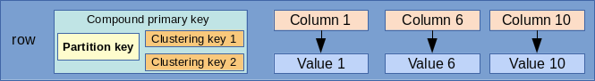 
<!-- 


### Partition key
A Cassandra tipikusan egy sok node-on futó elosztott alkalmazás, a benne tárolt adatok egyenletesen szét vannak szórva a cluster-ben. A szétszórás értelemszerűen nem táblák mentén történik, hanem tábla soronként. Tehát elképzelhető egy egy táblából minden egyes sor más és más node-ra kerül. 

Cassandra-ban a node-ok egy gyűrűbe vannak szervezve. Minden egyes node-nak van egy egyedi azonosítója, egy 64 bites token. (from -2<sup>23</supto 2<sup>63</sup>-1)
Minden node azt a token tartományt tudja magáénak, ami kisebb vagy egyenlő mint az ő tokenje és nagyobb mint a gyűrűben az előző node tokenje.


Azt hogy egy partíció (azonos particionáló kulccsal rendelkező sorok összessége) melyik node-on éli az életet (hova kell kiírni ill. honnan kell beolvasni) a particionáló dönti el a partion kulcsok alapján. Az alapértelmezett particionáló a **Murmur3Partitioner**, ami mindig ugyanarra a 64 bites tokenre képzi le ugyanazt a **partion key**-t.


Meg tudjuk nézni, hogy egy adott sornak mi a **token**-je a token függvénnyel: 
```
cqlsh:adamselect token(stuid) from marks;               

 system.token(stuid)
----------------------
 -4069959284402364209
 -4069959284402364209
 -4069959284402364209
```


### Compound primary key
A primary key-t mindig a tábla létrehozásakor kell megadni **PRIMARY KEY** kulcsszóval, aminek az argumentumában fel kell sorolni a kulcsokat. 
```
CREATE TABLE movies_by_year_genre (
  year text,
  genre text,
  movie_name text
  PRIMARY KEY (...)
);
```
Az első kulcs a listában mindig a partition key, a további kulcsok típusa attól függ, hogy hogyan rakjuk a zárójeleket. Tetszőleges számú primary kulcsot és clustering kulcsot is megadhatunk (persze kizárólag a tábla oszlopainak az értékkészletéből válogatva, mindegyiket csak egyszer felhasználva): 

- C1: Primary key has only one partition key and no cluster key.
- (C1, C2): C1 is partition key, C2 is cluster key.
- (C1, C2, C3, ...): C1 is partition key and all other i.e. C2, C3,... are cluster key.
- (C1, (C2, C3, ...)): C1 is partition key and all other i.e. C2, C3,... are cluster key.
- ((C1, C2, ...), (C3, C4, ...)): (C1, C2, ...) are partition key and (C3, C4,...) are cluster key.


Példa az utolsó sorra: 
```
CREATE TABLE movies_by_year_genre (
  year text,
  genre text,
  movie_name text
  PRIMARY KEY ((year, genre), movie_name)
);
```

> **NOTE:** A kulcsok sorrendje a PRIMARY KEY megadásánál kritikus. Ez határozza majd meg, hogy milyen 'sorrendben' kell majd őket szerepeltetni a lekérdezések WHERE szekciójában (lásd [\2](\1) című fejezetet)

### Clustering key
A Clustering key (csoportosító kulcs) kizárólag egy partíción belül határozza meg a sorok sorrendjét. Ha a compound primary kulcsunk több clustering kulcsot is tartalmaz, akkor először a listában az leső alapján fog sorrendezni, aztán a második alapján, és így tovább. Megadhatjuk a rendezés irányát is. Fontos ezt már a tábla tervezésekor kitalálni, mert később ezt már nem tudjuk megváltoztatni. 

 
A rendezés irányát a WITH CLUSTERING ORDER BY kulcsszóval adhatjuk meg: 
```
CREATE TABLE store_by_location (
    col1 text,
    col2 text,
    col3 text,
    col4 text,
    PRIMARY KEY (col1, col2, col3)
 ) WITH CLUSTERING ORDER BY (col2 DESC, col3 ASC);
```

A fenti példában a particionáló kulcs a col1 és a két Clustering (csoportosító) kulcs a col2 és col3. A col2 szerint visszafele, a col3 szerint előre rendezünk. Ha nem adjuk meg, akkor az előre rendezés az alapértelmezett. 


> **NOTE:** A rendezés csak akkor értelmezett egy Clustering key alapján, ha a partitioning kulcsok megegyeznek két sorban, ahol a Clustering kulcsok különböznek (ezért mondtuk, hogy csak egy partíción belül értelmezett). Tehát egy olyan adathalmazban, ahol a particionáló kulcsok értékkészlete unique, ott a Clustering kulcsoknak a sorok sorrendjére nincs hatása. Úgy is mondhatjuk, hogy csak egy node-on belül rendezik a sorokat


A fenti példában, azokban a sorokban, ahol a **col1** megegyezik, a **col2** szerint lesznek visszafelé rendezve a sorok. És azokban a sorokban, ahol a **col1** és a **col2** is megegyezik, a **col3** szerint előre lesznek rendezve a sorok. 

Pl. beszúrjuk ezeket az alábbi sorrendben: 
```
col1=k1, col2=B, col3=B
col1=k1, col2=A, col3=Z
col1=k1, col2=C, col3=X
col1=k1, col2=B, col3=A
```

Akkor a végeredmény a következő lesz, ha lekérdezzük (így is van tárolva). A particionáló kulcsok minden sorban azonosak (tehát ugyan azon a node-on vannak), és a col2 szerint visszafele, a col3 szerint előre rendez: 
```
col1=k1, col2=C, col3=X
col1=k1, col2=B, col3=A
col1=k1, col2=B, col3=B
col1=k1, col2=A, col3=Z 
```

<br>

A sorrendezésen felül a clustering kulcsoknak a lekérdezés WHERE szekciójában van szerepe, mert felírhatunk rájuk **>, >=, <, <=** operációkat, amiket a particionáló kulcsokra nem írhatunk fel. (lást részletesen a [\2](\1) című fejezetben.


### Partíció példa
A fenti tábla definíció mellett adott a következő adathalmaz: 
```
col1=k1, col2=B, col3=B
col1=k1, col2=A, col3=Z
col1=k1, col2=C, col3=X
col1=k2, col2=B, col3=A
```

Két partícióra oszlanak, mivel a col1 a particionáló kulcs:<br>

1. partíció: 
```
col1=k1, col2=B, col3=B
col1=k1, col2=A, col3=Z
col1=k1, col2=C, col3=X
```

2. partíció:
```
col1=k2, col2=B, col3=A
```

<br>


## Időbélyegek és Time to Live
Minden egyes cellához egy sorban (Partícióban) a Cassandra az oszlop nevén kívül még eltárol egy időbélyeget, ami az utolsó módosítás dátumát tárolja, valamint egy TimeToLive értéket, ami ha lejár, akkor átírja NULL-ra az adott mező értékét. 

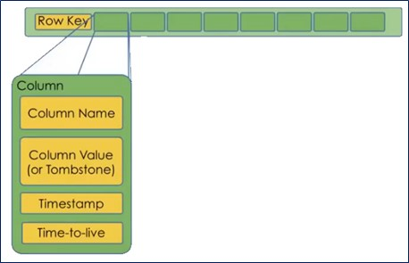 
<!-- 

A TTL mező értéke alapértelmezetten nem definiált, értéke null, ha ezt külön nem adjuk meg. 


Egy mező Timestamp értékét a **writetime(mezőnév)** függvénnyel listázhatjuk ki: 
```
cqlsh:adamSELECT first_name, last_name,
        ... writetime(last_name) FROM user;

 first_name | last_name | writetime(last_name)
------------+-----------+----------------------
       Mary | Rodriguez |     1538771050876617
       Bill |    Nguyen |     1538771031333072
```


A Time To Live értéket egy mezőnek a **USING TTL** -el definiálhatjuk egy update parancsban, és a **TTL(mezőnév)** függvénnyel kérdezhetjük le. 
```
UPDATE user USING TTL 3600 SET last_name =
'McDonald' WHERE first_name = 'Mary' ;
```
```
cqlsh:adamSELECT first_name, last_name, TTL(last_name)
        ... FROM user WHERE first_name = 'Mary';

 first_name | last_name | ttl(last_name)
------------+-----------+----------------
       Mary | Rodriguez |           3588
```


<br>


## Másodlagos indexek
A másodlagos indexekekkel az a baj, hogy lehet hogy több node-on lesznek szétszorva, mivel az elsődleges index határozza meg hogy melyik node-ra kerül az elem. Mivel több node-on is le kell futtatni a keresést, azért nagyon drága lehet a használata. <br>

Mikor nem szabad másodlagos indexet használni: 
- Ha nem túl nagy az elemek kardinalitása. Ha szinte minden elem különbözik egymástól, akkor gyakorlatilag majd az összes node-ot végig kell járni. 
- Ha túl kicsi a kardinalitás. Az sem jó ha szinte minden egyes sorban ugyan az az érték van, túl sok lesz a találat. 
- Gyakran átírt mezőknél: Ha gyorsabban gyűlnek fel a tombstones-ok mint ahogy azokat a Cassandra fel tudná dolgozni, hibára fog futni az update egy idő után

Példa: a user nevű táblában a last_name-re hozunk létre másodlagos indexet. 
```
CREATE INDEX ON user ( last_name );
```

> **NOTE:** Másodlagos indexeket a set, list, map elemeire is létrehozhatunk, akár még a user-defined-type belsejében lévő elemekre is, még akkor is ha egy map belsejében annak


Cassandara 3.4-től használhatjuk az Apple által kifejlesztet SASI másodlagos index implementációt, ami több funkcionalitást tesz lehetővé mint a beépített változat: 
- Kisebb, nagyobb -ra keresés
- LIKE használata string típusú mezők esetén. 


Mikor létrehozzuk a másodlagos indexet meg kell mondani, hogy egy custom implementációt szeretnénk használni. 
```
CREATE CUSTOM INDEX user_last_name_sasi_idx ON user (last_name)
USING 'org.apache.cassandra.index.sasi.SASIIndex';
```


**INDEX vs Filter:**<br>

Hatékonysági okokból alap esetben a Cassandra csak arra az oszlopra enged lekérdezni, amire van index. Csak akkor lehet index nélküli oszlopra hivatkozni a WHERE kifejezésben ha ezt implicit engedélyezzük az **ALLOW FILTERING** kulcsszóval a lezáró ; előtt. Ugyanis ha egy oszlopon nincs index, akkor a Cassandra az összes sort be fogja olvasni, és filterrel fogja kiválasztani WHERE-ben definiált mezőket. Milliós sorszám esetén ez már problémás lehet. 

https://www.datastax.com/2012/01/getting-started-with-cassandra

<br>


## Materialized Views
http://cassandra.apache.org/doc/4.0/cql/mvs.html<br>

https://opencredo.com/everything-need-know-cassandra-materialized-views/<br>

A Materialized view az eredeti tálba egy részhalmazának, vagy az egész tálba egy olyan másolata, ahol más kulcsok alapján tesszük kereshetővé ugyan azt az adathalmazt. Ez akkor jó, ha van egy táblánk amit A és B oszlop szerint is keresni akarunk, ilyenkor csinálunk egy táblát, ahol A a kulcs, és egy Materialized view-t, ahol a B a kulcs. Ennek az a nagy előnye azzal szemben, mint ha erre két valódi táblát definiálnánk, hogy mikor az igazi táblába szúrunk be, akkor a materialized view-t is frissíteni fogja a Cassandra, nem nekünk kell manuálisan megcsinálni. 


Az MW-ban a kulcsokra nagyon komoly megkötés van: 
- az alap tábla összes kulcsát tartalmaznia kell
- csak egy olyan plusz kulcsot tartalmazhat, ami nem volt kulcs az alaptáblában. 

> **NOTE:** Az MW-ben az alaptábla partícionáló kulcsából általában Clustering kulcsot csinálunk, és az egyik korábban nem kulcs mezőt használjuk föl mint particionáló kulcs, amire a lekérdezéseket akarjuk írni. Tehát a megkötés csak annyi, hogy minden alaptáblabeli kulcs maradjon kulcs, de a típusukat meg szabad változtatni.


Ezzel biztosítjuk azt, hogy az MW minden egyes sora pontosan egy sornak felel meg az alaptáblában. Pl adott a következő alaptáblánk: 
```
CREATE TABLE t (
    k int,
    c1 int,
    c2 int,
    v1 int,
    v2 int,
    PRIMARY KEY (k, c1, c2)
)
```


Akkor a következő MW-k valid kulccsal rendelkeznek: 
```
CREATE MATERIALIZED VIEW mv1 AS
    SELECT * FROM t WHERE k IS NOT NULL AND c1 IS NOT NULL AND c2 IS NOT NULL
    PRIMARY KEY (c1, k, c2)  
```
Itt a c1 lépett elő partitioning kulccsá és a korábbi partitioning kulcsból (k) Clustering kulcs lett. 

A **not null** a lekérdezésben kötelező elem minden olyan oszlopon, amiből kulcs lesz az MW-ben, hogy elkerüljük a null kulcsok beszúrást. 

```
CREATE MATERIALIZED VIEW mv1 AS
    SELECT * FROM t WHERE k IS NOT NULL AND c1 IS NOT NULL AND c2 IS NOT NULL
    PRIMARY KEY (v1, k, c1, c2)
```


Mire  kell figyelni: <br>

- Avoid too large partitions
- Choose your partition key in a way that distributes the data correctly, avoiding cluster hotspots (the partition key like days of the week is not a good one as it leads to temporal hotspots)

<br>

<br>


# Architektúra


## Alapfogalmak


### Gossip (pletykák)


### Snitches
A snitch protokoll segítségével térképezi föl egy node, hogy milyen messze vannak tőle az általa ismert node-ok, hogy ha egy műveletben koordinátor node-ként vesz részt, meg tudja határozni hogy melyik node-okról olvasson (a legközelebbi) és melyik node-okra írjon. 


### Lightweight Transactions (check-and-set)
Cassandra-ban nem létezik a hagyományos értelembe vett tranzakció kezelés, csak az úgynevezett pehelysúlyú tranzakció (LWT) ami azt biztosítja, hogy egy olvasás és az azt követő írás egy tranzakcióban lesz (**linearizable consistency**). Az olvasással ellenőrizzük, hogy az adott adat szerepel e már az adatbázisban, és ha nem, akkor bírjuk. Ez LWT csak egy partíción belül működik és elég költséges művelet, mivel a végrehajtásához a Cassandra a Paxos nevű konszenzus algoritmust futtatja. A konszenzus kialakításához a partíciót tároló replikák többségének konszenzusra kell jutnia az adott tranzakciót illetően.


## Node-ok csoportosítása
Cassandrában a node-okat két szinten csoportosíthatjuk: Rack és Data Cener. 

- **Rack**: A rack-ben olyan nodo-kat csoportosítunk, amik tényleg egy fizikai rack-ben vannak, tehát ezek vannak a "legközelebb" egymáshoz. 
- **Data Center**: Egy datacenter-ben azokat Rack-eket csoportosítjuk, amik fizikailag egy szerverfarmon vannak. 

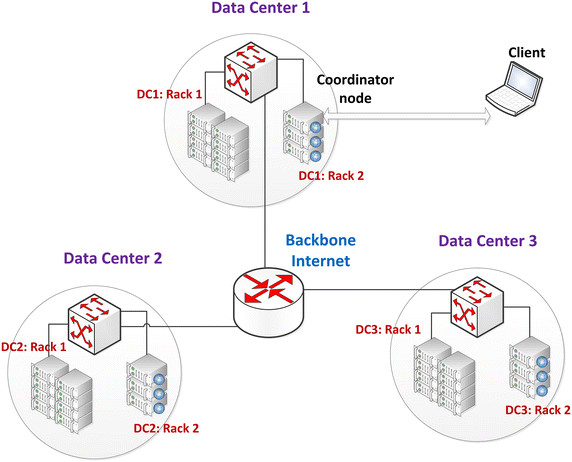 
<!-- 

Alapértelmezetten minden node-unk a **RACK1**-be fog tartozni, és a **DC1** datacenterbe. 


### Seed Nodes
Minden egyes node-nak amit hozzáadnunk a cluster-hez szüksége van egy referencia node-ra, amitől le tudja kérdezni a cluster topológiáját (élő és halott node-ok, távolság..). Ezeket hívják seed-node-nak. 

Minden egyes data-center-ben legalább két seed-node-ot kell létrehozni. A nem seed-node -knak a seed-nodeokat a cassandra.yaml fájlban kell statikusan beállítani. Alapértelmezetten csak a localhost van hozzáadva a listához: 
```
- seeds: "127.0.0.1"
```


# Telepítés

 # docker run --name cassandra -p 9042:9042 -d cassandra

A parancssori Cassandra kliens része a telepítőnek, a bin mappában ül. Ezért indítunk még egy cassandra konténert, és abból fogunk csatlakozni a "cassandra" nevű konténerhez a 9042-es porton. 
 # docker run -it --rm cassandra /bin/bash


Majd indítsuk el a **cqlsh** programot: cqlsh host port
```
root@0ce39e38988a:/# cqlsh 192.168.0.101 9042
Connected to Test Cluster at create keyspace dev
[cqlsh 5.0.1 | Cassandra 3.11.3 | CQL spec 3.4.4 | Native protocol v4]
Use HELP for help.
cqlsh
```

....

...


# CQL (Cassandra Query Language) alapok
https://www.datastax.com/2012/01/getting-started-with-cassandra


## Keyspace és cluster info
```
cqlsh:adamDESCRIBE KEYSPACE adam;

CREATE KEYSPACE adam WITH replication = {'class': 'SimpleStrategy', 'replication_factor': '1'}  AND durable_writes = true;

CREATE TABLE adam.emp (
    empid int PRIMARY KEY,
    emp_dept text,
    emp_first text,
    emp_last text
) WITH bloom_filter_fp_chance = 0.01
    AND caching = {'keys': 'ALL', 'rows_per_partition': 'NONE'}
    AND comment = ''
    AND compaction = {'class': 'org.apache.cassandra.db.compaction.SizeTieredCompactionStrategy', 'max_threshold': '32', 'min_threshold': '4'}
 ...
```


```
cqlsh:adamDESCRIBE TABLE adam.emp;

CREATE TABLE adam.emp (
    empid int PRIMARY KEY,
    emp_dept text,
...
```


## Alap query

Adatbázis létrehozása: 
```
 cqlshcreate keyspace adam with replication = {'class':'SimpleStrategy','replication_factor':1};
```

Tábla létrehozása: 
```
 cqlshuse adam;
 cqlsh:adamcreate table emp (empid int primary key, emp_first varchar, emp_last varchar, emp_dept varchar);
```

Adat beszúrása:
```
 cqlsh:adaminsert into emp (empid, emp_first, emp_last, emp_dept)  values (1,'fred','smith','eng');
```

> **WARNING:** A primary key értékét beszúrás után soha többet nem lehet megváltoztatni, mivel az határozza meg, hogy melyik node-ra kerül a row


Lekérdezés index-ra: 
```
cqlsh:adamSELECT * FROM adam.emp;
 empid | emp_dept | emp_first | emp_last
-------+----------+-----------+----------
     1 |      eng |      fred |    smith
     2 |      eng |      fred |    smith
```


Lekérdezés filterrel:
```
cqlsh:adamSELECT * FROM adam.emp WHERE emp_last = 'smith' ALLOW FILTERING;

 empid | emp_dept | emp_first | emp_last
-------+----------+-----------+----------
     1 |      eng |      fred |    smith
     2 |      eng |      fred |    smith
```


## Listák és Map-ek


### Sets
A set esetében mivel egy elem többször is előfordulhat, hatékonyabb mint a lista, ahol egy elem beszúrásához az egész listát végig kell olvasni. 

 cqlsh:adamALTER TABLE user ADD emails set<text>;


```
cqlsh:adamUPDATE user SET emails = {
        ... 'mary@example.com', 'mary2@example.com' } WHERE first_name = 'Mary';
```
```
cqlsh:adamSELECT emails FROM user WHERE first_name = 'Mary';

 emails
-------------------------------------------
 {'mary2@example.com', 'mary@example.com'}

(1 rows)
```


### List
```
cqlsh:adamALTER TABLE user ADD
        ... phone_numbers list<text>;
cqlsh:adamUPDATE user SET phone_numbers = [
        ... '1-800-999-9999' ] WHERE first_name = 'Mary';
cqlsh:adamSELECT phone_numbers FROM user WHERE
        ... first_name = 'Mary';

 phone_numbers
--------------------
 ['1-800-999-9999']
```
```
UPDATE user SET phone_numbers[0] =
'480-111-1111' WHERE first_name = 'Mary';
```


### Map
```
cqlsh:adamALTER TABLE user ADD
        ... login_sessions map<timeuuid, int>;
cqlsh:adamUPDATE user SET login_sessions =
        ... { now(): 13, now(): 18} WHERE first_name = 'Mary';
cqlsh:adamSELECT login_sessions FROM user WHERE
        ... first_name = 'Mary';

 login_sessions
--------------------------------------------------------------------------------------
 {601a2e20-c8e3-11e8-8684-6d2c86545d91: 13, 601a2e21-c8e3-11e8-8684-6d2c86545d91: 18}
```


### User defined type
```
cqlsh:adamCREATE TYPE address (street text, city text, state text, zip_code int);

cqlsh:adamALTER TABLE user ADD addresses map<text, frozen<address>>;

cqlsh:adamUPDATE user SET addresses = addresses + {'home': { street: '7712 E. Broadway', city: 'Tucson',
        ... state: 'AZ', zip_code: 85715} } WHERE first_name = 'Mary';
cqlsh:adam
cqlsh:adamSELECT addresses FROM user WHERE first_name = 'Mary';

 addresses
--------------------------------------------------------------------------------------
 {'home': {street: '7712 E. Broadway', city: 'Tucson', state: 'AZ', zip_code: 85715


```


<br>


# Kulcsok és indexek lekérdezésekben

## Kulcs használati alapelvek
- Ugyan azzal a primary kulccsal (partition és clustering kulcs együttvéve) egy INSERT-et többször is ki lehet adni, elsőre beszúrja, másodikra frissíti a sort, tehát átírja a nem kulcs mezőket a sorban az új értékre. 


- A kulcsok nem kell  hogy egyediek legyenek. Simán beszúrhatunk olyan sorokat, amikben a particionáló kulcsok azonosak, csak a clustering kulcsban különböznek. (Ha a clustering kulcs is egyezik, akkor nem új sort fog beszúrni,  hanem a régit felülírja, ugyanis a particionáló kulcsok kijelölik a node-ot, és a node-on a particionáló + a clustering kulcsok jelölik ki a sort). Ha sok az olyan sor, ahol megegyezik a particionáló kulcsok értéke azzal az a baj, hogy úgynevezett 'hotspot'-okat hozunk létre, ami azt jelenti, hogy egy node-on őszpontosul az összes partíció (sor) mivel a partition key határozza meg a node-ot. Tehát olyan particionáló kulcsokat érdemes választani, amikben kevés az egyezés. <br>

Példa: Adott a következő tábla: 
```
CREATE TABLE users ( 
	col1 int, col2 int, col3 int, col4 int,
	PRIMARY KEY ((col1, col2), col3) );
```
Itt particionáló kulcsok a col1 és col2, és clustering kulcs a col3.


Ekkor az alábbi két beszúrás két külön sort fog eredményezni, de ugyanarra a node-ra fognak kerülni: 
```
INSERT INTO users (col1, col2, col3, col4) VALUES ('col1', 'col2', 'col3', 'col4');
INSERT INTO users (col1, col2, col3, col4) VALUES ('col1', 'col2', 'col3mod', 'col4mod');
```
A fenti példa azért eredményez két sort, mert a Clustering kulcs értékében elérnek (col2mod). Ha a Clustering kulcs is azonos lenne, és csak col4-ben térnének el, akkor nem eredményezne új sor. 


- Lekérdezésnél az összes particionáló kulcsot meg kell adni, mivel annak segítségével találja meg a node-ot. Tehát a fenti táblára a minimum lekérdezés ez: 
```
SELECT * FROM user WHERE col1='aaa' AND col2='ddd' 
```


Ehhez ha akarjuk hozzáadhatjuk még a Clustering kulcsokat szűrési feltételnek, de nem kulcs mezőt nem adhatunk hozzá. <br>

Tehát ez helyes: 
 SELECT * FROM user WHERE col1='aaa' AND col2='ddd' AND col3='ccc'
De ez helytelen, mivel col4 nem kulcs mező. 
 SELECT * FROM user WHERE col1='aaa' AND col2='ddd' AND '''col4='ccc''''


- A Materialized view-ban az összes eredetileg particionáló kulcsot átmozgathatjuk Clustering kulccsá,  és egy addig nem kucsmezöből készíthetünk particionáló kulcsot. Viszont fontos, hogy az összes korábbi kulcs mező kulcs maradjon. Az új particionáló kulcs, ami korábban nem volt kulcs mező nem kell hogy egyedi értékeket tartalmazzon. Viszont ha nem elég nagy a kardinalitása, akkor a materializált view-ból is 'hotspot' fog kialakulni mivel a materializált view is egy Cassandra tábla, így fontos, hogy az új particionáló kulcs  is jól szétossza a node-ok között a tárolást. Mivel ha akarjuk, az összes base tábla particionáló kulcsából Clustering kulcsot csinálhatunk, a materializált view-ban tetszőleges korábban nem kulcs szerint tudunk keresni. <br>

Fontos, hogy az összes kulcs elemre az MW select-ben NOT NULL kikötést kell tenni, hogy biztosítsuk a sorok egyediségét. <br>

Tehát ez helyes: 
```
CREATE MATERIALIZED VIEW huser_mw AS 
	SELECT *
	FROM user
	WHERE col1 IS NOT NULL AND col2 IS NOT NULL AND col3 IS NOT NULL 
	PRIMARY KEY ((col4), col1, co2, col3);
```
A korábbi col1 és col2 particionáló kulcsból Clustering kulcsot csináltunk, és az új view-ban tudunk col4 szerint keresni. 


## Lekérdezés megkötések (Restriction)
https://www.datastax.com/dev/blog/a-deep-look-to-the-cql-where-clause<br>

Itt a megkötés (restriction) szó azt jelenit, hogy egy kulcs szerepel e a WHERE ágban vagy sem. Ha igen, akkor az egy 'restricted' kulcs, ha nem szerepel, akkor az egy 'unrestricted' kulcs. 

Példa tábla: 
```
CREATE TABLE adam.test1 (
col1 text,
col2 text,
col3 text,
col4 text,
PRIMARY KEY ((col1), col2, col3)
);

CREATE INDEX indexOnCol4 ON adam.test1 (col4);
```


### Particionáló kulcsok + indexek
Egy lekérdezésben vagy az összes particionáló kulcsot szerepeltetjük, vagy csak indexelt oszlopokat. Tehát két lehetőségünk van:<br>

1. csak a paritcionáló kulcs(ok): 
```
 SELECT * FROM adam.test1 WHERE col1 = 'k1'
(Persze ezt kiegészíthettük volna Clustering kulcsokkal)
```
 
1. csak az index: 
``` 
 SELECT * FROM adam.test1 WHERE col4 = 'C'
```

Alap esetben sem a particionáló kulcsokra, sem az indexekre nem használhatjuk a <, <=, >, >= operációkat, csak az =, IN ('k1', 'k2',..). 

> **WARNING:** Az IN használata erősen ellenjavallott performancia okokból, de ha már használjuk, akkor az IN értékkészletét alacsonyan kell tartani.


(A másodlagos indexre megengedett a <,operáció, ha a SASI implementációt használjuk)


### Clustering kulcsok
A Clustering kulcsokra már nagyon sok operáció engedélyezett: 
- Ha csak egy oszlopot vonunk be az operációba: >, >=, =, <,<=, IN, CONTAINS
- Ha több clustering kulcsot is bevonunk: >, >=, =, <,<=, IN


A Clustering kulcsoknak az a sorrendje, ahogy a PRIMARY KEY kifejezésben megadtuk. Ha egy Clustering kulcsot szerepeltetünk a WHERE -ben, akkor az összes azt megelőző kulcsot is be kell rakni (pl. nem lehet benne csak a col3, ha a col2-öt nem szerepeltetjük)


Fontos, hogy ha a Clustering kulcsra írunk bármilyen megkötést (restriction-t) ami nem a '=', vagyis egyike a >,>=,<, <=, IN, CONTAINS megkötéseknek, akkor az összes sorban korábbi Clustering kulcsot is szerepeltetni kell, és azokban csak a '=' megkötés használható, vagy a <,>.. megkötése csak a sor legvégén használhatóak, a legutolsó clustering kulcsban, amit még beteszünk a WHERE -be (mert hogy a Clustering kulcsok megadása nem kötelező) 


Ha tartományra kérdezünk le, akkor a kisebb mint és nagyobb mint (vagy fordítva) mindig ugyan arra a Clustering kulcsra kell legyen felírva és csak az utolsó kulcsra. 


 
<!-- 

Helyes, mert az egyetlen egy particionáló kulcs szerepel, és az első Clustering kulcsra írtunk fel '<' feltétel. 
 SELECT * FROM adam.test1 WHERE col1 = 'k1' AND col2 < 'Z'


 
<!-- 

Helyes, pert benne van a particionáló kulcs, és mivel a col3 szerepel a WHERE-ben, a col2 is ott van, ahol csak az '=' restriction-t használtuk. Mivel a col3 az utolsó olyan Clustering kulcs, amit szerepel a WEHRE-ben, ezért ott használhattuk a '>' megkötést. 
 SELECT * FROM adam.test1 WHERE col1 = 'k1' AND col2 = 'Z' AND col3 'A'


 
<!-- 

Helyes, mert a tartományra lekérdezés a végén van, és a nagyobb mint-kisebb mint operációkban ugyan az az oszlop (Clustering kulcs) szerepel, ráadásul a legvégén, különben nem lenne helyes. 
 SELECT * FROM adam.test1 WHERE col1 = 'k1' AND col2 = 'Z' AND col3 'A' AND col3 < 'Z'
A tartomány több Clustering kulcsra is vonatkozhat, még akkor is ha aszimmetrikus, tehát ez is helyes: 
 SELECT * FROM adam.test1 WHERE col1 = 'k1' AND (col2 , col3) ('A','A') AND col2 < 'Z'


 
<!-- 

Helytelen, mert a col3 Clustering kulcs szerepel, de a col2 nem, pedig a kulcsok definiálásakor a col2 előbb volt mint a col3.
 SELECT * FROM adam.test1 WHERE col1 = 'k1' AND col3 'A'


 
<!-- 

Helytelen, mert a col2-re nem az '=' operátort használjuk, pedig megadtuk a col2 utáni soron következő kulcsot is a col3-at. Mindig csak a legutolsó kulcs-ra használhatunk az '='-től eltérő operációt. 
 SELECT * FROM adam.test1 WHERE col1 = 'k1' AND col2 'Z' AND col3 'A'


### IN megkötés
Az IN megkötést mind Particionáló kulcsra mind Clustering kulcsra lehet alkalmazni a sorrendre való tekintet nélkül (ezt a 2.2-ben vezették be, azelőtt ezt is csak az utolsó kulcs-ra lehetett rárakni). 


IN az utolsó előtti Clustering kulcsra: 
 SELECT * FROM adam.test1 WHERE col1 = 'k1' AND col2 IN ('A', 'B') AND col3 = 'Z'


IN a particionáló kulcson: 
 SELECT * FROM adam.test1 WHERE col1 IN ('k1', 'k2')  AND col2='A' AND col3 < 'Z';


Több oszlopos IN lekérdezés :
 SELECT * FROM adam.test1 WHERE col1 = 'k1' AND (col2 , col3) IN (('A','A'), ('B','Z'));


### CONTAINS és CONTAINS KEY megkötések


<br>


# Adatbázis GUI


### DevCenter
A datastax (a Cassandra gyártója) biztosít egy ingyenes GUI-t ami remek segítség az adatbázis karbantartásában: 
Install: https://docs.datastax.com/en/developer/devcenter/doc/devcenter/dcInstallation.html

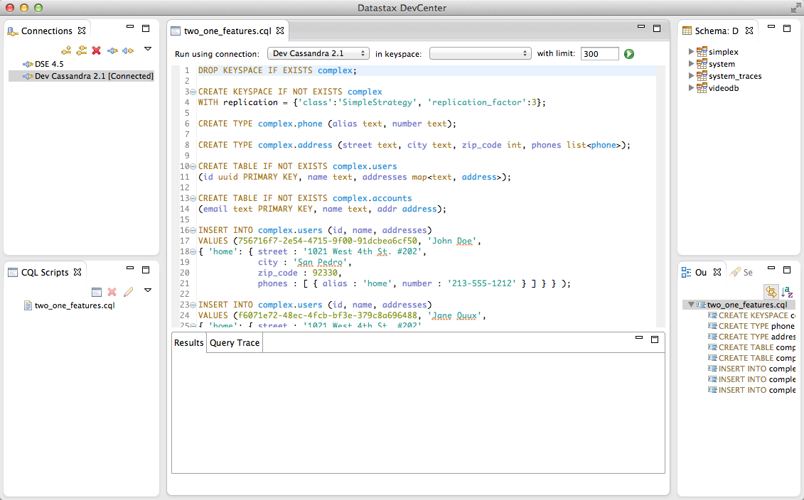 
<!-- 


<br>


### RazorSQL
Sokféle grafikus eszközzel csatlakozhatunk a Cassandra adatbázishoz. A legtöbben a RazorSQL-t ajánlották, ami fizetős: https://razorsql.com/


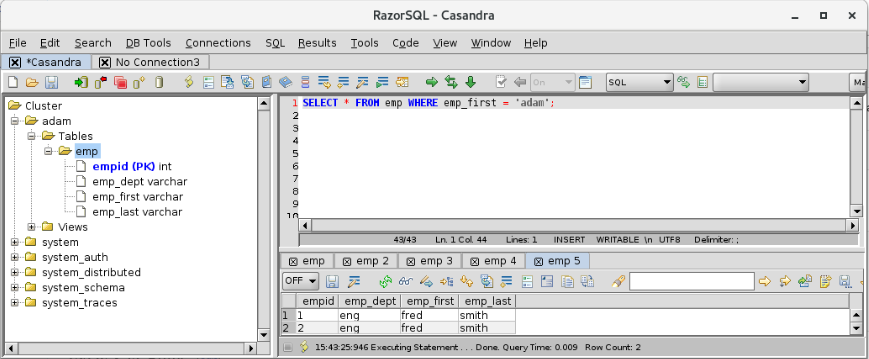 
<!-- 


# Adat model


## Conceptual Data Modeling
Az adatmodell megtervezését az alábbi példán keresztül fogjuk bemutatni. Ez egy leegyszerűsített modellje egy utazásközvetítő weboldalnak ami összegyűjti a különböző utazási irodák ajánlatait, amik több utazást is kínálnak, és az utasokat egy utazáson belül is több szállodában szállásolják el. 

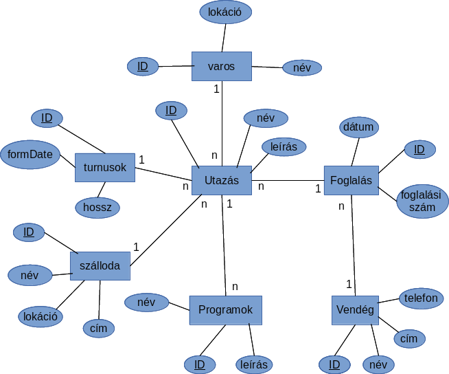 
<!-- 

Az RDBMS modellt úgy gyártanánk el ebből, hogy minden téglalapból csinálnánk egy táblát, majd létrehoznánk idegen kulcsokat a vonalak mentén a számosságot figyelembe véve.


Itt azonban query-first megközelítést kell alkalmazni. Első lépésben a képernyő tervek és elvárt funkciók alapján be kell azonosítani a lekérdezéseket, amiket QX-el szokás jelölni, ahol az X egy egész szám.


## Defining Application Queries
- Q1. Utazások megkeresése egy adott városhoz 
- Q2. Utazás részleteinek listázása
- Q3. Programok megkeresése egy város közelében
- Q4. Utazások megkeresése programok alapján 
- Q5. Elérhető időpontok keresése egy utazáshoz 
- Q6. Utasok listája utazás alapján
- Q7. Foglalás kikeresése hotel, dátum és utas neve alapján       
- Q8. Foglalás kikeresése utas neve alapján 
- Q9. Foglalás részletek


Ha megvannak a lekérdezések, akkor a lekérdezésekből egy folyamat ábrát kell rajzolni, hogy megtudjuk hogy melyik lekérdezés eredménye szolgálhat input-ként egy másik lekérdezésnek: 

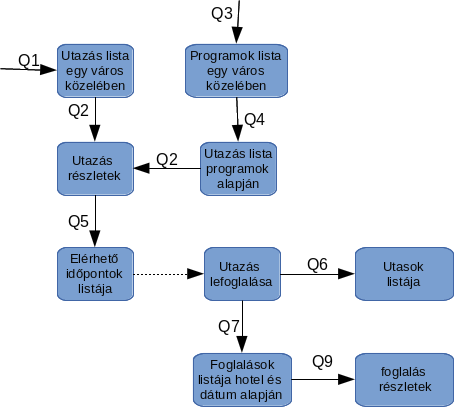 
<!-- 


## Logikai adatmodell
Most hogy beazonosítottuk a szükséges lekérdezéseket, megtervezhetjük a táblákat. A táblák nem mások, mint a fenti flow diagramban a dobozok, vagyis a keresés eredmények, amik a denormalizált adatstruktúra miatt megfelel a táblának. A tábla neve mindig a fő entitással kezdődik, amit a lekérdezés visszaad, és _by_ szó használatával hozzá kell kapcsolni azokat másodlagos entitásokat, amik mentén lekérdezzük a fő entitást. Pl a Q1-re egy lehetséges elnevezés: **tours_by_city**

Ha a lekérdezés neve több szóból áll, akkor azokat is "_" al kell elválasztani, pl: **available_dates_by_tour**


### Chebotko logical diagram
A legelterjedtebb diagram a táblák modellezésére az úgynevezett Choebotka diagram, ami ugyan dobozokból fog állni, mint a query flow diagramunk, de a dobozok belsejében ki lesznek fejtve az adott tábla  oszlopai is. Jelmagyarázat: 
- **K**: partitioning key az adott oszlop
- **C↑**: clustering key ASC rendezéssel
- **C↓**: clustering key DESC rendezéssel 

Ha egy táblába bele mutat egy nyíl akkor az egy olyan lekérdezés, amit az adott tábla támogat. Ha két tábla között van nyíl, akkor az egyik a másiknak az úgynevezett downstream query- je. 

Íme az utazási iroda teljes adatbázis modellje, azaz Chebotka diagramja: 

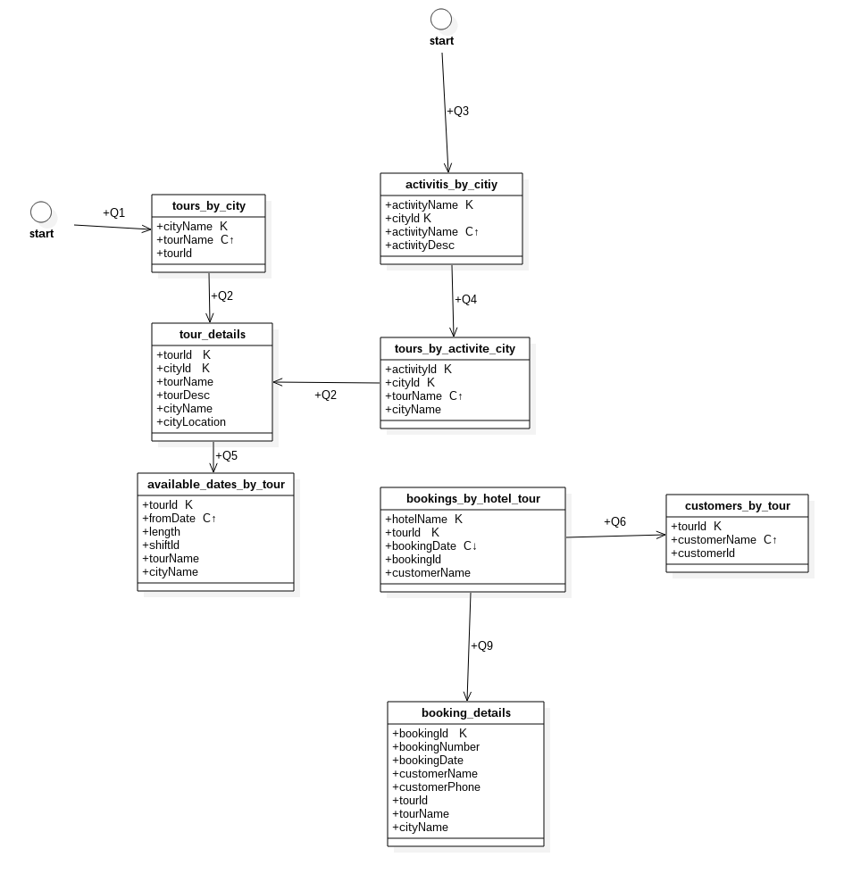 
<!-- 


Láthatjuk, hogy sem a hotelnek, sem a customer-eknek nincs saját táblája, ami elkerülhetetlen lett volna  RDBMS-ben, itt viszont mivel egyik query sem azonosított ilyen igényt, ezért nem is készült ilyen tábla (query first megközelítés) 

Ami még fontos, hogy a Q1-hez és a Q2 lekérdezésekhez tartozó táblákban a particionáló kulcs szöveges, ez az amit a felhasználó megad a felületen. A többi lekérdezésnek már van upstream lekérdezése, ahonnan kipottyannak számára a megfelelő ID-k.

> **NOTE:** A Chebotka logikai diagramon még nincsenek adattípusok meghatározva, az ábrán egy adott mező (pl customerName) lehet hogy később egy user defined adat típussal lesz megvalósítva (pl. First Name, Last Name) 


## Fizikai adatmodell
A Fizikai Chebotka diagramon már pontosan meghatározzuk az egyes mező típusokat, akár összetett, user defined típusokat is létrehozhatunk. Jelölése az alábbi: 

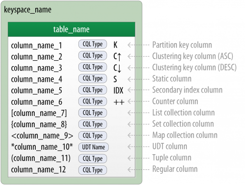 
<!-- 


A fenti felsorolásban láthatjuk hogy ***név*** formátumban kell a User Defined Type -ra hivatkozni. A UDT fizikai modelljében is két csillag közé kell rakni a nevet: 

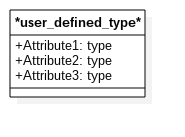 
<!-- 

A UDT-nak nincsenek kulcsai, mert nem önálló táblák. 


Ezen a diagramon már nem szerepelnek a lekérdezések, pusztán a tábla szerkezetek. A tábla model tetején be kell jelölni, hogy az adott tábla melyik keyspace-be fog kerülni. Mi két keyspace-t hoztunk létre, egyet az utazásoknak, egyet pedig a foglalásoknak: 

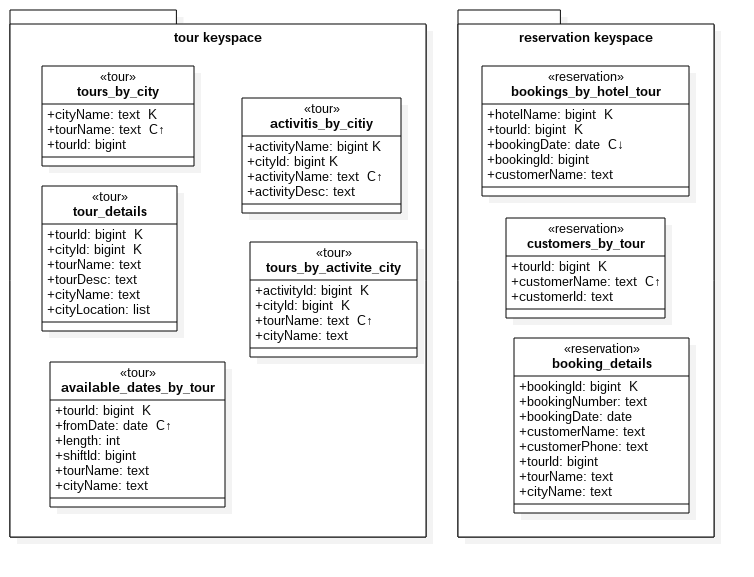 
<!-- 


### Materialized views
A fizikai modellben az MW neveit dőlt betűkkel jelöljük, és egy szaggatott vonalú nyíllal kötjük össze a base táblával a Chebotka modellben:

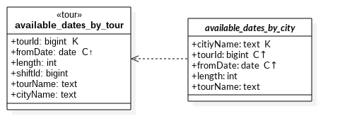 
<!-- 


Láthatjuk, hogy az alaptáblában a TourId particionáló kulcs volt, az MW-ben viszont már csak Clustering key, ezzel teljesítettük a megkötést, hogy az alap tábla összes kulcsának szerepelnie kell az MW kulcsai között.


# Tervezés


## Partíció mérete
Egy partíció, vagyis azon cellák összessége, aminek ugyan az a particionáló kulcs csoportja, nem lehet nagyobb mint **2 milliárd cella / partíció**. Az egy partícióba eső cellák számát így lehet kiszámolni: 

N<sub>v</sub= N<sub>r</sub>*( N<sub>c</sub− N<sub>pk</sub− N<sub>s</sub>) + N<sub>s</sub>

- N<sub>v</sub= össz cella szám, ezt akarjuk kiszámolni, ez nem lehet több mint 2 milliárd. 
- N<sub>r</sub= az összes sorok száma a partícióban 
- N<sub>pk</sub= primary kulcs oszlopok száma 
- N<sub>c</sub= az oszlopok száma a partícióban
- N<sub>s</sub= statikus oszlopok


Mikor a tábla szerkezetet kitaláljuk, fontos, hogy előre megbecsüljük, hogy mi lesz az **N<sub>v</sub>**. Fontos hogy a legrosszabb esetet számoljuk ki beleszámolva a jövőbeli elképzelt növekedést is. Ha ez átlépné az 1 milliárdot, akkor be kell vezessünk újabb particionáló kulcsokat is.

Minél szélesebb egy tábla annál egyszerűbb ezt a korlátot elérni még relatíve kevés adattal is.


# Java kliens


```java
public class CassandraConnector {

	private static CassandraConnector instance;
	

	private Cluster cluster = null;

	private Session session = null;

	private MappingManager manager = null;

	
	private CassandraConnector() {
		initConnection();
	}

	public static CassandraConnector getInstance() {		

		if (instance == null) {

			synchronized (CassandraConnector.class) {
				if (instance == null) {
					// if instance is null, initialize
					instance = new CassandraConnector();
				}
			}
		}

		return instance;
	}

	private void initConnection() {

		String host = System.getProperty("cassandra.default.host", "localhost");
                String port = System.getProperty("cassandra.default.port", "9042");
		String keyspace = System.getProperty("cassandra.default.keyspace");
		String username = System.getProperty("cassandra.user", "user");
		String password = System.getProperty("cassandra.pwd", "pass");
		boolean withSSL = Boolean.parseBoolean(System.getProperty("cassandra.needSSL", "false"));

		connect(nodes, withSSL, username, password, keyspace);
	}

	private void connect(String host, String port, boolean withSSL, String username, String password, String keyspace) {

		try {

			Cluster.Builder b = Cluster.builder().withSocketOptions((new SocketOptions()).setReadTimeoutMillis(1800000))
					.withQueryOptions((new QueryOptions()).setFetchSize(100000));


			builder.addContactPoint(host).withPort(port);

			if (withSSL) {
				b.withSSL();
			}

			if (username != null && username.trim().length() 0 && withSSL) {
				b.withCredentials(username, password);
			}			

			session = cluster.connect();

			manager = new MappingManager(session);

			
		} catch (Exception e) {
			System.out.println(e);
			throw e;
		}
	}

	

	public Session getSession() {

		return session;
	}

	public MappingManager getManager() {

		return manager;
	}

	


	@Override
	public void finalize() {
	    try {
			session.close();
			cluster.close();
	    } catch (Exception e) {
	        // ...
	    }
	}
}
```
