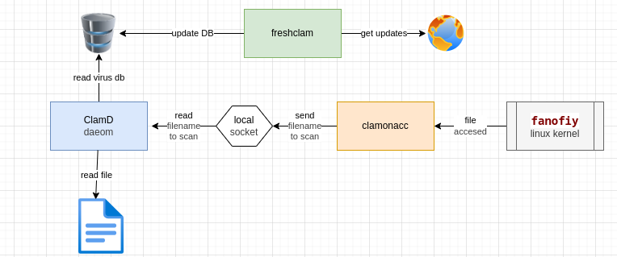
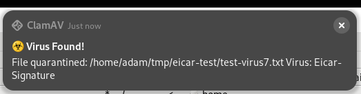
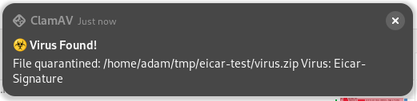
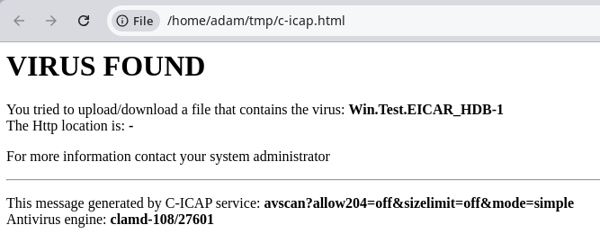
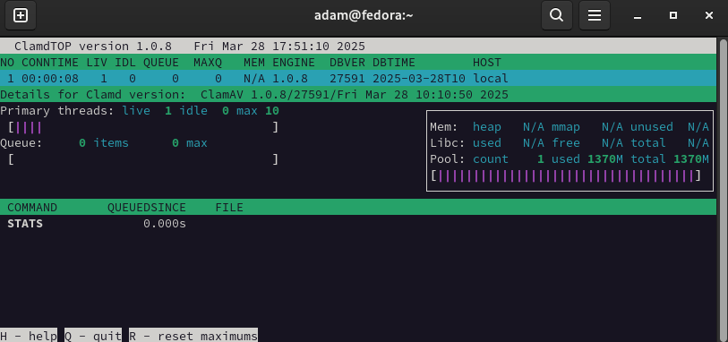

- [Enterprise level Endpoint security with ClamAV](#enterprise-level-endpoint-security-with-clamav)
    - [Funkciók:](#funkciók)
    - [Alapelvek:](#alapelvek)
- [Bevezető](#bevezető)
  - [Mi a ClamAV](#mi-a-clamav)
  - [Alapkomponensek](#alapkomponensek)
- [Installálás](#installálás)
- [Automatikus vírus db frissítés](#automatikus-vírus-db-frissítés)
  - [Első manuális frissítés:](#első-manuális-frissítés)
  - [Frissítési gyakoriság beállítása](#frissítési-gyakoriság-beállítása)
  - [Frissítések ellenörzése](#frissítések-ellenörzése)
- [ClamAV demon beállítása](#clamav-demon-beállítása)
  - [Milyen user nevében fusson a clamd?](#milyen-user-nevében-fusson-a-clamd)
    - [Miért nem rootként fut alapból a clamd?](#miért-nem-rootként-fut-alapból-a-clamd)
    - [Saját user nevében?](#saját-user-nevében)
    - [clamscan user nevében](#clamscan-user-nevében)
  - [User beállítása](#user-beállítása)
    - [Futtatás clamscan userrel](#futtatás-clamscan-userrel)
      - [Magyarázat:](#magyarázat)
      - [Csoportok létrehozása:](#csoportok-létrehozása)
    - [Futtatás saját user nevében](#futtatás-saját-user-nevében)
  - [Általános beállítások:](#általános-beállítások)
  - [Automatikus indítás](#automatikus-indítás)
  - [Indítás és teszt](#indítás-és-teszt)
  - [Időzített rendszeres ellenőrzés futtatása](#időzített-rendszeres-ellenőrzés-futtatása)
- [On-Access scanning](#on-access-scanning)
  - [Bevezető](#bevezető-1)
    - [Mi a fanofiy](#mi-a-fanofiy)
    - [fanofity képesség ellenőrzése](#fanofity-képesség-ellenőrzése)
    - [Hogyan működik a clamonacc](#hogyan-működik-a-clamonacc)
    - [Karantén használata](#karantén-használata)
  - [Socket beállítások](#socket-beállítások)
  - [Karantén létrehozása](#karantén-létrehozása)
  - [Clamonacc indító service módosítása](#clamonacc-indító-service-módosítása)
    - [Mit fogunk módosítani](#mit-fogunk-módosítani)
      - [--fdpass beállítások](#--fdpass-beállítások)
      - [Karantén használat bekapcsolása](#karantén-használat-bekapcsolása)
    - [Hogyan módosítsuk](#hogyan-módosítsuk)
  - [scan.conf változtatások](#scanconf-változtatások)
  - [Ellenőrzés:](#ellenőrzés)
    - [Service tesztelése](#service-tesztelése)
    - [Socket Tesztelés](#socket-tesztelés)
- [Finomhangolás](#finomhangolás)
  - [Milyen mappákat vizsgáljon](#milyen-mappákat-vizsgáljon)
  - [Config finomhangolása](#config-finomhangolása)
    - [Email-ek vizsgálata](#email-ek-vizsgálata)
      - [Tesztelés](#tesztelés)
    - [Dokumentumok vizsgálata](#dokumentumok-vizsgálata)
    - [Futtatható állományok vizsgálata](#futtatható-állományok-vizsgálata)
    - [Heuristic Alerts](#heuristic-alerts)
    - [Tömörített](#tömörített)
    - [Fájl méretek és szál számok](#fájl-méretek-és-szál-számok)
- [Értesítés virus eseményről](#értesítés-virus-eseményről)
  - [Virus esemény script](#virus-esemény-script)
  - [ClamD config módosítás](#clamd-config-módosítás)
  - [Tesztelés](#tesztelés-1)
    - [Vírusos fájl teszt](#vírusos-fájl-teszt)
    - [Vírusos zip teszt](#vírusos-zip-teszt)
- [SELinux](#selinux)
  - [ClamAV szükséges módosítások](#clamav-szükséges-módosítások)
  - [Működés ellenőrzése](#működés-ellenőrzése)
  - [Értesítések küldéséhez szükséges módosítások](#értesítések-küldéséhez-szükséges-módosítások)
  - [Troubleshooting](#troubleshooting)
    - [Hogy nézzük meg hogy milyen SELinux szabály hiányzik](#hogy-nézzük-meg-hogy-milyen-selinux-szabály-hiányzik)
    - [SELinux visszakapcsolása](#selinux-visszakapcsolása)
- [Webebes végpont szűrés](#webebes-végpont-szűrés)
  - [Alap koncepció](#alap-koncepció)
  - [Komponensek telepítése](#komponensek-telepítése)
    - [Squid](#squid)
    - [C-icap](#c-icap)
  - [c-icap konfiguráció](#c-icap-konfiguráció)
    - [Config fájl](#config-fájl)
    - [Kézi futtatás debug módban](#kézi-futtatás-debug-módban)
    - [Futtatás daemon-ként](#futtatás-daemon-ként)
      - [Local UNIX socket](#local-unix-socket)
      - [TCP socket esetén](#tcp-socket-esetén)
      - [Indítás és ellenőrzés](#indítás-és-ellenőrzés)
    - [c-icap  tesztelés](#c-icap--tesztelés)
      - [NEM vírusos fájl beküldése](#nem-vírusos-fájl-beküldése)
      - [Vírusos fájl beküldése](#vírusos-fájl-beküldése)
- [Integritásfigyelés - AIDE, Tripwire, Auditd](#integritásfigyelés---aide-tripwire-auditd)
- [GUI használata (ClamTk)](#gui-használata-clamtk)
- [Diagnosztikai eszközök](#diagnosztikai-eszközök)
  - [clamconf: telejs config megjelenítése ellenőrzésre](#clamconf-telejs-config-megjelenítése-ellenőrzésre)
  - [ClamdTop](#clamdtop)
  - [Socket Tesztelés](#socket-tesztelés-1)

<br>


----------------------------------------------------------------------------------
# Enterprise level Endpoint security with ClamAV  

A célunk, hogy a ClamAV víruskereső termékcsalád segítségével Linux desktopokon, single user környezetben biztosítsunk üzleti környezetben is megfelelő végpont védelmet.

### Funkciók: 
* On-access fájl vírus szűrés
* Automatikus vírus adatbázis frissítés
* Időzített fájlrendszer vizsgálat
* Böngésző forgalom figyelése: víruskeresés, adathalász és spam tartalom blokkolása, veszélyes domain-ek blokkolása
* Integritásfigyelés, intrusion detection
* Tűzfal és SELinux megfelelő konfigurálása


### Alapelvek: 
* minden fájlművelet esetén lefut a víruskeresés
* a HOME mappán figyelése, kivéve: config mappák és git repokat tartalmazó mappák
* minden fertőzött fájlt karanténba kell helyezni és értesíteni kell erről a user-t. 
* ha van email vastagkliens a gépen, az email mappát is figyelni kell
* be kell legyen állítva az automatikus virus db frissítés
* vizsgálni kell a tömörített fájlokat is. 
* tesztelni kell a működést az **eicar** teszt vírussal mind normál, mind archivált fájlokra. 
* SELinux be van kapcsolva és nem blokkolja a vírusirtót
  


<br>

----------------------------------------------------------------------------------
# Bevezető
## Mi a ClamAV 

* https://docs.clamav.net/manual/Usage/Scanning.html
* https://linuxcapable.com/install-clamav-on-fedora-linux/#:~:text=To%20customize%20ClamAV%20settings%2C%20such,conf%20.


A ClamAV egy nyílt forráskódú (GPLv2) vírusirtó eszközkészlet, amelyet különösen e-mail átjárók e-mailjeinek vizsgálatára terveztek. Számos segédprogramot biztosít, beleértve egy rugalmas és skálázható több szálú démont, egy parancssori szkennert és egy fejlett eszközt az automatikus adatbázis-frissítésekhez. 

> **Tipp:** A ClamAV nem egy hagyományos vírusirtó vagy végpontbiztonsági csomag. Egy teljes funkcionalitású modern végpontbiztonsági csomaghoz nézze meg a Cisco Secure Endpoint-et. a ClamAV nem olyan jellegű vírusirtó, mint például a Windows Defender, Avast vagy más "végpontbiztonsági (endpoint security) csomagok", amelyek a gépet komplex módon védik (pl. viselkedésalapú védelem, tűzfal, sandbox, heurisztikus motor, webvédelmi modul, automatikus válasz, stb.).
>
>A ClamAV: elsősorban fájlalapú víruskereső (signature alapú), nem tartalmazza a végpontbiztonsági megoldásokhoz tartozó extra modulokat (pl. automatikus incidenskezelés, gépi tanulásos fenyegetésdetektálás, felhőalapú intelligencia),
ezért nem nyújt teljes körű védelmet egy gépen önmagában.

A ClamAV-ot a Cisco Systems, Inc. hozta létre.

A ClamAV-nak sokszínű ökoszisztémája van közösségi projektekből, termékekből és egyéb eszközökből, amelyek vagy a ClamAV-ra támaszkodnak a rosszindulatú programok észlelési képességeinek biztosításához, vagy kiegészítik a ClamAV-ot új funkciókkal, mint például a harmadik féltől származó aláírási adatbázisok jobb támogatása, grafikus felhasználói felületek (GUI) és még sok más.

A ClamAV gyors fájlvizsgálatra lett tervezve.
Valós idejű védelem (csak Linux). A ClamOnAcc kliens a ClamD szkennelő démonhoz valós idejű szkennelést biztosít a modern Linux verziókon. Ez magában foglalja az opcionális képességet, hogy a fájlhozzáférést blokkolja, amíg a fájl nem lett átvizsgálva (valós idejű megelőzés).
A ClamAV milliónyi vírust, férget, trójait és egyéb rosszindulatú programot észlel, beleértve a Microsoft Office makró vírusokat, mobil rosszindulatú programokat és egyéb fenyegetéseket.
A ClamAV bytecode aláírási futtatókörnyezete, amelyet vagy az LLVM, vagy a saját bytecode értelmezőnk hajt végre, lehetővé teszi a ClamAV aláírásírók számára, hogy nagyon összetett észlelési rutinokat hozzanak létre és terjesszenek, valamint távolról javítsák a szkenner funkcionalitását.


## Alapkomponensek



A ClamAV (desktop) szoftvercsomag 3 fő komponensből áll:
- **ClamD**: a háttérben futó víruskereső démon, amely a fájlok vírusellenőrzését végzi. A ClamD memóriában tartja a vírusadatbázist, és helyi socketen keresztül várja a szkennelési kéréseket. Ha egy fájlt vizsgálni kell, a ClamD betölti annak tartalmát, majd a vírusminták alapján eldönti, hogy fertőzött-e.
- **Freshclam**: a vírusadatbázis automatikus frissítéséért felelős komponens. Rendszeres időközönként letölti a legfrissebb vírusmintákat a ClamAV szervereiről, és frissíti azokat a ClamD által használt adatbázisban.
- **Clamonacc**: az on-access szkennelésért felelős folyamat. A Linux kernel fanotify alrendszerét használja, hogy figyelje a fájlműveleteket (pl. megnyitás, olvasás). Ha egy fájlt elér egy felhasználó vagy alkalmazás, a Clamonacc azonnal továbbítja a fájl nevét a ClamD-nak ellenőrzésre a helyi UNIX socketen keresztül.

Ez a működésmenet biztosítja, hogy:
- a rendszer valós időben észlelje a fájlműveleteket,
- minden fájl megnyitása előtt megtörténhessen annak vírusellenőrzése,

A ClamAV így egy moduláris, jól integrálható nyílt forráskódú antivírus-megoldást kínál Unix-alapú rendszerekhez.


<br>
További komponensek: 

- **clamscan**: A clamscan egy parancssoros víruskereső eszköz, amely lehetővé teszi a felhasználónak, hogy manuálisan szkenneljen fájlokat és könyvtárakat. Nem használja a ClamD démon szolgáltatásait, hanem önállóan betölti a vírusadatbázist, ezért lassabb, de függetlenül is használható. A ClamTk gui is ezt használja. 
- **clamconf**: A clamconf egy diagnosztikai eszköz, amely összegyűjti és megjeleníti a ClamAV komponenseinek beállításait (clamd, freshclam, stb.). Segítségével könnyen ellenőrizhető, hogy melyik konfigurációs fájlok töltődtek be, milyen beállítások aktívak, és hogy vannak-e hibák.
- **clamtop**: Ez egy interaktív, curses-alapú (grafikus terminálos) eszköz, amely a clamd démonhoz kapcsolódik a local socketen keresztül, és valós időben jeleníti meg a clamd működését. Sajnos a socket alapú kommunikációból származó vírus kereső aktivitást nem tudja mutatni 😢 Így desktop üzemmódban nem vesszük nagy hasznát. 


<br>

-----------------------------------------------------------------------------------
# Installálás

Alap szoftver installáció: 
```
$ sudo dnf install clamav clamd clamav-update
```

<br>


Első példa futtatás: 
```
clamscan -r otpbank/
...
----------- SCAN SUMMARY -----------
Known viruses: 8704956
Engine version: 1.0.8
Scanned directories: 6
Scanned files: 100
Infected files: 0
Data scanned: 0.04 MB
Data read: 0.04 MB (ratio 1.00:1)
Time: 9.100 sec (0 m 9 s)
Start Date: 2025:03:10 18:23:06
End Date:   2025:03:10 18:23:16
```


----------------------------------------------------------------------------------
# Automatikus vírus db frissítés


A freshclam démonként fut (freshclam daemon):
* csatlakozik a ClamAV központi adatbázis szervereihez,
* letölti az új main.cvd, daily.cvd, bytecode.cvd adatbázisfájlokat

## Első manuális frissítés:
Állítsuk le az elindított freschclam programot, hogy manuálisan el tudjuk végezni az első frissítést: 
```
$ sudo systemctl stop clamav-freshclam
```

<br>

Manuálisan frissítjük a vírus adatbázist: 
```
$ sudo freshclam
```

<br>

Beállítjuk, hogy mindig fusson:
```
$ sudo systemctl enable --now clamav-freshclam
```


## Frissítési gyakoriság beállítása

* Config fájl: **/etc/freshclam.conf**
* Logok: /var/log/clamav/freshclam.log

```
# Number of database checks per day.
# Default: 12 (every two hours)
#Checks 24
```


## Frissítések ellenörzése

```
$ sudo freshclam 
[sudo] password for adam: 

ClamAV update process started at Fri Mar 28 13:29:29 2025
daily.cld database is up-to-date (version: 27591, sigs: 2074276, f-level: 90, builder: raynman)
main.cvd database is up-to-date (version: 62, sigs: 6647427, f-level: 90, builder: sigmgr)
bytecode.cld database is up-to-date (version: 336, sigs: 83, f-level: 90, builder: nrandolp)
```

>**WARNING**: nagyon fontos, hogy a frissítések rendre megjöjjenek, több egymást követő napon is ellenőrizzük, hogy tényleg működik e. 


<br>

----------------------------------------------------------------------------------
# ClamAV demon beállítása

Config fájl: **/etc/clamd.d/scan.conf**

A clamd démon futtatása attól függ, hogy milyen módon szeretnéd használni a ClamAV-t:

1. Ha csak időnként szeretnéd futtatni a víruskeresést (pl. manuálisan vagy cron job segítségével), akkor a clamd démon nem szükséges folyamatosan futnia. Ehelyett a clamscan parancsot használhatod egy adott könyvtár átvizsgálására.
2. Ha valós idejű vagy rendszeres automatikus víruskeresést szeretnél (pl. egy fájlszerver védelme érdekében), akkor érdemes elindítani a clamd démont, mivel ez jelentősen felgyorsítja a vizsgálatokat. A clamd előre betölti a vírusadatbázist és gyorsabb elemzést tesz lehetővé, mint az egyenkénti clamscan futtatás.


## Milyen user nevében fusson a clamd? 


| Tulajdonság                          | `clamscan` (default)       | `saját user`           | `root` (admin jog)           |
|-------------------------------------|-----------------------------|-----------------------------|------------------------------|
| Hozzáférés saját fájljaidhoz        | ⚠️ korlátozott              | ✅ teljes                    | ✅ teljes                    |
| Hozzáférés rendszerfájlokhoz        | ❌                          | ❌                           | ✅                           |
| Védettség hibás kódfuttatás ellen   | ✅ erős izoláció            | ⚠️ gyengébb izoláció         | ❌ nincs izoláció (magas kockázat) |
| Vírusirtó által lefedett terület    | ⚠️ részleges                | ✅ saját home könyvtár teljesen | ✅ globális lefedettség     |
| Konfigurációs bonyolultság          | ✅ alapértelmezett          | ⚠️ override szükséges         | ⚠️ override + biztonsági kockázat  |


### Miért nem rootként fut alapból a clamd?
A clamd általában clamav vagy clamscan nevű korlátozott rendszerfelhasználóként fut. Ennek oka:
* minimalizálja a kárt, ha valaki biztonsági hibát talál a clamd-ban,
* nem akarjuk, hogy egy hálózaton keresztül vezérelhető víruskereső motor root jogosultságú legyen.

✅ De mit nyersz azzal, ha mégis rootként futtatod?

Teljes fájlrendszer hozzáférés
pl. /root, /home/adam/.config, zárolt fájlok stb.
Kevesebb File path check failure hiba
Egyszerűbb beállítás – nem kell csoportokat, jogosultságokat hangolgatni

⚠️ Mi a kockázat?

Egy távoli támadó, aki exploitál egy hibát a clamd processzben (pl. fertőzött fájl manipulált szkennelésével), root jogot szerezhet a rendszereden.
Ez különösen akkor veszélyes, ha a clamd TCP socketet is szolgáltat (pl. port 3310-on).

### Saját user nevében? 

✅ Mit nyersz azzal, ha clamd az saját user nevében fut?
* Hozzáférés a teljes /home/adam/ struktúrához (beleértve .config, .local, .mozilla, stb.)
* Nem kell chmod, chgrp, vagy extra csoport
* Nem rootként fut, tehát kisebb a támadási felület

⚠️ Mit nem fog tudni így a clamd?
* Nem fér hozzá más felhasználók fájljaihoz
* Nem lát rendszerfájlokat (pl. /etc, /bin, /var)
* Nem tudja vizsgálni pl. /root, vagy máshol levő fájlokat, amikhez root kellene

### clamscan user nevében

✅ Előnyök:
* Biztonságos alapértelmezett beállítás
  * A clamscan felhasználó jogai szigorúan korlátozottak, nincs írás- vagy olvasási jog a legtöbb helyre.
  * Ha valaki kihasznál egy clamd-ban található sebezhetőséget, akkor csak clamscan jogosultsággal fér hozzá a rendszerhez.
* Kompatibilis a disztribúció beállításaival
  * A Fedora (és más rendszerek) clamd@scan szolgáltatása alapból ehhez van konfigurálva.
  * A /run/clamd.scan/clamd.sock socket fájlt clamscan:clamscan user/csoport hozza létre.
* Támogatott, stabil modell: A ClamAV fejlesztői így tervezték, így ez a legjobban tesztelt mód.

🔴 Hátrányok:
* Korlátozott hozzáférés a fájlrendszerhez
  * A clamscan user nem fér hozzá a legtöbb felhasználói home könyvtárhoz, különösen a zárt mappákhoz (mint .config, .cache, stb.)
* További konfiguráció szükséges, ha szélesebb körű fájlhozzáférést akarsz:
  * Csoporttagságokat, fájlrendszer-jogosultságokat kell módosítanod (pl. virusgroup, chmod, chgrp)
  * Ez viszont könnyen biztonsági rést nyithat, ha nem figyelsz oda
* Nem fér hozzá root-only fájlokhoz: Pl. /root, /etc/shadow, vagy más felhasználók fájljai


## User beállítása 

Az alábbi két lehetőségből válasszunk egyet. 

### Futtatás clamscan userrel

#### Magyarázat:
Ez a default működés, ebben az esetben a clamad csak azokat a fájlokat fogja tudni átvizsgálni, ahol a csoport tagok is olvashatják a fájlt. A csak tulajdonos számára hozzáférhető fájlokra a clamd hibát fog dobni. 


>**WARNING**: multi user környezetben is működik, de akkor a clamscan felhasználót minden user csoportjához hozzá kell adni. 


Nem fog hozzáférni semmi olyanhoz, amit a csoport nem olvashat: 
```
File path check failure on: /home/adam/.config/google-chrome/Default/Cookies-journal
```

Ennek a fájlnak ezek a beállításai: 
```
$ ls -l /home/adam/.config/google-chrome/Default/Cookies-journal
-rw-------. 1 adam adam 0 Mar 21 16:39 /home/adam/.config/google-chrome/Default/Cookies-journal
```

#### Csoportok létrehozása: 

```
$ sudo groupadd virusgroup
```

<br>

A daemon a clamscan felhasználó nevében fog futni, ezért hozzá kell adni a csoporthoz. 
```
$ sudo usermod -aG virusgroup clamscan
```

<br>

Saját felhasználó hozzáadása a virusgroup-hoz, hogy a daemon elérhesse a saját fájljainkat? 
```
$ sudo usermod -aG virusgroup $USER
```

<br>

És a clamscan-t hozzáadjuk a saját csoportunkhoz is, hogy láthassa azokat a fájlokat amik az 'adam' csoport olvashat: 
```
$ sudo usermod -aG adam clamscan
```

<br>

Tagok listázása: 
```
$ getent group virusgroup
virusgroup:x:966:clamupdate,clamscan,adam
```

### Futtatás saját user nevében

Ez a megoldás multi user környezetben nem fog működni, de ha csak egy user van egy gépen (tipikusan igen), akkor ez egy optimális megoldás. 


```
$ sudo EDITOR=mcedit systemctl edit clamd@scan

Successfully installed edited file '/etc/systemd/system/clamd@scan.service.d/override.conf'.

```

<br>

Oda ahol mondja, hogy a két comment közé írjunk, ezt kell írni: 
```
[Service]
User=adam
Group=adam
RuntimeDirectory=clamd.scan
RuntimeDirectoryMode=0770
```
(Az utolsó két sorban nem vagyok biztos)


<br>

A log fájlt adjuk az adam tulajdonába: 
```
sudo touch /var/log/clamd.scan
sudo chown adam:adam /var/log/clamd.scan
sudo chmod 640 /var/log/clamd.scan
```


<br>

ClamAV daemon újraindítása: 
```
sudo systemctl restart clamd@scan
```

<br>

Ellenőrizzük kinek a nevében fut: 
```
$ ps -C clamd -o pid,euser,egroup,cmd
    PID EUSER    EGROUP   CMD
 206815 adam     adam     /usr/sbin/clamd -c /etc/clamd.d/scan.conf
```


## Általános beállítások: 
```
LogFile /var/log/clamd.scan
LogVerbose yes
LogRotate yes

User adam

# Default: 100M
#MaxFileSize 400M
```


## Automatikus indítás

Tegyük auto start-ra a clamd-t: 
```
$ sudo systemctl enable --now clamd@scan
```


## Indítás és teszt
ClamAV daemon újraindítása: 
```
sudo systemctl restart clamd@scan
```

Ellenőrzés: 
```
$ sudo systemctl status clamd@scan
● clamd@scan.service - clamd scanner (scan) daemon
     Loaded: loaded (/usr/lib/systemd/system/clamd@.service; enabled; preset: disabled)
    Drop-In: /usr/lib/systemd/system/service.d
             └─10-timeout-abort.conf, 50-keep-warm.conf
     Active: active (running) since Wed 2025-03-12 18:23:27 CET; 37s ago
```

<br>

Test scannelés: 
```
$ clamscan index.md 
Loading:     8s, ETA:   0s [========================>]    8.71M/8.71M sigs       
Compiling:   1s, ETA:   0s [========================>]       41/41 tasks 

/home/adam/repositories/Other/berkiadam-github/wiki/linux/clamav/index.md: OK

----------- SCAN SUMMARY -----------
Known viruses: 8706011
Engine version: 1.0.8
Scanned directories: 0
Scanned files: 1
Infected files: 0
Data scanned: 0.01 MB
Data read: 0.00 MB (ratio 2.00:1)
Time: 9.489 sec (0 m 9 s)
Start Date: 2025:03:21 14:03:04
End Date:   2025:03:21 14:03:13
```

<br>

Troubleshooting: 
```
$ journalctl -xeu clamd@scan
```


## Időzített rendszeres ellenőrzés futtatása

TODO...

<br>

----------------------------------------------------------------------------------------------
# On-Access scanning 

- https://docs.clamav.net/manual/Usage/Scanning.html#on-access-scanning
- https://docs.clamav.net/manual/OnAccess.html


<br>

## Bevezető

A ClamAV clamonacc egy valós idejű víruskereső démon, amely a Linux kernel fanotify API-ját használja arra, hogy figyelje a fájlhozzáféréseket a rendszerben.

### Mi a fanofiy

A fanotify egy Linux kernel szintű API, amely lehetővé teszi, hogy a felhasználói térből futó programok értesítést kapjanak fájlrendszer-eseményekről, például amikor fájlokat nyitnak meg, olvasnak, írnak vagy végrehajtanak.

A fanotify különlegessége, hogy nemcsak passzívan figyelhet eseményeket (mint az inotify), hanem interaktívan be is avatkozhat, például megtilthat egy fájlhoz való hozzáférést — ez teszi alkalmassá antivírus programok (pl. ClamAV clamonacc) számára a valós idejű ellenőrzésre.

A működéséhez root jogosultság és speciális mount opciók is szükségesek (pl. fanotify engedélyezett legyen az adott fájlrendszeren).


### fanofity képesség ellenőrzése


Az alábbi módon ellenőrizhetjük, hogy a kernelünk támogatja e a fanofity-t: 
```
$ grep FANOTIFY /boot/config-$(uname -r)

CONFIG_FANOTIFY=y
CONFIG_FANOTIFY_ACCESS_PERMISSIONS=y
```

Ha ezt látod: 
```
CONFIG_FANOTIFY_ACCESS_PERMISSIONS is not set
```
Íme a kijelölt rész fordítása magyarra:

Ha ezt látja...
```
CONFIG_FANOTIFY_ACCESS_PERMISSIONS nincs beállítva
```
akkor a ClamAV valós idejű fájlvizsgálója továbbra is működni fog, normál módon vizsgálja és figyelmeztet a fájlokra valós időben. Azonban nem lesz képes blokkolni a rosszindulatú fájlokhoz való hozzáférési kísérleteket. 

Az OnAccessIncludePath opció nem fogadja el a `/` útvonalat érvényes útvonalként mert ez blokkolná a kernel modulok betöltését. 


### Hogyan működik a clamonacc

A működése a következő elven alapul:

A clamonacc feliratkozik egy vagy több könyvtár figyelésére (pl. /home).

Amikor egy folyamat megpróbál megnyitni vagy olvasni egy fájlt ezekben a könyvtárakban, a kernel fanotify segítségével értesíti a clamonacc-ot.

A clamonacc ezután átküldi a fájlt a clamd démonnak ellenőrzésre a Unix socketen keresztül.

Ha a fájl vírusos, a clamd visszajelzése alapján a clamonacc meg tudja tagadni a hozzáférést (ha --fdpass opcióval indították), és opcionálisan futtathat egy parancsot (pl. értesítés vagy karanténba helyezés).

A clamonacc tehát a fanotify révén mielőtt a fájl elérhetővé válna az adott alkalmazás számára, lehetőséget kap annak vizsgálatára — így megakadályozhatja a fertőzött fájl használatát. Ehhez a clamd démonnal szorosan együttműködve működik, amely ténylegesen végrehajtja a víruskeresést.

> **WARNING**: On-Access requires a kernel version >= 3. This is because it leverages a kernel api called fanotify to block processes from attempting to access malicious files. This prevention occurs in kernel-space, and thus offers stronger protection than a purely user-space solution.


### Karantén használata

Az on-access szkennelés esetében a karanténba helyezés nem triviális feladat, hiszen egy program megpróbálja ilyenkor lock-ot szerezni egy fájlon, ami kiváltja a **fanofity** eseményt. Ezért egy egyszerű **mv** művelettel ha megpróbálnánk ilyenkor elmozgatni a vírusos fájlt, akkor az egész X-ünket le tudjuk fagyasztani. 

Viszont a **clamonacc**-be van egy beépített karanténba helyezés, ami biztonságosan meg tudja oldani a fájl áthelyezését ha az a calmd szerint vírusos. 


<br>


## Socket beállítások

A clamonacc egy lokális socke-ten küldi át majd a scannelendő fájlokat a clmad-nek. Ehhez létre kell hozni kézzel egy socket fájlt és be kell állítsuk rajta a megfelelő jogosultságokat és user-eket. 

Reláció a clamonacc és a clamd között: 


| Komponens     | Jogosultság             | Feladat                                |
|---------------|--------------------------|-----------------------------------------|
| `clamonacc`   | `root`                   | eseményfigyelés (`fanotify`)            |
| `clamd`       | `saját user` vagy `clamscan` | fájlok megnyitása és vírusvizsgálata   |


Socket létrehozása az on-access vizsgálathoz: 
```
sudo mkdir -p /run/clamd.scan
sudo chown adam:virusgroup /run/clamd.scan
sudo chmod 770 /run/clamd.scan
```

>**WARNING**: Itt fontos, hogy annak a felhasználónak a tulajdonába adjuk a socket-et akinek a nevében futtatjuk a clamav-t. Jelen esetben a saját user-ünk


> **NOTE**: Ez egy átmeneti mappa, minden induláskor a systemctl újra létre fogja hozni azokkal a beállításokkal ami a configban van. Tehát ha ott rossz user és group van, akkor újraindítás után már az ő tulajdonában lesz és megint csak nem fog tudni olvasni belőle a camad.  


<br>


Socket beállítása a **/etc/clamd.d/scan.conf** fájlban: 
```
LocalSocket /run/clamd.scan/clamd.sock
LocalSocketMode 660
```

<br>

Indítsuk újra a clmad-t és nézzük meg hogy hallgatózik e a socket-en: 
```
sudo systemctl restart clamd@scan
```

Nézzük meg hogy figyel e a socket-en: 
```
$ ss -lx | grep clamd
u_str LISTEN 0      200       /run/clamd.scan/clamd.sock 24800              * 0   
```

<br>

## Karantén létrehozása

Hozzuk létre a karantén számára egy olyan mappát, ami kívül esik a vizsgált mappákon. 
A tulajdonos a működés szempontjából mindegy, mert a clamonacc root nevében fut. Viszont ahhoz hogy bele tudjunk nézni adjuk a saját user-ünk tulajdonába. 

```
sudo mkdir -p /var/quarantine
sudo chown adam:adam /var/quarantine
sudo chmod 700 /var/quarantine
```

<br>

## Clamonacc indító service módosítása

### Mit fogunk módosítani
#### --fdpass beállítások


A clamonacc gyári indításából hiányzik a --fdpass, ami szükséges, ha clamonacc nem clamd nevében fut. 
A --fdpass kapcsoló a clamonacc számára azt teszi lehetővé, hogy a fájlhoz való hozzáférést visszatartsa addig, amíg a clamd le nem ellenőrzi azt. Technikai szempontból ez azt jelenti, hogy a clamonacc átadja a fájlleíró (file descriptor) jogát a clamd démonnak.

Ez azért fontos, mert:
* a clamd olvasni tudja a fájlt akkor is, ha azt egy másik felhasználó próbálja megnyitni,
* a clamonacc blokkolni tudja a hozzáférést a fájl vírusos voltának megállapításáig,
* valós idejű védelmet tud nyújtani: ha vírusos a fájl, a hozzáférés egyszerűen megtagadható, mielőtt a felhasználó vagy folyamat kárt okozna.

<br>

#### Karantén használat bekapcsolása

A karantént a --move=MAPPA NEVE parancssori kapcsolóval lehet megadni a clamonacc indító script-jében. 


### Hogyan módosítsuk

```
sudo EDITOR=mcedit systemctl edit clamav-clamonacc.service
```

Úgy, hogy a # jelek között ne legyen új sor: 
```
### Anything between ...
[Service]
ExecStart=
ExecStart=/usr/sbin/clamonacc -F --fdpass --config-file=/etc/clamd.d/scan.conf
### Edit below 
```

Az első ExecStart= sor kinullázza az eredetit, így nem lesz duplikált.

Mentés után ezt látjuk: 
```
Successfully installed edited file '/etc/systemd/system/clamav-clamonacc.service.d/override.conf'.
```


Töltsük újra a service konfigurációt: 
```
sudo systemctl daemon-reexec
sudo systemctl daemon-reload
```


## scan.conf változtatások

A clamonacc is a **/etc/clamd.d/scan.conf** fájlbol dolgozik, ide kell hozzáadni az on-access specifikus beállításokat. 

```
OnAccessMaxFileSize 10M
OnAccessIncludePath /home
OnAccessPrevention yes

# Ezekre ne vizsgáljon
OnAccessExcludePath /home/adam/.config
```

A root és a clamd felhasználókat ki kell zárni a scannelésből. Ez azért fontos, mert ha a clamd saját maga által írt fájlokat is ellenőrzi, végtelen ciklusba kerülhet.

```
# Kizárja a root UID-ját a szkennelésből (ajánlott)
OnAccessExcludeRootUID yes

# Kizárja a `clamd` felhasználót a szkennelésből
OnAccessExcludeUname clamscan

#Vírusos fájlhoz való hozzáférés tiltása (clamd döntés alapján)
OnAccessPrevention yes	
# Sikertelen ellenőrzés esetén engedélyezi a fájlhoz férést
OnAccessDisableDDD yes	
```

>**WARNING**: Az utolsó két beállítás elég veszélyes tud lenni, mert ha be van kapcsolva a fájl hozzáférés blokkolás, de jogosultság gondok vannak a socket körül, akkor lefagyhat az X. Ugyan ez igaz a DDD kapcsolóra is. 


ClamAV daemon újraindítása: 
```
sudo systemctl restart clamd@scan
```

Clamonacc újraindítása: 
```
sudo systemctl restart clamonacc
```

<br>

Automatikus indítása a clamonacc-nek: 
```
$ sudo systemctl enable --now clamonacc 
```

<br>


## Ellenőrzés: 

### Service tesztelése
```
# sudo systemctl status clamav-clamonacc.service
● clamav-clamonacc.service - ClamAV On-Access Scanner
     Loaded: loaded (/usr/lib/systemd/system/clamav-clamonacc.service; disabled; preset: disabled)
    Drop-In: /usr/lib/systemd/system/service.d
             └─10-timeout-abort.conf, 50-keep-warm.conf
             /etc/systemd/system/clamav-clamonacc.service.d
             └─override.conf
     Active: active (running) since Mon 2025-03-24 21:11:52 CET; 2min 2s ago
 Invocation: 8448a0a166c449d8a2c4dce61add2da8
       Docs: man:clamonacc(8)
             man:clamd.conf(5)
             https://docs.clamav.net/
   Main PID: 10435 (clamonacc)
      Tasks: 8 (limit: 76567)
     Memory: 92.9M (peak: 94.2M)
        CPU: 2.433s
     CGroup: /system.slice/clamav-clamonacc.service
             └─10435 /usr/sbin/clamonacc -F --fdpass --config-file=/etc/clamd.d/scan.conf

Mar 24 21:11:52 fedora systemd[1]: Started clamav-clamonacc.service - ClamAV On-Access Scanner.
Mar 24 21:11:54 fedora clamonacc[10435]: ClamInotif: watching '/home' (and all sub-directories)
Mar 24 21:11:54 fedora clamonacc[10435]: ClamInotif: excluding '/home/adam/.config' (and all sub-directories)
```

<br>

Láthatjuk, hogy 
* jó helyről szedi fel a configot: /etc/clamd.d/scan.conf
* szerepel a **--fdpass** az indító parancsban
* a /home mappát figyeli
* vannak kivétel mappák

<br>

Fontos, hogy a clamonacc root-két fusson: 
```
$ ps -C clamonacc -o pid,euser,egroup,cmd
    PID EUSER    EGROUP   CMD
 162360 root     root     /usr/sbin/clamonacc -F --config-file=/etc/clamd.d/scan.conf
```


<br>

System logban: 
```
$ journalctl -f
...
...
Mar 24 15:16:16 fedora clamonacc[22116]: ClamInotif: watching '/home' (and all sub-directories)
Mar 24 15:16:16 fedora clamonacc[22116]: ClamInotif: excluding '/home/adam/.config' (and all sub-directories)
```


### Socket Tesztelés

Nézzük meg folyik a kommunikáció a local socket-en, ehhez a **strace** programot fogjuk használni: 
```
$ sudo dnf install strace
```

<br>

Majd hallgassunk bele. A localsocket-en bináris forgalom közlekedik, így csak azt fogjuk látni, hogy zajlik az élet, hogy milyen fájlokat küld át a clamonacc, azt nem :
```
$ sudo strace -p $(pidof clamd) -s 100 -e trace=read,write
strace: Process 1784 attached
read(6, "\0", 1025)                     = 1
read(6, "\0", 1025)                     = 1
read(6, "\0", 1025)                     = 1
read(6, "\0", 1025)                     = 1
read(6, "\0", 1025)                     = 1
read(6, "\0", 1025)                     = 1
....
```


<br>

----------------------------------------------------------------------------------------------
# Finomhangolás

Az **on-access scanning** borzasztó erőforrás igényes, ha nem korlátozzuk le, hogy mire futhat le annyira megfoghatja a CPU-t, hogy használhatatlan lesz a gép. Ezért fontos, hogy finomhangoljuk hogy hogyan és mire fusson az on-access scan hatására a clamd. 

<br>

## Milyen mappákat vizsgáljon
Az összes olyan mappát excludálni kell az on-access scannelés alól, ami: 
* config fájlokat tartalmaz, tipikusan a . kezdetű mappák 
* GIT repókat tartalmazó mappák
* programok bináris fájlrajit tartalmazó mappák, pl a vscode bináris mappáját ha figyeli, akkor kb 20mp lesz mire el tud indulni. Ezeket muszáj kivenni a vizsgálat alól. 

```
OnAccessExcludePath /home/adam/.cache
OnAccessExcludePath /home/adam/.cassandra
OnAccessExcludePath /home/adam/.cert
...
OnAccessExcludePath /home/adam/repositories
...
```

## Config finomhangolása


### Email-ek vizsgálata


>**WARNING**: Nekem ez nem működik, mert ha elhelyeztem egy vírust az email mappákban, akkor belefagyott az evolution, valószínűleg azért mert a karanténba mozgatásba belehal. 

Ha van email vastag kliens a gépen, akkor be kell kapcsolni az emailek részletes vizsgálatát. Ha ez be van kapcsolva, akkor 
* az email fájlokba ágyazott csatolmányokat is külön át tudja vizsgálni vírust keresve
* Fishing tartalmú üzeneteket karanténba tudja helyezni
* Fishing URL-eket tartalmazó URL-eket karanténba tudja helyezni

<br>

A **flatpak** -ként futtatott Evolution itt tárolja 
* ~/.var/app/org.gnome.Evolution/cache/evolution/mail

<br>

Vegyük ki a /etc/clamd.d/scan.conf-bol a .var mappát: 
```
#OnAccessExcludePath /home/adam/.var
```

<br>

Kapcsoljuk be az email vizsgálatot (fishing-re is)
```
ScanMail yes
PhishingSignatures yes
PhishingScanURLs yes
```

<br>

Újraindítás: 
```
$ sudo systemctl restart clamd@scan
```


#### Tesztelés

Nem tudom hogy lehetne letesztelni, mert minden email szerver ezeket az emaileket eleve megfogja. 


### Dokumentumok vizsgálata 

```
# This option enables scanning of OLE2 files, such as Microsoft Office
# documents and .msi files.
# If you turn off this option, the original files will still be scanned, but
# without additional processing.
# Default: yes
ScanOLE2 yes

# This option enables scanning within PDF files.
# If you turn off this option, the original files will still be scanned, but
# without decoding and additional processing.
# Default: yes
ScanPDF yes

# This option enables scanning within SWF files.
# If you turn off this option, the original files will still be scanned, but
# without decoding and additional processing.
# Default: yes
ScanSWF yes

# This option enables scanning xml-based document files supported by libclamav.
# If you turn off this option, the original files will still be scanned, but
# without additional processing.
# Default: yes
ScanXMLDOCS yes

# This option enables scanning of HWP3 files.
# If you turn off this option, the original files will still be scanned, but
# without additional processing.
# Default: yes
ScanHWP3 yes
```


### Futtatható állományok vizsgálata 

```
ScanPE yes
DisableCertCheck no
ScanELF yes
```


### Heuristic Alerts

...TODO...


### Tömörített 

```
ScanArchive yes
```


### Fájl méretek és szál számok


>**WARNING**: Ez nagyon fontos, hogy jól be legyen állítva, hogy ne lassítsuk le túlságosan a gépet. 


TODO...

**Limits** szekció a configban: 

Itt a ChatGPT mondott egy csomó mit hogy kéne beállítani...

* Hány szál kell a CPU-hoz képest a clamonacc-nek és a clamd-nek? 
* Mekkorák legyenek a max fájl méretek ? 

<br>

----------------------------------------------------------------------------------------------
# Értesítés virus eseményről

Alapértelmezetten, ha az on access scan hatására a clamAV vírust talál, akkor arról csak a system logból értesülhetünk. Viszont a ClamAV biztosít egy script futtatási lehetőséget virus eseménykor. Ebben a script-ben tudunk GNOME alertet küldeni, vagy akár emailt, amire szükségünk van

A fertőzött fájl neve és a vírus neve az alábbi két környezeti változóba kerül mindig beállításra, mielőtt a clamd meghívná a vírus esemény scriptet: 
- $CLAM_VIRUSEVENT_FILENAME
- $CLAM_VIRUSEVENT_VIRUSNAME


## Virus esemény script

Keressük meg a saját UserID-nakt, mert fontos, hogy annak a nevében fusson majd a script
```
$ id -u
1000
```

<br>
 

/usr/local/bin/clamav-alert.sh
```bash
#!/bin/bash

export DISPLAY=:0
export DBUS_SESSION_BUS_ADDRESS=unix:path=/run/user/1000/bus

# --- Beállítások ---
QUARANTINE_DIR="/var/quarantine"
LOGFILE="/var/log/clamav-alert.log"

# --- Környezeti változók ---
FILENAME="${CLAM_VIRUSEVENT_FILENAME}"
VIRUSNAME="${CLAM_VIRUSEVENT_VIRUSNAME}"
TIMESTAMP=$(date '+%Y-%m-%d %H:%M:%S')

echo "$TIMESTAMP [INFO] Moved infected file to quarantine: $TARGET (virus: $VIRUSNAME)" >> "$LOGFILE"
notify-send -u critical -a ClamAV "☣️ Virus Found!" "File quarantined:\n$FILENAME\nVirus: $VIRUSNAME"
```

<br>

Mire kellenek ezek:
```
export DISPLAY=:0
export DBUS_SESSION_BUS_ADDRESS=unix:path=/run/user/1000/bus
```
A notify-send nem egy egyszerű "ablakot nyitó" parancs, hanem a háttérben a D-Bus segítségével kommunikál a grafikus értesítési demonnal (gnome-shell).
* DISPLAY=:0: 
  * Ezzel mondod meg, hogy melyik X szerver felé menjen az üzenet.
  * Ha több felhasználó van bejelentkezve, ez lehet :1, :2, stb.
* DBUS_SESSION_BUS_ADDRESS=unix:path=/run/user/1000/bus
  * Ezzel adod meg, hogy melyik felhasználóhoz tartozó D-Bus buszon küldje el az értesítést.
  * Itt a 1000 az a UID, amelyik a bejelentkezett grafikus felhasználóé.

<br>
<br>

Jogosultságok beállítása: annak a felhasználónak a birtokába kell adni, akinek a nevében fut a clamd, ami az esetükben a saját user-ünk:  
```
sudo chown adam:adam /usr/local/bin/clamav-alert.sh
sudo chmod 750 /usr/local/bin/clamav-alert.sh
```


## ClamD config módosítás

Állítsuk be a **/etc/clamd.d/scan.conf**-ba:

```
VirusEvent /usr/local/bin/clamav-alert.sh
```

<br>

Indítsuk újra a clamd-t: 
```
$ sudo systemctl restart clamd@scan
```

<br>

## Tesztelés

### Vírusos fájl teszt
Hozzunk létre egy virus fájlt a hivatalos teszt vírus tartalommal, valahol a /home/adam mappa alatt, amit figyel a clamonacc. 

/home/adam/test-virus.txt
```
X5O!P%@AP[4\PZX54(P^)7CC)7}$EICAR-STANDARD-ANTIVIRUS-TEST-FILE!$H+H*
```

Ezt minden víruskereső ismeri. 


Nyissuk meg egy grafikus szövegszerkesztővel a vírusos fájlt: 
```
$ gedit /home/adam/tmp/test-virus7.txt
```



<br>

Az clamavonacc át fogja helyezni a fájlt a karanténba: 
```
# ls -l /var/quarantine/
total 28
-rw------- 1 root root 69 Mar 28 13:13 test-virus7.txt
```

### Vírusos zip teszt

Állítsuk le a **clamonacc**-t, hogy létre tudjunk hozni egy zip fájlt, amiben benne van a teszt vírus egy txt fájlban. 

Tegyük a fertőzött zip fájlt a /home/adam mappa egy figyelt pontjára. 

Majd indítsuk el újra a **clamonacc**-t. Másoljuk át egy másik mappába a vírusos zip fájlt: 





<br>


----------------------------------------------------------------------------------
# SELinux


Ha a SELinux be van kapcsolva, akkor fontos, hogy beállítsuk a virus kereső működést. 

> **WARNING**: minden SELinux policy állítás, modul betöltés után az érintett service-eket újra kell indítani, mert különben még a régi SELinux rendszabásban fognak futni, hiába töltünk be új szabályokat. 

## ClamAV szükséges módosítások


Ez lehetővé teszi a ClamAV-nak, hogy hozzáférjen a rendszerfájlokhoz SELinux alatt: 
```
setsebool -P antivirus_can_scan_system 1
sudo usermod -aG virusgroup adam
```

<br>

Socket beállítások: 
```
sudo semanage fcontext -a -t antivirus_log_t "/var/log/clamd\.scan"
sudo restorecon -v /var/log/clamd.scan
```


## Működés ellenőrzése


Nézzük meg milyen selinux címke van a socket fájlon. Az alábbi végeredmény az elvárt, ahol a **antivirus_log_t** címke szerepel a socket fájlon. 
```
# ls -Z /var/log/clamd.scan
unconfined_u:object_r:antivirus_log_t:s0 /var/log/clamd.scan
```


## Értesítések küldéséhez szükséges módosítások 

Ahhoz hogy majd a saját notifikációs script-ünk tudjon írni vírusokkal kapcsolatos üzeneteket a d-bus-ra az alábbi SELinux modul létrehozása szükséges:

```
mkdir .../mySelinuxModules
sudo dnf install policycoreutils-python-utils
sudo ausearch -c 'notify-send' --raw | audit2allow -M my-notifysend
sudo semodule -X 300 -i my-notifysend.pp
```

(részletek itt: [Értesítés virus eseményről](#értesítés-virus-eseményről))

## Troubleshooting

### Hogy nézzük meg hogy milyen SELinux szabály hiányzik
Hogyan nézzük meg milyen selinux beállítás hiányzik, ha nem fér hozzá a clamav a socket-hez: 
```
[root@fedora ~]# sudo journalctl -t setroubleshoot | grep clamd
Mar 24 14:51:29 fedora setroubleshoot[20178]: SELinux is preventing clamd from open access on the file /var/log/clamd.scan. For complete SELinux messages run: sealert -l 39f8898b-cf1f-4b39-946d-a82403d81bcd
Mar 24 14:51:29 fedora setroubleshoot[20178]: SELinux is preventing clamd from open access on the file /var/log/clamd.scan.
                                              /var/log/clamd.scan default label should be antivirus_log_t.
                                              # /sbin/restorecon -v /var/log/clamd.scan
                                              If you believe that clamd should be allowed open access on the clamd.scan file by default.
                                              # ausearch -c 'clamd' --raw | audit2allow -M my-clamd
                                              # semodule -X 300 -i my-clamd.pp
```

Ez a módszer custom SELinux policy modult hoz létre, amely engedélyez egy olyan műveletet, amit az alapértelmezett szabályok nem.

Mikor van rá szükség?
* Csak akkor, ha a restorecon után továbbra is tiltja a SELinux a hozzáférést.
* Tipikusan akkor, ha a clamd olyan fájlokat, könyvtárakat vagy műveleteket akar elérni, amelyek nem szerepelnek a hivatalos SELinux policy-ben (pl. egyedi logfájl hely, szokatlan könyvtárszerkezet).

```
ausearch -c 'clamd' --raw | audit2allow -M my-clamd
semodule -X 300 -i my-clamd.pp
```

### SELinux visszakapcsolása

>**WARNING**: Ha simán visszakapcsoljuk a SELinuxot hosszabb idő után, nem fogunk tudni boot-olni, mindig kell relabel-t futtatni. 

Ezzel az újraindítás után automatikusan le fogja futtatni a SELinux az újracímkézést: 
```
sudo touch /.autorelabel
sudo reboot
```

De ha ezt elmulasztottuk, akkor a grub képernyőn nyomjuk meg az 'e' billentyűt, majd a linux ... sor végére írjuk oda: 
```
linux .... setenforcing=0
```
Majd nyomjuk meg az F10 -et, ezzel a módosított kernel beállításokkal fog bootolni, és automatikusan el fogja végezni a relabeling-et. 


<br>


----------------------------------------------------------------------------------------------
#  Webebes végpont szűrés


## Alap koncepció

* https://c-icap.sourceforge.net/
* https://github.com/c-icap/c-icap-server
* https://www.squid-cache.org/


Az **ICAP (Internet Content Adaptation Protocol)** egy hálózati protokoll, amely lehetővé teszi proxy szerverek számára (pl. Squid), hogy tartalmat (pl. HTTP kérések vagy válaszok) továbbítsanak egy külső tartalomellenőrző szolgáltatásnak – például vírusellenőrzésre, reklámszűrésre vagy DLP (Data Loss Prevention) célokra.

Mire jó az ICAP?
* Vírusellenőrzés: a proxy a letöltendő fájlokat elküldi egy ICAP szervernek (pl. C-ICAP), amely integrálva van a ClamAV-val.
* Tartalomszűrés: reklámok, tiltott kulcsszavak, csatolmányok szűrése.
* Adatvesztés elleni védelem (DLP): pl. nem engedi érzékeny adatok kiszivárgását HTTP-n keresztül.

Az ICAP használatához szükség van egy ICAP szerverre, mint pl. a **C-ICAP** ami képes fogadni a proxy-ktol érkező kéréseket és továbbítani tudják a ClamD és más tartalom szűrök felé. 


## Komponensek telepítése

### Squid
Squid proxy telepítése
```
sudo dnf install squid
sudo systemctl enable --now squid
```
Alapértelmezetten a Squid a 3128-as porton figyel.


### C-icap

c-icap (ICAP szerver) telepítése
```
sudo dnf install c-icap c-icap-modules
sudo systemctl enable --now c-icap
```


## c-icap konfiguráció 

### Config fájl


Nézzük meg, hogy a clamd modult tartalmazza e a c-icap telepítés: 
```
# ls /usr/lib64/c_icap/
clamav_mod.so  dnsbl_tables.so  lmdb_tables.so   srv_content_filtering.so  srv_ex206.so      sys_logger.so
clamd_mod.so   ldap_module.so   shared_cache.so  srv_echo.so               srv_url_check.so  virus_scan.so
```

A lényeges modul számunkra a **virus_scan.so**. 


Írjuk a fájl elejére: **/etc/c-icap/c-icap.conf**
```


....
Port 1344
ModulesDir /usr/lib64/c_icap
ServicesDir /usr/lib64/c_icap
Logger file_logger
...
# End module: memcached
Include /etc/c-icap/virus_scan.conf
```

Magyarázat: 
* 

<br>


**/etc/c-icap/virus_scan.conf**
```
Service antivirus_module virus_scan.so
ServiceAlias srv_clamav virus_scan
...
virus_scan.DefaultEngine clamd
...
Include clamd_mod.conf
```

<br>


**/etc/c-icap/clamd_mod.conf**
```
# TAG: clamd_mod.ClamdSocket
# Format: clamd_mod.ClamdSocket path
# Description:
#	The path of the clamd socket to use
# Default:
#	clamd_mod.ClamdSocket /var/run/clamav/clamd.ctl
clamd_mod.ClamdSocket /run/clamd.scan/clamd.sock

```


### Kézi futtatás debug módban

Futtatás debug módban, hogy megnézzük jó e: 
```
# sudo /usr/sbin/c-icap -N -D -f /etc/c-icap/c-icap.conf
Warning, alias is the same as service_name, not adding
WARNING: Can not check the used c-icap release to build service virus_scan.so

WARNING: Can not check the used c-icap release to build service clamd_mod.so
recomputing istag ...
recomputing istag ...
recomputing istag ...
```

>**WARNING**:  Tesztelni nem fogjuk tudni manuálisan futtatva, ha a SELinux be van kapcsolva, mert ilyenkor a c-icap kontextusa **unconfined_t**, és a ClamD-nek nem fogja megengedni, hogy a socket-röl olvasson olyan üzenetet, amit egy unconfined_t kontextussal rendelkező írt be. 

>**NOTE**: Ha rout-ként futtatjuk a c-icap szervert, akkor mindig lesz joga írni a clamd socket-et, viszont a daemon futtatás esetén módosítani kell a socket hozzáférést, hogy bele tudjon írni. 


### Futtatás daemon-ként


#### Local UNIX socket
Sajnos a c-icap csak akkor tudja írni a UNIX socket-et ha root-ként fut, jobb megoldást nem találtam. Ez még egy érv 
```
# ps -o pid,user,group,comm -C c-icap
    PID USER     GROUP    COMMAND
  24226 c-icap   c-icap   c-icap
```

```
sudo EDITOR=mcedit systemctl edit c-icap
```

```
### Anything between ...
[Service]
User=rout
ExecStart=
ExecStart=/usr/sbin/c-icap -f /etc/c-icap/c-icap.conf
### Edit below 
```

<br>

Ha root-ként futtatjuk a c-icap -ot,a kkor kell egy csomó új szabály: 
```
cd /home/..saját SELINUX modulok mappa 
# sudo ausearch -c 'clamd' --raw | audit2allow -M my-clamd-c-icap-root
# sudo semodule -X 300 -i my-clamd-c-icap-root.pp
```


#### TCP socket esetén
TCP socket estén nem kell a group-ot módosítani, a TCP socket-be bárki írhat, amit a tűzfal és a SELinux enged.

```
### Anything between ...
[Service]
ExecStart=
ExecStart=/usr/sbin/c-icap -f /etc/c-icap/c-icap.conf
### Edit below 
```

#### Indítás és ellenőrzés

Indítsuk újra a c-icap-ot: 
```
sudo systemctl restart c-icap
```

<br>

Nézzük meg fut e: 
```
# sudo systemctl status c-icap
● c-icap.service - c-icap is an implementation of an ICAP server
     Loaded: loaded (/usr/lib/systemd/system/c-icap.service; enabled; preset: disabled)
    Drop-In: /usr/lib/systemd/system/service.d
             └─10-timeout-abort.conf, 50-keep-warm.conf
             /etc/systemd/system/c-icap.service.d
             └─override.conf
     Active: active (running) since Tue 2025-04-08 09:59:29 CEST; 4min 12s ago
 Invocation: 20def5a0725d4c24b08be3ec91b76121
   Main PID: 1723 (c-icap)
      Tasks: 37 (limit: 76569)
     Memory: 6.4M (peak: 7M)
        CPU: 41ms
     CGroup: /system.slice/c-icap.service
             ├─1723 /usr/sbin/c-icap -f /etc/c-icap/c-icap.conf
             ├─1724 /usr/sbin/c-icap -f /etc/c-icap/c-icap.conf
             ├─1725 /usr/sbin/c-icap -f /etc/c-icap/c-icap.conf
             └─1730 /usr/sbin/c-icap -f /etc/c-icap/c-icap.conf

Apr 08 09:59:29 fedora systemd[1]: Started c-icap.service - c-icap is an implementation of an ICAP server.
```

>**NOTE**: Ha nem futna, sajnos nagyon kevés hibaüzenetet logol ki, így elég nehéz megtalálni, hogy mi a hiba oka. 

### c-icap  tesztelés

>**NOTE**: Nagyon fontos, hogy daemon-ként fusson a c-icap szerver mikor tesztelünk, ne manuálisan futtassuk, hogy helyes SELinux kontextust kapjon


SELinux kontextus ellenőrzése: 
```
$ ps -eZ | grep c-icap
system_u:system_r:unconfined_service_t:s0 77339 ? 00:00:00 c-icap
```

<br>

A teszteléshez fel kell telepíteni a **c-icap-client** klienst, amivel a squid proxy működését tudjuk emulálni. 
```
sudo dnf install c-icap-client
```

<br>

#### NEM vírusos fájl beküldése

Küldjünk egy nem vírusos fájlt be átvizsgálásra (mint ha böngészőből jött volna)
```
$ c-icap-client -i localhost -p 1344 -s "avscan" -f test-file.txt -d 10 -v
...
ICAP HEADERS:
	ICAP/1.0 200 OK
	Server: C-ICAP/0.6.2
	Connection: keep-alive
	ISTag: "CI0001-Ay8bT2eKrhmeDyCVYZfKZgAA"
	Encapsulated: res-hdr=0, res-body=231
RESPMOD HEADERS:
	HTTP/1.0 200 OK
	Date: Tue, 08 Apr 2025 09:47:19 GMT
	Last-Modified: Tue, 08 Apr 2025 09:47:11 GMT
	Content-Length: 7
	X-C-ICAP-Client-Original-File: test-file.txt
	Via: ICAP/1.0 YourServerName (C-ICAP/0.6.2 Antivirus service )
Done
```

>**NOTE**: Itt két header-t kell lássunk, az egyik az ICAP, a másik amit a ClamD visszaküld. Ha csak az ICAP header van, és 204-es válasz, az azt jelenti, hogy nem érte el a ClamD-t,de úgy van beállítva, hogy ilyenkor mindig 204-et válaszoljon, hogy ne akassza meg a böngésző működését. 


<br>

#### Vírusos fájl beküldése 
Küldjünk be egy vírusos fájlt átvizsgálásra. Fontos, hogy ezt ne a **home** mappából tegyük meg, mert a clamonacc azonnal meg fogja fogni. Én a root mappából teszteltem root user-el.

Teszt vírus: https://secure.eicar.org/eicar.com.txt
```
X5O!P%@AP[4\PZX54(P^)7CC)7}$EICAR-STANDARD-ANTIVIRUS-TEST-FILE!$H+H*
```

<br>

Küldjük be: 

```
[root@fedora ~]# c-icap-client -i localhost -p 1344 -s "avscan" -f test-virus.txt -d 10 -v
...
<h1>VIRUS FOUND</h1>
...
RESPMOD HEADERS:
	HTTP/1.1 403 Forbidden
	Server: C-ICAP
	Connection: close
	Content-Type: text/html
	Content-Language: en
	Content-Length: 456
	Via: ICAP/1.0 YourServerName (C-ICAP/0.6.2 Antivirus service )
Done
```
Láthatjuk, hogy a ClamD megtalálta benne a vírust és 403-at adott vissza. A válaszban az alábbi HTML tartalom van, amit a squid proxy megjelenítene ha mér kész lenne az integráció. 




<br>

----------------------------------------------------------------------------------------------
#  Integritásfigyelés - AIDE, Tripwire, Auditd

TODO...


----------------------------------------------------------------------------------------------
# GUI használata (ClamTk)

A GUI segítségével manuálisan tudunk scanneléseket futtatni. 

TODO: szerintem nem használja a clamd conf-ot, ezt meg kéne vizsgálni. ...

```
$ sudo dnf install clamtk
```


<br>

----------------------------------------------------------------------------------------------
# Diagnosztikai eszközök

## clamconf: telejs config megjelenítése ellenőrzésre


```
$ sudo clamconf
[sudo] password for adam: 
Checking configuration files in /etc

Config file: clamd.d/scan.conf
------------------------------
AlertExceedsMax disabled
PreludeEnable disabled
PreludeAnalyzerName disabled
LogFile = "/var/log/clamd.scan"
LogFileUnlock disabled
...

OLE2BlockMacros disabled
ArchiveBlockEncrypted disabled

Config file: freshclam.conf
---------------------------
LogFileMaxSize = "1048576"
LogTime disabled
...


mail/clamav-milter.conf not found

Software settings
-----------------
Version: 1.0.8
Optional features supported: MEMPOOL AUTOIT_EA06 BZIP2 LIBXML2 PCRE2 ICONV JSON 

Database information
--------------------
Database directory: /var/lib/clamav
main.cvd: version 62, sigs: 6647427, built on Thu Sep 16 14:32:42 2021
bytecode.cld: version 336, sigs: 83, built on Mon Mar 24 20:29:20 2025
daily.cld: version 27591, sigs: 2074276, built on Fri Mar 28 10:10:50 2025
Total number of signatures: 8721786

Platform information
--------------------
uname: Linux 6.13.7-200.fc41.x86_64 #1 SMP PREEMPT_DYNAMIC Thu Mar 13 17:46:13 UTC 2025 x86_64
OS: Linux, ARCH: x86_64, CPU: x86_64
zlib version: 1.3.1.zlib-ng (1.3.1.zlib-ng), compile flags: a9
platform id: 0x0a21a8a808000000020e0201

Build information
-----------------
GNU C: 14.2.1 20250110 (Red Hat 14.2.1-7) (14.2.1)
sizeof(void*) = 8
Engine flevel: 168, dconf: 168

```


## ClamdTop
Sajnos a ClamdTop a socket alapú kommunikációt nem tudja mutatni



## Socket Tesztelés

Nézzük meg hogy figyel e a socket-en: 
```
$ ss -lx | grep clamd
u_str LISTEN 0      200       /run/clamd.scan/clamd.sock 24800              * 0   
```

<br>

Nézzük meg folyik a kommunikáció a local socket-en, ehhez a **strace** programot fogjuk használni: 
```
$ sudo dnf install strace
```

<br>

Majd hallgassunk bele. A localsocket-en bináris forgalom közlekedik, így csak azt fogjuk látni, hogy zajlik az élet, hogy milyen fájlokat küld át a clamonacc, azt nem :
```
$ sudo strace -p $(pidof clamd) -s 100 -e trace=read,write
strace: Process 1784 attached
read(6, "\0", 1025)                     = 1
read(6, "\0", 1025)                     = 1
read(6, "\0", 1025)                     = 1
read(6, "\0", 1025)                     = 1
read(6, "\0", 1025)                     = 1
read(6, "\0", 1025)                     = 1
....
```