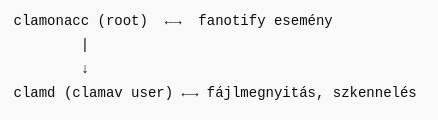

- [Bevezető](#bevezető)
- [Installálás](#installálás)
- [Automatikus vírus db frissítés](#automatikus-vírus-db-frissítés)
  - [Első manuális frissítés:](#első-manuális-frissítés)
  - [Frissítési gyakoriság beállítása](#frissítési-gyakoriság-beállítása)
- [ClamAV demon beállítása](#clamav-demon-beállítása)
  - [Milyen user nevében fusson a clamd?](#milyen-user-nevében-fusson-a-clamd)
    - [Miért nem rootként fut alapból a clamd?](#miért-nem-rootként-fut-alapból-a-clamd)
    - [Saját user nevében?](#saját-user-nevében)
    - [clamscan user nevében](#clamscan-user-nevében)
  - [User beállítása](#user-beállítása)
    - [Futtatás clamscan userrel](#futtatás-clamscan-userrel)
      - [Magyarázat:](#magyarázat)
      - [Csoportok létrehozása:](#csoportok-létrehozása)
    - [Futtatás saját user nevében](#futtatás-saját-user-nevében)
  - [Általános beállítások:](#általános-beállítások)
  - [Automatikus indítás](#automatikus-indítás)
  - [Indítás és teszt](#indítás-és-teszt)
  - [Időzített rendszeres ellenőrzés futtatása](#időzített-rendszeres-ellenőrzés-futtatása)
  - [SELinux](#selinux)
- [On-Access scanning](#on-access-scanning)
  - [Socket beállítások](#socket-beállítások)
  - [Clamonacc indító service módosítása](#clamonacc-indító-service-módosítása)
  - [scan.conf változtatások](#scanconf-változtatások)
  - [Socket Tesztelés](#socket-tesztelés)
  - [Karantén használata](#karantén-használata)
- [Finomhangolás](#finomhangolás)
    - [Milyen mappákat vizsgáljon](#milyen-mappákat-vizsgáljon)
    - [Config finomhangolása](#config-finomhangolása)
- [GUI használata](#gui-használata)
- [Tesztelés](#tesztelés)
  - [Hogyan látom épp mit csinál a clamd](#hogyan-látom-épp-mit-csinál-a-clamd)
- [Troubleshooting](#troubleshooting)

<br>

----------------------------------------------------------------------------------
# Bevezető 

* https://docs.clamav.net/manual/Usage/Scanning.html
* https://linuxcapable.com/install-clamav-on-fedora-linux/#:~:text=To%20customize%20ClamAV%20settings%2C%20such,conf%20.


A ClamAV egy nyílt forráskódú (GPLv2) vírusirtó eszközkészlet, amelyet különösen e-mail átjárók e-mailjeinek vizsgálatára terveztek. Számos segédprogramot biztosít, beleértve egy rugalmas és skálázható több szálú démont, egy parancssori szkennert és egy fejlett eszközt az automatikus adatbázis-frissítésekhez. 

> **Tipp:** A ClamAV nem egy hagyományos vírusirtó vagy végpontbiztonsági csomag. Egy teljes funkcionalitású modern végpontbiztonsági csomaghoz nézze meg a Cisco Secure Endpoint-et. További részletekért lásd az "kapcsolódó termékek" részt alább.

A ClamAV-ot a Cisco Systems, Inc. hozta létre.

A ClamAV-nak sokszínű ökoszisztémája van közösségi projektekből, termékekből és egyéb eszközökből, amelyek vagy a ClamAV-ra támaszkodnak a rosszindulatú programok észlelési képességeinek biztosításához, vagy kiegészítik a ClamAV-ot új funkciókkal, mint például a harmadik féltől származó aláírási adatbázisok jobb támogatása, grafikus felhasználói felületek (GUI) és még sok más.

A ClamAV gyors fájlvizsgálatra lett tervezve.
Valós idejű védelem (csak Linux). A ClamOnAcc kliens a ClamD szkennelő démonhoz valós idejű szkennelést biztosít a modern Linux verziókon. Ez magában foglalja az opcionális képességet, hogy a fájlhozzáférést blokkolja, amíg a fájl nem lett átvizsgálva (valós idejű megelőzés).
A ClamAV milliónyi vírust, férget, trójait és egyéb rosszindulatú programot észlel, beleértve a Microsoft Office makró vírusokat, mobil rosszindulatú programokat és egyéb fenyegetéseket.
A ClamAV bytecode aláírási futtatókörnyezete, amelyet vagy az LLVM, vagy a saját bytecode értelmezőnk hajt végre, lehetővé teszi a ClamAV aláírásírók számára, hogy nagyon összetett észlelési rutinokat hozzanak létre és terjesszenek, valamint távolról javítsák a szkenner funkcionalitását.

<br>

-----------------------------------------------------------------------------------
# Installálás

Alap szoftver installáció: 
```
$ sudo dnf install clamav clamd clamav-update
```

GUI: 
```
$ sudo dnf install clamtk
```


Mappa rekurzív sacnnaelése: 
```
clamscan -r otpbank/
...
----------- SCAN SUMMARY -----------
Known viruses: 8704956
Engine version: 1.0.8
Scanned directories: 6
Scanned files: 100
Infected files: 0
Data scanned: 0.04 MB
Data read: 0.04 MB (ratio 1.00:1)
Time: 9.100 sec (0 m 9 s)
Start Date: 2025:03:10 18:23:06
End Date:   2025:03:10 18:23:16
```


----------------------------------------------------------------------------------
# Automatikus vírus db frissítés


A freshclam démonként fut (freshclam daemon):
* csatlakozik a ClamAV központi adatbázis szervereihez,
* letölti az új main.cvd, daily.cvd, bytecode.cvd adatbázisfájlokat

## Első manuális frissítés:
Állítsuk le az elindított freschclam programot, hogy manuálisan el tudjuk végezni az első frissítést: 
```
$ sudo systemctl stop clamav-freshclam
```

<br>

Manuálisan frissítjük a vírus adatbázist: 
```
$ sudo freshclam
```

<br>

Beállítjuk, hogy mindig fusson:
```
$ sudo systemctl enable --now clamav-freshclam
```


## Frissítési gyakoriság beállítása

* Config fájl: **/etc/freshclam.conf**
* Logok: /var/log/clamav/freshclam.log

```
# Number of database checks per day.
# Default: 12 (every two hours)
#Checks 24
```


<br>

----------------------------------------------------------------------------------
# ClamAV demon beállítása

Config fájl: /etc/clamd.d/scan.conf

A clamd démon futtatása attól függ, hogy milyen módon szeretnéd használni a ClamAV-t:

1. Ha csak időnként szeretnéd futtatni a víruskeresést (pl. manuálisan vagy cron job segítségével), akkor a clamd démon nem szükséges folyamatosan futnia. Ehelyett a clamscan parancsot használhatod egy adott könyvtár átvizsgálására.
2. Ha valós idejű vagy rendszeres automatikus víruskeresést szeretnél (pl. egy fájlszerver védelme érdekében), akkor érdemes elindítani a clamd démont, mivel ez jelentősen felgyorsítja a vizsgálatokat. A clamd előre betölti a vírusadatbázist és gyorsabb elemzést tesz lehetővé, mint az egyenkénti clamscan futtatás.


## Milyen user nevében fusson a clamd? 


| Tulajdonság                          | `clamscan` (default)       | `saját user`           | `root` (admin jog)           |
|-------------------------------------|-----------------------------|-----------------------------|------------------------------|
| Hozzáférés saját fájljaidhoz        | ⚠️ korlátozott              | ✅ teljes                    | ✅ teljes                    |
| Hozzáférés rendszerfájlokhoz        | ❌                          | ❌                           | ✅                           |
| Védettség hibás kódfuttatás ellen   | ✅ erős izoláció            | ⚠️ gyengébb izoláció         | ❌ nincs izoláció (magas kockázat) |
| Vírusirtó által lefedett terület    | ⚠️ részleges                | ✅ saját home könyvtár teljesen | ✅ globális lefedettség     |
| Konfigurációs bonyolultság          | ✅ alapértelmezett          | ⚠️ override szükséges         | ⚠️ override + biztonsági kockázat  |


### Miért nem rootként fut alapból a clamd?
A clamd általában clamav vagy clamscan nevű korlátozott rendszerfelhasználóként fut. Ennek oka:
* minimalizálja a kárt, ha valaki biztonsági hibát talál a clamd-ban,
* nem akarjuk, hogy egy hálózaton keresztül vezérelhető víruskereső motor root jogosultságú legyen.

✅ De mit nyersz azzal, ha mégis rootként futtatod?

Teljes fájlrendszer hozzáférés
pl. /root, /home/adam/.config, zárolt fájlok stb.
Kevesebb File path check failure hiba
Egyszerűbb beállítás – nem kell csoportokat, jogosultságokat hangolgatni

⚠️ Mi a kockázat?

Egy távoli támadó, aki exploitál egy hibát a clamd processzben (pl. fertőzött fájl manipulált szkennelésével), root jogot szerezhet a rendszereden.
Ez különösen akkor veszélyes, ha a clamd TCP socketet is szolgáltat (pl. port 3310-on).

### Saját user nevében? 

✅ Mit nyersz azzal, ha clamd az saját user nevében fut?
* Hozzáférés a teljes /home/adam/ struktúrához (beleértve .config, .local, .mozilla, stb.)
* Nem kell chmod, chgrp, vagy extra csoport
* Nem rootként fut, tehát kisebb a támadási felület

⚠️ Mit nem fog tudni így a clamd?
* Nem fér hozzá más felhasználók fájljaihoz
* Nem lát rendszerfájlokat (pl. /etc, /bin, /var)
* Nem tudja vizsgálni pl. /root, vagy máshol levő fájlokat, amikhez root kellene

### clamscan user nevében

✅ Előnyök:
* Biztonságos alapértelmezett beállítás
  * A clamscan felhasználó jogai szigorúan korlátozottak, nincs írás- vagy olvasási jog a legtöbb helyre.
  * Ha valaki kihasznál egy clamd-ban található sebezhetőséget, akkor csak clamscan jogosultsággal fér hozzá a rendszerhez.
* Kompatibilis a disztribúció beállításaival
  * A Fedora (és más rendszerek) clamd@scan szolgáltatása alapból ehhez van konfigurálva.
  * A /run/clamd.scan/clamd.sock socket fájlt clamscan:clamscan user/csoport hozza létre.
* Támogatott, stabil modell: A ClamAV fejlesztői így tervezték, így ez a legjobban tesztelt mód.

🔴 Hátrányok:
* Korlátozott hozzáférés a fájlrendszerhez
  * A clamscan user nem fér hozzá a legtöbb felhasználói home könyvtárhoz, különösen a zárt mappákhoz (mint .config, .cache, stb.)
* További konfiguráció szükséges, ha szélesebb körű fájlhozzáférést akarsz:
  * Csoporttagságokat, fájlrendszer-jogosultságokat kell módosítanod (pl. virusgroup, chmod, chgrp)
  * Ez viszont könnyen biztonsági rést nyithat, ha nem figyelsz oda
* Nem fér hozzá root-only fájlokhoz: Pl. /root, /etc/shadow, vagy más felhasználók fájljai


## User beállítása 

Az alábbi két lehetőségből válasszunk egyet. 

### Futtatás clamscan userrel

#### Magyarázat:
Ez a default működés, ebben az esetben a clamad csak azokat a fájlokat fogja tudni átvizsgálni, ahol a csoport tagok is olvashatják a fájlt. A csak tulajdonos számára hozzáférhető fájlokra a clamd hibát fog dobni. 


>**WARNING**: multi user környezetben is működik, de akkor a clamscan felhasználót minden user csoportjához hozzá kell adni. 


Nem fog hozzáférni semmi olyanhoz, amit a csoport nem olvashat: 
```
File path check failure on: /home/adam/.config/google-chrome/Default/Cookies-journal
```

Ennek a fájlnak ezek a beállításai: 
```
$ ls -l /home/adam/.config/google-chrome/Default/Cookies-journal
-rw-------. 1 adam adam 0 Mar 21 16:39 /home/adam/.config/google-chrome/Default/Cookies-journal
```

#### Csoportok létrehozása: 

```
$ sudo groupadd virusgroup
```

<br>

A daemon a clamscan felhasználó nevében fog futni, ezért hozzá kell adni a csoporthoz. 
```
$ sudo usermod -aG virusgroup clamscan
```

<br>

Saját felhasználó hozzáadása a virusgroup-hoz, hogy a daemon elérhesse a saját fájljainkat? 
```
$ sudo usermod -aG virusgroup $USER
```

<br>

És a clamscan-t hozzáadjuk a saját csoportunkhoz is, hogy láthassa azokat a fájlokat amik az 'adam' csoport olvashat: 
```
$ sudo usermod -aG adam clamscan
```

<br>

Tagok listázása: 
```
$ getent group virusgroup
virusgroup:x:966:clamupdate,clamscan,adam
```

### Futtatás saját user nevében

Ez a megoldás multi user környezetben nem fog működni, de ha csak egy user van egy gépen (tipikusan igen), akkor ez egy optimális megoldás. 


```
$ sudo EDITOR=mcedit systemctl edit clamd@scan

Successfully installed edited file '/etc/systemd/system/clamd@scan.service.d/override.conf'.

```

<br>

Oda ahol mondja, hogy a két comment közé írjunk, ezt kell írni: 
```
[Service]
User=adam
Group=adam
RuntimeDirectory=clamd.scan
RuntimeDirectoryMode=0770
```
(Az utolsó két sorban nem vagyok biztos)


<br>

A log fájlt adjuk az adam tulajdonába: 
```
sudo touch /var/log/clamd.scan
sudo chown adam:adam /var/log/clamd.scan
sudo chmod 640 /var/log/clamd.scan
```


<br>

ClamAV daemon újraindítása: 
```
sudo systemctl restart clamd@scan
```

<br>

Ellenőrizzük kinek a nevében fut: 
```
$ ps -C clamd -o pid,euser,egroup,cmd
    PID EUSER    EGROUP   CMD
 206815 adam     adam     /usr/sbin/clamd -c /etc/clamd.d/scan.conf
```


## Általános beállítások: 
```
LogFile /var/log/clamd.scan
LogVerbose yes
LogRotate yes

User adam

# Default: 100M
#MaxFileSize 400M
```


## Automatikus indítás

Tegyük auto start-ra a clamd-t: 
```
$ sudo systemctl enable --now clamd@scan
```


## Indítás és teszt
ClamAV daemon újraindítása: 
```
sudo systemctl restart clamd@scan
```

Ellenőrzés: 
```
$ sudo systemctl status clamd@scan
● clamd@scan.service - clamd scanner (scan) daemon
     Loaded: loaded (/usr/lib/systemd/system/clamd@.service; enabled; preset: disabled)
    Drop-In: /usr/lib/systemd/system/service.d
             └─10-timeout-abort.conf, 50-keep-warm.conf
     Active: active (running) since Wed 2025-03-12 18:23:27 CET; 37s ago
```

<br>

Test scannelés: 
```
$ clamscan index.md 
Loading:     8s, ETA:   0s [========================>]    8.71M/8.71M sigs       
Compiling:   1s, ETA:   0s [========================>]       41/41 tasks 

/home/adam/repositories/Other/berkiadam-github/wiki/linux/clamav/index.md: OK

----------- SCAN SUMMARY -----------
Known viruses: 8706011
Engine version: 1.0.8
Scanned directories: 0
Scanned files: 1
Infected files: 0
Data scanned: 0.01 MB
Data read: 0.00 MB (ratio 2.00:1)
Time: 9.489 sec (0 m 9 s)
Start Date: 2025:03:21 14:03:04
End Date:   2025:03:21 14:03:13
```

<br>

Troubleshooting: 
```
$ journalctl -xeu clamd@scan
```


## Időzített rendszeres ellenőrzés futtatása

TODO...


## SELinux


Ha a SELinux be van kapcsolva, akkor fontos, hogy beállítsuk a virus kereső működést. 


You must tell SELinux about this by enabling the 'antivirus_can_scan_system' boolean:
```
setsebool -P antivirus_can_scan_system 1
sudo usermod -aG virusgroup adam
```

<br>
<br>

----------------------------------------------------------------------------------------------
# On-Access scanning 
- https://docs.clamav.net/manual/Usage/Scanning.html#on-access-scanning
- https://docs.clamav.net/manual/OnAccess.html

> **WARNING**: On-Access requires a kernel version >= 3. This is because it leverages a kernel api called fanotify to block processes from attempting to access malicious files. This prevention occurs in kernel-space, and thus offers stronger protection than a purely user-space solution.

clamonacc program segítségével lehet on-access scanning-et futtatni. 


## Socket beállítások

A clamonacc egy lokális socke-ten küldi át majd a scannelendő fájlokat a clmad-nek. Ehhez létre kell hozni kézzel egy socket fájlt és be kell állítsuk rajta a megfelelő jogosultságokat és user-eket. 

Reláció a clamonacc és a clamd között: 



| Komponens     | Jogosultság             | Feladat                                |
|---------------|--------------------------|-----------------------------------------|
| `clamonacc`   | `root`                   | eseményfigyelés (`fanotify`)            |
| `clamd`       | `clamav` vagy `clamscan` | fájlok megnyitása és vírusvizsgálata   |


Socket létrehozása az on-access vizsgálathoz: 
```
sudo mkdir -p /run/clamd.scan
sudo chown adam:virusgroup /run/clamd.scan
sudo chmod 770 /run/clamd.scan
```

>**WARNING**: Itt fontos, hogy annak a felhasználónak a tulajdonába adjuk a socket-et akinek a nevében futtatjuk a clamav-t. Jelen esetben a saját user-ünk


> **NOTE**: Ez egy átmeneti mappa, minden induláskor a systemctl újra létre fogja hozni azokkal a beállításokkal ami a configban van. Tehát ha ott rossz user és group van, akkor újraindítás után már az ő tulajdonában lesz és megint csak nem fog tudni olvasni belőle a camad.  


<br>


Socket beállítása a **/etc/clamd.d/scan.conf** fájlban: 
```
LocalSocket /run/clamd.scan/clamd.sock
LocalSocketMode 660
```

<br>

Indítsuk újra a clmad-t és nézzük meg hogy hallgatózik e a socket-en: 
```
sudo systemctl restart clamd@scan
```

Nézzük meg hogy figyel e a socket-en: 
```
$ ss -lx | grep clamd
u_str LISTEN 0      200       /run/clamd.scan/clamd.sock 24800              * 0   
```

## Clamonacc indító service módosítása

A clamonacc gyári indításából hiányzik a --fdpass, ami szükséges, ha clamonacc nem clamd nevében fut. 

```
sudo EDITOR=mcedit systemctl edit clamav-clamonacc.service
```

Úgy, hogy a # jelek között ne legyen új sor: 
```
### Anything between ...
[Service]
ExecStart=
ExecStart=/usr/sbin/clamonacc -F --fdpass --config-file=/etc/clamd.d/scan.conf
### Edit below 
```
Az első ExecStart= sor kinullázza az eredetit, így nem lesz duplikált.

Mentés után ezt látjuk: 
```
Successfully installed edited file '/etc/systemd/system/clamav-clamonacc.service.d/override.conf'.
```


Töltsük újra a service konfigurációt: 
```
sudo systemctl daemon-reexec
sudo systemctl daemon-reload
```


## scan.conf változtatások

on-Access beállítása a **/etc/clamd.d/scan.conf** fájlban: 
```
OnAccessMaxFileSize 10M
OnAccessIncludePath /home
OnAccessPrevention yes

# Ezekre ne vizsgáljon
OnAccessExcludePath /home/adam/.config
```

A root és a clamd felhasználókat ki kell zárni a scannelésből. Ez azért fontos, mert ha a clamd saját maga által írt fájlokat is ellenőrzi, végtelen ciklusba kerülhet.

```
# Kizárja a root UID-ját a szkennelésből (ajánlott)
OnAccessExcludeRootUID yes

# Kizárja a `clamd` felhasználót a szkennelésből
OnAccessExcludeUname clamscan
```


ClamAV daemon újraindítása: 
```
sudo systemctl restart clamd@scan
```

Clamonacc újraindítása: 
```
sudo systemctl restart clamonacc
```

Ellenőrzés: 
```
# sudo systemctl status clamav-clamonacc.service
● clamav-clamonacc.service - ClamAV On-Access Scanner
     Loaded: loaded (/usr/lib/systemd/system/clamav-clamonacc.service; disabled; preset: disabled)
    Drop-In: /usr/lib/systemd/system/service.d
             └─10-timeout-abort.conf, 50-keep-warm.conf
             /etc/systemd/system/clamav-clamonacc.service.d
             └─override.conf
     Active: active (running) since Mon 2025-03-24 21:11:52 CET; 2min 2s ago
 Invocation: 8448a0a166c449d8a2c4dce61add2da8
       Docs: man:clamonacc(8)
             man:clamd.conf(5)
             https://docs.clamav.net/
   Main PID: 10435 (clamonacc)
      Tasks: 8 (limit: 76567)
     Memory: 92.9M (peak: 94.2M)
        CPU: 2.433s
     CGroup: /system.slice/clamav-clamonacc.service
             └─10435 /usr/sbin/clamonacc -F --fdpass --config-file=/etc/clamd.d/scan.conf

Mar 24 21:11:52 fedora systemd[1]: Started clamav-clamonacc.service - ClamAV On-Access Scanner.
Mar 24 21:11:54 fedora clamonacc[10435]: ClamInotif: watching '/home' (and all sub-directories)
Mar 24 21:11:54 fedora clamonacc[10435]: ClamInotif: excluding '/home/adam/.config' (and all sub-directories)
```

<br>

Láthatjuk, hogy 
* jó helyről szedi fel a configot: /etc/clamd.d/scan.conf
* szerepel a **--fdpass** az indító parancsban
* a /home mappát figyeli
* a .config mappa kivétel

<br>

Fontos, hogy a clamonacc root-két fusson: 
```
$ ps -C clamonacc -o pid,euser,egroup,cmd
    PID EUSER    EGROUP   CMD
 162360 root     root     /usr/sbin/clamonacc -F --config-file=/etc/clamd.d/scan.conf
```

<br>

Automatikus indítása a clamonacc-nek: 
```
$ sudo systemctl enable --now clamonacc 
```


<br>

System logban: 
```
$ journalctl -f
...
...
Mar 24 15:16:16 fedora clamonacc[22116]: ClamInotif: watching '/home' (and all sub-directories)
Mar 24 15:16:16 fedora clamonacc[22116]: ClamInotif: excluding '/home/adam/.config' (and all sub-directories)
```


## Socket Tesztelés

Nézzük meg folyik a kommunikáció a local socket-en, ehhez a **strace** programot fogjuk használni: 
```
$ sudo dnf install strace
```

<br>

Majd hallgassunk bele. A localsocket-en bináris forgalom közlekedik, így csak azt fogjuk látni, hogy zajlik az élet, hogy milyen fájlokat küld át a clamonacc, azt nem :
```
$ sudo strace -p $(pidof clamd) -s 100 -e trace=read,write
strace: Process 1784 attached
read(6, "\0", 1025)                     = 1
read(6, "\0", 1025)                     = 1
read(6, "\0", 1025)                     = 1
read(6, "\0", 1025)                     = 1
read(6, "\0", 1025)                     = 1
read(6, "\0", 1025)                     = 1
....
```


## Karantén használata 
sudo clamonacc --move=/var/quarantine --log=/var/log/clamonacc.log --fdpass

<br>

----------------------------------------------------------------------------------------------
# Finomhangolás

Az **on-access scanning** borzasztó erőforrás igényes, ha nem korlátozzuk le, hogy mire futhat le annyira megfoghatja a CPU-t, hogy használhatatlan lesz a gép. Ezért fontos, hogy finomhangoljuk hogy hogyan és mire fusson az on-access scan hatására a clamd. 

<br>

### Milyen mappákat vizsgáljon
Az összes olyan mappát excludálni kell az on-access scannelés alól, ami: 
* config fájlokat tartalmaz, tipikusan a . kezdetű mappák 
* GIT repókat tartalmazó mappák
* programok bináris fájlrajit tartalmazó mappák, pl a vscode bináris mappáját ha figyeli, akkor kb 20mp lesz mire el tud indulni. Ezeket muszáj kivenni a vizsgálat alól. 

```
OnAccessExcludePath /home/adam/.cache
OnAccessExcludePath /home/adam/.cassandra
OnAccessExcludePath /home/adam/.cert
...
OnAccessExcludePath /home/adam/repositories
...
```

### Config finomhangolása


* Miket excludáljunk

* Mit scanneljen és hogy? 
  * Data Loss Prevention (DLP)  
  * Mail files
  * scan Documents
  * Executable files
  * Heuristic Alerts


* #VirusEvent /opt/send_virus_alert_sms.sh


<br>

----------------------------------------------------------------------------------------------
# GUI használata


----------------------------------------------------------------------------------------------
# Tesztelés

## Hogyan látom épp mit csinál a clamd


```
sudo strace -p $(pidof clamd | cut -d" " -f1) -s 200 -e trace=recvfrom,sendto
...
...
--- SIGPIPE {si_signo=SIGPIPE, si_code=SI_USER, si_pid=2038, si_uid=1000} ---
sendto(5, "<183>Mar 26 00:24:48 clamd[2038]: Client disconnected (FD 11)", 61, MSG_NOSIGNAL, NULL, 0) = 61
sendto(11, "", 0, 0, NULL, 0)           = -1 EPIPE (Broken pipe)
--- SIGPIPE {si_signo=SIGPIPE, si_code=SI_USER, si_pid=2038, si_uid=1000} ---
sendto(5, "<183>Mar 26 00:24:48 clamd[2038]: Client disconnected (FD 11)", 61, MSG_NOSIGNAL, NULL, 0) = 61


```


Honnan látom, hogy tényleg átvizsgálta e a megnyitott fájlt? 


Példa vírus letöltése: 


<br>


TODO: mi történik ha vírust talál, 

hogy tudom megnézni, hogy mi történt, hogy működik e stb. 


----------------------------------------------------------------------------------------------
# Troubleshooting


............................


ez mit jelent? 

Mar 24 16:55:04 fedora clamd[1912]: SWF support enabled.
Mar 24 16:55:04 fedora clamd[1912]: HTML support enabled.
Mar 24 16:55:04 fedora clamd[1912]: XMLDOCS support enabled.
Mar 24 16:55:04 fedora clamd[1912]: HWP3 support enabled.
Mar 24 16:55:04 fedora clamd[1912]: Self checking every 600 seconds.
