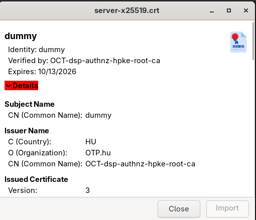

# Base64

Jelszavak kódolása, hogy ne kerüljön bele a fájl vége jel: 
```
echo "jelszo" | tr -d '\n' | base64
```

Ne törje sorokba, hanem az egész folyamatos legyen: 
```
echo "jelszo" | base64 -w 0
```


# Gnome-nautilus cert viewer

```
$ gcr-viewer my-file.crt
```

