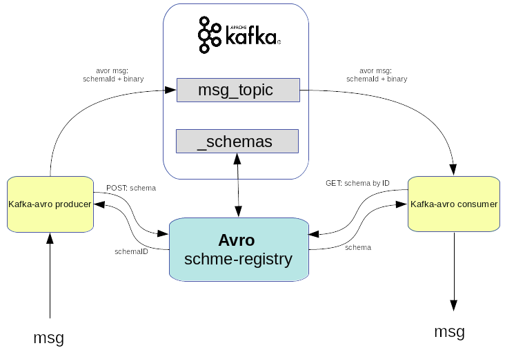
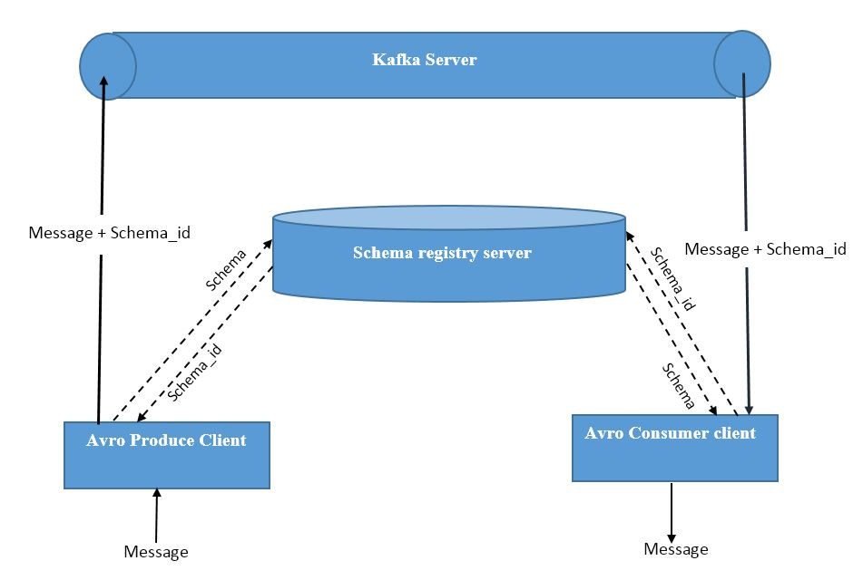
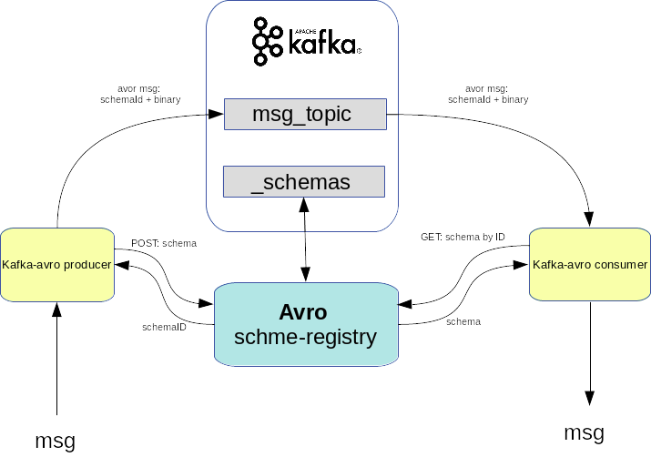
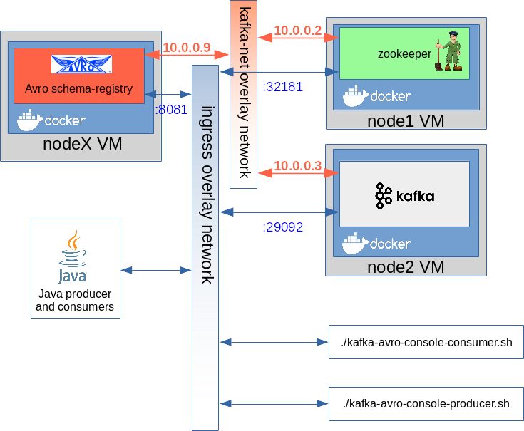
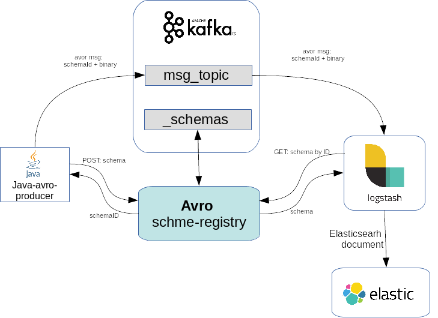
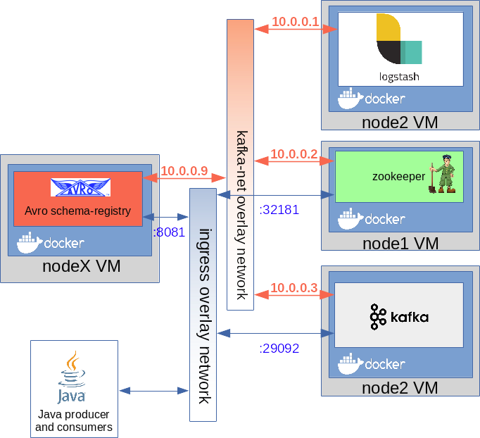

 
<!--  -->


# Bevezető


## Mi az Avro?

Az Avro egy nyílt forráskódú project, ami egy adata szerializációs szolgáltatás elsősorban az Apache Hadoop-hoz, de nem csak a Hadoop-ban használható, ahogy a mi példánkban is látni fogjuk. Az Avro segítségével nagyon hatékonyan cserélhetünk adatokat két végpont között "big data" környezetben. 


 
<!--  -->


Az Avro alapja egy séma regiszter, amihez mind az adat szerializáló és deszerializáló szolgáltatás kapcsolódik. Itt tárolja az Avro a serializálnadő adatok tervrajzát JSON formátumban, a sémákat verziózva. Amikor a serializáló szolgáltatás adatot akar küldeni, akkor megjelöli az Avro serializátornak hogy melyik séma alapján serializálja a küldendő adatot. Ha a séma még nem létezett, akkor beszúrja a séma regiszterbe. Az Avro binárist készít a séma segítségével a küldendő adatból, és az üzenetbe a bináris adat mellé beleteszi a séma azonosítóját is, amit a deszerializiős szolgáltatás megkap, és annak segítségével ki tudja olvasni az adat deszerializálásához szükséges sémát, ami segítségével előállítja az eredeti üzenetet. 

Az Avro séma regiszter több verziót is képes kezelni egy sémából. A beállításoknak megfelelően a séma lehet előre vagy visszafelé kompatibilis. Ha egy séma visszafelé kompatibilis, akkor az új sémával is ki lehet olvasni olyan régi adatokat, amit még egy korábbi sémával írtak be. 

Az Avor sémákat JSON formátumban kell leírni, aminek egyedi, kötött szintaktikájuk van, tehát nem szabványos JSON sémák. A schema-registry-el egy REST API-n keresztől lehet kommunikálni. A legtöbb programozási nyelven elérhető Avro magas szintű API, ami elfedi előlünk a REST kommunikációt. Az Avró többféle adatbázisban is tárolhatja a sémákat, de a leggyakoribb megoldás, hogy egy speciális Kafka topic-ban tárolja azokat. 


Az Avro-t gyakran használják a Kafa kommunikációban mint serlializációs szólgáltatás. Mi is így fogjuk használni: 

 
<!--  -->

A Kafa produceren a Avro serializáló beküldi a sémát a séma regiszterbe, aminek visszakapja az ID-jét. Majd a séma alapján serializálja az adatokat és gyárt belőle egy Avro üzenetet, amiben benne van a séma azonosító és binárisan az üzenet, ami így nagyon kicsi helyet foglal. Ez kerül fel a megfelelő Kafka topic-ra. A Kafka consumer az üzenetben lévő séma ID alapján lekérdezi a sémát a registry-ből, majd annak segítségével deserializálja az üzenetet.


Ahogy azt már írtam, az Avro schema-registry többféle adatbázisban is képes tárolni a sémákat, köztük Kafka-ban is. Kafka estőn az Avro regiszter egy kitüntetett topic-ban tárolja a sémákat (_schemas). Ha a kommunikációra is Kafka-t használunk, akkor használhatjuk akár ugyan azt a Kafka broker-t mind két célra, ahogy az alábbi ábrán is látható: 

 
<!--  -->


<br>


## Környezet
Az Avro futtatásához szükséges környezet egy két node-os swarm cluster lesz. 

```
1. virsh list
 Id    Name                           State
----------------------------------------------------
 1     mg0                            running
 2     worker0                        running
```

```
2. docker node ls
ID                            HOSTNAME            STATUS              AVAILABILITY        MANAGER STATUS      ENGINE VERSION
maigxlyagj1fl4sgcf6rnn9pc *   mg0                 Ready               Active              Leader              18.05.0-ce
vox99u5s1g1su742mc6npm370     worker0             Ready               Active                                  18.05.0-ce
```


Itt fogunk futtatni egy docker stack-et ami tartalmaz majd egy avro schema-registry-t, egy kafa brókert és egy zookeeper példányt. 


 
<!--  -->


confluent_swarm.yaml
```json
version: '3.2'
services:
  zookeeper:
    image: confluentinc/cp-zookeeper:5.1.2
    networks:
      - kafka-net
    ports:
      - "32181:32181"
    deploy:
      placement:
        constraints:
         - node.role == worker
    environment:
      ZOOKEEPER_CLIENT_PORT: 32181
      ZOOKEEPER_TICK_TIME: 2000
      ZOOKEEPER_SYNC_LIMIT: 2
  kafka:
    image: confluentinc/cp-kafka:5.1.2
    networks:
      - kafka-net
    ports:
      - target: 29092
        published: 29092
        protocol: tcp
    deploy:
      placement:
        constraints:
         - node.role == worker
    environment:
      KAFKA_ZOOKEEPER_CONNECT: "zookeeper:32181"
      KAFKA_ADVERTISED_LISTENERS: "PLAINTEXT://kafka:29092"
      KAFKA_BROKER_ID: 2
      KAFKA_OFFSETS_TOPIC_REPLICATION_FACTOR: 1
  schemaregistry:
    image: confluentinc/cp-schema-registry:5.1.2
    networks:
      - kafka-net
    ports:
      - target: 8081
        published: 8081
        protocol: tcp
    deploy:
      placement:
        constraints:
          - node.role == worker
    environment: 
      SCHEMA_REGISTRY_KAFKASTORE_CONNECTION_URL: "zookeeper:32181"
      SCHEMA_REGISTRY_HOST_NAME: "schemaregistry"
      SCHEMA_REGISTRY_DEBUG: "true"        
networks:
  kafka-net:
    driver: overlay
```

Hozzuk létre a docker stack-et: 
```
3. docker stack deploy -c confluent_swarm.yaml confluent
```

Listázzuk ki a stack-ban létrejött service-eket és az overlay hálózatot: 
```
4. docker service ls
ID                  NAME                        MODE                REPLICAS            IMAGE                                   PORTS
7vjvop7tqiyc        confluent_kafka            replicated          1/1                 confluentinc/cp-kafka:5.1.2             *:29092->29092/tcp
in6a4ti3jeu5        confluent_schemaregistry   replicated          1/1                 confluentinc/cp-schema-registry:5.1.2   *:8081->8081/tcp
oxxjtkcusj1f        confluent_zookeeper        replicated          1/1                 confluentinc/cp-zookeeper:5.1.2         *:32181->32181/tcp
```
```
5. docker network ls
NETWORK ID          NAME                   DRIVER              SCOPE
...
5albky0eu1to        confluent_kafka-net   overlay             swarm
olqkh5zlqiac        ingress                overlay             swarm
...
```


Keressük meg a worker0 node IP címét: 
```
6. docker-machine ip worker0
192.168.42.42
```

Mivel mind a három komonensünknek egy-egy portját publikáltuk az ingress loadbalance-olt hálózatra, ezrét az összes node-on elérhetőek az adott portokon. 
- zookeeper: 192.168.42.42:32181
- kafka: 192.168.42.42:29092
- schema-registry: 192.168.42.42:8081

<br>


# Avro REST interfész

Az Avro a **_schemas** nevű Kafka topic-ban tárolja a sémákat az alapértelmezett konfiguráció szerint. A Kafka /bin mappájában található **kafka-topics.sh** topic admin script-el listázzuk ki a topikokat: 


```
$ ./kafka-topics.sh --list --zookeeper 192.168.42.42:32181
__confluent.support.metrics
_schemas
```


Az schma registry-vel a REST interfészén keresztől lehet kommunikálni. Próbáljuk ki a config paranccsal hogy elérhető e a server a host gépről. 
```
$ curl -X GET http://192.168.42.42:8081/config
{"compatibilityLevel":"BACKWARD"}
```


A válaszban láthatjuk a kompatibilitási szintet (ezt majd később részletesen tárgyaljuk). 


Avro-ban minden sémát egy úgynevezett subject-ek alá kell regisztrálni. Egy subject alatt ugyan azon séma különböző verzióit tároljuk. Tehát két teljesen különböző sémát nem lehet ugyanazon subject alá berakni. Tehát mikor hasonló sémákat regisztrálunk ugyanazon subject alá, akkor különböző verziók fognak létrejönni ugyan ahhoz a sémához. Azt hogy mekkora a megengedett eltérés mértéke, a schema-registry server konfigurációja határozza meg. 


The schema registry server can enforce certain compatibility rules when new schemas are registered in a subject. Currently, we support the following compatibility rules.

- **Backward compatibility** (default): A new schema is backward compatible if it can be used to read the data written in all previous schemas. Backward compatibility is useful for loading data into systems like Hadoop since one can always query data of all versions using the latest schema.

- **Forward compatibility**: A new schema is forward compatible if all previous schemas can read data written in this schema. Forward compatibility is useful for consumer applications that can only deal with data in a particular version that may not always be the latest version.

- **Full compatibility**: A new schema is fully compatible if it’s both backward and forward compatible.

- **No compatibility**: A new schema can be any schema as long as it’s a valid Avro.


A sémákat a POST:/subjects/<subject-name>/versions REST interfészen kell beküldeni. A POST body-ban a {schema: "...séma definicőő..."} formátumban kell megadni a sémát, ahol a séma definőciő egy escape-lt belső json. 
```
$ curl -X POST -H "Content-Type: application/vnd.schemaregistry.v1+json" --data '{"schema" : "... schema def..."}' http://192.168.42.42:8081/subjects/<subject-name>/versions
```


Szúrjuk be az Avro-ba az alábbi **Employee** sémát. A namespace majd a schema-to-java kód generálásánál lesz érdekes, ez fogja meghatározni a java csomagot generált kódban. A type mező mutatja meg, hogy összetett objektumot, sima stringet, vagy tömböt ír le a séma. A **record** jelenti az összetett objektumot. Az **Employee** nevű objektum négy mezőből áll. 
```json
{"namespace": "hu.alerant.kafka.avro.message",
  "type": "record",  "name": "Employee",
    "fields": [
        {"name": "firstName", "type": "string"},
        {"name": "lastName", "type": "string"},
        {"name": "age",  "type": "int"},
        {"name": "phoneNumber",  "type": "string"}  
    ]
}
```


Ennek az escape-elt változata: 
```
{\"namespace\": \"hu.alerant.kafka.avro.message\",  \"type\": \"record\",  \"name\": \"Employee\",   \"fields\": [ {\"name\": \"firstName\", \"type\": \"string\"},{\"name\": \"lastName\", \"type\": \"string\"},{\"name\": \"age\",  \"type\": \"int\"}, {\"name\": \"phoneNumber\",  \"type\": \"string\"} ]}
```


Szurjuk be a fenit sémát a **test1** subject alá: 
```
$ curl -X POST -H "Content-Type: application/vnd.schemaregistry.v1+json" --data '{"schema" : "{\"namespace\": \"hu.alerant.kafka.avro.message\",  \"type\": \"record\",  \"name\": \"Employee\",   \"fields\": [ {\"name\": \"firstName\", \"type\": \"string\"},{\"name\": \"lastName\", \"type\": \"string\"},{\"name\": \"age\",  \"type\": \"int\"}, {\"name\": \"phoneNumber\",  \"type\": \"string\"} ]}"}' http://192.168.42.42:8081/subjects/test1/versions

{"id":1}
```

A válaszban visszakaptuk a séma példány egyedi azonosítóját. Ez nem összekeverendő a séma verziójával. Tehát a **test1** subject-en ugyan annak a sémának több verziója is lehet, de globálsan, ennek s séma példánynak az ozonosítója = 1


Most próbáljunk az előbbitől tejesen különböző **Company** sémát regisztrálni szintén a **test1** subject alá. 
```json
{"namespace": "hu.alerant.kafka.avro.message",
  "type": "record",  "name": "Company",
    "fields": [
        {"name": "name", "type": "string"},
        {"name": "address", "type": "string"},
        {"name": "employCount",  "type": "int"},
        {"name": "phoneNumber",  "type": "string"}  
    ]
}
```

Ennek az escape-elt változata az alábbi. 
```
{\"namespace\": \"hu.alerant.kafka.avro.message\",  \"type\": \"record\",  \"name\": \"Company\",   \"fields\": [ {\"name\": \"name\", \"type\": \"string\"}, {\"name\": \"address\", \"type\": \"string\"}, {\"name\": \"employCount\",  \"type\": \"int\"},  {\"name\": \"phoneNumber\",  \"type\": \"string\"} ]}
```


A **Company** sémát szúrjuk be szintén az **test1** subject alá. 
```
$ curl -X POST -H "Content-Type: application/vnd.schemaregistry.v1+json" --data '{"schema" : "{\"namespace\": \"hu.alerant.kafka.avro.message\",  \"type\": \"record\",  \"name\": \"Company\",   \"fields\": [ {\"name\": \"name\", \"type\": \"string\"}, {\"name\": \"address\", \"type\": \"string\"}, {\"name\": \"employCount\",  \"type\": \"int\"},  {\"name\": \"phoneNumber\",  \"type\": \"string\"} ]}"}' http://192.168.42.42:8081/subjects/test1/versions

{"error_code":409,"message":"Schema being registered is incompatible with an earlier schema ...}
```

Láthatjuk, hogy nem engedte az Avro a **Company** sémát regisztrálni a **test1** subject alá, mert túl nagy volt az eltérés a **Company** és a **Employee** sémák között. 


Láthattuk a /config lekérdezésben, hogy jelenleg a beállított kompatibilitási szint **BACKWARD**, ami azt jelenti, hogy csak olyan sémákat lehet beszúrni ugyan azon subject alá, amivel az összes korábban beszúrt adatot ki lehet olvasni, magyarán csak olyan sémákat lehet egymás után beszúrni, ami részhalmaza az előző sémának. 

Most szúrjuk be az **Employee** sémának egy redukált változatát, amiből hiányzik a **phoneNumber** mező. Erre teljesül hogy visszafelé komatibilis. 
```json
{"namespace": "hu.alerant.kafka.avro.message",
  "type": "record",  "name": "Employee",
    "fields": [
        {"name": "firstName", "type": "string"},
        {"name": "lastName", "type": "string"},
        {"name": "age",  "type": "int"}
    ]
}
```

Ennek az escape-elt változata az alábbi: 
```
{\"namespace\": \"hu.alerant.kafka.avro.message\",\"type\": \"record\",  \"name\": \"Employee\", \"fields\": [ {\"name\": \"firstName\", \"type\": \"string\"}, {\"name\": \"lastName\", \"type\": \"string\"}, {\"name\": \"age\",  \"type\": \"int\"}]}
```


Szúrjuk ezt be a **test1** subject alá: 
```
$ curl -X POST -H "Content-Type: application/vnd.schemaregistry.v1+json" --data '{"schema" : "{\"namespace\": \"hu.alerant.kafka.avro.message\",\"type\": \"record\",  \"name\": \"Employee\", \"fields\": [ {\"name\": \"firstName\", \"type\": \"string\"}, {\"name\": \"lastName\", \"type\": \"string\"}, {\"name\": \"age\",  \"type\": \"int\"}]}"}' http://192.168.42.42:8081/subjects/test1/versions

{"id":2}
```
Láthatjuk, hogy az új séma példány egyedi azonosítója 2. 


Most listázzuk ki a **test1** subject-en belül az összes sémát: 
```
$ curl -X GET -H "Content-Type: application/vnd.schemaregistry.v1+json" http://192.168.42.42:8081/subjects/test1/versions

[1,2]
```
Láthatjuk, hogy két verziója van elmentve a sémának, amiknek a globális azonosítója 1 és 2. 


Ha a /versions/ után odaírjuk a verzió számot is, akkor visszaadja a teljes sémát: 
```
$ curl -X GET -H "Content-Type: application/vnd.schemaregistry.v1+json" http://192.168.42.42:8081/subjects/test1/versions/1

{"subject":"test1","version":1,"id":1,"schema":"{\"type\":\"record\",\"name\":\"Employee\",\"namespace\":\"hu.alerant.kafka.avro.message\",\"fields\":[{\"name\":\"firstName\",\"type\":\"string\"},{\"name\":\"lastName\",\"type\":\"string\"},{\"name\":\"age\",\"type\":\"int\"},{\"name\":\"phoneNumber\",\"type\":\"string\"}]}"}
```


<br>


# Java kód generálás

Van egy maven plugin, amivel a sémából ki lehet genrőlni az Avro-s java osztályokat, amiket majd használni tudunk mind a java producer és consumer-ben. 
A fenit .xml sémákat tegyük be a /schemas/ mappába .avsc kiterjesztésben: 

- Employee.avsc
- Company.avsc


A forrást a /src/main/java/ mappába fogja tenni. Az avro által generált java osztály package a sémában lévő **namespace** értéke lesz. 

pom.xml
```xml
		<!-- Avro code generator -->

		<dependency>
			<groupId>org.apache.avro</groupId>
			<artifactId>avro-maven-plugin</artifactId>
			<version>1.8.2</version>
		</dependency>
		<dependency>
			<groupId>org.apache.avro</groupId>
			<artifactId>avro-compiler</artifactId>
			<version>1.8.2</version>
		</dependency>
		<dependency>
			<groupId>org.apache.avro</groupId>
			<artifactId>avro-ipc</artifactId>
			<version>1.8.2</version>
		</dependency>


                <!-- https://mvnrepository.com/artifact/org.apache.avro/avro -->
		<dependency>
			<groupId>org.apache.avro</groupId>
			<artifactId>avro</artifactId>
			<version>1.8.2</version>
		</dependency>
....
	<build>
		<plugins>
			<plugin>
				<groupId>org.apache.avro</groupId>
				<artifactId>avro-maven-plugin</artifactId>
				<version>1.8.2</version>
				<executions>
					<execution>
						<id>schemas</id>
						<phase>generate-sources</phase>
						<goals>
							<goal>schema</goal>
							<goal>protocol</goal>
							<goal>idl-protocol</goal>
						</goals>
						<configuration>
							<sourceDirectory>${project.basedir}/schemas/</sourceDirectory>
							<outputDirectory>${project.basedir}/src/main/java/</outputDirectory>
						</configuration>
					</execution>
				</executions>
			</plugin>
		</plugins>
	</build>
```

Buildelés: 

```
$ mvn install
[INFO] Scanning for projects...
[INFO] 
[INFO] -----------------------------< kafka:avro >-----------------------------
[INFO] Building avro 0.0.1-SNAPSHOT
[INFO] --------------------------------[ jar ]---------------------------------
[INFO] 
[INFO] --- avro-maven-plugin:1.8.2:schema (schemas) @ avro ---
[INFO] 
[INFO] --- avro-maven-plugin:1.8.2:protocol (schemas) @ avro ---
```


A generált osztályba az Avro belegenrőlja a sémát is, ez az amit majd a Kafak topic-ba dobás előtt a producer fel fog küldeni a schema-register szervernek.

Employee.java
```java
package hu.alerant.kafka.avro.message;

import org.apache.avro.specific.SpecificData;
import org.apache.avro.message.BinaryMessageEncoder;
import org.apache.avro.message.BinaryMessageDecoder;
import org.apache.avro.message.SchemaStore;


@org.apache.avro.specific.AvroGenerated
public class Employee extends org.apache.avro.specific.SpecificRecordBase implements org.apache.avro.specific.SpecificRecord {
 
  public static final org.apache.avro.Schema SCHEMA$ = new org.apache.avro.Schema.Parser().parse("
          {\"type\":\"record\",\"name\":\"Employee\",\"namespace\":\"hu.alerant.kafka.avro.message\",
           \"fields\":[{\"name\":\"firstName\",\"type\":\"string\"},{\"name\":\"lastName\",\"type\":\"string\"},
          {\"name\":\"age\",\"type\":\"int\"},{\"name\":\"phoneNumber\",\"type\":\"string\"}]}");

....
```


<br>


# Producers


## Java avro-kafak producer

A hagyományos Kafka java producer-hez képest csak pár különbség van a java producer inicializálásban. Egyrészt meg kell adni, hogy mind a kulcsot, mind az üzenetet Avro-val akarjuk serializálni, másrészt meg kell adni az Avro schema-registry URL-jét. A /etc/hosts fájlba felvettük a worker0 swarm node IP címével a **schema-registry** host nevet. 
```java
props.put(ProducerConfig.KEY_SERIALIZER_CLASS_CONFIG, io.confluent.kafka.serializers.KafkaAvroSerializer.class);
props.put(ProducerConfig.VALUE_SERIALIZER_CLASS_CONFIG, io.confluent.kafka.serializers.KafkaAvroSerializer.class);
props.put(KafkaAvroSerializerConfig.SCHEMA_REGISTRY_URL_CONFIG, "http://schema-registry:8081");
```


Első alkalommal, mikor a producer be akar dobni egy üzenetet a Kafka topic-ba, felküldi a sémát a már látott POST:http://192.168.42.42:8081/subjects/<subject-name>/versions REST hívással, amit az avro java objektumból nyer ki. Ha a séma egy futás alatt nem változik, akkor többször nem küldi fel a sémát a schema-registry-be. A producer az avro subject nevét automatikusan képezi a topoci nevéből. Tehát egy topoc-ba csak a kompatibilitási szabályoknak megfelelő sémáknak megfelelő üzeneteket lehet berakni. Arra nincs mód, hogy bármilyen is megadjuk, hogy az adott objektum melyik subject melyik verziójának kell hogy megfeleljen, ezt teljesen elfedi előlünk az API.

***Összefoglalva, egy adott Kafka topic-ba, amit kommunikációra használnunk (tehát nem a séma tárolására) csak Avro kompatibilis sémáknak megfelelő objektumokat lehet beküldeni. Nem azért mert a topic nem bírna el másik sémából gyártott bináris üzenetet, hanem azért, mert az Avro API a topic nevéből képezi a subject nevét, és egy subject-en belül csak kompatibilis sémákat lehet tárolni.***    	


```java
package hu.alerant.kafka.avro;

import java.util.Properties;

import org.apache.kafka.clients.producer.KafkaProducer;

import io.confluent.kafka.serializers.KafkaAvroSerializerConfig;

import org.apache.kafka.clients.producer.KafkaProducer;
import org.apache.kafka.clients.producer.Producer;
import org.apache.kafka.clients.producer.ProducerConfig;
import org.apache.kafka.clients.producer.ProducerRecord;
import org.apache.kafka.common.serialization.LongSerializer;

import hu.alerant.kafka.avro.message.Employee;
import io.confluent.kafka.serializers.KafkaAvroSerializer;
import java.util.Properties;
import java.util.stream.IntStream;

public class AvroProducer {

	private static Producer<Long, Employee> createProducer() {
		Properties props = new Properties();
		props.put(ProducerConfig.KEY_SERIALIZER_CLASS_CONFIG, io.confluent.kafka.serializers.KafkaAvroSerializer.class);
		props.put(ProducerConfig.VALUE_SERIALIZER_CLASS_CONFIG,
				io.confluent.kafka.serializers.KafkaAvroSerializer.class);
		props.put(KafkaAvroSerializerConfig.SCHEMA_REGISTRY_URL_CONFIG, "http://schema-registry:8081");

		props.put(ProducerConfig.BOOTSTRAP_SERVERS_CONFIG, "kafka:29092");
		props.put(ProducerConfig.CLIENT_ID_CONFIG, "AvroProducer");

		return new KafkaProducer<Long, Employee>(props);

	}
		
	 private final static String TOPIC = "test-topic";
	    public static void main(String... args) {
	    	
	        Producer<Long, Employee> producer = createProducer();
	        Employee bob = Employee.newBuilder().setAge(35)
	                .setFirstName("Bob")
	                .setLastName("Jones")
	                .setPhoneNumber("")
	                .build();
	        
	        producer.send(new ProducerRecord<>(TOPIC, new Long("123456778"), bob));
	        producer.flush();
	        producer.close();
	    }
}
```

A parancssori kafka-avro consumer segítségével fogjuk kiolvasni a java producer által küldött üzeneteket. Futtassuk le a java producer-t majd indítsuk el a parancssori consumer-t. Az avro consumer csak annyiban különbözők a sima parancssori consumer-től, hogy a séma regiszter címét is meg kell adni. 
```
./kafka-avro-console-consumer --topic test-topic --zookeeper 192.168.42.42:32181 --property schema.registry.url="http://schema-registry:8081"
SLF4J: Class path contains multiple SLF4J bindings.
...


{"firstName":"Bob","lastName":"Jones","age":35,"phoneNumber":""}
```


Mikor Java-ból küldünk Avron-n keresztől Kafka üzeneteket, akkor a producer létre fog hozni a topic nevével prefixe-lt subjet-eket, egyet a Kafak kulcsnak és egyet a hozzá tartozó értéknek automatikusan, az első üzenet váltás után. A fenti példa futtatása után listázzuk ki az összes Avro-s subject-et: 
```
$ curl -X GET -H "Content-Type: application/vnd.schemaregistry.v1+json" http://192.168.42.42:8081/subjects/

["test-topic-value","test-topic-key","test1"]
```

Láthatjuk, hogy létrehozott a **test-topic** prefixel egy subject-et a valu-nak és a Kafka kulcsnak is. 


A log-ban láthatjuk, hogy két POST kéréssel a kliens beküldte a schema-registry-nek a kulcs és a value sémáját: 
```
2019-03-26 17:38:50 DEBUG RestService:118 - Sending POST with input {"schema":"\"long\""} to http://schema-registry:8081/subjects/test-topic-key/versions
2019-03-26 17:38:50 DEBUG RestService:118 - Sending POST with input {"schema":"{\"type\":\"record\",\"name\":\"Employee\",\"namespace\":\"hu.alerant.kafka.avro.message\",\"fields\":[{\"name\":\"firstName\",\"type\":\"string\"},{\"name\":\"lastName\",\"type\":\"string\"},{\"name\":\"age\",\"type\":\"int\"},{\"name\":\"phoneNumber\",\"type\":\"string\"}]}"} to http://schema-registry:8081/subjects/test-topic-value/versions
```


### Partition keys

A partíciós kulcsot nem muszáj Avro sémával megadni, ha nem összetett objektum, használhatjuk a beépített serializálókat, deserealizálókat. Láthattuk is, hogy a kulcs sémája egy darab Long típust tartalmazott. 
```
{"schema":"\"long\""}
```

A fenti példában a kulcs értéke Long, ezért használhatjuk egyszerűen a **LongSerializer** osztályt. 
```java
props.put(ProducerConfig.KEY_SERIALIZER_CLASS_CONFIG, org.apache.kafka.common.serialization.LongSerializer.class);
```

A fenti példa futtatásakor már csak a value sémáját fogja elküldeni a Kafka-ba írás előtt a producer a séma regiszternek. 
```
2019-04-02 13:30:44 DEBUG RestService:118 - Sending POST with input {"schema":"{\"type\":\"record\",\"name\":\"Employee\",\"namespace\":\"hu.alerant.kafka.avro.message\",\"fields\":[{\"name\":\"firstName\",\"type\":\"string\"},{\"name\":\"lastName\",\"type\":\"string\"},{\"name\":\"age\",\"type\":\"int\"},{\"name\":\"phoneNumber\",\"type\":\"string\"}]}"} to http://schema-registry:8081/subjects/test-topic-value/versions
```


Ez avro schema-registry szintjén azt jelenti, hogy a **test-topic-key** subject-et nem fogja használni/létrehozni.
```
$ curl -X GET -H "Content-Type: application/vnd.schemaregistry.v1+json" http://192.168.42.42:8081/subjects/

["test-topic-value","test-topic-key","test1"]
```

<br>

<br>


## Command line producers
https://docs.confluent.io/3.0.0/quickstart.html<br>

A Confluent oldaláról letölthető Kafka csomagban található parancssori kafka-avro producer és consumer is. Töltsük le a Confulent csomagot innen: https://www.confluent.io/download/

A **kafka-avro-console-producer** program a /bin mappában található. 4 paramétert kell kötelezően kitöltenünk: 
- broker-list: itt meg kell adni a Kafka broker URL-jét
- topic: meg kell adni a Kafka topic nevét, ahova írja az üzeneteket
- property: itt fel tudunk sorolni tetszőleges paramétereket, nekünk itt kettőt kell kötelezően megadni: 
	- schema.registry.url: A séma regiszter elérhetősége
	- value.schema: itt meg kell adni a használni kívánt sémát JSON formátumban (a Java producer esetén a séma bele van kódolva az Avro objektumokban, a példában az Employee objektum elején megtalálhatjuk a sémát. A sémát minden producer indulás elején felküldi a producer a séma regiszterbe, hogy ellenőrizze, hogy változott e vagy sem. )


Emlékezzünk rá, hogy az Employee séma az alábbi volt: 
```json
{"namespace": "hu.alerant.kafka.avro.message",
  "type": "record",  "name": "Employee",
    "fields": [
        {"name": "firstName", "type": "string"},
        {"name": "lastName", "type": "string"},
        {"name": "age",  "type": "int"},
        {"name": "phoneNumber",  "type": "string"}  
    ]
}
```
Ezt majd meg kell adjuk egysoros alakban a **kafka-avro-console-producer** parancsban. 

> **NOTE:** A **kafka-avro-console-producer** parancsban a konkrét Avro üzenetet nem lehet megadni. Miután kiadtuk a parancsot, az input-on fogja várni, hogy bárjuk JSON formátumban a sémának megfelelő üzenetet. Minden egyes Enter leütésre megpróbálja elküldeni amit az stdIn-re beírtunk


Az Employee séma használata mellett a parancs az alábbi: 
```
./kafka-avro-console-producer \
--broker-list kafka:29092 \
--topic test-topic \
--property schema.registry.url='http://schema-registry:8081' \
--property value.schema='{"namespace": "hu.alerant.kafka.avro.message", "type": "record",  "name": "Employee", "fields": [{"name": "firstName", "type": "string"}, {"name": "lastName", "type": "string"}, {"name": "age", "type": "int"}, {"name": "phoneNumber",  "type": "string"}]}'
```


Ekkor várni fogja hogy egy sorba bárjuk az első átküldendő üzenetet JSON formában, ami megfelel a fenti sémának: 
```
{"firstName": "Adam", "lastName": "Berki", "age":20, "phoneNumber": "123456"}
```
Ha bemásoltuk, akkor az Enter leütésével küldhetjük be az üzenetet. Ekkor a producer fel fogja küldeni a sémát a séma regiszterbe, majd az Avro segítségével serializálni fogja az üzenetet, majd a séma regisztertől kapott séma ID-t és a bináris üzenetet rá fogja rakni a test-topic-ra. 


<br>


# Consumers


## Command line consumer
A command line producer-el megegyezően, szintén a Confluent oldaláról letölthető Kafka csomagban találhatjuk meg a command line kafka-avro consumer-t. 

A **kafka-avro-console-consumer** program a /bin mappában található. Használata nagyon hasonlít a producer-re, 3 kötelező paramétere van:
- bootstrap-server: itt meg kell adni a Kafka broker URL-jét
- topic: meg kell adni a Kafka topic nevét, ahonnan olvassuk az üzeneteket
- property: itt fel tudunk sorolni tetszőleges consumer paramétereket, itt adhatjuk meg a séma regiszter URL-jét: schema.registry.url

Mikor a consumer üzenetet kap, el fog menni a séma regiszterhez, hogy letöltse az üzenetben kapott séma ID-hez tartozó sémát. Ez alapján fogja deseralizálni az üzéntet. Indítsuk el a consumert-t, amjd a command line producer segítségével küldjünk bele Employee üzeneteket. Láthatjuk majd, hogy JSON formátumban meg fogjuk kapni az eredeti üzenetet. 
```
./kafka-avro-console-consumer \
--bootstrap-server kafka:29092 \
--topic test-topic \
--property schema.registry.url='http://schema-registry:8081'
...
{"firstName":"Adam","lastName":"Berki","age":20,"phoneNumber":"123456"}
```

<br>


## Java consumer

A Properties map-ben a szokásos Kafka specifikus paramétereken felül meg kell adjuk a séma regiszter URL-jét és a séma használatára vonatkozó beállításokat. 
```java
props.put(ConsumerConfig.KEY_DESERIALIZER_CLASS_CONFIG, KafkaAvroDeserializer.class.getName());
props.put(ConsumerConfig.VALUE_DESERIALIZER_CLASS_CONFIG, KafkaAvroDeserializer.class.getName()); 
props.put(KafkaAvroDeserializerConfig.SPECIFIC_AVRO_READER_CONFIG, "true");
props.put(KafkaAvroDeserializerConfig.SCHEMA_REGISTRY_URL_CONFIG, "http://schema-registry:8081"); 
```


### Séma specifikus consumer
Ha a KafkaAvroDeserializerConfig.**SPECIFIC_AVRO_READER_CONFIG** értéke igaz, akkor a választ egy előre meghatározott objektum típusban fogjuk visszakapni, a példában ez lesz a **Employee.java**
```java
props.put(KafkaAvroDeserializerConfig.SPECIFIC_AVRO_READER_CONFIG, "true");
```

Mikor a consumer-t példányosítjuk, már ott meg kell adni, hogy mi az az Avro típus, amit válaszként várunk. Majd mikor elkérjük a consumer-től az üzenetet, akkor is pontosan meg kell adni a típust. 
```java
Consumer<Long, Employee> consumer = createConsumer();
...
final ConsumerRecords<Long, Employee> records = consumer.poll(Duration.ofMillis(100));
```


Ez a teljes consumer: 
```java
import java.time.Duration;
import java.util.Collections;
import java.util.Properties;
import java.util.stream.IntStream;

import org.apache.kafka.clients.consumer.Consumer;
import org.apache.kafka.clients.consumer.ConsumerConfig;
import org.apache.kafka.clients.consumer.ConsumerRecords;
import org.apache.kafka.clients.consumer.KafkaConsumer;

import hu.alerant.kafka.avro.message.Employee;
import io.confluent.kafka.serializers.KafkaAvroDeserializer;
import io.confluent.kafka.serializers.KafkaAvroDeserializerConfig;

public class AvroConsumer {

	private final static String BOOTSTRAP_SERVERS = "kafka:29092";
	private final static String TOPIC = "test-topic";

	private static Consumer<Long, Employee> createConsumer() {
		Properties props = new Properties();
		props.put(ConsumerConfig.BOOTSTRAP_SERVERS_CONFIG, BOOTSTRAP_SERVERS);
		props.put(ConsumerConfig.GROUP_ID_CONFIG, "KafkaExampleAvroConsumer");
		props.put(ConsumerConfig.KEY_DESERIALIZER_CLASS_CONFIG, KafkaAvroDeserializer.class.getName());
	
		props.put(ConsumerConfig.VALUE_DESERIALIZER_CLASS_CONFIG, KafkaAvroDeserializer.class.getName()); 
		props.put(KafkaAvroDeserializerConfig.SPECIFIC_AVRO_READER_CONFIG, "true");

		props.put(KafkaAvroDeserializerConfig.SCHEMA_REGISTRY_URL_CONFIG, "http://schema-registry:8081"); 
		return new KafkaConsumer<>(props);
	}

	public static void main(String... args) {
		final Consumer<Long, Employee> consumer = createConsumer();
		
		consumer.subscribe(Collections.singletonList(TOPIC));
		
		IntStream.range(1, 100).forEach(index -> {
			final ConsumerRecords<Long, Employee> records = consumer.poll(Duration.ofMillis(100));
			if (records.count() == 0) {
				System.out.println("None found");
			} else
				records.forEach(record -> {
					Employee employeeRecord = record.value();
					System.out.printf("%s %d %d %s \n", record.topic(), record.partition(), record.offset(),
							employeeRecord);
				});
		});
		
		
		consumer.close();
	}
}
```


> **WARNING:** A ***org.apache.kafka.clients.consumer.KafkaConsumer.poll(long)*** már deprecated. Helyette a **KafkaConsumer.poll(Duration)** metódust kell használni


Küldjünk üzeneteket a test-topic-ra. Az üzenetek csak az Employee sémára illeszkedő objektumok lehetnek. 
```
2019-04-02 12:25:04 DEBUG AbstractCoordinator:822 - [Consumer clientId=consumer-1, groupId=KafkaExampleAvroConsumer] Received successful Heartbeat response
test-topic 0 1 {"firstName": "Bob", "lastName": "Jones", "age": 35, "phoneNumber": ""} 
```

<br>


### Generikus consumer
Ha a KafkaAvroDeserializerConfig.**SPECIFIC_AVRO_READER_CONFIG** értéke hamis, akkor a választ a válasz paroszlására a **GenericRecord** nevű általános célú objektumot kell használni, amiből extra munkával lehet csak kinyerni az eredeti objektum mezőit, cserébe nem kell séma specifikus consumer-t írni. 
```java
props.put(KafkaAvroDeserializerConfig.SPECIFIC_AVRO_READER_CONFIG, "false");
```

Mikor a consumer-t példányosítjuk, meg kell adni a GenericRecord típust. Majd mikor elkérjük a consumer-től az üzenetet, akkor is a **GenericRecord**-t kell megadni: 
```java
final Consumer<Long, GenericRecord> consumer = createConsumer();
...
ConsumerRecords<Long, GenericRecord> records = consumer.poll(Duration.ofMillis(100));
```


Ez a teljes consumer: 
```java
import java.time.Duration;
import java.util.Collections;
import java.util.Properties;
import org.apache.avro.generic.GenericRecord;
import org.apache.kafka.clients.consumer.Consumer;
import org.apache.kafka.clients.consumer.ConsumerConfig;
import org.apache.kafka.clients.consumer.ConsumerRecord;
import org.apache.kafka.clients.consumer.ConsumerRecords;
import org.apache.kafka.clients.consumer.KafkaConsumer;
import io.confluent.kafka.serializers.KafkaAvroDeserializer;
import io.confluent.kafka.serializers.KafkaAvroDeserializerConfig;

public class AvroConsumerGeneric {

	private final static String BOOTSTRAP_SERVERS = "kafka:29092";
	private final static String TOPIC = "test-topic";

	private static Consumer<Long, GenericRecord> createConsumer() {
		Properties props = new Properties();
		props.put(ConsumerConfig.BOOTSTRAP_SERVERS_CONFIG, BOOTSTRAP_SERVERS);
		props.put(ConsumerConfig.GROUP_ID_CONFIG, "KafkaExampleAvroConsumer");
		props.put(ConsumerConfig.KEY_DESERIALIZER_CLASS_CONFIG,
				org.apache.kafka.common.serialization.LongDeserializer.class);
		props.put(ConsumerConfig.VALUE_DESERIALIZER_CLASS_CONFIG, KafkaAvroDeserializer.class.getName());
		props.put(KafkaAvroDeserializerConfig.SPECIFIC_AVRO_READER_CONFIG, "false");
		props.put(KafkaAvroDeserializerConfig.SCHEMA_REGISTRY_URL_CONFIG, "http://schema-registry:8081");
		return new KafkaConsumer<>(props);
	}

	public static void main(String... args) {
		final Consumer<Long, GenericRecord> consumer = createConsumer();
		consumer.subscribe(Collections.singletonList(TOPIC));

		try {
			while (true) {
				ConsumerRecords<Long, GenericRecord> records = consumer.poll(Duration.ofMillis(100));

				for (ConsumerRecord<Long, GenericRecord> record : records) {					
					GenericRecord valueGr = record.value();					
					System.out.printf("offset = %d, key = %s, value = %s \n", record.offset(), record.key(),
							valueGr.toString());
				}
			}
		} finally {
			consumer.close();
		}
	}
}
```

Láthatjuk, hogy a **GenericRecord** példányban ott van a producer által küldött JSON: 
```
offset = 8, key = 123456778, value = {"firstName": "Bob", "lastName": "Jones", "age": 35, "phoneNumber": ""} 
```

<br>


### Partition keys
Akárcsak a producer esetén, a consumer-ben is használható nem Avro-s kulcs. Lényeg, hogy a consumer-ben ugyan azt a kulcs szerializációs eljárást kell használni, mint a producer-ben: 
```java
props.put(ConsumerConfig.KEY_DESERIALIZER_CLASS_CONFIG, org.apache.kafka.common.serialization.LongDeserializer.class);
```


<br>


## Logstash consumer
Hasznos linkek: 
https://www.elastic.co/guide/en/logstash/6.5/plugins-codecs-avro.html<br>

https://github.com/revpoint/logstash-codec-avro_schema_registry<br>

https://www.elastic.co/guide/en/logstash/current/plugins-codecs-avro.html<br>


A logstash-t tehetjük a Kafka elé és mögé is. Ha a Kafka mögé tesszük, pl. a Kafka és az Elasticsearh közé, akkor a logstash-nek kell elvégezni az Avro deszeralizációt az Elastichsearh-be való írás előtt. Az avro üzenetek feldolgozására nem képes önállóan a Logstash, szükség van egy megfelelő input avro-kafka-logstash plugin-re, ami el tudja végezni a deseralizációt. 


 
<!--  -->


<br>

<br>

Sajnos az alap docker logstash image nem tartalmazza semmilyen avro támogatást. A plugin-ek listáját a **bin/logstash-plugin list** paranccsal ellenőrizhetjük. Láthatjuk, hogy az alap docker image nem tartalmazza az avro plugin-t. 
```
7. docker run -it docker.elastic.co/logstash/logstash:6.6.2 bin/logstash-plugin list
logstash-codec-cef
logstash-codec-collectd
logstash-codec-dots
...
```
Két lehetőségünk van. Egyik megoldás, hogy készítünk egy új image-et a logstash:6.6.2 image-ből kiindulva. Új plugin-t a **bin/logstash-plugin install** paranccsal installálhatunk. Ezt betehetjük egy Dockerfile-ba. A nehézség, hogy a swarm node-okra el kell juttatni a módosított image-t vagy saját repot kell használni. 
A másik lehetőség, hogy a dockerhub-on keresünk olyan image-et amibe már installáltak avro plugin-t. 
```
bin/logstash-plugin install logstash-codec-avro
```


<br>


### logstash avro plugin
Két AVRO codek érhető a logstash-hez:

**1.**
https://www.elastic.co/guide/en/logstash/6.5/plugins-codecs-avro.html<br>

Ez a codek nem kapcsolódik a séma regiszterhez, előre meghatározott séma fájl alapján tud dekódolni, amit a fájlrendszerben oda kell másoljunk logstash-be. Ha változik a séma, akkor kézzel ki kell cserélni. 
<br>


**2.**
https://github.com/revpoint/logstash-codec-avro_schema_registry<br>

Ez a codek tud csatlakozni a séma regiszterhez. Tehát nem kell kézzel karbantartsuk a sémákat. 
```
bin/logstash-plugin install logstash-codec-avro_schema_registry
```


<br>

A docker-hub-on elérhető két logstash image is, ami tartalmazza a logstash-codec-avro_shcema_registry plugin-t: 

- https://hub.docker.com/r/rokasovo/logstash-avro2  --> ocker pull rokasovo/logstash-avro2
- https://hub.docker.com/r/slavirok/logstash-avro --> docker pull slavirok/logstash-avro

Listázzuk ki a második image-ben a plugine-eket. Láthatjuk, hogy az avro plugin köztük van. 
```
8. docker run -it rokasovo/logstash-avro2 bin/logstash-plugin list
logstash-codec-avro_schema_registry
logstash-codec-cef
...
```

<br>


### Swarm architektúra

A swarm architektúrát bővíteni fogjuk a **rokasovo/logstash-avro2 logstash** komponenssel. A logstash a belső **kafka-net** overlay hálózaton fogja elérni a schema-registry-t. Az Elasticsearh-öt már nem tesszük be a swarm stack-be, a logstash által feldolgozott üzeneteket csak ki fogjuk loggolni: 

 
<!--  -->


A logstash konfigurációját külső volume-ként fogjuk felcsatolni a netshare plugin használatával (részletek itt: https://wiki.berki.org/index.php/Docker_volume_orchestration) 

```json
version: '3.2'
services:
  zookeeper:
    image: confluentinc/cp-zookeeper:5.1.2
    networks:
      - kafka-net
    ports:
      - "32181:32181"
    deploy:
      placement:
        constraints:
         - node.role == worker
    environment:
      ZOOKEEPER_CLIENT_PORT: 32181
      ZOOKEEPER_TICK_TIME: 2000
      ZOOKEEPER_SYNC_LIMIT: 2
  kafka:
    image: confluentinc/cp-kafka:5.1.2
    networks:
      - kafka-net
    ports:
      - target: 29092
        published: 29092
        protocol: tcp
    deploy:
      placement:
        constraints:
         - node.role == worker
    environment:
      KAFKA_ZOOKEEPER_CONNECT: "zookeeper:32181"
      KAFKA_ADVERTISED_LISTENERS: "PLAINTEXT://kafka:29092"
      KAFKA_BROKER_ID: 2
      KAFKA_OFFSETS_TOPIC_REPLICATION_FACTOR: 1
  schemaregistry:
    image: confluentinc/cp-schema-registry:5.1.2
    networks:
      - kafka-net
    ports:
      - target: 8081
        published: 8081
        protocol: tcp
    deploy:
      placement:
        constraints:
          - node.role == worker
    environment: 
      SCHEMA_REGISTRY_KAFKASTORE_CONNECTION_URL: "zookeeper:32181"
      SCHEMA_REGISTRY_HOST_NAME: "schemaregistry"
      SCHEMA_REGISTRY_DEBUG: "true"        
  logstash:
    image: rokasovo/logstash-avro2
    networks:
      - kafka-net
    ports:
      - "51415:51415"
    environment:
      LOGSPOUT: "ignore"
      XPACK_MONITORING_ENABLED: "false"
    volumes:
      - "logstash-conf:/usr/share/logstash/pipeline"
    deploy:   
      placement:
        constraints:
         - node.role == worker
      restart_policy:
        condition: on-failure
      resources:
        reservations:
          memory: 100m   
networks:
  kafka-net:
    driver: overlay
volumes:
  logstash-conf:
    driver: nfs
    driver_opts:
      share: 192.168.42.1:/home/adam/dockerStore/logstash/config/
```

<br>


### Logstash config
A logstash image-en belül a konfigurációs fájl itt található: /usr/share/logstash/pipeline/**logstash.conf**. Ide kell felcsatolni a külső konfigurációs fájlt.<br>

A kafka input-ban a codec-nek meg kell adni a **avro_schema_registry plugin**-t, amit a **rokasovo/logstash-avro2** image már tartalmaz. Az **endpoint** paraméterben kell megadni a schema-registry url-jét. Fontos, hogy itt a belső, kafka-net overlay hálózati nevet adjuk meg, ami megegyezik a stack fájlban a service nevével. Ugyanis a service nevére egy stack-en belül a docker névfeloldást végez. 
Valamiért a deserializációs osztálynak a **ByteArrayDeserializer** osztályt kell megadni, nem a **KafkaAvroDeserializer** osztályt (A KafkaAvroDeserializer-t nem tartalmazza az avro input plugin)
Az output-ban egyenlőre nem írjuk be Elasticsearch-be az üzeneteket, csak kiírjuk a log-ba. 
```
input {
    kafka {
        codec => avro_schema_registry {
            endpoint => "http://schemaregistry:8081"            
        }
        decorate_events => true
        value_deserializer_class => "org.apache.kafka.common.serialization.ByteArrayDeserializer"

        topics => [
            "test-topic"
        ]

        bootstrap_servers => "kafka:29092" 
        group_id => "AvroConsumerGroupId"
        client_id => "AvroConsumerClientId"        

    }
}

output {

  stdout {
    codec => rubydebug
  }
}
```

Ha a helyére tettük a konfigurációs fájlt, akkor indítsuk el **docker run** paranccsal lokálisan felcsatolva a **/usr/share/logstash/pipeline** mappába a konfigurációs fájlt, hogy ki tudjuk külön próbálni, hogy a konfiguráció megfelelő e. Persze a Kafka-hoz nem fog tudni csatlakozni, de a szintaktikai hibákat tudjuk ellenőrizni. 
```
9. docker run -d --name logstash --mount type=bind,source=/home/adam/dockerStore/logstash/config/,target=/usr/share/logstash/pipeline rokasovo/logstash-avro2 
```

<br>


### Futtatás
Telepítsük fel a docker swarm stack-et: 
```
10. docker stack deploy -c confluent_swarm_logstash.yaml  confluent
Creating network confluent_kafka-net
Creating service confluent_logstash
Creating service confluent_zookeeper
Creating service confluent_kafka
Creating service confluent_schemaregistry
```


Majd nézzük bele a logstash service logjába. Látnunk kell, hogy hozzá tudod csatlakozni a **test-topic** nevű topichoz. A séma regiszterhez csak az üzenet deszerializációja közben fog csatlakozni, ezért nem láthatjuk még a logban. 
```
11. docker service logs -f confluent_logstash
...
[INFO ]Kafka version : 1.0.0
[INFO ]Kafka commitId : aaa7af6d4a11b29d
[INFO ][Consumer clientId=AvroConsumerClientId-0, groupId=AvroConsumerGroupId] Discovered coordinator kafka:29092 (id: 2147483645 rack: null)
[INFO ][Consumer clientId=AvroConsumerClientId-0, groupId=AvroConsumerGroupId] Revoking previously assigned partitions []
[INFO ][Consumer clientId=AvroConsumerClientId-0, groupId=AvroConsumerGroupId] (Re-)joining group
[INFO ][Consumer clientId=AvroConsumerClientId-0, groupId=AvroConsumerGroupId] Successfully joined group with generation 5
[INFO ][Consumer clientId=AvroConsumerClientId-0, groupId=AvroConsumerGroupId] Setting newly assigned partitions [test-topic-0]
```


Majd indítsuk el a **Java avro-kafak producer** fejezetben leírt java producert, ami egy egy Employee objektumot fog beküldeni a test-topic-ba. 
Emlékezzünk rá, hogy az Employee objektum sémája az alábbi: 
```json
{"namespace": "hu.alerant.kafka.avro.message",
  "type": "record",  "name": "Employee",
    "fields": [
        {"name": "firstName", "type": "string"},
        {"name": "lastName", "type": "string"},
        {"name": "age",  "type": "int"},
        {"name": "phoneNumber",  "type": "string"}  
    ]
}
```

A java producer-ben az Employee objektum példányosítása az alábbi: 
```java
...
	        Producer<Long, Employee> producer = createProducer();
	        Employee bob = Employee.newBuilder().setAge(35)
	                .setFirstName("Bob")
	                .setLastName("Jones")
	                .setPhoneNumber("")
	                .build();
...
```


Miután a producer beküldte az avro üzenetet a Kafka test-topic-ba, a logstash logban meg kell jelenjen az alábbi üzenet: 
```
    | {
    |        "@version" => "1",
    |             "age" => 35,
    |      "@timestamp" => 2019-04-19T10:39:30.266Z,
    |     "phoneNumber" => "",
    |       "firstName" => "Bob",
    |        "lastName" => "Jones"
    | }
```
Láthatjuk, hogy a logstash-avro  plugin kiegészítette két meta adattal az üzenetet: 
- @timestamp
- @version


A fenti konfig fájlban, az output egyszerű módosításával Elasticsarch-be írható az adat.
