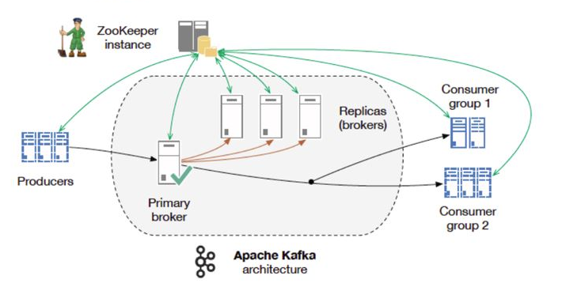
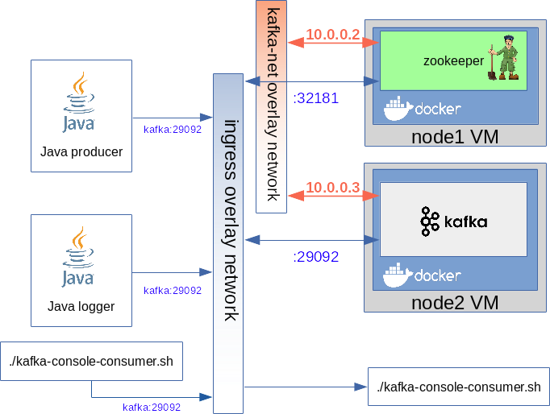
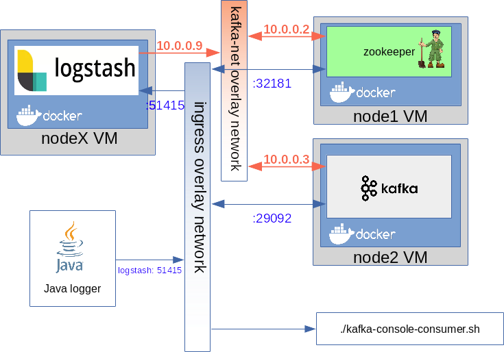

[<< Vissza](../index.md) | [ Switch to English](index-en.
md) | 

<hr>

 
<!--  -->


<!-- TOC -->

- [Kafka bemutatása](#kafka-bemutatása)
- [Környezet kialakítása](#környezet-kialakítása)
  - [Swarm stack létrehozása](#swarm-stack-létrehozása)
  - [Topic-ok kezelése](#topic-ok-kezelése)
- [Producer](#producer)
  - [Command line producer](#command-line-producer)
    - [Autentikáció nélkül](#autentikáció-nélkül)
    - [Kerberos autentikációval SSL felett](#kerberos-autentikációval-ssl-felett)
  - [Java producer](#java-producer)
    - [Pom.xml](#pomxml)
    - [Java kód](#java-kód)
  - [Logback producer](#logback-producer)
    - [Pom.xml](#pomxml-1)
    - [Logback.xml](#logbackxml)
    - [Java kód](#java-kód-1)
    - [Futtatás](#futtatás)
    - [Custom log object](#custom-log-object)
  - [Logstash producer with logback](#logstash-producer-with-logback)
    - [Logstash konfiguráció](#logstash-konfiguráció)
    - [Swarm stack](#swarm-stack)
    - [Pom.xml](#pomxml-2)
    - [logback.xml](#logbackxml-1)
    - [Java logger example](#java-logger-example)
    - [Tesztelés](#tesztelés)
- [Consumer](#consumer)
  - [Command line consumer](#command-line-consumer)
  - [Java consumer](#java-consumer)
  - [Spring-Kafa consumer](#spring-kafa-consumer)
  - [Alpakka-kafka](#alpakka-kafka)
  - [Logstash consumer](#logstash-consumer)
- [Adminisztrációs eszközök](#adminisztrációs-eszközök)

<!-- /TOC -->

<br>

# Kafka bemutatása


 
<!--  -->

Egy Kafka architektúra legalább egy Kafka szerverből (bróker) áll ami a konfigurációját kötelezően a Zookeeper nevű elosztott konfigurációs management rendszerben tárolja. A Kafka borker-hez csatlakoznak a termelők és fogyasztók. A Kafka cluster-ben úgynevezett topic-ok találhatók. A termelők mindig egy dedikált topik-ra írnak, és a fogyasztók mindig egy dedikált topic-ról olvasnak, tehát a topic az a logikai egység, ami egy termelő-fogyasztó páros számára az üzeneteket tárolja és továbbítja. 
Mikor elindítunk egy Kafa példányt, akkor valójában egy kafka brokert indítunk el. Ha producer-ek mindig egy brokerhez csatlakoznak. A teljes konfiguráció zookeeper-ben van tárolva. A zookeeper tudja értesíteni a klienseket ha a konfiguráció változik, ezért hamar elterjed a hálózaton a változás.

Egy topic úgynevezett partíciókra van osztva. Minden üzenet csak egy partícióba kerül be. 

 
<!--  -->

A producer-ek egy megadott topic-kra dobálják be az üzeneteket, amit onnan a consumer-ek kiolvasnak. Egy topic tetszőleges számú partícióból állhat. Egy partíció az a logikai egység, aminek rá kell férnie egy lemezre. A topic-kot úgy kell felskálázni, hogy egyre több partíciót adunk hozzá, amik különböző brokereken fognak létrejönni. Minden partíciónak lehet egy vagy több replikája, amik biztonsági másolatok. Mikor a producer beküld egy üzenetet egy partícióba, akkor fog committed üzenetnek minősülni, ha minden replikára is eljutott.

Azt, hogy egy producer melyik partícióba dobja az üzenetet vagy a kulcs határozza meg, vagy round-robin módon mindig egy másikba teszi. Ha van kulcs, akkor az abból készült hash fogja meghatározni, hogy melyik partícióba kerüljön. Ugyan az a kulcs így mindig ugyan abba a partícióba fog kerülni. De a kulcs nem kötelező. A sorrend tartás csak egy partíción belül garantált, de ott nagyon. Ha nagyon kritikus bizonyos üzenetek sorrendje, akkor azokat egy partícióba kell rakni azonos kulcsot használva. Loggolásnál ez nem kritikus, egyrészt mert a logstash sorba rakja az üzeneteket, másrészt mikor elastichsearch-be szúrjuk, ott a dátum lesz az egyik attribútum, ami alapján már sorba lehet majd újra rendezni a logokat. Az meg amúgy sem kritikus, ha a log egy része enyhe csúszással kerül be az adatbázisba, lényeg, hogy végül helyes lesz a sorrend.

A comsumer-eket úgynevezett consumer-group-okba szervezzük az azonosítójuk szerint. Egy csoport mindig ugyan azon topic üzeneteit olvassa, de minden egyes consumer a csoporotban más és más partícióból. Minden partíció csak egy consumer-hez rendelhető hozzá egy csoporton belül. De ha nincs annyi consumer a csoportban mind ahány partíció, akkor egy consumer több partíciót is fog olvasni (ahogy ez a fenti ábrán is látszik, az alsó consumer két partíciót olvas. Viszont ha több consumer van mint partíció egy csoportban, akkor bizonyos consumer-ek mindig idle állapotban lesznek. Minden csoporton belül van egy vezető consumer, általában az aki először csatlakozott. Ő teríti a többieknek a cluster információkat. 

A Kafka nem tudja értelmezni sem a kulcsot sem az üzenetet. Ez számára egy bájt tömb. Az, hogy egy objektumból hogy lesz bájt tömb kulcs és bájt tömb üzenet a producer-ben lévő serializátor dolga. A consumer-ben pedig a deserializázor dolga, hogy a bájt folyamból újra értelmes objektumot állítson elő.

Minden partíció új üzenete mindig a partíció végére íródik. A partíció elejétől számoljuk az üzenetek sorszámát, ezt hívjuk offset-nek. Mikor egy consumer kiolvas egy üzentet, attól az még ott marad a partícióba egészen addig, amíg len nem jár, alapértelmezetten ez egy nap. Tehát ez eltér a hagyományos sor kezeléstől. A Kafka nyilvántartja, hogy melyik consumer egy adott partícióban melyik offset-nél tartott. Ezt egy speciális topic-ban tartja nyilván: "__...". Ha újra is indul a világ, akkor is tudni fogják a consumer-ek hogy hol tartottak, és onnan folytatják.


A docker alapú claud világban egy tipikus architektúra a logok centralizált gyűjtésére, mikor egy logstash példány a producer és egy másik logstash példány a consumer. A konténer logokat a producer logstash kapja meg, aki a log sorok különböző paraméterei mentén a megfelelő Topic-ba tudja irányítani az üzeneteket. A consumer logstash pedig leszedi a Topic-rol az üzenetet és beírja Elasticsearch-be. 

 
<!--  -->


A Kafka világban nagyon széles a választéka a producer-eknek és consumer-eknek, akik képesek közvetlenül Kafka-ba írni és onnan olvasni. A Java világban a megfelelő Kafka lib-ek segítségével írhatunk Java producer-eket és consumer-eket amik olyan Java programok, amik közvetlenül írják ill. olvassák a Kafka topic-ot. A másik lehetőség a producer-re, hogy a logger keretrendszerünk Kafka kliens appender-jét használjuk, ami a rendszer logokat képes kapásból Kafka-ba írni. Ha letöltjük a Kafka programot, akkor abban található parancssori producer és consumer is, ami képes tesztelés céljából közvetlen beírni és kiolvasni egy topic-ból, ami nagyon hasznos a tesztelés során. 

 
<!--  -->


<br>


# Környezet kialakítása

Az Avro futtatásához szükséges környezet egy két node-os swarm cluster lesz. 
```
1. virsh list
 Id    Name                           State
----------------------------------------------------
 1     mg0                            running
 2     worker0                        running
```

```
2. docker node ls
ID                            HOSTNAME            STATUS              AVAILABILITY        MANAGER STATUS      ENGINE VERSION
maigxlyagj1fl4sgcf6rnn9pc *   mg0                 Ready               Active              Leader              18.05.0-ce
vox99u5s1g1su742mc6npm370     worker0             Ready               Active                                  18.05.0-ce
```


Itt fogunk futtatni egy docker stack-et ami tartalmaz majd egy kafka brókert és egy zookeeper példányt.

 
<!--  -->

A zookeeper és a Kafka broker a kafka-net overlay hálózaton keresztül fognak kommunikálni. Azonban mind a Kafka-t mind a zookeper-t ki kell ajánlani az ingress hálózaton keresztül a külvilágnak, hogy a külső termelők és fogyasztók elérjék őket. A termelők és fogyasztók bármelyik swarm node-on keresztül elérik a Kafa-t ill a zookeeper-t, erről az ingress hálózat gondoskodik. 

<br>


## Swarm stack létrehozása
A swarm stack-et az alábbi swarm yaml fájllal fogjuk létrehozni. Ebben definiálunk egy zookeeper service-t és egy kafka broker service-t külső volume felcsatolása nélkül, tehát minden konfigurációt környezeti változóként adunk meg. Mind a zookeeper mind a kafka image-nek az apache-os image helyett a confluent image-t fogjuk használni. A confluent továbbfejlesztett Kafka termékcsaládot árul, ami stabilabb és jóval több funkciót tartalmaz mint az eredeti Kafka (https://www.confluent.io)

 
<!--  -->


confluent_swarm.yaml
```json
version: '3.2'
services:
  zookeeper:
    image: confluentinc/cp-zookeeper:5.1.2
    networks:
      - kafka-net
    ports:
      - "32181:32181"
    deploy:
      placement:
        constraints:
         - node.role == worker
    environment:
      ZOOKEEPER_CLIENT_PORT: 32181
      ZOOKEEPER_TICK_TIME: 2000
      ZOOKEEPER_SYNC_LIMIT: 2
  kafka:
    image: confluentinc/cp-kafka:5.1.2
    networks:
      - kafka-net
    ports:
      - target: 29092
        published: 29092
        protocol: tcp
    deploy:
      placement:
        constraints:
         - node.role == worker
    environment:
      KAFKA_ZOOKEEPER_CONNECT: "zookeeper:32181"
      KAFKA_ADVERTISED_LISTENERS: "PLAINTEXT://kafka:29092"
      KAFKA_BROKER_ID: 2
      KAFKA_OFFSETS_TOPIC_REPLICATION_FACTOR: 1
```

A Kakfa környezeti váltók beállításánál:
- KAFKA_ADVERTISED_LISTENERS: "PLAINTEXT://kafka:29092" -> A broker a kafka:29092-n fog csatlakozást elfogadni nem titkosított csatornán (PLAINTEXT). Fontos lesz hogy a kliensek is kafka domain névvel keressék a broker-t. A kafka nevet bármelyik swarm node IP címével fel kell venni majd a klienseken a host fájlba. 
- KAFKA_OFFSETS_TOPIC_REPLICATION_FACTOR: 1 -> ...


Hozzuk létre a docker stack-et: 
```
3. docker stack deploy -c confluent_swarm.yaml confluent
```

Listázzuk ki a stack-ban létrejött service-eket és az overlay hálózatot: 
```
4. docker service ls
ID                  NAME                        MODE                REPLICAS            IMAGE                                   PORTS
7vjvop7tqiyc        confluent_kafka            replicated          1/1                 confluentinc/cp-kafka:5.1.2             *:29092->29092/tcp
oxxjtkcusj1f        confluent_zookeeper        replicated          1/1                 confluentinc/cp-zookeeper:5.1.2         *:32181->32181/tcp
```

És listázzuk ki az összes swarm hálózatot. Láthatjuk hogy létrejött a kfaka-net nevű overlay hálózat. 
```
5. docker network ls
NETWORK ID          NAME                   DRIVER              SCOPE
...
5albky0eu1to        confluent_kafka-net   overlay             swarm
olqkh5zlqiac        ingress                overlay             swarm
...
```

<br>


## Topic-ok kezelése

Az összes példa során a **test2-topic** nevű topic-ot fogjuk használni. A topic-ok kezeléséhez a Kafka csomagban a bin mappába találunk adminisztrációs scripteket. Töltsük le a Kafka-t vagy a kafak.apache.org-ról (https://kafka.apache.org/downloads) vagy a confluent oldaláról (https://www.confluent.io/download/), amiben jóval több script-et találunk mint az apache-os változatban. 
Új topic-ot a **kafka-topics** paranccsal készíthetünk. Paraméterként meg kell adni a zookeeper szerver elérhetőségét, mivel a Kafka a konfigurációt a zookeeper-ben tárolja, így az új topic-ot a zookeeper-be kell beírni. A zookeeper-t publikáltuk az ingress hálózatra, így bármelyik node IP címével és a publikált porttal (32181) elérhetjük a szervert. 

Kérjük le a worker0 node IP címét. Ezen keresztül fogjuk elérni a zookeeper-t: 
```
6. docker-machine ip worker0
192.168.42.113
```

És most hozzuk létre a **test2-topic** nevű topic-ot. 
```
$ ./kafka-topics --create --zookeeper 192.168.42.113:32181 --replication-factor 1 --partitions 1 --topic test2-topic
Created topic test2-topic.
```

A --list kapcsolóval listázhatjuk a Kafka cluster-ben elérhető topic-okat, amit a parancs szintén a zookeeper cluster-ből olvas ki. 
```
$ ./kafka-topics --list --zookeeper 192.168.42.113:32181 
__confluent.support.metrics
__consumer_offsets
_schemas
test-topic
test2-topic
```

<br>


# Producer


## Command line producer

### Autentikáció nélkül
A legegyszerűbben a **kafka-console-producer** script-el írhatunk egy Kafka topic-ba. Ez a parancs része a Kafka csomagnak, benne van mind az Apache mind a Confluent csomagban is. 
- https://kafka.apache.org/downloads
- https://www.confluent.io/download/

A **kafka-console-producer** parancsot a /bin mappában találjuk sok más hasznos Kafka management parancs között. A használatához meg kell adni a Kafka broker nevét és portját, és a topic nevét. A brokerhez azt a portot adjuk meg, ahogy az ingress hálózaton publikáltuk a Kafka service-t, a kafka domain nevet meg vegyük fel a host fájlba, és tegyük mögé a swarm cluster bármelyik node-jának az IP címét. (a swarm biztosítja, hogy bármelyik node-on keresztül el lehet érni bármelyik service-t)
Miután Enter-t nyomunk, a kafka-console-producer várni fogja sorba a topic-ra küldendő üzeneteket, minden Enter leütésre egy üzenetet küldhetünk el. 
```
7. ./kafka-console-producer \
>     --broker-list kafka:29092 \
>     --topic test2-topic
>this is the first message
```

Indítsunk el ugyan arra a topic-ra egy consumer-t hogy láthassuk hogy megjön e a üzenet. 
```
./kafka-console-consumer \
    --bootstrap-server kafka:29092 \
    --topic test2-topic \
    --from-beginning

this is the first message
```
Mivel a Kafka topic-ban addig marad meg egy üzenet amíg le nem ár, ezért ha a consumer-t úgy állítjuk be, hogy minden induláskor a topic elejéről olvasson (--from-beginning) ezért minden olyan üzenetet ki fog olvasni, amit valaha beírtak a topic-ba. 

<br>

<br>


### Kerberos autentikációval SSL felett

A Kerberos authentikácó alapja a Keytab fájl, ami egy bináris fájl, ebben található a kliens kulcsa és principálja. Ezen felül ha ha kafka borekerekhez SSL-el felett kell csatlakozni, akkor szükség van a brokerek certifikációjának a root CA-jára, amit be kell tenni egy trust-stor-ba. A Kerberos authentikáció használatához az alábbi fájlokra van szükség: 
- **java trustStore**: a brokerek Cert-je vagy a root CA
- **jaas config**: (Java Authentication and Authorization Service): Itt kell megadni, hogy Kerberos-t akarunk használni, ezen felül itt kell megadni a kerberos modult is. 
- **producer.properties**: Kafa producer beállítások: itt adjuk meg, hogy SSL felett menjen a Kerberos authentikáció. 
- **keytab**: egy bináris fájl, amiben a Kerberos kliens titkos kulcsa van. Ezt a Kerberos üzemeltetés adja. 
- **principal**: A Kerberos "felhasználó nevünk": ezt is a Kerberos üzemeltetés adja. 
- **krb5.conf**: Ez a kerberos kliens konfigurációs fájlja. Ebben van megadva a Kerberos autentikációs szerverek címe és portja. Ezt is az üzemeletetés adja. 
<br>


Első lépésként le kell menteni a kafak brókerek Root CA-ját, amit be fogunk tenni egy trust store-ba. 
```
$ openssl s_client -showcerts -verify 5 -connect kafka.broker01.berki.org:9092 < /dev/null | awk '/BEGIN/,/END/{ if(/BEGIN/){a++}; out="cert"a".pem"; print >out}' 
verify depth is 5
depth=2 C = HU, O = Berki, OU = Berki Corp, CN = Berki Root CA
verify return:1
depth=0 C = HU, ST = Budapest, L = Budapest, O = BERKICORP, OU = AMF, CN = kafka.broker01.berki.org
verify return:1
DONE
```
Ekkor a Root CA a cert1.pem fájlban van. Hozzunk létre egy java trust-store-t **trustStore** néven az 123456 jelszóval. Tegyük bele a root CA cert-et. 
<br>

<br>


Hozzuk létre a Java Autentikációs és Autokorrelációs rendszer konfigurációs fájlját, ahol kikényszerítjük a Kerberos használatát a Java autentikáció során: <br>

kafka_client_jaas.conf
```
KafkaClient {
com.sun.security.auth.module.Krb5LoginModule required 
debug=true 
useKeyTab=true 
storeKey=true 
serviceName="kafka" 
keyTab="/home/kafkaconf/test-client.keytab" 
principal="_test-client@CORP.BERKI.ORG";
};
```
Itt kell megadni a keytab fájl helyét, és a Kerberos principal-t, amire a keytab ki lett állítva. A keytab fájlt és a principal-t mindig a Kerberos üzemeltetője adja meg. A **Krb5LoginModule** modult be kell töltse a Java a Kerberos használatához. A **serviceName** paramétert megadhatjuk a producer.properties fájlban is. Ennek az értékét is a Kerberos üzemeltetéstől kell megkapjuk. 
> **WARNING:** Fontos, hogy a principal legyen az utolsó sorban, és hogy a sor végét ;-vel zárjuk le, akár csak az egész fájlt. 


<br>

<br>

A Kafka producer konfigurációs fájljában kell megadni a prototokolt. Ez lehet SASL_PLAINTEXT vagy SASL_SSL titkos csatorna estén. Ez a kafka brokerker fog vonatkozni. 
<br>

producer.properties:
```
security.protocol=SASL_SSL
```

<br>

<br>


A Kerberos kliens konfigurációs fájlt is készen kapjuk, ami a Kerberos szerverekről tartalmaz információkat. Fontos hogy az összes felsorolt szervert elérje a kliens a megadott portokon. 
krb5.conf
```
8. Configuration snippets may be placed in this directory as well
includedir /etc/krb5.conf.d/

[logging]
 default = FILE:/var/log/krb5libs.log
....
....
```


<br>

<br>

A producer indítása előtt a **KAFKA_OPTS** Java argumentumokban meg kell adni a jaas konfigurációt, a Kerberos kliens konfigurációt, a trust-store-t és az ahhoz tartozó jelszót. 
```
export KAFKA_OPTS="-Djava.security.auth.login.config=/home/kafaconf/kafka_client_jaas.conf \
                   -Djava.security.krb5.conf=/home/kafaconf/kafka/krb5.conf \
                   -Djavax.net.ssl.trustStore=/home/kafaconf/trustStore \
                   -Djavax.net.ssl.trustStorePassword=123456"
```
<br>

<br>


Végül indíthatjuk a producer-t, ami csak a **--producer.config** kapcsolóban különbözik az autentikáció nélküli producer-től. (meg persze a KAFA_OPTS-ban megadott paraméterekben)
```
./kafka-console-producer.sh \
     --broker-list kafka.broker01.berki.org:9092,kafka.broker02.berki.org:9092,kafka.broker03.berki.org:9092 \
     --topic test-topic \
     --producer.config /home/kafaconf/producer.properties \
this is the first message
```


<br>

<br>


## Java producer
A Java klienssel közvetlenül fogunk üzeneteket írni egy Kafka topic-ba. 


### Pom.xml
Ahogy azt már a swarm stack létrehozásánál láthattuk az apache Kafka helyett a confluent Kafka termékcsaládot fogjuk használni. A confluent Kafka kliens letöltéséhe hozzá kell adni a maven pom.xml-hez a confluent repository-t. Két dependenciára van szükségünk. A serializációs osztályok a **kafa** csomagban vannak, míg a producer a **kafka-clients** csomagban van. 
```xml
	<repositories>
		<repository>
			<id>confluent</id>
			<url>https://packages.confluent.io/maven/</url>
		</repository>
	</repositories>
...
	<dependencies>
                <dependency>
                         <groupId>org.apache.kafka</groupId>
                         <artifactId>kafka-clients</artifactId>
                          <version>2.1.1</version>
                </dependency>
		<dependency>
			<groupId>org.apache.kafka</groupId>
			<artifactId>kafka_2.11</artifactId>
			<version>2.1.1-cp1</version>
		</dependency>
	</dependencies>
```
<br>


### Java kód
```java
import org.apache.kafka.clients.producer.*;
import org.apache.kafka.common.serialization.LongSerializer;
import org.apache.kafka.common.serialization.StringSerializer;
import java.util.Properties;

public class KafkaProducerExample {
	
	private final static String TOPIC = "test2-topic";

	private static Producer<Long, String> createProducer() {
		Properties props = new Properties();
		props.put(ProducerConfig.BOOTSTRAP_SERVERS_CONFIG, "kafka:29092");
		props.put(ProducerConfig.CLIENT_ID_CONFIG, "KafkaProducer");
		props.put(ProducerConfig.KEY_SERIALIZER_CLASS_CONFIG, LongSerializer.class.getName());
		props.put(ProducerConfig.VALUE_SERIALIZER_CLASS_CONFIG, StringSerializer.class.getName());
		return new KafkaProducer<>(props);
	}

	static void runProducer() throws Exception {
		final Producer<Long, String> producer = createProducer();
		long key = System.currentTimeMillis();
		try {
			final ProducerRecord<Long, String> record = new ProducerRecord<>(TOPIC, key, "Hello World");
			RecordMetadata metadata = producer.send(record).get();

			System.out.printf("sent record(key=%s value=%s) " + "meta(partition=%d, offset=%d)", record.key(),
					record.value(), metadata.partition(), metadata.offset());

		} finally {
			producer.flush();
			producer.close();
		}
	}

	public static void main(String... args) throws Exception {
		runProducer();

	}
}
```

Az összes Kafka specifikus beállítást a Properties map-ben kell megadni. Ezek közül a legfontosabb a Kafka bróker címe. A kafka host nevet felvettük a host fájlba a worker0 node IP címével, de bármelyik swarm node IP címét választhatjuk. A port az a port, amit az ingress hálózaton publikáltunk a Kafka service-hez. 
```java
props.put(ProducerConfig.BOOTSTRAP_SERVERS_CONFIG, "kafka:29092");
```

Fontos megadni a kulcs és az üzenet Serializációs módját. Itt azt választottuk, hogy a kulcs egy Long lesz, míg az üzenet egy mezei string. 
```java
props.put(ProducerConfig.KEY_SERIALIZER_CLASS_CONFIG, LongSerializer.class.getName());
props.put(ProducerConfig.VALUE_SERIALIZER_CLASS_CONFIG, StringSerializer.class.getName());
Bármit is választunk a serializáláshoz, fontos hogy a consumer-ben is csak ezzel kompatibilis deszerializálót választhatunk. A serializáló metódusoknak széles a választéka, pl JSON-t is küldhetünk. 
```

<br>


## Logback producer


### Pom.xml

```xml
	<dependencies>
               ...

		<dependency>
			<groupId>com.github.danielwegener</groupId>
			<artifactId>logback-kafka-appender</artifactId>
			<version>0.2.0-RC1</version>
			<scope>runtime</scope>
		</dependency>
		<dependency>
			<groupId>org.apache.kafka</groupId>
			<artifactId>connect-json</artifactId>
			<version>2.1.1</version>
		</dependency>


		<dependency>
			<groupId>ch.qos.logback</groupId>
			<artifactId>logback-classic</artifactId>
			<version>1.2.3</version>
			<scope>runtime</scope>
		</dependency>

		<dependency>
			<groupId>org.slf4j</groupId>
			<artifactId>slf4j-api</artifactId>
			<version>1.7.25</version>
		</dependency>
                ....
	</dependencies>
```


### Logback.xml

A logback-ek Kafka topic-okba a **com.github.danielwegener.logback.kafka.KafkaAppender** osztállyal lehet írni ami egy szabványos Logback appender. 
Teljes leírás itt: https://github.com/danielwegener/logback-kafka-appender
<br>

logback.xml
```xml
<configuration>
    <shutdownHook class="ch.qos.logback.core.hook.DelayingShutdownHook"/>

    <appender name="kafkaAppender" class="com.github.danielwegener.logback.kafka.KafkaAppender">
       
       <encoder class="net.logstash.logback.encoder.LogstashEncoder">
           <customFields>{"application":"this is the extra field"}</customFields>
       </encoder>
        <topic>test2-topic</topic>
       
       <keyingStrategy class="com.github.danielwegener.logback.kafka.keying.HostNameKeyingStrategy" />       
       
        <deliveryStrategy class="com.github.danielwegener.logback.kafka.delivery.AsynchronousDeliveryStrategy" />
        <appendTimestamp>true</appendTimestamp> 
     
        <producerConfig>bootstrap.servers=kafka:9092</producerConfig>
    </appender>

    <root level="info">
       <appender-ref ref="kafkaAppender" />
    </root>
</configuration>
```


Nagyon fontos, hogy leállítsuk a logger context-et mielőtt a VM leáll, mert ha a VM leállítása nagyon közel van a log beíráshoz, akkor még azelőtt leáll az egész VM, hogy a logokat kiírtuk volna. Nagyon rövid életű programokban, mint amilyen a mi példa programunk, hamarabb leállhat a VM, mint hogy el tudta volna küldeni a logback a Kafka-nak az üzenetet. Ha még a VM leállítása előtt meghívjuk a sthudownHook-ot, akkor leállás előtt még ki fogja írni a logokat.
```xml
<shutdownHook class="ch.qos.logback.core.hook.DelayingShutdownHook"/>
```


A kulcs kezelési stratégiát a **keyingStrategy** paraméterben kell definiálni. A kulcsok kitöltése nem kötelező, de szintén hatással lehet a performanciára. Ha a kulcs minden üzenetben ugyan az, akkor az összes üzenet ugyanabba a partícióba fog kerülni, ami nem a legjobb, de cserébe sorrendtartó lesz. Több kulcskezelési stratégia közül választhatunk. A **NoKeyKeyingStrategy** hatására nem fog kulcsot generálni, így round robin módon fog mindig egy új partíciót választani. Ha a **HostNameKeyingStrategy** stratégiát választjuk, akkor a host név lesz a kulcs, tehát az azonos hostról érkező logsorok mindig ugyan abba a partícióba fognak kerülni. 
```xml
<keyingStrategy class="com.github.danielwegener.logback.kafka.keying.NoKeyKeyingStrategy" />
VAGY
<keyingStrategy class="com.github.danielwegener.logback.kafka.keying.HostNameKeyingStrategy" />
```


A Kafka brókerek listáját a **bootstrap.servers** producerConfig paraméterben kell megadni. Nagyon fontos, hogy ugyan azzal a host névvel tegyük ezt ide, mint ahogy a swarm-ban létrehoztuk, és az itt megadott nevet fel kell venni a hosts-ba. A producerConfig-ok teljes listája itt olvasható: ttps://kafka.apache.org/documentation.html#producerconfigs
```xml
<producerConfig>bootstrap.servers=kafka:9092</producerConfig>
```

A **customFields** paraméterben tetszőleges log paramétereket adhatunk a Kafka üzenethez. 
```xml
<customFields>{"application":"this is the extra field"}</customFields>
```

<br>


### Java kód

```java
import org.slf4j.Logger;
import org.slf4j.LoggerFactory;

public class LogbackExample {

    private static final Logger logger = LoggerFactory.getLogger(LogbackExample.class.getSimpleName());

    public static void main(String... args) throws InterruptedException {
        logger.info("this is the message:");
    }
}
```


### Futtatás
Indítsuk el a kafka-console-consumer -t a test2-topic-ra, hogy lássuk, hogy a logback milyen üzeneteket tesz be: 
```
./kafka-console-consumer \
    --bootstrap-server kafka:29092 \
    --topic test2-topic \
    --from-beginning
```

Futtassuk le a LogbackExample java programot, ekkor a consumer ki fogja írni a logback által beküldött üzenetet: 
```
{"@timestamp":"2019-04-21T12:44:32.430+02:00","@version":"1","message":"this is the message:","logger_name":"LogbackExample","thread_name":"main","level":"INFO","level_value":20000,"HOSTNAME":"adamDell2","application":"this is the extra field"}
```
Látható, hogy bekerült az üzenetbe a timestamp is és az extra mező is, amit a logback appender-ben adtunk hozzá. 
<br>


<br>


### Custom log object
Ahogy a logback hagyományos használata mellett, itt is lehetőség van egyedi üzenet objektumok használatára. 

1. Az egyik lehetőség az MDC - Mapped Diagnostic Context (https://logback.qos.ch/manual/mdc.html) használata, amivel egyedi mezőket adhatunk hozzá a log-hoz, ami a kafka üzenetben is meg fog jelenni: 
```java
import org.slf4j.MDC;
...
MDC.put("transactionId", "1111");
logger.info("this is the message:");
```
        
A fenit üzenet a kafka consumer-ben így fog megjelenni: 
```
{"@timestamp":"2019-04-21T16:20:34.620+02:00","@version":"1","message":"this is the message:","logger_name":"LogbackExample","thread_name":"main","level":"INFO","level_value":20000,"HOSTNAME":"adamDell2","transactionId":"1111","application":"this is the extra field"}
```

<br>

<br>

2. A másik lehetőség a **net.logstash.logback.marker.Markers** használata, amivel tetszőleges java POJO-kat írhatunk be JSON formátumban a logba. A példában az alábbi **LogMessage** java objektumot fogjuk használni. 
```java
public class LogMessage {

    private String feild1;
    private String field2;

    public LogMessage(String feild1, String field2) {
        this.feild1 = feild1;
        this.field2 = field2;
    }

    public String getFeild1() {
        return feild1;
    }
    public String getField2() {
        return field2;
    }
    public void setFeild1(String feild1) {
        this.feild1 = feild1;
    }
    public void setField2(String field2) {
        this.field2 = field2;
    }
}
```
A java osztályban az import-ok közé felvesszüka Markers.append-t. 
```java
import org.slf4j.Logger;
import org.slf4j.LoggerFactory;

import static net.logstash.logback.marker.Markers.append;

public class LogbackExample {

    private static final Logger logger = LoggerFactory.getLogger(LogbackExample.class.getSimpleName());

    public static void main(String... args) throws InterruptedException {

        LogMessage message = new LogMessage("first", "second");
        logger.info(append("customFieldName", message), "this is the message");
    }
}
```
A consume-ben az üzenet az alábbi lesz: 
```
{"@timestamp":"2019-04-21T16:20:35.140+02:00","@version":"1","message":"this is the message","logger_name":"LogbackExample","thread_name":"main","level":"INFO","level_value":20000,"HOSTNAME":"adamDell2","transactionId":"1111","customFieldName":{"feild1":"first","field2":"second"},"application":"this is the extra field"}
```

<br>


## Logstash producer with logback 

A logstash-t rakhatjuk a kafka elé és a kafka után is. Első lépésként a kafka elé fogjuk tenni, ami szortírozni fogja a logokat különböző topic-okba. A logstash-be a logback-el fogjuk beírni az üzeneteket egy speciális logstash appender-t használva. 

A korábban ismertetett docker stack-et ki fogjuk bővíteni egy logstash service-el. 

 
<!--  -->


Mind a három komponenst rá fogjuk kötni az ingress hálózatra is, mivel a Java producer-nek el kell érnie a logstash-t, és a consumer-nek pedig a kafa-t. 

A loggolásra logback-et fogunk használni, aki a logstash 51415-ös portjára fogja küldeni TCP socket-en. Az üzeneteket a **kafka-console-consumer**-el fogjuk kiolvasni. 


### Logstash konfiguráció

A lostash a TCP socket-en keresztül várja majd a logback-től a logokat. A logberben Marker-eket fogunk használni, amik a [tags] tömbbe fog tenni a logstash. A logstash a Kafka output plugin segítségével fogja beírni a megfelelő topic-ba az üzeneteket. 


 
<!--  -->


Az alap logstash image már tartalmazz mind a Kafka input és output plugin-t is, így kapásból tudunk a logstash-el Kafka-ból írni és olvasni. Listázzuk ki a logstash plugin-eket a **bin/logstash-plugin list** paranccsal. Láthatjuk hogy a kafka mind az input mind az output-ban ott van. 
```
9. docker run -it docker.elastic.co/logstash/logstash:6.6.2 bin/logstash-plugin list
...
logstash-input-kafka
...
logstash-output-kafka
```


/usr/share/logstash/pipeline/**logstash.conf**
```xml
input {
  tcp { 
    port => 51415
    codec => "json"
  }
}

output {

  if "T1" in [tags] {

    kafka {
      codec => json
      bootstrap_servers => "kafka:29092"
      topic_id => "T1-topic"
    }
    
  } else if "T2" in [tags] {

    kafka {
      codec => json
      bootstrap_servers => "kafka:29092"
      topic_id => "T2-topic"
    }
    
  } else {

    kafka {
      codec => json
      bootstrap_servers => "kafka:29092"
      topic_id => "msg-topic"
    }

  }

  stdout {
    codec => rubydebug
  }
}
```


### Swarm stack

Fontos, hogy a logstash-ből a 6.6-os szériát használjuk, mert a korábbi verziókban van egy kafak specifikus hiba. A logstash konfigurációt volume driver-er fogjuk felcsatolni host gépről. (A volume dirver-ekről részletek itt: https://wiki.berki.org/index.php/Docker_volume_orchestration)

```json
version: '3.2'
services:
  zookeeper:
    image: confluentinc/cp-zookeeper:5.1.2
    networks:
      - kafka-net
    ports:
      - "32181:32181"
    deploy:
      placement:
        constraints:
         - node.role == worker
    environment:
      ZOOKEEPER_CLIENT_PORT: 32181
      ZOOKEEPER_TICK_TIME: 2000
      ZOOKEEPER_SYNC_LIMIT: 2
  kafka:
    image: confluentinc/cp-kafka:5.1.2
    networks:
      - kafka-net
    ports:
      - target: 29092
        published: 29092
        protocol: tcp
    deploy:
      placement:
        constraints:
         - node.role == worker
    environment:
      KAFKA_ZOOKEEPER_CONNECT: "zookeeper:32181"
      KAFKA_ADVERTISED_LISTENERS: "PLAINTEXT://kafka:29092"
      KAFKA_BROKER_ID: 2
      KAFKA_OFFSETS_TOPIC_REPLICATION_FACTOR: 1
  logstash:
    image: docker.elastic.co/logstash/logstash:6.6.2
    networks:
      - kafka-net
    ports:
      - "51415:51415"
    environment:
      LOGSPOUT: "ignore"
      XPACK_MONITORING_ENABLED: "false"
    volumes:
      - "logstash-conf:/usr/share/logstash/pipeline"
    deploy:   
      placement:
        constraints:
         - node.role == worker
      restart_policy:
        condition: on-failure
      resources:
        reservations:
          memory: 100m   
networks:
  kafka-net:
    driver: overlay
volumes:
  logstash-conf:
    driver: nfs
    driver_opts:
      share: 192.168.42.1:/home/adam/dockerStore/logstash/config/
```


Topic-ok legyártása: 
```
10. ./kafka-topics.sh --create --zookeeper 192.168.42.113:32181 --replication-factor 1 --partitions 1 --topic T1-topic
Created topic "T1-topic".

11. ./kafka-topics.sh --create --zookeeper 192.168.42.113:32181 --replication-factor 1 --partitions 1 --topic T2-topic
Created topic "T2-topic".

12. ./kafka-topics.sh --create --zookeeper 192.168.42.113:32181 --replication-factor 1 --partitions 1 --topic msg-topic
Created topic "msg-topic".


13. ./kafka-topics.sh --list --zookeeper 192.168.42.113:32181 
__confluent.support.metrics
__consumer_offsets
T1-topic
msg-topic
T2-topic
```


### Pom.xml

A logback a logstash-be a **logstash-logback-encoder** -el fog írni. Ehhez szükség van egy új függőségre: 
```xml
        <dependency>
			<groupId>ch.qos.logback</groupId>
			<artifactId>logback-classic</artifactId>
			<version>1.2.3</version>
			<scope>runtime</scope>
		</dependency>

		<dependency>
			<groupId>org.slf4j</groupId>
			<artifactId>slf4j-api</artifactId>
			<version>1.7.25</version>
		</dependency>

		<dependency>
			<groupId>net.logstash.logback</groupId>
			<artifactId>logstash-logback-encoder</artifactId>
			<version>5.3</version>
		</dependency>
```


### logback.xml

A logstash a **LogstashTcpSocketAppender** appender-en keresztül fogja elküldeni a logokat a logstash-benek. IP címnek a stack bármelyik node IP címét megadhatjuk. Mi a worker0 címét használjuk. Nagyon fontos, hogy megadjuk a shutdownHook-ot, ami biztosítja, hogy a JVM leállása előtt még a logback elküldje az összes függőben lévő logot. Ha előbb leáll a JVM mint hogy a logstash el tudta volna küldeni a logokat, akkor azok már nem lesznek kiküldve. 

```xml
<configuration>
        <shutdownHook class="ch.qos.logback.core.hook.DelayingShutdownHook"/>
    
	<appender name="STDOUT"
		class="ch.qos.logback.core.ConsoleAppender">
		<encoder>
			<pattern>%d{HH:mm:ss.SSS} [%thread] %-5level %logger{36} - %msg%n
			</pattern>
		</encoder>
	</appender>

	<appender name="stash"
		class="net.logstash.logback.appender.LogstashTcpSocketAppender">
		<destination>192.168.42.113:51415</destination>

		<!-- encoder is required -->
		<encoder class="net.logstash.logback.encoder.LogstashEncoder">
			<customFields>{"appname":"adam"}</customFields>
		</encoder>
	</appender>

	<root level="debug">
        <appender-ref ref="stash" />
        <appender-ref ref="STDOUT" />
		
	</root>
</configuration>
```


### Java logger example
```java
import org.slf4j.Logger;
import org.slf4j.LoggerFactory;
import org.slf4j.Marker;
import org.slf4j.MarkerFactory;
public class App 
{	
    private static final Logger logger = LoggerFactory.getLogger(App.class);
	
    public static void main( String[] args )
    {    	

        Marker taMarker = MarkerFactory.getMarker("T1");
        Marker alMarker = MarkerFactory.getMarker("T2");
    	
    	logger.info(taMarker, "Message to T1 from: {}", "adam");    	
    	logger.info(alMarker, "Message to T2 from: {}", "adam");

    }
}
```


### Tesztelés
Mivel a logstash config-ba beletettük az **stdout** output-ot is, ezért a log-ba is be fog írni minden üzenetet: 
```
confluence_logstash.1.4a9rr1w42iud@worker0    | {
confluence_logstash.1.4a9rr1w42iud@worker0    |     "level_value" => 20000,
confluence_logstash.1.4a9rr1w42iud@worker0    |     "logger_name" => "kafka.example2.App",
confluence_logstash.1.4a9rr1w42iud@worker0    |         "appname" => "adam",
confluence_logstash.1.4a9rr1w42iud@worker0    |            "port" => 41024,
confluence_logstash.1.4a9rr1w42iud@worker0    |           "level" => "INFO",
confluence_logstash.1.4a9rr1w42iud@worker0    |        "@version" => "1",
confluence_logstash.1.4a9rr1w42iud@worker0    |            "host" => "10.255.0.3",
confluence_logstash.1.4a9rr1w42iud@worker0    |         "message" => "Message to T1 from: adam",
confluence_logstash.1.4a9rr1w42iud@worker0    |     "thread_name" => "main",
confluence_logstash.1.4a9rr1w42iud@worker0    |      "@timestamp" => 2019-03-26T22:52:19.168Z,
confluence_logstash.1.4a9rr1w42iud@worker0    |            "tags" => [
confluence_logstash.1.4a9rr1w42iud@worker0    |         [0] "TA"
confluence_logstash.1.4a9rr1w42iud@worker0    |     ]
confluence_logstash.1.4a9rr1w42iud@worker0    | }
confluence_logstash.1.4a9rr1w42iud@worker0    | {
confluence_logstash.1.4a9rr1w42iud@worker0    |     "level_value" => 20000,
confluence_logstash.1.4a9rr1w42iud@worker0    |     "logger_name" => "kafka.example2.App",
confluence_logstash.1.4a9rr1w42iud@worker0    |         "appname" => "adam",
confluence_logstash.1.4a9rr1w42iud@worker0    |            "port" => 41024,
confluence_logstash.1.4a9rr1w42iud@worker0    |           "level" => "INFO",
confluence_logstash.1.4a9rr1w42iud@worker0    |        "@version" => "1",
confluence_logstash.1.4a9rr1w42iud@worker0    |            "host" => "10.255.0.3",
confluence_logstash.1.4a9rr1w42iud@worker0    |         "message" => "Message to T2 from: adam",
confluence_logstash.1.4a9rr1w42iud@worker0    |     "thread_name" => "main",
confluence_logstash.1.4a9rr1w42iud@worker0    |      "@timestamp" => 2019-03-26T22:52:19.176Z,
confluence_logstash.1.4a9rr1w42iud@worker0    |            "tags" => [
confluence_logstash.1.4a9rr1w42iud@worker0    |         [0] "AL"
confluence_logstash.1.4a9rr1w42iud@worker0    |     ]
confluence_logstash.1.4a9rr1w42iud@worker0    | }
```


Indítsunk el egy egy **kafka-console-consumer.sh**-t mind a T1 mind a T2 topic-kra. 

```
./kafka-console-consumer.sh --bootstrap-server 192.168.42.113:29092 --topic T1-topic --from-beginning

{"level_value":20000,"logger_name":"kafka.example2.App","appname":"adam","port":41024,"level":"INFO","@version":"1","host":"10.255.0.3","message":"Message to T1 from: adam","thread_name":"main","@timestamp":"2019-03-26T22:52:19.168Z","tags":["T1"]}
```


```
./kafka-console-consumer.sh --bootstrap-server 192.168.42.113:29092 --topic T2-topic --from-beginning

{"level_value":20000,"logger_name":"kafka.example2.App","appname":"adam","port":41024,"level":"INFO","@version":"1","host":"10.255.0.3","message":"Message to T2 from: adam","thread_name":"main","@timestamp":"2019-03-26T22:52:19.176Z","tags":["T2"]}
```

<br>


# Consumer


## Command line consumer
A legegyszerűbben a **kafka-console-consumer**-el olvashatunk egy topic-ot, ez is része a standard Apache Kafka és a Confluent csomagnak is. Akárcsak a kafka-console-producer, ez is a bin mappában találathó és szintén a Kafka brokert és a topic nevét kell megadni. 
```
./kafka-console-consumer \
    --bootstrap-server kafka:29092 \
    --topic test2-topic \
    --from-beginning
```

Ha elindítottuk a **kafka-console-consumer**-t, akkor a Kafka service logjában láthatjuk, hogy a console consumer regisztrálta magát és ő lett a csoport vezetője. Minden consumer csoportnak van egy vezetője, akin keresztül a többi consumer a csoportban megkapja a konfigurációs változásokat. 
```
14. docker service logs -f confluent_kafka
...
INFO [GroupCoordinator 2]: Assignment received from leader for group console-consumer-73627 for generation 1 (kafka.coordinator.group.GroupCoordinator)
```

A **kafka-console-consumer** mi fog loggolni minden egyes új üzenetet a topic-ról. 
```
{"@timestamp":"2019-04-21T12:44:32.896+02:00","@version":"1","message":"LogMessage@49d904ec","logger_name":"LogbackExample","thread_name":"main","level":"INFO","level_value":20000,"HOSTNAME":"adamDell2","transactionId":"444","metric":{"feild1":"first","field2":"second"},"application":"this is the extra field"}
```
<br>


## Java consumer
A Java consumer-nek ugyan azokra a maven függőségekre van szüksége mint a producer-nek, ezrét ezeket itt nem ismételjük meg.
```java
import org.apache.kafka.clients.consumer.*;
import org.apache.kafka.clients.consumer.Consumer;
import org.apache.kafka.common.serialization.LongDeserializer;
import org.apache.kafka.common.serialization.LongSerializer;
import org.apache.kafka.common.serialization.StringDeserializer;

import java.time.Duration;
import java.util.Collections;
import java.util.Properties;

public class KafkaConsumerExample {
	private final static String TOPIC = "test2-topic";

	private static Consumer<String, String> createConsumer() {
		final Properties props = new Properties();
		
		props.put(ConsumerConfig.BOOTSTRAP_SERVERS_CONFIG, "kafka:29092");
		props.put(ConsumerConfig.GROUP_ID_CONFIG, "KafkaExampleConsumer");
		props.put(ConsumerConfig.KEY_DESERIALIZER_CLASS_CONFIG, LongDeserializer.class.getName());
		props.put(ConsumerConfig.VALUE_DESERIALIZER_CLASS_CONFIG, StringDeserializer.class.getName());

		final Consumer<String, String> consumer = new KafkaConsumer<>(props);

		consumer.subscribe(Collections.singletonList(TOPIC));
		return consumer;
	}

	static void runConsumer() throws InterruptedException {
		final Consumer<String, String> consumer = createConsumer();
		final int giveUp = 100;
		int noRecordsCount = 0;
		while (true) {
			final ConsumerRecords<String, String> consumerRecords = consumer.poll(Duration.ofSeconds(1));
			if (consumerRecords.count() == 0) {
				noRecordsCount++;
				if (noRecordsCount > giveUp)
					break;
				else
					continue;
			}
			consumerRecords.forEach(record -> {
				try {
				        System.out.printf("Consumer Record:(key: %s value: %s, partition: %d, offset: %d)\n",record.key(), record.value(),
						record.partition(), record.offset());
				} catch (Exception e) {
					e.printStackTrace();
				}
			});
			consumer.commitAsync();
		}
		consumer.close();
		System.out.println("DONE");
	}

	  public static void main(String... args) throws Exception {
	      runConsumer();
	  }
}
```

A Kafka specifikus beállításokat szintén a Properties map-ben kell megadni, és megegyeznek a producer-nél bemutatott paraméterekkel. 
```java
props.put(ConsumerConfig.BOOTSTRAP_SERVERS_CONFIG, "kafka:29092");
props.put(ConsumerConfig.GROUP_ID_CONFIG, "KafkaExampleConsumer");
props.put(ConsumerConfig.KEY_DESERIALIZER_CLASS_CONFIG, LongDeserializer.class.getName());
props.put(ConsumerConfig.VALUE_DESERIALIZER_CLASS_CONFIG, StringDeserializer.class.getName());
```

Fontos, hogy csak olyan deszerializátort használjunk, ami kompatibilis az üzenet fajtájával, vagyis olyat, ami kompatibilis a producer-nél használt serializátórral. Pl. egy JsonSerializer-el írt üzenetet ki lehet olvasni egy StringDeerializer-el is. 
```java
props.put(ConsumerConfig.VALUE_DESERIALIZER_CLASS_CONFIG, StringDeserializer.class.getName());
VAGY
props.put(ConsumerConfig.KEY_DESERIALIZER_CLASS_CONFIG, "org.apache.kafka.common.serialization.ByteArrayDeserializer");
VAGY
props.put(ConsumerConfig.VALUE_DESERIALIZER_CLASS_CONFIG, "org.apache.kafka.connect.json.JsonDeserializer");
```

<br>


## Spring-Kafa consumer

https://www.baeldung.com/spring-kafka


## Alpakka-kafka

https://doc.akka.io/docs/alpakka-kafka/current/home.html


## Logstash consumer
https://www.elastic.co/guide/en/logstash/6.7/plugins-inputs-kafka.html
Ahogy azt már láthattuk, a logstash lehet Kafka producer és consumer szerepben is, mind a Kafka input és output plugin-t is tartalmazza az alap logstash image. 


 
<!--  -->


Ugyan azt a docker stack-et fogjuk használni, amit a logstash producer-nél használtunk, csak a konfigurációt fogjuk módosítani, hogy a kafa az input ne az output plugin-ben legyen: https://wiki.berki.org/index.php/Apache_Kafka#Logstash_producer_with_logback

Mivel a logstash most Kafka consumer szerepben lesz, ezért most a Kafka input plugin-t fogjuk használni. A logstash konfigurációt docker volume-al fogjuk felcsatolni a service-t futtató konténerbe. A logstash a belső, kafka-net overlay hálózaton keresztül közvetlen el fogja érni a Kafka brókert, ezért a konfigurációban a Kafka service nevét kell megadni, amit a swarm fel fog oldani a service-ben lévő konténerek IP címére. 

/usr/share/logstash/pipeline/logstash.conf
```
input {
    kafka {

        decorate_events => true
        value_deserializer_class => "org.apache.kafka.common.serialization.StringDeserializer"

        topics => ["test2-topic"]

        bootstrap_servers => "kafka:29092" 
        group_id => "AvroConsumerGroupId"
        client_id => "AvroConsumerClientId"        

    }
}

output {

  stdout {
    codec => rubydebug
  }
}
```


Ha a logstash elindult, akkor a swarm service logjában láthatjuk, hogy rákapcsolód a test2-topic-ra. 
```
15. docker service logs -f confluent_logstash 
...
[Consumer clientId=AvroConsumerClientId-0, groupId=AvroConsumerGroupId] Resetting offset for partition test2-topic-0 to offset 0.
```

Írjunk be egy üzenetet a test2-topic-ba a **kafka-console-producer**-el. 
```
$ ./kafka-console-producer \
>     --broker-list kafka:29092 \
>     --topic test2-topic
>this is the test message 
```

Ekkor a logstash logjában meg fog jelenni a beírt üzenet message paraméterben. A logstash kiegészíti két meta paraméterrel az üzenetet (timestamp és version). 
```
confluent_logstash.1.3qsuyylnulxa@worker0    | {
confluent_logstash.1.3qsuyylnulxa@worker0    |     "@timestamp" => 2019-04-21T17:55:08.694Z,
confluent_logstash.1.3qsuyylnulxa@worker0    |        "message" => "this is the test message",
confluent_logstash.1.3qsuyylnulxa@worker0    |       "@version" => "1"
confluent_logstash.1.3qsuyylnulxa@worker0    | }
```


# Adminisztrációs eszközök

- nodefluent/kafka-rest
- nodefluent/kafka-rest-ui
- sheepkiller/kafka-manager
- tobilg/zookeeper-webui
