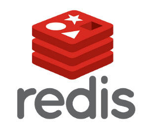
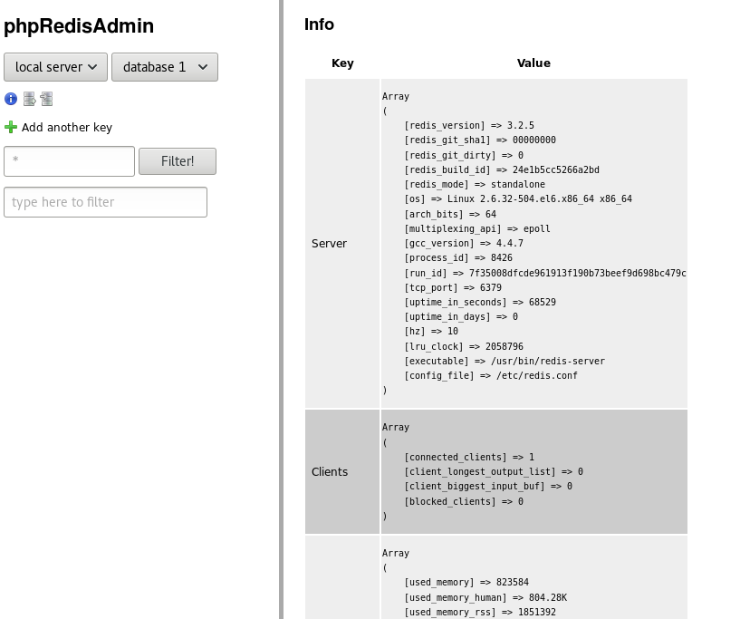

[<< Vissza](../index.md) | [ Switch to English](index-en.md)

<hr>

 
<!--  -->

<br>

<!-- TOC -->

- [Bemutatás](#bemutat%C3%A1s)
- [Telepítés](#telep%C3%ADt%C3%A9s)
- [Konfiguráció](#konfigur%C3%A1ci%C3%B3)
        - [Hálózati beállítások](#h%C3%A1l%C3%B3zati-be%C3%A1ll%C3%ADt%C3%A1sok)
        - [Memória használat](#mem%C3%B3ria-haszn%C3%A1lat)
        - [Adatbázis  mentése](#adatb%C3%A1zis--ment%C3%A9se)
        - [Adatbázisok száma](#adatb%C3%A1zisok-sz%C3%A1ma)
        - [Indítás](#ind%C3%ADt%C3%A1s)
- [Redis monitorozása és failover](#redis-monitoroz%C3%A1sa-%C3%A9s-failover)
- [Webes admin felület phpRedisAdmin](#webes-admin-fel%C3%BClet-phpredisadmin)
        - [SELinux](#selinux)
- [Backup és resotre](#backup-%C3%A9s-resotre)
- [Kliensek](#kliensek)
    - [PHP kliens](#php-kliens)
    - [Java kliens](#java-kliens)

<!-- /TOC -->

<br>

# Bemutatás
**Redis 3.2.5** - a legújabb stabil verzió a cikk írásakor

A Radius egy memória alapú adatstruktúra adatbázis. Nagyon sokféle struktúrát támogat, nem csak string-eket. (Set, Map, Hash, List). Az elosztott működést is támogatja, és képes lemezre menteni a memória cache tartalmat.

Ezt írják  magukról: <br>

"Redis is an open source (BSD licensed), in-memory data structure store, used as database, cache and message broker. It supports data structures such as strings, hashes, lists, sets, sorted sets with range queries, bitmaps, hyperloglogs and geospatial indexes with radius queries. Redis has built-in replication, Lua scripting, LRU eviction, transactions and different levels of on-disk persistence, and provides high availability via Redis Sentinel and automatic partitioning with Redis Cluster."


# Telepítés
A redis az EPEL repozitoriban van benne, ezt hozzá kell adjuk a YUM-hoz ha még nem lenne benne: 
```
1. wget http://download.fedoraproject.org/pub/epel/6/x86_64/epel-release-6-8.noarch.rpm
2. rpm -ivh epel-release-6-8.noarch.rpm
```


Majd telepítsük föl a redis-t. 
```
3. yum install redis
```


Létrejött fájlok: 
- /etc/redis.conf: A redis központi konfigurációs fájlja, mi is ebben fogjuk a szükséges konfigurációt elvégezni. 
- /etc/redis-sentinel.conf: A redis központi monitorozó eszköze. Figyeli az esetlegesen fellépő hibákat, és megpróbál automatikusan beavatkozni. 
- /var/log/redis: Log fájl helye
- /etc/logrotate.d/redis: A logrotate-thez is hozzáadta a telepítő a szükséges konfigurációt. 
- /var/lib/redis: Ide fogja kiírni a redis a memóriában összegyűlt adatbázist a konfigurációban meghatározott gyakorisággal.


# Konfiguráció


### Hálózati beállítások
Amennyiben lehetséges, a **NETWORK** állítsuk be, hogy a redis csak a lokális hálózaton hallgatózzon és csak egy porton biztonsági megfontolásból. 
<br>
/etc/redis.conf
```
bind 127.0.0.1
port 6379
```


### Memória használat
Mivel cache-ként szeretnénk használni a redis-t, és nem adatbázisként, maximálni fogjuk, hogy mennyi memóriát használhat el a rendszermemóriából, mivel nem történik tragédia, ha egy új cache bejegyzés már nem fér bele a memóriába. 

http://redis.io/topics/lru-cache

A **LIMITS** szekcióban állítsuk be, hogy mennyi memóriát használhat maximálisan a redis, és hogy mit tegyen, milyen policy-t alkalmazzon, ha már nincs szabad hely. 6 féle memória kezelési stratégia közül választhatunk. Mi a **allkeys-lru** stratégiát fogjuk használni, ami egy algoritmus alapján megkeresi a legkevésbé használt kulcsokat, és azokat kitörli. A többi stratégiával ellentétben ez mindig kitöröl egy kulcsot, ha a memória már megtelt és új INSERT kérés érkezik. 
<br>
/etc/redis.conf
```
maxmemory 5GB
maxmemory-policy allkeys-lru
```


### Adatbázis  mentése

A memóriában lévő adatbázis mentésével kapcsolatos beállítások a SNAPSHOTTING szekcióban vannak a redis.conf fájlban. A save paraméterrel adhatjuk meg hogy hány másodperc és hány módosítás elteltével írja ki lemezre a memória cache tartalmát a redis: 
```
save 900 1
save 300 10
save 60 10000
```
Mind két paraméternek teljesülnie kell, tehát az első esetben 900 másodperc és legalább 1 módosítás után  lementi a cache-t lemezre. 

Az adatbázis fájl neve és helye: 
```
dbfilename dump.rdb
dir /var/lib/redis/
```

Próbáljuk  ki. Adjuk ki a redis-cli parancssori eszköznek a save parancsot, ekkor ki kell hogy írja a memória tartalmát a lemezre: 
```
4. redis-cli save
OK
```

Láthatjuk, hogy a /var/lib/redis/ mappában a dump.rdb dátuma frissült:
```
5. ll /var/lib/redis
-rw-r--r--. 1 redis redis 4894 Nov  6 18:24 dump.rdb
```


### Adatbázisok száma
Az alap konfiguráció 16 adatbázist hoz létre, a kliensek 0-tól 15-ig hivatkozhatnak számmal ezekre az adatbázisokra. A 0. adatbázis az alapértelmezett. 
```
databases 16
```

Majd a webes admin GUI-ban látni fogjuk, hogy 16 adatbázis közül választhatunk.


### Indítás
```
6. service redis start
7. chkconfig redis on
```


# Redis monitorozása és failover
A redis szerverek monitorozására a **redis-sentinel** program szolgál, ami feltelepült a redis yum installációjával együtt. 

http://redis.io/topics/sentinel

Valójában nagy, klászteres környezetben van értelme a sentinel használatának. 

A /etc/redis-sentinel.conf fájlban található alap beállítások megfelelőek. A localhost-on a 6379-es porton fog csatlakozni a redesi szerverhez. 
```
sentinel monitor mymaster 127.0.0.1 6379 2
```

Indítsuk el:
```
8. service redis-sentinel start
Starting redis-sentinel:                                   [  OK  ]

9. chkconfig redis-sentinel on
```


# Webes admin felület (phpRedisAdmin)

Nagyon sok féle Redis grafikus admin eszköz létezik, ezek között vannak desktop alkalmazások és különféle webes eszközök. Mi egy nagyon egyszerű, és elterjedt webes GUI-t fogunk használni a **phpRedisAdmin**-t. 

A phpRedisAdmin-t git-böl lehet letölteni két lépésben. Lépjünk bele abba appache által látott mappába, ahova a phpRedisAdmin-t telepíteni szeretnénk, majd az alábbi két git repót kell klónozzuk:
```
10. cd /var/www/virtual/admin
11. git clone https://github.com/ErikDubbelboer/phpRedisAdmin.git
12. cd phpRedisAdmin
13. git clone https://github.com/nrk/predis.git vendor
```

Nevezzük át a sample konfigurációs fájlt: 
```
14. cp includes/config.sample.inc.php includes/config.inc.php
```


 
<!--  -->


### SELinux

A httpd az alap rendszabás szerint nem olvashatja a 6379 portot. Ezért megváltoztatjuk a port típusát. Erre amúgy is szükség lenne, ha php klienssel akarnánk a Redis-hez kapcsolódni. 
```
15. semanage port -a -t http_port_t -p tcp 6379
```


# Backup és resotre


# Kliensek


## PHP kliens
A php klienst YUM-al tudjuk feltelepíteni. 

```
16. yum install php-pecl-redis
```

Ekkor a /etc/php.d/ mappába létrejön a 50-redis.ini fájl, ami include-álja a redis.so:
```
extension = redis.so
```


## Java kliens
