[<< Vissza](../index.md) | [ Switch to English](index-en.md) 

<hr>
<br>

<!-- TOC -->

- [Mi az a Selenium 3](#mi-az-a-selenium-3)
- [WebDriver](#webdriver)
    - [Driver letöltése](#driver-let%C3%B6lt%C3%A9se)
    - [WebDriver teszt írása](#webdriver-teszt-%C3%ADr%C3%A1sa)
    - [Teszt futtatása](#teszt-futtat%C3%A1sa)
    - [HtmlUnitDriver](#htmlunitdriver)
- [Selenium IDE](#selenium-ide)
    - [Selenium IDE 3 tesztek](#selenium-ide-3-tesztek)
    - [Selenium IDE alternatívák Katalon](#selenium-ide-alternat%C3%ADv%C3%A1k-katalon)
- [GRID 2.0](#grid-20)
    - [Bevezető](#bevezet%C5%91)
    - [Cluster létrehozása](#cluster-l%C3%A9trehoz%C3%A1sa)
        - [HUB](#hub)
        - [Node](#node)
    - [Remote driver](#remote-driver)
    - [Teszt futtatása](#teszt-futtat%C3%A1sa)
    - [Szofisztikált node konfiguráció képességek](#szofisztik%C3%A1lt-node-konfigur%C3%A1ci%C3%B3-k%C3%A9pess%C3%A9gek)
        - [Konfiguráció létrehozása](#konfigur%C3%A1ci%C3%B3-l%C3%A9trehoz%C3%A1sa)
        - [Node-ok indítása](#node-ok-ind%C3%ADt%C3%A1sa)
        - [Teszt elkészítése](#teszt-elk%C3%A9sz%C3%ADt%C3%A9se)
        - [Teszt futtatása](#teszt-futtat%C3%A1sa)

<!-- /TOC -->

<br>


# Mi az a Selenium 3

A Selenium 3 egy Web felület tesztelő eszköz. Minden Selelnium Teszt test lépésekből áll. Miden lépésében: 
- Meg tudunk nyitni egy URL-t
- A megnyitott weblap tetszőleges pontjára rákereshetünk
	- XPATH kifejezésekkel
	- CSS kereséssel (név, class vagy ID alapján) 
- A megtalált elemeken user aktivitást emulál a selenium:
	- Kitölt egy input mezőt
	- Választ egy listából
	- Megnyomja a submit-et. 


A Selenium (3) nagyon nagy változáson ment keresztül az évek során. Jelenleg 3 fő komponensből áll. 


- **WebDriver**: Ez nem egy applikáció mint a Selenium IDE, hanem egy interfész, ami több programozási nyelven elérhető, mint pl Java, C#, Python. A segítségével az általunk ismert programozási nyelven írhatjuk meg a tesztünket, hozhatunk létre a **Selenese** script-el ekvivalens lépéseket. A WebDriver API-nak több implementációja is létezik. 
	- Böngésző függő implementációk: A Firefox WebDriver implementáció csatlakozik a Firefox szabványos remoteing interfészére, és távirányítja a teszt futtatása közben a böngészőt. 
	- Natív, böngésző független implementáció: Egy egy böngésző emulátor lib, ami úgy csinál a WEB szerver felé, mint ha egy böngésző lenne, javascript motor is van benne. 

Tehát a mi esetünkben készítenünk kell egy JAVA osztályt, ami példányosítja a WebDriver interfészt, majd az interfészen, szabványos metódus hívásokkal teszt lépéseket és ellenőrzéseket kell definiálni. 


- **Selenium IDE**: Ez egy Firefox plugin-ként telepíthető, önálló, grafikus alkalmazás. Ha Telepítjük a Firefox-ba, akkor a segítségével fel tudunk venni Teszteket. Ha elindítjuk a Selenium IDE-ben a "felvételt", akkor minden kattintásunkat felveszi, amit exportálni tudunk úgynevezett "**Selenese**" script formájában. A Selenium IDE le is tudja "játszani" a felvett, és utólag customizált scripteket, ilyenkor a szemünk előtt kattintgat a böngészőben. Fontos azonban szem előtt tartani, hogy ez inkább csak az alap script legyártásra való, nem pedig "ipari" tesztek futtatására. Ez inkább egy játék. 


- **GRID**: Ez egy klászeres környezet a WebDriver interfésszel készült tesztek futtatására, ami egy manager-ből (HUB) és több tesztelést végző node-ból áll. Mikor futtatjuk a WebDirver interfészt használó JAVA programunkat, akkor ahelyett hogy továbbítaná a kéréseket a böngészőnek, elküldi a HUB-nak, aki a beállításoknak megfelelően el fogja küldeni a node-okra a teszt lépéseket. A node-okon vagy egy böngészőben futtatják a tesztet, vagy a natív driver-el emulálják a böngészőt ha nincs X az adott gépen. Ennek több előnye is van: egyrészt nagyban skálázható, párhuzamosítani tudjuk a nagy teszteket, másrészt használhatunk specializált node-okat, pl Windows + IE, Windoes + Chrome, Linux + Firefox, Android + Chrome ...

<br>

<br>


# WebDriver
Ahogy azt már láthattuk, a WebDriver egy interfész, ami több programozási nyelven elérhető, mint pl Java, C#, Python. A segítségével az általunk ismert programozási nyelven írhatjuk meg a tesztünket, hozhatunk létre a Selenese script-el ekvivalens lépéseket (oldal megnyitása, elem megkeresése, elem ellenőrzése, customer interakció kezelése). 


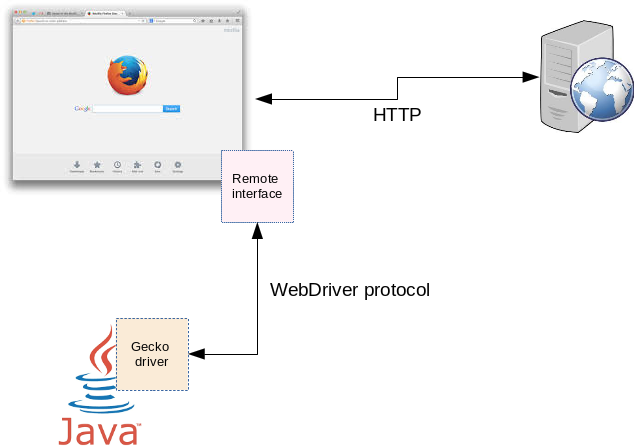 
<!--  -->


A WebDriver API-nak több implementációja is létezik.


- **Böngésző függő implementációk**: A Firefox WebDriver implementáció csatlakozik a Firefox szabványos remoteing interfészére, és távirányítja a teszt futtatása közben a böngészőt. Nagy előnye, hogy valódi böngészőben, a valódi futtatással megegyező módon fut a teszt, a javascript tényleg a böngésző javascript motorján fut. Hátránya, hogy csak olyan környezetben futtatható, ahol fel van telepítve az adott böngésző, és persze fut X. 


- **HtmlUnitDriver**, böngésző független implementáció: Egy egy böngésző emulátor lib, ami úgy csinál a WEB szerver felé, mint ha egy böngésző lenne, javascript motor is van benne. Előnye, hogy nem kell hozzá X, borzasztó gyors, tehát a háttérben is futtatható aktív grafikus felület nélkül (ez majd a GRID-es futtatásnál lesz előny, lásd lentebb) hátránya viszont, hogy nem valódi böngészőben fut az alkalmazás, tehát ha valami itt lefut, vagy pont hogy nem fut le, nem jelenti azt, hogy egy valódi böngészőben is jó lett volna, vagy hogy megakadt volna.


**NOTE:** > A Firefox böngészőhöz a **GeckoDriver**-t kell letölteni. Ezt írják róla:<br>
> <br>
> 
> **GeckoDriver** is the link between your tests in Selenium and the Firefox browser. GeckoDriver is a proxy for using W3C WebDriver-compatible clients to interact with Gecko-based browsers i.e. Mozilla Firefox in this case. As Selenium 3 will not have any native implementation of FF, we have to direct all the driver commands through Gecko Driver. Gecko Driver is an executable file that you need to have in one of the system path before starting your tests. Firefox browser implements the WebDriver protocol using an executable called GeckoDriver.exe. This executable starts a server on your system. All your tests communicate to this server to run your tests. It translates calls into the Marionette automation protocol by acting as a proxy between the local and remote ends. It is something similar to what we discussed in the chapter on Internet explorer & Chrome. 


A doksiban feltételezzük hogy JAVA a futtató környezet, ezt külön nem fogom írni. 


Egy WebDriver-el írt Seleium teszt úgy néz ki, hogy egy java osztályt írunk, amiben példányosítjuk a WebDriver-t, majd a WebDriver példány metódusait hívogatva definiáljuk a tesztünk teszt lépéseit. 
- Megnyithatunk egy weboldalt. 
- Kereshetünk elemeket a weboldalon
- A megtalált elemek tartalmát ellenőrizhetjük, vagy azokon user akciókat hajthatunk végre (kattintások, szöveg bevitel ..:)

A teszt futtatását valamelyik JAVA unit tesztelő eszközzel szokásos végrehajtani: 
- JUnit
- NJunit
- TestNG


Pl ha JNuni-ot használunk, akkor létre kell hozni metódusokat, amiket a **@Test** annotációval dekorálunk, és JUnit tesztként kell futtatni a teszt osztályunkat. Ezen metódusokban kell futtatni a teszt lépéseket. Mi is JUnit-ot fogunk használni.


> **WARNING:** A **WebDriver** a Selenium 2.0-ban lett bemutatva, mint a **Selenium RC** komponens utódja. Ugyan az RC-t a Selenium 3-as még mindig támogatja, de mára már elavultnak számít, használata nem javallott. 


<br>


## Driver letöltése
Ahogy azt már mondtuk, szükségünk van egy WebDriver implementáció, ami már böngésző függő. Külön driver van Firefox-hoz és külön Chorme-hoz. Ezeket le kell tölteni, és a megfelelő java system paraméterekkel meg kell adni az elérési helyüket a WebDriver alkalmazásnak. Fontos, hogy ezek szabványos WebDriver-ek, ezeknek nincs implicit köze a Selenium-hoz. 


**Firefox:** <br>

https://github.com/mozilla/geckodriver/releases<br>

Ezt kell letölteni: **geckodriver-v0.21.0-linux64.tar.gz**


**Chrome:** <br>

Chrome-hoz is elérhető a WebDriver, innen tölthető le: <br>

https://sites.google.com/a/chromium.org/chromedriver/downloads <br>

https://chromedriver.storage.googleapis.com/index.html?path=2.40/<br>

Ezt kell letölteni: **chromedriver_linux64.zip**

**IE:** 
<br>

....


> **NOTE:** Fontos hogy mindig az operációs rendszernek megfelelő driver-t töltsük le (32 ill 64 bites) különben furcsa hibákat fogunk kapni futtatás közben


Java system paraméterrel meg kell adni a driver helyét. A paraméter neve driver-enként különbözik.

- **Firefox**:
 -Dwebdriver.gecko.driver="..path../geckodriver"
- **Chrome**: 
 -Dwebdriver.chrome.driver="..path../chromedriver"
- **IE:**
 -Dwebdriver.ie.driver="..."

Ebből is következik, hogy egy teszt csak egy böngészőre futtatható egy időben, azon a böngészőn fog futni, aminek a driver-ét megadtuk. A teszt futtatásakor a driver az alapértelmezett helyen fogja keresni a böngésző futtatható állományát. Meg fogja nyitni a böngészőt és a szabványos remoting interfészen csatlakozni fog hozzá.

<br>


## WebDriver teszt írása
A java WebDriver-hez van szerencsére **Maven** dependencia, ami a futtatáshoz szükséges összes jar-t letölti. Hozzuk létre a pom.xml-t az alábbi tartalommal: 
```xml
<?xml version="1.0" encoding="UTF-8"?>
<project xmlns="http://maven.apache.org/POM/4.0.0"
                 xmlns:xsi="http://www.w3.org/2001/XMLSchema-instance"
                 xsi:schemaLocation="http://maven.apache.org/POM/4.0.0 http://maven.apache.org/xsd/maven-4.0.0.xsd">
        <modelVersion>4.0.0</modelVersion>
        <groupId>AleCashSelPilot</groupId>
        <artifactId>AleCashSelPilot</artifactId>
        <version>1.0</version>
        <dependencies>
	    <dependency>
            <groupId>junit</groupId>
            <artifactId>junit</artifactId>
            <version>4.12</version>
        </dependency>
	<dependency>
            <groupId>org.hamcrest</groupId>
            <artifactId>hamcrest-all</artifactId>
            <version>1.3</version>
        </dependency>

            <dependency>
                <groupId>org.seleniumhq.selenium</groupId>
                <artifactId>selenium-server</artifactId>
                <version>3.13.0</version>
            </dependency>
        </dependencies>
</project>
```


Majd futtassuk le: 
```
$ mvn clean install
```


Majd hozzuk létre a projekt struktúránkat (vagy használjunk Maven archetype-ot)
```
- lib/
- src/main/java/
       |  
        - resources
```
Másoljuk a geckodriver-t a lib mappába 


Java system paraméterrel meg kell adni a driver helyét. A paraméter neve driver-enként különbözik. 

- **Firefox**: -Dwebdriver.gecko.driver="..path../geckodriver"
- **Chrome**: -Dwebdriver.chrome.driver="..path../chromedriver"

És hozzunk létre az első Teszt osztályunkat: Teszt1.java. A teszt meg fogja nyitni a google.com-ot és ott rá fog keresni a "how to use Selenium" -ra. 
```java
import static org.junit.Assert.fail;
import java.util.concurrent.TimeUnit;

import org.junit.After;
import org.junit.Before;
import org.junit.Test;
import org.openqa.selenium.By;
import org.openqa.selenium.Keys;
import org.openqa.selenium.WebDriver;
import org.openqa.selenium.firefox.FirefoxDriver;

public class FirstTestCase {
  private WebDriver driver;

  private StringBuffer verificationErrors = new StringBuffer();

  @Before
  public void setUp() throws Exception {
	
    System.setProperty("webdriver.gecko.driver", ".../lib/geckodriver");
    driver = new FirefoxDriver();

  }

  @Test
  public void testFirstTestCase() throws Exception {
    driver.get("https://www.google.com/");
    driver.findElement(By.id("lst-ib")).click();
    driver.findElement(By.id("lst-ib")).clear();
    driver.findElement(By.id("lst-ib")).sendKeys("how to use sele");
    driver.findElement(By.id("lst-ib")).sendKeys(Keys.DOWN);
    driver.findElement(By.id("lst-ib")).sendKeys(Keys.ENTER);
  }

  @After
  public void tearDown() throws Exception {
//    driver.quit();
//    String verificationErrorString = verificationErrors.toString();
//    if (!"".equals(verificationErrorString)) {
//      fail(verificationErrorString);
//    }
  }
}
```
> **NOTE:** A driver elérési útját azért az osztályon belül adtuk itt meg, mert a WebDriver lokálisan fut, nem a Seleinum GRID-en, így a driver-re itt 'helyben' van szükség. Majd látni fogjuk, hogy a [\2](\1) fejezetben, hogy grid-es futtatás esetén a node-oknak kell megadni a driver helyét, nem a tesztet futtató VM-nek, mivel a node-oknak el lesz küldve a teszt, azok fogják futtatni.

<br>
<br>


## Teszt futtatása

Futtassuk az FirstTestCase.java-t JUnit tesztként. (Ezt az Eclipse-ből is könnyedén meg lehet tenni)


Ekkor a konzolon láthatjuk, hogy elindítja a Firefox-ot, majd végrehajtja benne a tesztet: 
```
1532016412891	geckodriver	INFO	geckodriver 0.21.0
1532016412896	geckodriver	INFO	Listening on 127.0.0.1:5401
1532016413252	mozrunner::runner	INFO	Running command: "/usr/bin/firefox" "-marionette" "-foreground" "-no-remote" "-profile" "/tmp/rust_mozprofile.UAu8F5P60foO"
...
```


A Firefox-ot meg fogja nyitni. Ahogy látjuk a default helyen keresi (/usr/bin/firefox). Azonban a Firefox-ban a narancssárga címsor és mellette a kis robot fej jelzi, hogy remote kontrol üzemmódban van a browser.  


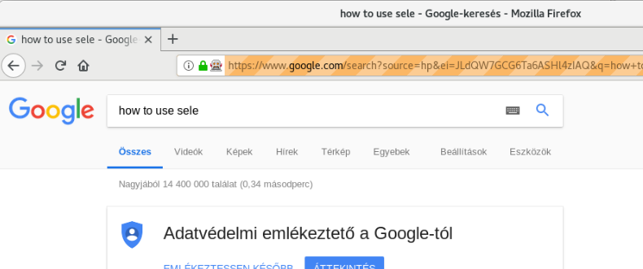 
<!--  -->


<br>

<br>


## HtmlUnitDriver
> **TIP:** A **HtmlUnitDriver**-t nem kell letölteni, benne van a Selenium csomagban amit a Maven lehúz

This is currently the fastest and most lightweight implementation of WebDriver. As the name suggests, this is based on HtmlUnit.

Pros: 
- Fastest implementation of WebDriver
- A pure Java solution and so it is platform independent.
- Supports Javascript


Cons
- Emulates other browser's JS behaviour (see below)


A fenti kódban csak ennyi módosítás szükséges a HtmlWebDriver használatához: 
```java
...
import org.openqa.selenium.htmlunit.HtmlUnitDriver;
...
driver = new HtmlUnitDriver();
```


<br>
<br>


# Selenium IDE

Ahogy azt már láthattuk a Selenium IDE (és alternatívái) elsősorban arra szolgál, hogy elkészítsük vele a tesztünk első változatát, vagy kísérletezésre, semmi képen sem ipari tesztek futtatására. (Ez csak egy kis segédeszköz, a teszteket a WebDriver-el kell futtatni!!) 


## Selenium IDE 3 tesztek

A Selenium IDE egy Firefox böngésző plug-in, aminek a segítségéve felvehetjük a user aktivitást egy úgynevezett Selenese script formájában, amit vissza is játszhatunk a Selenium IDE-ben. 

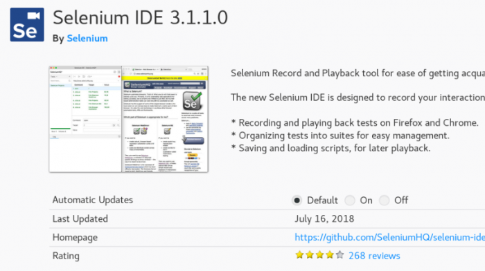 
<!--  -->


> **WARNING:** A **Selenium IDE 3**-asnak semmi köze már a régi **Selenium IDE 2**-eshez és a korábbi verziókhoz. A Firefox 56-tól kezdve, a Firefox áttért a **WebExtensions** plugin API-ra, és megszüntette a legacy firefox plugin támogatást, amire a Selenium IDE 2 is épített. Így nulláról újraírták a Selenium IDE-t **WebExtensions** API támogatással. A WebExtensions API egy szabványosított plugin API, így a Selenium IDE 3 elvileg Chrome-ban is működik<br>
> 
> A Selenium IDE 3-nak ez a weboldala: https://github.com/SeleniumHQ/selenium-ide 


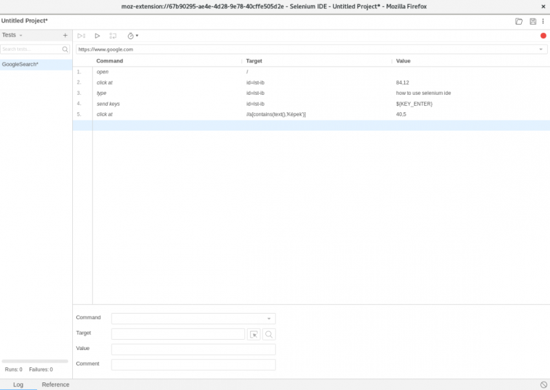 
<!--  -->


A legnagyobb hiányossága az új IDE 3-nak az IDE 2-höz képest, hogy jelenleg hiányzik belőle az Export funkció, amine a segítségével WebDriver Java kódként lehetne exportálni a Selenese script-et, amit a Selenium IDE kiköp magából. 

Az egyetlen formátum ahogy exportálni tudja a scriptet, az a Selenese script formátum, ami egy JSON-os reprezentációja a test-nek. Így néz ki a http://google.com megnyitása, ahol lefuttattam egy keresést. 
```JSON

{
  "id": "8c8712c1-9eea-4915-b7a5-1f22c44f1b1a",
  "name": "Untitled Project",
  "url": "https://www.google.com",
  "tests": [{
    "id": "78bc5c18-d1ef-4f34-9a53-691b9f5b6f71",
    "name": "GoogleSearch",
    "commands": [{
      "id": "3bcabc8f-f4d5-4539-9c7d-a6d17508c919",
      "comment": "",
      "command": "open",
      "target": "/",
      "value": ""
    }, {
      "id": "76337c19-1809-4ab5-a9c0-08ed4fcf9d10",
      "comment": "",
      "command": "clickAt",
      "target": "id=lst-ib",
      "value": "84,12"
    }, {
      "id": "57d7582c-1b92-4d71-b991-046bc049de0a",
      "comment": "",
      "command": "type",
      "target": "id=lst-ib",
      "value": "how to use selenium ide"
    }, {
      "id": "e96b3824-3bc0-4e02-a08f-eea238acb9c8",
      "comment": "",
      "command": "sendKeys",
      "target": "id=lst-ib",
      "value": "${KEY_ENTER}"
    }]
  }],
  "suites": [{
    "id": "204a50a3-cf87-433b-ac72-ae2fb46ddd6a",
    "name": "Default Suite",
    "parallel": false,
    "timeout": 300,
    "tests": []
  }],
  "urls": ["https://www.google.com/"],
  "plugins": [],
  "version": "1.0"
}
```
Ha ezt a fájlt betöltjük a Selenium IDE-be, és rányomunk a play gombra, akkor meg fogja nyitni a Google-t, majd beírja a keresőbe: "how to use selenium". 


<br>


## Selenium IDE alternatívák (Katalon)
Ahogy azt már láthattuk a legnagyobb baja a Selenium IDE 3-asnak az, hogy nem írták meg benne az Export funkciót, vagyis, hogy a felvett script-ből egy gombnyomással futtatható WebDriver alapú java kódot tudjunk készíteni. 

Két olyan Firefox Plugin alternatíva is létezik, amik itt a segítségünkre lehetnek: 

- Kantu
- Katalon Recorder (része a Kataon termékcsaládnak, de a Recorder ingyenes)

Mi itt csak a Katalon recoder-el fogunk foglalkozni: 

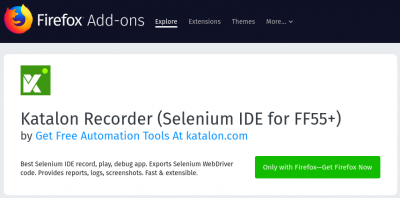 
<!--  -->


A Katalon felülete nagyon hasonlít a Selenium IDE 3-éhoz, minden adja magát: 

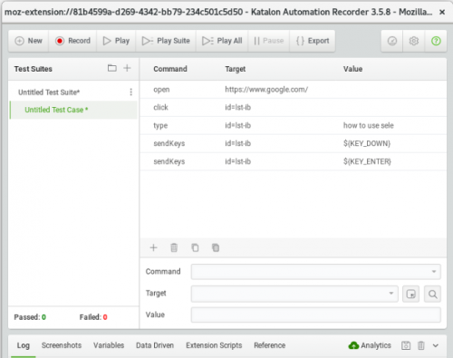 
<!--  -->


<br>

Minden WebDriver által támogatott formátumban tudja exportálni a felvett scriptet, nekünk itt a Java az érdekes. Ott is három lehetőség közül lehet választani, attól függően, hogy a Java tesztet milyen keretrendszerrel akarjuk futtatni: 
- JUnit
- NUnit
- TestNG

 
<!--  -->


Az exportált script gyakorlatilag azonnal futtatható a [\2](\1) fejezetben bemutatott környezetben. Arra kell csak figyelni, hogy a megfelelő driver-t beállítsuk a **webdriver.gecko.driver** system változóval. 
<br>

<br>


# GRID 2.0
https://examples.javacodegeeks.com/enterprise-java/selenium/selenium-standalone-server-example/<br>

https://www.guru99.com/introduction-to-selenium-grid.html

## Bevezető
A Selenium WebDriver alakalkalmazást futtathatjuk cluster-es környezetben is. Lesz egy manager példányunk, ezt hívják **hub**-nak, és lesznek worker példányok, akik a tesztet futtatják, ezt hívják **node**-nak. Mind a hub, mind a node-ok futtatására ugyan arra a Selenium jar-ra van szükség, csak más paraméterezéssel kell őket elindítani: **selenium-server-standalone**
<br > A Selenium server-t vagy más néven GRID-et innen tölthetjük le: http://selenium-release.storage.googleapis.com/index.html?path=3.9/

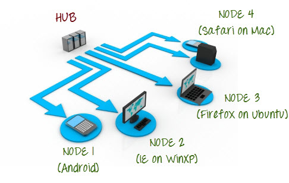 
<!--  -->


A Selenium GRID 2.0-re ne telepítjük implicit a futtatni kívánt teszt-et. Ugyan úgy, ahogy a GRID nélküli futtatásnál csináltuk, el kell indítani a Standalone JAVA alkalmazást, ami a Selenium tesztet tartalmazza, azonban a WebDrvier példányosításakor nem lokális böngésző driver helyett a RemoteDriver-t kell példányosítani, ahol meg kell adni a GRID hub URL-jét. Mikor futtatjuk a Standalone JAVA alkalmazásunkat, a tesztet el fogja küldeni a távoli GRID hub-nak, és a hub szét fogja küldeni a tesztet a node-konak. 
```java
WebDriver driver = new RemoteWebDriver(new URL("http://localhost:4444/wd/hub"), capability);
```

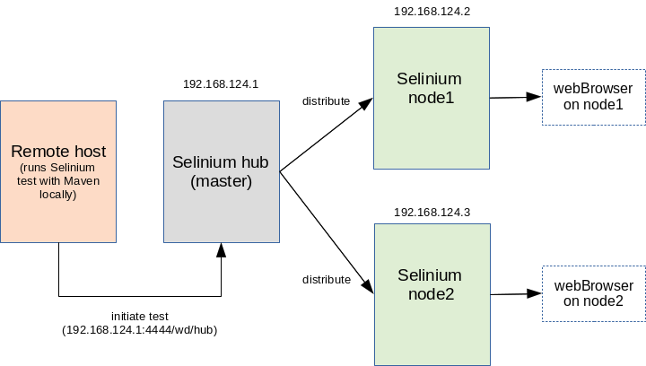 
<!--  -->

A node-ok a beállításuktól függően vagy a HtmlUnitDriver driver-el emulálják a böngésző futását (ekkor nem szükséges grafikus környezet) vagy tényleg elindítanak egy böngésző példányt és a driver segítségével csatlakoznak a böngésző remote/test API-jára, és a szemünk előtt zongorázzák le a tesztet. 


A Selenium server-nek a help-jét a -h kapcsolóval lehet előhívni: 
```
$ java -jar selenium-server-standalone-3.9.1.jar -h
Usage: <main class> [options]
  Options:
    --version, -version
      Displays the version and exits.
      Default: false
    -browserTimeout
      <Integer> in seconds : number of seconds a browser session is allowed to 
      hang while a WebDriver command is running (example: driver.get(url)). If 
      the timeout is reached while a WebDriver command is still processing, 
      the session will quit. Minimum value is 60. An unspecified, zero, or 
      negative value means wait indefinitely.
      Default: 0
    -debug
      <Boolean> : enables LogLevel.FINE.
      Default: false
    -jettyThreads, -jettyMaxThreads
      <Integer> : max number of threads for Jetty. An unspecified, zero, or 
      negative value means the Jetty default value (200) will be used.
    -log
      <String> filename : the filename to use for logging. If omitted, will 
      log to STDOUT
    -port
      <Integer> : the port number the server will use.
      Default: 4444
    -role
      <String> options are [hub], [node], or [standalone].
      Default: standalone
    -timeout, -sessionTimeout
      <Integer> in seconds : Specifies the timeout before the server 
      automatically kills a session that hasn't had any activity in the last X 
      seconds. The test slot will then be released for another test to use. 
      This is typically used to take care of client crashes. For grid hub/node 
      roles, cleanUpCycle must also be set.
      Default: 1800
```

Láthatjuk, hogy a **hub** vagy **node** szerepkört a **-role** kapcsolóval lehet megadni. Ha nem adjunk meg semmit, akkor **standalone** üzemmódban fog elindulni a Selenium grid 1 példányban.
> **NOTE:** Természetesen a valóságban a node-okat érdemes külön fizikai gépre tenni, hogy megosszuk a terhelést, azonban itt a példában az összes node egy környezetben lesz


> **WARNING:** A **Grid 1.0**-nak semmi köze nincs a **GRID 2.0**-hoz, nincs köztük átjárás, az 1.0 **Selenium RC**-n alapul, míg a 2.0 a WebDriver-en. A GRID 1.0 és a Selenium RC használata már nem javallot


## Cluster létrehozása

### HUB
Elsőként hozzuk létre a **hub**-ot:  
```
$ java -jar selenium-server-standalone-3.9.1.jar -role hub
...
16:31:29.770 INFO - Launching Selenium Grid hub on port 4444
...
16:31:30.431 INFO - Selenium Grid hub is up and running
16:31:30.431 INFO - Nodes should register to http://192.168.124.1:4444/grid/register/
16:31:30.432 INFO - Clients should connect to http://192.168.124.1:4444/wd/hub
```

- Láthatjuk, hogy a végén kiírta a hub azt az URL-t, ahol a node-oknak regisztrálniuk kell magukat. Ezt meg kell adni a node példányok indításakor
- Az utolsó sorban azt is kiírta a hub, hogy a Standalone JAVA alkalmazásként futó Selenium teszt milyen URL-en tudja beküldeni a teszt-t a server-nek.


A hub-nak van egy web-es konzolja, ahol láthatjuk majd a node-ok listáját, típusát, valamint a hub és a node-ok konfigurációját:  http://localhost:4444/grid/console

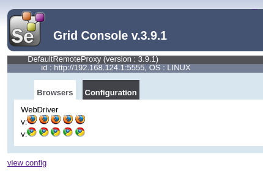 
<!--  -->

A konzolon minden kék kocka egy node-ot jelképez. Benne a kis ikonok azt mondják meg, hogy a node képes Firefox és Chrome tesztek futtatására is (Ha ez Windows-on futna, az IE is itt lenne). Ez azért van így, mert nem adtunk meg külön node konfigurációt, és alapértelmezetten az összes böngészőt vállalja a node, ami elérhető a gépen. Majd a [\2](\1) című fejezetben láthatjuk, hogy lehet specializált node-okat létrehozni. 


### Node
Hozzuk létre a node-okat. A hub elérhetőségét a **-hub** kapcsolóval kell megadni. Ha nem a HtmlUnitDriver-t használjuk a megírt tesztünkben, akkor a node-nak meg kell adni a driver helyét is VM system paraméterekkel. 


A driver helyét pont úgy kell megadni a node-nak, mint azt a lokális tesztünk esetén tettük, a driver típusának megfelelő system paramétert kell használni: 

- **Firefox**: -Dwebdriver.gecko.driver="..path../geckodriver"
- **Chrome**: -Dwebdriver.chrome.driver="..path../chromedriver"
- **IE:** -Dwebdriver.ie.driver=""

> **NOTE:** A Node-nak több driver-t is meg lehet adni. Annyiféle böngészőt fog tudni támogatni, amennyi driver-t megadunk neki indításkor.


```
$ java -Dwebdriver.gecko.driver="geckodriver" -jar selenium-server-standalone-3.9.1.jar -role node  -hub http://192.168.124.1:4444/grid/register/
..
16:36:17.659 INFO - Launching a Selenium Grid node on port 5555
..
16:36:18.029 INFO - Registering the node to the hub: http://192.168.124.1:4444/grid/register
```


Ennek hatására a hub-on is megjelent a log-ban, hogy egy node regisztrálta magát: 
```
16:36:18.169 INFO - Registered a node http://192.168.124.1:5555
```


## Remote driver

Ha a HUB-on akarjuk futtatni a tesztet, akkor mindösszesen annyi különbség van a teszt írásában, hogy driver implementációnk a **RemoteWebDriver(URL, capabilities)**-t kell használni. Ennek két paramétere van: 
- **URL**: ez a HUB-nak az elérhetősége, ahova a teszt-et küldeni kell. Ezt ki is írta a HUB induláskor a konzolra. 
- **Capabilities**: A node-oknak induláskor meg lehet adni 'képességeket', mint pl azt hogy milyen böngészőkre futtathatnak tesztet. Ha nem adjunk meg 'képességet', akkor minden teszt futtatható rajtuk a hub szemszögéből nézve. A hub mindig csak a képességnek megfelelő tesztet fogja elküldeni a noder-ra. Ha a **RemoteWebDriver**-en azt adjuk meg hogy **FirefoxOptions** mint képesség, akkor csak olyan node-on fogja futtatni a tesztet, aki vagy nem állít magáról semmit, vagy szerepel a képességei között a Firefox. 

```java
driver = new RemoteWebDriver(new URL("http://localhost:4444/wd/hub"), new FirefoxOptions());
```


## Teszt futtatása
https://james-willett.com/2015/06/using-assertions-in-your-selenium-tests/

- A Selenium teszt egy java standalone alkalmazás, ami elküldi a **Selenium hub**-nak a tesztet, aki ezt végrehajtja a megfelelő node-okon. A teszt környezetet és a teszt futtatását is maven-el fogjuk végezni. 
- A tesztet egy standard java osztályban kell definiálni. Elsőként példányosítani kell a **org.openqa.selenium.WebDriver** interfész egy megfelelő implementációját, majd ezen WebDriver példány metódusaival lehet definiálni a teszt minden lépését. 
- Ha a teszt-t nem a GRID-en akarjuk futtatni, akkor a drivernek egy böngésző függő (standalone) implementációját kell használni (pl. HtmlUnitDriver). De mivel mi a **hub**-ra elküldeni a tesztet, nekünk a **RemoteWebDriver**-t kell használni. 


A [\2](\1) fejezetben készített teszt-et fogjuk átalakítani, úgy hogy a GRID-en fusson a teszt, ne közvetlenül a lokális böngészőben. 
```java
import java.net.URL;

import org.junit.Before;
import org.junit.Test;
import org.openqa.selenium.By;
import org.openqa.selenium.Keys;
import org.openqa.selenium.WebDriver;
import org.openqa.selenium.firefox.FirefoxOptions;
import org.openqa.selenium.remote.RemoteWebDriver;

public class GridTest {
  private WebDriver driver;

  @Before
  public void setUp() throws Exception {
	
    driver = new RemoteWebDriver(new URL("http://localhost:4444/wd/hub"), new FirefoxOptions());

  }

  @Test
  public void testFirstTestCase() throws Exception {
    driver.get("https://www.google.com/");
    driver.findElement(By.id("lst-ib")).click();
    driver.findElement(By.id("lst-ib")).clear();
    driver.findElement(By.id("lst-ib")).sendKeys("how to use sele");
    driver.findElement(By.id("lst-ib")).sendKeys(Keys.DOWN);
    driver.findElement(By.id("lst-ib")).sendKeys(Keys.ENTER);
  }
}
```


<br>
<br>


## Szofisztikált node konfiguráció (képességek)
A fenti példában a node-nak nem adtunk meg semmilyen képességet, így attól függetlenül, hogy a RemoteWebDriver-ben milyen képességet adtunk meg, az egy szem node-unk mindig megkapta a tesztet. 


A node-oknak meg lehet adni egy külső JSON formátumú konfigurációs fájlt, ahol többek között a böngésző típus is beállítható. A config fájlt a **-nodeConfig** kapcsolóval kell megadni a node induláskor. 


### Konfiguráció létrehozása
Hozzuk létre konfigurációt a firefox-os node-nak: **firefox_node.json**
```JSON
{
  "capabilities":
      [
        {
          "browserName": "firefox",
          "maxInstances": 5,
          "seleniumProtocol": "WebDriver"
        }
      ],
    "proxy": "org.openqa.grid.selenium.proxy.DefaultRemoteProxy",
    "maxSession": 5,
    "port": 6543,
    "host": 127.0.0.1,
    "register": true,
    "registerCycle": 5000,
    "hubPort": 4444,
    "hubHost": 127.0.0.1
}
```
A HUB a **browserName** mezőből fogja tudni, hogy Firefox teszt futtatására hivatott a node.


Majd egy külön konfigot a chrome-os node-nak:  **chrome_node.json**
```JSON
{
  "capabilities":
      [
        {
          "browserName": "chrome",
          "maxInstances": 5,
          "seleniumProtocol": "WebDriver"
        }
      ]
}
```


> **WARNING:** A Selinium 3-ban a node konfig szerkezete is megváltozott, a Selenium 2-re írt konfigurációs fájlok már nem fognak itt működni! 


### Node-ok indítása

Állítsuk le a korábban indított node-ot, és indítsuk újra a **-nodeConfig** kapcsolóval plusz a Firefox driver-el. 
```
$ java -Dwebdriver.gecko.driver="geckodriver" -jar selenium-server-standalone-3.9.1.jar \
-role node  -hub http://192.168.124.1:4444/grid/register/ -nodeConfig firefox_node.json
...
16:43:33.194 INFO - Registering the node to the hub: http://192.168.124.1:4444/grid/register
16:43:33.233 INFO - Updating the node configuration from the hub
16:43:33.240 INFO - The node is registered to the hub and ready to use
```


Indítsunk el egy másik node-ot a Chrome driver-el, de ne adjunk meg konfigurációs fájlt: 
```
java -D-Dwebdriver.chrome.driver="chromedriver" -jar selenium-server-standalone-3.9.1.jar \
-role node  -hub http://192.168.124.1:4444/grid/register/ -nodeConfig chrome_node.json
...
09:42:04.591 INFO - Registering the node to the hub: http://192.168.124.1:4444/grid/register
09:42:04.623 INFO - Updating the node configuration from the hub
09:42:04.630 INFO - The node is registered to the hub and ready to use
```


Nyissuk meg újra a konzolt itt: http://localhost:4444/grid/console#: 

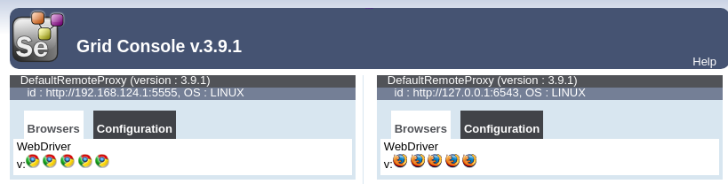 
<!--  -->

Láthatjuk, hogy most már két node van a képernyőn. A jobboldali az amit a Firefox config-al indítottunk. Látható, hogy csak Firefox ikonka látszik, tehát csak Firefox képességekkel rendelkezik, tehát erről sikeresen értesítette a HUB-ot, a HUB csak Firefox típusú teszteket fog ráküldeni. 

 
<!--  -->

A bal oldalit indítottuk a chrome konfigurációval, látható hogy csak Chrome ikonka van rajta.


### Teszt elkészítése
Annyi változás lesz az előzőhöz képest, hogy most két JUnit tesztet fogunk definiálni, egyet a Firefox node-nak, egyet pedig Chrome node-nak, és kiemeljük a teszt futtató részt egy külön metódusba, ahol a **MutableCapabilities** interfészt fogjuk használni a kapacitás megadására. 

```java
import java.net.URL;

import org.junit.Test;
import org.openqa.selenium.By;
import org.openqa.selenium.Keys;
import org.openqa.selenium.MutableCapabilities;
import org.openqa.selenium.WebDriver;
import org.openqa.selenium.chrome.ChromeOptions;
import org.openqa.selenium.firefox.FirefoxOptions;
import org.openqa.selenium.remote.RemoteWebDriver;

public class GridTest2 {

	@Test
	public void executeFirefoxDriver() throws Exception {
		this.execute(new FirefoxOptions());
	}

	@Test
	public void executeChrome() throws Exception {
		this.execute(new ChromeOptions());
	}

	private void execute(final MutableCapabilities brwserOptions) throws Exception {
		WebDriver driver = new RemoteWebDriver(new URL("http://localhost:4444/wd/hub"), brwserOptions);
		driver.get("https://www.google.com/");
		driver.findElement(By.id("lst-ib")).click();
		driver.findElement(By.id("lst-ib")).clear();
		driver.findElement(By.id("lst-ib")).sendKeys("how to use sele");
		driver.findElement(By.id("lst-ib")).sendKeys(Keys.DOWN);
		driver.findElement(By.id("lst-ib")).sendKeys(Keys.ENTER);
	}
}
```


### Teszt futtatása

Ha most futtatjuk le a tesztet, akkor a két JUnit teszt egymás után le fog futni: 

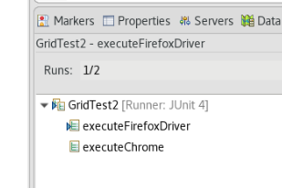 
<!--  -->


A HUB a képességeknek megfelelő node-ra fogja küldeni a tesztet: 
```
10:17:34.558 INFO - Got a request to create a new session: Capabilities {acceptInsecureCerts: true, browserName: firefox, moz:firefoxOptions: {args: [], prefs: {}}}
...
10:17:42.568 INFO - Got a request to create a new session: Capabilities {browserName: chrome, goog:chromeOptions: {args: [], extensions: []}}
...
```


> **NOTE:** Nekem a chrome nem indult el, a teszt egy helyben állt a node2-ön. Azt írták, hogy nem megfelelő a driver-em

