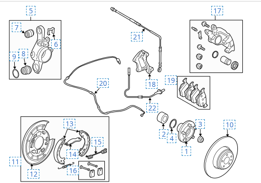
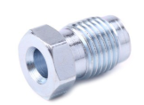

- [Fékrendszer sorozatszámok](#fékrendszer-sorozatszámok)
  - [Első fékek](#első-fékek)
  - [Hátsó fékek](#hátsó-fékek)
- [Fékcsövek felújítása](#fékcsövek-felújítása)
  - [Szerszámok](#szerszámok)
    - [Flaring tool](#flaring-tool)
    - [Sorjázó](#sorjázó)
    - [Cső vágó](#cső-vágó)
    - [Csőhajlító](#csőhajlító)
  - [Alkatrészek](#alkatrészek)
    - [Fittings](#fittings)
    - [Break line](#break-line)
- [Féktárcsa és fékpofák](#féktárcsa-és-fékpofák)
  - [Tárcsafék](#tárcsafék)
  - [Fékpofák](#fékpofák)
  - [Kézifék](#kézifék)
- [Fékolaj](#fékolaj)
    - [ISO 4925 Class 6 – Követelmények összefoglalva](#iso-4925-class-6--követelmények-összefoglalva)
  - [Fékolaj víz tartalma](#fékolaj-víz-tartalma)
  - [Márkák](#márkák)
    - [Liqui Moly](#liqui-moly)
    - [COMMA](#comma)
  - [Brambo](#brambo)
- [Break fluid bleeding](#break-fluid-bleeding)
  - [Szerszámok](#szerszámok-1)
    - [Fékolaj csere szett](#fékolaj-csere-szett)
    - [iCarsoft LR V3.0](#icarsoft-lr-v30)
  - [Folyamat](#folyamat)
    - [Break bleed with iCarsfot](#break-bleed-with-icarsfot)
    - [Manual break bleeding](#manual-break-bleeding)

 

# Fékrendszer sorozatszámok

## Első fékek

https://landrover.oempartsonline.com/v-2011-land-rover-range-rover-sport--autobiography--5-0l-v8-gas/brakes--front-brakes

* 7 - caliper right: LR047906
* 7 - caliper left: LR047905
* 10 - Wear Indicator without supercharger: SEM500080
* 12 - Brake Hose - right: LR058021
* 12 - Brake Hose - left: LR058020
* Disc Brake Caliper Seal Kit: R015580
* Caliper Mount Kit: LR020489
* Brake Pads Front - Land-Rover: LR134700

## Hátsó fékek

https://landrover.oempartsonline.com/v-2011-land-rover-range-rover-sport--autobiography--5-0l-v8-gas/brakes--rear-brakes

17. caliper 
    * left: LR010575 -> SOB500052
    * right: LR010574 -> SOB500042
18. caliper frame 
    * left: LR032059
    * right: LR032058   
19. brake pads: LR134696

...
1.  Brake Hydraulic Hose: LR058009

 
 

https://parts.jaguarlandroverclassic.com/parts/index/part/id/23.52939.53000.29249/brand/land-rover/

* 2282A: belső cső:  LR058010
  * https://www.autodoc.hu/brembo/14547107
* 2282B: külső cső: LR058009
  * https://www.autodoc.hu/brembo/14547106
* 2267A: középső csőrész, BAL: LR021678
  * https://parts.jaguarlandroverclassic.com/lr021678-tube-brake.html?code=29249 -> 26 font
  * https://www.ebay.com/itm/325005922159: 11.000 Ft + shiping
* 2267B: középső csőrész, JOBB: LR021679
  * https://parts.jaguarlandroverclassic.com/lr021679-tube-brake.html?code=29249
  * https://www.ebay.com/itm/325005924042
* HC1: klipp a wheel hub oldalán: EJP7813
  * https://parts.jaguarlandroverclassic.com/ejp7813-clamp.html?code=29249
* HC2:
* HC3
* HC4:

# Fékcsövek felújítása

Cső méret az egész autón: **4,75 mm**, 3/16 DIN

* youtube:  https://www.youtube.com/watch?v=-tCIU8ANNzE

## Szerszámok 
### Flaring tool

>**WARNING**:  Csak olyat szabad venni, ami tuti hogy jó acélhoz! Az olcsóbbak csak rézhez jók, és az acéltól tönkre mennek. A **VIGOR V4416** peremezőnek van egy belső perselye ezért nem számít, hogy a két fél pofa mennyire zár össze, mert a csavar egy belső perselybe megy. 
  
* https://www.gafaauto.hu/products/obrubovacie-zariadenie-brzdove-vedenie-2852448
* https://www.amazon.de/gp/product/B01B5GJ6KW/ref=as_li_tl
  
  

További megoldások: 

* https://selectauto.hu/szerszamok-fekvezetekekhez/3653-fekvezetek-csokeszlet-5901477129858.html
* https://selectauto.hu/szerszamok-fekvezetekekhez/3649-fekcsohajlito-pres-vagoval-4048769060367.html
* https://selectauto.hu/szerszamok-fekvezetekekhez/3661-pres-a-fekcsoevek-hajlitasahoz-7435125099043.html
* https://selectauto.hu/szerszamok-fekvezetekekhez/3667-hidraulikus-peremezo-4026947083100.html

Csak rézre: 
* https://quatros.hu/Quatros-fekcso-peremezo-keszlet-475-mm-3-16-sae-QS

### Sorjázó

* https://selectauto.hu/szerszamok-fekvezetekekhez/3658-szerszam-belso-fekcsoevek-sorjazasahoz-4048769017187.html

### Cső vágó

* https://www.amazon.de/gp/product/B014R5RVXM/ref=as_li_tl
* https://www.autodoc.hu/yato/15206554
* https://www.autodoc.hu/hazet/9262115

### Csőhajlító
* 4-10 mm

* https://www.amazon.de/gp/product/B001IL96LY/ref=as_li_t
* https://www.autodoc.hu/yato/18090213

## Alkatrészek
### Fittings

M10x1 -> 1mm emelkedésű (finom) menet, nem végig menetes!

* Itt lehet megvenni: https://www.autodoc.hu/ate/193196

### Break line
* 4.75 mm Steel
  
* https://www.amazon.de/gp/product/B0779FBJVB/ref=as_li_tl
* https://www.autodoc.hu/quick-brake/14643323

 

# Féktárcsa és fékpofák
## Tárcsafék
https://www.autodoc.hu/brembo/8714238

## Fékpofák

## Kézifék
felújító készlet: https://www.ebay.com/itm/392451473515?_skw=land+rover+l320+parking+hand+brake+repair+kit&epid=249363483

https://www.youtube.com/watch?v=r7j4cLWYZic

# Fékolaj
Shell DOT4 ESL. If unavailable, a low viscosity
DOT4 brake fluid that meets ISO 4925 class 6
and Land Rover LRES22BF03 requirements
may be used.

 

Ilyet nem találtam, de ez megfelel neki: 

- ISO 4925 Class 6
- Class 6

A lényeg: **LV -> Low Viscosity**

Kb 1 liter kell

### ISO 4925 Class 6 – Követelmények összefoglalva

| Paraméter                         | Követelmény          | Megjegyzés                                             |
|----------------------------------|-----------------------|--------------------------------------------------------|
| **Típus**                         | DOT 4 LV              | Alacsony viszkozitású (Low Viscosity)                 |
| **Száraz forráspont (ERBP)**     | ≥ 250 °C              | Equal or higher (száraz állapotban mért forráspont)   |
| **Nedves forráspont (WERBP)**    | ≥ 165 °C              | 3,5% víztartalom után mért forráspont                  |
| **Viszkozitás –40 °C-on**        | ≤ 750 mm²/s           | Kritikus ABS/ESP kompatibilitási követelmény          |
| **Viszkozitás 100 °C-on**        | ~1,5–2,0 mm²/s        | Stabil működés meleg üzemi körülmények között         |
| **Korrózióteszt**                 | Megfelel 6 fémtípusra | Réz, acél, alumínium, stb.                            |
| **Gumi-kompatibilitás**          | Kötelező              | Nem lehet duzzadás, repedés az előírt gumitípusokkal  |

## Fékolaj víz tartalma 
- https://www.youtube.com/watch?v=L7x3VnGflF0 -> fékvezeték csere és tartályos, túlnyomásos bleeding 
- https://www.youtube.com/watch?v=cRlCBbGuAEU
- https://www.youtube.com/watch?v=AxX5edYmRus

 

Milyen gyakran kell cseréni: 50 ezer km 

https://www.landroverwestchester.com/service/service-tips-tricks/land-rover-range-rover-maintenance-schedule/
 

 

A fékfolyadék hidrozskopikas, ezért idővel felvesz vizet, amitől nagyban romlik a fékező képessége, ezért kell pár évente kicserélin. Ha felforr benne a víz, gáz keletkezik, és nem fog fogni a fék. 

* The braking system can absorb 2% of its volume in moisture in 12 months.
  * A DOT 3 rated brake fluid with a 3% moisture accumulation will encounter a 25% drop in the boiling point.
  * A DOT 4 rated brake fluid under the same conditions will typically experience a 20% drop in boiling point due to better thermal performance.
  * A DOT 4 LV (ISO 4925 Class 6) brake fluid offers improved moisture resistance and low-temperature viscosity; with 3% moisture absorption, the boiling point drop is around 15–18%, depending on formulation, while retaining full ABS/ESP responsiveness even at –40 °C.
 

A nedvesség tartalom műszerrel tesztelhető: 

https://www.ebay.com/itm/166720381619

 

Az olaj cseréhez használhatjuk a diagnosztikai eszközöket, használhatunk nyomás tartályt, vagy csak nyomogathatjuk a pedált. Ezeknek mind utána kell nézni. 

## Márkák
### Liqui Moly
https://www.autodoc.hu/liqui-moly/7889281

### COMMA
https://www.youtube.com/watch?v=cRlCBbGuAEU 

COMMA DOT 4 BF4ESP1L Fékolaj 

https://www.autodoc.hu/comma/12762753

## Brambo

PRIME DOT 4.0 LV 1.0L Brake Fluid - L04210

A Brembo DOT 4 LV fékfolyadék forráspontjai is megfelelnek a követelményeknek:
* Száraz forráspont (ERBP): 260 °C
* Nedves forráspont (WERBP): 170 °C

Ezek az értékek meghaladják az ISO 4925 Class 6 minimális követelményeit, amelyek 250 °C (száraz) és 165 °C (nedves) forráspontokat írnak elő.

 

# Break fluid bleeding

Kétféle képen csinálhatjuk. 
1. Manuálisa a fékpedál nyomkodásával egy segítő segítségével 
2. Az iCarsoft használatával vagy más a kocsival kompatibilis diagnosztikai eszközt használva. 

A folyamathoz feltétlen szűkség van egy magas nyomású légtelenítő tartályra, ami két dolgot szolgál: 
- 1, 1.2 PSI nyomás alatt tartja a fékrendszert, ezért kinyomja belőle a levegőt, nem engedi a levegőt visszamenni
- Állandó folyadék szintet tart a féktartályban a folyamat alatt, így nem fordulhat elő, hogy kifogy az olaj a tartályból, és levegőt szív be a rendszer

## Szerszámok
### Fékolaj csere szett

- https://www.ebay.com/itm/286145946991

### iCarsoft LR V3.0

## Folyamat

### Break bleed with iCarsfot

Ha az iCarsoft-ot használjuk, akkor ő vezérelni fogja az ABS pumpát, és mindig a megfelelő szelep nyitásával csak abból a vezetékből fogja kinyomni a levegőt, amelyik keréknél éppen légtelenítünk. 

Nincs más dolgunk, mint hogy kövessük a képernyőn megjelenő utasításokat. Figyeljünk rá, hogy teljesen más sorrendben mondja, mint a manuális légtelenítés esetén. 
1. Bal hátsó
2. Bal első
3. jobb első
4. jobb hátsó

Lépések: 
1. Tegyünk a légtelenítő eszköz tartályába legalább 1 liter olajat. Majd pumpáljuk fel 1.2 psi-re.
2. Csatlakoztassuk a féktartályhoz. 
3. Indítsuk be a motort
4. Indítsuk el a bleeding programot az iCarsoft-ban

Mondani fogja, hogy melyik oldalon nyissuk ki a bleed szelepet. Ekkor tegyük rá a gyűjtő tartályt, majd nyissuk ki a bleed szelepet. Ha ez megvan, nyomjunk F1-et. 
Ekkor ki fogja írni, hogy "Communicatig ..." és ki be fogja kapcsolni az adott kerék ABS pumpa szelepét, berregni fog közben. 

Lehet közben nyomogatni a fékpedált is. Figyeljük, hogy jön e puborék ki a fékcsőből. 

Majd ki fogja írni, mikor kész van, és mehetünk a következő oldalra. Szépen az óramutató járásával megegyező módon körbe az autón. 

>**WARNING**: mindig tartsuk szemmel a nyomását a tartályban és a fékolaj szintet. Ne engedjük a nyomást 0.9 PSI alá menni. És nehogy elfogyjon a tartályból az olaj. Mindig töltsük újra. 

### Manual break bleeding 

A művelet nagyon hasonló, de más sorrendbe kell menni, mert a fékpedál nyomkodása közben nem csak annak a keréknek a szelep lesz nyitva ahol vagyunk, hanem az összes, ezért fontos, hogy a legtávolabbi keréktől menjünk a legközelebbi felé. 

Mindig járjon a motor itt is a légtelenítés alatt. 

Sorrend: 
1. jobb hátsó
2. bal hátsó
3. jobb első
4. bal első

Lépések: 
1. Tegyünk a légtelenítő eszköz tartályába legalább 1 liter olajat. Majd pumpáljuk fel 1.2 psi-re.
2. Csatlakoztassuk a féktartályhoz. 
3. Indítsuk be a motort
4. tegyük fel a gyűjtő tartályt a megfelelő kerékre, és nyissuk ki a bleeding szelepet. 
5. A segítő kezdje el pumpálni a fékpedált, és mik közbe figyeljük, hogy jönnek e ki még buborékok. 
6. Ha már nem jön buborék, akkor a segítő tartsa lenyomva a pedált, és mi eközbe zárjuk vissza a szelepet, nehogy levegőt szívjon vissza. 
7. Csináljuk meg a fenti sorrendben az összes keréken. 