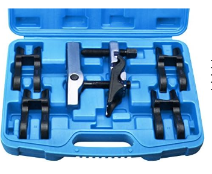
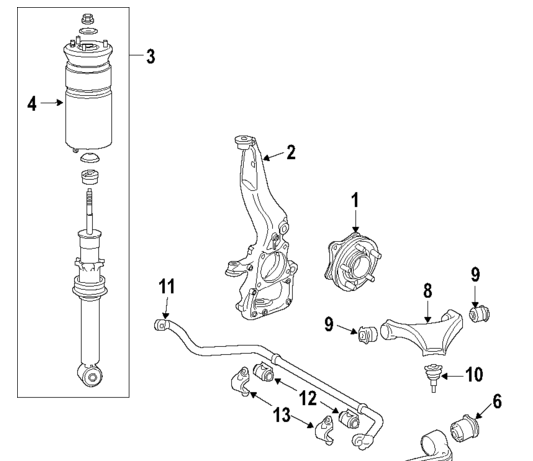
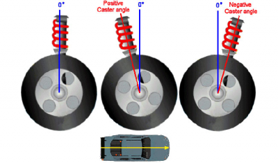
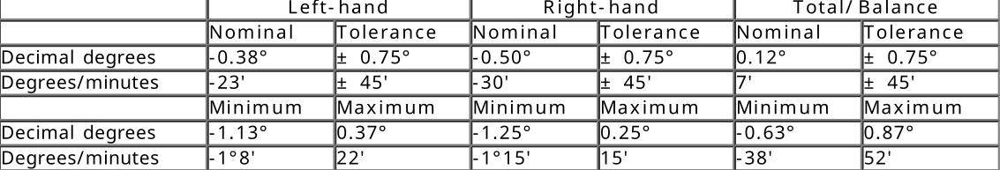
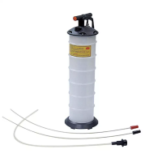

Range Rover Sport 2011 TDV6 3.0 

- [Linkek](#linkek)
- [Mit szeretnék lecserélni](#mit-szeretnék-lecserélni)
- [Mit cseréljünk ki a timing belt-el egyszerre](#mit-cseréljünk-ki-a-timing-belt-el-egyszerre)
- [Issues with the TDV6 3.0 Engine](#issues-with-the-tdv6-30-engine)
	- [Design Flaws](#design-flaws)
		- [Insufficient Lubrication on the Connecting Rod Bearings](#insufficient-lubrication-on-the-connecting-rod-bearings)
		- [Excessive Force on the Main Bearings](#excessive-force-on-the-main-bearings)
		- [Oil Pump Issues](#oil-pump-issues)
- [TDV6 3.0 gondjai](#tdv6-30-gondjai)
	- [Desing hibák](#desing-hibák)
		- [Nem elégséges kenés a dugattyú csapágyakon (connecting rod bearing)](#nem-elégséges-kenés-a-dugattyú-csapágyakon-connecting-rod-bearing)
		- [Túl nagy erőhatás a főtengely csapágyakon](#túl-nagy-erőhatás-a-főtengely-csapágyakon)
		- [Olaj pumpa gondok](#olaj-pumpa-gondok)
		- [A motor tetején van az olajszűrő](#a-motor-tetején-van-az-olajszűrő)
	- [Hogy lehet elkerülni](#hogy-lehet-elkerülni)
- [Kifejezések](#kifejezések)
- [Workshop manual Specifikációs szekciók](#workshop-manual-specifikációs-szekciók)
		- [General](#general)
		- [Timing belt and oil pump](#timing-belt-and-oil-pump)
		- [Termosztát és vízpumpa csere](#termosztát-és-vízpumpa-csere)
		- [Fuel Injection Pump belt](#fuel-injection-pump-belt)
- 
- [Alkatrészek](#alkatrészek)
	- [Air intake pipe to second turbo](#air-intake-pipe-to-second-turbo)
	- [Rézpaszta](#rézpaszta)
	- [Power steering fluid / kormány hidraulika folyadék](#power-steering-fluid--kormány-hidraulika-folyadék)
		- [Helyettesítések](#helyettesítések)
			- [Liqui Moly](#liqui-moly)
			- [Ravenol](#ravenol)
		- [Mennyi kell](#mennyi-kell)
		- [Tartály csere](#tartály-csere)
	- [Fékolaj](#fékolaj)
	- [Fékek](#fékek)
		- [Tárcsafék](#tárcsafék)
		- [Fékpofák](#fékpofák)
		- [Kézifék](#kézifék)
		- [Milyen olaj kell](#milyen-olaj-kell)
			- [Liqui Moly](#liqui-moly-1)
			- [COMMA](#comma)
	- [Motor olaj](#motor-olaj)
		- [Mit jelent az olaj jelölés](#mit-jelent-az-olaj-jelölés)
		- [Milyen olaj kell](#milyen-olaj-kell-1)
		- [Motorolaj](#motorolaj)
	- [Accessory/Auxiliary Drive Belt / Hosszbordás szíj](#accessoryauxiliary-drive-belt--hosszbordás-szíj)
	- [Hűtőfolyadék](#hűtőfolyadék)
		- [Márkák](#márkák)
	- [Timing belt](#timing-belt)
		- [Workshop manual](#workshop-manual)
		- [OEM számok:](#oem-számok)
		- [Alkatrészek:](#alkatrészek-1)
		- [Szerszámok:](#szerszámok)
	- [Vízpumpa](#vízpumpa)
	- [Fuel Pump Belt](#fuel-pump-belt)
		- [Workshop manual:](#workshop-manual-1)
		- [OEM számok:](#oem-számok-1)
		- [Alkatrész:](#alkatrész)
		- [Szerszámok:](#szerszámok-1)
	- [Befecskendezők](#befecskendezők)
		- [Eltávolító eszköz](#eltávolító-eszköz)
			- [Hivatalosan ez kell](#hivatalosan-ez-kell)
			- [Nem hivatalosan](#nem-hivatalosan)
	- [Olaj szivattyú (oil pump)](#olaj-szivattyú-oil-pump)
		- [Workshop manual](#workshop-manual-2)
		- [OEM számok:](#oem-számok-2)
		- [Alkatrészek:](#alkatrészek-2)
		- [Szerszámok:](#szerszámok-2)
		- [Olaj nyomás mérése](#olaj-nyomás-mérése)
			- [Olaj nyomás mérése az olajszűrön](#olaj-nyomás-mérése-az-olajszűrön)
			- [Olaj nyomás mérés az olaj nyomás szenzor helyén](#olaj-nyomás-mérés-az-olaj-nyomás-szenzor-helyén)
			- [Olaj nyomás mérők:](#olaj-nyomás-mérők)
	- [Camshaft timing chain and camshaft seals](#camshaft-timing-chain-and-camshaft-seals)
		- [Workshop manual](#workshop-manual-3)
		- [Alkatrészek:](#alkatrészek-3)
		- [Szerszámok](#szerszámok-3)
- [Fuel burning heater](#fuel-burning-heater)
- [Felfüggesztés](#felfüggesztés)
	- [Szerszámok](#szerszámok-4)
	- [Első felfüggesztés](#első-felfüggesztés)
		- [Alsó lengökar](#alsó-lengökar)
			- [Csavarok](#csavarok)
			- [Bushings](#bushings)
			- [Lengőkar](#lengőkar)
			- [Rods and hubs](#rods-and-hubs)
		- [Felső lengőkar](#felső-lengőkar)
			- [Csavar:](#csavar)
			- [Bushing:](#bushing)
			- [Lengökar:](#lengökar)
	- [Hátsó felfüggesztés](#hátsó-felfüggesztés)
		- [Felső lengőkar](#felső-lengőkar-1)
			- [Csavar](#csavar-1)
			- [Bushings](#bushings-1)
			- [Lengőkar](#lengőkar-1)
		- [Alsó lengőkar](#alsó-lengőkar)
			- [Csavar](#csavar-2)
			- [Bushings](#bushings-2)
			- [Lengőkar](#lengőkar-2)
		- [Rods and hubs](#rods-and-hubs-1)
			- [Csavarok](#csavarok-1)
			- [Alkatrészek](#alkatrészek-4)
			- [Bushings](#bushings-3)
	- [Beállítás](#beállítás)
		- [Mit kell állítani](#mit-kell-állítani)
		- [Táblázatok értelmezése](#táblázatok-értelmezése)
		- [Camber (függőleges, befelé dőlsé)](#camber-függőleges-befelé-dőlsé)
		- [Toe in/out](#toe-inout)
		- [Castor](#castor)
- [Fuel system](#fuel-system)
- [Crankshaft bearings](#crankshaft-bearings)
	- [Blokk felfúrása: line boar](#blokk-felfúrása-line-boar)
	- [stretch bolt](#stretch-bolt)
- [EGR blokkolás](#egr-blokkolás)
	- [Tisztítás, karbon eltávolítás](#tisztítás-karbon-eltávolítás)
		- [Drano Power Granulate](#drano-power-granulate)
		- [Mr Muscle lefolyótisztító](#mr-muscle-lefolyótisztító)
		- [Merülő szivattyú](#merülő-szivattyú)
	- [Inlet manifold csere/tisztítás](#inlet-manifold-cseretisztítás)
- [Fuel System diagnoses](#fuel-system-diagnoses)
- [Szerszámok](#szerszámok-5)
	- [Compression test](#compression-test)
	- [Kamera](#kamera)
	- [Füst szivárgás vizsgáló](#füst-szivárgás-vizsgáló)
	- [Vákuum szelep manuális nyitása](#vákuum-szelep-manuális-nyitása)
	- [OBD scanning tools](#obd-scanning-tools)
		- [GAP IID](#gap-iid)
		- [iCarsoft LR V3.0](#icarsoft-lr-v30)
		- [OTOFIX D1 Lite PRO Diagnostic Tool](#otofix-d1-lite-pro-diagnostic-tool)
	- [Olaj csere eszközök](#olaj-csere-eszközök)
		- [Fékolaj csere szett](#fékolaj-csere-szett)
		- [Váltó és differenciál olajcsere pumpa](#váltó-és-differenciál-olajcsere-pumpa)
		- [Motorolaj csere pumpa](#motorolaj-csere-pumpa)
	- [Injector puller/removal/cleaner](#injector-pullerremovalcleaner)
		- [Cleaning](#cleaning)
		- [Replacement parts](#replacement-parts)
		- [Removal](#removal)
	- [Csavar jelölő (piros)](#csavar-jelölő-piros)
- [track rod ball joint, steering rod (Vezetőkar fej)](#track-rod-ball-joint-steering-rod-vezetőkar-fej)
- [PCV (Positive Crankcase Ventilation) és Oil Separator](#pcv-positive-crankcase-ventilation-és-oil-separator)
	- [Jelei a rossz PVC-nek](#jelei-a-rossz-pvc-nek)
	- [AOS (Air - Oil separator)](#aos-air---oil-separator)
	- [Cache Can system](#cache-can-system)

# Linkek
- HU [hátsó vezérmű szíj csere](rear-timing-belt-HU.md)  
- EN [rear timing belt change](rear-timing-belt-EN.md)

# Mit szeretnék lecserélni
1. iCarsoft LR V3.0 OBD review
2. EGR blokkolás + szívósor tisztítás
3. Üzemanyag pumpa szíj csere 
4. Vezérmű tengely tömítések csere
5. Olajcsere az olajteknő levételéve (új tömítés) 
6. Fékolaj csere 
7. Váltó olaj és szűrő csere
8. Kormány hidralika olaj csere 
9. Hűtőrendszer átmosása és folyadék csere 
10. Motor kompresszió mérés, hegerek kamerás vizsgálata, izzító gyertyák és porlasztók tisztítása, vizsgálata
11. Vezérmű lánc és lánc feszítő csere
12. Olaj pumpa csere
13. Kerékcsapágy csere
14. Féktárcsa csere
15. Fékpofa csere
16. Légrugó csere 

 
 

# Mit cseréljünk ki a timing belt-el egyszerre
- A serpentine belt (Accessory Drive Belt) -et annak a két görgőjét és a szíj feszítőjét
- Vízpumpát 
- Olajpumpát és tömítőjét
- A timing belt mind két görgőjét és szíj feszítőjét
- termosztátot
- Esetleg a camshaft tömítéseket ha eresztenek 
- Nagy nyomású üzemanyag pumpa szíj és feszítő 
- nagyon ritkán: camshaft chain mind két hengerfejben

Források: 
- LR time: 
	- https://www.patreon.com/join/LRTime?redirect_uri=https%3A%2F%2Fwww.patreon.com%2Fposts%2F67032538
	- https://www.youtube.com/@Vera_and_Christian
 

# Issues with the TDV6 3.0 Engine

 
<!--  -->

The crankshaft has sliding bearings made up of two half-circles, which do not touch the crankshaft journal during operation; there is a thin oil film between the main bearing and the main bearing journal.

 
<!--  -->
 
 
<!--  -->
 
 
<!--  -->

The lower half-circle has a hole through which oil enters between the bearing and the crankshaft. The crankshaft also has a hole that channels oil to the connecting rod bearing journal via an angled bore. The upper half of the main bearing does not have a hole; it sits in the main bearing cap, which is stronger than the lower part and absorbs most of the force from the piston impacts.

If the main bearing runs out of oil, it can seize onto the crankshaft within a few minutes, causing rapid wear and rotation in the engine block. If the bearing rotates, it blocks the oil passage in the block, preventing oil from reaching the connecting rod bearing and triggering a chain reaction.

Upon startup, during cranking, there is no oil pressure, so there is no oil between the bearing and the crankshaft. If this condition persists for too long or happens repeatedly, it can start to wear the bearing. If the bearing surface is no longer perfectly smooth, a chain reaction can begin. If a small piece breaks off from any bearing (even a tiny piece not visible to the naked eye), it can get between the adjacent bearing and the shaft, machining away further material and causing a chain reaction. Eventually, a bearing will seize, tighten, and major damage will occur.

If a bearing spins in the block, the crankshaft can break within 5-10 minutes, rendering the engine block useless.

Detailed explanation here (starts at 36 minutes):

https://www.youtube.com/watch?v=MKYovvWWym0
The camshaft chain tensioner is also oil-driven. Until there is oil pressure, it does not push the chain up between the two camshafts, which can cause a rattling sound for a few seconds at startup.

 
 This engine typically fails due to crankshaft breakage. But what causes this?
The most common cause of crankshaft breakage is crankshaft main bearing failure. It typically breaks on the side of the failed bearing.
The crankshaft can also break if there is too much clearance between the bearing and the shaft, because the bearing has excessive "play" between the four mounting points. High forces then lead to breakage. This is why the clearance between the bearing and the shaft must be within the factory-specified tolerance.
The crankshaft in the TDV6 can also break due to material defects, caused by poor design.

## Design Flaws
Video: https://www.youtube.com/watch?v=v3moekbW6z8&t=2092

### Insufficient Lubrication on the Connecting Rod Bearings
Despite being a 6-cylinder, 3-liter engine, it is incredibly short. This was achieved by having only 4 bearings supporting the crankshaft, and these bearings are also very narrow.

 
<!--  -->

So, there are two pistons between each bearing.

 
 
Another issue is that the oil passages leading to the pistons are shared for the 4 inner pistons, affecting 2 connecting rod bearings: 

 
<!--  -->

 {width="500"}
<!--  -->

 {width="500"}
<!--  -->

The oil enters the crankshaft through a hole located at the center of the main bearing. From there, it travels through angled passages to the connecting rod bearings. However, because there are only 4 mounting points and 6 pistons, the two central bearings (marked with a circle) supply oil to two places, one to the right and one to the left. This is designed so that the crankshaft journal has two holes at these points, offset by 180 degrees. As the crankshaft holes pass over the half-circle of the main bearing where the oil supply port is located, oil can be delivered to the left connecting rod bearing half the time and to the right one the other half. As a result, the oil pressure pulses for the inner 4 connecting rod bearings. It is always the two central bearings that tend to seize.  

### Excessive Force on the Main Bearings
Since the engine is so short, with only 4 mounting points, the two central bearings are subjected to excessive force. Not only is it a problem that there are so few, but they are also very narrow to save space, allowing the engine to be mounted transversely.

### Oil Pump Issues
There have been 3 iterations of the pump: the second one reinforced the pulley tensioner, and the third one increased capacity with a 15 mm thick rotor.

 

# TDV6 3.0 gondjai

 
<!--  -->

A főtengelynek két félkörből álló csúszó csapágyai vannak, amik üzem közben nem érnek hozzá a főtengelyhez (main bearing Journal), egy vékony olajréteg van a main bearing és a main bearing journal között.

 
<!--  -->
 
 
<!--  -->
 
 
<!--  -->

Az alsó fél körön van egy lyuk, ott jut be az olaj a csapágy és a főtengely közé. A főtengelyen is van egy lyuk, ami elvezeti az olajat a connecting rod bearing journal -hez egy ferde furattal. A main bearing felső félkörében nincs lyuk, az main bering cap-ben ül, ez erősebb mint az alsó rész, ez veszi fel a dugattyúktól érkező ütésekből származó erő nagy részét. 

Ha olaj nélkül marad a main bearing, akkor pár perc alatt rá tud sülni a főtengelyre, és nagyon hamar elpörgeti a blokkban. Ha megpördül, akkor a blokkban lévő olaj lyukat el fogja torlaszolni, és így már a connecting rod bearing-hez sem tud eljutni az olaj, és beindul egy lánc reakció. 

Induláskor, önindítózás alatt, még nincs olaj nyomás, így nincs olaj a csapágy és a főtengely között. Ha ez hosszú ideig tart, vagy nagyon sokszor, akkor elkezdheti megenni a csapágyat. Ha már nem teljesen tökéletesen sima, akkor beindul egy láncreakció. Ha egy kis darabka letörik bármelyik csapágyból (szemmel nem is látható méret) akkor az be tud jutni a szomszédos csapágy és a tengely közé, ami ott ki tud esztergálni továbbid arabokat, és beindul egy láncreakció, előbb utóbb beég egy csapágy, megfeszül és kész a baj. 

Ha megforog egy csapágy a blokkban, akkor kb 5-10 perc alatt el tud törni a főtengely, és kuka a blokk. 

Részletes magyarázat itt: (36 percnél kezdődik):
- https://www.youtube.com/watch?v=MKYovvWWym0

A camshaft chain tensioner is olaj dugattyús, amíg nincs olaj nyomás, addig nem nyomja felfelé a láncot a két camshaft között, ezért tud induláskor pár másodpercig zörögni. 

 

Ez a motor elsősorban a főtengely törésétől szokott meghalni. De mi vezet oda. 

17. A leggyakoribb ok a crankshaft main bearing failure-től szokott eltörni. Annak a csapágynak valamelyik oldalán amelyik meghibásodott. 
18. A tengely akkor is el tud törni, ha túl nagy a hézag a csapágy és a tengely között, mert túl nagy a "kilengése" a csapágynak a 4 befogási pont között, és a túl nagy erő hatására eltörik. Ezért kell hogy a hézag a csapágy és a tengely között a gyár által előírt tolerancián beül legyen!
19. És a TDV6-ban a főtengely anyaghiba miatt is el tud törni. Ennek oka a rossz tervezés.

## Desing hibák
videó: https://www.youtube.com/watch?v=v3moekbW6z8&t=2092

### Nem elégséges kenés a dugattyú csapágyakon (connecting rod bearing)
A motor 6 hengeres, 3 literes létére hihetetlenül rövid. Ezt úgy érték el, hogy összesen 4 csapágy tartja a főtengelyt és azok is nagyon keskenyek. 

 
<!--  -->

Tehát két csapágy között két dugattyú van. 
 

A másik gond, hogy a dugattyúkhoz vezető olaj járatok a 4 belső dugattyú esetében közösek 2 dugattyú csapágynál:

 
<!--  -->

A főtengelybe a főtengely csapágy közepén lévő lyukon jut be az olaj. És onnan ferde járatokon jut el dugattyú csapágyakba. De mivel csak 4 felfogási pont van és 6 dugattyú, ezért a középső kettő (körrel megjelölt) két helyre is vezet olajat, egyet jobbra és egyet balra. Ez úgy van megcsinálva, hogy a főtengely journal -on két lyuk van ezeken a pontokon 180 fokban eltolva. Így ahogy a főtengely lyukak elhaladnak a főtengely csapágy azon félköre fölött ahol az olaj betápláló nyílás van, akkor az idő felébe a bal, az idő másik felében a jobb dugattyú csapágyhoz tudnak olajat eljuttatni. Így a középső 4 dugattyú csapágy estében pulzál az olajnyomás. Mindig a középső két csapágy szokott besülni. 

 

### Túl nagy erőhatás a főtengely csapágyakon
Mivel ilyen rövid a motor, hogy csak 4 befogási pont van, a középső két csapágyon túl nagy erőhatás van, mert nem csak hogy az a baj, hogy kevesen vannak, hanem az is hogy nagyon keskenyek, hogy helyet nyerjenek, hogy a motor keresztbe is beszerelhető legyen.

### Olaj pumpa gondok
3 iterációja volt a pumpának: 2. megerősítés a pulley tensioner, 3. nagyobb kapacáitás, a rotor 15 mm vastag eltt .

### A motor tetején van az olajszűrő
TODO

## Hogy lehet elkerülni

- Sokkal gyakoribb olaj és olajszűrő csere mint elő van írva. Akár 8 ezrenkétn. Sajnos ha nem így indult a kocsi élete, akkor lehet hogy már késő bántat bármit tenni. 
- Minden timing belt csere alkalmával (max 160 ezer km után) cserélni kell: 
	- olaj pumpa
	- olaj hűtő
	- olajcsere 
	- vízpumpa

Ezek nagyon olcsó alkatrészek, megéri ezeket gyakran cserélni. 

 

 

# Kifejezések
- FFBH: fuel fired burning heater)
- PRT: Pressure Relief Thermostat: ez zárja és nyitja a radátorba vezető hűtőfolyadék útját.  
- EGR (exhaust gas recirculation)

# Workshop manual Specifikációs szekciók

### General
- Engine Emission Control: 1381. oldal

### Timing belt and oil pump
20. Disconnect the battery ground cable: Specifications (414-00, Specifications).
21. Starter Motor remove and install: 1350. oldal 
22. Engine Cover - 3.0L Diesel (501-05, Removal and Installation).
23. Cooling System Draining, Filling and Bleeding (303-03, General Procedures): 875. oldal
24. Cooling Fan (303-03, Removal and Installation). 887. oldal
25. Accessory Drive Belt: 1300. oldal
26. Timing Cover: 207. oldal
27. Coolant Pump removal: 885. oldal 

### Termosztát és vízpumpa csere
28. Engine Cooling   - System Operation and Component Description: 863. oldal
29. Coolant Pump: 885. oldal
30. Thermostat: 907. oldal
31. Cooling Fan Shroud: 891. oldal
32. Radiator removal: 900. oldal

### Fuel Injection Pump belt
33. Fuel Injection Pump Pulley: 1304
#

 
<!--  -->

 
<!--  -->

 
<!--  -->

 
<!--  -->

# Alkatrészek

## Air intake pipe to second turbo 

- https://landrover.scuderiacarparts.com/part-finder/landrover/discovery/oe/501/5385/107751
- https://www.jaguarforum.com/threads/can-i-fix-this-bit-of-turbo-supply-line-and-how-old-brittle-plastic-tube-repair.143252/
- https://www.jaginfo.org/threads/rp-mode-with-hissing-sound-hose-pipe-identification.116417/

Sorozatszámok:
- Land rover: LR015456
- Jaguar: C2C40100

The OD of the tube is 7.5 mm and the ID is 5.5

> **NOTE:** Mikor ez letörik, csak venni kell sima fekete gumicsövet és rámelegíteni. 

## Rézpaszta

https://pumatools.hu/vegyi-anyagok/kenozsirok-pasztak/rez-pasztak/rez-paszta-nagyteljesitmenyu-200-ml-kupferpaste-caramba.html

## Power steering fluid / kormány hidraulika folyadék
- https://www.youtube.com/watch?v=Bzz4W3OU1zM
- https://www.youtube.com/watch?v=5Y_x1y5cH3E
 

A manual-ban ez van: **Texaco Cold Climate PAS fluid**
 

De ez már nem kapható itthon. Helyette az LR times alapján: 
 

### Helyettesítések

#### Liqui Moly
LIQUI MOLY TOP TEC ATF 1800 AUTOMATA VÁLTÓ ÉS SZERVÓOLAJ 1L  

https://www.olajwebshop.hu/liqui-moly-top-tec-atf-1800-automata-valto-es-szervoolaj-1-l/olajok/valtoolaj/valtoolaj-automatavaltokhoz/dexron-vi/liqui-moly-p319277.html

 
<!--  -->

#### Ravenol
https://www.autodoc.hu/ravenol/7668985

 
<!--  -->

Ezen a dobozon konkrétan rajta van a Land Rover specifikáció: Cold Climate PAS fluid

 

### Mennyi kell

4 liter kell belőle a cseréhez. A rendszerbe csak 3 liter kell, de a ahhoz hogy ki tudjuk nyomni a régit 4 liter kell. 

> **WARNING:** Ebből rátölteni nem szabad, de mivel az egészet kicserélem, nem baj ha nem pont ugyan olyan

### Tartály csere
A tartályt minden olajcserénél ki kell cserélni, mert a benne lévő szűrő nem újra felhasználható. 

https://www.ebay.com/itm/165534037729

 
<!--  -->

 

 

## Fékolaj
- https://www.youtube.com/watch?v=L7x3VnGflF0 -> fékvezeték csere és tartályos, túlnyomásos bleeding 
- https://www.youtube.com/watch?v=cRlCBbGuAEU
- https://www.youtube.com/watch?v=AxX5edYmRus

 

Milyen gyakran kell cseréni: 50 ezer km 

https://www.landroverwestchester.com/service/service-tips-tricks/land-rover-range-rover-maintenance-schedule/
 

 

A fékfolyadék hidroszkópikus, ezért idővel felvesz vizet, amitől nagyban romlik a fékező képessége, ezért kell pár évente kicserélni. Ha felforr benne a víz, gáz keletkezik, és nem fog fogni a fék. 

<!--  -->

 

A nedvesség tartalom műszerrel tesztelhető: 

 
<!--  -->

https://www.ebay.com/itm/166720381619

 

Az olaj cseréhez használhatjuk a diagnosztikai eszközöket, használhatunk nyomás tartályt, vagy csak nyomogathatjuk a pedált. Ezeknek mind utána kell nézni. 

 

## Fékek

### Tárcsafék
https://www.autodoc.hu/brembo/8714238

 
<!--  -->

### Fékpofák

### Kézifék
felújító készlet: https://www.ebay.com/itm/392451473515?_skw=land+rover+l320+parking+hand+brake+repair+kit&epid=249363483

 {width="200"}
<!--  -->

https://www.youtube.com/watch?v=r7j4cLWYZic

### Milyen olaj kell
Shell DOT4 ESL. If unavailable, a low viscosity
DOT4 brake fluid that meets ISO 4925 class 6
and Land Rover LRES22BF03 requirements
may be used.

 

Ilyet nem találtam, de ez megfelel neki: 

- ISO 4925 Class 6
- Class 6

Kb 1 liter kell

#### Liqui Moly
https://www.autodoc.hu/liqui-moly/7889281

#### COMMA
https://www.youtube.com/watch?v=cRlCBbGuAEU 

COMMA DOT 4 BF4ESP1L Fékolaj 

https://www.autodoc.hu/comma/12762753

 
<!--  -->

 

 

## Motor olaj

### Mit jelent az olaj jelölés

Így néz ki egy jelölés: 5w-40 B2

Ez az olaj SAE (Society of Automotive Engineers) szabvány szerinti viszkozitási osztályát jelöli.

A két szám jelentése:
- első szám 5W: Az olaj alacsony hőmérsékleten mutatott viszkozitását jelenti. A "W" a "Winter" (tél) rövidítése. Ez a szám azt mutatja meg, hogy az olaj milyen hideg hőmérsékleten marad folyékony. Minél kisebb a szám, annál jobb hidegindítási tulajdonságokat biztosít az olaj. A 5W például akár -30°C-on is megfelelő viszkozitással rendelkezik.
	- 0W: Akár -35°C-ig használható (a hidegindítási tulajdonságok megmaradnak).
	- 5W: Akár -30°C-ig megfelelő.
	- 10W: Akár -25°C-ig megfelelő.
	- 15W: Akár -20°C-ig megfelelő.
	- 20W: Akár -15°C-ig megfelelő.
- második szám 40: Az olaj meleg (100°C körüli) hőmérsékleten mutatott viszkozitását jelöli. A nagyobb szám nagyobb viszkozitást jelent, ami azt mutatja, hogy az olaj mennyire tudja fenntartani a kenőképességét magas hőmérsékleten.
Összefoglalva:
A 5W-40 egy széles hőmérséklettartományban használható, többfokozatú motorolaj, amely jól teljesít hidegben és melegben egyaránt.

**ACEA**: 

- Harmadik szám,  Teljesítményszintek: B2: Ez a ACEA (European Automobile Manufacturers Association) szabvány szerinti besorolás, amely az olaj teljesítményét és specifikációit mutatja.
	- Betűk: Motor típusát jelzik
		- A: Benzinmotorokhoz való olaj.
		- B: Könnyű dízelmotorokhoz való olaj (személyautók és kisebb haszongépjárművek).
		- C: Alacsony hamutartalmú, katalizátorbarát olajok (modern benzin- és dízelmotorokhoz, amelyek érzékenyek a kipufogógáz-utókezelő rendszerekre, pl. DPF).
		- E: Nehéz haszongépjárművek dízelmotorjaihoz.
	- Számok: Teljesítményszintek és különleges követelmények. A szám a teljesítményszintet és az adott osztály specifikus követelményeit jelzi. Például:
		- B1: Üzemanyag-takarékos olaj könnyű dízelmotorokhoz, alacsonyabb terheléssel.
		- B3/B4: Nagy teljesítményű személyautók vagy haszongépjárművek dízelmotorjaihoz. B4 különösen a közvetlen befecskendezésű dízelmotorokhoz ajánlott.
		- C1, C2, C3, C4: Alacsony hamutartalmú olajok, különféle modern motorokhoz és kipufogógáz-utókezelő rendszerekhez.
		- C1: Legszigorúbb követelmények alacsony hamutartalommal.
		- C3: Jó általános védelem és tisztítás, magasabb hamutartalom toleranciával.

	- Tehát: 
		- B: Dízelmotorokhoz ajánlott olaj. Ez a betű megkülönbözteti a dízelmotorokhoz (B) és benzinmotorokhoz (A) szánt olajokat.
		- 2: A szám a teljesítményszintet jelzi. A B2 például általános célú, kisebb teljesítményű személygépkocsi- vagy könnyű teherautó-dízelmotorokhoz ajánlott olajat jelent.
	- Összefoglalás
		- B1-hez közel álló C kategória: C1 vagy C2 (üzemanyag-takarékosság miatt).
		- B3-hoz közel álló C kategória: C3 (nagyobb teljesítményű motorokhoz).
		- Fontos: Ha modern dízelmotorod van kipufogógáz-kezelő rendszerrel (pl. DPF), mindenképpen C kategóriás olajat válassz, mert a hagyományos B kategóriás olajok károsíthatják a részecskeszűrőt!
 
 

**C3**:  

Stable, stay-in-grade engine oil with mid-SAPS Level, for aftertreatment system compatibility. Intended for use at
extended oil drain intervals in passenger car and light-duty gasoline & DI diesel engines designed for engine oils
with HTHS viscosity of minimum 3.5 mPas.
 

1. Stable, stay-in-grade engine oil: 
Ez azt jelenti, hogy az olaj stabil és megőrzi a viszkozitási osztályát (például 5W-40 vagy 10W-30) a használat során, még intenzív igénybevétel és hosszabb használat mellett is. Nem válik túl híggá vagy sűrűvé, így biztosítja a motor megfelelő kenését és védelmét az olajcsere-intervallum alatt.

 

2.  Mid-SAPS Level: 
- SAPS: Szulfáthamu (Sulphated Ash), Foszfor (Phosphorus), és Kén (Sulfur) tartalom.
- A Mid-SAPS azt jelenti, hogy az olaj közepes mennyiségű SAPS-t tartalmaz, ami megfelelő védelmet nyújt a motornak, ugyanakkor kompatibilis a modern kipufogógáz-utókezelő rendszerekkel, például:
	- Dízel részecskeszűrők (DPF).
	- Katalizátorok (TWC).
- Ez az egyensúly biztosítja, hogy az olaj nem károsítja ezeket a rendszereket, miközben a motor kopásvédelme is megfelelő.
 

3. Aftertreatment system compatibility
Ez azt jelenti, hogy az olaj kifejezetten összeegyeztethető a kipufogógáz-utókezelő rendszerekkel (pl. DPF, katalizátor). Az alacsonyabb SAPS szintek segítenek megakadályozni, hogy a részecskeszűrők eltömődjenek vagy a katalizátorok hatékonysága csökkenjen.
 

4. Intended for use at extended oil drain intervals: 
Az olaj hosszabb olajcsere-intervallumokra lett tervezve, ami azt jelenti, hogy tovább megőrzi kenési és védelmi tulajdonságait, mint a hagyományos olajok. Ez különösen fontos modern motoroknál, ahol az olajcsere-intervallumok gyakran meghaladják a 15-20 ezer kilométert.
 

5. Passenger car and light-duty gasoline & DI diesel engines
Az olaj használható:

Benzines személyautókban.
DI (Direct Injection) dízelmotorokban: Ezek a közvetlen befecskendezésű dízelmotorok nagyobb igénybevételt jelenthetnek az olaj számára, ezért fontos, hogy az olaj képes legyen ezekkel a rendszerekkel hatékonyan működni.
6. HTHS viscosity of minimum 3.5 mPa·s
HTHS: High Temperature High Shear (magas hőmérsékletű és nyírási viszkozitás).
A 3.5 mPa·s minimális érték azt jelenti, hogy az olaj magas hőmérsékleten, nagy nyírófeszültség mellett is megőrzi a kenési képességét.
Ez kulcsfontosságú a motor extrém körülmények közötti védelméhez, például nagy sebességnél vagy terhelésnél.
A túl alacsony HTHS viszkozitású olaj nem nyújtana elégséges kenést a motor mozgó alkatrészei számára, különösen nagy igénybevétel esetén.

 

 

**Viszkozitás** 

Egy motorolaj "40-es viszkozitása" a kinematikus viszkozitását jelenti meleg (100°C) üzemi hőmérsékleten, amely az olaj folyási tulajdonságaira vonatkozik, amikor a motor teljesen bemelegedett.

Mit jelent pontosan a 40-es viszkozitás?  

Az SAE (Society of Automotive Engineers) viszkozitási osztályozási rendszere szerint a "40-es" kategóriába tartozó olajok:
100°C-on a kinematikus viszkozitásuk 12,5 és 16,3 mm²/s (cSt) közé esik.
Az olaj viszkozitása elég magas ahhoz, hogy melegben is megőrizze a motoralkatrészek védelmét, miközben még megfelelően áramlik.

### Milyen olaj kell

Két helyen is megtalálható: 

Land rover workshop manual, powertrain: 47. oldal (Lubricants, Fluids, Sealers and Adhesives)

 {width="700"}
<!--  -->

 
 

Land rover sport owners manual, Technical specification szekció:  

https://topix.landrover.jlrext.com/topix/content/document/view?id=145022&groupId=1655#75f380ea-828a-450d-afb1-759d15fb4602!!1!46 
 

Típus: 

 
<!--  -->

Kapacitás: 

 
<!--  -->

- https://www.youtube.com/watch?v=Q4NeJrbor4s&t=1536s
- https://www.youtube.com/watch?v=YGvQAbM_YQY

> **WARNING:** Az LR time Krisztián szerint 5W-40 olaj kell a motorba, pláne ha öreg!! A 30-as olaj a magyar klímán túl híg lesz nyáron, mert ez már meleg klímának tekinthető

 

### Motorolaj
Ezt írja felhasználói kézikönyv: 

"SAE 5W-30 meeting specification WSS-M2C934-B. If unavailable, oil meeting specification ACEA:C2 can be used." --> https://topix.landrover.jlrext.com/topix/content/document/view?id=145022&groupId=1655#75f380ea-828a-450d-afb1-759d15fb4602!!1!46

- CASTROL MAGNATEC C2 5W-30 MOTOROLAJ 4L: https://www.olajwebshop.hu/castrol-magnatec-stop-start-c2-5w-30-motorolaj-4-l/olajok/szemelygepjarmu-olajok/5w-30-motorolaj/castrol-p1223464.html

 {width="200"}
<!--  -->

- STJLR.03.5005
	- 872592 Valvoline SynPower ENV C1/C2 -> https://www.autodoc.hu/valvoline/13625562

- WSS-M2C934-B

 

 

## Accessory/Auxiliary Drive Belt / Hosszbordás szíj 
- A legfelső görgő hajtja a ventilátort, amiben egy elektromos kuplung van. (Lásd workshop manual)
- A szíjnak két feszítője is van, amiket ki kell cserélni a szíjjal együtt. 
- 50% 50% ban kell desztillált víz és fagyálló. 

Fagyálló típus: 

 
<!--  -->

Kapacitás: 

 
<!--  -->

Videok: 
- Hűtőfolyadék csere: 
	- https://www.youtube.com/watch?v=-TVdyePw8BI
- Teljes szíj csere: https://www.youtube.com/watch?v=57hL-edUU8g
- Csak tensioner csere: 
	- https://www.youtube.com/watch?v=DCLjFyIMlCY 
	- https://www.youtube.com/watch?v=57hL-edUU8g

 
<!--  -->

> **NOTE:**Feltehetőleg gyárilag**DAYCO** márkájú alkatrészek vannak a kocsin

 

> **WARNING:** A ventilátor tengelyére tegyünk cooper grease-t mielőtt felrakjuk

Ha "Active Stabilization" rendszer is van a kocsiban, akkor annak van egy külön hidraulikus pumpája a bal alsó sarokban: 

 
<!--  -->

Ebben az esetben egy hosszabb szíjra van szükség. A feszítők és a görgők ugyanazok. 

> **WARNING:** minden görgőt és és a csavarokat is cserélni kell a szíjjal

 

OEM számok: 
- LR013506 INA OEM Idler Pulley
- LR035493 (PQG500250) OEM INA Tensioner - Drive Belt
- LR013697 AUXILLIARY DRIVE BELT 3.0D (6PK2100 6PK2101 6PK2102 6PK2103 6PK2099 6PK2096 6PK2098 6PK2097)

> **WARNING:** A hosszabbik/szélesebbik szíj nem jó: 
> - 8PK2093, vagyis, amin 8 borda van. 
> - Ez nem jó: https://www.autodoc.hu/ina/16633274
> - OEM számok: PQS500370, 8PK2093 8PK2092 8PK2091 8PK2094 8PK2095 8PK2090 8PK2096
> - https://aftermarket.schaeffler.co.uk/en-gb/catalog/auto-parts/belt-drive/vribbed-belt-set/vribbed-belt/vribbed-belt/p-TA-305-FB8PK2093

> **NOTE:** A 2.7-es motornak a pulley-ja és a szíja is szélesebb, az 8 bordából áll. A hossza ugyan annyi. Erre figyeljünk

> **NOTE:** Levegő elosztó dobozoknál használjunk szilikon síkosítót, hogy könnyen egymásba menjenek a csövek

 

Alkatrész:
- **Ha nincs menet stabilizátor (2.1 m):: 6PK 2103 -> Hat borda van, és 2103 mm hosszú**. 
	- https://www.autodoc.hu/ina/16191716 -> 55.000 Ft
	- készlet: https://www.autoalkatreszonline24.hu/ina/16191716 -> 60.000 Ft
	- készlet: https://www.advancedfactors.co.uk/auxiliary-drive-belt--tensioners-discovery-4--rrs-l320-11672-c.asp
	- Ventilátor mount: ~ 74.000 Ft
		- https://www.advancedfactors.co.uk/1335282-27--30-tdv6--auxiliary-belt-idler-pulley-1309066-p.asp
		- https://www.lrparts.net/1335282-bracket-and-pulley-for-drive-belt-on-2-7-and-3-0-tdv6-discovery-3-4-and-range-rover-sport-2005-2013.html
		- https://www.lrdirect.com/1335282-bracket

- Hűtő rendszer tisztító: https://www.autodoc.hu/holts/15231755 

- Cooper grease (rézpaszta): 
	- https://www.autodoc.hu/tecmaxx/15237783 -> 2000 Ft
	- Videó: https://www.youtube.com/watch?v=ZdS5PDCwNlQ  

- Fagyálló (manual szerint: Castrol SF, 12 liter, 6 liter fagyálló kell): 
	- Castrol Radicool FS: https://www.autoalkatreszonline24.hu/castrol/11976221 ->4500 Ft x6 -> 27.000 Ft

Forumokon ezeket mondták még: 
	- Hardfords előre kevert: https://www.halfords.com/motoring/engine-oils-and-fluids/antifreeze/halfords-oat-ready-mixed-antifreeze-5-litres-233536.html
	- Preston: https://www.autodoc.hu/prestone/13109314

 

 

- **Ha van menet stabilizátor (2.4 m ??)**: 
	- https://www.autodoc.hu/ridex/8099063#hosszbordas-szij

 

Szerszám: 
- Ventilátor elszedő kulcskészlet: https://www.ebay.co.uk/itm/363851841053  -> 19 Font -> 8.700 Ft

 

## Hűtőfolyadék
- Szabvány: Land Rover STJLR.651.5003
- Manual szerint: Castrol SF, 12 liter, 6 liter fagyálló kell -> G12+ 50/50 keverékben. 
- Landycar szerint: ALU G12 rózsaszín

A Fagyálókat minden gyártó máshogy jelöl, a VW jelölés nagyon elterjedt, a VW használja a G11-13 számozást: 

 
<!--  -->

Kompatibilitási táblázat: 

 
<!--  -->

### Márkák
- KRAFT G12/G12+ K0061012 Fagyálló
	- https://www.autodoc.hu/kraft/20648218
	- használatra kész
	- 4.234 Ft / 5 liter

- LIQUI MOLY 8810 Fagyálló : Előre kevert, piros, G12+, 
	- https://www.autodoc.hu/liqui-moly/10370449
	- PDF: https://www.liqui-moly-eg.com/media/datasheets/8810.pdf
	- autodoc: https://www.autodoc.hu/liqui-moly/10370449#fagyallo
	- 13.765 Ft / 5 liter

- MANNOL 4115-5 - AF13++, piros koncentrátum, G12
	- https://www.autodoc.hu/mannol/15767889
	- https://www.mannol.de/products/operating-and-service-fluids/antifreeze-and-coolants/mannol-antifreeze-af13-40-c
	- 9.250 Ft / liter

## Timing belt

Források: 
- https://www.disco3.co.uk/forum/tdv6-timing-belt-53674.html?highlight=cambelt
- Önindító eltávolítása: 
- LR time: https://www.youtube.com/watch?v=ZdS5PDCwNlQ
- powerfulukltd: 
	- https://www.youtube.com/watch?v=ivqF_CO1qnk&t=1264s
	- https://www.youtube.com/watch?v=1J38rISOqLA
- Piston Broke Garage:
	- https://www.youtube.com/watch?v=c3535ajb9xQ&t=318s
- https://www.youtube.com/watch?v=P-fyJnfxTzk

 
<!--  -->
 
 
<!--  -->

> **NOTE:** Van aki nem veszi ki az önindítót és nem fékezi be a lendkereket, mert ha nem tekerjük odébb a motort, magától nem megy odébb. Csak egy fehér alkoholos filccel be kell jelölni pontosan hol állt, mikor levesszük a szíjat

### Workshop manual
- Starter Motor: 1350. oldal
- Timing Cover: 207. oldal
- Timing Belt: 200. oldal
- Camshaft Front Seal: 118. oldal

### OEM számok: 
- Vízpumpa: LR013164
- Szíj: LR078913
- Görgők: 1311306
- Szíj kitt: LR016655, LR004257
- Feszítő: 
- Feszítő csavar: 

### Alkatrészek:

- Készlet vízpumpával: 
	- GK K982623A Vezérműszíj készlet vízpumpával és görgőkkel: https://www.autodoc.hu/gk/7702332 -> 132 000 Ft
	- HEPU PK26230 Vezérműszíj készlet vízpumpával és görgők: https://www.autodoc.hu/hepu/8334654 -> 142 000 Ft

- Készlet csak görgőkkel: 
	- DAYCO KTB399 Fogasszíj készlet (Eredeti gyári márka): https://www.autodoc.hu/dayco/223671 -> 60.000 Ft
	- INA 530 0765 10 Fogasszíj készlet: https://www.autodoc.hu/ina/18986459 -> 64.000 Ft
	- GATES K025624XS Fogasszíj készlet (ezt mindenhol ajánlják): https://www.autodoc.hu/gates/8014421 -> 64.000 Ft 

- Vízszivattyú (Graf vagy Hepu kell):
	- GRAF (olasz): https://www.autodoc.hu/graf/7823349 -> 28.000 Ft 
	- HEPU (német): https://www.autodoc.hu/hepu/7060000 ->  25.000 Ft 
	- DAYCO DP734 Vízszivattyú: https://www.autodoc.hu/dayco/11032645 -> 20.000 Ft
	- NA 538 0816 10 Vízszivattyú: https://www.autodoc.hu/ina/14366570 -> 20.000 Ft

- LIQUI MOLY 3312 Szilikon kenőanyag: https://www.autodoc.hu/liqui-moly/7897820 -> 5700 Ft

### Szerszámok:
- Timing pin és flywheel lock: https://www.ebay.co.uk/itm/125765478435 -> 24 dollár -> 8800 Ft
- Timing pin, flywheel lock és szíj csipesz: 
	- https://www.ebay.co.uk/itm/285153906723 -> 58 dollár -> 23.000 Ft
	- https://www.ebay.co.uk/itm/393420043084 -> 40 Font -> 19.000 Ft

 
 

## Vízpumpa
Forrás: https://www.youtube.com/watch?v=XiYWQjJZiM4&t=816s

 
<!--  -->

Alkatrészek:
- GRAF (olasz): https://www.autodoc.hu/graf/7823349 -> 28.000 Ft
- HEPU (német): https://www.autodoc.hu/hepu/7060000 -> 25.000 Ft 
- DAYCO DP734 Vízszivattyú: https://www.autodoc.hu/dayco/11032645 -> 20.000 Ft
- NA 538 0816 10 Vízszivattyú: https://www.autodoc.hu/ina/14366570 -> 20.000 Ft

## Fuel Pump Belt
Források: 
- https://www.youtube.com/watch?v=c3535ajb9xQ&t=318s
- https://www.youtube.com/watch?v=gL41G1o8nW4

 
<!--  -->

### Workshop manual:
- Camshaft Rear Seal: 124. oldal
- Fuel Injection Pump Pulley: 1304. oldal

### OEM számok:
- Alkatrészek: LR016656
- Szerszámok: 
	- 303-1117 Timing Peg, Automatic Transmission
	- 310-212 Rear End Accessory Drive (READ) belt Timing Tool

### Alkatrész:
- INA: szíj + görgő: https://www.autodoc.hu/ina/9885552 -> 34.000 Ft
- GATES: Szíj és feszítő: https://www.autodoc.hu/gates/17385292 -> 37.000 Ft
- Szíj és görgő: https://maltings4x4store.co.uk/dayco-3.0-v6-diesel-generation-1-rear-cambelt-kit-and-fuel-pump-belt---lr016656/ -> 58 Font

### Szerszámok:
Szíj cseréhez: 
- https://www.ebay.com/itm/387682129416

 
<!--  -->

- Önindító lock pin (ugyan az mint a front timing belt esetén) 

 

 

Pulley cseréhez:  

> **NOTE:** Csak akkor kell, ha a tömítést cserélni akarjuk, vagy ha a görgőt le akarjuk venni, ha kiszedjük a vezérművű tengelyt is

- Fuel Pump Locking Tool: https://www.ebay.co.uk/itm/266254100018 -> 52 Font -> 24.000 Ft
- Pulley locking tool: https://www.ebay.co.uk/itm/275384895670 -> 20 Font -> 10.000 Ft

 
 

## Befecskendezők

### Eltávolító eszköz

#### Hivatalosan ez kell
- 310-237 -> https://www.ebay.com/itm/286124554906

 
<!--  -->

- https://www.freedomracing.com/100-012-slide-hammer-tool.html
- https://www.freedomracing.com/310-213-fuel-injector-remover-tool.html

#### Nem hivatalosan

 

- https://www.ebay.com/itm/296485901962

- https://www.ebay.com/itm/296600730870

 
<!--  -->

## Olaj szivattyú (oil pump)
Video: 
- https://www.youtube.com/watch?v=ZdS5PDCwNlQ
- https://www.youtube.com/watch?v=lRZ37buT4pk&t=1047s

 
<!--  -->

Ha még sosem volt cserélve az olajpumpa, a 2. vezérszíj cserénél érdemes lehet kicserélni, ha már teljesen szétszedjük a motor elejét. A nehézség benne:
- ki kell szedni a főtengelyből a csavart, ami a szíj mozgató csigát tartalmazza. A csavar több mint 300 NM-re van húzva
- A csavar csak egyszer felhasználható 
- A főtengely tömítést is cseréni kell vele. 

A másik ok, ami miatt ki kell cserélni a pumpát a szíj cserével együtt, ha még a régi típusú pumpa van benne, aminek a teteje még nincs megerősítve. Ez a szíj feszítő cseréje után hajlamos letörni, és ha letörik, akkor a motor kuka. 2009 után talán már a megerősített pumpákat rakták bele. 

 
<!--  -->

A baloldalon a megerősített nyakú pumpa van, míg a jobb oldalon a régi típusú. 
Az új típusú pumpák 15%-al nagyobb olajnyomát tudnak elérni, mert vastagabb a rotor bennük. 

> **WARNING:** A szerelés megkezdése előtt tegyük üresbe a kocsit, később már nem lehet, és a motort majd fogtani kell és ha a kerekekkel össze van kapcsolva szinte lehetetlen

### Workshop manual
- Crankshaft Pulley: 134. oldal
- Crankshaft Front Seal: 130. oldal
- Oil Pump: 189. oldal

### OEM számok:
- LR076782 OEM Oil Pump
- LR096231 Oil Pump Gen 2
- 1102415 OEM Corteco Crankshaft Oil Seal
- 303-1121A LR Special Tool Crankshaft Front Seal Installer
- LR011952 Crankshaft pulley Bolt

### Alkatrészek:
- Szivattyú: ~ 70.000 Ft
	- FAI https://www.autodoc.hu/fai-autoparts/11793728 -> 80.000 Ft
		- (LR time is ezt használja: https://www.youtube.com/watch?v=z6sRSSltG8I)
	- https://www.germaxparts.com/land-rover-part/oil-pump-lr076782-lr013487-lr007798-gl1300/
- Tömítés (crankshaft sill): A pumpához adják
- Csavar: 
	- OEM num: LR011952
	- https://parts.landroverparamus.com/oem-parts/land-rover-crankshaft-pulley-bolt-lr011952
	- https://miamibritish.com/shop/land-rover-crankshaft-pulley-bolt-discovery-lr4-range-sport-velar-lr011952-oem/
- crankshaft pulley removal
- Tömítő paszta (hight tempt): 
	- https://www.advancedfactors.co.uk/471081-elring-sealing-silicone-70ml-941179-p.asp
	- https://www.ebay.co.uk/itm/276348179199
	- https://www.amazon.com/Permatex-81160-High-Temp-Silicone-Gasket/dp/B0002UEN1A?th=1

> **WARNING:** Sem a crankshaft bolt sem a seal nem újra felhasználható

### Szerszámok:
- Olaj nyomás mérő: https://www.ebay.co.uk/itm/284354587578-> 19 Font -> 9000 Ft
- Crankshaft sill felrakó: két részből áll. Az egyik egy kúp, amivel fel lehet húzni a főtengelyre a tömítést, de ez felesleges, mert adnak ilyet az olajpumpához műanyagból. A másik pedig arra való hogy pontosan a helyére nyomja 1mm mélyen a szigetelést a fészekben: 
	- OEM szám: 303-1120, 303-1121, 303-1122
	- 
 {width="200"}
<!--  -->

	- https://www.amazon.com/Crankshaft-compatible-Discovery-303-1121-303-1122/dp/B0CM3FRCZT
	- https://jlrequipment.service-solutions.com/en-GB/Pages/ItemDetail.aspx?SKU=303-1119

- Flywheel Locking Tool: a gyári leírás szerint ezt kell a lendkerékbe belerakni, hogy befékezze addig, amíg az iszonyatosan sok, 370 NM-eres erővel meghúzzuk a főtengely pulley csavart. Ezzel ellentétben az LR time youtube csatornán csinált egy kör alakú nyeles szerszámot, amit rácsavarozott a crankshaft pulley -ra, amine egy 1 méteres nyele volt, azzal tartott ellent. A starter motor helyére ül be. 
	- OEM: 303-1123
	- 
 {width="200"}
<!--  -->

	- https://www.ebay.com/itm/126411681043
	- https://www.ebay.com/itm/164459332282 -> 42.000 Ft
	- https://www.ebay.co.uk/itm/164459332282

- Timing Peg: egy kis pin, ami az önindító mögött egy lyukban a lendkereket fékezi be, de nem értem minek, ha a flywheel lock-ot is berakjuk, tök ugyan azt fékezzük. Ha csak a timing belt-t cseréljük, akkor csak ez kell. 
	- OEM: 303-1117
	- 
 
<!--  -->

	- Része a timing készleteknek, nem kell külön megvenni
	- https://www.ebay.co.uk/itm/125765478435

- Crankshaft seal removal: Ha csak a főtengely tömítést szeretnénk kicserélni, anélkül, hogy az olajpumpát levennénk, akkor egy spéci eszköz kell, ami kihúzza
	- OEM: 303-1118
	- 
 
<!--  -->

	- https://jlrequipment.service-solutions.com/en-GB/Pages/ItemDetail.aspx?SKU=303-1118

- Crankshaft pulley removal (Puller, General Purpose): egy általános lehúzó szerszám, amiből feltehetőleg jó az univerzális is. 
	- OEM: 303-D121
	- 
 
<!--  -->

	- https://jlrequipment.service-solutions.com/en-GB/Pages/ItemDetail.aspx?SKU=303-D121

### Olaj nyomás mérése
Workshop manual: 21. oldal (Engine Oil Pressure Check)

 

#### Olaj nyomás mérése az olajszűrön
Gyári megoldás
- 303-1451: https://jlrequipment.service-solutions.com/en-GB/Pages/ItemDetail.aspx?SKU=303-1451
- 303-871: https://jlrequipment.service-solutions.com/en-GB/Pages/ItemDetail.aspx?SKU=303-871

 
<!--  -->

 
<!--  -->

#### Olaj nyomás mérés az olaj nyomás szenzor helyén
- LR time: Az olaj szenzor helyére, mellé lehet betekerni a mérőt. Az olaj szenzor 1/4 NTP menettel rendelkezik. 
	- 303-1451 : https://www.youtube.com/watch?v=604513GUKws
 

Ha az olajnyomás szenzor helyére akarjuk berakni, akkor szükség van egy hosszabbítóra, mert nagyon mélyen van a szenzor. 
- https://www.ebay.com/itm/296356911347
- https://www.youtube.com/watch?v=qsh3pJ2TKJ0&t=315s

 {width="200"}
<!--  -->

 

--------------------

 
<!--  -->

https://www.youtube.com/watch?v=MKYovvWWym0 (vége felé) 

#### Olaj nyomás mérők:
- https://www.ebay.com/sch/i.html?_from=R40&_nkw=oil+pressure+tester&_sacat=0&rt=nc&LH_PrefLoc=5&_oaa=1&_fsrp=1&_dcat=179480
- https://www.ebay.com/itm/315284939649

 {width="300"}
<!--  -->

 

 

## Camshaft timing chain and camshaft seals

 {width="200"}
<!--  -->

https://www.ebay.co.uk/itm/264952167025
 

### Workshop manual
- Camshaft LH -> 101. oldal
- Camshaft Front Seal -> 118. oldal

### Alkatrészek:
- FAI Lánc + fesztő: https://www.autodoc.hu/fai-autoparts/12205777 -> 51.000 Ft x 2
- HEPU https://www.autodoc.hu/hepu/13853688 -> 48.000 Ft x 2

### Szerszámok

# Fuel burning heater
AUXILIARY HEATER / TIMED CLIMATE CONTROL

 
<!--  -->

- https://topix.landrover.jlrext.com/topix/content/document/view?id=145022&groupId=1655#006207fc-953e-4d33-b61d-b201c19d77c7!!4!18
- https://www.youtube.com/watch?v=y4R7oWn7aaM

 

 

# Felfüggesztés

> **WARNING:** A poliuretán bushing nem jó a disco 3, 4 és range rover l320-hoz, mert nincs külső acél burkuk, túl nagy erőt raknak így az arm gyűrűre, és ráadásul túl puhák: 
>  

Az LR times Christian azt mondja, hogy csak három márkát szabad venni: 
- MEYLE: https://www.autodoc.hu/meyle/9882769, 75.000 Ft
- LEMFÖRDER: https://www.autodoc.hu/lemforder/13787953,  11.3218 Ft

## Szerszámok
all Joint Separator Ball Head Puller/removal
- https://www.amazon.de/gp/product/B01519ZUOA?ie=UTF8&psc=1&linkCode=sl1&tag=lrtime-21&linkId=c06619e3327dddac504f4ce382fca8c9&language=en_GB&ref_=as_li_ss_tl
- https://www.autodoc.hu/kunzer/15205481

 
<!--  -->

 

 

## Első felfüggesztés

https://landrover.oempartsonline.com/v-2011-land-rover-range-rover-sport--autobiography--5-0l-v8-gas/suspension--front-suspension

 
<!--  -->

### Alsó lengökar
youtube: 
- https://www.youtube.com/watch?v=DbPh-lMqOII&t=1145s
- https://www.youtube.com/watch?v=3lGsfB4pyts&t=719s

#### Csavarok

- HB2 -> alvázhoz erősítő csavar 2x: RDI000034
- HS1 -> légrugó befogó csavar 1x: RYG000440
- HN2 -> alvázhoz erősítő + légrugó anya 3x, M16:FX116056
- HN2 -> ball joint anya 1x, M16: FX116056 (LR079261)
- HW1 -> alvázhoz rögzítő alátét elől: RYF000203 
- HW2 -> alvázhoz rögzítő aláltét hátul: RYF000203

Készlet: 
- https://www.ebay.co.uk/itm/115604506564
- https://www.autodoc.hu/fai-autoparts/12117625
- https://www.autodoc.hu/bga/13595167

 
<!--  -->

#### Bushings

- 5A638 -> hátsó nagy bushing: LR055291
  - febi: https://www.autodoc.hu/febi-bilstein/7940443
  - meyle: https://www.autodoc.hu/meyle/9882701 
- 3068 -> első kicsi: LR055288
  - meyer: https://www.autodoc.hu/meyle/9882701
- 3050B -> ball joint: RBK500300
	- Meyer: https://www.autodoc.hu/meyle/7517662
	- Lemfölder: https://www.autodoc.hu/lemforder/1267753
	- ABS: https://www.autodoc.hu/abs/7802685

#### Lengőkar 

> **WARNING**: | Több méretben van lengőkar a Rage Rover Sport-hoz, az évjárat nagyon fontos. Mindig ellenőrizzük le az OEM számot 

https://landrover.oempartsonline.com/oem-parts/land-rover-lower-control-arm-lr029301?c=bD01Jm49U2VhcmNoIFJlc3VsdHM%3D

- JOBB: OEM: LR029301
  - https://www.autodoc.hu/stark/8348007
- BAL: OEM LR029302
  - https://www.autodoc.hu/stark/8346532

  

Ezek a jó méretek

 

#### Rods and hubs

1. Hub & Bearing: LR076692
2. Knuckle, 
   - front left: RUB500330
   - Knuckle, front right: RUB500320
3. Shock Assembly: LR016415

.11. Stabilizer Bar: LR017423
12.  Stabilizer Bar Bushing: LR018347
13.  Bushing Bracket: RBU500042
7.  Stabilizer Link, left: RBM500150
8.  Stabilizer Link, righ: RBM500140
9.  Stabilizer Link Washer: RYF500120

 

### Felső lengőkar

 
<!--  -->

#### Csavar:
- HB1 -> Csavar 2x alvázhoz, M14 X 80MM: RYG000420 
- HN3 -> Anya 2 x alvához: FY114056
- HM1 -> ball joint nut,  1 x: FY112056
- HN1 -> Anya 1x, 14 mmm: NY214047   

Készlet: 
- https://www.ebay.co.uk/itm/255829034949
- https://www.ebay.co.uk/itm/125613920148
- https://www.ebay.co.uk/itm/116389214336
- https://www.jgs4x4.co.uk/land-rover-discovery-3-4-range-rover-sport-rear-hub-upper-suspension-arm-to-hub-bush-bolt-ryg000384/

#### Bushing:

- 9F955 -> 2x: RBX500301, LR051625
  - lemförder: https://www.autodoc.hu/lemforder/1272462
- 3050A -> ball joint: RBK500170
  - meyle: https://www.autodoc.hu/meyle/8344206
  - febi: https://www.autodoc.hu/febi-bilstein/7618053
  - lemförder: https://www.autodoc.hu/lemforder/1267751

#### Lengökar:

- Bal, első felső: LR063688
- Jobb, első felső: LR063711
  - febi: https://www.autodoc.hu/febi-bilstein/17401906
  - ABS: https://www.autodoc.hu/abs/8160021

 

 

------------------------------------------------------------------------------------------------------------------------

## Hátsó felfüggesztés

 
<!--  -->
 

### Felső lengőkar

#### Csavar

 
<!--  -->

- HB2 → Alvázhoz rögzítő csavar, elől: FC114206
- HB5 → Alvázhoz rögzítő csavar, hátul: FC116216
- HB3 → top knuckle hub bolt: RYG000384
- HN1 → Alvázhoz rögzítő anya füllel, hátul: RYH501060
- HN2 → Alvázhoz rögzítő anya füllel, elöl: RYH500280
- HN3 → top knuckle hub nut : RYH500191
- HW1 → top knuckle hub nut washer: RYF000182

Készlet: https://www.ebay.co.uk/itm/316105477430 (megvéve)

#### Bushings

- 9F955A -> hátsó 1x: RHF500130
  - lemfölder: https://www.autodoc.hu/lemforder/1272700
  - ABS: https://www.autodoc.hu/abs/9413711
- 9F955B -> első 1x: LR063744
  - meyle: https://www.autodoc.hu/meyle/13586487
  - febi: https://www.autodoc.hu/febi-bilstein/12827798

#### Lengőkar
- bal felős lengőkar: LR063718
- jobb felső lengőkar: LR063719
----------------------------------------
 

### Alsó lengőkar

#### Csavar

- HB1 -> légrugó csavar
- HB4 -> alváz csavar, elől, M16x160: KYG000240
- HB5 -> bottom knuckle bolt: FC116216
- HB6 -> alváz csavar, hátul, M16x155: KYG500270
- HN4 -> alvázhoz első anya, légrugó anya, bottom knuckle nut, 3x  M16: FX116056
- HN5 -> alvázhoz anya füllel, hátsó: RYH500052

Készet: https://www.ebay.co.uk/itm/225275179043

#### Bushings
- 9F955C -> első: LR051611
	- febi: https://www.autodoc.hu/febi-bilstein/9804666
- 9F955D -> hátsó : LR054831
	- Mayle: https://www.autodoc.hu/meyle/13586488
	- Lemförder: https://www.autodoc.hu/lemforder/1272150

#### Lengőkar
- Jobb: LR019977
- Bal: LR019978

 

 

### Rods and hubs
https://landrover.oempartsonline.com/v-2011-land-rover-range-rover-sport--hse--5-0l-v8-gas/suspension--rear-suspension

#### Csavarok
- HS1 -> anti-roll bar bushing mounting point bolt: 
- XXX -> anti-roll bar bushing mounting point nut: 
- HN6 -> stabilizer bar link connection point nut: 
- HN5 -> wheel hub retaining nut: 
- HC1 -> bushing seal / spacer washer:
- HC2 -> wheel bearing retaining ring:
- HC3 -> retaining clip:

#### Alkatrészek
- 3A130 -> stabilizer bar / anti-roll bar: 
- XXX -> knuckle hub left : LR045825
- XXX -> knuckle hub right : LR045824
- 1104 -> wheel hub assembly: RUC500120
- 1225 -> wheel bearing: LR045917

#### Bushings

- 5K792A ->  TOP KNUCKLE HUB BUSHING: RHF500100
	- febi: https://www.autodoc.hu/febi-bilstein/7623985
	- meyle: https://www.autodoc.hu/meyle/8119742
- 5k792B -> BOTTOM KNUCKLE HUB BUSHES: LR032644
	- meyle: https://www.autodoc.hu/meyle/16434965
	- febi: https://www.autodoc.hu/febi-bilstein/7697867
	- lemförder: https://www.autodoc.hu/lemforder/1266991

 

## Beállítás
- youtube beállítás lift nélkül: https://www.youtube.com/watch?v=jrA24Rz0O6g

 

Workshop manual, chassis: 6. oldal
A kerekeknek be kell állítani a függőleges dőlési szögét, és a kerék össze ill. széttartását egymáshoz képest. A függőleges szög állítást hívják **camber**-nek, míg a kerekek széttartást hívják **toe**-nak. itt van toe-in és toe out. 

A workshop manual-ban 5 táblázat bal (LHD) és jobb (RHD) kormányos autókra, első és hátsó tengelyre és motor típusra. 
- első kerék: **Wheel Alignment Specification (All Markets) - Front LHD - Vehicles with 5.0L Naturally Aspirated and diesel vehicles without Dynamic Response**
- hátsó kerék: **Wheel Alignment Specification (All Markets) - Rear**
 

### Mit kell állítani
Minden keréken három dolgot kell állítani: 

- **Camber angel**: a kerék befele vagy kifele döl. 

 {width="400"}
<!--  -->

 

- **caster angle**: utánfutás, ami azt mondja meg, hogy a kerék a felső befogási pontjához képest menetirány szerint előre vagy hátra néz. Akkor tud a kerék magától egyenesbe állni, ha kicsit előre áll. 

 {width="400"}
<!--  -->

 

- **Toe angle**: a kerekek összetartása vagy széttartása. Ha menetirány szerint a kerék eleje széttart, az a negatív irány (toe out) és ha a kerék hátulja tart szét, vagyis a kerék eleje tart össze, az a toe-in, a positive irány. 

 {width="300"}
<!--  -->

 

### Táblázatok értelmezése
Miden kerékre és mind a három típusra van egy ilyen táblázat: 

 
<!--  -->

- Minden értékre van érték a bal és a jobb kerékre menetirány szerint (left-hand, right-hand) és a kettő különbsége a 3. oszlopban (Total/Balance)
- Minden kerékre tehát meg van adva az első oszlopban felül az ideális érték: **Nominal**és mellette, hogy ez mennyit térhet el:**Tolerance**
- Minden kerékre meg van adva a minimum és a maximum dőlés, ami nem más mint a **Nominal**-bol kivonva és hozzáadva a tűrés. 

Példa:  

Nézzük meg az első kerekre vonatkozó **Camber** értéket. 
- a bal kerék 0.38˚-ban kell hogy befelé dőljön ideálisan. 
- ettől +-0.75˚-ban térhet el. Ebből következik a min-max érték
- max érték: -0.38+0.75 = 0.37°
- min érték: -0.38-0.75= -1.13°
- az utolsó oszlop mindig a bal és a jobb kerék különbsége, pl a nominális értékre: 0.38-0.5 = 0.12°

### Camber (függőleges, befelé dőlsé) 
Ehhez kell egy úgynevezett protractor eszköz: 
- PRO360 – PRO 360 Digital protractor: https://www.leveldevelopments.com/products/inclinometers/digital-inclinometers/pro360-pro-360-digital-protractor-range-360-resolution-0-1/

 
<!--  -->

- https://www.ebay.com/itm/405365107182
- https://www.conrad.hu/hu/p/laserliner-masterlevel-box-081-260a-digitalis-vizmertek-magnessel-28-mm-3058922.html
- https://www.conrad.hu/hu/p/digitalis-vizmertek-1-mm-laserliner-digilevel-plus-25-081-249a-2445725.html
- https://www.elektrobot.hu/termek.php?filename=1635.html&i=1635
- https://hasznostermek.hu/P/19/hw300-digitalis-vizmertek

A kerék befelé kell dőljön: 

 
<!--  -->

Olyan mérő kell, amit ki lehet nullázni, így nem baj ha nem tökéletesen egyenes talajon van a kocsi. A földre leteszek egy öles lécet, ráteszem a mérőt, és kinullázom, majd utána rakom rá a kerékre, és akkor már levonja/hozzáadja a talaj lejtést. 
 

### Toe in/out

Minden kerék toe érték pozitív, vagyis így kell álljanak, a menetirány szerinti első rész áll össze: 

 
<!--  -->

Vagyis mind két tengelyen toe in van
...

 

### Castor
 

 

 

# Fuel system

Forrás: 
- Robbie's Guide To The Low Pressure Fuel System-> https://www.disco3.co.uk/forum/topic130062.html
- LR Time: https://www.youtube.com/watch?v=SeIk9dtPJIE

 

# Crankshaft bearings
A Land Rover manual-ban érthetetlen módon nincs benne a főtengely csapágyak meghúzási szekvenciája és nagysága. 

Ezt a Jaguár V6 workshop manualbol lehet kinézni: (JLR 3.0L 24V DOHC V6 TC), 22. oldal. 

 
<!--  -->

JLR 3.0 TDV6 - PSA DT20C - Powertrain-workshop-manual.pdf

{{worning|A csavarok nem újra felhasználhatóak}}

## Blokk felfúrása: line boar
https://www.youtube.com/watch?v=YW7YAmcazUs&t=1154s

 
<!--  -->

Miért is lehetséges ez? Hiszen ha a blokkot a main bering cap-el felfúrom, nem lesz túl nagy a lyuk? 

 
<!--  -->

- A main bearing cap, mikor felforrósodik és megég a körbe forduló csapágyaktól, akkor oválissá válik, a "lábai" közelednek egymáshoz, a teteje (ami a motorban alul van) meg kipúposodik, felül íves lesz a nyílás középpontja körül. 
- Tehát jobb és bal oldalt csökken az átmérő, felfelé meg nő. 
- A másik gond, ha karcos lesz a journal a bearing alatt, vagyis ha nem tökéletesen sima, hogy nem fogja tökéletesen átadni a keletkező hőt a blokknak, és így egyre hajlamosabb a megégésre ahogy egyre karcosabbá válik. És ha megég, befékeződik a főtegely és eltörik. 

 
<!--  -->

Ha az aljából lemarunk annyit, amennyivel a jobb és a bal oldal beljebb jött összesen, vagyis amennyivel kisebb mint kéne (0.5-0.6mm), akkor a fúró egységesen ki tud szedni anyagot az egész felületből. Az eredeti méret 75 mm kell legen. 
- Az oldalsó csavarok (a v6-ban oldalt is vannak csavarok a main bearing cap-ben) még engedik hogy 0.6 mm-et lentebb süllyedjen a cap. 
- Lehet venni vastagabb és vékonyabb csapágyakat is.

## stretch bolt
- A torque to yield fastener (TTY) or stretch bolt is a fastener which is torqued beyond the state of elasticity and therefore undergoes plastic deformation, causing it to become permanently elongated
- Head bolts are normally stretch bolts, they stretch as you tighten them and stay under tension like springs, phenominal tension, they don't 'relax' after getting hot and cold a few times like normal bolts would.
- Az ilyen csavarokat a motorban onnan lehet felismerni, hogy a nyomatékra húzás után még X fokot tekerni kell rajtuk, ekkor történik meg a megnyúlás. 
- Az ilyen csavarokat mindig csak egyszer lehet felhasználni. Utána ki kell cserélni őket, ha egyszer kiszeded.

 

 

# EGR blokkolás

EGR blokkoló készlet: https://www.ebay.com/itm/175641412688

 {width="200"}
<!--  -->

## Tisztítás, karbon eltávolítás

https://www.youtube.com/watch?v=s5iXchE-RV4
 

A titkos összetevő: **Natrium hydroxid**(NaOH) vagy más néven**Sodium hydroxide**
 

### Drano Power Granulate 
Mit kell venni: https://www.ebay.com/itm/166914295901

 
<!--  -->

Drano Power Granulate 

### Mr Muscle lefolyótisztító
https://www.dm.hu/mr-muscle-lefolyotisztito-granulatum-p8006990010090.html

 {width="100"}
<!--  -->

### Merülő szivattyú
https://www.emag.hu/csendes-akvariumi-vizpumpa-jenuosr-800-l-h-15w-220v-2-fuvoka-allithato-szobor-hidroponikus-akvariumhoz-akvariumhoz-tavacskahoz-szokokuthoz-z07hj-03-ygsb-800lh/pd/DNCBSXYBM/

 {width="100"}
<!--  -->

 

 

https://www.emag.hu/ultracsendes-szivattyu-45w-108x92x65mm-aramlasi-sebesseg-2500-l-h-uritesi-magassag-2-5-m-muanyag-fekete-tartozekokkal-emag-yccpk-240726-88111/pd/DM2LRVYBM/?

 {width="150"}
<!--  -->

 

 

https://www.emag.hu/gospodarul-profesionist-felszini-szivattyu-370w-2100-l-h-szivomelyseg-9-m-pmp0001/pd/D0F0VJMBM/?

 {width="150"}
<!--  -->

 

## Inlet manifold csere/tisztítás
A blokkolásnál érdemes kitisztítani az air intake-t és az inlet manifold-ot is. Ez a 3.0 motoron hajlamos eltörni, elrepedni, érdemes cserélni, nem kimosni. A 2.7-es motoron érdemes a mosással próbálkozni. 

 

Van aki azt mondja, hogy csak eredetit szabad venni, de az baromi drága. Van aki meg azt mondja, hogy az eredeti pont úgy törik el mint az aftermarket, úgy hogy van aki azt mondja, hogy simán amazon-on bármelyiket meg lehet venni. Az aluminiumra hogy nem ismert még mennyire tartós, azért ne azt vegyük. 
 

Mi kell hozzá: 
- Gasket: https://www.autodoc.hu/fai-autoparts/11982445
	- FAI AutoParts RC1616S Szelepfedél tömítés
	- OEM számok: OE LR029132, OE 1367767
- Szelepfedél (csavarral és tömítéssel) :
	- BAL: https://www.autodoc.hu/gt-bergmann/20259928 (50.000 Ft)
	- JOBB: https://www.autodoc.hu/gt-bergmann/20259950#szelepfedel (41.000 Ft)

 
<!--  -->

 

 

# Fuel System diagnoses

- https://www.disco3.co.uk/forum/topic130062.html
- https://www.disco4.com/gallery/thumbnails.php?album=41000
- https://www.youtube.com/watch?v=SeIk9dtPJIE

 {width="600"}
<!--  -->

 {width="600"}
<!--  -->

 

 

# Szerszámok

## Compression test
A kompressziót leginkább a glow plug-ok helyén lehet megmérni. Azonban az eltávolításuk nem túl egyszerű. Itt egy leírás: https://www.landrovermonthly.co.uk/articles/glow-plugs-removal-v6-diesel/
 

## Kamera
Fontos, hogy olyan legyen a kamera, aminek tényleg mozgatható a vége, ami 30 ezer alatt van, azok csak sima kamerák, nem mozgathatóak. De a szelep vizsgálathoz fontos, hogy vissza tudjon fordulni. Kb ez itt a legolcsóbb olyan ami ezt tudja: 

 {width="200"}
<!--  -->

https://www.ebay.com/itm/256528419684

 
 

## Füst szivárgás vizsgáló
https://www.ebay.com/itm/255400859192

 
<!--  -->

 
 

https://www.ebay.com/itm/115732547177

 {width="300"}
<!--  -->

 
 

## Vákuum szelep manuális nyitása
https://www.ebay.com/itm/183981939116?_skw=Manual+Vacuum+Pump+with+Gauge+-+Hand+Operated

 {width="200"}
<!--  -->

A füstteszt közben a turbó szelepét át kell kapcsolni, hogy más körbe is eljusson a füst. 

 
 

## OBD scanning tools

### GAP IID
- A csúcs ami a piacon van: https://www.gap-diagnostic.com/products/iidtool/
- Nevetségesen drága: 1.3 millió a PRO változat
- Nincs hozzá képernyő, telefon vagy tablet kell hozzá

 {width="100"}
<!--  -->

 

### iCarsoft LR V3.0 
- Ez a belépő szint, amivel már lehet vezérelni a kocsit és van live data. Jaguár és Land Rover specifikus 
- https://www.ebay.com/itm/355822950481

 {width="300"}
<!--  -->

- https://www.youtube.com/watch?v=GtQ-g7SalPU
- https://www.youtube.com/watch?v=xzUvlUf_wOw&t=520s
- https://www.diagnostic-world.com/pages/list_of_all_auto_diagnostic_tools_273181-z=960092&p=135364.cfm#content_item_135364

### OTOFIX D1 Lite PRO Diagnostic Tool
- Közép szint, ez már messze van a belépő szinttől 

 {width="300"}
<!--  -->

- https://www.ebay.com/itm/375130885627

## Olaj csere eszközök

### Fékolaj csere szett
- range rover brake bleeding set
- A iCarsoft LR V3.0 segítségével az autót rá lehet venni, hogy az ABS segítségével az adott keréknél kipumpálja az olajat, amit a készletben lévő kis tartállyal fel lehet fogni
- A nagy tartály nyomás alá tudja helyezni a féktartályt, ezért mindig megfelelő mennyiségű olaj folyik bele, nem kell kézzel utántöltögetni. 
 

Brake Reservoir cap : LR134994LR -> E20??
 

- https://www.ebay.com/itm/286145946991
- https://www.temu.com/hu/3-literes-f%C3%A9k-l%C3%A9gtelen%C3%ADt%C5%91-k%C3%A9sz%C3%BCl%C3%A9k-t%C3%B6k%C3%A9letesen-l%C3%A9gtelen%C3%ADtse-a-f%C3%A9keket-az-e20-adapterrel-a-legt%C3%B6bb-eur%C3%B3pai-aut%C3%B3modellhez-g-601099518504452.html?top_gallery_url=https%3A%2F%2Fimg.kwcdn.com%2Fproduct%2FFancyalgo%2FVirtualModelMatting%2F5798002913daa2efe341f60bbf94a1a1.jpg&_web_cover=thumb_url&pic_h=1400&pic_w=1400&spec_gallery_id=4004310968&share_token=bU2cZ1aNspyVSx46oZa7_CHBqr7vX5-knA2EePO7VaV2zfmII49YdR3W7ya7ahXojNW6FhQWM6sGjUGmmkmUhEo3CAOh8LTXvsFQ7Qsq3ZOH_NOG2klzED2MTr8GGRjNw5mdi2G0GsLkk_40JVpPZT&refer_page_el_sn=209279&_x_vst_scene=adg&refer_page_name=kuiper&refer_page_id=14021_1720292830623_ntupmji52p&refer_page_sn=14021&_x_sessn_id=gyoc8gt8h4

 {width="300"}
<!--  -->

 

### Váltó és differenciál olajcsere pumpa

https://www.ebay.com/itm/135220165957

 {width="200"}
<!--  -->

 
 

https://www.ebay.com/itm/315789681431

 {width="200"}
<!--  -->

 
 

https://www.ebay.com/itm/186707039376

 {width="200"}
<!--  -->

 

### Motorolaj csere pumpa
https://www.ebay.com/itm/256694376879

 {width="200"}
<!--  -->

 
 

https://www.ebay.com/itm/135130263584

 {width="200"}
<!--  -->

TODO...

 

## Injector puller/removal/cleaner

### Cleaning
https://www.ebay.com/itm/123610147740

 {width="200"}
<!--  -->

 

 

https://www.ebay.com/itm/395877838546

 {width="200"}
<!--  -->

 

 

### Replacement parts
o-ring set for injectors: 

https://www.ebay.com/itm/315384553889

 {width="200"}
<!--  -->

 

### Removal

 
<!--  -->

 
 

https://www.ebay.com/itm/286112992103

 {width="200"}
<!--  -->

 
 

## Csavar jelölő (piros)
- csavarjelölő-rögzítőlakk
- nyomatékzáró jelölő 
- Csavarjelölő paszta
- Torque Seal Tamper-Proof Indicator Paste
 

- Loctite SF 7400: https://ankit.hu/loctite-7400-20gr
- Loctite 7414 – Csavarjelölő paszta (kék) : https://parkgep.hu/loctite-7414-csavarjelolo-paszta-kek-50ml-1269219
- Csavarjelölő paszta

 
 

# track rod ball joint, steering rod (Vezetőkar fej)
https://www.youtube.com/watch?v=ZnRWBriX3Ag

 

Bolt joint removal: https://www.ebay.com/itm/363568718846

 {width="200"}
<!--  -->

 

 {width="300"}
<!--  -->

https://www.autodoc.hu/ridex/12745587

 

# PCV (Positive Crankcase Ventilation) és Oil Separator
- https://premierautotrade.com.au/news/positive-crankcase-ventilation-pcv-and-oil-separators.php
- https://www.youtube.com/watch?v=9DsgZt7UyGw
 

A crankcase-ben még egy jó motor esetében is fel tud gyűlni légnyomás, szerintem azért mert valamennyi gáz át tud jutni a dugattyú mellett, és a dugattyúk mozgásából is. Ebben nem elégett üzemanyag is lehet bőven, amit el kell távolítani a crankcase-ből, különben a nyomás lassan nagyon meg tud nőni, ami ahhoz vezetne, hogy az olaj szennyeződik üzemanyaggal és ettől függetlenül, ha túl nagy a nyomás, akkor az olajat ki tudja nyomni a tömítések mentén. 

Ennek a nyomásnak az eltávolítására szolgál a PCV (Positive Crankcase Ventilation) szelep, ami egy irányba nyit és a crankcase-ből a nyomást visszavezeti az intake manifold -ba. 

 
<!--  -->

## Jelei a rossz PVC-nek
- Ha a PVC beszorul, és nem nyit ki, akkor idővel olyan nyomás tud felhalmozódni a motorban, hogy kinyomja az olajat vagy a tömítéseken keresztül, vagy vissza az égéstérbe, és a tünet hogy felfogy az olaj. 
- Ha a PVC szelep átszakad, akkor a turbóból jövő levegőt direktbe be tudja nyomni a crankcase-be és az olajsapkán csak úgy sűvít ki ilyenkor a levegő. 
- Ha nagyon füstöl a kocsi gázadáskor, akkor az is annak a jele, hogy az átszakadt PVC szelep keresztül a motorolaj bejut az égéstérbe. 
- Ha az alapjárat le akar fulladni, össze vissza megy a fordulatszám mutató, az is annak a jele, hogy átszakadt a PCV szelep, és ezért a légennyiség mérő megörül, mert fals levegővel is számolni a kell. 

## AOS (Air - Oil separator)

 
<!--  -->

https://www.ebay.com/itm/365039195575 

A csak PCV van, de nincs hozzá olaj leválasztás, az lehet a baj, hogy a gőz, amit visszavezetünk az intake manifold-ba, nagyon sok olaj gőzt tartalmazhat, ami elégetésre kerül, és fehér füstöt eredményez. Ezért a PCV szelep előtt vagy után az olajat ki kell választani a gőzökből, és vissza kell juttatni a crankcase-be. 
 

A TDV6-ban nincs külön PCV eszlep, csak olaj leválasztó. Aminek az a szerepe, hogy a crankcase-ben keletkező forró gázokból az olajat kinyerje és visszajuttassa a motorba. 

We have all seen white smoke coming from car exhausts. This is often the result of the PCV valve staying open and oil vapour entering the inlet manifold. To solve the oil mist problems oil separators are now fitted to many vehicles. Before the gasses are returned to the inlet it is channelled thru a series of baffles or filters slowing the speed of the gas and allowing the oil mist to condense. The oil droplets are then returned to the crankcase. This stops the oil from entering the intake and thereby reducing carbon deposits in the inlet system.  The OSV is normally integrated or mounted on the rocker cover.

 
<!--  -->

Gyakran a visszatérő olaj a motor hűtő folyadékkal elő van melegítve, mert ha ezt nem tennénk, akkor a hideg olaj, ahogy a meleggel találkozna iszapszerű lerakódást eredményez. 

 

## Cache Can system

 
<!--  -->

Ez egy fajta szűrő, csomó járattal, amin áthalad a forró gáz a crankcase-bő, és itt a szűrő falán lecsapódik az olaj, és így össze lehet gyűjteni. De innen nem jut vissza a motorba az olaj, ezt manuálisan üríteni kell időről időre. Ez a fő különbség az AOS hez képest, hogy ott az összegyűjtött olajat automatikusan vissza is vezetik a motorba.
