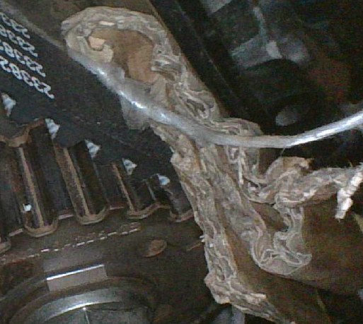

[<< back to main](index.md) 
EN 

# Introduction

Unfortunately, the workshop manual provides very little detail on this topic. However, everything is perfectly summarized in this forum post:

https://www.disco3.co.uk/forum/sdv6-timing-belt-fuel-pump-belt-replacement-123654-45.html

LR time Disco 3: https://www.youtube.com/watch?v=gL41G1o8nW4 (were the pump is not timed, but still the best video in the topic)

The major difference between the Disco 3 and the Range Rover Sport / Disco 4 is that in the Disco 3, the high-pressure fuel pump is not timed, whereas in the later models and onwards, it is. In the STD6 (Gen 2) engines, it is always timed, and it is referred to as the **rear timing belt** (READ).

This means:
- The position of the pump gear must be aligned with the camshaft pulley position—it is predetermined.
- To replace the belt, the **front timing belt must be perfectly timed**; otherwise, timing errors will be transferred to the rear belt.
- The **flywheel must be locked** during belt replacement, which requires the removal of the starter motor.
- Installing the rear timing belt requires a **special timing tool** to lock the fuel pump gear in place.

## Observations:
- The body **does not need to be removed**, and the **cross-wiring harness does not need to be disconnected** from the ECU. The battery also does not need to be removed.
- An **endoscopic camera is essential** for the job. Mirrors are not sufficient.

## Parts:
* https://www.autodoc.hu/ina/9885552
* **LR016656**: Belt, bolt + tensioner
* **LR006526** / FW9Q6K254AA: Tensioner
* **LANDCDI002**: Timing belt
* **LR000374**: Tensioner bolt

# Steps

## Timing Belt Cover Removal

Workshop manual: "Accessory Drive - TDV6 3.0L Diesel - Rear End Accessory Drive (**READ**)"

1. Disconnect the negative terminal from the battery.

2. Remove the **cross over EGR (metal) coolant pipe** by loosening all three clamps:
   

3. Free up the **right side of the ECU wiring harness** as much as possible:
    - Unplug the three **injector connectors** (they are under a foam cover). Label them before removal.
    - Also disconnect these brown and yellow connectors: 

4. Disconnect the **diesel input line** from the pump. If this is not done, there is no chance of removing the timing cover. No need to worry about any leaking diesel; only a small amount of fuel will drip out. Just place a rag around it.
5. Detach the **crankcase ventilation hose** from the oil separator. This hose runs tightly behind the timing belt cover; without disconnecting it, there is not enough space. Also disconnect the right cam case ventilation hose (A very thin black hose that also connects to the oil separator.)
6. Now, pull the ECU wiring harness all the way to the left as far as you can.
7. Remove all bolts from the **bracket mounted on the timing belt cover**, then remove the bracket: 
8. Once everything is dismantled, push the **crankcase ventilation tube** all the way back.
9. Open the **two clamps** on the cover and use a screwdriver to pry the cover off.
10. Rotate the **left side of the cover forward** for pulling it out. It barely fits out, its a real struggle. Be careful, as the small clamps may fall off while removing it.

## Locking the Flywheel

1. Remove the **starter motor** (see front timing belt instructions; the key is to fully unscrew the three-legged bracket at the front of the motor).
2. Remove the **air intake box** and the **fan**. The fan bolt must be turned **left to right** (clockwise if facing it), as it has a right-hand thread.
3. Rotate the **crankshaft pulley bolt** clockwise until the **rear timing belt pulley mark** is around 11 o'clock position (use the camera to check): 
   - The **flywheel rotates twice** for every **one full rotation of the camshaft pulley**.
   - If the flywheel locking hole is found while the camshaft pulley mark is at the bottom, rotate another full turn.
4. Lock the **flywheel** using the **three-step locking tool**: 
 (The kit also includes a two-step tool, which is likely for manual transmissions, but the three-step one is needed here.)

## Setting the Timing

1. Some say to cut the old belt, but due to the tight space, it’s almost impossible. Instead, we removed the **old tensioner** without damaging the bolt or thread.
2. Once the old tensioner is off, remove the belt.
3. Set the **fuel pump timing** using the special tool **before installing the new belt**: . You can turn the fuel pump gear by hand, not easy, but doable. 

> **NOTE:** Tie a **thin string** to the timing tool and the pin. This helps retrieve them if dropped into the engine bay. 

4. Remove the timing tool from the **fuel pump gear**.
5. Loosen the **three camshaft pulley bolts** slightly so the pulley can rotate.
6. Install the belt on the **pump gear first**, ensuring the marks line up (text should face you).
7. Insert a **piece of cardboard** between the belt and frame to hold it in place:  (Tie a string to the cardboard for easy removal.)
8. Install the belt on the **camshaft pulley**, aligning the marks. Since the pulley is loose, it will fit correctly without forcing it.  Insert another piece of cardboard to hold it in place.

## Installing the Tensioner

1. Cut the **head off the old tensioner bolt**.
2. Thread it into the **tensioner hole** a few turns: 
3. Push the **tensioner into place** through the old bolt, while guiding the belt. The tensioner tab should point downward at first, helping it slide into position. Then rotate it into place so the tab fits into the groove.
4. Hold the **tensioner firmly** and remove the temporary bolt.
5. Install the **new bolt** and tighten it to **23 Nm** (with a small 10-15 cm wrench should it be tightened firmly by hand). 
6. Install the **timing tool** on the fuel pump gear: 
7. Insert the **locking pin** into the timing tool.
8. Remove both cardboard pieces and verify that the **timing marks are correctly aligned**:
 
9. Pull the **pin from the tensioner**, which will properly tension the belt.
10. **Tighten the three camshaft pulley bolts** to **23 Nm**: 
11. Remove the **flywheel locking tool**.
12. Remove the **timing tool from the fuel pump gear**.
13. Rotate the **engine two full turns** to center the belt.
14. **Reassemble everything**.

