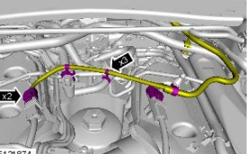

[<< back to main](index.md) 
EN 

# Bevezető

A workshop manual nagyon hiányosan fogalmaz a témában sajnos. Viszont van ebben a fórum leírásban tökéletesen össze van foglalva minden. 

https://www.disco3.co.uk/forum/sdv6-timing-belt-fuel-pump-belt-replacement-123654-45.html

LR time discoe 3: https://www.youtube.com/watch?v=gL41G1o8nW4

A nagy különbség a Disco 3 és a Range Rover Sport / Disco4 között, hogy a Disco 3-ban a magasnyomású üzemanyag pumpa nem időzített, míg az utóbbi típusokban és attól fölfelé igen, ugyanis az STD6 (gen 2) motorokban ez már mindig időzített, és rear timgig belt-enk hívják. 
Ez a következőt jelenti: 
- a pumpa fogaskerék pozíciója nem mindegy hogy áll a camshaft pulley pozíciójához képest, ez előre meg van határozva. 
- a szíj cseréjéhez az első timing belt időzítése tökéletes kell legyen, különben az időzítési hibát átvisszük a hátsó szíjra is. 
- a szíj cseréjéhez a flywheel-t lockolni kell, amihez ki kell szedni az önindítót 
- a rear timing belt felrakásához szükség van egy speciális időzítő szerszámra, amivel az üzemanyag pumpa fogaskerekét rögzítjük 

## Megállapítások:
- a cseréhez nem kell levenni a body-t, és a keresztbe menő kábelkötegeket sem kell kikötni a fedélzeti computerből, az aksit sem kell kivenni
- egy boroszkópos kamera elkerülhetetlen a munkához. 

## Alkatrészek: 
* https://www.autodoc.hu/ina/9885552
* **LR016656**: szíj, csavar + feszítő
* **LR006526** / FW9Q6K254AA: tensioner 
* **LANDCDI002**: timing belt
* **LR000374**: tensioner bolt
  

# Lépések

## Timing belt cover removal 

Workshop manual: "Accessory Drive - TDV6 3.0L Diesel - Rear End Accessory Drive (READ)"

1. Kössük ki az aksiból a negatívot
   

2. Vegyük ki az egér kereszt hűtő csövét, úgy hogy mind három bilincset kinyitjuk:
   

3. Az ECU-ból (Engine Control Unit) kijövő kábel köteg jobb végét fel kell szabadítani amennyire lehet: 
    - a három injector csatlakozót le kell húzni (ez a hővédő szivacs alatt van). Mielőtt kiszedjük, számozzuk be őket. 
    - ezt a barna és sárga csatlakozót is: 

4.  le kell kötni a diesel input csövet a pumpáról. Ha ezt nem tesszük meg nincs esély a cover kibányászására
5.  A cranck case ventillation tube-ot ki kell kötni az oil separator-bol. Ez a cső szorosan a timing belt cover mögött megy el, ha nem kötjük le, akkor nincs elég helyünk. 
6.  Most már a ECU kábel kötegét egész balra tudjuk húzni
7.  A timing belt cover-re szerelt bracke-töl minden csavart szedjünk ki és szedjük le: 
8.  Ha mindent lebontottunk, akkor a crank case ventilation csövet egész hátra tudjuk nyomni
9.  Nyissuk ki a cover két bilincsiét,és egy csavarhúzóval pattintsuk le a cover-t. 
10. A bal oldalát a covernek előre forgatva, szedjük ki. Épp hogy csak meg lehet csinálni. Közben vigyázzunk, hogy a kis bilincsek le ne essenek róla, mert ahogy kicibáljuk, tuti le fog esni legalább az egyik. 

## Locking the flywheel

1. Szedjük ki az önindítót (lásd front timging belt, a titka az, hogy az elején lévő három lábú keretet teljesen le kell róla csavarozni, akkor könnyen kijön )

2. Szereljük le az air intake boxot és a ventillátort. A ventilátor csavart balról jobbra kell csavarni, ha szembe állunk vele, mert jobb menetes. 
3. Kezdjük le a crank sheft pulley bolt-on forgatni a motort szintén balról jobbra, vagyis az óramutató járásával megegyező irányba addig, amíg a rear timing belt pulley-n a jel nem lesz 11 óra körül. (Ezt a kamerával kell figyelni) 
   - amig a flywheel kettőt megy körbe, addig a camsheft pulley csak 1-et. 
   - tehát ha egyszer megtaláljuk a flywheel-en a locking lukat, akkor az még lehet hogy nem elég, ha pont alsó pozícióban van a camshaft pulley-n a jel, akkor menni kell még egy kört. 
4. Lockoljuk a flywheelt (az az eszköz kell, ami dundibb, és három lépcsőből áll) 
 (a készletben van egy másik is, ami csak két lépcsős, azt hiszem az manuális váltóhoz való, de nekünk ez a három lépcsős kell)

## Set the timing

1. Azt mondják, hogy el kell vágni a régi szíjat. Szerintem ez majd hogy nem lehetetlen, olyan kicsi a hely, mi kiszedtük a régi tensioner-t, nem tetette tönkre a csavart se a menetet
2. miután lejött a régi tensioner, már le lehet szedni a szíjet. 
3. Mi ezután beállítottuk az üzemanyag pupma időzítését a speciáis eszközzel, úgy hogy a szíj nem volt rajta: . 

> **NOTE:** | Kössünk egy végony zsinort a timing tool-r és a hozzá tartozó pin-re is. Így ha beejtjük a motorba, könnyű kiszedni. 

4. Szedjük le a timing eszközt a pumpa fogaskerékröl
5. A 3 csavarját lazítsuk ki a camshaft pulley-nak, de csak épp hogy csak, úgy hogy pont lehessen mozgatni a tengelyen. 
6. A szíjon meg van jelölve a pupma és a pulley-n lévő jelölés helye. 
7. Tegyük fel a szíjat a pupma fogaskerékre, úgy hogy a jel a szíjon pont a fogaskerék jelére essen. A felirat a szíjon felénk nézzen. 
8. Egy kartonpapirt gyürjünk be a szíj és a keret közé, hogy inentöl kezdve a helyén tartsuk a szíjet a fogaskeréken:  (A kartonpapír a is kötöttünk zsinórt) Ehhez persze elengedhetetlen, hogy a kamerán nézzük, hogy mikor kerül a helyére. 
9. Tegyük a szíjat a pulley wheel-re is rá, úgy hogy a jelölés a helyére essen. Mivel a pulley wheel ki lett lazítva, van egy akkora játéka, hogy tuti nem kerül két fog közé. Itt az az elmélet, hogy mivel a régi szíj lehet megnyúlt, ezért lehet hogy pont nem jó helyre kerülne. . Ide is tömjünk be kartonpapírt, hogy már ez se tudjon lejönni. 
    

## Install the tensioner

1. A régi tensioner bolt fejét vágjuk le
2. Tekerjük be a tensioner lukjába, de csak épp hogy pár fordulatot. 
3. Huzzuk rá a tensioner-t úgy hogy a szíjat felnyomjuk. A tenisoner füle nézzen még lefelé. Ez a helyére vezeti a tensioner-t. Amúgy szinte lehetetlen lenne a helyére játszani. Majd csavarjuk felfelé, hogy a tensioner-en a kis fül pont a horonyba beüljün. Ezzel a tensioner pont a helyén van. 
4. Fogjuk erősen a tensioner-t a helyére, majd csavarjuk ki az átmeneti célzó csavart
5. Csavarjuk be az új csavart, és húzzuk meg 23 Nm-re, ami azt jelenit, hogy egy kis 10-15 cm hosszú csavaarkulcson ezt kb tisza erőből kell meghúzni (nyomatékkulcs nem fér be). 
6. Tegyük fel a timing tool-t a pupa fogaskerekére: 
7. Tegyük bele a lock pin-t
8. Szedjük ki a két kartonpapírt és újra ellenörizzük, hogy mind két jelölés a helyén van: 
    

9. Húzzuk ki a pin-t a tensioner-böl. Ez megfeszíti úgy a szíjat, hogy a pumpa nem tud elfordulni, mivel lockolva van. 
10. Húzzuk meg szintén 23 Nm -re a pulley három csavarját.. Vagyis egy kis kulcson tiszta erőből. 
11. Szedjük ki a flywheel lock pin-t. 
12. Vagyük le a timing tool-t a pumpa fogaskerékröl
13. Most tekerüjk körbe 2x a motort teljes fordulatra, hogy a szíj pont a helyére, középre kerüljün. 
14. Építsünk mindent vissza.

megint enm 