# Bevezető

> **WARNING:** A poliuretán bushing nem jó a disco 3, 4 és range rover l320-hoz, mert nincs külső acél burkuk, túl nagy erőt raknak így az arm gyűrűre, és ráadásul túl puhák: 
>  

Az LR times Christian azt mondja, hogy csak három márkát szabad venni: 
- MEYLE: https://www.autodoc.hu/meyle/9882769, 75.000 Ft
- LEMFÖRDER: https://www.autodoc.hu/lemforder/13787953,  11.3218 Ft

# Szerszámok
all Joint Separator Ball Head Puller/removal
- https://www.amazon.de/gp/product/B01519ZUOA?ie=UTF8&psc=1&linkCode=sl1&tag=lrtime-21&linkId=c06619e3327dddac504f4ce382fca8c9&language=en_GB&ref_=as_li_ss_tl
- https://www.autodoc.hu/kunzer/15205481

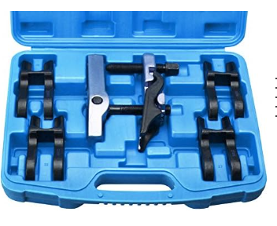 
<!--  -->

 

# Első felfüggesztés

https://landrover.oempartsonline.com/v-2011-land-rover-range-rover-sport--autobiography--5-0l-v8-gas/suspension--front-suspension

 
<!--  -->

 

## Front, lower suspension arms

### Removal

1. Tegyük az autót access height -ba.
2. Csak előre tegyünk rámpát, hátra ne. 
3. Álljunk fel a rámpára, és ha tudjuk engedjük ki a levegőt a légrugókból és a tartályból is az iCarsoft-al. 
4. Tegyünk a kerekek mögé ékeket, hogy ne tudjon hátra gurulni 
5. Húzzuk be a kéziféket !!! és ellenőrizzük, hogy a hátsó kerekek mögött van e ék!!!
6. Mindig csak egy kereket vegyünk le egyszerre, mind két oldalon ezt ne együk meg. 
7. Emeljük föl bőven annyira az autót, hogy legyen annyi lelógása a keréknek, hogy 'ride height'-ba tudjuk tenni. (462 mm). Tehát ennél magasabbra kell emelni azt az oldalt, amelyik kereket le akarjuk venni, mondjuk 480 mm-re. Az emeléssel párhuzamosan a bakot folyamatosan húzzuk felfelé már a helyén tartva. Mindig nagyon figyeljünk rá, hogy az emelő nem csúszik e le az alvázról. 
8. Lazítsuk ki a kerékcsavarokat
9. Egy kis emelővel emeljük fel a kereket pont annyira, hogy ride height-ba kerüljön, vagyis pont 462 mm-re legyen a kerékdobtól a kerék közepe. Ehhez egy 2x4-es állított pallót használjunk. 
10. Vegyük ki a rámpát a kerék alól, majd engedjük vissza a kereket. 
11. Vegyük le a kereket. 
12. Szedjük le a ball-join anyáját.
13. Ha nem akarjuk megtartani a ball-joint-tot, akkor a legjobb, ha levágjuk sarkok csiszolóval a wheel knuckle -ból lefelé kilógó részét, mert akkor klasszisokkal egyszerűbb lesz kiszedni. 
14. Szedjük ki az air-struts csavarját. Ez lehet hogy nagyon nehezen fog kimenni, ha túl sok levegő maradt a rendszerben. A szétszedésnek talán ez a legnehezebb része 
15. Jelöljük meg fehér jelölővel az alvázhoz rögzítő csavar és az anyákat is, és számozzuk őket be egytől négyig. Ezeket majd át kell jelölni az új csavarokra és anyákra.  
16. Szedjük ki az alvázhoz rögzítő csavarokat 
17. Forgassuk ki a lengőkart a helyről. Ha az air-struts-ba túl sok levegő van, akkor ki nagyon ki fog lógni elfelé és nehéz róla lemozgatni. 

### Installation

1. Ha nagyon kilóg az air-struts lefelé, akkor elsőként húzzuk rá a lengőkart
2. Tegyük be a ball-join csavarját, amit nagyon nehéz bejátszani. 
   * Ha nagyon nehezen megy be, akkor le kell belőle vágni egy picit felx-el
   *  van benne egy belső imbusz, ami a meghúzást segíti, de nem baj, ha az nem marad meg
   * úgy is meg lehet majd húzni, hogy megfeszítjük. Lényeg, hogy vágjuk le akkorára, hogy beférjen, mert van olyan márkájú ball-join, ami túl hosszú :( 

youtube: 
- https://www.youtube.com/watch?v=DbPh-lMqOII&t=1145s
- https://www.youtube.com/watch?v=3lGsfB4pyts&t=719s

### Csavarok
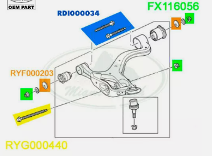
- HB2 -> alvázhoz erősítő csavar 2x: RDI000034
- HS1 -> légrugó befogó csavar 1x: RYG000440
- HN2 -> alvázhoz erősítő + légrugó anya 3x, M16:FX116056
- HN2 -> ball joint anya 1x, M16: FX116056 (LR079261)
- HW1 -> alvázhoz rögzítő alátét elől: RYF000203 
- HW2 -> alvázhoz rögzítő aláltét hátul: RYF000203

Készlet: 
- https://www.ebay.co.uk/itm/115604506564
- https://www.autodoc.hu/fai-autoparts/12117625
- https://www.autodoc.hu/bga/13595167

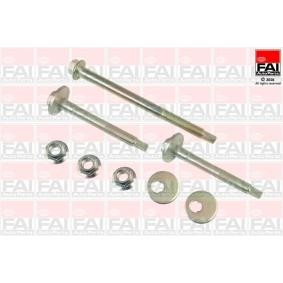 
<!--  -->

### Bushings
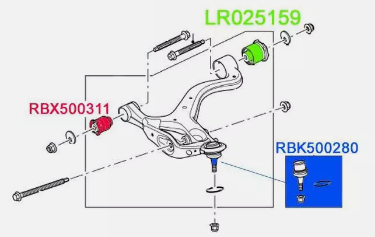
- 5A638 -> hátsó nagy bushing: LR055291
  - febi: https://www.autodoc.hu/febi-bilstein/7940443
  - meyle: https://www.autodoc.hu/meyle/9882701 
- 3068 -> első kicsi: LR055288
  - meyer: https://www.autodoc.hu/meyle/9882701
- 3050B -> ball joint: RBK500300
   - Meyer: https://www.autodoc.hu/meyle/7517662
   - Lemfölder: https://www.autodoc.hu/lemforder/1267753
   - ABS: https://www.autodoc.hu/abs/7802685

### Lengőkar 

> **WARNING**: | Több méretben van lengőkar a Rage Rover Sport-hoz, az évjárat nagyon fontos. Mindig ellenőrizzük le az OEM számot 

https://landrover.oempartsonline.com/oem-parts/land-rover-lower-control-arm-lr029301?c=bD01Jm49U2VhcmNoIFJlc3VsdHM%3D

- JOBB: OEM: LR029301
  - https://www.autodoc.hu/stark/8348007
- BAL: OEM LR029302
  - https://www.autodoc.hu/stark/8346532

  

Ezek a jó méretek

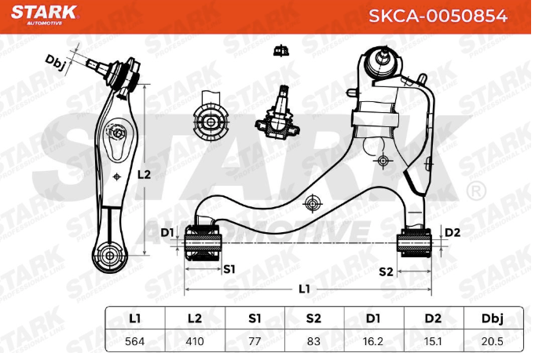

 

## Rods and hubs

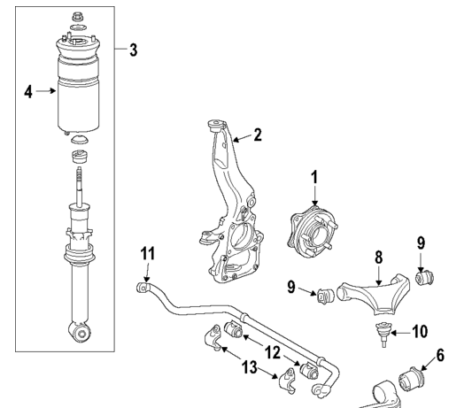

1. Hub & Bearing: LR076692
2. Knuckle, 
   - front left: RUB500330
   - Knuckle, front right: RUB500320
3. Shock Assembly: LR016415

.11. Stabilizer Bar: LR017423
12.  Stabilizer Bar Bushing: LR018347
13.  Bushing Bracket: RBU500042
7.  Stabilizer Link, left: RBM500150
8.  Stabilizer Link, righ: RBM500140
9.  Stabilizer Link Washer: RYF500120

 

## Felső lengőkar

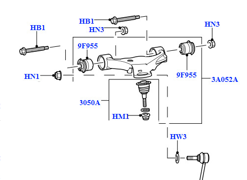 
<!--  -->

### Csavar:
- HB1 -> Csavar 2x alvázhoz, M14 X 80MM: RYG000420 
- HN3 -> Anya 2 x alvához: FY114056
- HM1 -> ball joint nut,  1 x: FY112056
- HN1 -> Anya 1x, 14 mmm: NY214047   

Készlet: 
- https://www.ebay.co.uk/itm/255829034949
- https://www.ebay.co.uk/itm/125613920148
- https://www.ebay.co.uk/itm/116389214336
- https://www.jgs4x4.co.uk/land-rover-discovery-3-4-range-rover-sport-rear-hub-upper-suspension-arm-to-hub-bush-bolt-ryg000384/

### Bushing:
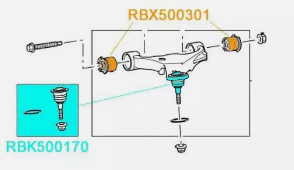
- 9F955 -> 2x: RBX500301, LR051625
  - lemförder: https://www.autodoc.hu/lemforder/1272462
- 3050A -> ball joint: RBK500170
  - meyle: https://www.autodoc.hu/meyle/8344206
  - febi: https://www.autodoc.hu/febi-bilstein/7618053
  - lemförder: https://www.autodoc.hu/lemforder/1267751

### Lengökar:

- Bal, első felső: LR063688
- Jobb, első felső: LR063711
  - febi: https://www.autodoc.hu/febi-bilstein/17401906
  - ABS: https://www.autodoc.hu/abs/8160021

 

## Steering Gear Linkage

* https://landrover.oempartsonline.com/v-2011-land-rover-range-rover-sport--autobiography--5-0l-v8-gas/steering--steering-gear-and-linkage
* Workshop manual: Steering Linkage - Tie Rod -> 674. oldal

### Alkatrészek
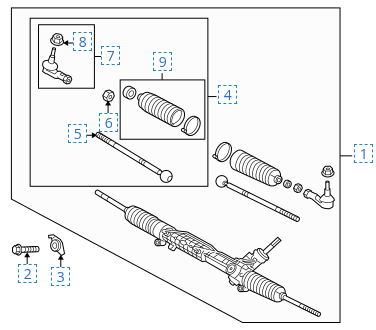

1. Inner Tie Rod: QFK500030
2. Inner Tie Rod Adjust Nut: QYH000021
3. Outer Tie Rod: LR010676
4. Outer Tie Rod Nut: QYH500160
5. Boot Kit: QFW500020

 

### Szerszámok

Az inner tie rod kormánymű felőli gömbfej kiszedéséhez egy speciális szerszám kell, amivel ki tudjuk tekerni és vissza tudjuk tekerni 100 Nm-re. 

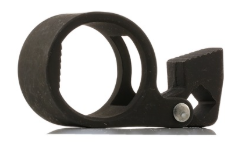

https://www.autodoc.hu/energy/13638402

Ehhez kell egy jó hosszú hosszabbító is, hogy a féktárcsán kívülre érjen a vége. 

 
 

A **locking nut** csavarásához egy 24mm-es crowfoot wrench kell, aminek magyarul számtalan neve van. 
* hollander kulcs
* kakasláb kulcs 
* ....

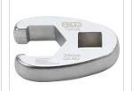

 

--------------------------------------------------------------------------------------

# Hátsó felfüggesztés

 

## Felső lengőkar

### Csavar

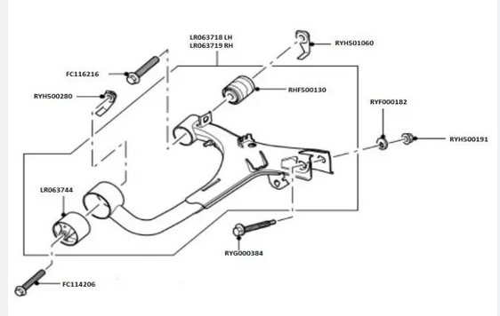 
<!--  -->
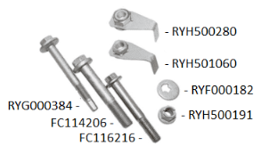

- HB2 → Alvázhoz rögzítő csavar, elől: FC114206
- HB5 → Alvázhoz rögzítő csavar, hátul: FC116216
- HB3 → top knuckle hub bolt: RYG000384
- HN1 → Alvázhoz rögzítő anya füllel, hátul: RYH501060
- HN2 → Alvázhoz rögzítő anya füllel, elöl: RYH500280
- HN3 → top knuckle hub nut : RYH500191
- HW1 → top knuckle hub nut washer: RYF000182

Készlet: https://www.ebay.co.uk/itm/316105477430 (megvéve)

### Bushings

- 9F955A -> hátsó 1x: RHF500130
  - lemfölder: https://www.autodoc.hu/lemforder/1272700
  - ABS: https://www.autodoc.hu/abs/9413711
- 9F955B -> első 1x: LR063744
  - meyle: https://www.autodoc.hu/meyle/13586487
  - febi: https://www.autodoc.hu/febi-bilstein/12827798

### Lengőkar
- bal felős lengőkar: LR063718
- jobb felső lengőkar: LR063719

 

## Alsó lengőkar

### Csavar
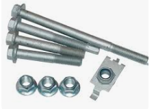
- HB1 -> légrugó csavar
- HB4 -> alváz csavar, elől, M16x160: KYG000240
- HB5 -> bottom knuckle bolt: FC116216
- HB6 -> alváz csavar, hátul, M16x155: KYG500270
- HN4 -> alvázhoz első anya, légrugó anya, bottom knuckle nut, 3x  M16: FX116056
- HN5 -> alvázhoz anya füllel, hátsó: RYH500052

Készet: https://www.ebay.co.uk/itm/225275179043

### Bushings
- 9F955C -> első: LR051611
   - febi: https://www.autodoc.hu/febi-bilstein/9804666
- 9F955D -> hátsó : LR054831
   - Mayle: https://www.autodoc.hu/meyle/13586488
   - Lemförder: https://www.autodoc.hu/lemforder/1272150

### Lengőkar
- Jobb: LR019977
- Bal: LR019978

 

 

## Rods and hubs

https://landrover.oempartsonline.com/v-2011-land-rover-range-rover-sport--autobiography--5-0l-v8-gas/suspension--rear-suspension

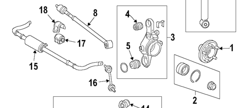

1. Rear Hub: RUC500120
2. Wheel Bearings: LR045917
3. Knuckle, left: LR045825
4. Knuckle, right: LR045824
5. Tie Rod Assembly: LR019117
6. Stabilizer Link: RGD500140, RGD000312
7. Stabilizer Bar Link Nut: FY110056
   * https://www.ebay.com/itm/404792972067
8. Tie Rod Assembly Bolt : RYG501580
    *  https://www.ebay.com/itm/376036370999
9. Tie Rod Assembly Nut RYH500116
    * https://www.ebay.com/itm/266263858825

### Csavarok
- HS1 -> anti-roll bar bushing mounting point bolt: 
- XXX -> anti-roll bar bushing mounting point nut: 
- HN6 -> stabilizer bar link connection point nut: 
- HN5 -> wheel hub retaining nut: 
- HC1 -> bushing seal / spacer washer:
- HC2 -> wheel bearing retaining ring:
- HC3 -> retaining clip:

### Bushings

- 5K792A ->  TOP KNUCKLE HUB BUSHING: RHF500100
   - febi: https://www.autodoc.hu/febi-bilstein/7623985
   - meyle: https://www.autodoc.hu/meyle/8119742
- 5k792B -> BOTTOM KNUCKLE HUB BUSHES: LR032644
   - meyle: https://www.autodoc.hu/meyle/16434965
   - febi: https://www.autodoc.hu/febi-bilstein/7697867
   - lemförder: https://www.autodoc.hu/lemforder/1266991

 

---------------------------------------------------------------------------------
# Beállítás
- youtube beállítás lift nélkül: https://www.youtube.com/watch?v=jrA24Rz0O6g

 

Workshop manual, chassis: 6. oldal
A kerekeknek be kell állítani a függőleges dőlési szögét, és a kerék össze ill. széttartását egymáshoz képest. A függőleges szög állítást hívják **camber**-nek, míg a kerekek széttartást hívják **toe**-nak. itt van toe-in és toe out. 

A workshop manual-ban 5 táblázat bal (LHD) és jobb (RHD) kormányos autókra, első és hátsó tengelyre és motor típusra. 
- első kerék: **Wheel Alignment Specification (All Markets) - Front LHD - Vehicles with 5.0L Naturally Aspirated and diesel vehicles without Dynamic Response**
- hátsó kerék: **Wheel Alignment Specification (All Markets) - Rear**
 

### Mit kell állítani
Minden keréken három dolgot kell állítani: 

- **Camber angel**: a kerék befele vagy kifele döl. 

 {width="400"}
<!--  -->

 

- **caster angle**: utánfutás, ami azt mondja meg, hogy a kerék a felső befogási pontjához képest menetirány szerint előre vagy hátra néz. Akkor tud a kerék magától egyenesbe állni, ha kicsit előre áll. 

 {width="400"}
<!--  -->

 

- **Toe angle**: a kerekek összetartása vagy széttartása. Ha menetirány szerint a kerék eleje széttart, az a negatív irány (toe out) és ha a kerék hátulja tart szét, vagyis a kerék eleje tart össze, az a toe-in, a positive irány. 

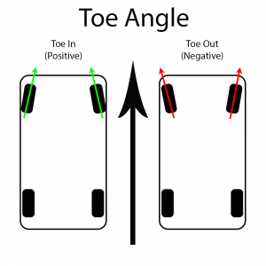 {width="300"}
<!--  -->

 

### Táblázatok értelmezése
Miden kerékre és mind a három típusra van egy ilyen táblázat: 

 
<!--  -->

- Minden értékre van érték a bal és a jobb kerékre menetirány szerint (left-hand, right-hand) és a kettő különbsége a 3. oszlopban (Total/Balance)
- Minden kerékre tehát meg van adva az első oszlopban felül az ideális érték: **Nominal**és mellette, hogy ez mennyit térhet el:**Tolerance**
- Minden kerékre meg van adva a minimum és a maximum dőlés, ami nem más mint a **Nominal**-bol kivonva és hozzáadva a tűrés. 

Példa:  

Nézzük meg az első kerekre vonatkozó **Camber** értéket. 
- a bal kerék 0.38˚-ban kell hogy befelé dőljön ideálisan. 
- ettől +-0.75˚-ban térhet el. Ebből következik a min-max érték
- max érték: -0.38+0.75 = 0.37°
- min érték: -0.38-0.75= -1.13°
- az utolsó oszlop mindig a bal és a jobb kerék különbsége, pl a nominális értékre: 0.38-0.5 = 0.12°

### Camber (függőleges, befelé dőlsé) 
Ehhez kell egy úgynevezett protractor eszköz: 
- PRO360 – PRO 360 Digital protractor: https://www.leveldevelopments.com/products/inclinometers/digital-inclinometers/pro360-pro-360-digital-protractor-range-360-resolution-0-1/

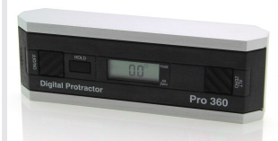 
<!--  -->

- https://www.ebay.com/itm/405365107182
- https://www.conrad.hu/hu/p/laserliner-masterlevel-box-081-260a-digitalis-vizmertek-magnessel-28-mm-3058922.html
- https://www.conrad.hu/hu/p/digitalis-vizmertek-1-mm-laserliner-digilevel-plus-25-081-249a-2445725.html
- https://www.elektrobot.hu/termek.php?filename=1635.html&i=1635
- https://hasznostermek.hu/P/19/hw300-digitalis-vizmertek

A kerék befelé kell dőljön: 

 
<!--  -->

Olyan mérő kell, amit ki lehet nullázni, így nem baj ha nem tökéletesen egyenes talajon van a kocsi. A földre leteszek egy öles lécet, ráteszem a mérőt, és kinullázom, majd utána rakom rá a kerékre, és akkor már levonja/hozzáadja a talaj lejtést. 
 

### Toe in/out

Minden kerék toe érték pozitív, vagyis így kell álljanak, a menetirány szerinti első rész áll össze: 

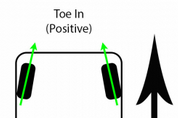 
<!--  -->

Vagyis mind két tengelyen toe in van
...

 

### Castor
 

 

 
