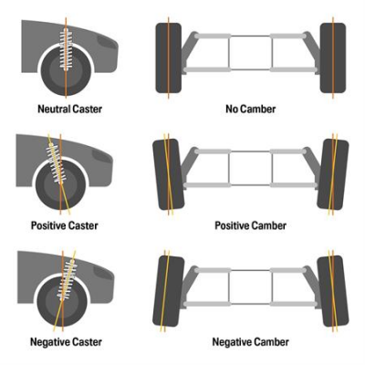
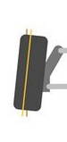

- [Bevezető](#bevezető)
- [Szerszámok](#szerszámok)
- [Első felfüggesztés](#első-felfüggesztés)
  - [Front, lower suspension arms](#front-lower-suspension-arms)
    - [Replacemnt procedudre](#replacemnt-procedudre)
      - [Removal](#removal)
      - [Installation](#installation)
    - [Csavarok](#csavarok)
    - [Bushings](#bushings)
    - [Lengőkar](#lengőkar)
  - [Rods and hubs](#rods-and-hubs)
  - [Felső lengőkar](#felső-lengőkar)
    - [Csavar:](#csavar)
    - [Bushing:](#bushing)
    - [Lengökar:](#lengökar)
  - [Steering Gear Linkage](#steering-gear-linkage)
    - [Alkatrészek](#alkatrészek)
    - [Szerszámok](#szerszámok-1)
- [Hátsó felfüggesztés](#hátsó-felfüggesztés)
  - [Felső lengőkar](#felső-lengőkar-1)
    - [Replacement procedure](#replacement-procedure)
      - [Removal](#removal-1)
      - [Installation](#installation-1)
    - [Csavar](#csavar-1)
    - [Bushings](#bushings-1)
    - [Lengőkar](#lengőkar-1)
  - [Alsó lengőkar](#alsó-lengőkar)
    - [Csavar](#csavar-2)
    - [Bushings](#bushings-2)
    - [Lengőkar](#lengőkar-2)
  - [Rods and hubs](#rods-and-hubs-1)
    - [Csavarok](#csavarok-1)
    - [Bushings](#bushings-3)
- [Beállítás](#beállítás)
    - [Mit kell állítani](#mit-kell-állítani)
    - [Táblázatok értelmezése](#táblázatok-értelmezése)
    - [Camber (függőleges, befelé dőlsé)](#camber-függőleges-befelé-dőlsé)
    - [Toe in/out](#toe-inout)
    - [Castor](#castor)

# Bevezető

> **WARNING:** A poliuretán bushing nem jó a disco 3, 4 és range rover l320-hoz, mert nincs külső acél burkuk, túl nagy erőt raknak így az arm gyűrűre, és ráadásul túl puhák

Az LR times Christian azt mondja, hogy csak három márkát szabad venni: 
- MEYLE: https://www.autodoc.hu/meyle/9882769, 75.000 Ft
- LEMFÖRDER: https://www.autodoc.hu/lemforder/13787953,  11.3218 Ft

# Szerszámok
all Joint Separator Ball Head Puller/removal
- https://www.amazon.de/gp/product/B01519ZUOA?ie=UTF8&psc=1&linkCode=sl1&tag=lrtime-21&linkId=c06619e3327dddac504f4ce382fca8c9&language=en_GB&ref_=as_li_ss_tl
- https://www.autodoc.hu/kunzer/15205481

 
<!--  -->

 

# Első felfüggesztés

https://landrover.oempartsonline.com/v-2011-land-rover-range-rover-sport--autobiography--5-0l-v8-gas/suspension--front-suspension

 
<!--  -->

 

## Front, lower suspension arms

### Replacemnt procedudre

>**Before you begin**: 
> * Mindig vegyünk új csavarokat
> * 24mm-es hosszított dugúkulcs kell 
> * Biztosan szükség lesz futómű állításra, mert minden lengökar egy picit más méretű. 
> * Legyen 24mm-es crowfoot spanner-ünk. 
> * Készüljünk fel rá, hogy a tie-rod mind két részét cserélni kell (ha be van rohadva) tehát ezeket előre vegyük meg. 
> * A tie-rod cseréhez legyen removal tool-unk, amivel a kormányműböl ki lehet tekerni
> * Legyen kék loctite a tie-rod visszarakásához 

>**WARNING**: A tie-rod lock nut nem metrikus, hanem finom menet, sima nut-al nem helyettesíthető. 

#### Removal

1. Tegyük az autót access height -ba.
2. Csak előre tegyünk rámpát, hátra ne. 
3. Álljunk fel a rámpára, és ha tudjuk engedjük ki a levegőt a légrugókból és a tartályból is az iCarsoft-al. 
4. Tegyünk a blue loctitehátsó kerekek mögé ékeket, hogy ne tudjon hátra gurulni 
5. Húzzuk be a kéziféket !!! és ellenőrizzük, hogy a hátsó kerekek mögött van e ék!!!
6. Mindig csak egy kereket vegyünk le egyszerre, mind két oldalon ezt ne együk meg. 
7. Emeljük föl bőven annyira az autót, hogy legyen annyi lelógása a keréknek, hogy 'ride height'-ba tudjuk tenni. (462 mm). Tehát ennél magasabbra kell emelni azt az oldalt, amelyik kereket le akarjuk venni, mondjuk 480 mm-re. Az emeléssel párhuzamosan a bakot folyamatosan húzzuk felfelé már a helyén tartva. Mindig nagyon figyeljünk rá, hogy az emelő nem csúszik e le az alvázról. 
8. Lazítsuk ki a kerékcsavarokat
9. Egy kis emelővel emeljük fel a kereket pont annyira, hogy ride height-ba kerüljön, vagyis pont 462 mm-re legyen a kerékdobtól a kerék közepe. Ehhez egy 2x4-es állított pallót használjunk. 
10. Vegyük ki a rámpát a kerék alól, majd engedjük vissza a kereket. 
11. Vegyük le a kereket. 
12. Szedjük le a ball-join anyáját.
13. Ha nem akarjuk megtartani a ball-joint-tot, akkor a legjobb, ha levágjuk sarokcsiszolóval a wheel knuckle -ból lefelé kilógó részét, mert akkor klasszisokkal egyszerűbb lesz kiszedni. 
14. Szedjük ki az air-strut csavarját. Ez lehet hogy nagyon nehezen fog kimenni, ha túl sok levegő maradt a rendszerben. A szétszedésnek talán ez a legnehezebb része 
15. Jelöljük meg fehér jelölővel az alvázhoz rögzítő csavar és az anyákat is, és számozzuk őket be egytől négyig. Ezeket majd át kell jelölni az új csavarokra és anyákra.  
16. Szedjük ki az alvázhoz rögzítő csavarokat 
17. Forgassuk ki a lengőkart a ball-joint-ból. Ha az air-strut-ba túl sok levegő van, akkor nagyon ki fog lógni elfelé és nehéz róla lemozgatni. 

#### Installation

>**WARNING**: Copper greast csak a csavarok perselyben lévő részére szabad tenni, a menetre nem. Nagy nyomatékra húzott csavarok esetén ez tilos. 
>**WARNING**: Mindenképpen tegyük copper greast minden csavar szárára !
>**WARNING**: Minden olyan bushing-ot ami gumi-fém kapcsolat, csak ride-height-ban szabad nyomatékra húzni. 

1. Ha nagyon kilóg az air-strut lefelé, akkor elsőként húzzuk rá a lengőkart
2. Tegyük be a ball-join csavarját, amit nagyon nehéz bejátszani. 
   * Ha nagyon nehezen megy be, akkor le kell belőle vágni egy picit felx-el (hasonlítsuk össze a régivel, ha hosszabb, le kell belőle vágni)
   *  van benne egy belső imbusz, ami a meghúzást segíti, de nem baj, ha az nem marad meg
   * úgy is meg lehet majd húzni, hogy megfeszítjük. Lényeg, hogy vágjuk le akkorára, hogy beférjen, mert van olyan márkájú ball-join, ami túl hosszú :( 
3. Tegyük be a lengökart az alvábhoz tartó fülekbe. 
4. Kenjük be jó alaposan "copper grease"-el a csavarok perselyben lévő részét. De a menetre SEMMI képpen se kenjünk !! A nagy nyomatékra húzott csavarok esetén nem szabad sosem a menetre tenni !! mert túlfeszítheti !!
5. Jelöljük át az új csavarokra a pozocítiót. 
6. Tegyük be az alváz csavarokat a helyére és lazán tekerjük rá az anyákat. Ne felejtsük el, hogy alátétet kell rakni az anya alá!
7. Tegyük be az air-strut csavarját. Ha kilóg lefelé, akkor: 
    * Tegyünk rá egy racsnis spanifert, és húzzuk a másik kerék felé. 
    * Az alvázon rengeteg lyuk van, ahova be lehet akasztani 
    * Egy emelővel emeljük a helyére. 
    * A spanifert pont annyira kell meghúzni, hogy pont akkor legyen a lyukhoz igazítva, amikor felér a helyére az emelés hatására, ezt több körben lehet csak kitapasztalni. 
8. Tegyük rá az air-strut anyáját, de azt se húzzuk meg. 
9. Emeljük egy emelővel a tengleyt ride-hight-ba. 
10. Húzzuk meg az air-strut csavarját nyomatékra. 
11. Állítsuk be nagyjából a pozíciót, 
12. Egy digitális protractor-al (szögmérővel) állítsuk be a manuálban előírt dőlést a kereken
    * A kocsi aljára nyomjunk fel egy vízmértéket
    * a vízmérték aljára tegyük rá a szögmérőt és nullázzuk ki
    * Tegyünk a féktárcsára egy fém derékszöget, és tegyük rá a szögmérőt
    * Addig állítgassuk az első csavart amíg nem lesz az előrt tartományon belül (a hátsó csavar az utánfutást állítja)
13. majd huzzuk nyomatékra az alváz csavarokat. 
     * A bal lengőkaron a hátsó csavart nem lehet nyomatékra húzni a kipuffogó dobtól. 
     * Elképzelhető hogy egy 24mm-es crowfoot spanner-el meg lehet húzni. 
14.   Lazítsuk ki a tie-rod lock-nut-ját, hogy felkészüjünk a kerék beállításra.  
    * A rudat nem kell hozzá megfogni villáskulcsal, a ball-join ütközésig el fog közben tekeredni, aztán megfeszül. 
    * Ehhez a legjobb ha egy 24mm-es crowfoot spanner-t használunk. (A megbeszítéshez feltételn kell majd)
    * Ha nem jön, akkor fákjázzuk meg és úgy próbáljuk. Ha úgy se jön, akkor sajnos le kell vágni és új tie-rod kell. 
    * Ha ki kell szedni a tie-rod outer részét, vagyis a ball-joint akkor abból is újat kell venni, mert nem fog visszamenni a helyére, ha már túl rozsás. 
15.  Tegyük fel a kereket, majd tegyük vissza alá a rámpát
16.  Vegyünk ki mindent az autó alól. Engedjük le az autót.   
17.  Végezzük el a futómű állítási procedurát. 
18.  Huzzuk meg a kerék anyákat 

>**WARNING**: Ne felejtsük el meghúzni nyomatékra a tie-rod lock nut-ot és a kerék csavarokat !!!!

youtube: 
- https://www.youtube.com/watch?v=DbPh-lMqOII&t=1145s
- https://www.youtube.com/watch?v=3lGsfB4pyts&t=719s

### Csavarok

- HB2 -> alvázhoz erősítő csavar 2x: RDI000034
- HS1 -> légrugó befogó csavar 1x: RYG000440
- HN2 -> alvázhoz erősítő + légrugó anya 3x, M16:FX116056
- HN2 -> ball joint anya 1x, M16: FX116056 (LR079261)
- HW1 -> alvázhoz rögzítő alátét elől: RYF000203 
- HW2 -> alvázhoz rögzítő aláltét hátul: RYF000203

Készlet: 
- https://www.ebay.co.uk/itm/115604506564
- https://www.autodoc.hu/fai-autoparts/12117625
- https://www.autodoc.hu/bga/13595167

 
<!--  -->

### Bushings

- 5A638 -> hátsó nagy bushing: LR055291
  - febi: https://www.autodoc.hu/febi-bilstein/7940443
  - meyle: https://www.autodoc.hu/meyle/9882701 
- 3068 -> első kicsi: LR055288
  - meyer: https://www.autodoc.hu/meyle/9882701
- 3050B -> ball joint: RBK500300
   - Meyer: https://www.autodoc.hu/meyle/7517662
   - Lemfölder: https://www.autodoc.hu/lemforder/1267753
   - ABS: https://www.autodoc.hu/abs/7802685

### Lengőkar 

> **WARNING**: | Több méretben van lengőkar a Rage Rover Sport-hoz, az évjárat nagyon fontos. Mindig ellenőrizzük le az OEM számot 

https://landrover.oempartsonline.com/oem-parts/land-rover-lower-control-arm-lr029301?c=bD01Jm49U2VhcmNoIFJlc3VsdHM%3D

- JOBB: OEM: LR029301
  - https://www.autodoc.hu/stark/8348007
- BAL: OEM LR029302
  - https://www.autodoc.hu/stark/8346532

  

Ezek a jó méretek

 

## Rods and hubs

1. Hub & Bearing: LR076692
2. Knuckle, 
   - front left: RUB500330
   - Knuckle, front right: RUB500320
3. Shock Assembly: LR016415

.11. Stabilizer Bar: LR017423
12.  Stabilizer Bar Bushing: LR018347
13.  Bushing Bracket: RBU500042
7.  Stabilizer Link, left: RBM500150
8.  Stabilizer Link, righ: RBM500140
9.  Stabilizer Link Washer: RYF500120

 

## Felső lengőkar

 
<!--  -->

### Csavar:
- HB1 -> Csavar 2x alvázhoz, M14 X 80MM: RYG000420 
- HN3 -> Anya 2 x alvához: FY114056
- HM1 -> ball joint nut,  1 x: FY112056
- HN1 -> Anya 1x, 14 mmm: NY214047   

Készlet: 
- https://www.ebay.co.uk/itm/255829034949
- https://www.ebay.co.uk/itm/125613920148
- https://www.ebay.co.uk/itm/116389214336
- https://www.jgs4x4.co.uk/land-rover-discovery-3-4-range-rover-sport-rear-hub-upper-suspension-arm-to-hub-bush-bolt-ryg000384/

### Bushing:

- 9F955 -> 2x: RBX500301, LR051625
  - lemförder: https://www.autodoc.hu/lemforder/1272462
- 3050A -> ball joint: RBK500170
  - meyle: https://www.autodoc.hu/meyle/8344206
  - febi: https://www.autodoc.hu/febi-bilstein/7618053
  - lemförder: https://www.autodoc.hu/lemforder/1267751

### Lengökar:

- Bal, első felső: LR063688
- Jobb, első felső: LR063711
  - febi: https://www.autodoc.hu/febi-bilstein/17401906
  - ABS: https://www.autodoc.hu/abs/8160021

 

## Steering Gear Linkage

* https://landrover.oempartsonline.com/v-2011-land-rover-range-rover-sport--autobiography--5-0l-v8-gas/steering--steering-gear-and-linkage
* Workshop manual: Steering Linkage - Tie Rod -> 674. oldal

### Alkatrészek

1. Inner Tie Rod: QFK500030
2. Inner Tie Rod Adjust Nut: QYH000021
3. Outer Tie Rod: LR010676
4. Outer Tie Rod Nut: QYH500160
5. Boot Kit: QFW500020

 

### Szerszámok

Az inner tie rod kormánymű felőli gömbfej kiszedéséhez egy speciális szerszám kell, amivel ki tudjuk tekerni és vissza tudjuk tekerni 100 Nm-re. 

https://www.autodoc.hu/energy/13638402

Ehhez kell egy jó hosszú hosszabbító is, hogy a féktárcsán kívülre érjen a vége. 

 
 

A **locking nut** csavarásához egy 24mm-es crowfoot wrench kell, aminek magyarul számtalan neve van. 
* hollander kulcs
* kakasláb kulcs 
* ....

 

--------------------------------------------------------------------------------------

# Hátsó felfüggesztés

 

## Felső lengőkar

### Replacement procedure

>**Before you begin**: 
> * Mindig vegyünk új csavar készletet
> * A wheel nockle perselyeket eséllyel szét kell vágni. A kiszedésükhöz speciális szerszám kell, ezek legyenek meg, meg az új perselyek is. 
> * Legyen 21mm-es crowfoot spanner-ünk az alváz csavarokhoz
> * Legyne 11mm-es crwofoot spanner-ünk a fékcső levételéhez
> * 24mm-es hosszított dugúkulcs kell 
> * Legyen 2db M10x1x10mm -es (vagyis 1 mm-es, finom emelkedésű csavar) amivel a fékcsöveket ledugozzuk a szerelés idejére. 
> * Kell szorító fogó, a fékcső átmeneti összeszorítására, amig ledugozzuk
> * Kell 2-4 szett orrfürszélap fémhez a csavarok esetleges kivágásához
> * Biztosan szükség lesz futómű állításra, mert minden lengökar egy picit más méretű. 
> * Legyen pót fékcső: a kemény szakasz . Ez nagyon gyakran elrohad és általában cserélni kell. 
> * Legyen új tie-rod és stabilizer link
> * Legyen kék loctite a tie-rod visszarakásához 
> * A művelet végén légteleníteni kell majd a fékrendszert. 

>**NOTE**: Ha a bushing belseje együtt forog a csavarral, ahogy a lengőkart, vagy a csavart forgatjuk, akkor az bele van rohadva, azt a bushingot ki kell vágni, tuti nem fog kijönni. Az ilyen bushing már nem tompít, mert le van szakadva a külső részről. 

#### Removal 
1. Szorítsuk el a fékcső felső részét egy szorító fogóval, hogy ne follyon ki sok fékfojadék
2. Csavarjuk ki a fékcsö két végét, a meglazítást a crowfoot spanner-el csináljuk. 
3. Dugozzuk le mind a két szabadon maradt részt az M10x1x10-es finom menetemelkedésű csavarral 
4. Szigetelő szalaggal ragassszuk le a kivett fékcső darab mind két végét, nehogy kosz menjen bele. 
5. Vegyük le a az abs és sebesség szenzorokat. 
6. Jelöljük meg a pozícióját a wheel knockle bushing bolt -nak és alátétenk. Ezek is állító csavarok, ezek állítják a bedölést.  
7. Vegyük le a kopás jelző, ABS és sebesség jelző vezetékeket (az egyik oldalon 3 van a másik oldalon 2)
8. Ha a wheel nocke bushing be van rohadva, azt is orrfürészel tudjuk kivágni. Nagyon vigyázzunk, hogy nehogy belevágjunk az alvázba vagy a lengőkarba. 

#### Installation 

### Csavar

 
<!--  -->

- HB2 → Alvázhoz rögzítő csavar, elől: FC114206
- HB5 → Alvázhoz rögzítő csavar, hátul: FC116216
- HB3 → top knuckle hub bolt: RYG000384
- HN1 → Alvázhoz rögzítő anya füllel, hátul: RYH501060
- HN2 → Alvázhoz rögzítő anya füllel, elöl: RYH500280
- HN3 → top knuckle hub nut : RYH500191
- HW1 → top knuckle hub nut washer: RYF000182

Készlet: https://www.ebay.co.uk/itm/316105477430 (megvéve)

### Bushings

- 9F955A -> hátsó 1x: RHF500130
  - lemfölder: https://www.autodoc.hu/lemforder/1272700
  - ABS: https://www.autodoc.hu/abs/9413711
- 9F955B -> első 1x: LR063744
  - meyle: https://www.autodoc.hu/meyle/13586487
  - febi: https://www.autodoc.hu/febi-bilstein/12827798

### Lengőkar
- bal felős lengőkar: LR063718
- jobb felső lengőkar: LR063719

 

## Alsó lengőkar

### Csavar

- HB1 -> légrugó csavar
- HB4 -> alváz csavar, elől, M16x160: KYG000240
- HB5 -> bottom knuckle bolt: FC116216
- HB6 -> alváz csavar, hátul, M16x155: KYG500270
- HN4 -> alvázhoz első anya, légrugó anya, bottom knuckle nut, 3x  M16: FX116056
- HN5 -> alvázhoz anya füllel, hátsó: RYH500052

Készet: https://www.ebay.co.uk/itm/225275179043

### Bushings
- 9F955C -> első: LR051611
   - febi: https://www.autodoc.hu/febi-bilstein/9804666
- 9F955D -> hátsó : LR054831
   - Mayle: https://www.autodoc.hu/meyle/13586488
   - Lemförder: https://www.autodoc.hu/lemforder/1272150

### Lengőkar
- Jobb: LR019977
- Bal: LR019978

 

 

## Rods and hubs

https://landrover.oempartsonline.com/v-2011-land-rover-range-rover-sport--autobiography--5-0l-v8-gas/suspension--rear-suspension

1. Rear Hub: RUC500120
2. Wheel Bearings: LR045917
3. Knuckle, left: LR045825
4. Knuckle, right: LR045824
5. Tie Rod Assembly: LR019117
6. Stabilizer Link: RGD500140, RGD000312
7. Stabilizer Bar Link Nut: FY110056
   * https://www.ebay.com/itm/404792972067
8. Tie Rod Assembly Bolt : RYG501580
    *  https://www.ebay.com/itm/376036370999
9. Tie Rod Assembly Nut RYH500116
    * https://www.ebay.com/itm/266263858825

### Csavarok
- HS1 -> anti-roll bar bushing mounting point bolt: 
- XXX -> anti-roll bar bushing mounting point nut: 
- HN6 -> stabilizer bar link connection point nut: 
- HN5 -> wheel hub retaining nut: 
- HC1 -> bushing seal / spacer washer:
- HC2 -> wheel bearing retaining ring:
- HC3 -> retaining clip:

### Bushings

- 5K792A ->  TOP KNUCKLE HUB BUSHING: RHF500100
   - febi: https://www.autodoc.hu/febi-bilstein/7623985
   - meyle: https://www.autodoc.hu/meyle/8119742
- 5k792B -> BOTTOM KNUCKLE HUB BUSHES: LR032644
   - meyle: https://www.autodoc.hu/meyle/16434965
   - febi: https://www.autodoc.hu/febi-bilstein/7697867
   - lemförder: https://www.autodoc.hu/lemforder/1266991

 

---------------------------------------------------------------------------------
# Beállítás
- youtube beállítás lift nélkül: https://www.youtube.com/watch?v=jrA24Rz0O6g

 

Workshop manual, chassis: 6. oldal
A kerekeknek be kell állítani a függőleges dőlési szögét, és a kerék össze ill. széttartását egymáshoz képest. A függőleges szög állítást hívják **camber**-nek, míg a kerekek széttartást hívják **toe**-nak. itt van toe-in és toe out. 

A workshop manual-ban 5 táblázat bal (LHD) és jobb (RHD) kormányos autókra, első és hátsó tengelyre és motor típusra. 
- első kerék: **Wheel Alignment Specification (All Markets) - Front LHD - Vehicles with 5.0L Naturally Aspirated and diesel vehicles without Dynamic Response**
- hátsó kerék: **Wheel Alignment Specification (All Markets) - Rear**
 

### Mit kell állítani
Minden keréken három dolgot kell állítani: 

- **Camber angel**: a kerék befele vagy kifele döl. 

 {width="400"}
<!--  -->

 

- **caster angle**: utánfutás, ami azt mondja meg, hogy a kerék a felső befogási pontjához képest menetirány szerint előre vagy hátra néz. Akkor tud a kerék magától egyenesbe állni, ha kicsit előre áll. 

 {width="400"}
<!--  -->

 

- **Toe angle**: a kerekek összetartása vagy széttartása. Ha menetirány szerint a kerék eleje széttart, az a negatív irány (toe out) és ha a kerék hátulja tart szét, vagyis a kerék eleje tart össze, az a toe-in, a positive irány. 

 {width="300"}
<!--  -->

 

### Táblázatok értelmezése
Miden kerékre és mind a három típusra van egy ilyen táblázat: 

 
<!--  -->

- Minden értékre van érték a bal és a jobb kerékre menetirány szerint (left-hand, right-hand) és a kettő különbsége a 3. oszlopban (Total/Balance)
- Minden kerékre tehát meg van adva az első oszlopban felül az ideális érték: **Nominal**és mellette, hogy ez mennyit térhet el:**Tolerance**
- Minden kerékre meg van adva a minimum és a maximum dőlés, ami nem más mint a **Nominal**-bol kivonva és hozzáadva a tűrés. 

Példa:  

Nézzük meg az első kerekre vonatkozó **Camber** értéket. 
- a bal kerék 0.38˚-ban kell hogy befelé dőljön ideálisan. 
- ettől +-0.75˚-ban térhet el. Ebből következik a min-max érték
- max érték: -0.38+0.75 = 0.37°
- min érték: -0.38-0.75= -1.13°
- az utolsó oszlop mindig a bal és a jobb kerék különbsége, pl a nominális értékre: 0.38-0.5 = 0.12°

### Camber (függőleges, befelé dőlsé) 
Ehhez kell egy úgynevezett protractor eszköz: 
- PRO360 – PRO 360 Digital protractor: https://www.leveldevelopments.com/products/inclinometers/digital-inclinometers/pro360-pro-360-digital-protractor-range-360-resolution-0-1/

 
<!--  -->

- https://www.ebay.com/itm/405365107182
- https://www.conrad.hu/hu/p/laserliner-masterlevel-box-081-260a-digitalis-vizmertek-magnessel-28-mm-3058922.html
- https://www.conrad.hu/hu/p/digitalis-vizmertek-1-mm-laserliner-digilevel-plus-25-081-249a-2445725.html
- https://www.elektrobot.hu/termek.php?filename=1635.html&i=1635
- https://hasznostermek.hu/P/19/hw300-digitalis-vizmertek

A kerék befelé kell dőljön: 

 
<!--  -->

Olyan mérő kell, amit ki lehet nullázni, így nem baj ha nem tökéletesen egyenes talajon van a kocsi. A földre leteszek egy öles lécet, ráteszem a mérőt, és kinullázom, majd utána rakom rá a kerékre, és akkor már levonja/hozzáadja a talaj lejtést. 
 

### Toe in/out

Minden kerék toe érték pozitív, vagyis így kell álljanak, a menetirány szerinti első rész áll össze: 

 
<!--  -->

Vagyis mind két tengelyen toe in van
...

 

### Castor
 

 

 
